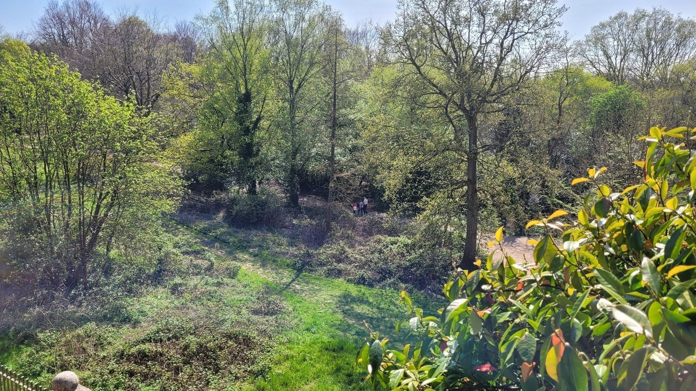
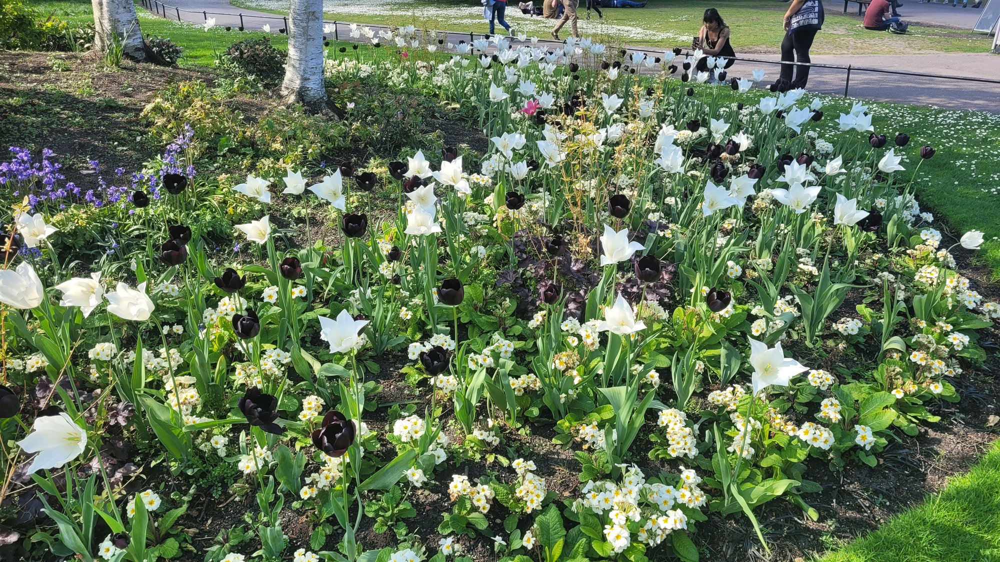
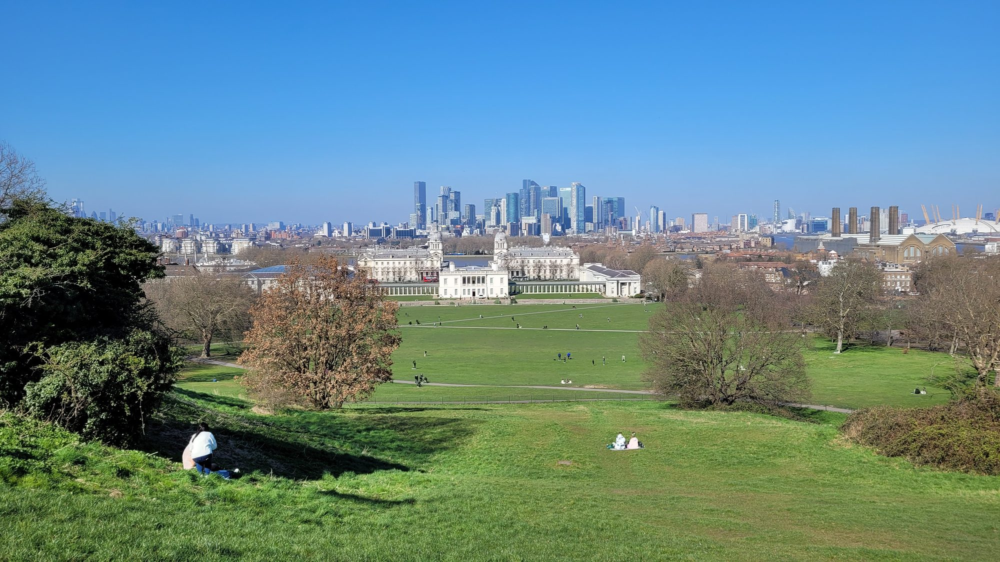
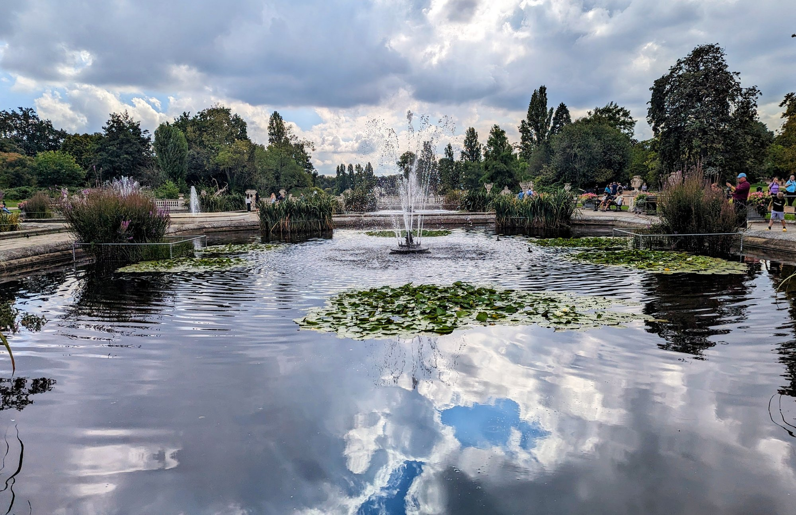
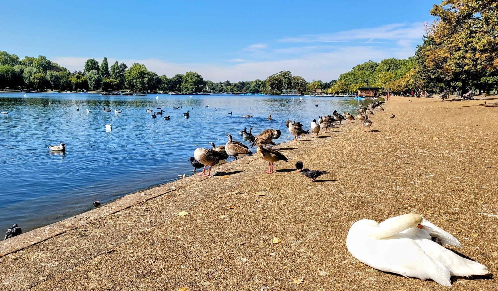
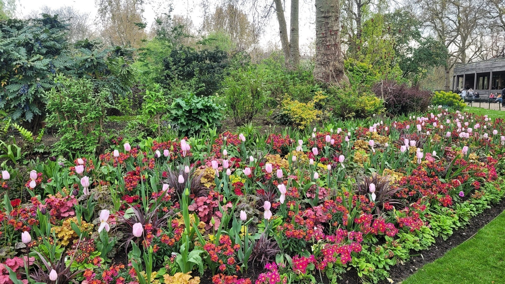
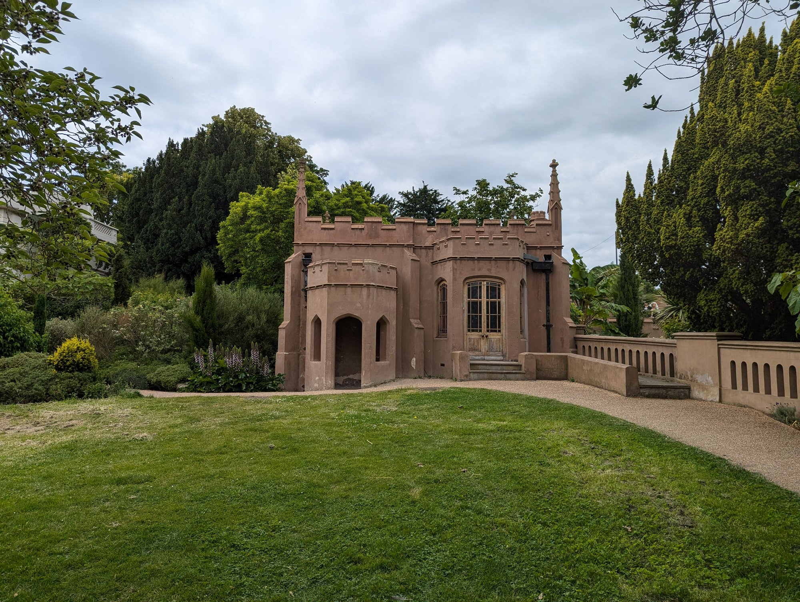
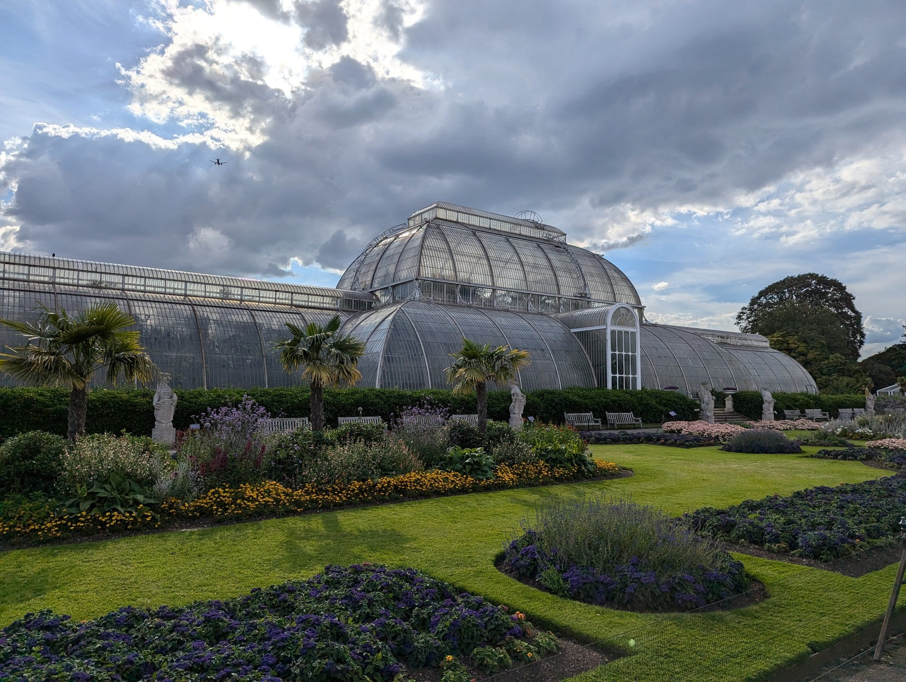
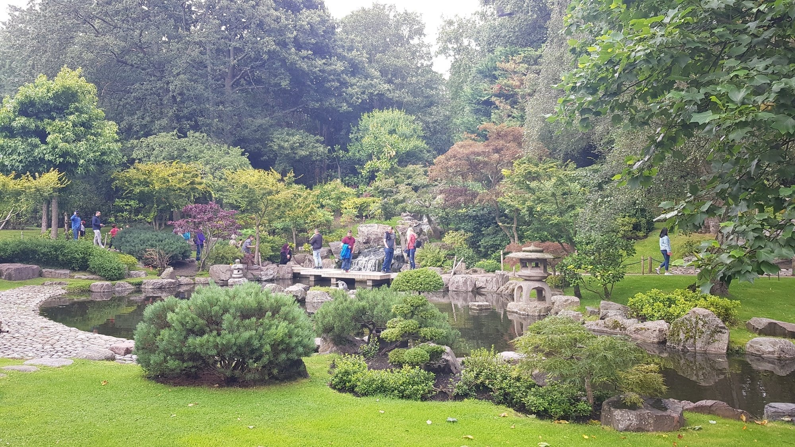

London is roughly 20 per cent green space, and the best of it is not the famous parks. It is a bombed Wren church filled with climbing plants, a tropical conservatory hidden inside a brutalist fly tower, and a set of dinosaur sculptures built in 1854 by people who had never seen a complete skeleton.

Almost all of it is free.

> 💡 **The Short Version:** **Richmond Park** for the deer and the scale. **Hampstead Heath** for swimming and the Parliament Hill view. **St Dunstan in the East** is the most atmospheric free thing in the City. **The Barbican Conservatory** is London's best-kept secret. And **the Crystal Palace Dinosaurs** are magnificently, confidently wrong.

> 📘 **How we choose these (editorial note)**
> No paid placements. These are drawn from a wide spread of sources rather than any single list - the food and travel press, the big listings sites, independent blogs and specialists, video, and what Londoners recommend themselves - and cross-referenced against each other. Admission is the parks' own and checked August 2026 — the Royal Parks and all council parks are free and always have been. Opening hours are seasonal for most gardens.

## Where they are

| If you are near… | Where to go |
| --- | --- |
| **The City** | St Dunstan in the East, Postman's Park, Barbican Conservatory |
| **Central** | Regent's Park, Hyde Park, St James's Park, Green Park |
| **Chelsea & Battersea** | Chelsea Physic Garden, Battersea Park |
| **Hampstead & north** | Hampstead Heath, Primrose Hill, Kenwood |
| **Richmond & west** | Richmond Park, Kew Gardens, Isabella Plantation, WWT London Wetland Centre, Gunnersbury Park |
| **East** | Victoria Park, Queen Elizabeth Olympic Park, Camley Street Natural Park |
| **South** | Crystal Palace Dinosaurs, Dulwich Park, Brockwell Park |

---

## The big ones

### Richmond Park

*Free · 2,500 acres · free-roaming deer*

The largest of the Royal Parks and the only one with **free-roaming red and fallow deer** — around 600 of them. The Isabella Plantation inside it is spectacular in May when the azaleas go.

> ⚠️ **Keep 50 metres from the deer**, especially in the September–November rut and the May–July birthing season. People are injured here every year.

### Hampstead Heath

*Free · swimming ponds*

Eight hundred acres of genuinely wild-feeling ground, with **three swimming ponds open year-round** — men's, women's and mixed — and the protected Parliament Hill view south over the City.

*The planting around the Hill Garden and Pergola spreads well beyond the walkway itself.*

### Regent's Park

*Free*

The best formal gardens in London, plus the Open Air Theatre, London Zoo and Primrose Hill at the north end for the skyline.

*The Outer Circle flowerbeds in late April — Queen Mary's Gardens further in have the bigger rose display, but this is the first colour of the year.*

### Battersea Park

*Free · 200 acres*

A boating lake, a children's zoo, a **Japanese Peace Pagoda** on the Thames path, and a bandstand. The most family-usable of the big parks.

---

### Greenwich Park

*Free · London's oldest enclosed royal park*

**183 acres and the oldest enclosed royal park in London**, rising steeply from the Old Royal Naval College to the Observatory on the hill — which gives it the best composed view in the city and, in The Wilderness, a wild deer herd.

The view from the General Wolfe statue is free and sits outside the ticketed Observatory, which is the thing most visitors get wrong.

*The view down the hill from near the Observatory — the Queen's House and Naval College below, Canary Wharf and the O2 beyond.*

### Kensington Gardens

*Free · beside Hyde Park*

Quieter and more formal than Hyde Park next door, and easy to treat as the same place when it is not. The **Italian Gardens** at the Lancaster Gate end, the Serpentine Galleries, the Albert Memorial, and Kensington Palace at the western edge.

*The Italian Gardens at the Lancaster Gate end — a Victorian water garden rather than anything actually Italian.*

*The Serpentine's shore, which straddles Hyde Park and Kensington Gardens.*

The Round Pond and the Diana Memorial Playground are the two things families come back for.

### St James's Park

*Free · the pelicans*

The oldest of the royal parks and the most central, running from Buckingham Palace to Horse Guards, with a lake full of waterfowl and **a resident colony of pelicans** first presented to Charles II by a Russian ambassador in 1664.

*The bedding along The Mall side of the park changes with the season - this is late April.*

The bridge over the lake gives the postcard view of Buckingham Palace one way and the Horse Guards rooftops the other.

### Crystal Palace Park

*Free · the Victorian dinosaurs*

Two hundred acres in south London built around the **Crystal Palace Dinosaurs** — thirty Victorian sculptures from 1854, the first attempt anywhere to model prehistoric animals at full size, and gloriously wrong about most of them.

The park is in transition after a long programme of works, and the restored **Crystal Palace Subway** opens to the public on occasional free days.

---

Powered by <a target="_blank" rel="sponsored" href="https://www.getyourguide.com/london-l57/">GetYourGuide</a>

## Small and strange

### Gunnersbury Park, Ealing/Hounslow

*Free*

A 186-acre former Rothschild estate, and most of it is given over to sports pitches and a boating lake rather than anything to linger in. **Head for the old pleasure gardens around the mansion and museum instead of the open parkland** — that is where the Rothschilds actually spent their money, and where the Gothic Ruins folly, an orangery and a walled kitchen garden survive.

*The Gothic Ruins, a Grade II listed folly built on the edge of what was once a Japanese garden. It is a five-minute walk from the mansion, not the sports fields.*

### St Dunstan in the East, City of London

*Free*

A **Wren church gutted in the Blitz and left as a shell**, now filled with climbing plants and trees growing through the windows. The most atmospheric free thing in the City, and almost always quiet.

### Postman's Park, City of London

*Free*

A wall of hand-painted ceramic tablets, each recording **an ordinary person who died saving someone else**. Quietly devastating and takes ten minutes.

### Barbican Conservatory, City of London

*Free on open days*

Over **1,500 species of tropical plants** and a pond of koi and terrapins, grown inside the concrete fly tower of the Barbican theatre. Open limited days — check before travelling.

### Crystal Palace Dinosaurs

*Free*

Built in **1854, the first dinosaur sculptures ever made anywhere**, before anyone knew what dinosaurs actually looked like. Grade I listed, and gloriously wrong.

### Camley Street Natural Park, King's Cross

*Free*

Two acres of wetland reserve with St Pancras behind it. **The contrast is the point.**

---

## Ticketed, and worth it

### Kew Gardens

*About £22 · a UNESCO World Heritage Site*

Three hundred acres of botanic garden with the Victorian Palm House, the Temperate House and a **treetop walkway eighteen metres up**. A genuine half-day, not an hour — it is far bigger than people expect.

*The Palm House, completed in 1848 to a design by Decimus Burton and Richard Turner - the largest glasshouse of its kind in the world when it was built.*

### Chelsea Physic Garden

*Ticketed*

Founded by the Apothecaries in **1673 to grow medicinal plants**, and still growing 5,000 of them behind a high wall on the Embankment.

### WWT London Wetland Centre, Barnes

*About £14.50*

**105 acres built on four disused Victorian reservoirs** — kingfishers, otters and rare wildfowl, twenty minutes from Hammersmith.

---

## Outdoor swimming

* **Hampstead Heath ponds** — three of them, open year-round, and genuinely cold in winter.
* **London Fields Lido** — a heated 50-metre outdoor pool, open all year.
* **Brockwell Lido** — a 1937 art deco lido in Herne Hill.
* **Serpentine Lido**, Hyde Park — summer only, in the middle of the park.

---

## Accidental wild places

* **Gunnersbury Triangle**, Chiswick — woodland that grew up **between three railway lines**, saved from development by a public inquiry.
* **Walthamstow Wetlands** — Europe's largest urban wetland reserve, and a working reservoir system.
* **Woodberry Wetlands**, Stoke Newington — reservoirs opened to the public in 2016 after 180 years closed.
* **Sydenham Hill Wood** — the last fragment of the Great North Wood.

---

## All free, with a few exceptions

**Almost every park in this guide is free and open every day**, which is the single best thing about London as a city to spend time in. Nearly half its surface area is green space, and it was designated the world's first National Park City in 2019.

**The exceptions worth knowing:**

* **Kew Gardens** is ticketed and the most expensive — but it is a botanical research institution rather than a park, and priced as one.
* **The Chelsea Physic Garden** and **the Garden Museum** both charge, both are small, and both are worth it.
* **Deer parks close at dusk** — Richmond and Bushy gates shut to vehicles earlier than to pedestrians.

**Free things people pay for elsewhere:**

* **The Kyoto Garden** in Holland Park, with the waterfall and the peacocks.

*A gift from the Chamber of Commerce of Kyoto in 1991. Free, and easy to miss inside the much larger Holland Park.*
* **Hampstead Heath's swimming ponds** — the mixed pond is free at quiet times, the single-sex ponds charge a small fee.
* **Sky-high views** from Primrose Hill, Parliament Hill and Alexandra Palace, all covered in our views guide, all free.
* **Deckchairs in the royal parks** are the one thing that catches people out — they are hired, not free, and the attendant will find you.

---

Powered by <a target="_blank" rel="sponsored" href="https://www.getyourguide.com/london-l57/">GetYourGuide</a>

## What to know

* **All eight Royal Parks are free** and open dawn to dusk. Gates close at nightfall and the times change monthly.
* **Richmond Park's deer are wild animals.** Keep well back, especially in autumn.
* **The Barbican Conservatory opens on limited days only** — usually Sundays and some bank holidays. Check first.
* **Kew is a half-day minimum** and cheaper booked online.
* **Isabella Plantation peaks in late April and May.** Outside that it is pleasant rather than remarkable.

---

## Continue planning your London trip

- 🎪 **[Free Things to Do in London](/free/)**
- 👀 **[The Best Views in London](/articles/best-views-london/)**
- 🏛️ **[The Best Museums in London](/articles/best-museums-london/)**
- 🦌 **[Richmond Area Guide](/articles/richmond-area-guide/)**
- 🌳 **[Hampstead Area Guide](/articles/hampstead-area-guide/)**
- 🏙️ **[City of London Area Guide](/articles/city-of-london-area-guide/)**
