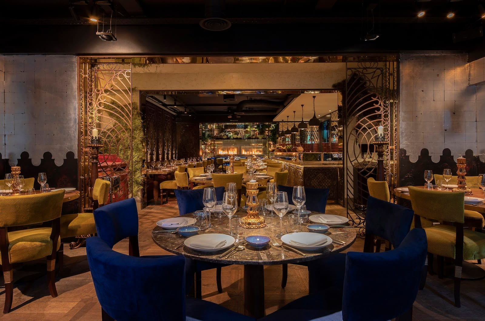
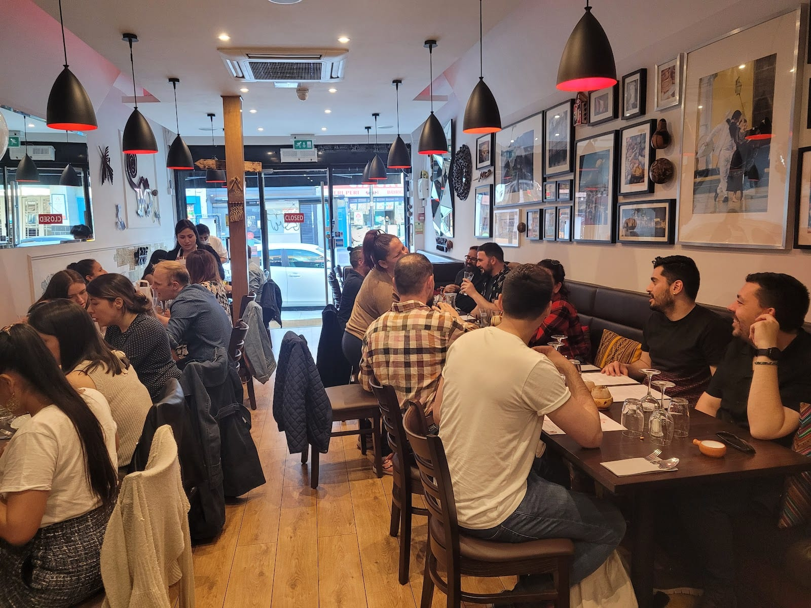
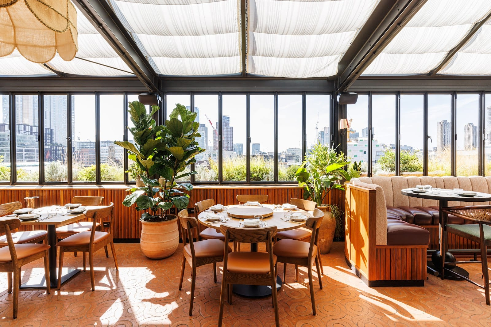
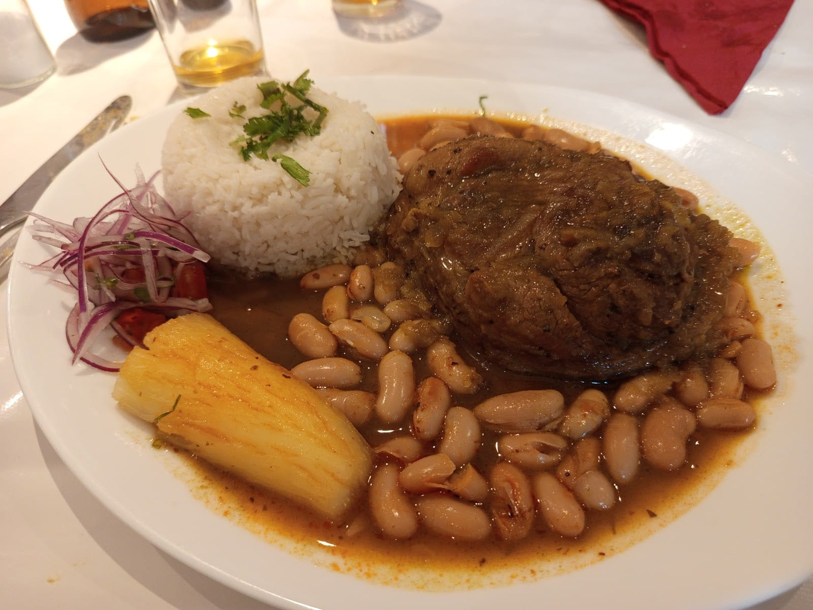
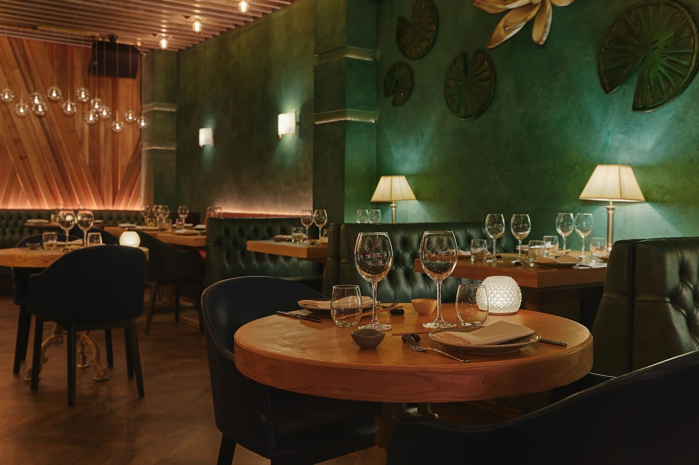
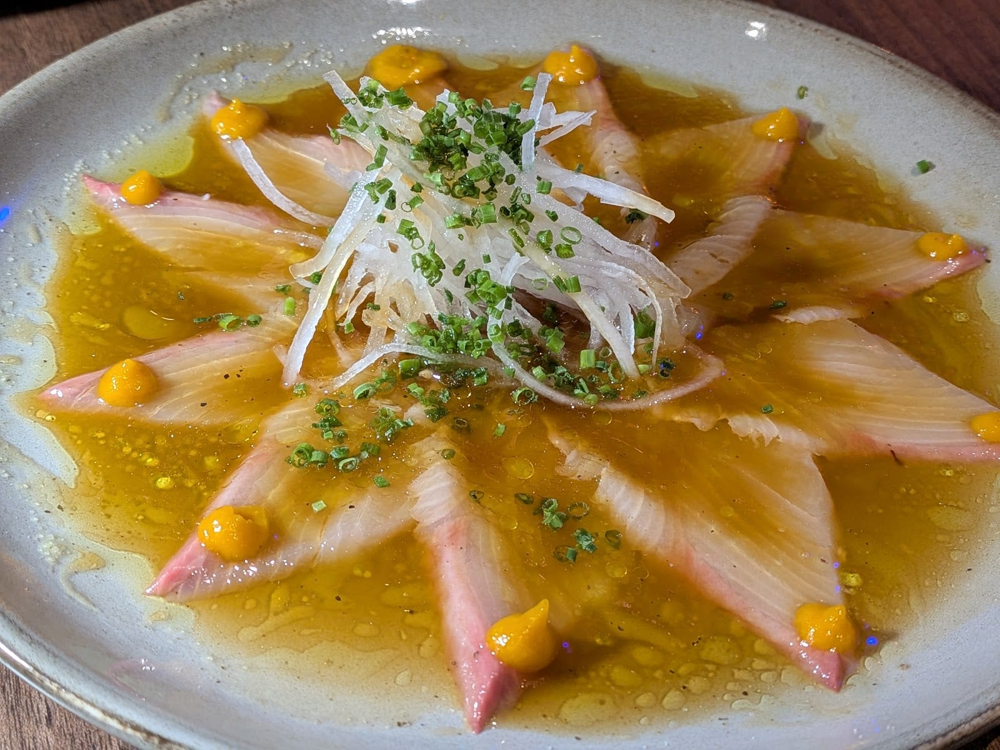
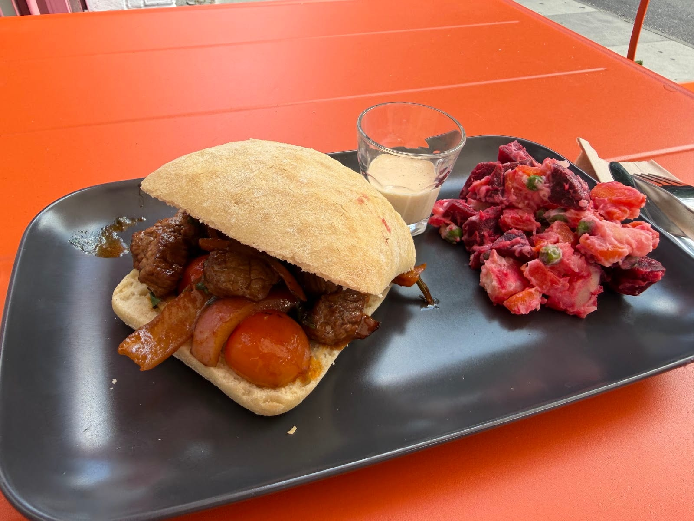
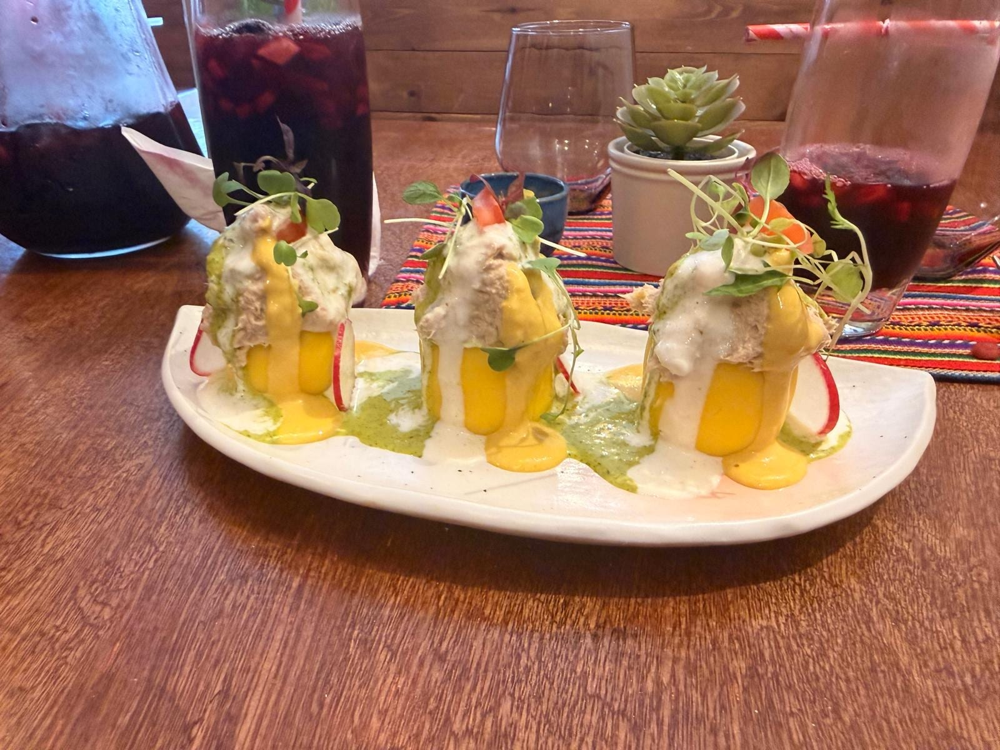
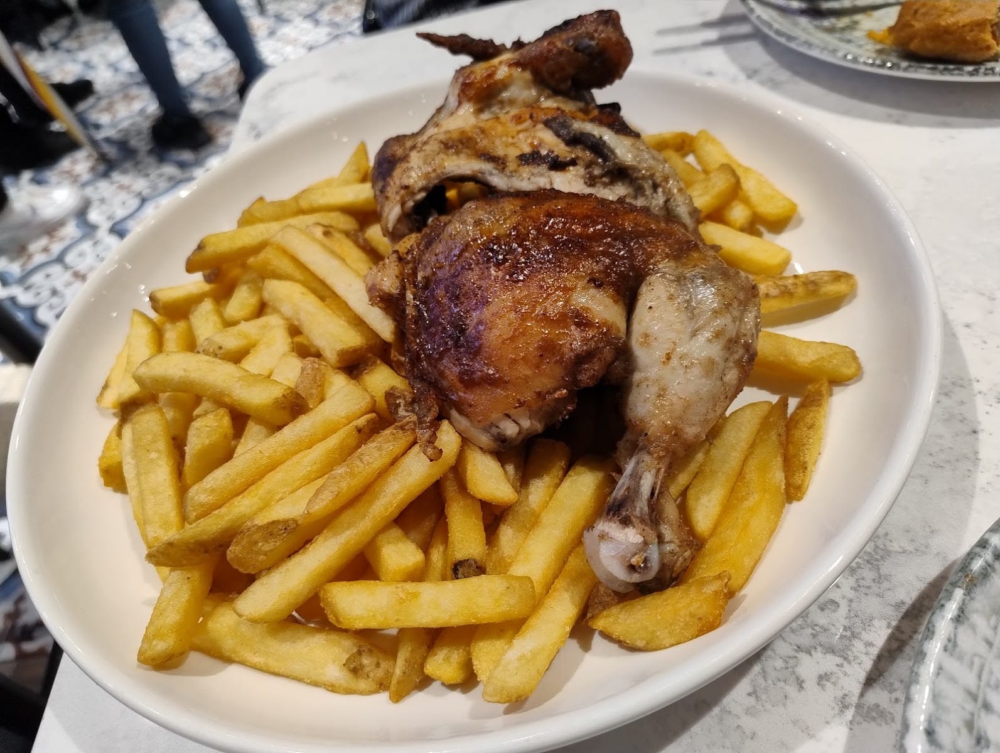
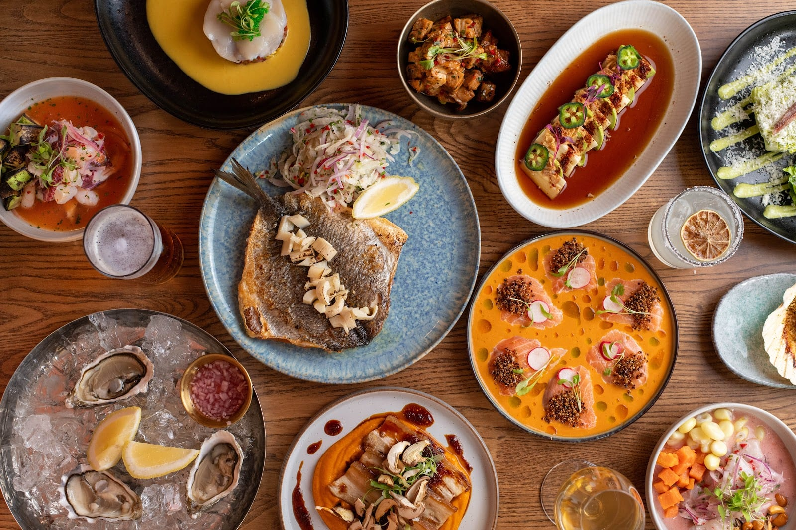

Peruvian cooking sells in London in three different forms, and almost every published guide piles them into one list and sorts by price.

There is **Nikkei** — the Japanese-Peruvian cooking that came out of Japanese migration to Peru, which is why a Notting Hill room can charge £120 for a menu built on raw fish. There is **criollo**, the stews, rice dishes and charcoal chicken that Peruvian families in Lambeth, Southwark and Elephant and Castle have eaten since the 1970s. And there is **ceviche and pisco as a bar format**, where the curing counter and the spirits list are the room rather than the menu. **This guide splits them**, because choosing between a Piccadilly ceviche counter and an Elephant and Castle cantina is not a choice within one category.

> 💡 **The Short Version:** **Lima** in Fitzrovia tops Time Out's ranked twenty and is the only Peruvian restaurant Greater London has ever starred. **Coya** is named by more sources than anything else here, and priced accordingly. **Tierra Peru** on Essex Road is the one Peruvian Londoners send you to. For Nikkei without the Mayfair bill, **Ayllu** in Paddington. For criollo, **Sabor Peruano** at Elephant and Castle. Under £20 a head: **Chan Chan** in Peckham's Rye Lane Market and **Lima Limón** in Brixton's Market Row.

> 📊 **The evidence behind this guide.**
> Nothing here rests on one visit. This pass reads **13 independent sources carrying 79 citations** across **29 named venues**, and **17 venues are named by two or more independent sources**. No Peruvian restaurant in London currently holds a Michelin star or a place in the National Restaurant Awards top 100: Lima's star ran from the 2014 guide to the 2018, and it is the only one Greater London has ever given Peruvian cooking.
> **Built on:** Harden's and the Michelin record, five editorial mastheads, three London blogs and three YouTube creators — counted per creator, so a channel's several videos are one voice.
> *Evidence built 22 September 2026 · [How we rank →](/how-we-rank/)*

## Where they are

| If you are near… | Where to eat |
| --- | --- |
| **Fitzrovia & Soho** | Lima, Señor Ceviche, Chotto Matte |
| **Mayfair & Piccadilly** | Coya |
| **Covent Garden & Seven Dials** | Crudo, Monmouth Kitchen |
| **Shoreditch & Hoxton** | Llama Inn, Lima Shoreditch, Darkest Peru |
| **Islington & Angel** | Tierra Peru, Mr LoBo |
| **Hackney & Broadway Market** | Chakana |
| **Dalston** | Piscos Dalston |
| **Paddington** | Ayllu |
| **Notting Hill** | Fan |
| **The City** | Coya Angel Court, Sushisamba |
| **Elephant & Castle** | Sabor Peruano |
| **Brixton & Oval** | Maka, Lima Limón |
| **Peckham** | Chan Chan |
| **Greenwich** | El Alquimista |
| **Hammersmith & Fulham** | Jarana |
| **Stratford** | Bamboo Mat |

**Price guide:** **£** under £20 a head · **££** £20–£40 · **£££** £40–£80 · **££££** £80+.

---

## The winners

Three sources crown three different restaurants, and the disagreement is the clearest thing in the data. **Time Out's ranked twenty puts Lima first**; **Coya is named by more independent sources than anything else on this page, seven of thirteen**; and the only Peruvian voice in the set — a Peruvian cook who runs her own buffets in London — goes to **Tierra Peru**, an Islington dining room that started as a Camden market stall. They are not competing for the same evening. Lima is a tasting-menu room, Coya is a night out, Tierra Peru is a Wednesday.

### Lima, Fitzrovia — the only Peruvian restaurant London has starred

*£££ · 31 Rathbone Place, W1T 1JH · #1 of 20, Time Out · Cited by 6 sources · [the restaurant's site](https://www.limalondon.com/fitzrovia)*

**The only Peruvian restaurant Greater London has ever starred**, holding one from the 2014 Michelin guide to the 2018. It does not hold one now, and the kitchen it has today is not the one that won it: head chef **Diego Recarte** runs a menu rebuilt around the Japanese and Cantonese strands in Peruvian cooking rather than the Andean and Amazonian showpieces the restaurant made its name on.

Order the **stone bass ceviche** — the fish cured in leche de tigre, the cloudy lime-and-chilli marinade that has no milk in it despite the name — and the **Ikejime trout sashimi with strawberry ponzu**. The room is high and skylit, with a fringed canopy over the glass and pendulum lamps, and it is quieter than anything else in the top half of this guide.

**Closed Sundays. The £27 lunch is the value here**: two courses noon to 3pm on weekdays, with pisco sours at £5. A second site opened on Sun Street in Shoreditch and runs the same menu with a busier bar.

### Coya, Mayfair and the City — named by seven of the thirteen sources

*££££ · 118 Piccadilly, W1J 7NW · #18 of 20, Time Out · Cited by 7 sources · [the restaurant's site](https://coyarestaurant.com/coya-mayfair/)*

**Named by seven of the thirteen independent sources in this pass, more than any other Peruvian restaurant in London** — and the one where the least of the bill is about the cooking. Two floors, three open kitchens, teal and gold, and a pisco lounge; Harden's readers call it a "great place for something different" and then note the meal "came at an excessive price".

*At ££££ the bill starts around £80 a head, the top band on this page.*

The food is better than the room's reputation suggests when you order Peruvian rather than around it: the **signature ceviche platter** runs sea bass, corvina, yellowtail and tuna, each cured differently, and the **anticuchos** — charcoal skewers, here beef fillet with ají panca — are the thing to have with a pisco sour. Skip the burrata.

**Open until 1am, and it books weeks ahead at weekends.** The City site at Angel Court, behind the Bank of England, is the same menu with fewer tourists and more bankers.

### Tierra Peru, Islington — what Peruvian Londoners actually eat

*££ · 164 Essex Road, N1 8LY · #4 of 20, Time Out · Cited by 6 sources · [the restaurant's site](https://www.tierraperu.co.uk/)*

A **Camden market stall that became a restaurant**, run by two brothers with portraits from home on the walls and the national team on the television above the bar. Six sources name it, including the only Peruvian voice in this pass: Cecilia Tupac, a Peruvian cook based in London, filmed a visit in August 2026 and called it the best Peruvian restaurant in the city, "not just me saying so but a lot of Peruvians".

*It fills like this on a weeknight, and there is no online booking — the table comes by telephone.*

The menu runs straight down the middle of the cuisine rather than picking a lane: **ceviche and shots of leche de tigre**, **ají de gallina** — shredded chicken in a creamy yellow chilli sauce over rice — **lomo saltado**, **arroz chaufa**, and **alfajores** filled with dulce de leche. The chef's picks are cordero huanuqueño, lamb rubbed in the Andean herb huacatay, and picante chalaco, a spicy seafood stew. Inca Kola and chicha morada, the purple-corn drink, are both on.

**It is loud and full on a Tuesday, and bookings are by phone: 020 7354 5586.** Open from 5pm Monday to Wednesday.

---

## Also strongly backed

### Llama Inn, Shoreditch — Peruvian via Brooklyn, on a rooftop

*£££ · The Hoxton, 1 Willow Street, EC2A 4BH · #2 of 20, Time Out · Cited by 5 sources · [book a table](https://www.llamainnlondon.com/reservations)*

The London branch of a **Brooklyn restaurant that opened in 2015**, reached through a yellow door on a back street and a service lift to the roof of The Hoxton. Glass-covered, plant-heavy and full of people photographing the drinks.

*Glass overhead, so the roof works in February as well as August. The two-course Speedy Lunch at £28 is the cheap way in.*

The cooking leans **Chifa** — the Cantonese-Peruvian strand — with Nikkei on the edges: **sea bass ceviche in leche de tigre**, cabbage anticuchos glazed in saikyo miso, crispy squid with yuca. The **lomo saltado** is the one to argue about: instead of rice, the beef and chips land on an okonomiyaki-style pancake with a zigzag of kewpie mayonnaise. It is £56 and it is the most interesting plate in this half of the guide.

**Closed Sundays. Monday lunch is £1 oysters**, and the two-course Speedy Lunch at £28 is the only way to eat here without passing three figures with drinks.

### Señor Ceviche, Soho — ceviche at £11 to £13, in Kingly Court

*££ · Kingly Court, Carnaby, W1B 5PW · #7 of 20, Time Out · Cited by 4 sources · [book a table](https://www.sevenrooms.com/reservations/senorceviche)*

Grew out of **Don Ceviche, a pop-up run by chef Harry Edmeades**, and now occupies a bright first-floor corner of Kingly Court with an open kitchen and a ceviche counter you can watch.

*The card on the table is the Monday deal. The three foamed glasses are pisco sours: grape brandy, lime, sugar, egg white and a few drops of bitters.*

Ceviches are £11 to £13 — **sea bream in tiger's milk**, salmon tiradito with piquillo peppers — and the Peruvian barbecue plates run £12 to £19: **pachamanca pork ribs**, beef heart anticuchos with anticuchera salsa, **tequeños**, which are wonton wrappers fried around chicken and caramelised onion. Chocolate mousse with cancha, the toasted corn kernels, for pudding.

**Go on a Monday: any ceviche and any pisco sour, £6 each.** The weekend bottomless brunch is £39 and the room gets very loud with it.

### Chotto Matte, Soho — Nikkei at scale

*£££ · 11–13 Frith Street, W1D 4RB · #19 of 20, Time Out · Cited by 3 sources · [book a table](https://www.sevenrooms.com/reservations/chottomattelondon)*

An international group with six sites, and the room that taught central London the word Nikkei. Black-and-white floors, murals, purple seating, and salsa dancing on Thursdays — closer to a bar with a very good raw section than to a restaurant.

Order the **sea bass ceviche**, the **black cod with ají miso** — the Peruvian chilli paste standing in for the usual sweet miso — and the yellowtail with yuzu truffle soy. **Unlimited Nikkei starters and sushi run weekdays noon to 5pm**, and Chotto hour, 3pm to 7pm daily except Saturday, is discounted cocktails and small plates.

**Open until 1am every day**, which makes it the default late Peruvian room in Soho.

### Sabor Peruano, Elephant and Castle — the criollo benchmark

*££ · 103 Newington Butts, SE1 6SF · #14 of 20, Time Out · Cited by 3 sources*

Three sources name it and none of them calls it fashionable, which is the point. The Infatuation's line is the best description anyone has written of it: **"Outside it's a canteen, but inside it gives 1960s banquet wedding"** — white tablecloths, Peruvian owners, no interest whatsoever in what Soho is doing.

*Criollo cooking plates like this: slow-cooked beef in a dark coriander-and-chilli sauce, canary beans, white rice and a length of boiled cassava. Mains £12 to £22.*

The menu is **Chifa-heavy**: **arroz chaufa**, Peruvian fried rice with beef, egg, spring onion, beansprouts and — properly — diced hot dog; **lomo saltado** with tomato, onion, chips and white rice; **mazamorra morada**, a thick purple-corn pudding with pineapple, apple and cinnamon, for afterwards. Starters and ceviches £3 to £8, mains £12 to £22.

**Closed Mondays, and it shuts at 9pm Tuesday to Saturday and 7.30pm on Sunday** — early enough that it is a proper dinner and still an evening at home.

### Sushisamba, the City and Covent Garden — Peruvian as one of three passports

*££££ · Heron Tower, 110 Bishopsgate, EC2N 4AY · #20 of 20, Time Out · Cited by 3 sources · [the restaurant's site](https://www.sushisamba.com/locations/london-heron-tower)*

Japanese, Brazilian and Peruvian on one menu, at the top of Heron Tower with an orange tree growing through the open-air terrace. Time Out's verdict is fair: not the most authentic, "a hell of a lot of fun".

The Peruvian half is worth ordering deliberately rather than letting the sushi carry the table: **octopus and chorizo anticuchos over choclo**, the big-kernelled Andean corn, and **crisp plantain with ají amarillo sauce**. Harden's readers rate the food and object to the price and the pace — "they churn out huge numbers of covers".

**Ask for a terrace table when you book**, and read our [Japanese restaurants guide](/articles/best-japanese-restaurants-london/) if the sushi side is what you are actually after. A ground-floor Covent Garden site has the food without the view.

### Chakana, Hackney — the chef who won Lima its star

*£££ · 41 Broadway Market, E8 4PH · #13 of 20, Time Out · Cited by 2 sources · [book a table](https://chakana-restaurant.co.uk/booking)*

Named for the Andean cross and built on Peru's two flagship crops, corn and potatoes. The kitchen is run by **Robert Ortiz, the chef who won Lima its Michelin star** — which makes this the closest thing London has to that starred kitchen still cooking, in a Broadway Market shopfront rather than a Fitzrovia dining room.

Order the **crab causa**, white crab meat over chilled yellow potato with rocoto pepper and avocado, and finish with the **lúcuma tiramisu** — lúcuma being the caramel-tasting Andean fruit Peru puts in everything sweet. Sharing plates £8 to £14, mains £18 to £24. On Sundays the kitchen serves a Peruvian roast: Yorkshire puddings alongside lomo saltado.

**Closed Mondays, and dinner only until Saturday.** Saturday, when the market is running, is the right time and the hardest table.

---

## Nikkei: the Japanese-Peruvian counters

Nikkei is not fusion invented for a menu. Japanese families moved to Peru for plantation work from the 1890s, and their descendants cooked Peruvian ingredients with Japanese knife work. What arrives is sashimi dressed in lime, chilli and ají amarillo instead of soy, and a **tiradito** — fish sliced like sashimi, sauced like ceviche — sitting on the menu beside nigiri.

### Ayllu, Paddington — Nikkei without the Mayfair bill

*£££ · 25 Sheldon Square, W2 6EY · #6 of 20, Time Out · Cited by 2 sources · [book a table](https://www.ayllu.co.uk/book)*

Jade-green walls with a water-lily motif, cushioned booths and low light, in the canalside office estate behind Paddington station — an unlikely address for a kitchen doing this much with raw fish.

*An ayllu is the Andean kin group, the extended-family unit a village organises itself around.*

The raw half is the reason to come: **oysters with truffle and leche de tigre**, **tuna tataki tiradito**, and the lubina clásica, a sea bass ceviche. Away from the fish there is sweet potato katsu curry with kimchi, bao buns, and a Peruvian steak with black lime butter and crisp garlic. Tasting menus £45 to £59.

**Open late every night — midnight on Fridays and Saturdays** — and the weekend samba brunch is the busiest service of the week, so book away from it if you want to hear anyone.

### Bamboo Mat, Stratford — all Nikkei, no hedging

*£££ · 21–24 Victory Parade, East Village, E20 1FS · #15 of 20, Time Out · Cited by 2 sources · [the restaurant's site](https://bamboo-mat.co.uk/)*

Opened in Leyton, moved to a bigger East Village room in 2023, and is **built entirely on Nikkei** — no separate Japanese or Peruvian menu running alongside it. Sleek, minimal, lit blue, with an open kitchen you can watch plate ceviche and maki at the same pass.

*Tiradito is sliced like sashimi and sauced like ceviche — dressed at the pass rather than cured beforehand, which is why it stays translucent. This one is hamachi under ají amarillo and lime.*

The order is the **hamachi tiradito** to start and the **sashimi platter for two** — sea bass, salmon, tuna, octopus and pine prawns with shiso ponzu and salsa huacatay, the Andean-herb sauce that makes it Peruvian rather than Japanese. Lunch specials £13 to £15, tasting menus £36 to £64.

**Open daily, noon to 10pm**, which among the Nikkei rooms makes it the easy one — five minutes from Stratford station, and no closed days to plan around.

### Fan, Notting Hill — "neo-Nikkei", and priced like it

*££££ · 6 Chepstow Road, W2 5BH · #16 of 20, Time Out · Cited by 1 source · [the restaurant's site](https://www.fan-restaurant.com/)*

A small, plain room on a Notting Hill side street doing what it calls neo-Nikkei: Nikkei with the Cantonese-Peruvian strand pulled through it as well. **Nigiri dressed with ají amarillo, or with pachikay** — the Peruvian-Cantonese chilli oil of sesame, garlic, chilli, ginger and spring onion.

**The signature tasting menu is £120 a head.** The day menu at £39 — one tiradito or ceviche, two nigiri, two maki rolls and a main — is the honest way in, and runs every service except Friday and Saturday evenings. There is also a build-your-own six-course menu at £69.

**Dinner only Monday to Thursday, from 6.15pm.** The smallest and most expensive kitchen in this guide per head.

---

## Criollo: Peruvian home cooking

The other tradition, and the one the West End lists skip. Criollo is Peru's creole home cooking — potatoes, rice, slow-cooked meat, charcoal chicken — and in London it lives south and east of the river.

### Darkest Peru, Hoxton — the first Peruvian café London had

*£ · 101 Murray Grove, N1 7QP · #3 of 20, Time Out · Cited by 1 source · [the café's site](https://www.darkest-peru.uk/)*

**London's first Peruvian café**, run by Pedro Tello, a Peruvian architect who missed the food he grew up with. One long blackboard of coffees, cakes and sandwiches, all on a crusty roll, in a small room that fills with Hoxton freelancers by eleven.

*The lomito is lomo saltado in a bap — beef, onion and tomato straight out of the wok, sauce and all — with a pink beetroot ensalada rusa beside it.*

Breakfast is the **salchicha**: home-made pork sausage smashed and folded through scrambled egg with garlic, paprika and achiote oil. Lunch is the **lomito**, stir-fried beef in a bap — lomo saltado as a sandwich. Coffee is Peruvian, and the guanábana smoothie is worth the detour on its own. Sandwiches £8 to £10, everything else under £7.

**Open 8.30am to 5.30pm, closed Mondays**, and there are monthly BYOB supper nights where the team cooks a home-style dinner for a room of strangers.

### Maka, Oval — causa, and wings worth ordering twice

*££ · 62 Brixton Road, SW9 6BS · #8 of 20, Time Out · Cited by 1 source*

Bright orange inside and out, wooden booths, patterned placemats, at the Oval end of Brixton Road. **Acevichado chicken wings** first — glazed in something between leche de tigre and aioli — then the **causa limeña**: yellow potato boiled, chilled, pureed and moulded into cold towers under tuna, avocado and egg. A jug of chicha morada to drink.

*The purple jugs are chicha morada: purple corn boiled with pineapple and cinnamon, then strained, sweetened and sharpened with lime. It is the standard drink with a criollo lunch.*

**Closed Monday and Tuesday**, open to 10pm Wednesday to Saturday and 7pm on Sunday. Starters £3.50 to £9.50, mains £13.50 to £20.

### Mr LoBo, Islington — ox heart, and the pisco list

*££ · 176 Upper Street, N1 1RG · #12 of 20, Time Out · Cited by 1 source · [book a table](https://mrlobo.co.uk/book)*

A small room hung with Peruvian paintings and a handful of outdoor tables on Upper Street. The order is **anticuchos de corazón** — ox heart, marinated and charred on skewers, which is how the dish is meant to be eaten and how almost nobody serves it here — with **pescado frito**, fried sea bass under an ají amarillo reduction, after it.

The drinks list is the other reason to come: **the Chicha Sour** folds purple-corn chicha morada into a pisco sour. **Closed Mondays; Sunday service ends at 6pm.** Beef and seafood dishes £12 to £20.

### El Alquimista, Greenwich — Peruvian plated French

*£££ · 2 Stockwell Street, SE10 9JN · #11 of 20, Time Out · Cited by 1 source*

Peru-born chef **Walter Pineda** cooks his own cuisine through French technique in a guava-pink dining room by the theatre. Starters are mostly Nikkei — ceviches and tiraditos — but the dish to order is the **pichón anticuchos**: pigeon on the skewer instead of the usual heart or chicken, with fondant potatoes and ají panca cream. Peruvian wine as well as pisco, which almost nowhere else here bothers with.

**Two courses and a drink for £39 before the theatre, Tuesday to Friday, 5pm to 6.30pm.** Closed Mondays. À la carte mains £27.50 to £47, so the pre-theatre menu is a genuine saving rather than a smaller version.

### Jarana, Fulham Palace Road — the charcoal chicken

*££ · 77 Fulham Palace Road, W6 8JA · #5 of 20, Time Out · Cited by 1 source · [the restaurant's site](https://jarana.co.uk/)*

**Pollo a la brasa** is Peru's charcoal rotisserie chicken, invented in 1950 by Roger Schuler, a Swiss chicken farmer in Peru who built a rotating-rod oven to cook a rack of birds evenly. Jarana is a small family-run room at the Hammersmith end of Fulham Palace Road that had its rig shipped over from Peru, and Time Out reckons the result might be the best in London — £14 to £38 depending on how much bird you want, with a pile of chips.

*A quarter, a half or a whole bird, chips underneath. The rotisserie rig that cooks it came over from Peru.*

Before it, **papas a la huancaína**: potato medallions at room temperature under a sauce of queso fresco, ají amarillo and garlic. The menu changes almost weekly and mixes Chifa, Nikkei and criollo, so ask what has just come on.

**Closed Monday and Tuesday.** There is a terrace, which in this guide is rare.

---

## Ceviche and pisco bars

The third format: rooms built around a curing counter and a spirits list rather than a menu of mains. Pisco is Peruvian grape brandy; a **chilcano** is pisco, lime and ginger ale, and is what to drink when a third pisco sour would be a mistake.

### Crudo, Seven Dials — a cevichería and not much else

*£££ · 36 Monmouth Street, WC2H 9HA · #17 of 20, Time Out · Cited by 1 source · [book a table](https://www.eatcrudo.com/reservations)*

Opened by Maria and Carlos as **one of the few stand-alone ceviche restaurants in London**, and the right place to eat the dish for the first time: the curing counter is what the menu is built around, with oysters, a whole grilled bream and small plates filling in behind it. Start with the sea bass, add **Andean octopus with purple confit potatoes and panca chilli**, and order the pastel de choclo — a savoury corn cake with feta, pickled shallots and sweet potato purée.

*The shaved-onion salad over the bream is salsa criolla — red onion, lime, chilli and coriander — the standard Peruvian cut-through for anything fried or grilled.*

**Open seven days, from 5pm on weekdays and noon on Sundays.** Snacks and small plates £7 to £20; ceviches and mains £9 to £52.

### Monmouth Kitchen, Seven Dials — Peruvian and Italian on one menu

*£££ · 20 Mercer Street, WC2H 9HD · Cited by 2 sources · [the restaurant's site](https://www.monmouthkitchen.com/)*

A hotel dining room two minutes from Covent Garden station that runs Peruvian and Italian small plates side by side rather than blending them, with DJs at weekends and a terrace that is the best table in the place. The **avocado and corn salad with blackberry dressing** is the dish London x London singles out, and the vegan menu is longer than most Peruvian kitchens bother with.

**All-day dining runs Wednesday to Saturday only.** The rest of the week it is breakfast and the lounge bar, which is worth checking before you walk over.

---

## Cheapest

Peruvian London's budget end is real, and most of it is south and east of the West End.

* **Darkest Peru**, Hoxton — **Peruvian sandwiches, £8–£10**, coffee £3–£6. Cited by 1 source.
* **Lima Limón**, Brixton — small plates from **£2.50**, ceviches and mains £10–£15. Cited by 1 source.
* **Chan Chan**, Peckham — small plates **£4–£8**, mains £12–£20. Cited by 1 source.
* **Sabor Peruano**, Elephant and Castle — starters and ceviches **£3–£8**. Cited by 3 sources.
* **Lunch menus** do the rest of the work: £27 for two courses at Lima, £28 at Llama Inn, £39 for a five-part day menu at Fan. The same kitchens, a third of the money.

## Quickest

* **Darkest Peru**, Hoxton — a sandwich and a Peruvian coffee, no booking, no table needed. Cited by 1 source.
* **Chan Chan**, Rye Lane Market, Peckham — counter service, no bookings, out in fifteen minutes. Cited by 1 source.
* **Lima Limón**, Market Row, Brixton — a market kitchen with a handful of seats and a jalea that arrives fast. Cited by 1 source.
* **Piscos Dalston**, Stoke Newington Road — a small criollo dining room named by none of the published lists, and picked by the YouTube channel Randomly Food in December 2025 as its Peruvian stop in a five-cuisine day across London. Cited by 1 source.

## Market stalls

Named traders only — the halls themselves are not the recommendation.

* **Chan Chan**, Indoor Unit 45, Rye Lane Market, 48 Rye Lane, SE15 5BY. Carlos Medina and Carla cook the classics plus **parihuela**, a spiced seafood soup of mussels, prawns, squid and white fish that appears at weekends and is the reason to make the trip in winter. Ceviche, arroz chaufa and lomo saltado the rest of the time. **Closed Monday and Tuesday; Saturday 11am–8pm is the long day.** #9 of 20, Time Out · Cited by 1 source.
* **Lima Limón**, Unit 21 Market Row, Brixton, SW9 8LB. Pink walls, string lights, and two dishes the West End lists skip: **jalea**, a battered heap of squid, king prawn, mussels and sea bass under salsa criolla and fried cassava, and **pulpo a la brasa**, octopus over the coals instead of the usual chicken. **Picarones**, pumpkin and sweet potato doughnuts, after. **Wednesday to Sunday, 1pm–9pm.** #10 of 20, Time Out · Cited by 1 source.

---

## Elephant and Castle, Brixton and Peckham

London's Peruvian population grew out of the Latin American migration of the 1970s and 1980s into **Lambeth, Southwark and Elephant and Castle**, and the cooking that came with it is criollo, not Nikkei. No competitor list treats this as a section, and the demolition of the Elephant and Castle shopping centre scattered the traders that most guides were pointing at.

**Castle Square**, the market at 40 Elephant Road that rehoused the centre's traders, is where people go looking. Its six food and drink traders are Colombian, Ecuadorian, Guyanese and Caribbean — **Coma y Beba**, **El Guambra**, **Kaieteur Kitchen**, **Original Caribbean Spice**, **Daddy O's** and **AA Grocery**. Excellent, and none of it Peruvian.

The Peruvian cooking is five minutes south, at **Sabor Peruano** on Newington Butts, and then further out: **Maka** at the Oval end of Brixton Road, **Lima Limón** in Market Row, **Chan Chan** in Rye Lane Market. A canteen, a corner restaurant and two market units, and between them they cover more of Peru than the whole of the West End does.

---

## Recent arrivals, and two that have gone

**Lima** opened a second site on Sun Street in Shoreditch, running the Fitzrovia menu with a bigger bar. **Bamboo Mat** moved from Leyton to a larger East Village room in 2023. **Darkest Peru** in Hoxton is the newest format rather than the newest room — nobody had opened a Peruvian café in London before it. And **Piscos Dalston** on Stoke Newington Road has not reached a published list at all yet.

Two of the names still carried by other guides have closed. **Pachamama**, the Marylebone restaurant that five of the thirteen sources here name, is no longer trading; its group now runs four non-Peruvian restaurants instead. **Chicama**, its King's Road seafood sibling, has closed too. If a list sends you to either, it has not been checked since.

---

## Booking

* **Weeks ahead:** Coya at weekends, Lima on a Saturday, Llama Inn's rooftop in summer, Chakana.
* **A few days:** Señor Ceviche, Ayllu, Chotto Matte, Crudo, Mr LoBo.
* **Phone, not a website:** Tierra Peru takes bookings on 020 7354 5586.
* **Walk in:** Darkest Peru, Chan Chan, Lima Limón, Sabor Peruano. None of them takes reservations and none of them needs to — the queue, where there is one, is minutes rather than hours.
* **Check the day, not the hour.** Maka, Jarana, Chan Chan and Lima Limón all shut Monday and Tuesday. Chakana, Mr LoBo, El Alquimista, Sabor Peruano and Darkest Peru close Mondays, Lima closes Sundays, Llama Inn closes Sundays, Fan serves dinner only until Friday, and Monmouth Kitchen does all-day food on four days out of seven.

---

## Continue planning your London trip

- 🍽️ **[Eat in London: Restaurants, Food Markets & Quick Food Hub](/articles/eat-in-london-guide/)**
- 🍣 **[The Best Japanese Restaurants in London](/articles/best-japanese-restaurants-london/)** — where the Nikkei rooms overlap
- 🌮 **[The Best Mexican Restaurants in London](/articles/best-mexican-restaurants-london/)**
- 🐟 **[The Best Seafood Restaurants in London](/articles/best-seafood-restaurants-london/)**
- 🥘 **[The Best Street Food in London](/articles/best-street-food-london/)**
- 💷 **[Cheap Eats in London](/articles/cheap-eats-london/)**
- 🎨 **[Peckham Area Guide](/articles/peckham-area-guide/)**
- 🏙️ **[Islington Area Guide](/articles/islington-area-guide/)**
