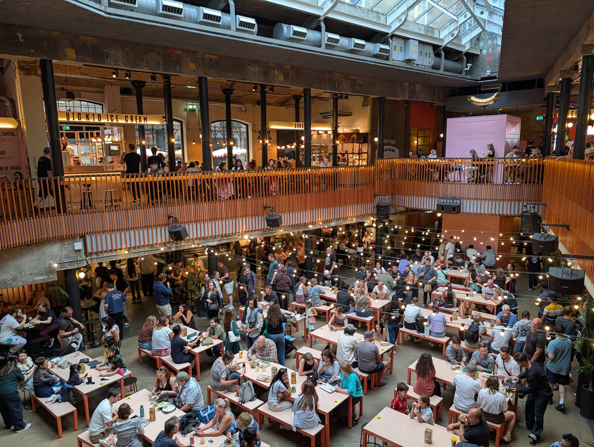
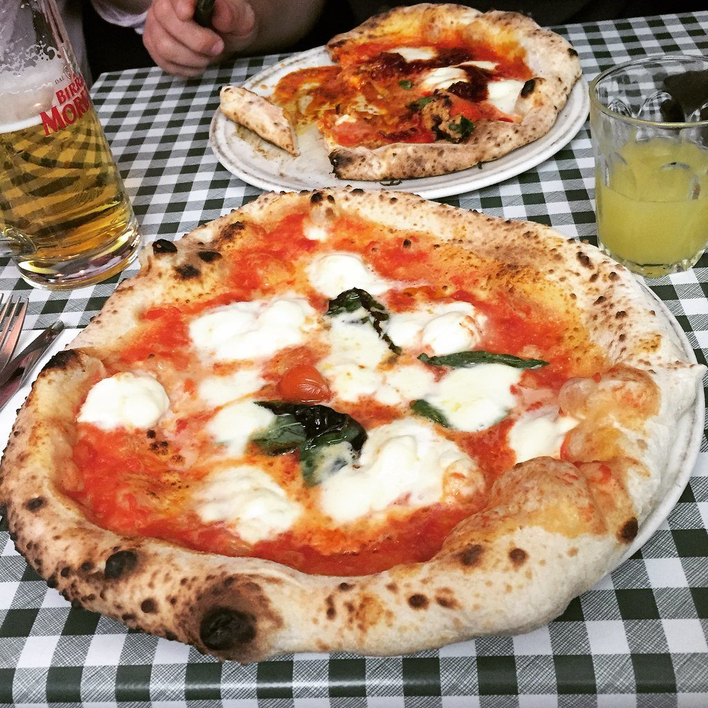
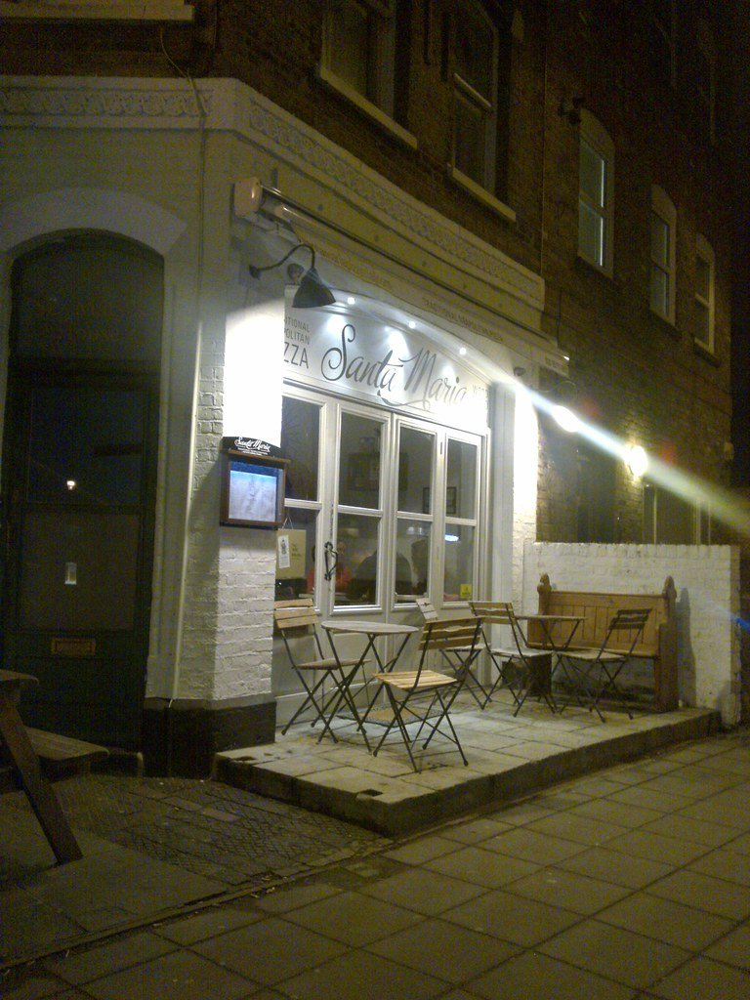
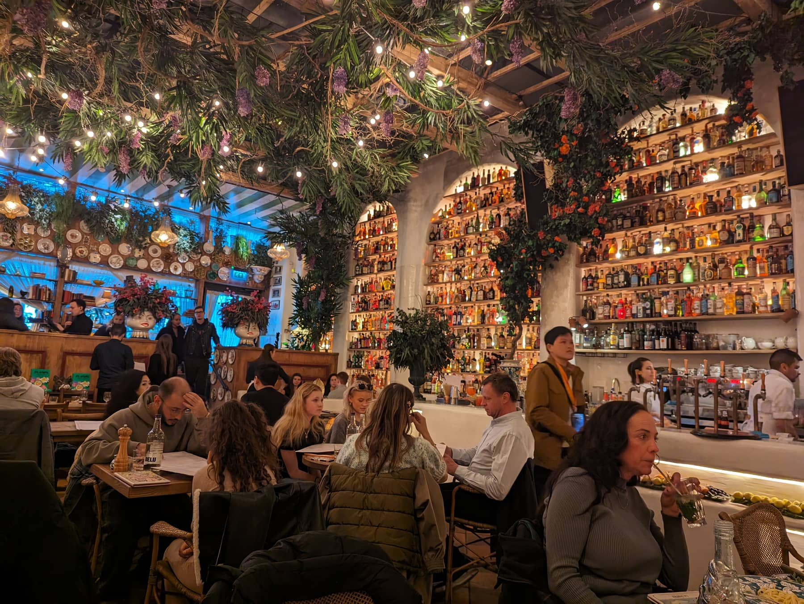

Ask who makes the best pizza in London and you will start an argument, because the city stopped cooking one thing a while ago. A soft Neapolitan you eat with a knife and fork. A foldable New York slice. A Detroit square with the cheese burnt crisp against the side of the pan. A Chicago pie deep enough to need a spoon. A Roman base rolled thin enough to snap. Those are not better and worse versions of the same food — they are different foods, and someone who loves one will happily turn down another.

Which is why the judges cannot agree either. The Italians give it to a Neapolitan pizzeria in Chiswick. The British give it to a pub kitchen in Leyton. So this guide opens with the three places that actually won something, then sorts the rest by style — because once you know what you are in the mood for, most of the argument disappears.

> 💡 **The Short Version:** **Short Road Pizza** won National Pizza of the Year 2025 and tops Time Out's London list. **Napoli on the Road** is first in Europe. **Crisp Pizza** is named by more sources than anything else in London. **50 Kalò** is the closest good pizza to the tourist centre. **Ria's** does Detroit. **Rudy's** and **Yard Sale** are the reliable walk-ins.

> 📊 **The evidence behind this guide**
> Nothing here is ranked on one visit. This pass reads **30 sources carrying 256 citations** across **125 named pizzerias** — the judged awards (50 Top Pizza, the National Pizza Awards), the editorial mastheads (Time Out, The Infatuation, Country & Town House) and the year's major London pizza videos. **38 pizzerias are named by two or more independent sources; 21 carry a dated award.**
> **The known weakness in this topic:** no inspectorate covers London pizza the way Michelin covers restaurants, so outside the two annual awards this ranking rests on editorial and creator consensus — which favours places that get written about over places that are merely good.
> *Evidence rebuilt 30 August 2026 · [How we rank →](/how-we-rank/)*

## Where they are

  

    Best pizza in London map
  

  

    
Loading the interactive map…

  

  

    <i class="restaurant-map-key restaurant-map-key--editorial" aria-hidden="true"></i> Recommended in this guide
    <i class="restaurant-map-key restaurant-map-key--streetfood" aria-hidden="true"></i> Pizza slice counter, market stall & pub residency
  

  <noscript>
    
The interactive map requires JavaScript. Nearest stations and walking times are listed against every entry below.

  </noscript>

| If you are near… | Where to eat |
| --- | --- |
| **Soho & Piccadilly** | Rudy's, Napoli on the Road Soho, Japes, Breadstall, Franco Manca |
| **Covent Garden & Charing Cross** | 50 Kalò, Homeslice, Bad Boy Pizza Society |
| **Mayfair & Marylebone** | Crisp Pizza, Alley Cats, L'Antica Pizzeria da Michele, Florencio |
| **Borough & London Bridge** | Spring Street Pizza, Elliot's, 'O Ver |
| **Shoreditch & Spitalfields** | Vincenzo's, Sud Italia, Paulie's, Detroit Pizza London |
| **Hackney & east London** | Dough Hands, Yard Sale, Lauretta's, Ace Pizza, Short Road Pizza (Leyton) |
| **West London** | Napoli on the Road (Chiswick), Ria's (Notting Hill), Santa Maria (Ealing) |
| **South London** | Connie's Pizza (Peckham), Theo's Pizzeria (Camberwell), Mamma Dough (Brixton) |

**Price guide:** **£** under £15 a head · **££** £15–£30 · **£££** £35+.

---

## The three number ones

Three judges, three different winners, because they are not measuring the same thing: 50 Top Pizza marks Neapolitan technique against the tradition, the National Pizza Awards and Time Out pick the best thing to eat regardless of style, and the citation count measures how many independent sources arrived at the same address.

### Short Road Pizza, Leyton

*££ · Leyton · William The Fourth, 816 High Road · walk-in · Cited by 4 sources · Winner, National Pizza Awards 2025 · #1 of 21, Time Out · [website](https://shortroadpizza.com/)*

The best pizza in Britain is cooked in the back of a Leyton brewery pub by a kitchen that had been trading for a year. Riccardo Demuru's Short Road Marinara took the 2025 national title and Time Out's top spot in London: confit garlic purée, spicy chimichurri, fresh stracciatella and Cantabrian anchovies on a Romana base — thin, long-fermented, crisp right to the edge. He took the Alternative Slice Award the same night with a vegan one.

Ugo and Kate started it on Short Road in Leytonstone, which is where the name comes from.

> ⚠️ **A residency, not a restaurant.** Short Road cooks inside Exale Brewery's two pubs, William The Fourth in Leyton and Three Colts in Bethnal Green, so the kitchen keeps shorter hours than the bar.

### Napoli on the Road, Chiswick

*££ · Chiswick · 8 min from Turnham Green · Cited by 6 sources · #1 in Europe, 50 Top Pizza · #16 of 21, Time Out · [book a table](https://www.sevenrooms.com/explore/napoliontheroadsoho/reservations)*

First in Europe three consecutive years, judged on Neapolitan technique by the ranking that takes it most seriously. It started as a truck touring London's food markets and is now in a quiet stretch of Chiswick, about forty minutes from the centre.

### Crisp Pizza at The Marlborough, Mayfair

*££ · Mayfair · 4 min from Bond Street · Cited by 11 sources · #15 of 21, Time Out · #1 of 12, The Infatuation · [book a table](https://www.sevenrooms.com/explore/crispmayfair/reservations)*

The most-cited pizza in London, and the one the critics rank highest. Carl McCluskey's New Haven-style pizza — charred, thin, deliberately scorched at the edge — moved from a Hammersmith pub into the basement of a relaunched Mayfair pub run by the team behind The Devonshire.

Order the grandma pie: square, thicker, feeds two or three.

> ⚠️ **No pizza on Mondays.** The pub upstairs is walk-in. The pizzeria downstairs takes [bookings](https://www.sevenrooms.com/explore/crispmayfair/reservations).

> 📍 **Two pubs, one kitchen.** Crisp runs at The Chancellors on Crisp Road in Hammersmith — the original, and the one The Infatuation actually ranked first — and at The Marlborough in Mayfair. The citations above cover both, because it is one operation under one owner. If you are travelling for the ranked one, that is W6, not W1.

---

## Also strongly backed

No single ranking crowns these, but they carry the widest agreement in the city after the three above.

### Alley Cats Pizza, Marylebone

*££ · Marylebone · Paddington Street · Cited by 9 sources · #6 of 21, Time Out · #4 of 12, The Infatuation · [book a table](https://www.sevenrooms.com/explore/alleycatsmarylebone/reservations/create/search/)*

The only New York-style pizzeria that Time Out, The Infatuation and Country & Town House all name. Eighteen-inch pies, Southern Italian ingredients, and a room that behaves like a Brooklyn slice joint rather than a trattoria.

One catch worth knowing: despite the framing, the restaurants sell whole pies rather than slices. A second site trades at 342 King's Road in Chelsea.

### Bad Boy Pizza Society, Covent Garden

*£ · Covent Garden · Seven Dials Market · walk-in · Cited by 8 sources · #3 of 21, Time Out · #6 of 12, The Infatuation · [website](https://badboypizzasoc.com/locations/)*

Twenty-two-inch New York pies sold by the slice from a counter inside Seven Dials Market, and a two-time National Pizza of the Year winner — 2022 with the Pepperoni Alla Vodka, 2024 with the Sausage Party.

It began in 2018 as a parody university society in Southampton set up to get students discounted pizza. The brand also runs residencies at Vinegar Yard and The Railway in Tulse Hill, and opened its first permanent restaurant, Bad Boy Pizzeria, at 419 Bethnal Green Road in August 2025.

*Seven Dials Market, where Bad Boy trades from a counter on the lower level. You eat at the shared benches rather than at the stall.*

### Breadstall, Soho

*£ · Soho · Berwick Street · walk-in · Cited by 7 sources · #10 of 21, Time Out · [website](https://www.breadstall.com/)*

A slice counter on Berwick Street rather than a dining room, and the most-cited pizza in London under £15. Slow-fermented biga dough with a crisp bottom and a puffed, almost naan-like crust. A second site trades in Battersea.

### Dough Hands, Hackney

*££ · Hackney · 7 min from London Fields · Cited by 6 sources · #2 of 21, Time Out · #7 of 12, The Infatuation · [website](https://www.doughhands.com/)*

A residency in the back of The Spurstowe Arms, sitting somewhere between New York and Neapolitan — crisp base, generous toppings, no restaurant attached. Time Out puts it second in London, behind only Short Road. Also operates in Dalston and Hackney Wick.

> ⚠️ It runs on the pub's **kitchen** hours, which are shorter than the pub's own. Check before travelling.

### Vincenzo's, Shoreditch

*£ · Shoreditch · 122 Bethnal Green Road · walk-in · Cited by 6 sources · #9 of 21, Time Out · #3 of 12, The Infatuation · [website](https://vincenzospizzas.com/)*

Twenty-inch pies cut into slices you eat standing up. This is the closest London gets to an actual New York slice shop rather than a restaurant doing New York pizza, and it is the cheapest serious pizza in this guide.

Slices are grab-and-go from 5pm; whole 16-inch pizzas are takeaway only. The original is in Bushey, outside London.

### Yard Sale Pizza, Clapton

*££ · Clapton · 105 Lower Clapton Road · walk-in · Cited by 6 sources · 3rd, National Pizza Awards 2025 · #8 of 21, Time Out · [website](https://yardsalepizza.com/shop/clapton/)*

Started in a back-yard oven in Homerton in 2014 and grew into east London's default good pizza without ever becoming a chain you would avoid. British ingredients, a properly considered vegan menu, and consistent across every branch. Paolo Burini's Ragu Pazzo took third in Britain in 2025.

Six London sites: Clapton, East Dulwich, Hackney Road, Leytonstone, Walthamstow and Finsbury Park. Clapton is the original.

---

## By style

Five different foods under one word.

### Neapolitan: the ranked pizzerias

The formal end. Long-fermented dough, a wet centre you are supposed to eat with a knife and fork, and a puffed, blistered rim.

#### 50 Kalò, Trafalgar Square

*££ · Trafalgar Square · 1 min from Charing Cross · Cited by 2 sources · #4 in Europe, 50 Top Pizza · [book a table](https://www.sevenrooms.com/reservations/50kalopizzerialondon)*

Ciro Salvo's London outpost, and the answer to the question this guide gets asked most: where is the genuinely excellent pizza that does not require a journey. Fourth in Europe, one minute from Charing Cross, and surrounded by some of the worst-value restaurants in London.

If you are staying central and want one very good pizza with no planning at all, this is it.

#### L'Antica Pizzeria da Michele, Marylebone

*££ · Marylebone · 2 min from Baker Street · Cited by 4 sources · #28 in Europe, 50 Top Pizza · [website](http://www.anticapizzeriadamichele.co.uk/)*

The London arm of the Naples institution founded in 1870 — the one from *Eat Pray Love*, if that is a reference point. The menu is deliberately, almost aggressively short, because in Naples the argument is that a pizzeria doing forty toppings is not concentrating.

Baker Street is the branch named in the 2026 rankings.

#### Connie's Pizza, Peckham

*££ · Peckham · 1 min from Queen's Road Peckham · Cited by 2 sources · #48 in Europe, 50 Top Pizza · [book a table](https://conniespizzeria.com/)*

Entered the European top 50 at 48 within a year of opening and took the 'one to watch' award with it — the only London pizzeria on that list south of the river. It sits in the railway arches directly under Queen's Road Peckham station, in the old Little Kudu site.

Andrea Asciuti, who founded 081 Pizzeria, calls the style "Bri-talian": a crisp London base built with Italian method, which is a more honest description of what most good London pizza now is than "Neapolitan" would be.

### The one with a tasting menu

#### Napoli on the Road Soho, Soho

*£££ · Soho · 140 Wardour Street · book weeks ahead · London's first pizza tasting menu · [book a table](https://www.sevenrooms.com/explore/napoliontheroadsoho/reservations)*

Seven courses, four of them pizza, in a basement under Wardour Street — the only pizza tasting menu in the city. Around £65 a head, with the wine pairing charged on top. It opens with fritti, then works through a white pizza with asparagus and anchovy colatura before it gets anywhere near a margherita. The ground floor is a separate à la carte restaurant; the tasting menu downstairs books separately.

### New York

Thinner, wider, foldable, sold by the slice, and where most of this year's coverage went.

#### Spring Street Pizza, Borough

*££ · Borough · Arch 32, Southwark Street · Cited by 4 sources · #4 of 21, Time Out · #9 of 12, The Infatuation · [book a table](https://www.opentable.co.uk/r/spring-street-pizza-southwark)*

Tom Kemble left fine dining — he held a star at Bonhams — to make eighteen-inch New York slices under a railway arch off O'Meara Street. The dough is a biga fermented past forty-eight hours, which is where the thin, foldable, properly charred base comes from.

A few minutes from Borough Market, London Bridge and the Shard, which makes it the most useful entry on this page for anyone doing the South Bank.

#### Paulie's, Spitalfields

*££ · Spitalfields · 146 Commercial Street · walk-in · Cited by 5 sources · #12 of 12, The Infatuation · [website](https://paulieslondon.com/)*

The Paulie's Pie — fennel-seed pepperoni under hot honey — sold by the slice or whole on Commercial Street, with enough room to actually sit down, which most slice shops do not offer.

#### Ace Pizza, Victoria Park

*££ · Victoria Park · 126–128 Lauriston Road · Cited by 5 sources · #5 of 21, Time Out*

A chewy base somewhere between New York and Naples, on the Victoria Park village strip. Howard Quayle took the Bloggers' Choice award at the 2025 National Pizza Awards with The Capish, a 20-inch pie with house vodka sauce and secret-recipe meatballs.

#### Carmela's Pizzeria, Islington

*££ · Islington · 149A Upper Street · walk-in · Cited by 3 sources · #12 of 21, Time Out · #11 of 12, The Infatuation · [website](https://linktr.ee/Carmelaspizzeria)*

A softer, foldable New York slice on Upper Street, where the competition is mostly chains.

#### Lauretta's, Bethnal Green

*££ · Bethnal Green · 93 Columbia Road · Cited by 3 sources · #5 of 12, The Infatuation*

Proudly thin with a puffy, fire-kissed crust, on Columbia Road — which means Sunday lunch is flower-market chaos and the rest of the week is evenings only. Closed Mondays.

#### 67 Sourdough, East Finchley

*££ · East Finchley · 82–92 Great North Road · Cited by 2 sources · #8 of 12, The Infatuation · [website](https://www.67sourdough.com/)*

Thin-crust New York pizza served inside a working car dealership on the Great North Road. Open Wednesday to Sunday only.

### Detroit and Chicago

The shapes almost nobody else in London attempts.

#### Ria's, Notting Hill

*££ · Notting Hill · Cited by 5 sources · #21 of 21, Time Out · [book a table](https://www.sevenrooms.com/explore/riasnottinghill/reservations/create/search/?venues=riasnottinghill%2Criassoho)*

Thick, crisp-edged Detroit pies, baked in a rectangular steel pan so the cheese caramelises against the sides into what Detroit calls the frico edge. Matched to a natural wine list, and the only one doing the style in west London.

Founded in 2023 by a husband-and-wife pair who came out of tech. A second site opened in Soho at 29 Foubert's Place with a wine cave downstairs.

#### Detroit Pizza London, Spitalfields

*££ · Spitalfields · 75 Commercial Street · Cited by 3 sources · [website](https://detroitpizzalondon.com/)*

Baked in blue steel pans so the cheese caramelises against the edge — crunchy corners, cloud-like middle. The other serious Detroit pizza in the city, and the one on the east side.

#### Japes, Soho

*££ · Soho · 22–25 Dean Street · Cited by 4 sources · #19 of 21, Time Out · [book a table](https://www.sevenrooms.com/explore/japescamden/reservations/create/search/)*

Chicago deep dish, which almost nothing else in central London attempts — a pie built in a pan deep enough that the cheese pull becomes the entire point of it. Also in Greenwich and Camden.

Deep dish is slow to cook. Expect a wait that a Neapolitan pizzeria would never ask of you, and do not arrive starving.

#### Little Earthquakes, Stoke Newington

*££ · Stoke Newington · The Railway Tavern, 2 St Jude Street · Cited by 3 sources · #18 of 21, Time Out · [website](https://littleearthquakes.co.uk/)*

Neil Rankin of Temper doing deep-dish modelled on the frozen supermarket pizzas he grew up on, and a 2025 National Pizza Awards finalist. A residency, so the pub's hours govern it.

### Neapolitan you can walk into

Good, widespread, and no planning required.

#### Rudy's Pizza Napoletana, Soho

*££ · Soho · 80 Wardour Street · walk-in · Cited by 5 sources · #7 of 21, Time Out · [website](https://www.rudyspizza.co.uk/pizzerias/soho)*

Naples by way of Manchester, and accredited by the Associazione Verace Pizza Napoletana — meaning the dough, the flour and the oven all meet the Neapolitan association's own written standard. Very few London pizzerias bother to get that.

A 2025 National Pizza Awards finalist, and the most reliable cheap Neapolitan pizza in central London, with sites on Wardour Street, Shoreditch High Street and Spital Square. Consistent enough that the branch barely matters.

#### Zia Lucia, Holloway

*££ · Holloway · 7 min from Highbury & Islington · Cited by 4 sources · [website](https://zialucia.com/)*

Four different doughs, including a 48-hour ferment and a charcoal base, which makes this the most useful entry here for anyone avoiding standard wheat flour. A 2025 National Pizza Awards finalist.

**Gluten-free base available** — though a separate base is not a separate preparation area, so ask if it matters medically.

#### Berberè, Stratford

*££ · Stratford · Cited by 3 sources · #13 of 21, Time Out · [book a table](https://www.berberepizzeria.co.uk/book-here/)*

An Italian group doing sourdough bases with crisp bottoms and a light, fluffy rim, split into halves so a table can order two things. Five London locations.

#### Homeslice, Covent Garden

*££ · Covent Garden · 2 min from Covent Garden · Cited by 4 sources · [book a table](https://www.sevenrooms.com/explore/homeslicecity/reservations/create/search/)*

Twenty-inch pizzas sold whole or by the slice, with toppings split across halves. Built for groups rather than couples — two people will struggle and four will do fine. Neal's Yard is the original.

#### Pizza Pilgrims, Soho

*££ · Soho · 5 min from Tottenham Court Road · walk-in · Cited by 7 sources · [website](https://www.pizzapilgrims.co.uk/)*

Started as a Soho market cart in 2012 and now runs across London, and reached the 2025 National Pizza Awards final. Reliable rather than remarkable, but consistent, and you can walk into any of them.

*Started as a three-wheeled van and kept the Neapolitan dough. The fried pizza starter is the outlier worth ordering. Photo: [Bex.Walton](https://www.flickr.com/photos/7831824@N04/35140239561), [CC BY 2.0](https://creativecommons.org/licenses/by/2.0/).*

#### Sodo Pizza, Clapton

*££ · Clapton · 126 Upper Clapton Road · Cited by 2 sources · #20 of 21, Time Out · [website](https://www.sodopizza.co.uk/)*

Sourdough bases, natural wine and local craft beer, a short walk from Clapton Pond. Also in Walthamstow and Deptford.

#### Mamma Dough, Brixton

*££ · Brixton · 354 Coldharbour Lane · Cited by 2 sources · [website](https://mammadough.co.uk/)*

A south London sourdough chain whose head pizzaiolo, Antonio Raspone, took Pizza Chef of the Year at the 2025 National Pizza Awards for The Big Apple Blue. Also in Ladywell and South Norwood.

#### Santa Maria, Ealing

*££ · Ealing · 7 min from Ealing Broadway · Cited by 2 sources · [book a table](https://booking.resdiary.com/widget/Standard/SantaMariaPaddington/59017)*

A small Ealing pizzeria that built its reputation on strict Neapolitan method years before the current wave arrived. Worth knowing if you are anywhere in west London.

*Ealing, of all places, has one of London's better Neapolitan pizzas. Photo: [markhillary](https://www.flickr.com/photos/56087830@N00/4429138753), [CC BY 2.0](https://creativecommons.org/licenses/by/2.0/).*

---

## Cheapest

Everything here is in the **£** band, under £15 a head, and none of it takes a booking.

[Breadstall](#breadstall-soho) · [Bad Boy Pizza Society](#bad-boy-pizza-society-covent-garden) · [Vincenzo's](#vincenzos-shoreditch), plus four with no entry above:

- **[Franco Manca](https://eu.sevenrooms.com/reservations/francomancaaldwych?venues=francomancaaldwych,francomancacoventgarden,francomancaholborn,francomancasoho)**, Soho — sourdough at a price nothing central matches, from a 2008 Brixton Market stall, and a 2025 National Pizza Awards finalist. *Cited by 4 sources*
- **[Sarv's Slice](https://www.sarvsslice.com/)**, Ealing — slice counter in the Filmworks development by Ealing Broadway. *Cited by 2 sources*
- **[ICCO](https://icco.co.uk/)**, Fitzrovia — long-running cheap pizza near Goodge Street. *Cited by 1 source*
- **[Voodoo Ray's](http://www.voodoorays.com/)**, Dalston — late-night slices, a category with almost no competition.

## Food halls and market stalls

Market hours and communal benches rather than a table of your own. Two traders are worth going for rather than settling for: [Bad Boy Pizza Society](#bad-boy-pizza-society-covent-garden) on the lower level at Seven Dials Market, and **[Sud Italia](http://www.suditaliapizza.co.uk/)** at Old Spitalfields, one of the few genuine market pizzas in central London. *Cited by 2 sources*

> ⚠️ **Market stalls trade on market hours.** Bad Boy at Seven Dials and Sud Italia at Old Spitalfields both close when the market does, which is earlier than a restaurant.

## Pub pizza

A serious pizza kitchen operating inside somebody else's pub. No guide treats it as a category, and it is how the best pizza in Britain is cooked.

[Short Road Pizza](#short-road-pizza-leyton) · [Crisp Pizza](#crisp-pizza-at-the-marlborough-mayfair) · [Dough Hands](#dough-hands-hackney) · [Little Earthquakes](#little-earthquakes-stoke-newington), plus:

- **Bing Bong Pizza** — You Call The Shots, 13 Morning Lane, Hackney. Second in Britain in 2025, cooked out of a leopard-print bar. *Cited by 2 sources · 2nd, National Pizza Awards 2025*
- **Patio Pizza** — The Greyhound, Peckham. *Cited by 1 source · #10 of 12, The Infatuation*

> ⚠️ **The kitchen closes before the bar.** Every entry here keeps shorter hours than the pub it sits in, and several do not cook every day. Check the pizza hours, not the pub's.

## Recent arrivals

New enough that the lists are still catching up.

- **[Connie's Pizza](https://conniespizzeria.com/)**, Peckham — entered the European top 50 at 48 within a year of opening, and took the 'one to watch' award with it. *Cited by 2 sources · #48 in Europe, 50 Top Pizza*
- **Bing Bong Pizza**, Hackney — went from a bar pop-up to second in Britain. *Cited by 2 sources · 2nd, National Pizza Awards 2025*
- **Bad Boy Pizzeria**, Bethnal Green — the market stall's first permanent restaurant, open at 419 Bethnal Green Road since August 2025.
- **Ria's Soho**, 29 Foubert's Place — the Notting Hill Detroit specialist's second site, with a wine cave downstairs.

---

## Worth knowing, briefly

Places the sources back but that did not earn a full entry, either because only one or two guides name them or because pizza is not the main event. Several are very good.

| Venue | Area | Price | Cited by | What it is |
| --- | --- | --- | --- | --- |
| **[Bar Etna](https://www.instagram.com/bar.etna.london/)** | Newington Green | £££ | 1 source · #11 of 21, Time Out | Thin, crisp East Coast style with simple but serious toppings |
| **Purezza** | Camden Town | ££ | 1 source | Vegan-led, and a past National Pizza of the Year winner |
| **[Cecconi's](https://www.opentable.co.uk/widget/reservation/loader?rid=4919)** | Mayfair | £££ | 1 source | Mayfair Italian where the pizza is a sideline, not the reason |
| **[Florencio](https://www.florenciopizza.com/)** | Marylebone | ££ | 2 sources | A light, thin base from a 48-hour ferment. Closed Sunday and Monday |
| **[Weezie's](https://www.weezieslondon.com/)** | Belgravia | ££ | 1 source | Thin crust, Guinness and a proper wine list, in a courtyard near Victoria |
| **[Elliot's](https://elliots.london/)** | Borough Market | £££ | 1 source | A wine bar that happens to make a pizza people cross London for |
| **[Gracey's Pizza](https://www.sevenrooms.com/explore/graceyspizza/reservations/create/search/)** | — | ££ | 3 sources · #2 of 12, The Infatuation | Ranked #2 of 12 by The Infatuation, which places it in **St Albans** — outside London, and listed here only so the ranking is not silently dropped |
| **[Theo's Pizzeria](https://www.theospizzeria.com/)** | Camberwell | ££ | 2 sources | Neapolitan that made its name on house chilli oil |
| **['O Ver](https://www.overuk.com/)** | Borough | ££ | 2 sources | Doughs made with filtered Mediterranean sea water instead of salt |
| **[Made in Italy](https://www.madeinitalygroup.co.uk/)** | Chelsea | ££ | 1 source | Sold by the half-metre on a board, on the King's Road |
| **Pizza Union** | Various | £ | 2 sources | Fast, very cheap Neapolitan near several stations |
| **[Circolo Popolare](https://www.sevenrooms.com/explore/circolopopolare/reservations/create/search?venues=avemariolondon%2Ccircolopopolare%2Ccarlottauk%2Cgloria%2Cjacuzzi%2Cbarbarellacanarywharf&tracking=bmg)** | Fitzrovia | ££ | — | Big Mamma's wall-of-bottles room; the pizza is not why you book |
| **[Lardo](http://www.lardo.co.uk/book)** | London Fields | ££ | — | Pizza and pasta, a London Fields fixture |
| **[Wandercrust](http://www.wandercrust.com/)** | Greenwich | ££ | — | Neapolitan, and the reason to eat in Greenwich rather than at the market |
| **[CRATE Brewery](http://www.cratebrewery.com/)** | Hackney Wick | ££ | — | Canalside brewery doing pizza — go for the canal, stay for the beer |
| **[Santi](http://www.santirestaurant.com/)** | Stratford | ££ | — | Neighbourhood Italian in East Village, useful near the Olympic Park |

*Circolo Popolare is on this list for the room, not the pizza — which is exactly the distinction this table exists to make.*

[See all 112 Italian restaurants →](/restaurants/cuisine/italian)

---

## Booking and practical essentials

* **Almost nothing here needs booking.** Rudy's, Pizza Pilgrims, Yard Sale, Vincenzo's, Breadstall, Bad Boy, Sud Italia, Franco Manca, Paulie's, Carmela's and Short Road are all walk-in.
* **Book weeks ahead** for the Napoli on the Road Soho tasting menu, and book the basement specifically.
* **Crisp Pizza is two venues in one.** The pub is walk-in; the basement pizzeria takes [bookings](https://www.sevenrooms.com/explore/crispmayfair/reservations) — and there is no pizza at all on Mondays.
* **Residencies keep shorter hours than their pubs.** Short Road, Dough Hands, Little Earthquakes and Bing Bong all stop serving well before the bar closes.
* **Market stalls trade on market hours.** Bad Boy at Seven Dials and Sud Italia at Old Spitalfields both close when the market does.
* **Some of the best ones close early in the week.** Florencio is shut Sunday and Monday, Lauretta's is shut Monday, 67 Sourdough opens Wednesday to Sunday, and Crisp does not cook pizza on Mondays.
* **For gluten-free**, Zia Lucia is the one with a dedicated alternative base. Confirm the preparation separately if it is a medical requirement.
* **Service charge** of 12.5% is discretionary and standard on London restaurant bills, though counters and stalls generally do not add it.

Powered by <a target="_blank" rel="sponsored" href="https://www.getyourguide.com/london-l57/">GetYourGuide</a>

---

## Continue planning your London trip

- 🍽️ **[Eat in London: Restaurants, Food Markets & Quick Food Hub](/articles/eat-in-london-guide/)**
- 🍛 **[The Best Indian Restaurants in London](/articles/best-indian-restaurants-london/)**
- 🥩 **[The Best Sunday Roast in London](/articles/best-sunday-roast-london/)**
- 🛍️ **[London Markets by Day](/markets/)**
- 🎭 **[Covent Garden Area Guide](/articles/covent-garden-area-guide/)**
- 🍜 **[Soho Area Guide](/articles/soho-area-guide/)**
- 🎨 **[Shoreditch Area Guide](/articles/shoreditch-area-guide/)**
