Every rooftop list in London ranks the same thing: the view. That is the easy half. The hard half — whether the kitchen is any good, what happens to your booking when it rains, and whether the terrace is even bookable — is the half that decides your evening, and it is the half almost nobody prints.

So this guide asks a different question of the same set of restaurants. Five of them hold a Michelin star in the 2026 guide. The rest do not, and that includes the towers whose names everyone knows. Meanwhile the best-rated roof in London, by the one masthead that ranks its list, is a gastropub in Spitalfields with a herb garden on top of it.

The other thing worth knowing before you book: several of these are bars that serve food rather than restaurants, and several more are not rooftops at all — they are sealed rooms high in a building, which is a different evening and, in bad weather, a better one. Both are marked below.

> 💡 **The Short Version:** **Brooklands by Claude Bosi** has two Michelin stars and a terrace for 26 at the top of The Peninsula. **Angler** is a starred seafood restaurant whose terrace has a roof that closes, so it works all year. **The River Café** is the riverside answer and has been since 1987. **Seabird** is named by more sources than anything else on a roof in London. **The Culpeper** is Time Out's number one, and it is a pub with a herb garden on the roof. **Frank's Cafe** is the cheap one and runs 15 May to 12 September only. And **Sky Garden is free** — you never have to buy dinner to get up there.

> 📊 **The evidence behind this guide.**
> Nothing here is ranked on one visit. This pass reads **19 sources carrying 426 citations** across **212 named venues** — the judged awards (the Michelin Guide and The Good Food Guide), the editorial mastheads (Time Out, The Infatuation, SquareMeal, the Evening Standard, Country & Town House, The Handbook, The Sauce, Luxury London, DesignMyNight), the specialists (The Rooftop Guide, Hot Dinners, Secret London, London x London) and the year's London rooftop videos. **92 are named by two or more independent sources; 7 are named by a judged guide.**
> *Evidence rebuilt 22 September 2026 · [How we rank →](/how-we-rank/)*

## Where they are

| If you are near… | Rooftops | On the water |
| --- | --- | --- |
| **The City & Liverpool Street** | Angler, Coq d'Argent, SUSHISAMBA, Aviary, Wagtail, Mercer Roof Terrace, Madison | Hawksmoor Wood Wharf (Canary Wharf), Bōkan (Canary Wharf) |
| **Soho & Leicester Square** | The Devonshire, Yasmin, 8 at The Londoner, 1 Leicester Square Rooftop | — |
| **Mayfair & Belgravia** | Brooklands by Claude Bosi, Shanghai Me, Alto by San Carlo (Oxford Street) | — |
| **South Bank & Southwark** | Seabird, Forza Wine at the National Theatre, Aqua Shard | Skylon, OXO Tower, Sea Containers, Swan at the Globe |
| **Borough & London Bridge** | OMA | Le Pont de la Tour, Emilia's Crafted Pasta (Tower Bridge) |
| **Shoreditch & Spitalfields** | The Culpeper, Boundary Shoreditch, Llama Inn, KASO | — |
| **Hackney & the Lea** | The Marksman (Hackney Road) | Barge East, Crate Brewery, Cafe Cecilia, Towpath |
| **West London** | — | The River Café, Sam's Riverside, Rick Stein Barnes, Canal (Maida Hill), Darcie & May Green (Paddington) |
| **South London** | Forza Wine (Peckham), Frank's Cafe (Peckham), FM Mangal (Camberwell), JOIA (Battersea) | Wright Brothers (Battersea Power Station) |
| **Richmond & upstream** | — | Scott's Richmond, Peggy Jean, Gaucho Richmond, Bingham Riverhouse |

**Price guide:** **£** under £15 a head · **££** £15–£30 · **£££** £35+.

---

## The ones that actually won something

Three different judges, three different answers, and they are not measuring the same thing. The Michelin inspectors grade the plate and ignore the view entirely. Time Out ranks the whole experience and puts a pub first. The citation count measures how many independent writers arrived at the same address.

Where they overlap is the useful part. Brooklands is both the Michelin two-star and the number one pick of the only video creator in this set who ranked her visits. Where they diverge is more interesting: Time Out's best rooftop restaurant in London is **The Culpeper**, a Spitalfields gastropub, and the most-cited roof in the city is **Seabird**, which holds no star. Both are below.

### Brooklands by Claude Bosi, Belgravia

*£££ · Belgravia · rooftop of The Peninsula, 1 Grosvenor Place · Cited by 4 sources · Two Michelin stars, 2026 · #13 of 15, Time Out · #1 of 10, Ugo Arinzeh · [its site](https://www.peninsula.com/en/london/hotel-fine-dining/brooklands)*

Two Michelin stars within months of opening, first awarded in 2024 and held in the 2025 and 2026 guides. The dining room is themed on British motor racing and aviation, and it spills onto a terrace at the top of the hotel with space for 26, looking over Knightsbridge and Belgravia rather than the City towers — a closer, lower, greener view than the skyscraper restaurants sell.

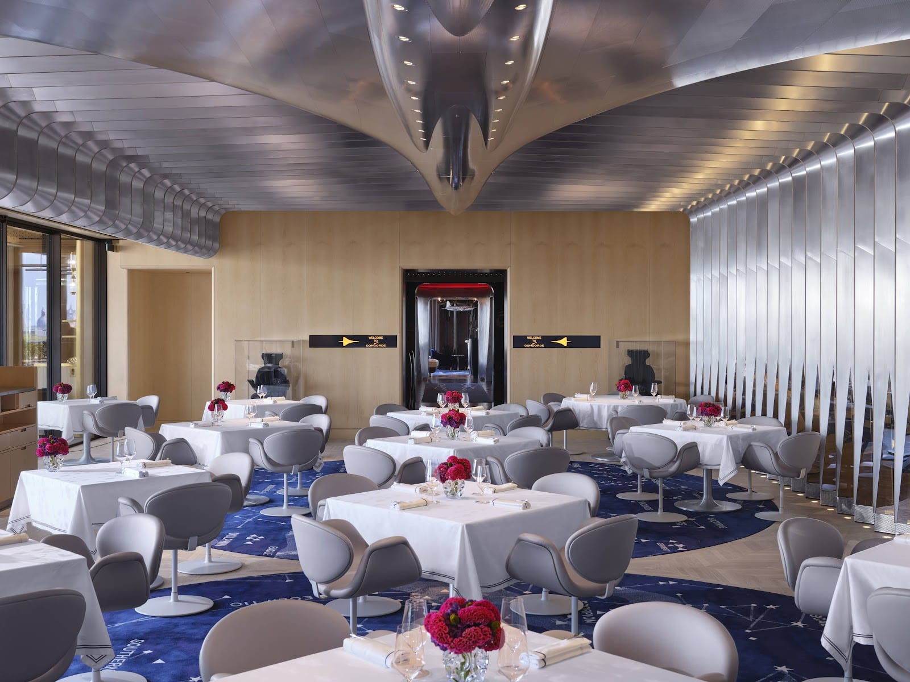

*The room is themed on British motor racing and aviation. The terrace holds 26; if the weather turns, staff move you back in here.*

The cooking is Claude Bosi's: turbot with wild sea leeks, Cornish squid with artichoke, Lake District lamb with mint and pastrami. Time Out's note on the weather is the practical one — if it turns, the staff move you back inside rather than leaving you under an umbrella.

### Angler, Moorgate

*£££ · Moorgate · rooftop of the South Place Hotel · Cited by 4 sources · One Michelin star, 2026 — a thirteenth consecutive year · [book a table](https://anglerrestaurant.com/book-a-table/)*

The rooftop restaurant that has held a star the longest, every year since 2014, and the one that answers the rain question properly: **the terrace is heated and its roof retracts**, so an outdoor table in October is a real booking rather than a gamble. Inside is a slanted row of windows and a mirrored ceiling that pulls the skyline down over the room.

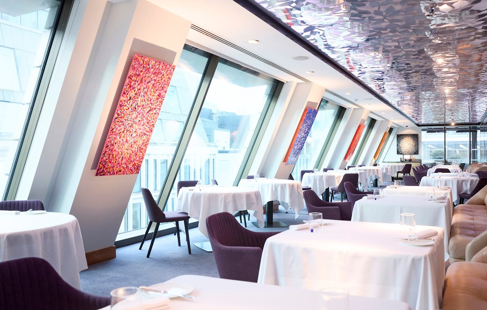

*Mains are around £48 and the tasting menu £155. The terrace outside is heated and its roof retracts, so an October booking holds.*

It is seafood-led and priced accordingly — mains around £48, a tasting menu at £155 — from day boats and named suppliers around the British Isles, under head chef Craig Johnston, who won the Roux Scholarship in 2025. Tables are taken for up to ten; larger groups go through the events team. Dogs are welcome throughout the hotel, Angler included.

### The River Café, Hammersmith

*£££ · Hammersmith · Thames Wharf, Rainville Road W6 · Cited by 9 sources · One Michelin star, 2026 · #1 of 16, Time Out · The Good Food Guide, waterside · [book a table](https://www.sevenrooms.com/explore/rivercafelondon/reservations/create/search/)*

Nine sources name it, more than any other restaurant on the water here, and it is the only one that holds a Michelin star, tops Time Out's riverside ranking and appears on The Good Food Guide's waterside list. Ruth Rogers and Rose Gray opened it in 1987 in a converted Hammersmith warehouse, and the format has barely moved — a wood-fired oven in an open kitchen, a menu rewritten twice a day around whatever arrived, and a lawn running down to the Thames Path.

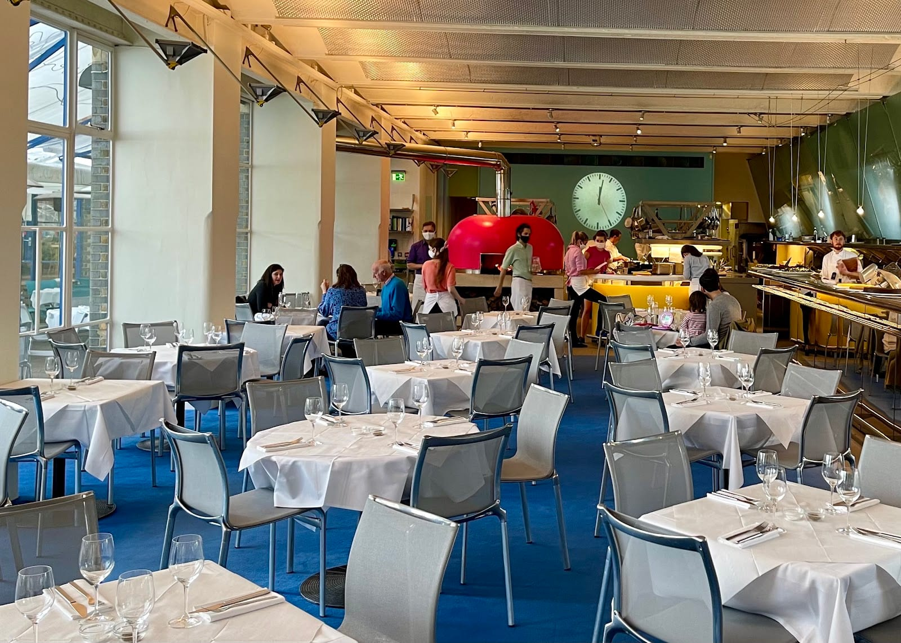

*The wood oven sits in the open kitchen at the end of the room. The menu is rewritten twice a day around what arrived that morning.*

Order the chargrilled squid with chilli and rocket, and the Chocolate Nemesis, which has been on since the beginning. It is expensive in a way the sources are blunt about: The Good Food Guide marks it ££££, the only London waterside entry it rates that high. Summer lunch on the terrace is the version to book.

### OMA, Borough

*£££ · Borough · first floor, 3 Bedale Street, over Borough Market · Cited by 2 sources · One Michelin star, 2026 · #6 of 15, Time Out · [book a table](https://www.sevenrooms.com/reservations/oma)*

Time Out's own entry admits it is "stretching the definition of rooftop here", and it is right — this is a first-floor terrace, not a roof. It is on this page because the view is Borough Market from above, and because a starred kitchen with an outdoor table over a working market is not a combination London offers twice.

The cooking is Greek by way of the Ionian islands, the Levant and the Balkans: grilled fish over coals, and a pool of labneh under crisp salt cod XO that Time Out calls the best £6 in London. The star arrived in 2025 and was held in 2026. Book well ahead; the terrace is a small part of a busy restaurant.

### Restaurant Gordon Ramsay High, Liverpool Street

*£££ · City · 22 Bishopsgate, EC2N 4BQ · Cited by 3 sources · One Michelin star, 2026 — its first · [its site](https://www.gordonramsayrestaurants.com/high/bishopsgate/)*

**Not a rooftop: a sealed room near the top of a tower**, and worth the distinction. It is a twelve-seat chef's table run by the team behind the three-star Restaurant Gordon Ramsay in Chelsea, and it took its first Michelin star in the 2026 guide — the only new star in this whole set.

Twelve seats means it books like a theatre ticket rather than a restaurant, and getting in involves the building's security before it involves the kitchen: the creator who filmed the full feasting menu there counted four checks at the entrance. One floor plan fact that reframes the price: **Horizon 22, the free public viewing platform on Level 58 of the same building**, is two floors down. You are paying for the food here, not the height.

---

## Also strongly backed

No judged award crowns these, but they carry the widest agreement in the city after the five above.

### Seabird, Southwark

*£££ · Southwark · 14th floor, 40 Blackfriars Road SE1 · Cited by 9 sources · #4 of 15, Time Out · #4 of 10, Ugo Arinzeh · [book a table](https://seabirdlondon.com/reservations)*

The most-cited rooftop in London — nine independent sources, across mastheads, specialists and video — and the one that reads as a restaurant first and a view second. It sits on top of the Hoxton in Southwark with an indoor room and a terrace, both looking north over the river to St Paul's.

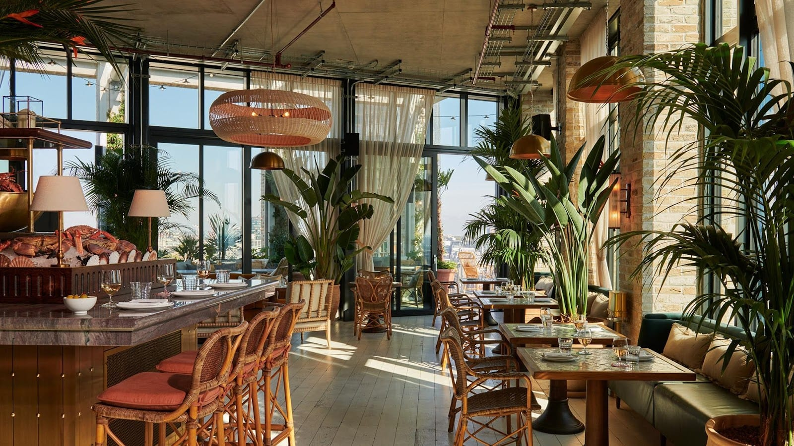

*The shellfish display is the first thing in the room, and the terrace is through the doors behind it. Oyster happy hour runs daily, 3–6pm.*

The kitchen is Mediterranean seafood: dressed crab, fried calamari, whole tiger prawns with aioli, whole market fish off the grill, and an oyster list the restaurant claims is London's longest. The creator who rated it dish by dish put the whole market fish and the Gillardeau oysters at the top and the octopus roll well below them. **Oyster happy hour runs daily 3–6pm**, which is the cheapest way to sit up there.

### The Culpeper, Spitalfields

*££ · Spitalfields · 40 Commercial Street, roof garden · Cited by 5 sources · #1 of 15, Time Out · [its site](https://www.theculpeper.com/)*

Time Out's number one rooftop restaurant in London, and it is a pub. The roof is a working garden — silver birch and hazel, herbs and vegetables cut for the kitchen below, topped up from the pub's own farm in Deptford — and the menu is built around the grill: baby leeks with romesco, half a chicken with chanterelles and black garlic, a salad of whatever came in that morning.

Two things decide the trip. **Rooftop food runs 12–10pm Monday to Saturday and stops at 6pm on Sunday**, when the roof serves its own menu rather than the roast; and rooftop drinks are walk-in only, 12pm to 9.30pm, with the space cleared at 10pm sharp. The roof is non-smoking, and it opens to diners from spring rather than all year.

### Forza Wine, Peckham

*££ · Peckham · top floor of Market Peckham, Rye Lane · Cited by 5 sources · #2 of 15, Time Out · [its site](https://forzawine.com/)*

A wine bar on the roof of a Rye Lane shopping centre that everybody treats as a restaurant, because the food is why the queue forms. Small plates, Italian-leaning and sharply seasoned: cauliflower fritti with aioli, which has never left the menu; butterflied mackerel with fennel, mustard and dill; hake croquettes with tartare. Time Out's tip is the group order — the entire menu plus four Custardos for £130, which works out at around ten dishes.

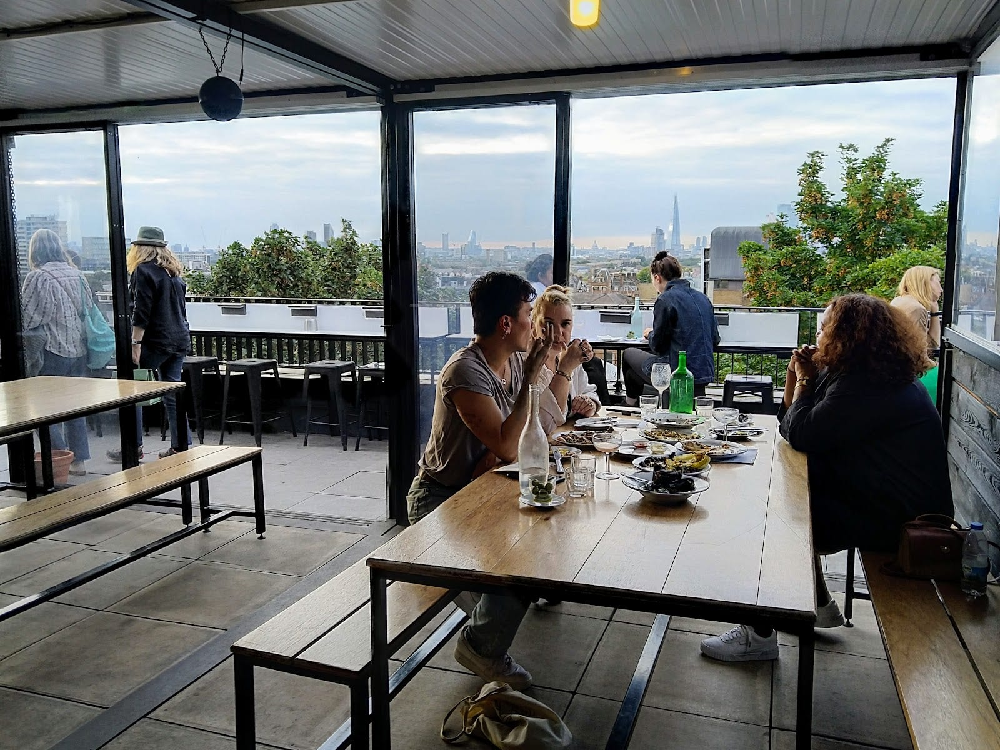

*Benches, shared tables and a glass wall that slides back onto the terrace. The group order — the whole menu plus four Custardos — is £130.*

The room is a low, wide box with a terrace along the front and the whole of south London beyond it. There is a second Forza on top of the National Theatre, below, and the two are different evenings — this one is louder, later and cheaper.

### Forza Wine at the National Theatre, South Bank

*££ · South Bank · top floor of the National Theatre · Cited by 4 sources · #8 of 15, Time Out · [its site](https://forzawine.com/)*

The Peckham original's central sibling, on the top of the National Theatre with a wraparound terrace seating 70 and the river directly below it. Same style of menu — golden cauliflower fritti, bitter leaves under an anchovy dressing, lamb shoulder with salsa verde, burrata with beetroot — and a wine list that leans orange and low-intervention.

The thing worth knowing: **in summer a second, walk-ins-only terrace called Forza Taps runs just beneath it**, with wine on tap and a snack menu. If the main terrace is full, that is the answer rather than a wasted journey.

### Boundary Shoreditch, Shoreditch

*££ · Shoreditch · 2–4 Boundary Street E2 · Cited by 5 sources · #12 of 15, Time Out · [book a table](https://www.sevenrooms.com/reservations/boundarylondon?venues=boundaryrooftop,boundarybrasserie)*

The rooftop that behaves best in bad weather. Alongside the open garden — shrubs, trees, the City skyline to the west — there is a **heated glass orangery**, which is why this is one of the few roofs in the guide that is genuinely a year-round booking rather than a summer one.

The food is grill-led Mediterranean: chermoula prawns with sesame mayonnaise, lamb köfte, octopus with sundried tomato, a vegan moussaka. The menu shifts with the season and the kitchen runs occasional chef residencies. Open Tuesday to Saturday, noon to 11pm — check before a Sunday or Monday trip.

### Coq d'Argent, Bank

*£££ · Bank · roof of 1 Poultry · Cited by 4 sources · [book a table](https://coqdargent.co.uk/book-a-table/)*

Eighty feet above the junction at Bank, with a formal French menu and a proper roof garden rather than a terrace with planters — lawn, hedging, and a view down onto the Royal Exchange. Escargots de Bourgogne, filet de bœuf, caviar if the expense account is having a good week.

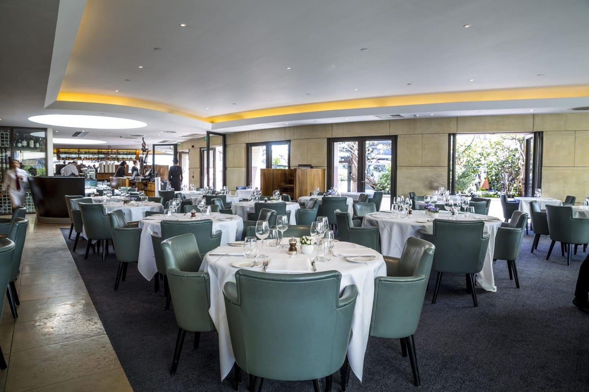

*The indoor room is the half that works in February. Outside there are heaters and wool blankets through the winter, and groups book up to 12.*

It is one of the few City rooftops open year-round, with heaters and wool blankets through the winter, and it takes bookings for groups up to 12. Weekday lunch and dinner, weekend brunch and Saturday dinner — the pattern of a restaurant that feeds the Square Mile first.

### Smiths of Smithfield, Farringdon

*££ · Farringdon · No.3 Rooftop, 67–77 Charterhouse Street EC1M · Cited by 5 sources · [its site](https://www.smithsofsmithfield.co.uk/)*

Four floors of one Young's-owned building with three separate kitchens in it, and the roof is the top one: a glass-walled dining room with an outdoor terrace attached and Smithfield Market laid out below. Panoramic windows inside and heaters outside make it a year-round room rather than a June one.

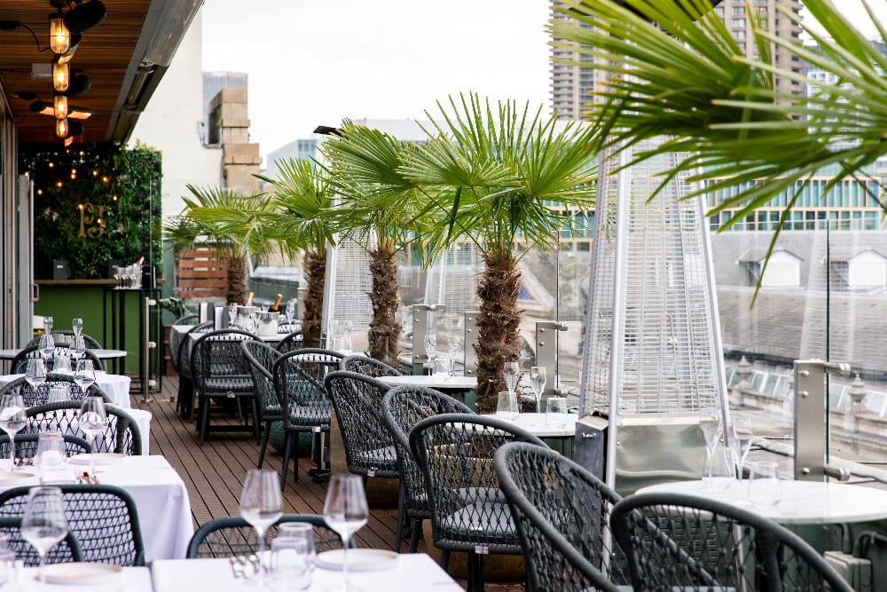

*The heaters are what make the terrace a year-round table. Food stops at 9.30pm, and the whole building is private hire only on Sundays.*

The floor everyone assumes is a steakhouse is not — **the No.3 rooftop is the seafood kitchen**, and The Grill, two AA rosettes and all, is downstairs. Order oysters and whole fish up here and the dry-aged beef on the way out. The catch that ruins a plan: **the whole building is private hire only on Sundays**, and food stops at 9.30pm the rest of the week.

### Aviary, Finsbury Square

*££ · Moorgate · roof of the Montcalm Royal London House, Finsbury Square · Cited by 6 sources · #5 of 10, Ugo Arinzeh · [its site](https://etmcollection.co.uk/venue/aviary-rooftop-restaurant-terrace-bar/)*

A wide open-air terrace with an answer to winter: **heated igloos on the terrace through the colder months**, which turn a November booking into a plausible idea. Inside is a full dining room, so a downpour is an inconvenience rather than a cancellation.

The cooking is contemporary British and charcoal-led — prime cuts through a Bertha oven, responsibly sourced fish — and it runs from breakfast through to late, which almost no other rooftop here does.

### The Marksman, Hackney Road

*££ · Hackney Road · first-floor terrace, 254 Hackney Road E2 7SB · #3 of 15, Time Out · [its site](https://www.marksmanpublichouse.com/)*

Third on Time Out's rooftop ranking and the least rooftop-like thing on it: a first-floor terrace above a Hackney Road pub with **room for about twenty people on a first-come, first-served basis**. No booking, no lift, no skyline — just the top deck of the number 55 going past at eye level.

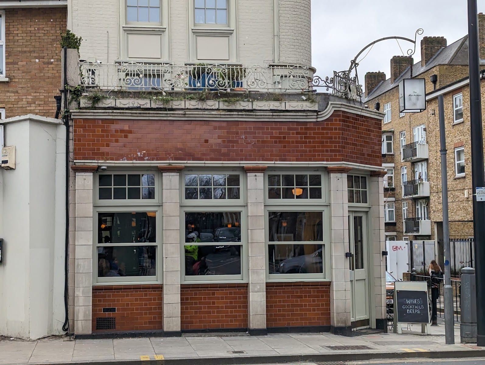

*Street level, on Hackney Road. The terrace is upstairs and out of shot; the full menu is served on it.*

What it has is the kitchen. The Marksman is a serious gastropub, and you can eat the full menu outside rather than a bar-snack version of it. The two-course Sunday lunch is £38, three for £42. Go early on a bright day or do not go at all.

### The Devonshire, Soho

*££ · Soho · third floor, 17 Denman Street W1D 7HW · Cited by 4 sources · #15 of 15, Time Out · [its site](https://www.devonshiresoho.co.uk/)*

Forty covers on the third floor of the most over-subscribed pub in London, and the rule is unambiguous: **the roof terrace takes no bookings at all**. The pub's own FAQ says it is held for walk-ins, and that a restaurant booking can be moved up there only if you ask in advance and a table works.

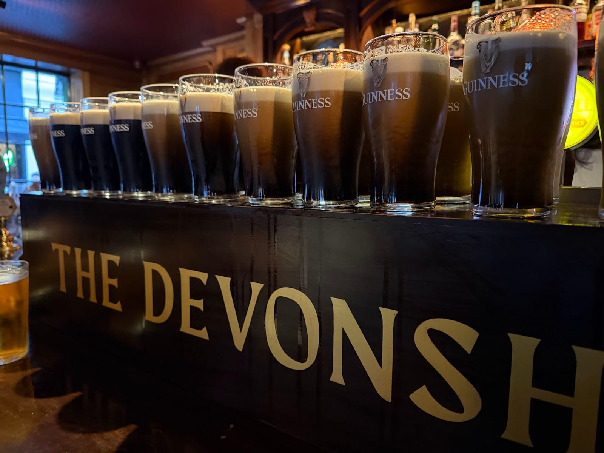

*Pints settle downstairs while the grill and the pie counter run upstairs. Sunday lunch is £29.50.*

The kitchen is the reason people queue — Guinness poured properly downstairs, a grill and a pie counter upstairs, a bacon sandwich made with pork reared by Brett Graham of The Ledbury. Sunday lunch is £29.50. Children are welcome in the restaurant at any time but not in the pub after 5pm on weekdays or at all at weekends, which changes the shape of a family afternoon.

---

Powered by <a target="_blank" rel="sponsored nofollow noopener" href="https://www.getyourguide.com/london-l57/">GetYourGuide</a>

## What happens when it rains

This is the fact that decides a booking in London and the one the lists leave out. Four different answers, and they are not interchangeable.

| Shelter | What it means in October | Where |
| --- | --- | --- |
| **Roof that closes** | The booking holds whatever the forecast says | [Alto by San Carlo](#alto-by-san-carlo-oxford-street), [Angler](#angler-moorgate), Stanley's at The Chesterfield |
| **Glass room beside the terrace** | You move indoors and keep the view | [Boundary Shoreditch](#boundary-shoreditch-shoreditch), [Mercer Roof Terrace](#worth-knowing-briefly), [Smiths of Smithfield](#smiths-of-smithfield-farringdon), [SUSHISAMBA](#where-you-are-paying-for-the-view) |
| **Heaters, blankets or igloos** | Cold is solved, rain is not | [Coq d'Argent](#coq-dargent-bank), [Aviary](#aviary-finsbury-square), The Rooftop St James, [Peggy Jean](#peggy-jean-richmond), [Rick Stein Barnes](#rick-stein-barnes-barnes) |
| **Open air, nothing over it** | A forecast-dependent evening | [The Marksman](#the-marksman-hackney-road), [The Devonshire](#the-devonshire-soho), [Frank's Cafe](#the-cheap-ones), La'Yam above Holborn station |

### Alto by San Carlo, Oxford Street

*££ · Oxford Street · roof of Selfridges · Cited by 3 sources · [its site](https://sancarlo.co.uk/restaurants/london/alto-selfridges/)*

The main restaurant and bar sit under a **fully retractable roof**, with a separate open-air terrace and lounge beside it, so the same booking works in July and in January. It is on top of Selfridges, which means the lift queue is the shopping crowd rather than a hotel lobby.

The kitchen is San Carlo's — a long-running Italian group — so the menu runs from pizza and pasta through to grilled fish, with mains around £20. It is the entry to pick when the forecast is bad and you still want to eat outside.

### The ones that close for months

Seasonal is not a detail here; it is the difference between a plan and a wasted journey.

- **[Frank's Cafe](#the-cheap-ones)**, Peckham — the 2026 season runs **15 May to 12 September**, Wednesday to Sunday, 11am to 11pm. Card only, and no table reservations. *Cited by 3 sources*
- **[The Culpeper](#the-culpeper-spitalfields)**, Spitalfields — the roof garden opens to diners from spring rather than through the winter. *Cited by 5 sources · #1 of 15, Time Out*
- **[The Devonshire](#the-devonshire-soho)**, Soho — Time Out describes the third floor as a seasonal terrace, and it never takes bookings. *Cited by 4 sources*
- **[Towpath](#towpath-haggerston)**, Haggerston — runs a season and closes Mondays and Tuesdays inside it. *Cited by 6 sources · #2 of 16, Time Out*
- **Forza Taps**, South Bank — the summer-only walk-in terrace a level below [Forza Wine at the National Theatre](#forza-wine-at-the-national-theatre-south-bank).
- **Kioku by Endo**, Whitehall — the sixth-floor terrace at The OWO opens for the summer season; the dining room runs all year. *Cited by 2 sources · #10 of 15, Time Out*

---

## Riverside and canalside

The water changes what you are buying. A rooftop sells distance; a riverside table sells the thing going past — tide, boats, the light coming off it. London's sources treat the Thames and the canals as one subject for restaurants, and so does this section. Riverside **pubs** are a separate business and are not here.

### Le Pont de la Tour, Tower Bridge

*£££ · Tower Bridge · Butlers Wharf · Cited by 7 sources · #10 of 16, Time Out · [book a table](https://lepontdelatour.co.uk/book-a-table/)*

Seven sources name it, and only The River Café has more. This is the one with the postcard: a long outdoor terrace pointed straight at Tower Bridge, with the bridge lifting for river traffic in front of the tables. It has been trading on that spot for over thirty years.

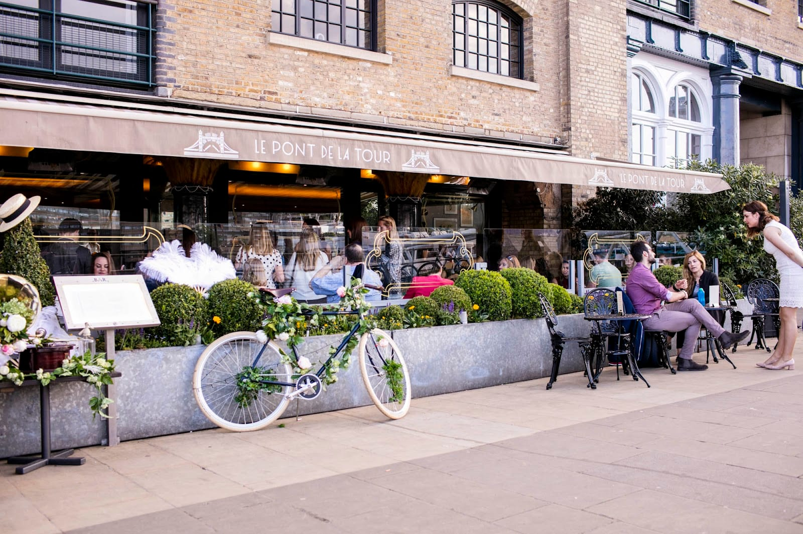

*The terrace sits on the Butlers Wharf promenade, pointed at the bridge. Tables are taken up to 12 people; larger parties go through the events team.*

Inside splits in two — a brasserie-style Bar & Grill and a more formal restaurant — and the cooking is classical French: moules marinière, roast native lobster with garlic butter, a seasonal set menu of two or three courses. Bookings run to 12 people; beyond that it is the events team.

### Sam's Riverside, Hammersmith

*££ · Hammersmith · Crisp Walk, beside Hammersmith Bridge · Cited by 7 sources · The Good Food Guide, waterside · [book a table](https://www.sevenrooms.com/explore/samsriverside/reservations/create/search)*

One of only three London restaurants on The Good Food Guide's waterside list, and the value entry among them: a bright, glassy brasserie a short walk along the towpath from The River Café, doing modern British cooking from small British suppliers. Oysters are the speciality, and the set menu is two courses for £26.60 or three for £31.50 — against a four-pound Good Food Guide rating at The River Café, a few minutes along the same towpath.

There is an outdoor terrace and a private room for 18. Note the sibling: **Sam's Waterside** is a different restaurant from the same owner, further upriver, and the two are easy to book by mistake.

### Rick Stein Barnes, Barnes

*££ · Barnes · Tideway Yard, beside the Thames · Cited by 7 sources · #14 of 16, Time Out · [book a table](https://www.rickstein.com/book-a-table/barnes)*

The London outpost of the Padstow group, on one of the quietest stretches of the river. Cornish lobster, Indonesian seafood curry and daily fish specials off the board; three courses at £35, a children's menu at £7.50, and an oyster happy hour in the Riverside Bar.

Two useful rules from the restaurant itself: **the Riverside Bar takes no bookings** — walk in from 10.30am for coffee, or later for oysters and small plates — and **the courtyard is walk-in only too**, with heaters and blankets but an honest warning that it may close in bad weather.

### Scott's Richmond, Richmond

*£££ · Richmond · 4 Whittaker Avenue, on the riverside · Cited by 6 sources · #6 of 16, Time Out · [its site](https://scotts-richmond.com/)*

The Mayfair seafood room's second site, opened in 2022 on the Richmond waterfront, and named by six sources — as many as anything else upstream. Oysters, crab, caviar and champagne, in a glossy room with a central bar — and a terrace over the Thames that is the entire reason to book here rather than in Mayfair.

If the terrace is full, The Infatuation's advice is the right one: ask for a window table when you book, because the curtains are drawn back onto the river all afternoon.

### Peggy Jean, Richmond

*££ · Richmond · The Boat, Bridge Boathouses, Riverside TW9 1TH · Cited by 6 sources · [book a table](https://booking.resdiary.com/widget/ThreeMonth/PeggyJean/34655)*

A restored Jesus College Oxford barge moored on the Richmond bank, run by the Daisy Green group, and the only entry here where the floor moves with the tide. The menu is Australian all-day — a heavy brunch, then fire-cooked plates in the evening — with coffee from 9am.

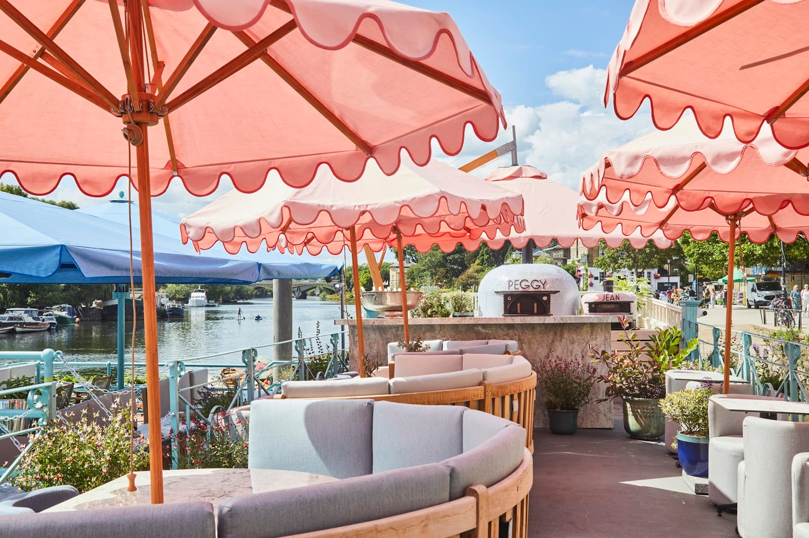

*The evening plates come off those two ovens. The indoor rooms take bookings and this deck does not.*

Three things the operator says plainly and other lists do not. **The indoor rooms take bookings and the terrace does not**; the terrace is covered by umbrellas and heated in cooler months; and the boat sits on a working pontoon on tidal water with open edges and several levels, so children need holding onto and prams have to be folded at the entrance.

### Towpath, Haggerston

*£ · Haggerston · 42 De Beauvoir Crescent, on the Regent's Canal · Cited by 6 sources · #2 of 16, Time Out · [its site](https://www.towpathlondon.com/)*

Four small units cut into the canal wall, almost all the seating outdoors on the towpath itself, and a kitchen that cooks about six things a day very well — fried eggs with mojo verde, a Spanish sausage sandwich, whatever soup is on, cakes. Dog-walkers, cyclists and people who meant to stay twenty minutes.

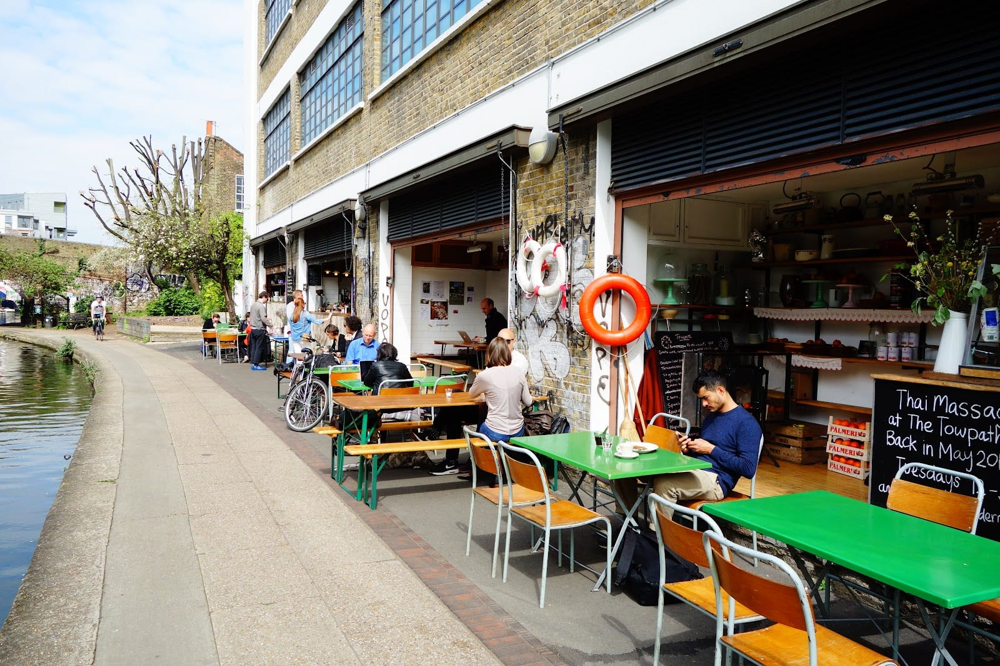

*Shutters up, and nearly all the seating on the towpath itself. Dinner runs Thursday to Saturday when the season is on.*

**No bookings at all — just turn up** — and it runs a season rather than a year, closing Mondays and Tuesdays within it. Dinner service runs Thursday to Saturday evenings when the season is on. Midweek is the version where you get a table.

### OXO Tower Restaurant, South Bank

*£££ · South Bank · eighth floor, Barge House Street · Cited by 5 sources · #12 of 16, Time Out · [book a table](https://oxotowerrestaurant.com/book-a-table/)*

Rooftop and riverside at once, which is rarer than it sounds: eight floors up, on the south bank, with the river and St Paul's filling the glass. Three rooms share the floor — the restaurant, the cheaper brasserie and the bar — and the brasserie is the one to book if the view matters more than the tasting menu.

The thing to know before you plan around it: the Fallow team has taken it on and, per Time Out, will formally take over in 2027, so the kitchen that is there now is not necessarily the kitchen that will be.

### Hawksmoor Wood Wharf, Canary Wharf

*££ · Canary Wharf · Water Street, Wood Wharf · Cited by 5 sources · The Good Food Guide, waterside · [book a table](https://thehawksmoor.com/book-a-table/?location=259269)*

The third and last London entry on The Good Food Guide's waterside list, and the only steakhouse on this page. It sits on the dock at Wood Wharf with tables out on the water's edge, doing the group's usual: dry-aged British beef over charcoal, bone-in prime rib for two, and the Sunday roast that made the chain's name.

The waterside seats go first in summer and the dock is sheltered from the wind in a way the open Thames is not.

### Skylon, South Bank

*££ · South Bank · first floor, Royal Festival Hall · Cited by 3 sources · #16 of 16, Time Out · [book a table](https://skylon-restaurant.co.uk/book-a-table/)*

A wall of glass across the first floor of the Royal Festival Hall, looking over the river to Charing Cross and Westminster, with the theatre crowd moving below. Modern British with a pre-theatre menu that is the point of the place — trout in champagne sauce, crab and prawn linguine — and a bar at one end for people who only want the window.

The whole building runs to curtain-up times, so a pre-theatre table here is timed against the concert hall rather than against a kitchen's guess.

### Swan at Shakespeare's Globe, Bankside

*££ · Bankside · 21 New Globe Walk · Cited by 2 sources · #15 of 16, Time Out · [book a table](https://swanlondon.co.uk/reserve-online/)*

Attached to Shakespeare's Globe on Bankside, with windows straight onto the river and St Paul's lit up on the far side after dark. The upstairs restaurant runs a River View menu of seasonal British cooking — fish from UK waters only, meat from Cumbrian smallholdings, a Sunday roast and a theatrical afternoon tea — while the ground-floor bar does fish and chips, small plates and Guinness for people who have not booked.

Two things to plan around: **dinner service stops at 9.30pm, and the last Sunday sitting is 7pm**, which is early if you are eating after a performance rather than before one. Ask for a window seat when you reserve.

### Also on the water

Linked names, one line each, all named by two or more independent sources.

- **[Sea Containers](https://www.seacontainerslondon.com/)**, South Bank — the hotel's ground-floor all-day restaurant, Tom Dixon interiors and a terrace on the river walk. *Cited by 3 sources*
- **[Emilia's Crafted Pasta](https://www.emiliaspasta.com/book-a-table/)**, St Katharine Docks — a short, handmade pasta menu overlooking the yachts in the dock, and the only entry by Tower Bridge in the ££ band. *Cited by 3 sources*
- **[Barge East](https://reservations.bargeeast.com/)**, Hackney Wick — a century-old Dutch barge on the Lea with a garden, a treehouse and a canoe hire station next to it. *Cited by 4 sources · Whitepost Lane E9 5EN*
- **[Darcie & May Green](https://www.daisygreenfood.com/)**, Paddington — two barges painted by Sir Peter Blake, moored on the Grand Union outside the station, with a 50-metre upper deck. *Cited by 4 sources · #9 of 16, Time Out*
- **[Crate Brewery](https://www.cratebrewery.com/)**, Hackney Wick — pizza and the brewery's own beer on benches at the water's edge; arrive early on a hot day. *Cited by 5 sources · #11 of 16, Time Out*
- **[Cafe Cecilia](https://www.cafececilia.com/)**, London Fields — a small British-Irish room hugging the Regent's Canal; best first thing at the weekend. *Cited by 2 sources · 32 Andrews Road E8 4QF*
- **[Canal](https://www.instagram.com/canal.london/)**, Maida Hill — modern European on the Grand Union at Woodfield Road, with the terrace right on the water. *Cited by 3 sources*
- **[The Cheese Barge](https://www.thecheesebar.com/experiences/the-cheese-barge)**, Paddington — a purpose-built barge doing British cheese and toasties on Sheldon Square. *Cited by 3 sources*
- **[Bingham Riverhouse](hotel:bingham-riverhouse)**, Richmond — a Georgian townhouse hotel with a dining room and garden above the towpath. *Cited by 2 sources*
- **[Wright Brothers](https://thewrightbrothers.co.uk/pages/battersea-seafood-restaurant)**, Battersea Power Station — oysters and a Josper oven by the water at Circus West. *Cited by 2 sources · #4 of 16, Time Out*

---

## Where you are paying for the view

These are the famous ones, and they are famous for altitude rather than cooking. None of them holds a Michelin star; most are named by the lists that sort restaurants by height rather than by the ones that sort them by kitchen. That does not make them bad — it makes them a different purchase, and worth going into with your eyes open.

- **[Aqua Shard](https://www.sevenrooms.com/explore/aquashard/reservations/create/search/)**, London Bridge — **Level 31 of The Shard**, floor-to-ceiling glass, no outdoor space. The Express Lunch starts at £35 and the Twilight menu at £45; the Peter Pan afternoon tea is £70 a head. *Cited by 1 source*
- **[SUSHISAMBA](https://www.sushisamba.com/locations/london-heron-tower)**, Liverpool Street — floors 38 and 39 of the Heron Tower, with an indoor dining room and **two genuine outdoor terraces**, which most towers do not have. Japanese-Brazilian-Peruvian; large plates around £50. *Cited by 5 sources*
- **[Darwin Brasserie](https://skygarden.london/restaurants/darwin-brasserie/)** and **Fenchurch**, Sky Garden — the two restaurants inside the Walkie-Talkie's public garden. **Sky Garden itself is free with a timed ticket**, so eating here is a choice, not an entry fee. *Cited by 2 sources*
- **Shanghai Me**, Park Lane — the 28th floor of the Hilton, art deco throughout, and Time Out is direct about the catch: "you won't be able to get outside or onto a balcony". *Cited by 4 sources · #11 of 15, Time Out*
- **[Duck & Waffle](https://duckandwaffle.com/)**, Liverpool Street — the 40th floor of the same Heron Tower, open around the clock, which is genuinely unusual. Sealed windows. *Cited by 1 source*
- **[Radio Rooftop](https://radiorooftop.com/)**, Strand — on top of ME London at 336–337 Strand, modern Asian sharing plates, and the clearest sightline to the London Eye of anything on this page. Ranked third of ten by the one creator here who ranked them. *Cited by 4 sources*
- **[Madison](https://www.madisonlondon.net/)**, St Paul's — on the roof of One New Change with St Paul's filling the view; a steakhouse menu with indoor seating and several terraces. Two courses £45. *Cited by 3 sources*
- **[Hutong](https://hutong.co.uk/)**, London Bridge — northern Chinese on Level 33 of The Shard. Named by Secret London's rooftop 20 despite having no roof. *Cited by 1 source*

> ⚠️ **A bar with a view is not a restaurant.** Several of the best-known names on London rooftop lists — Pergola on the Wharf, Savage Garden, Skylight, Queen of Hoxton, Netil 360 — are drinking terraces with a food offer attached. They are recorded in the sources behind this guide and left out of it on purpose, because you cannot book a table to eat a meal at a set time.

---

## Pub roofs

The finding nobody else prints: the top of Time Out's rooftop ranking is not a hotel. Its number one is a Spitalfields pub, its number three is a Hackney Road pub and its number fifteen is a Soho pub. All three sit in the ££ band where the tower restaurants sit in £££, and none of them will let you book the roof.

[The Culpeper](#the-culpeper-spitalfields) · [The Marksman](#the-marksman-hackney-road) · [The Devonshire](#the-devonshire-soho), plus:

- **[The Lighterman](https://www.thelighterman.co.uk/)**, King's Cross — a first-floor wraparound terrace over Granary Square with the canal on one side; Time Out's own note is that "it's not technically on the roof, but it's as good as". *Cited by 4 sources · #14 of 15, Time Out*
- **[FM Mangal](https://www.fmmangal.co.uk/)**, Camberwell — a Turkish grill on Camberwell Church Street with a tiny balcony on the roof. Charcoal platters, the house lamb special, and the onion dip everybody writes about. Mains around £15. *#5 of 15, Time Out*

> ⚠️ **The roof keeps different hours from the bar.** The Culpeper clears its terrace at 10pm sharp, The Devonshire's third floor is seasonal, and The Marksman's twenty seats go on a bright day before the pub is even busy.

---

## The cheap ones

Everything here is **£**, under £15 a head, and none of it takes a booking.

- **Frank's Cafe**, Peckham — the roof of a multi-storey car park, run as part of the Bold Tendencies art season. **Open 15 May to 12 September 2026, Wednesday to Sunday, 11am–11pm; card only; no reservations.** Cocktails, draught beer and a short menu cooked to order, with the whole of central London on the horizon. *Cited by 3 sources* · [Bold Tendencies](https://boldtendencies.com/franks-cafe/)
- **[Towpath](#towpath-haggerston)**, Haggerston — canal-side eggs, sandwiches and cake; no bookings, closed Mondays and Tuesdays. *Cited by 6 sources · #2 of 16, Time Out*
- **[Crate Brewery](#also-on-the-water)**, Hackney Wick — pizza and own-brewed beer on benches by the Lea. *Cited by 5 sources*
- **[Pear Tree Cafe](https://www.peartreecafe.co.uk/)**, Battersea — a lakeside café in Battersea Park, and the only entry here you can reach without leaving a park. *Cited by 2 sources*
- **[Market Halls Victoria](https://markethalls.co.uk/locations/victoria/)** — a food hall with a roof terrace above Terminus Place, where you pay street-food prices for a table in the open air a minute from Victoria station. Traders change; the terrace does not. *Cited by 2 sources*

## Recent arrivals

New enough that the lists are still catching up.

- **[Restaurant Gordon Ramsay High](#restaurant-gordon-ramsay-high-liverpool-street)**, 22 Bishopsgate — took its first Michelin star in the 2026 guide, from twelve seats. *Cited by 3 sources · One Michelin star, 2026*
- **[CÉ LA VI](https://ldn.celavi.com/)**, Paddington — the Singapore group's London site, on the 17th and 18th floors of Paddington Square, with indoor and outdoor seating and a clear line to the London Eye. *Cited by 2 sources*
- **Café Clement**, Temple — the ground-floor brasserie of the new St Clement hotel, run by a former River Café head chef. Time Out is honest that the view is the sculpture park on the roof of Temple station rather than the water. *#5 of 16, Time Out*
- **Tower House**, Richmond — the Notting Hill Gold team's riverside restaurant in the old Pitcher & Piano site. *Cited by 1 source*
- **La'Yam Rooftop**, Holborn — Greek cooking on the eighth floor of Kingsbourne House, directly above the Tube station; open-air, skewers £10, mezze platter £25. *Cited by 1 source*

---

## Worth knowing, briefly

Named by the sources but not given a full entry — either because only one or two guides reach them, or because the view is the main event.

| Venue | Area | Price | Cited by | What it is |
| --- | --- | --- | --- | --- |
| **[Mercer Roof Terrace](https://www.vintryandmercer.com/mercer-roof-terrace)** | Bank | ££ | 4 sources | Indoor room with floor-to-ceiling glass doors onto an open terrace, on the Vintry & Mercer hotel. Three courses £35 |
| **[Bōkan](https://bokanlondon.co.uk/)** | Canary Wharf | £££ | 4 sources | Three floors at the top of the Novotel — the 37th is the restaurant, the 38th and 39th are bars. Two courses £49 |
| **[JOIA](https://www.joiabattersea.co.uk/)** | Battersea | £££ | 4 sources | Portuguese cooking by two-Michelin-starred Henrique Sá Pessoa, on the 15th floor above Battersea Power Station |
| **[Kitty Hawk](https://etmcollection.co.uk/venue/kitty-hawk/)** | Trafalgar Square | ££ | 4 sources | Modern British on the Page8 Hotel roof, with indoor dining and terraces over the square |
| **[Wagtail](https://etmcollection.co.uk/venue/wagtail-rooftop-bar-restaurant/)** | Monument | ££ | 3 sources | A ninth-floor dining room and a tenth-floor terrace in a 1920s building, with Tower Bridge and the Gherkin in view |
| **[8 at The Londoner](https://www.thelondoner.com/restaurants-bars/8-at-the-londoner)** | Leicester Square | ££ | 3 sources | Izakaya-style Japanese on the eighth floor, split between a bar, a garden and a terrace |
| **[1 Leicester Square Rooftop](https://1leicestersquarerooftop.com/)** | Leicester Square | ££ | 3 sources | Nine floors up with floor-to-ceiling windows, open from breakfast to late |
| **[Los Mochis London City](https://www.losmochis.co.uk/lc/london-city)** | Liverpool Street | £££ | 3 sources | Japanese-Mexican on the roof at 100 Liverpool Street |
| **[Aqua Kyoto](https://aquakyoto.co.uk/)** | Regent Street | £££ | 3 sources | Japanese, sharing a Regent Street roof terrace with its Spanish sibling Aqua Nueva |
| **[KASO](https://www.onehundredshoreditch.com/eat-drink/kaso-rooftop/)** | Shoreditch | ££ | 2 sources | Eastern Mediterranean on One Hundred Shoreditch, grill and pita around £20 |
| **[The Rooftop St James](https://www.therooftopstjames.com/)** | Trafalgar Square | ££ | 2 sources | Seventh floor of The Trafalgar St James; heaters make it a year-round terrace |
| **[Kioku by Endo](https://kiokulondon.com/)** | Whitehall | £££ | 2 sources | Sixth floor of The OWO, Endo Kazutoshi's Japanese-Mediterranean menu; terrace in summer only |
| **Miradora** | Leicester Square | ££ | 2 sources | A rooftop tequileria and restaurant above Leicester Square |
| **[The Orrery](https://www.orrery-restaurant.co.uk/)** | Marylebone | £££ | 2 sources | A long first-floor room on Marylebone High Street with a roof terrace above it |
| **[Tattu](https://tattu.co.uk/london/)** | Tottenham Court Road | £££ | 2 sources | Contemporary Chinese with a terrace, in the Now Building at Outernet |
| **Sabine Rooftop Bar** | Aldgate | ££ | 2 sources | A small Aldgate roof, seventh of ten in the one ranked video in this guide |
| **[Roe](https://roerestaurant.co.uk/)** | Canary Wharf | ££ | 2 sources | The Fallow team's Wood Wharf restaurant, on the dock rather than above it |
| **[Gaucho Richmond](https://gauchorestaurants.com/restaurants/richmond/)** | Richmond | £££ | 3 sources | Argentinian steak in a converted riverside building on the Richmond bank |

---

## Booking and practical essentials

* **Five hold a Michelin star and nothing else does.** Brooklands (two), Angler, The River Café, OMA and Restaurant Gordon Ramsay High. If the cooking is what you are travelling for, that is the whole list.
* **Book weeks ahead** for Brooklands, The River Café, OMA and Restaurant Gordon Ramsay High — twelve seats at the last one.
* **Several roofs cannot be booked at all.** The Devonshire's terrace, The Marksman's twenty seats, Frank's Cafe, Towpath, Rick Stein Barnes's courtyard and Riverside Bar, The Culpeper's rooftop drinks and Forza Taps are all walk-in. At the rest, the indoor room takes the booking and the terrace is first come, first served — Peggy Jean works exactly that way.
* **Check the roof before you check the forecast.** Only Alto by San Carlo, Angler and Stanley's have a roof that closes over the terrace. Boundary's orangery and the glass rooms at Smiths, Mercer and SUSHISAMBA will keep you dry beside the view rather than in it. Heaters solve cold, not rain.
* **Some of it closes for the winter.** Frank's Cafe runs 15 May to 12 September 2026; The Culpeper's roof opens to diners from spring; Kioku's terrace is summer only; Towpath runs a season and shuts Mondays and Tuesdays within it.
* **You never have to buy a meal for the view.** Sky Garden is free with a timed ticket, and Horizon 22 on Level 58 of 22 Bishopsgate is a free viewing platform two floors below a Michelin-starred restaurant.
* **The cheapest way onto a good roof** is the oyster happy hour at Seabird, 3–6pm daily, or Frank's Cafe in season.
* **Two family notes.** Children are not allowed in The Devonshire's pub after 5pm on weekdays or at all at weekends, though they are welcome in the restaurant; and Peggy Jean sits on a working pontoon on tidal water with open edges, so children need supervising and prams have to be folded at the entrance.
* **Service charge** of 12.5% is discretionary and standard on London restaurant bills.

---

## Continue planning your London trip

- 🍽️ **[Eat in London: Restaurants, Food Markets & Quick Food Hub](/articles/eat-in-london-guide/)**
- 🌇 **[The Best Views in London](/articles/best-views-london/)**
- 🪑 **[The Best Places to Eat Outside in London](/articles/eat-outside-london/)**
- 🦪 **[The Best Seafood Restaurants in London](/articles/best-seafood-restaurants-london/)**
- 🍸 **[The Best Cocktail Bars in London](/articles/best-cocktail-bars-london/)**
- 📸 **[The Most Instagrammable Restaurants in London](/articles/most-instagrammable-restaurants-london/)**
- 🚶 **[London Walks Along the Thames](/articles/london-walks-along-the-thames/)**
- ⛴️ **[How to Use London's River Boats](/articles/how-to-use-london-river-boats/)**
- 🎭 **[South Bank Area Guide](/articles/south-bank-area-guide/)**
- 🏙️ **[Canary Wharf Area Guide](/articles/canary-wharf-area-guide/)**
