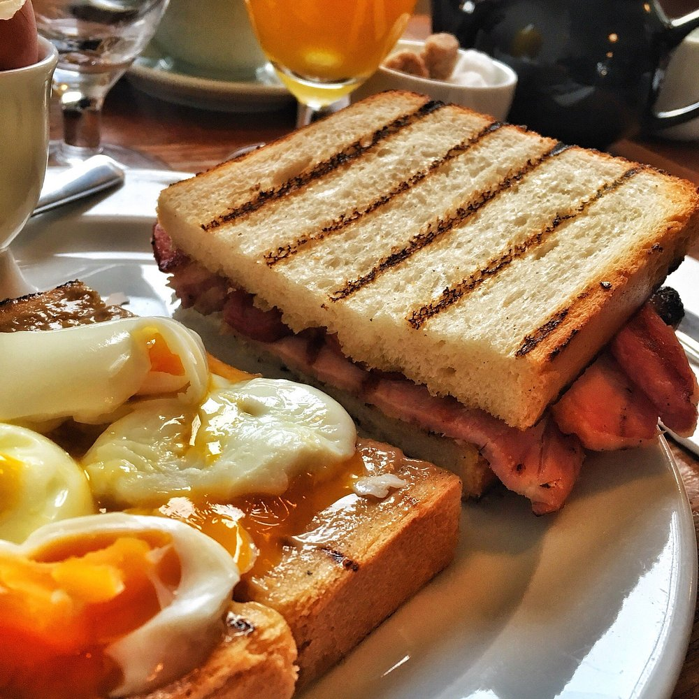
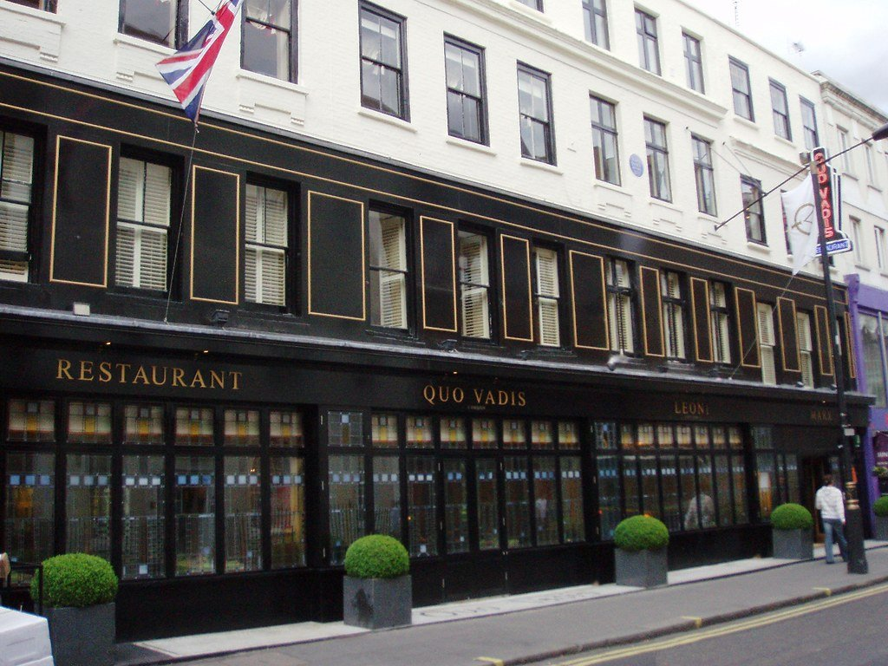

The sandwich that turns up on more independent London lists than any other is not a modern creation. It is a **salt beef beigel on Brick Lane**, sold at four in the morning from a shop that has not changed its mind about anything since 1974.

The modern shops are worth your time too — but there is a pattern in them worth knowing before you order. Max's, Paul Rothe, Secret Sandwich Shop, Sons + Daughters and the Dusty Knuckle are all most famous for **an egg sandwich**. If you only try one thing from the new wave, that is what to try.

> 💡 **The Short Version:** **Beigel Bake** on Brick Lane for salt beef, open 24 hours. **Max's Sandwich Shop** for the Ham, Egg 'n' Chips. **Paul Rothe & Son** has been cutting sandwiches into triangles since 1900. **Kappacasein** does the toastie, three days a week only. And **Quo Vadis** in Soho does the smoked eel sandwich, which is the most famous individual sandwich in the city.

> 📘 **How we choose these (editorial note)**
> No paid placements. These are drawn from a wide spread of sources rather than any single list - the food and travel press, the big listings sites, independent blogs and specialists, video, and what Londoners recommend themselves - and cross-referenced against each other. Sandwich shops keep short hours and several are weekday-only or pre-order-only, so check before making a special trip.

## Where they are

| If you are near… | Where to eat |
| --- | --- |
| **Brick Lane & Spitalfields** | Beigel Bake, The Beigel Shop, St John Bread and Wine |
| **Soho** | Quo Vadis, Crunch, I Camisa & Son, Lina Stores |
| **Spitalfields** | St John Bread and Wine, Crunch |
| **Marylebone** | Paul Rothe & Son |
| **Borough Market** | Kappacasein, The Black Pig |
| **Farringdon & Clerkenwell** | The Three Compasses, Scotti's Snack Bar, Tongue & Brisket |
| **The City** | Porterford Butchers |
| **King's Cross** | Sons + Daughters |
| **Notting Hill** | Secret Sandwich Shop |
| **Dalston & Hackney** | The Dusty Knuckle, Bánh |
| **Stroud Green** | Max's Sandwich Shop |
| **Westminster & Southwark** | Regency Café, Terry's Café |
| **Shepherd's Bush** | Sam Sandwiches, Mr Falafel |
| **South London** | Chatsworth Bakehouse, Milk (Balham) |

---

## Salt beef, and the Brick Lane rivalry

### Beigel Bake, Brick Lane

*£7.50 salt beef beigel · open 24 hours, every day*

**The white shopfront.** Opened in 1974 by Asher Cohen after a falling-out with his brother, who ran — and whose family still runs — the shop a few doors down. It makes around three thousand beigels a day.

The **salt beef beigel is £7.50**, with mustard and a gherkin, and the salt beef sandwich £8.50. Smoked salmon and cream cheese is £4.50. There is no menu beyond the traditional list and there never has been.

Open **twenty-four hours a day, every day of the year**, which makes it the single best answer to the question of where to eat at four in the morning.

### The Beigel Shop, Brick Lane

*Open 24 hours, every day*

**The yellow shopfront**, and the older claim — beigels have been sold at this address since **1855**, which if true makes it the oldest beigel business in Britain.

It closed in February 2024 during a family dispute over the building and the owner's ill health, and **reopened that June**, now run by the next generation. It sells rainbow beigels and, to the horror of purists, **bacon**.

> **Which one?** Go by the colour, not the number — the street numbers are reported inconsistently almost everywhere. White is Beigel Bake and strictly traditional; yellow is the Beigel Shop and will sell you bacon on a beigel. Londoners will tell you with total confidence that one is definitively better, and they will not agree with each other.

### Tongue & Brisket, Leather Lane

*£8 salt beef sandwich · also Goodge Street and Wardour Street*

Home-cured salt beef carved to order, and the most reliable sit-down version in central London. **Classic salt beef £8**, or £10 large; the **Reuben is £9.50**; ox tongue the same price as the beef.

**Leather Lane runs Monday to Friday 7.30am–4pm and Saturday 10am–3pm, closed Sunday**, at 24–26 Leather Lane, EC1N 7SU. **Wardour Street** (199 Wardour Street, W1F 8JP) goes to 8pm and is **the only branch open on a Sunday**, 11am–6.30pm. There is a third at **23 Goodge Street, W1T 2PL**, open to 6.30pm on Thursdays and Fridays.

So: Leather Lane for the original and the market street around it, Wardour Street if it is a Sunday or after 4pm, Goodge Street if you are north of Oxford Street.

### Porterford Butchers, the City

*Weekdays only · hot food 7am–2pm*

A working butcher's counter that describes itself as **the last butcher left in the City of London**, trading since 1983, which does a salt beef baguette with pickles and mustard on the side.

**Monday to Friday only**, and the hot counter stops at 2pm — the butcher's counter itself runs 6am to 6pm, but the salt beef is a morning-and-lunchtime proposition. The baguette is **£8.50 regular, £10.50 large**, and the mustard is a 20p addition rather than a given.

**There is a queue and there is a way round it.** Their own site pushes online ordering explicitly to beat it, with collection through porterfordshotfood.co.uk, though online orders carry a **£20 minimum** so it only works for a group. Regulars describe a queue twenty deep after midday.

At **72 Watling Street, EC4M 9BJ**, two minutes from Mansion House. This is a sandwich for people who work nearby rather than a destination — which is rather the point of it.

---

## The modern sandwich shops

### Max's Sandwich Shop, Stroud Green

*19 Crouch Hill N4 4AP · £15.50–£16.50 · closed Mon–Tue*

The shop the modern London sandwich movement starts from, and the one name that comes up in almost every conversation about sandwiches in this city.

**"Ham, Egg 'n' Chips"** is still the one: slow-cooked ham hock, piccalilli, a fried egg, shoestring fries and malt vinegar mayo. It should not work as a sandwich and it does. **£15.95** — this is the most expensive sandwich on the page after Quo Vadis, and it is a plated restaurant dish that happens to be between bread.

The list has moved on since most write-ups: **This Is How We Spring Roll** at £15.50, **The Korean Gangster** at £16.50 and **Et Tu, Brute?** at £15.95 are all current.

> ⚠️ **The hours everyone quotes are wrong, including ours until now.** It is **not** open to 11pm. Their own listing gives **Wednesday to Friday 5–9pm, Saturday noon–3pm and 5–9pm, Sunday noon–4pm, closed Monday and Tuesday.** So it is an evening shop four days a week, it does weekend lunch that nobody mentions, and turning up on a Monday gets you nothing.

### Paul Rothe & Son, Marylebone

*35 Marylebone Lane · trading since 1900*

A fourth-generation family delicatessen that has been on Marylebone Lane **since 1900**, cutting sandwiches into triangles and charging very little for them.

**Egg mayonnaise with anchovy** is the order, though the pastrami, cheese and pickle on rye and the roast beef with mango chutney have their own constituencies. Still recommended constantly, which for a shop that has changed almost nothing in over a century is quite a thing.

### Secret Sandwich Shop, Notting Hill

*103 Talbot Road W11 2AT · around £8.80 · shuts at 3pm*

Japanese-style **sando** on white Tokyo milk bread — soft, crustless, and cut to show the filling. The **egg salad** is the signature and their own description is precise about why it works: an egg front and centre, watercress, dijon and Kewpie mayo. About **£8.80**.

The crisps sandwich is still there but it has changed: it is now **Crispy Greens** — green beans, avocado, pickles, cucumber, jalapeños and salt-and-vinegar McCoy's. The tuna version this guide previously described is off the menu.

**It closes at 3pm, seven days a week**, and that is the fact that decides the visit. Their own site is inconsistent about when it opens — the banner says 8am and the footer says 11am — so if you are going early, go on the assumption of 11 and treat 8 as a bonus. Ladbroke Grove or Westbourne Park, five minutes either way.

### Sons + Daughters, King's Cross

*Unit 119a, Coal Drops Yard N1C 4DQ · £7–£12*

From James Ramsden and Sam Herlihy of Pidgin, relaunched in 2024 with a more chef-led menu. The **egg salad** uses Burford Brown eggs with miso mayo, rocket and pea shoots, with **truffle crisps served on the side** rather than blended into the mayo — a distinction worth making because the crisps are half the pleasure.

**The price spread is much wider than usually reported**: the Egg Salad and Mortadella are **£7**, while the Chicken and the Merguez are **£12**. So this is both one of the cheapest and one of the dearer entries here, depending entirely on what you order.

**There is a separate breakfast menu that stops at 11am** — four numbered sandwiches, and they sell out. There is also **S+D Go**, a van on Granary Square, for when the queue inside is long.

### The Dusty Knuckle, Dalston

*Abbot Street Car Park E8 3DP · £7.60 · daily 8am–3.30pm*

A bakery first and a sandwich shop second, which is the right order — the bread is the reason the **Egg, Chilli & Cheese** works as well as it does: pickled green chillies, spring onions and coriander on focaccia, **£7.60**, or £9.80 with bacon added.

**It opens every day, 8am to 3.30pm**, which makes it one of very few places on this page you can rely on at a weekend as well as a weekday. The Dalston site is in a car park off Abbot Street and looks it from outside.

The roast chicken and pesto focaccia has rotated off. The current lunch line-up alongside the egg is a sweet potato and tofu sarnie, a fennel sausage and greens sarnie, a gorgonzola, cavolo and walnut sarnie, and a cheese toastie.

Three sites: Dalston, **Harringay at 429 Green Lanes N4 1HA**, and a van at Highbury Fields. It is also a social enterprise that trains young people at risk, which is not why it is on this list but is worth knowing.

### Crunch, Soho and Spitalfields

*60 Dean Street, W1D 6AW · Old Spitalfields Market, E1 6EW*

Everything is built on a **golden brioche loaf** rather than bread, which is the whole proposition and the reason it divides people — rich, sweet and closer to a bun than a sandwich. The **chicken katsu** is the one to order: deep-fried breast, tonkatsu sauce and Japanese apple jam, and the cheapest thing on the board at **£12**.

Prices run to **£19 for the lobster roll**, which puts it at the expensive end of this page for something you eat standing up. Ten seats in Soho and fast turnover; the Spitalfields site is a market counter.

**Spitalfields opened in July 2022 and Soho in April 2025.** Soho runs Mon–Sat 11.30am–9pm and Sunday 11am–8pm; Spitalfields 11am–8pm. Both are walk-in only, and both deliver.

### Chatsworth Bakehouse, Crystal Palace

*116 and 120a Anerley Road SE19 2AN · Wed–Sat only*

Weekly limited-edition focaccia and a cult following across south London, run out of two adjoining units on Anerley Road that do different jobs — which is the thing to understand before you go.

**120a is the pre-order collection point.** You order online, you collect between **12.30pm and 4pm, Wednesday to Friday**, and on Saturdays it serves fresh slices straight from the oven **from 1pm**.

**116 is the walk-in bakery**, open **Wednesday to Friday 12.30–4pm and Saturday 11am–4pm.** This guide previously said there was no walk-in counter and that was wrong — there is one, two doors down.

**Closed Monday and Tuesday** either way. Crystal Palace or Anerley station, both about ten minutes.

---

Powered by <a target="_blank" rel="sponsored" href="https://www.getyourguide.com/london-l57/">GetYourGuide</a>

## Toasties

### Kappacasein, Borough Market

*£8 · Thursday to Saturday only*

The default answer to the best toastie in London, and one of the few genuinely famous things at Borough Market that deserves it.

**A mix of cheeses, mostly Montgomery's cheddar**, with onions and leeks between two slices of Poilâne sourdough, for **£8**. That is how the stall itself now describes it — worth saying, because the four-cheese recipe that gets repeated everywhere is not what their own menu claims today. Bill Oglethorpe started it in 2008 using surplus market cheese and bread, and he makes the raclette himself in Bermondsey.

**The raclette is a separate dish, not part of the toastie** — Ogleshield or London Raclette melted over potatoes, also £8. Plenty of people queue expecting one and get the other.

> ⚠️ **Thursday and Friday 10am–5pm, Saturday 9am–5pm, and nothing the rest of the week.** Closed Sunday through Wednesday. This catches out more visitors than anything else in this guide. At 1 Stoney Street, SE1 9AA. Expect a queue; it moves.

### The Black Pig, Borough Market

*Borough Market Kitchen · £11.50–£13.50 · closed Monday*

Thirty seconds from Kappacasein and the porchetta counterweight to it. The menu is now three sandwiches rather than a choice between two ideas:

* **"The best one"**, £13.50 — slow-roast free-range pork with honey truffle parm mayo, fennel and apple slaw, peperoncini sott'olio, salsa verde and 30-month aged parmesan. The salsa verde and the truffle parm are both in it; older write-ups, this one included, presented them as alternatives.
* **Honey Truffle Parm**, £12.50.
* **"The veggie one"**, £11.50 — smoked pulled oyster mushroom, and the only vegetarian sandwich at this end of the market.

**Tuesday to Saturday 10am–5pm, Sunday 10am–4pm, closed Monday.** At Borough Market Kitchen, Winchester Walk, SE1 9AG.

> ⚠️ **Their website is theblackpigsandwiches.co.uk.** The shorter theblackpig.co.uk is a parked domain-for-sale page and nothing to do with them, which has led people to assume they have closed. They have not.

---

## Bacon, sausage and the caff

### St John Bread and Wine, Spitalfields

*94–96 Commercial Street E1 6LZ · lunch from noon, daily*

Fergus Henderson's **bacon sandwich** on soft white bread is the benchmark every other London bacon butty is measured against. Simple to the point of austerity, and correct.

> ⚠️ **There is no breakfast service, which trips people up badly.** The earliest seating of the day is **noon**, every day of the week — lunch runs to 3pm, a bar menu fills 3pm to 5pm, and supper starts at 5.30pm on weekdays and 6pm at weekends. If you are making a special trip for the bacon sandwich, go at lunch and check it is on that day's menu, because the kitchen writes a new one daily and it is not a permanent fixture.

*The smaller, more casual St John. The doughnuts sell out and the bacon sandwich is the famous one. Photo: [gruntzooki](https://www.flickr.com/photos/37996580417@N01/30397319856), [CC BY-SA 2.0](https://creativecommons.org/licenses/by-sa/2.0/).*

### Regency Café, Westminster

*17–19 Regency Street · Mon–Sat, closed Sundays*

The 1946 black-tiled frontage, the order shouted across the room, and a **set breakfast at £9.99** — one egg, two bacon, sausage, beans or tomatoes, toast or bread, and tea or coffee. It has appeared in *Layer Cake* and *Pride* among others, and is the most photographed caff in London.

**Monday to Saturday 7am to 3.30pm, closed Sunday.** There is usually a queue out of the door by nine on a Saturday and it is a fast room, so it moves.

> 💡 **It changed hands, and that is worth knowing before you read an old review.** Claudia Perotti and Marco Schiavetta, who had run it since 1994, retired and sold up in late 2024. It closed briefly and reopened under new owners, **Fevzi and Zafer Gungor**, who have talked about extending the hours and taking the name abroad. The hours on their own site are unchanged as we write, and the room is intact — but if you find a piece describing the old family, it is out of date rather than describing today.

17–19 Regency Street, SW1P 4BY, ten minutes from Westminster or Pimlico.

### Terry's Café, Southwark

*156–158 Great Suffolk Street SE1 1PE · daily 7.30am–3pm*

Family-run since 1982, founded by Terry and now run by his son **Austin**, and a survivor of everything Southwark has been through since. The bacon and sausage sandwiches are the reason to go rather than the full breakfast, though there is now a Terry's Breakfast Burger competing for attention.

**The kitchen stops at 2.30pm even though the room stays open until 3** — half an hour that catches out anyone arriving on a late morning that has drifted.

The sourcing is the thing they are proudest of and it is local: bread from **St John Bakery**, coffee from **Monmouth**, and produce from Davies Bakery in Bermondsey. It now trades as Terry's Bar & Grill in the evening as well, bookable through OpenTable. Borough or Southwark, five minutes.

### Scotti's Snack Bar, Clerkenwell

*Clerkenwell Green · open since 1967*

The caff that people in the food world actually eat at, known for a **chicken escalope sandwich** thick enough to need two hands, and egg and bacon rolls.

**It has been on Clerkenwell Green since 1967**, opened when the area was still widely called Little Italy, and it remains one of the standard refreshment stops for London's black-cab drivers — which is the single best indicator of a caff worth using that this city has.

There is no website and no published menu, so this is a turn-up-and-see operation. Farringdon is five minutes away.

---

## Fish

### Quo Vadis, Soho

*26–29 Dean Street · closed Sundays*

**The smoked eel sandwich** — toasted bread, horseradish cream, pickled onion — is the most famous individual sandwich in London, the only one here that comes from a proper restaurant kitchen, and **£18.50** on the current menu. That is the top of the market and it has been worth it for years.

Jeremy Lee has been making it for years and it has outlasted every trend that has passed through Soho since. **2026 is the restaurant's centenary** — it opened in 1926 — and the current menu is running as a calendar of centenary dishes, so this is a better year than most to go.

**Lunch is noon to 2.30pm and dinner 5pm to 10pm, Monday to Saturday, closed Sunday.** The bar is the cheap way in: you can have the sandwich there without booking a table. 26–29 Dean Street, W1D 3LL.

*Karl Marx lived upstairs. The smoked eel sandwich at the bar is the cheap way in. Photo: [Ewan-M](https://www.flickr.com/photos/55935853@N00/2588280146), [CC BY-SA 2.0](https://creativecommons.org/licenses/by-sa/2.0/).*

### Milk, Balham

*18–20 Bedford Hill SW12 9RG · £16.50 · walk-in only*

The **fish sando** — panko-fried fish on shokupan with house tonkatsu sauce, Japanese mayo, fukujinzuke daikon and togarashi, **£16.50** — and the best fish sandwich outside central London. An Antipodean café that has taken one sandwich extremely seriously since 2012.

**The fish rotates.** Their menu says fish of the day and tells you to ask, so the red snapper that every guide names, this one included until now, is one possibility rather than the recipe.

**No bookings at all**, first come first served, and the host tells you the wait when you arrive. **Card only — they do not take cash**, which is worth knowing on a page full of places where cash is still normal. Balham station is five minutes.

### Billingsgate Market Café, Poplar

*Trafalgar Way · very early morning only · closing by 2028*

A **bacon and scallop roll** in a market traders' café, where the scallops come off the floor downstairs. The most genuinely London thing in this guide, and it requires getting up before the fish market shuts for the day.

> ⚠️ **Go sooner rather than later.** The City of London Corporation confirmed in November 2024 that **Billingsgate will close permanently by 2028**, with the Poplar site redeveloped for housing; traders keep going in place until then. The London Fish Merchants Association says around 90% of traders intend to carry on somewhere else, but a café that exists to feed fish porters at four in the morning has no obvious life after the market it serves. This is the one entry on this page with an expiry date.

---

## Market sandwiches worth the trip

### Sam Sandwiches, Shepherd's Bush

*9 Shepherd's Bush Market*

**"Sam's Special"** — an Algerian street sandwich with merguez, kofte, egg, salad and **chips inside it**. Halal, enormous, and the best value large sandwich in London by reputation.

### Mr Falafel, Shepherd's Bush

*Units T4/T5, New Shepherd's Bush Market W12 8LH · £8–£9.75*

Palestinian falafel wraps roughly the size of your forearm, in something close to a dozen builds. The **classic** is hummus, griddled aubergine and pickled vegetables with tahini, and the fried cauliflower and fried potato versions are real menu items rather than options you have to ask for.

**Prices are published and they are low**: the Falafel and Feta Cheese Wrap is **£8.75**, the Deluxe **£9.00**, the Supreme and the Falafel with Spicy Potatoes **£9.75**, and the Vegetable Cocktail Wrap, which has no falafel in it at all, **£8.00**.

You can order ahead through Deliveroo rather than queue. A few minutes from Sam Sandwiches — **do both in one trip**, they are the reason to come to this market.

### Bánh, Dalston

*Kingsland Road*

Six **bánh mì** on the menu — char siu pork, pâté, pork belly — on the stretch of Kingsland Road that has been London's Vietnamese quarter for decades.

### Shree Krishna Vada Pav, Harrow

*57 Station Road, Harrow HA1 2TY · 100% vegetarian*

**Vada pav**: a spiced potato filling fried in gram-flour batter, served in a bap with a fried green chilli and three chutneys, from Maharashtra. Whether it counts as a sandwich is a good argument to have while eating one.

**The whole operation is vegetarian**, which the write-ups rarely mention, and it has grown from one Harrow shop into a mini-chain of fifteen-plus branches — Wembley, Tooting, Croydon, Southall, Ilford, Vauxhall and a central one on Eastcastle Street among them. The Harrow original is the one worth the trip.

**Monday to Thursday 10am–9pm, Friday and Saturday 9am–9.30pm, Sunday 9am–9pm.** Harrow-on-the-Hill is five minutes' walk. The address is 57, not the 55 this guide gave before.

---

Powered by <a target="_blank" rel="sponsored" href="https://www.getyourguide.com/london-l57/">GetYourGuide</a>

> 📅 **Every price, opening time and address on this page was checked against the venue's own website, menu or delivery listing on 2 September 2026.** Where a shop publishes nothing at all — and several of the best ones here do not — we say so rather than repeating a figure we could not stand behind.

## Best value

A sandwich is already the cheap option, but the spread here runs from about £4.50 to £11 and the cheapest things are often the best.

* **Beigel Bake**, Brick Lane — **smoked salmon and cream cheese at £4.50**, salt beef at £7.50, twenty-four hours a day. The best value on this page and arguably in London.
* **Tongue & Brisket** — **£8** for home-cured salt beef, which undercuts most central London sandwich shops selling considerably less.
* **Kappacasein**, Borough Market — **£8** for the four-cheese toastie, Thursday to Saturday.
* **The caffs.** Regency Café's set breakfast is **£9.99**; Terry's and Scotti's are cheaper still for a bacon roll. These are full meals, not snacks.
* **Markets.** **Borough Market**, **Shepherd's Bush Market** (Sam Sandwiches and Mr Falafel, both enormous and both cheap) and **Old Spitalfields** are where the value is concentrated.
* **Go at the right time.** Porterford's hot counter stops at 2pm and Secret Sandwich Shop trades four hours a day — the cheap places are often the ones with the shortest hours.

---

## What to know

* **Check the trading days before you travel.** Kappacasein is Thursday to Saturday. Secret Sandwich Shop opens for four hours. Chatsworth Bakehouse is pre-order only, Mondays at 12:30. Porterford and Regency close at weekends. This category keeps shorter hours than any other kind of food business in London.
* **The egg sandwich is the tell.** Max's, Paul Rothe, Secret Sandwich Shop, Sons + Daughters and the Dusty Knuckle are each best known for one. If a new sandwich shop is good, its egg sandwich will show it.
* **Cash is still a thing here.** The beigel shops and several of the caffs are cash-friendly in a way the rest of London stopped being. Carry some.
