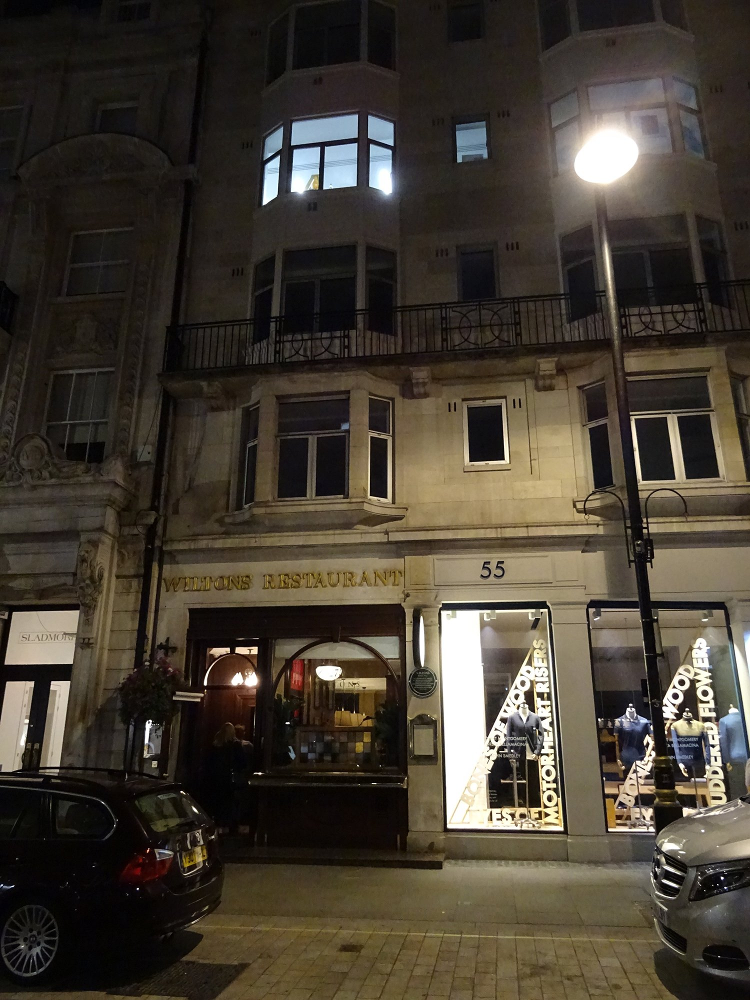
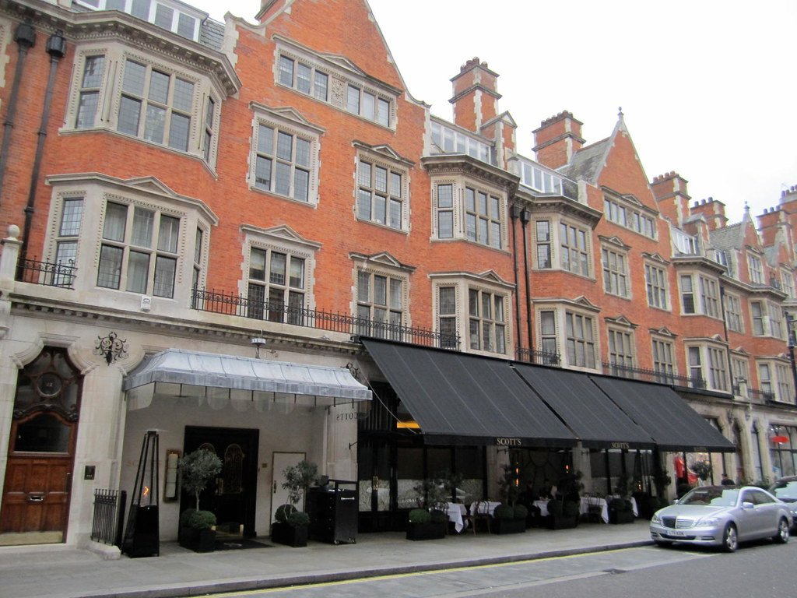

London is not a coastal city and eats like one anyway. **Billingsgate** is the largest inland fish market in the country, and the best kitchens here buy from it before dawn.

The interesting development is fishmongers opening restaurants — you eat what the trade eats, in the building it is sold from.

> 💡 **The Short Version:** **The Sea, The Sea** is a fishmonger with a bistro above it. **Kima** does Greek whole-fish cooking properly. **Wright Brothers** is the oyster default. **Billingsgate** is open to the public before dawn. And **oysters at happy hour** are under £2.

> 📘 **How we choose these (editorial note)**
> No paid placements. These are drawn from a wide spread of sources rather than any single list - the food and travel press, the big listings sites, independent blogs and specialists, video, and what Londoners recommend themselves - and cross-referenced against each other. Fish and chips is covered separately — it is a different meal.

## Where they are

| If you are near… | Where to eat |
| --- | --- |
| **St James's & Mayfair** | Wiltons, Scott's, Bentley's |
| **Covent Garden & Theatreland** | J Sheekey, Parsons, The Oystermen |
| **Soho** | Randall & Aubin, Manzi's, The Seafood Bar |
| **The City** | Sweetings |
| **Chelsea & Sloane Square** | The Sea, The Sea |
| **Marylebone** | Kima |
| **Borough & Bermondsey** | Wright Brothers, Applebee's, Maltby Street |
| **Southwark** | Seabird |
| **Battersea** | Wright Brothers, Joia |
| **Queensway** | Mandarin Kitchen |
| **Fitzrovia** | Cometa |
| **Hackney** | Behind |
| **Hammersmith** | Sam's Riverside |
| **Canary Wharf** | Billingsgate Fish Market |

**Price guide:** **£** under £15 · **£££** £40–£70 · **££££** £90+.

---

## The best

### The Sea, The Sea, Chelsea

*££££ · 2 min from Sloane Square*

**The fishmonger that supplies Ikoyi and KOL**, now with a 40-seat bistro above and a ten-seat seafood bar below. You are eating what London's best kitchens are buying, in the building they buy it from.

The counter downstairs is the seat to want.

### Kima, Marylebone

*££££ · 8 min from Baker Street*

**Whole fish and Greek seafood cooking treated at fine-dining level**, which almost nothing else in London does. Fish is chosen from ice and cooked simply.

### Oma, Borough

*££££ · 2 min from London Bridge*

Greek cooking over fire at serious prices, upstairs from its own more casual sibling at Borough Market.

---

## Oysters

### Wright Brothers

*£££ · Borough, Battersea and others*

The London oyster default, and the happy hours are genuinely cheap — **under £2 an oyster** at the right time of day. Borough is the original.

### Maltby Street Market, Bermondsey

*£ · weekends*

Oyster stalls under the railway arches at weekend prices, eaten standing up.

### Randall & Aubin, Soho

*£££ · Brewer Street*

A converted butcher's shop with marble counters and disco — champagne and shellfish in the middle of Soho, and no bookings.

Powered by <a target="_blank" rel="sponsored" href="https://www.getyourguide.com/london-l57/">GetYourGuide</a>

---

## The old oyster houses

London has eaten oysters commercially for a very long time, and five rooms still trading were founded before the First World War. They are not interchangeable.

### Wiltons, St James's

*££££ · 55 Jermyn Street · closed Sundays*

**Founded in 1742**, which makes it older than everything else in this guide by more than a century — it started as George William Wilton's shellfish stall near the Haymarket.

A marble-topped oyster bar, Dover sole meunière and a carving trolley, none of it modernised because there is no reason to. Saturday is dinner only, and Sunday it shuts.

> The certificate displayed on its website is a Michelin Guide listing rather than a star. Wiltons does not hold one, and several guides get this wrong.

*Trading since 1742. Oysters, game and a dress code that is not entirely a joke. Photo: [Spudgun67](https://commons.wikimedia.org/w/index.php?curid=72552746), [CC BY-SA 4.0](https://creativecommons.org/licenses/by-sa/4.0/).*

### Scott's, Mayfair

*££££ · 20 Mount Street*

**Trading since 1851**, and the grandest seafood dining room in London — the Mount Street room where Mayfair goes to be seen eating crustacea.

Two policies worth knowing before you book: under-sixes are admitted only at weekend and holiday lunch, and from May 2026 it takes assistance dogs only.

*Mayfair's grand fish restaurant, and the crustacea counter is the thing to sit at. Photo: [La Citta Vita](https://www.flickr.com/photos/49539505@N04/12620350394), [CC BY-SA 2.0](https://creativecommons.org/licenses/by-sa/2.0/).*

### Sweetings, City of London

*££ · 39 Queen Victoria Street · weekday lunch only*

**At its Queen Victoria Street site since 1889**, with a trading lineage back to 1830, and almost nothing about it has moved since.

You sit at **long marble counters on stools** while staff serve from behind, which is the purest oyster-bar format left in the city. West Mersea natives, **Dover sole at £31**, **fish pie at £13.50**, and a Black Velvet alongside.

> ⚠️ **Weekday lunch only, 11.30am to 3pm, and no reservations.** There is no dinner service and there never has been. This catches out more people than anything else in this guide.

### J Sheekey, Covent Garden

*££££ · 28–32 St Martin's Court*

**Since 1896**, in a warren of small wood-panelled rooms off St Martin's Court, with a **central crustacea bar** and a fish pie that has outlasted every fashion London dining has been through.

The theatre crowd's restaurant, and still the best pre- or post-show fish in the West End.

### Bentley's Oyster Bar and Grill, Piccadilly

*££££ · 11–15 Swallow Street*

**Shucking since 1916** and now Richard Corrigan's — an oyster bar on the ground floor and a grill room above, which amount to two quite different evenings.

Native oysters, Dover sole, lobster thermidor. Sit at the oyster bar downstairs unless you want the full dinner.

---

## Modern fish rooms

### Behind, Hackney

*££££ · Michelin star · 18 seats*

Andy Beynon's eighteen-seat horseshoe counter, and **the fastest Michelin star in British history** — awarded in January 2021 after roughly twenty days of trading.

A surprise tasting menu built entirely around fish, around £98 for eight courses. There are eighteen seats, so book a long way out.

### Parsons, Covent Garden

*£££ · 39 Endell Street · closed Sundays*

Tiny, chalkboard-only, and **the menu changes every day** according to what came in. Whole roasted turbot, gurnard, Inverawe smoked salmon with Guinness bread.

The critics' favourite among the small fish restaurants, and the hardest of them to get into for its size.

### Manzi's, Soho

*£££ · Bateman's Buildings*

A two-storey seafood room with the oyster bar spilling out into the alley.

Be clear what it is: **a 2023 opening from the Wolseley group**, not a continuation of the original Manzi's, which closed in Chinatown decades ago. A good restaurant borrowing an old name.

### The Seafood Bar, Soho

*£££ · 77 Dean Street*

A Dutch import — the family were Volendam fishmongers from 1984 and opened the first Seafood Bar in Amsterdam in 2012. This is **their only London site**.

Platters on crushed ice, smoked eel, North Sea crab. Less formal than anything else here at the price.

### Applebee's, Borough Market

*£££ · 5 Stoney Street*

A **family-run Borough Market fixture since 1999**, with a fishmonger's counter at the front and a chef's counter behind it cooking over live fire.

Hand-dived scallops, brown crab rarebit, dry-aged Dover sole. The best thing to eat sitting down at Borough Market.

### Sam's Riverside, Hammersmith

*£££ · 1 Crisp Walk*

A Thames-side room by Hammersmith Bridge with a terrace, and a **set menu at £26.60 for two courses** — the best-value sit-down fish on this page. **£5 corkage on Mondays**, which is worth planning around.

---

## Fish as the whole point

### Mandarin Kitchen, Queensway

*£££ · lobster noodles*

A **whole lobster over ginger and spring onion noodles** — the dish most London Chinese restaurants are measured against.

### Cometa, Fitzrovia

*£££ · Mexican seafood*

Tostadas, ceviche and aguachile — **Mexican seafood specifically**, rather than the meat-led menu everywhere else runs.

### Joia, Battersea

*££££ · fourteen floors up*

Portuguese cooking beside the Power Station, and one of very few serious Portuguese kitchens in London.

---

## The market

### Billingsgate Fish Market, Canary Wharf

*Free to enter · before dawn*

The **UK's largest inland fish market**, trading from around 4am a few minutes from the towers. The public can buy, and it is finished by about 8am.

Go early, wear boots you do not mind ruining, and bring cash and a cool bag.

---

## Best value

Seafood has a reputation as the most expensive thing on a London menu. These are the ways round it.

#### Oyster happy hours

The best-value trick in London dining. Several serious oyster bars discount hard in the dead hour between lunch and dinner:

* **Manzi's**, Soho — Oyster Hour, Tuesday to Friday 5.30–6.30pm: **£2 an oyster, or £9 for half a dozen.**
* **Sam's Riverside**, Hammersmith — **£2 an oyster** at happy hour, on a terrace by the river.
* **Seabird**, Southwark — daily 3–6pm, **£3 an oyster**, from what it claims is the longest oyster list in London.
* **The Oystermen**, Covent Garden — Bubbles 'n' Oysters, daily 3–5pm: **six oysters and a glass of crémant for £10.**
* **Wright Brothers** run their own at under £2 an oyster.

#### Markets, and eating standing up

* **Borough Market** — **Applebee's** fish sandwich counter is around £8 and one of the best cheap lunches in London, from a stall trading since 1999.
* **Maltby Street Market**, weekends — oysters and shellfish eaten standing up in a railway arch at a fraction of restaurant prices.
* **Billingsgate Fish Market** — the traders' café does a bacon and scallop roll, and the whole thing is over by 8am.

#### Sit-down value

* **Sweetings** — Dover sole £31, fish pie £13.50, in a room from 1889. Weekday lunch only.
* **Sam's Riverside** — two courses £26.60, three for £31.50.
* **Whole fish for the table** at Kima or Oma works out far better per head than a fillet each.

---

## What to know

* **Whole fish is priced by weight** and the waiter will show you the fish first. Ask what it will come to before agreeing.
* **Billingsgate is over by 8am.** It is not a mid-morning activity.
* **Oyster happy hours** are usually mid-afternoon and early evening on weekdays.
* **Native oysters are September to April**; rock oysters are year-round. The natives are the ones worth the premium.
* **Fish and chips is a separate guide** — see below.

---

## Continue planning your London trip

- 🐟 **[The Best Fish and Chips in London](/articles/best-fish-and-chips-london/)**
- 🛍️ **[London Markets by Day](/markets/)**
- ⭐ **[Special Occasion Restaurants in London](/articles/special-occasion-restaurants-london/)**
- 🍽️ **[Eat in London: Restaurants, Food Markets & Quick Food Hub](/articles/eat-in-london-guide/)**
- 🏙️ **[Borough and South Bank Area Guide](/articles/south-bank-area-guide/)**
- 🛍️ **[Chelsea Area Guide](/articles/chelsea-area-guide/)**
