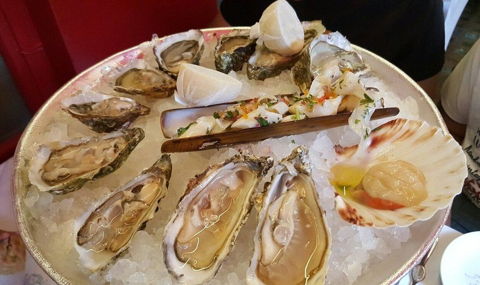
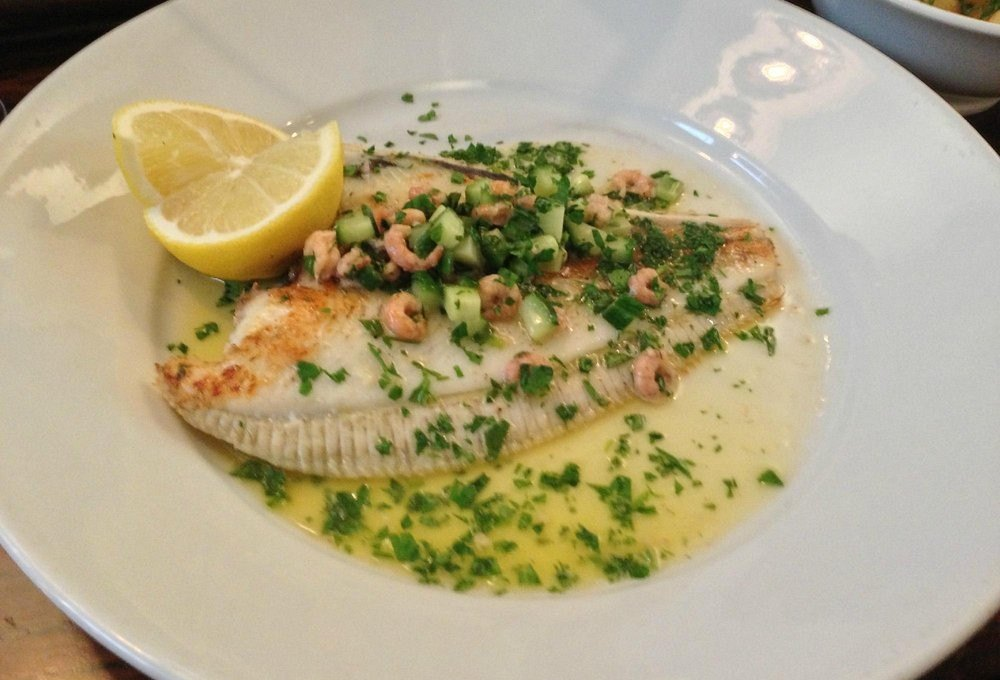
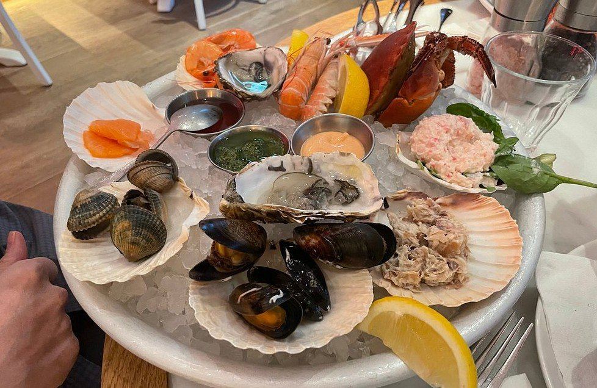

London has no coastline and eats fish better than most places that do, because the boats drive through the night. Cornish day boats, Devon crab, Scottish langoustines and oysters off beds in Essex and Dorset are on a menu here the morning after they came out of the water.

The city does it three ways, and picking one settles most of the decision: shucked at an **oyster counter**, cooked whole over **charcoal**, or bought across a **fishmonger's slab** and cooked in the room behind it. So rather than add another opinion, we counted — every restaurant below is placed by how many independent awards, critics and reviewers name it, and the two rooms London agrees on most are also two of the oldest.

> 💡 **The Short Version:** **J Sheekey** is the most-cited seafood restaurant in London, and **Scott's** is second. **Wiltons** has been trading since 1742. **The Sea, The Sea** is a working fishmonger with a bistro above it. **Behind** and **Angler** are the starred fish kitchens. **Manzi's** and **Sam's Riverside** do £2 oysters. And **Billingsgate** is open to the public before dawn.

> 📊 **The evidence behind this guide**
> Nothing here is ranked on one visit. This pass reads **15 sources carrying 187 citations** across **107 named restaurants**. **31 restaurants are named by two or more independent sources; 8 carry a dated award.**
> **Built on:** sixteen sources including the Good Food Guide and Michelin, giving eight venues here a dated award. Four sources are oyster specialists.
> *Evidence rebuilt 30 August 2026 · [How we rank →](/how-we-rank/)*

## Where they are

  

    Map of the best seafood restaurants in London
  

  

    
Loading the interactive map…

  

  <noscript>
    
The interactive map requires JavaScript. Every entry below lists its area.

  </noscript>

| If you are near… | Where to eat |
| --- | --- |
| **St James's & Mayfair** | Wiltons, Scott's, Lilibet's |
| **Piccadilly & Soho** | Bentley's, Randall & Aubin, Manzi's, The Seafood Bar |
| **Covent Garden** | J Sheekey, Parsons, The Oystermen |
| **The City & Moorgate** | Sweetings, Angler |
| **Borough & Bermondsey** | Wright Brothers, Applebee's, Furness, Richard Haward's, Maltby Street |
| **Southwark** | Seabird |
| **Chelsea & Sloane Square** | The Sea, The Sea, Bibendum Oyster Bar |
| **Hackney & Shoreditch** | Behind |
| **Notting Hill & west** | Orasay, Faber, Sam's Riverside |
| **North London** | Tollington's, London Shell Co |
| **Barnes** | Rick Stein |
| **Canary Wharf** | Billingsgate Fish Market |

**Price guide:** **£** under £15 · **££** £15–£35 · **£££** £40–£70 · **££££** £90+.

---

## The most-cited seafood restaurants in London

### J Sheekey, Covent Garden

*££££ · Leicester Square · Cited by 9 sources*

The most-cited seafood restaurant in London by a clear margin — nine independent sources: five editorial mastheads, two specialists and two video reviewers. Nothing else in this sources is close.

**Since 1896**, in a warren of small wood-panelled rooms off St Martin's Court, with a central crustacea bar and a fish pie that has outlasted every fashion London dining has been through. The Infatuation calls it a West End post-theatre hangout where you are guaranteed a good seafood meal; Time Out puts it fourth on its ranking and calls it the grand dame of theatreland.

Sit at the counter for half a dozen and the fish pie rather than booking the dining room.

*The crustacea counter at J Sheekey — oysters, a razor clam and a scallop dressed in its shell. This is what to order at the bar rather than a table.*

**Book:** [j-sheekey.co.uk](https://j-sheekey.co.uk/) · 28–34 St Martin's Court, WC2N 4AL

### Scott's, Mayfair

*££££ · Green Park · Cited by 7 sources*

**Trading since 1851**, and the grandest seafood dining room in London — the Mount Street room where Mayfair goes to be seen eating crustacea. Hot Dinners describes it as a gold-plated celebrity hangout that also happens to be one of London's oldest restaurants; both halves are true.

There is a second site in Richmond with a Thames view, which The Infatuation rates for a long lunch.

Two policies worth knowing before you book: **under-sixes are admitted only at weekend and holiday lunch**, and from May 2026 it takes **assistance dogs only**.

*Mayfair's grand fish restaurant, and the crustacea counter is the thing to sit at. Photo: [La Citta Vita](https://www.flickr.com/photos/49539505@N04/12620350394), [CC BY-SA 2.0](https://creativecommons.org/licenses/by-sa/2.0/).*

**Book:** [scotts-restaurant.com](https://scotts-restaurant.com/) · 20 Mount Street, W1K 2HE

### Bentley's Oyster Bar & Grill, Piccadilly

*££££ · Piccadilly Circus · Cited by 6 sources · Good Food Guide*

**Shucking since 1916** and now Richard Corrigan's. An oyster bar on the ground floor and a grill room above, which amount to two quite different evenings — Hot Dinners frames it exactly that way, and the upstairs is where the Dover sole is.

One of only eight restaurants here carrying a dated award, and Corrigan's own line in a 2026 video is about sourcing straight from farms and trawlers rather than through a wholesaler.

Sit at the oyster bar downstairs unless you want the full dinner.

**Book:** [bentleys.org](https://bentleys.org/) · 11–15 Swallow Street, W1B 4DG

### Wright Brothers

*£££ · Borough, Battersea and South Kensington · Cited by 6 sources · Good Food Guide*

**An oyster bar with fish arriving from Devon daily and a specials board that changes with the boat** — the company started as an oyster supplier and still farms its own in the Duchy of Cornwall's waters, which is why the shellfish is better than the price suggests.

**Oysters** are the order and the reason it exists: native and rock, listed by bed, with a proper shucking counter. Beyond them, whole fish, a **fruits de mer** for the table, and pies in winter.

**£££, book a few days ahead.** Borough Market, Soho and Battersea among others; the Borough site is the original and the loudest.

*Whole plaice with brown shrimp and cucumber at Wright Brothers Borough. The specials board changes with the boat, so this is the kind of thing to look for rather than the thing to order.*

### Seabird, South Bank

*£££ · Blackfriars · Cited by 5 sources*

**Fourteen floors up on Blackfriars Road** from the team behind Brooklyn's Maison Premiere — a rooftop room with a terrace and one of the better southward views in London.

The proposition is oysters and the view: it claims **London's longest oyster list**, alongside ceviche, whole fish and a Mediterranean-leaning menu. **The oyster happy hour runs daily from 3pm to 6pm and is the cheapest way into the room.**

**£££ and it books weeks ahead** for a terrace table. Go at the happy hour and stay for sunset — that is the whole play.

### Wiltons, St James's

*££££ · Green Park · Cited by 4 sources · closed Sundays*

**Founded in 1742**, which makes it older than everything else in this guide by more than a century — it started as George William Wilton's shellfish stall near the Haymarket.

A marble-topped oyster bar, Dover sole meunière and a carving trolley, none of it modernised because there is no reason to. Saturday is dinner only, and Sunday it shuts.

> **It does not hold a Michelin star.** The certificate displayed on its website is a Michelin Guide listing, and several guides report it as a star.

*Trading since 1742. Oysters, game and a dress code that is not entirely a joke. Photo: [Spudgun67](https://commons.wikimedia.org/w/index.php?curid=72552746), [CC BY-SA 4.0](https://creativecommons.org/licenses/by-sa/4.0/).*

**Book:** [wiltons.co.uk](https://wiltons.co.uk/) · 55 Jermyn Street, SW1Y 6LX

### Parsons, Covent Garden

*£££ · Covent Garden · Cited by 4 sources · Good Food Guide · closed Sundays*

Tiny, chalkboard-only, and the menu changes every day according to what came in. Whole roasted turbot, gurnard, potted shrimp croquettes, Inverawe smoked salmon with Guinness bread.

The critics' favourite among the small fish rooms — an award, two mastheads and a specialist behind it — and the hardest of them to get into for its size. The Infatuation calls it a sanctuary from the Covent Garden crowds, which is the honest reason to book it.

**Book:** [parsonslondon.co.uk](https://parsonslondon.co.uk/) · 39 Endell Street, WC2H 9BA

### The Seafood Bar, Soho

*£££ · Tottenham Court Road · Cited by 4 sources*

**A Dutch import** — the family were **Volendam fishmongers from 1984** and opened the first Seafood Bar in Amsterdam in 2012. This is their only London site.

**The fruits de mer is what the rest of the room is looking at**: a tiered ice platter of oysters, langoustines, crab and prawns, brought out whole. Beyond it, grilled fish, fried plates and a raw bar, in a bright white-tiled room built around the ice counter.

**£££, book a few days ahead.** Dean Street. Order the platter for two even if you think it looks like too much.

*The fruits de mer at The Seafood Bar. This is the one for two people, and it is the reason the rest of the room keeps looking over.*

### Randall & Aubin, Soho

*£££ · Piccadilly Circus · Cited by 4 sources · no bookings*

**The marble counters of the old butcher's shop are still in place and there is a disco ball over the dining room** — over twenty years on Brewer Street, and **it takes no bookings at all.**

Champagne and shellfish is the format: **oysters, lobster, a fruits de mer**, and rotisserie chicken for anyone who wandered in by mistake. The music is loud, the seating is stools at high counters, and it is one of the most reliably fun rooms in Soho.

**£££, walk-in only** — put your name down and drink in Soho until they call. Busiest from seven; easiest at five or after ten.

---

Powered by <a target="_blank" rel="sponsored" href="https://www.getyourguide.com/london-l57/">GetYourGuide</a>

## The old oyster houses

London has eaten oysters commercially for a very long time, and several rooms still trading were founded before the First World War. They are not interchangeable.

### Sweetings, City of London

*£££ · Mansion House · Cited by 3 sources · weekday lunch only*

**At its Queen Victoria Street site since 1889**, with a trading lineage back to 1830, and almost nothing about it has moved since. You sit at long marble counters on stools while staff serve from behind — the purest oyster-bar format left in the city.

West Mersea natives, **Dover sole at £31**, **fish pie at £13.50**, and a Black Velvet alongside. The Infatuation's description of it is four words long and exactly right: a historical landmark serving seafood to signet rings.

> ⚠️ **Weekday lunch only, 11.30am to 3pm, and no reservations.** There is no dinner service and there never has been. This catches out more people than anything else in this guide.

**More:** [sweetingsrestaurant.com](https://sweetingsrestaurant.com/) · 39 Queen Victoria Street, EC4N 4SF

### Manzi's, Soho

*£££ · Tottenham Court Road · Cited by 3 sources*

A two-storey seafood room off Soho Square with the oyster bar spilling into the alley, and the most useful set of prices in central London:

* **Oyster Hour** — Jersey and Poole rock oysters **from £2**, 3pm to 7pm Tuesday to Saturday and **all day Sunday**.
* **Lunch set menu** — two courses £16, three for £20.
* **Evening theatre menu** — three courses with a drink, £29.50.

Be clear what it is: **a 2023 opening from the Wolseley Hospitality Group**, not a continuation of the original Manzi's, which closed in Chinatown decades ago. A good restaurant borrowing an old name — and it cooks the classics through a fish lens, so the Wellington is monkfish and the soufflé is smoked haddock.

**Book:** [manzis.co.uk](https://manzis.co.uk/) · 1 Bateman's Buildings, W1D 3EN

### The Oystermen, Covent Garden

*£££ · Covent Garden · Cited by 3 sources · Good Food Guide*

**A tiny Covent Garden room with about thirty covers**, built entirely around the shucking counter — one of the smallest serious fish restaurants in central London.

**Oysters** from British and Irish beds, listed and changed daily, with a short menu of whole crab, grilled fish and shellfish around them. The kitchen is essentially a counter, so the cooking is direct: heat, butter, lemon.

**£££, book a few days ahead** — it is small enough that walk-ins rarely work. Henrietta Street, two minutes from the piazza.

---

## Fishmongers that opened restaurants

The most interesting thing happening in London seafood: you eat what the trade buys, in the building it is sold from.

### The Sea, The Sea, Chelsea

*££££ · Sloane Square · Cited by 3 sources*

**A fishmonger's counter with a chef's table behind it** — named after the Iris Murdoch novel, and the most unusual seafood format in this guide.

By day it sells fish; in the evening it turns into a **counter tasting menu built entirely around what did not sell** — raw, cured and lightly cooked plates served to a handful of seats. The Hackney site does the same thing on a larger scale.

**£££ and the counter books weeks ahead.** Pavilion Road, Chelsea. Buy fish in the afternoon and come back for dinner if you want the full idea.

### Applebee's, Borough Market

*£££ · London Bridge · Cited by 2 sources · Time Out #3*

**A family-run Borough Market fixture since 1999 that started as a fishmonger and turned into a restaurant**, with **the counter still at the front and live-fire cooking behind it** — you buy fish at the door and eat it at the back.

The grill does whole fish and shellfish over charcoal: **whole seabass, king prawns, scallops in the shell**, plus a fish curry that regulars order over anything grilled. Market produce means the board changes constantly.

**£££, book a few days ahead**, and note it keeps market hours — this is lunch and early evening rather than a late dinner.

### Behind, London Fields

*££££ · London Fields · Cited by 2 sources · Michelin star*

**Andy Beynon's eighteen-seat horseshoe counter took a Michelin star in January 2021 after roughly twenty days of trading — the fastest in British history.**

**A surprise tasting menu built entirely around fish**: you are told nothing in advance and the sequence depends on what arrived. Everything is cooked and served by the chefs across the counter, a foot from where you are sitting.

**££££, open Wednesday to Saturday only** — closed Sunday, Monday and Tuesday — **and it books weeks ahead.** Eighteen seats is the constraint on everything.

### Angler, Moorgate

*££££ · Moorgate · Cited by 2 sources · Michelin star · Good Food Guide*

**A rooftop dining room at the South Place Hotel** with **an all-seafood tasting menu built around British fish and shellfish** — the most formal fish cooking in the City, and the only Michelin-starred fish restaurant in it.

The menu is a fixed sequence of British catch treated at fine-dining level: **Cornish turbot, native lobster, Isle of Skye scallops**, with sauces reduced in the classical French manner. There is a terrace for the warmer months.

**££££ and it books weeks ahead.** Moorgate. The set lunch is significantly cheaper than the evening tasting menu.

### Faber, Hammersmith

*£££ · Hammersmith · Cited by 3 sources · Time Out #10*

**A light-filled corner room from a pair who ran a seafood pub in the East End first**, so the supply lines were already in place before they opened.

**Watch the blackboard** — the menu changes with the catch — and the **chalkstream trout tartare** is the standing recommendation, a farmed British trout raised in chalk-fed rivers and served raw with sharp seasoning. Whole fish and shellfish behind it.

**£££, book a few days ahead.** Hammersmith, and one of very few reasons to eat in that part of west London.

### Orasay, Notting Hill

*£££ · Ladbroke Grove · Cited by 2 sources*

**Named after a Hebridean island**, and cooking Scottish and Irish seafood in a small Notting Hill room — Jackson Boxer's kitchen, and one of the quieter serious fish restaurants in London.

The sourcing is the argument: **hand-dived scallops, Hebridean langoustines, oysters from named beds**, cooked simply and served with more restraint than the postcode usually allows. The menu changes with the boats.

**£££, book a few days ahead.** Small, calm, and better at lunch than dinner if you want to hear anything.

### Sam's Riverside, Hammersmith

*£££ · Hammersmith · Cited by 2 sources*

**A Thames-side room by Hammersmith Bridge with a terrace, and the best-value sit-down fish on this page** — Sam Harrison's brasserie, and the reason to be in Hammersmith at all.

**Two courses at lunch for well under the going rate**, built on whole fish, fish pie and a shellfish counter, in a bright room with the river through the windows. The à la carte runs to Dover sole and crab for anyone spending properly.

**£££, book a few days ahead** — the terrace goes first and is the reason to plan around the weather.

### Fish Market, Broadgate — closed

*Closed as of September 2026*

The 18th-century warehouse off Bishopsgate, once owned by the East India Company, with a serious City wine list and a weekend seafood brunch.

**It is currently closed.** Its own site says it is preparing for a new chapter and points customers to Liverpool Street Chop House in the meantime. A reopening was advertised for early 2026 and has not happened. Worth a check before writing it off for good — but do not plan a meal around it.

---

### Lilibet's, Mayfair

*££££ · Green Park · Cited by 2 sources*

**The newest room on this list to be picked up by more than one source, and the priciest** — named in both The Handbook's survey and a 2026 video review.

A Mayfair dining room built on British seafood at the luxury end: **native lobster, turbot, caviar service**, plated formally and priced for Green Park. It is the least characterful entry in this guide and the most expensive, which is worth saying plainly.

**££££ and it books ahead.** Two sources and no track record yet — read the citation count as "new and noticed" rather than "proven".

---

Powered by <a target="_blank" rel="sponsored" href="https://www.getyourguide.com/london-l57/">GetYourGuide</a>

## Oysters, and where they are cheap

The best-value trick in London dining. Several serious oyster bars discount hard in the dead hour between lunch and dinner.

| Where | When | Price |
| --- | --- | --- |
| **Manzi's**, Soho | Tue–Sat 3–7pm, all day Sunday | Jersey and Poole rocks **from £2** |
| **Sam's Riverside**, Hammersmith | Happy hour | Jersey Rock and Carlingford Lough **£2** |
| **Oyster Boy**, various | Standard | **£2 an oyster, six for £10** |
| **Seabird**, Southwark | Daily 3–6pm | Happy hour, fourteen floors up |
| **The Oystermen**, Covent Garden | Afternoons | Bubbles and oysters at the raw bar |

**And eaten standing up:**

* **Furness Oyster Bar**, Borough Market — 5 Bedale Street. A stall rather than a restaurant, and named by both The Infatuation and Luxury London for exactly that. Grab-and-go.
* **Richard Haward's Oysters**, Borough Market — wild rather than farmed, from the family's own patch of Mersea seabed. Nine generations of it.
* **Maltby Street Market**, Bermondsey — weekends only, in a railway arch, at a fraction of restaurant prices.

> **Native oysters run September to April**; rock oysters are year-round. The natives are the ones worth the premium, and the ones the season actually matters for.

---

## The market

### Billingsgate Fish Market, Canary Wharf

*Free to enter · before dawn*

**The UK's largest inland fish market**, trading from around 4am a few minutes from the Canary Wharf towers — **the public can buy**, and it is finished by about 8am.

This is where most of the restaurants on this page get their fish, several hours before they open. Bring cash, bring a cool bag, and expect to buy in quantity — traders sell by the box rather than the fillet. **The traders' café does a bacon and scallop roll** that is the best reason to be awake at that hour.

**Free to enter, before dawn, and closed Sunday and Monday.** Wear shoes you do not mind ruining; the floor is wet throughout.

---

## Also named, with less behind them

Everything else the sources carry by two or more independent sources, plus the single-source picks that a ranked list put near the top.

| Venue | Where | Price | Sources | What it is |
| --- | --- | --- | --- | --- |
| **Tollington's** | Finsbury Park | £££ | 1 · Time Out #1 | Time Out's number one — a Spanish-leaning seafood bar in an old chip shop, from the Plimsoll team |
| **Kima** | Marylebone | ££££ | 1 · Time Out #5 | Greek fin-to-gill cooking with a zero-waste policy; you may end up eating an entire gilt-head bream |
| **Cometa** | Fitzrovia | £££ | 1 · Time Out #8 | Mexican seafood specifically — tostadas, ceviche, aguachile, and not a taco in sight |
| **Rick Stein** | Barnes | £££ | 3 · Time Out #17 | The TV chef's only London site, on the Mortlake towpath; the Indonesian seafood curry is the order |
| **Bibendum Oyster Bar** | South Kensington | £££ | 1 | Claude Bosi's French seafood bistro on the ground floor of Michelin House; platters and caviar |
| **London Shell Co** | Highgate | £££ | 1 | The Paddington barge operation's permanent restaurant and fishmonger; the menu follows the landings |
| **Mandarin Kitchen** | Bayswater | £££ | 1 | Whole lobster over ginger and spring onion noodles — the dish other London Chinese kitchens are measured against |
| **Sea Garden & Grill** | Tooting | ££ | 1 · Time Out #18 | Small plates of seafood on Tooting Broadway Market |
| **Dinings SW3** | Chelsea | ££££ | 1 · Time Out #20 | Japanese, expensive, and the sustainability credentials are real |
| **The Grand Duchess** | Paddington | £££ | 1 | A permanently moored restaurant in the basin; Cornish crab flatbreads |
| **Chapel Market Kitchen** | Islington | £££ | 1 | Restaurant and oyster bar buying off the market it sits on |
| **Lyons** | Crouch End | £££ | 1 | Whole-fish cooking that uses the collars and the offcuts, not just the fillets |

> **Cornerstone in Hackney Wick has closed**, and is still carried by at least one live guide. This is common enough that it is worth checking a restaurant is trading before you travel — published lists update slowly, and some never do.

---

Powered by <a target="_blank" rel="sponsored" href="https://www.getyourguide.com/london-l57/">GetYourGuide</a>

## What to know

* **Whole fish is priced by weight** and the waiter will show you the fish first. Ask what it will come to before agreeing.
* **Sweetings is weekday lunch only** and takes no bookings. Wiltons shuts on Sundays. Randall & Aubin takes no bookings at all.
* **Billingsgate is over by 8am.** It is not a mid-morning activity.
* **Oyster happy hours** are mid-afternoon into early evening, and the two at £2 are Manzi's and Sam's Riverside.
* **Native oysters are September to April.** Rock oysters are year-round.
* **Fish and chips is a separate guide** — a different meal with a different set of sources.

---

## Continue planning your London trip

- 🐟 **[The Best Fish and Chips in London](/articles/best-fish-and-chips-london/)**
- 🥩 **[The Best Steak in London](/articles/best-steak-restaurants-london/)**
- 🍖 **[The Best Sunday Roast in London](/articles/best-sunday-roast-london/)**
- 🛍️ **[London Markets by Day](/markets/)**
- ⭐ **[Special Occasion Restaurants in London](/articles/special-occasion-restaurants-london/)**
- 🍽️ **[Eat in London: Restaurants, Food Markets & Quick Food Hub](/articles/eat-in-london-guide/)**
- 🏙️ **[Borough and South Bank Area Guide](/articles/south-bank-area-guide/)**
