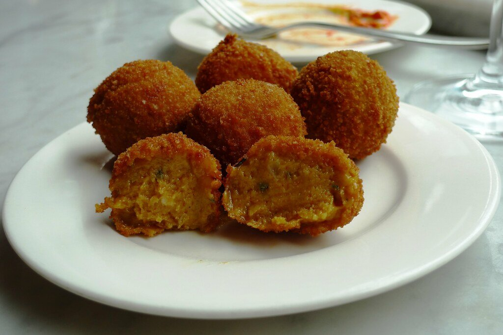
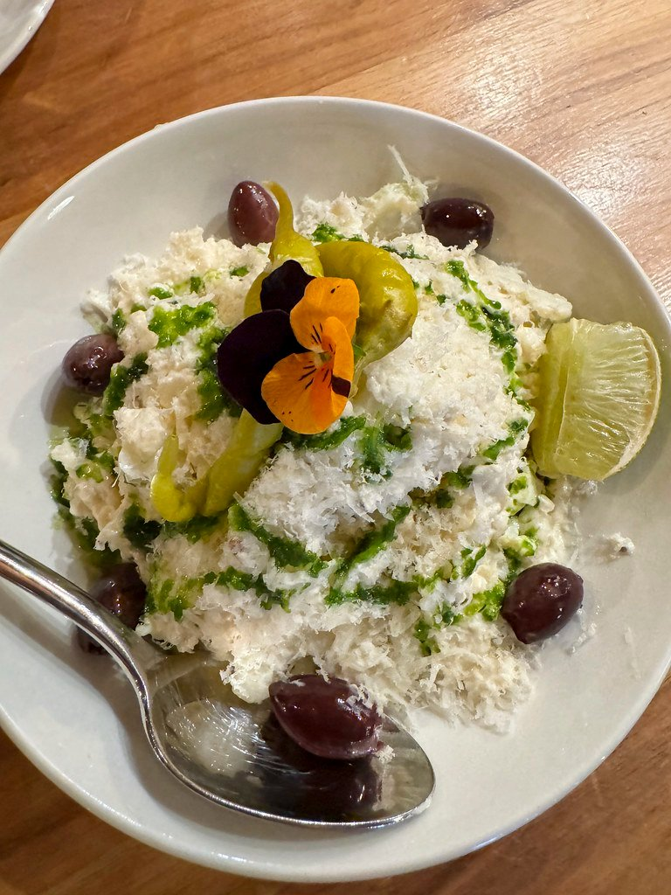
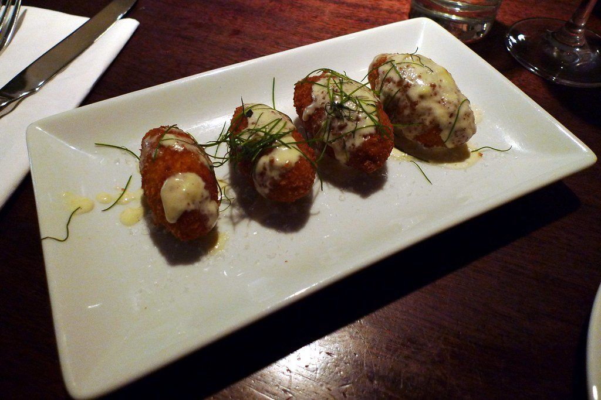
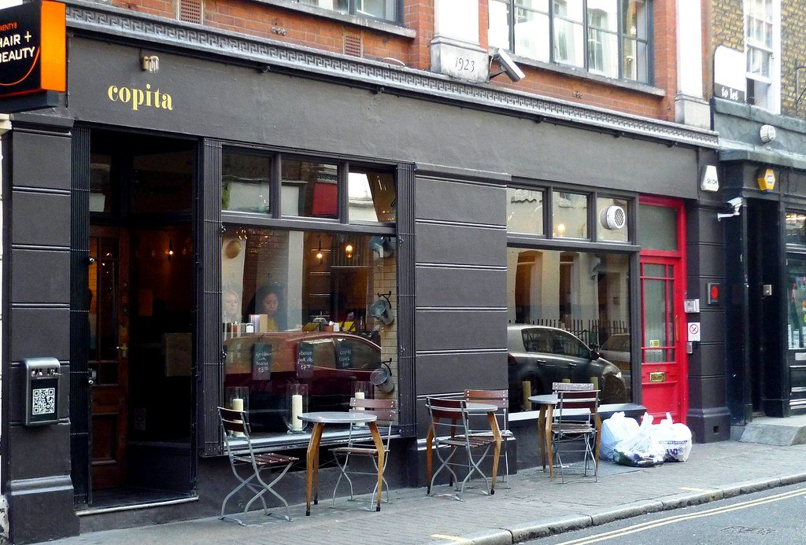
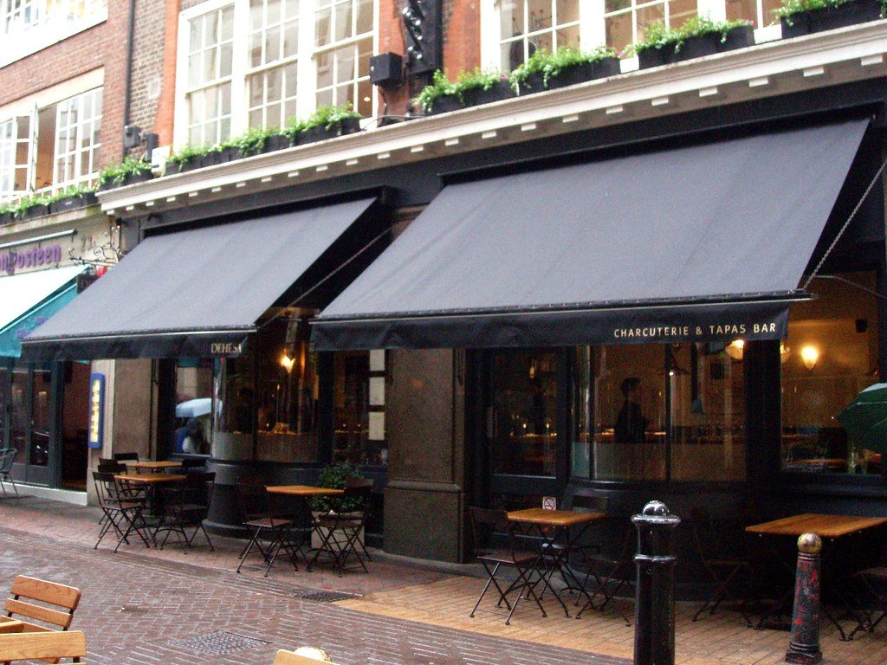

Spanish food in London has quietly become one of the city's strongest cuisines, and it splits into two things that barely resemble each other: **tapas counters** where you stand and eat with your hands, and **Basque asadors** built around a coal fire and a single enormous piece of beef.

> 💡 **The Short Version:** **Sabor** is the best, and the suckling pig is upstairs. **Lurra** and **Ibai** do proper Basque asador beef. **José** is standing-room, no bookings, and the best cheap plate of jamón in London. **Pizarro** is the same chef with tables. And **Barrafina** is the counter everyone copies.

> 📊 **The evidence behind this guide**
> Nothing here is ranked on one visit. This pass reads **9 sources carrying 102 citations** across **49 named restaurants**. **20 restaurants are named by two or more independent sources; 3 hold a Michelin star.**
> **Built on:** seven independent publications and the three Spanish restaurants Michelin has starred — Sabor, Legado and Mountain.
> *Evidence rebuilt 30 August 2026 · [How we rank →](/how-we-rank/)*

## Where they are

| If you are near… | Where to eat |
| --- | --- |
| **Mayfair & Soho** | Sabor, The Counter at Sabor, Barrafina, Lobos, Dehesa |
| **Marylebone** | Lurra, ALTA (Soho) |
| **Farringdon & Clerkenwell** | Ibai, Bar Kroketa |
| **Exmouth Market** | Morito |
| **Shoreditch** | Legado, Ember Yard |
| **Bermondsey** | José, Pizarro |
| **Fitzrovia** | Salt Yard |
| **Covent Garden & King's Cross** | Copita, Parrillan |
| **Borough & south** | Escocesa (Stoke Newington), Maresco |

**Price guide:** **££** £15–£35 · **£££** £40–£70 · **££££** £90+.

---

## The best

### Sabor, Mayfair

*££££ · 6 min from Piccadilly Circus · Michelin star* · Cited by 5 sources

Nieves Barragán Mohacho cooks **her mother's Basque and Galician repertoire downstairs and roasts suckling pig upstairs** in an asador. Two restaurants in one building, and the upstairs is the one to book.

### Legado, Shoreditch

*££££ · 2 min from Shoreditch High Street · Michelin star* · Cited by 3 sources

Barragán Mohacho's second restaurant, cooking **regional Spanish food rarely seen this seriously** in London.

---

## Basque asador

A grill house built around a coal fire and aged beef. London has two proper ones.

### Lurra, Marylebone

*££££ · 3 min from Marble Arch* · Cited by 2 sources

**Aged Galician beef and whole turbot over coals**, from the Donostia team. The txuleta is the order — a rib chop from an old dairy cow, which is a genuinely different thing from a British steak.

### Ibai, Farringdon

*££££ · 4 min from Barbican* · Cited by 3 sources

Fire-led Basque cooking and **some of the best beef in the country**, from the same team.

---

## Counters and tapas

### Barrafina

*£££ · counters, no bookings* · Cited by 5 sources

The counter format everyone else in London copied. **No bookings** — you put your name down and wait, and you eat at the bar watching it cooked.

### José, Bermondsey

*£££ · standing room · no bookings* · Cited by 4 sources

José Pizarro's **standing-room sherry bar** on Bermondsey Street — a handful of stools, a lot of jamón, and no reservations. Jamón, a few plates and a glass of fino comes in well under £25.

*Twenty covers, standing room only, and no bookings. Jose Pizarro's first place on Bermondsey Street. Photo: [Ewan-M](https://www.flickr.com/photos/55935853@N00/8722630539), [CC BY-SA 2.0](https://creativecommons.org/licenses/by-sa/2.0/).*

### Pizarro, Bermondsey

*£££ · a few doors up* · Cited by 3 sources

The **sit-down sibling to José** — same chef, tables instead of stools, and you can book. The pragmatic choice with a group.

*Jose Pizarro's larger Bermondsey Street room, where you can actually book a table. Photo: [Bex.Walton](https://www.flickr.com/photos/7831824@N04/53936325626), [CC BY 2.0](https://creativecommons.org/licenses/by/2.0/).*

### Salt Yard, Fitzrovia

*£££ · Spanish-Italian* · Cited by 2 sources

**Courgette flowers with goat's cheese and honey** — the dish that launched a hundred imitations, from one of the originals of the London tapas wave.

*Spanish-Italian small plates, and the courgette flower stuffed with goat's cheese has been on since it opened. Photo: [Ewan-M](https://www.flickr.com/photos/55935853@N00/4094273174), [CC BY-SA 2.0](https://creativecommons.org/licenses/by-sa/2.0/).*

Powered by <a target="_blank" rel="sponsored" href="https://www.getyourguide.com/london-l57/">GetYourGuide</a>

---

## The new wave

### ALTA, Soho

*£££ · Kingly Court* · Cited by 3 sources

Basque-influenced live-fire cooking from Rob Roy Cameron, who spent years at elBulli — and one of the most talked-about Spanish openings London has had in a decade.

Everything runs off the grill and the wood oven. Book well ahead; the counter is the seat to want.

### Bar Kroketa, Clerkenwell

*££ · croquettes and little else* · Cited by 3 sources

A bar built almost entirely around the **croqueta** — a dozen or so varieties, made properly, at a counter with a short sherry list.

It is a single-dish restaurant in the way a good ramen shop is, and the discipline is the point.

### Morito, Exmouth Market

*££ · a counter, no bookings for small tables* · Cited by 4 sources

Sam and Sam Clark's small tapas counter next door to their Moro, and the more useful of the two for a walk-in.

Twenty-odd covers, an all-Spanish drinks list heavy on sherry, and the charm of a place that has been full every night for years without expanding.

### Copita, Soho

*££ · d'Arblay Street* · Cited by 3 sources

A standing-and-perching tapas bar of the kind Soho used to be full of, with a genuinely good Spanish wine list sold by the copita — the small glass the place is named after.

*Small plates and sherry, standing up if it is busy. No bookings for most of the room. Photo: [Ewan-M](https://www.flickr.com/photos/55935853@N00/6435938511), [CC BY-SA 2.0](https://creativecommons.org/licenses/by-sa/2.0/).*

### Dehesa, Soho

*££ · Carnaby Street* · Cited by 3 sources

Spanish-Italian charcuterie and small plates on a corner site off Carnaby Street, from the same group as Salt Yard. The Ibérico ham and the courgette flower are the two things people order every time.

*Spanish-Italian small plates off Carnaby Street, and one of the better places to eat alone at the counter. Photo: [Ewan-M](https://www.flickr.com/photos/55935853@N00/2512459014), [CC BY-SA 2.0](https://creativecommons.org/licenses/by-sa/2.0/).*

### Parrillan, King's Cross

*£££ · Coal Drops Yard · grill at the table* · Cited by 2 sources

From the Hart brothers, who run Barrafina — and the gimmick is real: **each table gets its own small charcoal grill** and you cook the skewers yourself.

Coal Drops Yard has the terrace; there is a Borough Yards site too.

### Lobos, Soho and Borough

*££ · under a railway arch at Borough* · Cited by 3 sources

Meat and tapas, and the Borough site is squeezed under a railway arch in a way that makes it feel much older than it is. The Ibérico presa is the order.

### Escocesa, Stoke Newington

*££ · seafood tapas* · Cited by 2 sources

Spanish seafood cooking on Stoke Newington Church Street, sourcing from Scottish waters — hence the name, which is a joke that takes a second.

The most neighbourhood-feeling restaurant on this page, and the one Londoners are most likely to name.

---

## Best value

Tapas is designed to be cheap and London has mostly forgotten that. These are the places where it still is.

#### Markets and food halls

* **Borough Market** — **Brindisa** has traded here since the 1980s and started as an importer rather than a restaurant. The chorizo roll from its stall, with rocket and piquillo peppers, is around a fiver and is one of the great cheap lunches in London.
* **Mercado Metropolitano**, Elephant & Castle — a Spanish-founded food hall with several Iberian counters, and the cheapest jamón and pan con tomate in the city.
* **Seven Dials Market** and **Arcade Food Hall** both carry Spanish counters if you want one dish rather than a table.

#### Counters rather than tables

* **José**, Bermondsey — standing room, no bookings, and still the cheapest way to eat seriously good Spanish food in London.
* **Barrafina at the counter** — the counter is the only seating, so you are not paying for a table.
* **Bar Kroketa** — a plate of croquettes and a glass of fino is a genuinely cheap meal.

#### How to order

* **Order tapas in waves** rather than all at once. It stops the bill running away and it is how the format is meant to work.
* **Sherry is underpriced** almost everywhere in London and is the correct drink with jamón — a copita of fino usually costs less than a glass of house white.

---

## What to know

* **José and Barrafina take no bookings.** Go early or expect to wait.
* **Basque txuleta is aged dairy-cow beef** and tastes nothing like a supermarket steak. Order it rare and sliced for the table.
* **Order tapas in rounds**, not all at once — that is the format, and kitchens will pace it for you.
* **Ask for sherry recommendations.** Every restaurant here has a proper list and almost nobody orders from it.
* **Service charge** of 12.5% is discretionary and standard.

---

## Continue planning your London trip

- 🇮🇹 **[Best Italian Restaurants in London](/articles/best-italian-restaurants-london/)**
- 🥘 **[Best Middle Eastern Restaurants](/articles/best-middle-eastern-restaurants-london/)**
- 🍽️ **[Eat in London: Restaurants, Food Markets & Quick Food Hub](/articles/eat-in-london-guide/)**
- ⭐ **[Special Occasion Restaurants in London](/articles/special-occasion-restaurants-london/)**
- 🏙️ **[Bermondsey Area Guide](/articles/bermondsey-area-guide/)**
- 🛍️ **[Mayfair Area Guide](/articles/mayfair-area-guide/)**
