**A speakeasy here means a bar you have to find**: through a fridge, behind a bookcase, past a pizzeria counter, down a staircase behind a door with no name on it. A cocktail bar with its name lit over the door is not one, however often a list calls it that, and the most famous of those get a short section of their own further down.

The bars are ranked by how many independent sources name them: judged awards, editorial lists, independent blogs, YouTube creators and Reddit threads in which Londoners argue about where to drink.

> 💡 **The Short Version:** **Discount Suit Company** in Spitalfields and **Nightjar** on City Road are the hidden bars the most sources name. **The Mayor of Scaredy Cat Town** is the one through the fridge. For a judged verdict, **Archive & Myth**, reached through the Hippodrome Casino, is No.18 in the Top 50 Cocktail Bars 2026, and **The Spy Bar** sits behind a door in The OWO, the old War Office. **Barts** in Chelsea is the one with a password. The cheapest way in is before 7pm: **£9 cocktails at Supermax** under a King's Cross pizzeria, and **£10 classics at Opium** behind its jade door in Chinatown.

> 📊 **The evidence behind this guide.**
> **26 independent sources carrying 308 citations** across **118 named bars**. **52 bars are named by two or more independent sources.**
> **Built on:** the Top 50 Cocktail Bars and CLASS Bar Awards; lists from Time Out, The Handbook, DesignMyNight and others; blogs including The Nudge and Sis Behaving; YouTube and Reddit.
> *Evidence built 8 October 2026 · [How we rank →](/how-we-rank/)*

## Booking at a glance

* **Book ahead:** Archive & Myth (you arrive at your booking time through the Magic Mike Live entrance), and Nightjar, which takes walk-ins but recommends booking, especially for the music.
* **Book or walk in:** The Natural Philosopher, Basement Sate, Supermax, Opium and The Mayor of Scaredy Cat Town. Barts takes walk-ins for its late Speakeasy Sundowners, Thursday to Saturday from 11pm.
* **Expect a queue:** SOMA Soho holds a few tables for bookings and runs a first-in-line queue for the rest of the night.
* **Check the day before you go.** The Natural Philosopher opens Thursday to Sunday only, Supermax Wednesday to Saturday, The Spy Bar Tuesday to Saturday, and Barts is closed on Mondays and Tuesdays.

## Where they are

| If you are near… | Hidden bars |
| --- | --- |
| **Soho & Chinatown** | Opium, Experimental Cocktail Club, SOMA Soho, Basement Sate, The Vault at Milroy's |
| **Leicester Square & Covent Garden** | Archive & Myth, Blind Spot |
| **Westminster & Whitehall** | The Spy Bar, Sibin |
| **Spitalfields & Aldgate** | Discount Suit Company, The Mayor of Scaredy Cat Town |
| **Old Street & Shoreditch** | Nightjar |
| **Bethnal Green & Hackney Road** | The Natural Philosopher |
| **King's Cross** | Supermax |
| **Chelsea & Earl's Court** | Barts, Evans & Peel Detective Agency |

**Cocktail prices** are given where the bar publishes them: £13 to £19 a drink.

---

## The award winners

Two judged awards for 2026 reach London's hidden bars. The Top 50 Cocktail Bars 2026, a UK-wide list, ranks four of them; the CLASS Bar Awards 2026 named The Spy Bar's manager the best in Britain. The World's 50 Best Bars 2026, announced on 7 October, has five London bars and none of them is hidden.

### Archive & Myth, Leicester Square — through the Hippodrome Casino

*£££ · Hippodrome Casino, Cranbourn Street, WC2H 7JH · No.18, Top 50 Cocktail Bars 2026 · Cited by 5 sources · [book a table](https://www.sevenrooms.com/explore/archiveandmythhippodromecasino/reservations/create/search/)*

**The highest-placed hidden bar in the Top 50 Cocktail Bars 2026**, and the one with the most involved way in. The bar's own directions: at your booking time, use the **Magic Mike Live entrance to the Hippodrome off Cranbourn Street**, go through the door to the left of the lift and head downstairs. Its site calls the room "a timeless chamber filled with mystery and intrigue" below the casino.

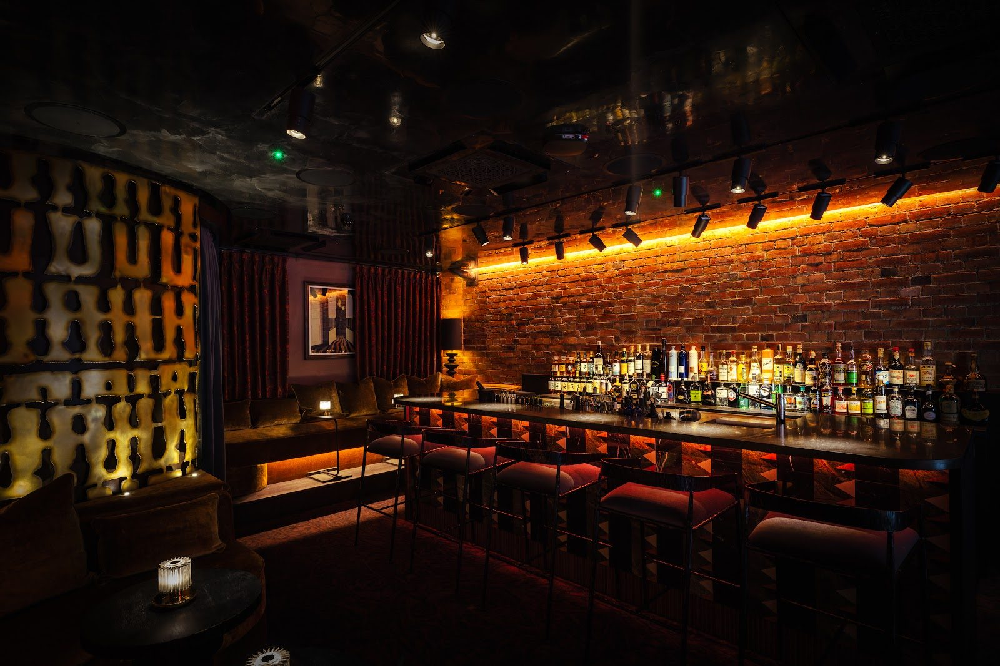

*The bar at Archive & Myth.*

DesignMyNight calls it "a secret within a secret"; Sis Behaving wrote it up for its London speakeasy guide, and on Reddit one Londoner's verdict was that the drinks "are on the pricier side but the vibes are 💯". No standing cocktail prices are published; the bar runs guest shifts and one-night tastings with their own prices.

**Book: the directions are given for your reservation time.**

### The Spy Bar, Whitehall — the old War Office's rooms 006 and 007

*££££ · Raffles London at The OWO, SW1A 2BX · No.43, Top 50 Cocktail Bars 2026 · CLASS Bar Manager of the Year 2026 · Cited by 4 sources · [the bar's site](https://www.raffles.com/london/experiences/spy-bar-tasting-experience/)*

**The only hidden bar among the 2026 CLASS winners**: Sotiris Konomi, who runs it, is the 2026 Bar Manager of the Year. Raffles places it "in the secret corridors" of the Old War Office, in two rooms numbered 006 and 007 that held the identity papers and mission reports of MI5 and MI6 agents. Time Out, which puts it first of fifteen secret bars, found it "behind a door marked with a tiny 007" in the basement.

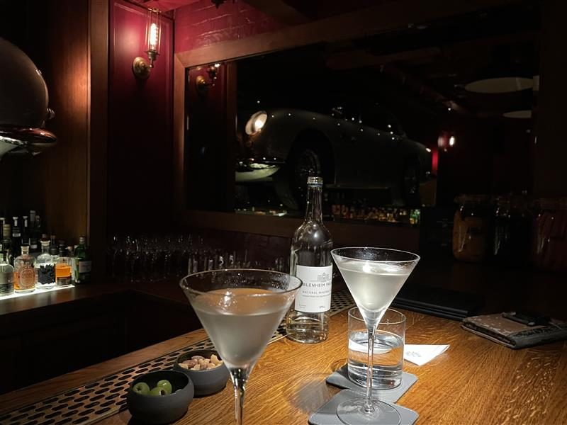

*Martinis at The Spy Bar.*

The order is a martini: The OWO's own line is "descend to The Spy Bar for a secret Martini", and Time Out names the Vesper. A guided Spy Bar tasting is £150 a head; the bar publishes no cocktail list prices.

**Open Tuesday to Saturday from 5pm.** Closed Sunday and Monday.

### Opium, Chinatown — the jade door

*£££ · 15-16 Gerrard Street, W1D 6JE · No.46, Top 50 Cocktail Bars 2026 · #4 of 11, Time Out · Cited by 9 sources · [book a table](https://www.sevenrooms.com/explore/opiumchinatown/reservations/create/search/)*

Opium's own directions are "Find our hidden jade door" on Gerrard Street; Time Out places the door close to Chinatown's main gate. Behind it are **three cocktail bars** inspired by 1920s Shanghai, with dim sum from the kitchen.

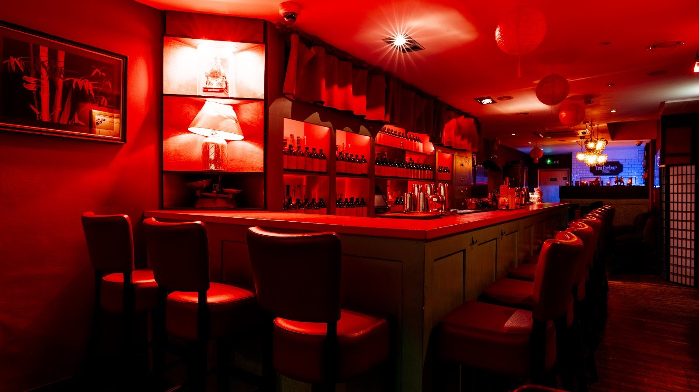

*One of Opium's three bars.*

Cocktails run **£15 to £19**. **Classic Hour, 5pm to 7pm every day, puts every classic at £10**, and a pre-theatre deal pairs dim sum with a signature cocktail for £25. Nine sources name it, the most of any award-listed hidden bar, from Time Out and SquareMeal to The Nudge and Secret London.

**Open every day from 5pm until late.** Book through the bar's site, and, says Time Out, don't be put off by the doorman.

### SOMA Soho, Piccadilly Circus — the unmarked door on Denman Street

*£££ · 14 Denman Street, W1D 7HJ · No.48, Top 50 Cocktail Bars 2026 · Cited by 4 sources · [the bar's site](https://soma.london/soho/)*

The bar's own description: "Through an unmarked door, descend the stairs from Denman Street". At the bottom is a stainless steel counter, with curtained walls leading to a snug at one end and a lounge at the other, and cocktails built on flavours from the Indian subcontinent. GQ named it Best Bar at its 2022 Food & Drink Awards.

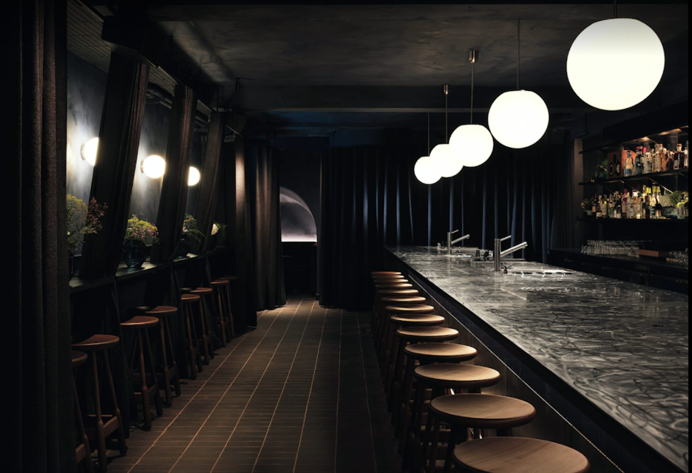

*The counter at SOMA Soho.*

The music changes with the hour: jazz early in the evening, Golden Age hip hop after that. A second SOMA under the DLR at Canary Wharf is not a hidden bar.

**A limited number of tables can be booked; after that it is a first-in-line queue.** Open until 1am Monday and Tuesday, 2am Wednesday and Thursday, 3am Friday and Saturday, and 10.30pm on Sunday. No prices are published.

---

## The most named

Nobody ranks speakeasies by how often they are written up, so this is where the counts lead: these five are named across editorial lists, blogs and Reddit alike.

### Discount Suit Company, Spitalfields — the old tailor's

*££ · 29A Wentworth Street, E1 7TB · #8 of 11, Time Out · Cited by 13 sources · [book a table](https://discountsuitcompany.co.uk/booking-enquiries/)*

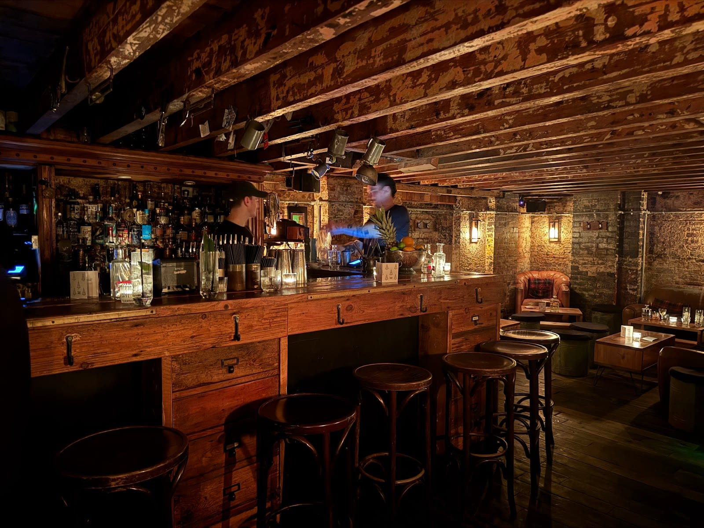

*Discount Suit Company.*

**Named by thirteen sources, joint most of any hidden bar in this guide**, and the most recommended name in r/london's 2025 thread on speakeasies. It opened in January 2014 in a former suit tailor's store room and, as Time Out notes, kept the old premises' name; Time Out describes it as "hidden away under one of the many clothiers" around Petticoat Lane.

Inside it is a low room of bare brick and old joists, with classically inspired cocktails to a soundtrack the bar gives as Northern Soul and vintage rock 'n' roll. It is also in our [best cocktail bars guide](/articles/best-cocktail-bars-london/).

**Book, especially at the weekend:** the Reddit verdict is that it "ended getting a bit too busy". The bar does not publish its cocktail prices.

### Nightjar, Old Street — the door beside the KFC

*£££ · 129 City Road, EC1V 1JB · #3 of 11, Time Out · Cited by 13 sources · [book a table](https://www.sevenrooms.com/explore/nightjarshoreditch/reservations/create/search/)*

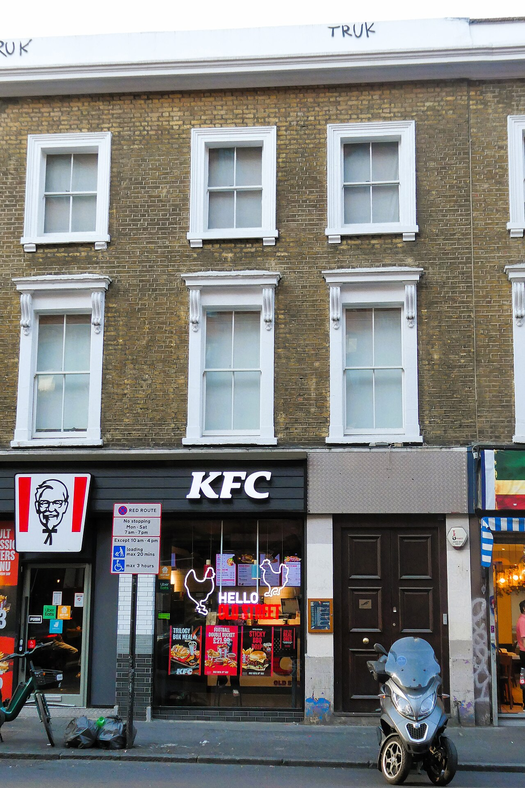

*Nightjar on City Road. Photo: [Ewan-M](https://commons.wikimedia.org/wiki/File:Nightjar,_Shoreditch,_EC1_-_2026-07-12.jpg), [CC BY-SA 4.0](https://creativecommons.org/licenses/by-sa/4.0/).*

**Thirteen sources, level with Discount Suit Company.** The door is a pair of dark wooden doors with a small brass nightjar on them, next to a KFC, and the bar is in the basement. The menu runs by era, pre-Prohibition to modern: a Singapore Sling at £15, a Charlie Chaplin at £14, an El Presidente at £17, and **cocktails at £14 to £18** in all.

**Live jazz, blues, swing and funk every night from 9pm**, with a cover charge that goes to the musicians. Walk-ins are taken, but Nightjar recommends booking, and groups of up to 20 are accepted Sunday to Thursday only. It is in our [best cocktail bars guide](/articles/best-cocktail-bars-london/) too.

### The Mayor of Scaredy Cat Town, Spitalfields — through the fridge

*££ · The Breakfast Club, 12-16 Artillery Lane, E1 7LS · #9 of 11, Time Out · Cited by 11 sources · [book a table](https://www.sevenrooms.com/explore/thebreakfastclub/reservations/create/search/?venues=themayorofscaredycattown)*

The bar's address line on its own page reads "Through the fridge…": you walk into The Breakfast Club café on Artillery Lane and the bar is behind a door built to look like a big SMEG fridge, as Time Out puts it. The Reddit advice, from 2022, still holds: go in and ask for the Mayor.

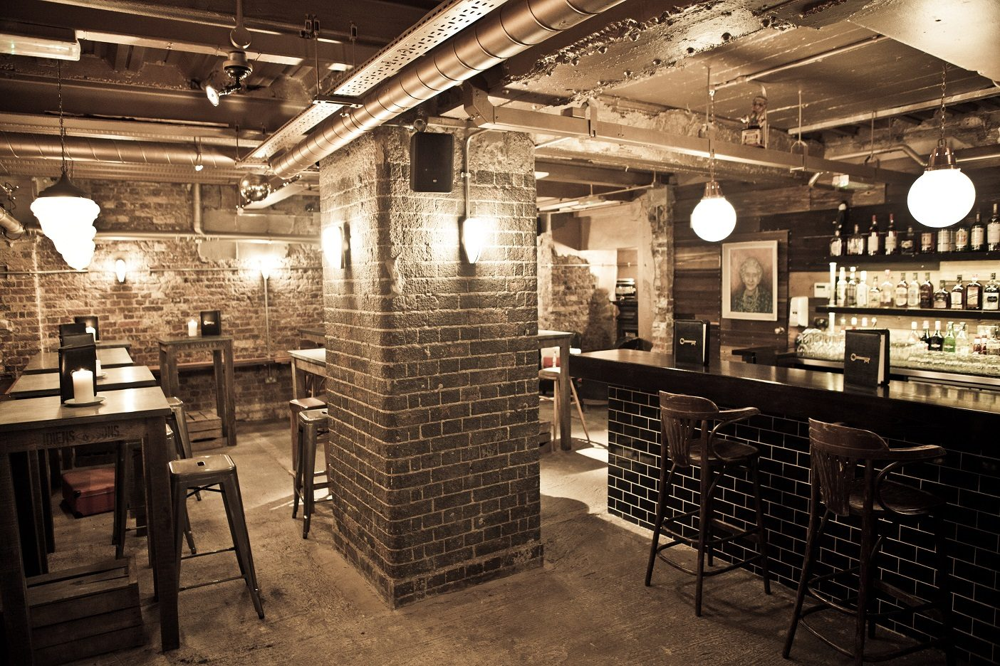

*The basement at The Mayor of Scaredy Cat Town.*

The basement is candlelit, and the bar sells it as "best in class cocktails" for "hush hush conversations, or raucous celebrations, plus the odd cat here & there". **Saturdays open at noon with a boozy brunch**; every other day it opens at 5pm, until 11pm Monday to Wednesday and Sunday and midnight Thursday to Saturday.

Eleven sources name it, more than any other bar that is hidden behind another business. No drink prices are published.

### Barts, Chelsea — the password

*£££ · Chelsea Cloisters, Sloane Avenue, SW3 · Cited by 8 sources · [the bar's site](https://www.barts-london.com/)*

**The only bar on this page that asks for a password.** Barts' own story sends you to "an unmarked black door at the back of the building on the ground floor" of Chelsea Cloisters, an apartment block off Sloane Avenue, dressed inside as the Chicago flat of a 1920s gangster called Uncle Barts. "To gain entry, you'll need the password, whispered only to those in the know."

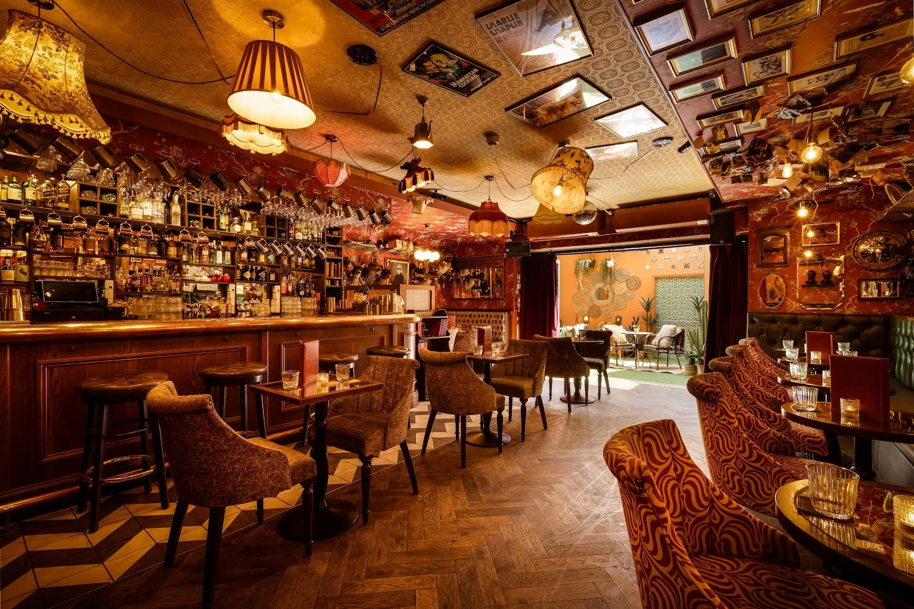

*Inside Barts.*

Cocktails arrive in antique books and cigar boxes, at **£15 to £17**, with alcohol-free versions at £12. At the back is the Agave Garden, covered and heated.

**Closed Monday and Tuesday.** Open from 5pm, until 1am Wednesday, 2am Thursday, 2.30am Friday and Saturday and midnight Sunday. On Thursday to Saturday nights from 11pm the late "Speakeasy Sundowners" take walk-ins who give the password at the door.

### Experimental Cocktail Club, Chinatown — upstairs from Gerrard Street

*£££ · 13a Gerrard Street, W1D 5PS · #6 of 11, Time Out · Cited by 7 sources · [the bar's site](https://www.experimentalgroup.com/explore-experimental-cocktail-club)*

The London branch of the Paris bar that opened in 2007. Stylist describes "a discreet, unmarked door" on Gerrard Street and stairs up; the group's own description is a room "perched above Chinatown", designed by Dorothée Meilichzon to look plucked from the 1920s, across three floors of an old townhouse by Time Out's account.

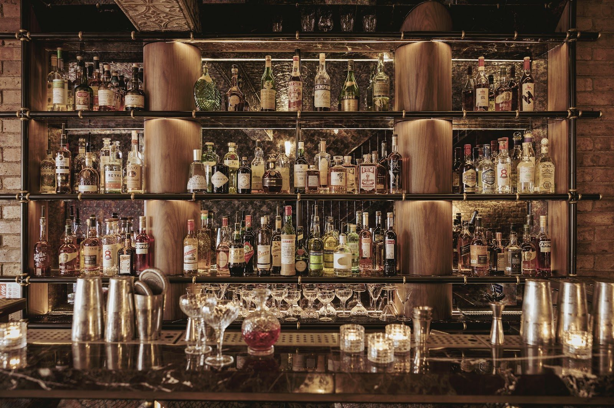

*The back bar at Experimental Cocktail Club.*

The evening runs from an acoustic set to vinyl to deep house as it gets later. **Time Out says half the room is kept back for walk-ins**, so a booking is worth having but not essential; reservations go to reservation@chinatownecc.com or through the group's site. Cocktail prices are not published.

---

## By how you get in

### Behind another business

#### The Natural Philosopher, Bethnal Green — through a repair shop

*££ · 489 Hackney Road, E2 9ED · #10 of 15, Time Out · Cited by 6 sources · [the bar's site](https://www.naturalphilosopher.co.uk/)*

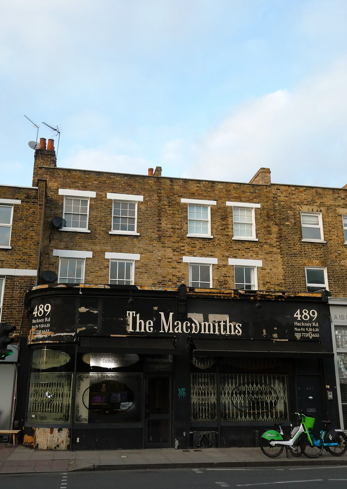

*The MacSmiths on Hackney Road. Photo: [Ewan-M](https://commons.wikimedia.org/wiki/File:Natural_Philosopher,_Bethnal_Green,_E2.jpg), [CC BY-SA 4.0](https://creativecommons.org/licenses/by-sa/4.0/).*

"Enter through The MacSmiths Repair Shop", the bar says, and the front on Hackney Road is still the repair shop's. Behind it is a low-lit cocktail and whisky bar with "an unconventional whisky list that never stands still".

**Every house cocktail, classic and freezer martini is £13.** Before 10pm, every day, the Pickleback Sour, Pickle Martini and Pickle Marg are **£10**, and on Thursdays drams from the "odd bins" shelf are £5.

**Open Thursday to Sunday only**: 6pm to 11pm Thursday, 6pm to 1am Friday, 4pm to 1am Saturday, 4pm to 11pm Sunday. Walk-ins are welcome; booking is recommended.

#### The Vault at Milroy's, Soho — behind the bookcase

*£££ · Milroy's of Soho, 3 Greek Street, W1D 4NX · #4 of 15, Time Out · Cited by 4 sources · [the bar's site](https://milroysofsoho.com/pages/the-vault)*

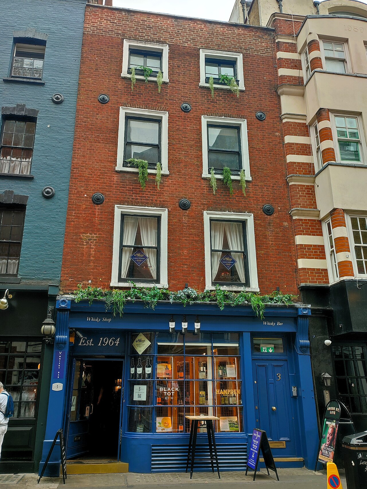

*Milroy's of Soho. Photo: [Ewan-M](https://commons.wikimedia.org/wiki/File:Milroy%27s_of_Soho,_Soho,_W1_-_54728787050.jpg), [CC BY-SA 4.0](https://creativecommons.org/licenses/by-sa/4.0/).*

Milroy's, a whisky shop established in 1964, keeps its bar under the shop, and Milroy's own page for it is headed "Through the bookcase, Soho". Time Out describes the bookcase as "unassuming", at the rear of the shop, with stairs down to a small basement where the cocktails are made from potent spirits, whisky included.

A Reddit commenter in 2024 recommended it for the entrance alone. Milroy's lists jazz nights, a seasonal menu and private hire for the room.

**Book through Milroy's site.** Prices are not published.

#### Supermax, King's Cross — under a pizzeria

*££ · 14-18 Handyside Street, N1C 4DN · Cited by 3 sources · [book a table](https://bookings.designmynight.com/book?venue_id=5f283807d4ea515f642871d3&source=partner)*

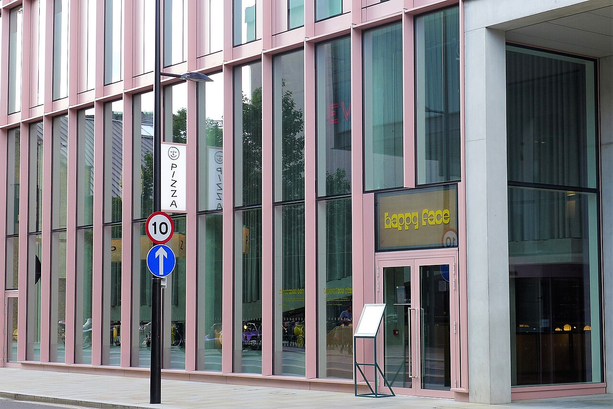

*Happy Face on Handyside Street. Photo: [Ewan-M](https://commons.wikimedia.org/wiki/File:Supermax,_King%27s_Cross,_N1.jpg), [CC BY-SA 2.0](https://creativecommons.org/licenses/by-sa/2.0/).*

"A late-night cocktail and disco spot in King's Cross hidden beneath Happy Face Pizza", in the bar's own words: the door you want is the pizzeria's. DesignMyNight files it with London's hidden basement bars and The Handbook with its secret underground drinking spots.

**Aperitivo hour puts cocktails at £9 until 7pm**, the cheapest standing price of any bar on this page. Later it is a disco bar.

**Open Wednesday to Saturday only:** 5pm to midnight Wednesday and Thursday, 5pm to 1am Friday and Saturday. Its line on booking is "Book up or rock up."

### Hidden inside a hotel

#### Blind Spot, Covent Garden — inside St Martins Lane

*£££ · St Martins Lane hotel, WC2N 4HX · Cited by 6 sources · [the bar's site](https://morgansoriginals.com/st-martins-lane/restaurants-bars/blind-spot/)*

The hotel calls it "a secret bar"; a Londoner on Reddit who found it by chance put it better: "it's not signposted or visible from the street". The menu is built as a trip round the world, from Harare to Turin and Havana, and the hotel's pitch is to "spin the globe" and pick a drink.

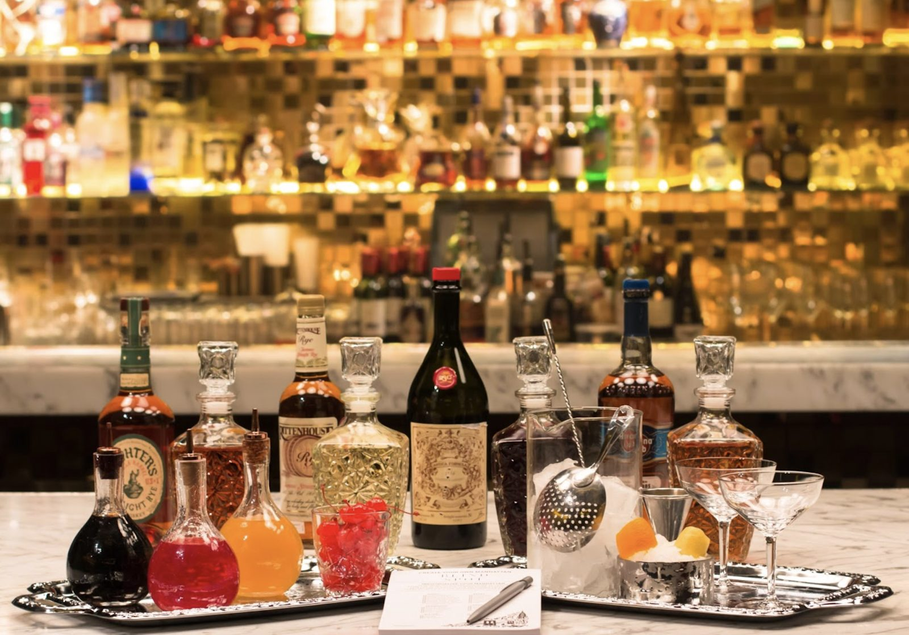

*The bar at Blind Spot.*

Six sources name it, including The Handbook, London x London, The Sauce and Devour Tours.

**Two-for-one cocktails from 5pm to 7pm every day**; hotel guests get it until 9pm. Book through the hotel's site.

#### Sibin, Westminster — inside the Great Scotland Yard Hotel

*£££ · Great Scotland Yard Hotel, 3-5 Great Scotland Yard, SW1A 2HN · Cited by 3 sources · [the bar's site](https://www.hyattrestaurants.com/en/london/bar/sibin-speakeasy-cocktail-bar)*

The hotel calls it "a clandestine haven" for heritage whiskies, wines and Champagnes, and reviewers quoted on its own page call it "intelligently hidden inside the Great Scotland Yard hotel". The current menu is titled "Tales from a Speakeasy", and the bar runs cocktail masterclasses and live music.

It suits a whisky drinker more than a cocktail crawl. DesignMyNight, The Handbook and The Sauce name it, the last as one of ten secret speakeasies.

**Book through the hotel's site.** No hours or prices are published on its page.

### Behind a false front

#### Evans & Peel Detective Agency, Earl's Court — state your case

*£££ · 310c Earls Court Road, SW5 9BA · #11 of 11, Time Out · Cited by 5 sources · [the bar's site](https://www.evansandpeel.com/)*

The bar presents itself as "a highly renowned Detective duo who operate from our hidden Agency": the street door on Earls Court Road leads to a detective's office, and the bar is behind it. "Go beyond our façade and discover our famous secret," as its own site puts it. Time Out describes an intercom at the door and "a dapper chap behind a desk" inside it.

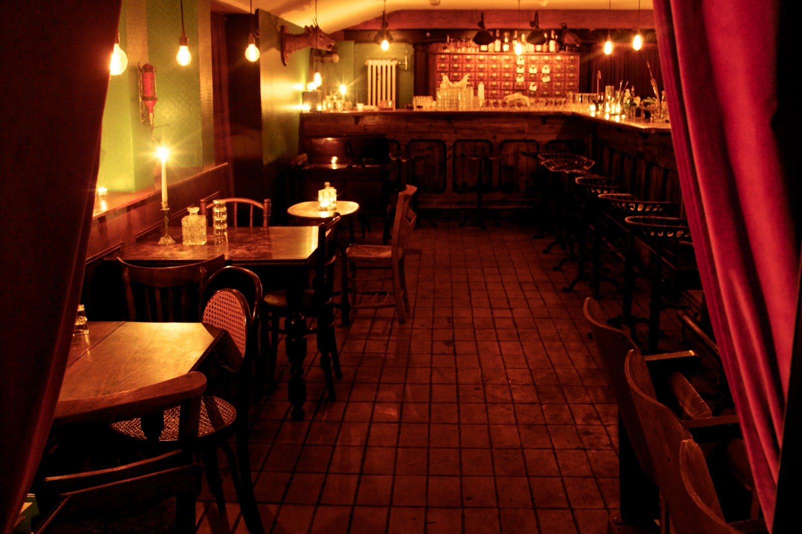

*Inside Evans & Peel Detective Agency.*

Inside it is a basement done as a Prohibition-era den, and the drinks list is a "cocktail notebook". A Reddit commenter's verdict was that "you have to play along with their theme to get it".

**Book through the bar's site.** Prices are not published.

### Behind an unmarked door

#### Basement Sate, Soho — the red door

*£££ · 8 Broadwick Street, W1F 8HN · Cited by 4 sources · [book a table](https://www.designmynight.com/london/bars/soho/basement-sate?tab=bookings)*

"You won't spot us from the street", the bar says: look for **the red door at 8 Broadwick Street** and go downstairs. It is a low-lit, candlelit room of leather seats, and on Reddit a Londoner gave it the line every bar on this page would want: "Not well sign posted, small and cosy."

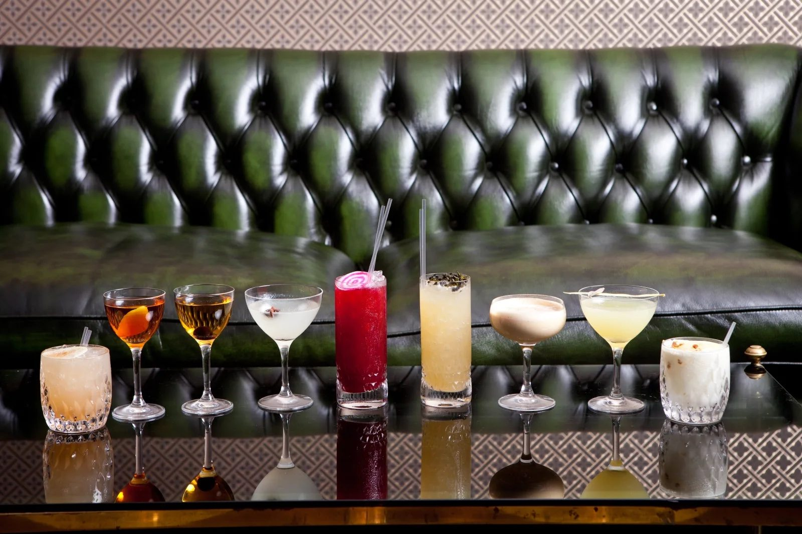

*Cocktails at Basement Sate.*

The seasonal list runs **£13 to £15**: a Provence of vodka, lavender, cucumber and mint at £13, a Tongue Twister of hibiscus mezcal, Lapsang Souchong tequila and Sichuan pepper at £15, and ten alcohol-free cocktails at £11.

**Walk-ins are taken every night; book for Friday and Saturday**, because the room is small.

---

## Called speakeasies, but signed at the door

These are named by the same lists, often near the top, but each has its name over the door, so this guide does not rank them with the hidden bars.

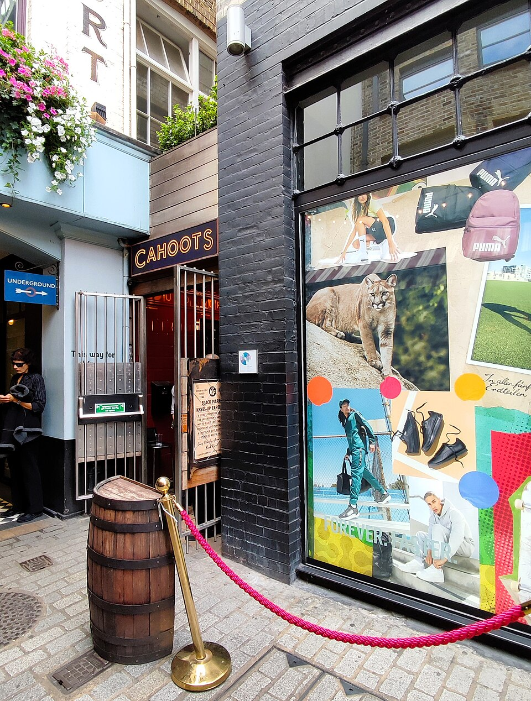

*Cahoots in Kingly Court. Photo: [Ewan-M](https://commons.wikimedia.org/wiki/File:Cahoots,_Soho,_W1.jpg), [CC BY-SA 4.0](https://creativecommons.org/licenses/by-sa/4.0/).*

* **[Cahoots](https://www.cahoots.co.uk/underground/)**, Kingly Court — **the most-named "speakeasy" in this pass**, a 1940s Underground station in a former air-raid shelter, with seats in a tube carriage. Its own site talks of a "discreet Cahoots sign"; the sign is lit over the door, and on Reddit one regular's view was that "the queue makes it less speakeasy than it would like". Book for a group. Cited by 17 sources.
* **[Happiness Forgets](https://www.happinessforgets.com/)**, Hoxton Square — a basement cocktail bar at 8-9 Hoxton Square, No.44 in the Top 50 Cocktail Bars 2026, open from 5pm every day. Its own site gives the address and nothing about hiding, and a board on the pavement points the way down. Cited by 9 sources.
* **[Disrepute](https://www.disrepute.co.uk/)**, Kingly Court — No.45 in the Top 50 Cocktail Bars 2026, with cocktails at £16 to £18 and a 3am close. It calls itself "a hideaway", but its name is lit over the door at 4 Kingly Court. Cited by 7 sources.
* **[69 Colebrooke Row](https://www.69colebrookerow.com/)**, Angel — Time Out's number one London speakeasy. It calls itself "the Bar with No Name", but the address is printed on the awning over the door. Live piano, house cocktails £15, and booking is advised. Cited by 3 sources.

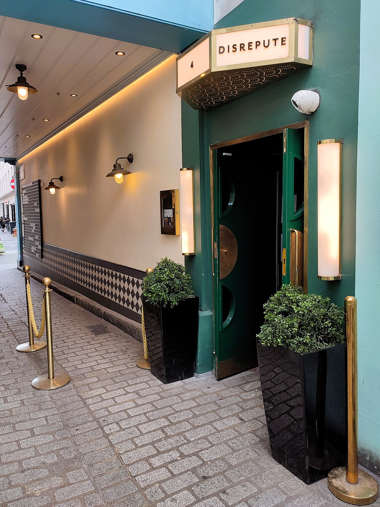

*Disrepute in Kingly Court. Photo: [Ewan-M](https://commons.wikimedia.org/wiki/File:Disrepute,_Soho,_W1.jpg), [CC BY-SA 4.0](https://creativecommons.org/licenses/by-sa/4.0/).*

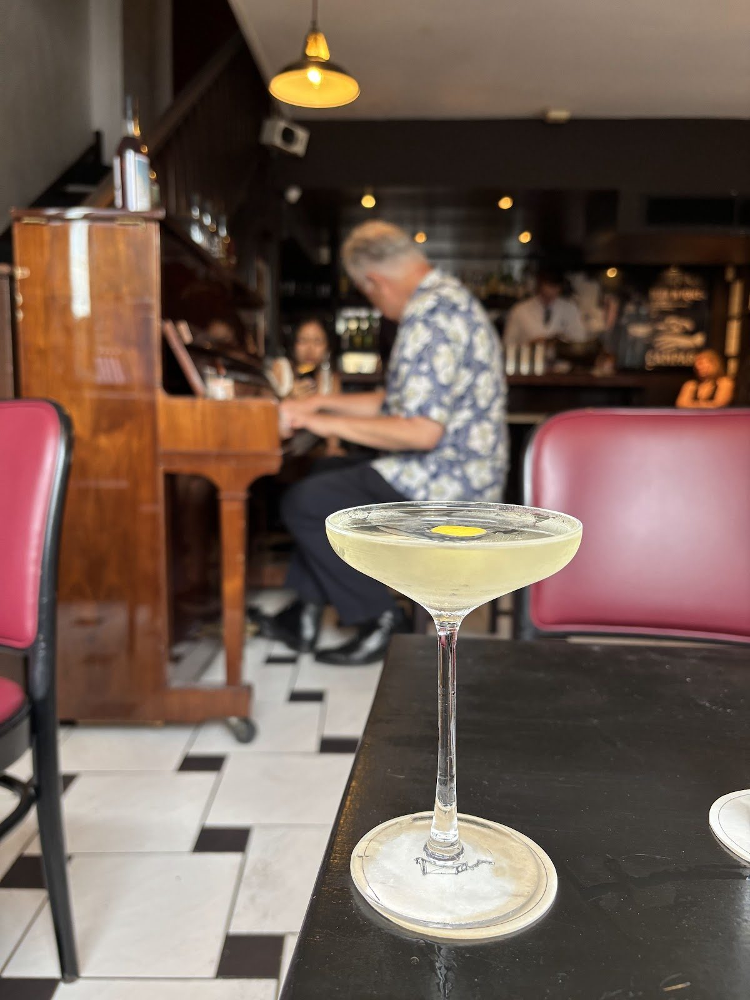

*The piano at 69 Colebrooke Row.*

---

## Cheapest

* **Supermax**, King's Cross — **£9 cocktails until 7pm**, Wednesday to Saturday. Cited by 3 sources.
* **Opium**, Chinatown — **every classic £10 from 5pm to 7pm**, every day. Cited by 9 sources.
* **The Natural Philosopher**, Bethnal Green — pickle cocktails **£10 before 10pm**, everything else £13. Cited by 6 sources.
* **Blind Spot**, Covent Garden — **two-for-one from 5pm to 7pm** every day. Cited by 6 sources.
* **Basement Sate**, Soho — the list starts at **£13**. Cited by 4 sources.

## Late

* **SOMA Soho** — until 3am on Friday and Saturday. Cited by 4 sources.
* **Barts**, Chelsea — until 2.30am Friday and Saturday. Cited by 8 sources.

## Also in our cocktail bars guide

**Nightjar** is in both guides, and so are **Discount Suit Company** and **Happiness Forgets**. The [best cocktail bars guide](/articles/best-cocktail-bars-london/) covers the signed rooms the World's 50 Best Bars ranks, from the Connaught Bar to Satan's Whiskers; this one covers the bars you have to find.

---

## What to know

* **Book where the way in is given with the booking.** Archive & Myth sends you through the Hippodrome at your reservation time, and Barts' password is not printed anywhere.
* **Groups:** Nightjar takes groups of up to 20 Sunday to Thursday only. Cahoots, in the signed section, is the one built for a party.
* **Hen and stag nights:** the [hen do](/articles/hen-do-london/) and [stag do](/articles/stag-do-london/) guides cover which bars take large groups and which refuse them.

---

## Continue planning your London trip

- 🍸 **[The Best Cocktail Bars in London](/articles/best-cocktail-bars-london/)** — the signed rooms, from the Connaught to Satan's Whiskers
- 🗝️ **[Hidden London: Secret Places Worth Finding](/articles/hidden-london-secret-places/)**
- 🍷 **[The Best Wine Bars in London](/articles/best-wine-bars-london/)**
- 🌙 **[Late-Night Eating in London](/articles/late-night-eating-london/)**
- 👰 **[Hen Do in London](/articles/hen-do-london/)**
- 🎉 **[Stag Do in London](/articles/stag-do-london/)**
- 🎭 **[Soho Area Guide](/articles/soho-area-guide/)**
- 🏙️ **[Shoreditch Area Guide](/articles/shoreditch-area-guide/)**
