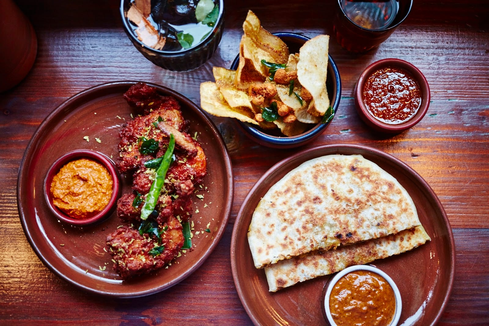
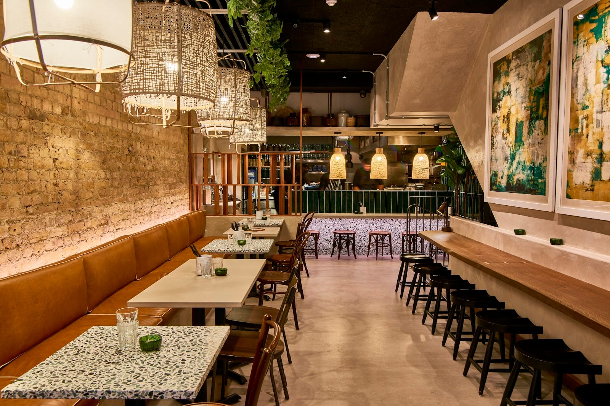
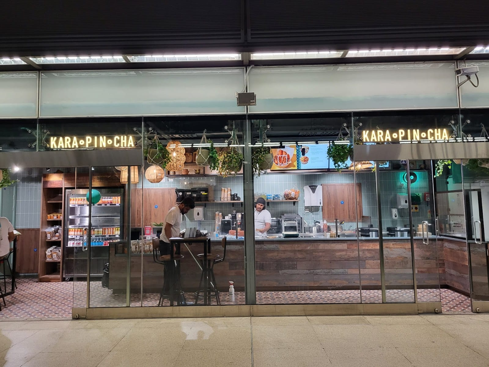
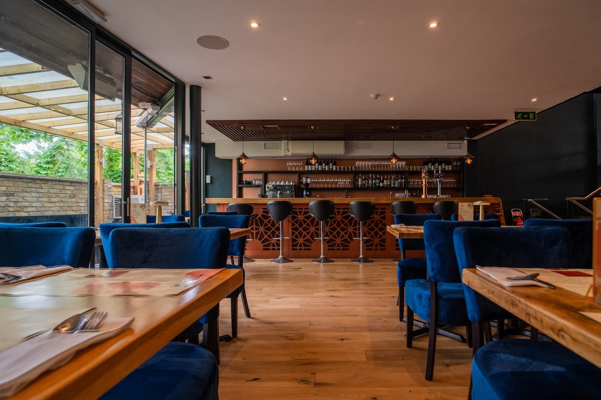
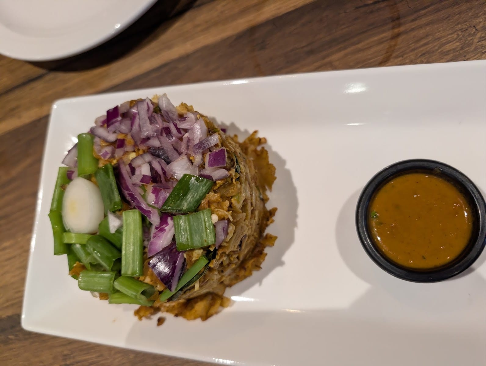

London has two Sri Lankan scenes and almost every guide covers one of them. There is the central one — Soho, Covent Garden, Borough Market — and there is Tooting High Street, Ealing Road in Wembley and a parade of shops at Rayners Lane, which is where most of this food is actually cooked and eaten.

There is a second problem, and it is the one that sends readers to the wrong restaurant. **Sri Lankan gets filed under South Indian.** They share a strait and some vocabulary, and they are not the same cooking: Sri Lanka runs on grated coconut, tamarind, smoked goraka fruit and dried Maldive fish, and its core dishes have no equivalent across the water. So this guide holds the line. Where a kitchen genuinely cooks both — and several of the best do — it says so.

> 💡 **The Short Version:** **Hoppers** is the only Sri Lankan kitchen in London holding an award, a MICHELIN Bib Gourmand, and nineteen sources name it. **Rambutan** in Borough Market is the one the Good Food Guide rates higher. **Kolamba** for a Soho dinner you can actually book. **Jaffna House** in Tooting has cooked the same northern repertoire since 1991, and nothing on its menu is expensive. **Karapincha** for kothu roti chopped to order inside Canary Wharf station.

> 📊 **The evidence behind this guide.**
> Nothing here is ranked on one visit. This pass reads **28 independent sources carrying 135 citations** across **33 named venues**. **19 are named by two or more independent sources, and one holds a dated award.**
> **Built on:** the MICHELIN Guide and the Good Food Guide, ten editorial mastheads, six independent writers and ten London food channels, counted per creator so a channel's three videos are one voice.
> *Evidence built 22 September 2026 · [How we rank →](/how-we-rank/)*

## Where they are

| If you are near… | Where to eat |
| --- | --- |
| **Soho & Carnaby** | Kolamba, Hoppers Soho |
| **Covent Garden** | ADOH! |
| **Borough Market** | Rambutan |
| **King's Cross, Marylebone & Shoreditch** | Hoppers, Kolamba East |
| **Tooting** | Jaffna House, Apollo Banana Leaf, Kothu |
| **Canary Wharf** | Karapincha |
| **Victoria** | Dammika's |
| **Farringdon** | Machan Kitchen |
| **Wembley & Ealing** | Palm Beach, Papaya |
| **Harrow & Rayners Lane** | Trinco Bay, Gana, Kothu, Sambal Express |
| **Putney & Worcester Park** | Colombo Kitchen |
| **Pinner & Eastcote** | Virundhu |
| **Walthamstow** | Best Foods Supermarket |

**Price guide:** **£** under £20 a head · **££** £20–£40 · **£££** £40+.

### How far ahead to book

* **Weeks ahead:** Rambutan. It is a small room beside Borough Market and the counter goes first.
* **A few days:** Kolamba Soho and Kolamba East, ADOH!, Colombo Kitchen, Virundhu, Dammika's.
* **Bookable, rarely needed:** Apollo Banana Leaf, Kothu, Trinco Bay, Jaffna House, Palm Beach, Papaya.
* **Walk-in only:** every counter and stall — Karapincha's three, Best Foods Supermarket, and Colombo Kitchen's stall at St James's Courtyard.
* **Both at once:** Hoppers Soho takes reservations for two to four people and runs a virtual queue for everyone else. You leave your name and phone number and go for a drink; they call when the table is ready. There is no physical queue to stand in.

---

## The winners

Three restaurants have been judged rather than written about. Two bodies inspect this cuisine in London and between them they cover exactly these three.

### Hoppers, Soho

*££ · Soho · 4 min from Tottenham Court Road · Cited by 19 sources · MICHELIN Bib Gourmand, 2026 guide · Time Out's number one London chain, August 2026*

**The most-cited Sri Lankan restaurant in London by a distance** — nineteen independent sources, against thirteen for the next one — and the only one holding a dated award. The Soho original opened on Frith Street in 2015 and the room is built after a toddy shop, the palm-wine shacks on Sri Lanka's coconut plantations: terracotta tiles, a rattan ceiling, poster art, and few enough tables that every one of them hears the others.

*Devilled, sambols and a folded godhamba roti. The kottu and the hoppers are the other half of the menu.*

Order the **egg hopper**, a fermented rice-and-coconut batter swirled round a curved pan until it is lacy at the rim, with an egg set into the base. Then **mutton rolls with chilli ketchup** — shredded lamb in mashed potato, crumbed and deep-fried — and the **black pork kari**, a dry curry darkened with goraka, a smoked sour fruit that gives it a tang no other spice does. The lamb shoulder buriani feeds a table.

**Four London sites: Soho, Marylebone, King's Cross and Shoreditch.** The Bib Gourmand is for Soho. Soho takes bookings for parties of two to four and runs a virtual queue for everyone else; the other three are easier to book.

**Book:** [Hoppers Soho](https://www.sevenrooms.com/explore/hopperssoho/reservations/create/search/) · [King's Cross](https://www.sevenrooms.com/explore/hopperskingcross/reservations/create/search/) · [Shoreditch](https://www.sevenrooms.com/explore/hoppersshoreditch/reservations/create/search/) · [Marylebone](https://www.sevenrooms.com/explore/hopperstchristopher/reservations/create/search/)

### Rambutan, Borough Market

*££ · Borough · 3 min from London Bridge · book weeks ahead · Cited by 12 sources · Good Food Guide: Very Good · In the 2026 MICHELIN Guide*

**The one the inspectors rate highest.** Michelin hands Hoppers the Bib and lists Rambutan without one; the Good Food Guide puts Rambutan a rung above Hoppers, Very Good against Good, and calls its cooking inventive. The two judged verdicts in this subject disagree, and that is the most interesting thing in the evidence.

*Everything lands at once and over rice, to share across the table rather than as a plate each.*

Cynthia Shanmugalingam was born in Coventry to Sri Lankan Tamil parents and the menu comes from Jaffna in the north by way of her mother's kitchen, cooked over an **aduppu** — an open wood fire — behind the counter. Order the **gundu dosas**, golden fritter-balls served with coriander sambol, and the **Jaffna crab curry**, a whole Dorset crab you take apart with your hands. Northern prawns come cooked in the shell in tamarind, with roti to mop up.

**Counter seats are the ones to want, and it books weeks out.** Stoney Street, in the thick of Borough Market, so lunch is busier than dinner.

**Book:** [Reserve a table](https://rambutanlondon.com/bookings/)

### Kolamba, Soho and Shoreditch

*££ · Soho · 5 min from Oxford Circus · Cited by 13 sources · Good Food Guide: Local Gem*

**Thirteen sources, second only to Hoppers, and a Good Food Guide Local Gem.** Eroshan and Aushi Meewella cook what they ate growing up in Colombo — *kolamba* is the city's Sinhalese name — and the Soho room is genuinely small, with a few pavement tables on Kingly Street and a moodier basement underneath.

*The kitchen is open to the room, and the counter in front of it is the part kept for walk-ins.*

**Vaira's jaggery beef**, marinated overnight in palm sugar and spice and cooked slowly the next day, is the dish everyone orders. Beside it, **hot butter cuttlefish**, a pineapple fry with curry leaves and shallots, and **parippu** — red lentils in coconut milk with turmeric, the daily dal of every Sri Lankan household. At weekends Soho serves a **rice and curry feast at £26 a head, noon to 4pm**, which is the best-value way in.

**Open noon to 10pm, to 9pm on Sunday. The bar counter is kept for walk-ins.** Kolamba East on Blossom Street is the bigger room and takes groups up to 28; Soho caps direct bookings at 10.

**Book:** [Kolamba Soho](https://www.sevenrooms.com/explore/kolambacarnabystreet/reservations/create/search) · [Kolamba East](https://www.sevenrooms.com/explore/kolambaeast/reservations/create/search/)

---

Powered by <a target="_blank" rel="sponsored" href="https://www.getyourguide.com/london-l57/">GetYourGuide</a>

## Also strongly backed

No award, but the widest agreement after the three above — and the first two are cheaper than anything in that section.

### Jaffna House, Tooting

*£ · Tooting · 2 min from Tooting Broadway · Cited by 12 sources*

**Trading on Tooting High Street since 1991 and named by twelve sources**, which puts a thirty-five-year-old neighbourhood restaurant level with Rambutan and ahead of everything else outside the winners. The dining room is plain and full, and the takeaway counter never stops.

*A hopper is a bowl, and it is built for eating with your hands: tear the lacy rim off and scoop with it.*

The **Jaffna special chicken curry** is the order — boneless chicken in a sharp, tomato-heavy northern sauce — with an **egg hopper** and **katta sambol**, a fierce dried-chilli and Maldive-fish relish that is not a chutney and is not sweet. Also: mutton biriyani, fried string hoppers, and **pittu**, rice flour and coconut steamed in a bamboo tube until it comes out as a crumbly log.

**£, and the takeaway trade is as busy as the dining room.** Walk in, or book on the site.

**Book:** [Reserve a table](https://jaffna-house.co.uk/reservations.html)

### Apollo Banana Leaf, Tooting

*£ · Tooting · 5 min from Tooting Broadway · Cited by 7 sources*

A few hundred metres down the same high street, and the kitchen calls itself **Sri Lankan and South Indian** on its own front page — which is honest, and the reason it sits here with a label rather than being quietly filed. The room is murals, disco lights and red velvet over what is essentially a function-room layout.

**Mutton kothu roti** is the thing: godamba roti chopped on a hot plate with two metal blades, tossed with mutton, egg, onion and spice until it is a clattering heap, served with curry sauce on the side. The **Ceylon chicken curry** and the **chilli masala dosa** are the other two. Prices are low and the menu is long.

**£, and worth booking at the weekend.** Seven sources name it and one calls it the best Sri Lankan restaurant in south London, which is more attention than the room is built for.

**Book:** [apollobananaleaf.uk](https://apollobananaleaf.uk/)

### Karapincha, Canary Wharf and two markets

*£ · Canary Wharf · inside the station · walk-in only · Cited by 7 sources*

Twin sisters Vasanthini and Dharshini Perumal, from Kandy, started as market traders and now run three counters: **Unit 14 inside Canary Wharf station**, Old Spitalfields Market and Mercato Metropolitano at Elephant & Castle. *Karapincha* is Sinhalese for curry leaf, which goes into nearly every spice blend they grind.

*None of the three counters takes a booking, and the kothu is chopped to order in about five minutes.*

**Chicken kothu roti** is the signature and the thing worth queueing for; the vegetable version comes with pineapple pirattal, a sweet-hot fried relish. **String hoppers in prawn curry** and **egg hoppers in chicken curry** are the sit-down orders. Because the curries are built on coconut milk rather than dairy, most of the vegetarian menu is vegan without trying.

**£, no bookings, and the Canary Wharf unit keeps office hours** — it is a station kitchen, not an evening restaurant.

### Dammika's, Victoria

*££ · Victoria · 6 min from Victoria · Cited by 7 sources*

**A small white-tablecloth room on Lower Grosvenor Place**, five minutes from the station, on the site of Sekara — for years the only Sri Lankan restaurant most Londoners could name.

The **chicken lamprais** is why people come: rice boiled in stock, then a meat curry, aubergine pickle, caramelised seeni sambol, a fish cutlet and a boiled egg all folded into a banana leaf and baked, which is a Dutch Burgher dish and one of the few genuinely colonial recipes still cooked properly. Around it, **kiri hodi** — a mild coconut gravy loosened with green chilli and egg — cuttlefish fry and chicken rolls. Lion lager and EGB stout are imported rather than substituted.

**££, and small enough that a Friday walk-in is a gamble.** Seven sources name it and none of them is an award, which is the shape of this whole subject.

### Colombo Kitchen, Putney and Worcester Park

*££ · Putney and Worcester Park · Cited by 6 sources*

Sylvia Perera grew up in Negombo on the west coast, cooked her way through a catering business and a street stall, and now runs **two rooms with a live hopper and kottu bar** — the pans and the blades are in front of you, which is the point of going rather than ordering in.

*Book a few days ahead for either room. The third Colombo Kitchen, the stall in St James's Courtyard off Piccadilly, is walk-in.*

The **lamprais is served at weekends only, Saturday and Sunday, at both sites**. Otherwise: **hot butter prawns** in a beer batter, a **Ceylon chicken curry** with real heat, **aubergine moju** — fried aubergine pickled sweet-sour with mustard and vinegar — and a cashew curry that tastes of far more cream than it contains.

**££, two sites: 240 Upper Richmond Road in Putney and 25–27 Central Road in Worcester Park.** There is a third Colombo Kitchen: a street food stall in St James's Courtyard off Piccadilly.

**Book:** [colombokitchen.co.uk](https://www.colombokitchen.co.uk/)

### ADOH!, Covent Garden

*££ · Covent Garden · 4 min from Covent Garden · Cited by 4 sources*

Kolamba's siblings doing **Colombo street food instead of home cooking** — plastic chairs, murals, painted lorry art and a canteen volume. It is the only place in this guide designed for a fast, loud, cheap dinner in the middle of town.

*Short eats rather than courses: rolls, vadai and devilled plates, ordered a few at a time.*

**Crab kothu** and **mutton rolls** are the orders, plus **isso vadai**, a lentil fritter with whole prawns pressed into the top that is sold off carts on Galle Face Green and, by ADOH!'s account, nowhere else in London. Devilled sausages, chilli prawn toast and a salted jaggery soft serve to finish. The fried chicken with a curry-leaf waffle is the one dish the sources argue about.

**££, Maiden Lane, and walk-ins get counter seats.** Book for a table.

**Book:** [Reserve a table](https://www.sevenrooms.com/explore/adoh/reservations/create/search/)

### Kothu, Tooting, Harrow and Croydon

*£ · Tooting · 3 min from Tooting Broadway · Cited by 4 sources*

Started at food markets in the Midlands and now three London rooms — **114 Tooting High Street, plus Harrow and Croydon** — with booths at the back and a bar.

*A kothu comes off the griddle dry, which is why the curry sauce arrives in its own pot to pour over the top.*

The **mutton kothu roti** is the headline, and **you pick the heat**, which almost nobody else lets you do. The **string hopper set** is the quieter order, and the **cheesy mutton rolls** — deep-fried, slow-cooked lamb, molten cheese — are the thing regulars add at the end. King prawn poriyal and devilled kingfish are the two dishes to order if you want to see what the kitchen can do.

**£ and walk-in.** There is a full bar as well as a kitchen, so it stays busy after the neighbouring kitchens have stopped.

**Book:** [kothurestaurant.co.uk](https://kothurestaurant.co.uk/)

---

## By tradition, because Sri Lanka is not one cuisine

The cooking changes completely between the ends of the island, and this is the axis that decides where you should eat.

### Jaffna and the Tamil north

Seafood, tamarind sourness and fenugreek rather than coconut richness — the food closest to Tamil Nadu across the strait, and the tradition best represented in London.

- **[Rambutan](#rambutan-borough-market)**, Borough Market — Jaffna crab curry over an open fire. *Cited by 12 sources*
- **[Jaffna House](#jaffna-house-tooting)**, Tooting — the name is the region. *Cited by 12 sources*
- **Gana**, Rayners Lane — the Harrow room the Sri Lankan community goes to, cooking Jaffna-style: **kool**, a thick shellfish soup from the northern coast that almost nothing else in Britain serves, and **vendhaya kuzhambu**, a fenugreek curry whose bitterness is mellowed with coconut milk. Hoppers come in red or white rice. *Cited by 3 sources*
- **Trinco Bay**, Rayners Lane — on the same Village Way parade as Gana, named for Trincomalee on the north-east coast. A whole menu section of **devils**: chicken, prawn, kingfish, mutton, squid and seafood, stir-fried fierce and sour with chilli and onion. All meat is halal. *Cited by 3 sources* · **[trincobay.co.uk](https://trincobay.co.uk/)**

> ⚠️ **Trinco Bay is closed Monday and Tuesday.** It is a long way out on the Metropolitan line to find a dark window.

### Colombo and the south

Coconut milk, pol sambol — grated coconut pounded with chilli, lime and Maldive fish — and black curries darkened with goraka.

- **[Kolamba](#kolamba-soho-and-shoreditch)**, Soho and Shoreditch — named for the city. *Cited by 13 sources*
- **[Colombo Kitchen](#colombo-kitchen-putney-and-worcester-park)**, Putney and Worcester Park — west-coast cooking from Negombo. *Cited by 6 sources*
- **Machan Kitchen**, Farringdon — exposed brick, bamboo and masks on Farringdon Road, doing jackfruit cutlets, cashew nut curry and parippu dhal in portions built for sharing. One source names it, which for a Sri Lankan restaurant ten minutes from Farringdon station is surprisingly few. *Cited by 1 source* · **[machankitchen.co.uk](https://machankitchen.co.uk/)**

### Sri Lankan Muslim

Buriani built on whole spice rather than tomato, godamba roti slapped thin on the griddle, and deep-fried short eats. It is the strand London covers worst.

- **[Hoppers](#hoppers-soho)** — the **lamb shoulder buriani** is the Moor dish on a mainstream menu, and the chicken and lamb on the menu are halal. *Cited by 19 sources*
- **[Trinco Bay](#jaffna-and-the-tamil-north)**, Rayners Lane — fully halal. *Cited by 3 sources*
- **Sambal Express**, Harrow — a Sri Lankan grocer and takeaway group trading since 2008, with delis alongside the restaurant and click-and-collect through its own app. Pittu, vadai and varuval, and the mutton rolls are what readers wrote in to Time Out about. *Cited by 2 sources*

### Dutch Burgher lamprais

One dish, and it is worth travelling for: rice cooked in stock with a meat curry, aubergine pickle, seeni sambol, a fish cutlet and an egg, wrapped in a banana leaf and baked so the leaf perfumes everything inside it. Three hundred years of Dutch colonial kitchen, still made by hand.

- **[Dammika's](#dammikas-victoria)**, Victoria — chicken lamprais, on the menu daily. *Cited by 7 sources*
- **[Colombo Kitchen](#colombo-kitchen-putney-and-worcester-park)**, Putney and Worcester Park — **weekends only, Saturday and Sunday**, at both sites. *Cited by 6 sources*
- **Virundhu**, Eastcote — a family dining room on Field End Road cooking the chef's own family recipes, with the lamprais built out on a banana leaf: green jackfruit curry, aubergine pickle, seeni sambol, egg and fish cutlet. Finish with **watalappan**, a set custard of coconut milk, egg and palm jaggery, scented with cardamom and nutmeg. Open to 10.30pm midweek and 11.30pm Friday and Saturday. *Cited by 4 sources* · **[virundhurestaurant.com](https://www.virundhurestaurant.com/)**

---

## Cheapest

Everything here comes in under £20 a head.

- **Best Foods Supermarket**, Walthamstow — a corner shop on Forest Road with a hot Sri Lankan counter behind the grocery racks: trays of smoky aubergine and mutton curry, spiced chicken samosas, crisp mutton rolls, string hoppers. Grab-and-go, no seats, and two independent guides name a corner shop. *Cited by 2 sources*
- **[Jaffna House](#jaffna-house-tooting)**, Tooting — thirty-five years of pocket-money prices on Tooting High Street. *Cited by 12 sources*
- **[Apollo Banana Leaf](#apollo-banana-leaf-tooting)**, Tooting — a long menu and nothing on it expensive. *Cited by 7 sources*
- **[Karapincha](#karapincha-canary-wharf-and-two-markets)** — kothu roti at market-stall prices in three places. *Cited by 7 sources*
- **Palm Beach**, Wembley — on Ealing Road, doing a long list of devilled dishes and a kottu you build yourself: choose godamba roti, string hoppers or pittu as the base. The menu is long and half of it is Indian; order from the Sri Lankan half. *Cited by 3 sources*
- **Papaya**, Ealing — Northfield Avenue, and openly **Sri Lankan and South Indian** rather than one pretending to be the other. Thali and paratha, regional specialities, British meat. *Cited by 2 sources*

## Quickest

Counters and single-dish kitchens, for when you have twenty minutes.

- **[Karapincha](#karapincha-canary-wharf-and-two-markets)**, Canary Wharf station — inside the ticket hall. Kothu is cooked to order and takes about five minutes.
- **[ADOH!](#adoh-covent-garden)**, Covent Garden — short eats at the counter without a booking.
- **[Hoppers](#hoppers-soho)**, Soho — a hopper and a mutton roll at the bar, though the virtual queue decides how quick it is.
- **Best Foods Supermarket**, Walthamstow — everything is already made; you point at it.

---

## Counters, station kitchens and market stalls

The form nobody writes up, and in this cuisine it is where a lot of the best cooking sits. Named traders only — the hall is the address, not the restaurant.

| Trader | Where | What to order, and why it works there |
| --- | --- | --- |
| **Karapincha** | Old Spitalfields Market, E1 | Kothu roti chopped to order on the hot plate. The sisters traded markets for years before they had restaurants, and this is still the original format |
| **Karapincha** | Mercato Metropolitano, Elephant & Castle, SE1 | A curry plate you build yourself — slow-cooked beef, aubergine moju — which suits a hall where everyone shares a table |
| **Karapincha** | Unit 14, Canary Wharf station, E14 | The chicken kothu. A hot Sri Lankan lunch inside a Tube station should not be good and is |
| **Colombo Kitchen** | St James's Courtyard, off Piccadilly | Hoppers and kottu off a live pan. Sylvia Perera ran this stall before she had either restaurant and still runs it |
| **Best Foods Supermarket** | 156–158 Forest Road, Walthamstow, E17 | Mutton rolls and curry by the tray from a counter behind the grocery racks. The cheapest Sri Lankan food in this guide |

None of these takes a booking, and none of them is a dinner. Check hours before travelling: a stall's day is the market's day, not the restaurant trade's.

---

## What has changed

**Kolamba East** opened on Blossom Street in the summer of 2024, taking the Soho kitchen east to the crossroads of Spitalfields, Shoreditch and the City, with a longer menu and a private dining room. **ADOH!** followed in Covent Garden, the same owners doing street food rather than home cooking.

**Paradise Soho has closed.** Dom Fernando's Rupert Street restaurant, which served what it believed was the only Sri Lankan tasting menu anywhere, is named by nine of the sources read for this page and by most of the lists a reader will find. It is not open.

---

## Worth knowing, briefly

Named by one or two sources, or sitting far enough out that most guides never reach them.

| Venue | Area | Price | What it is |
| --- | --- | --- | --- |
| **Adchaya** | South Wimbledon | £ | Merton High Street, fast and very cheap; seafood kothu and keerai puttu with fried fish |
| **Everest Curry King** | Lewisham | £ | A Loampit Hill canteen with a long vegetarian menu, and bring your own bottle |
| **Watch Me** | Wimbledon | £ | Family-run on Morden Road, across Sri Lankan and South Indian; string hoppers with sambol |
| **Serendip Flavours** | Bow | £ | A railway arch doing collection and delivery only, built around chicken lamprais |
| **Tharshini's** | Tooting | £ | A halal Sri Lankan takeaway, covered by a specialist and by nobody else |
| **Sambal Kitchen & Diner** | South Harrow | £ | A café beside the Sambal Express grocer, doing Sri Lankan dosas, poriyal and Moor biryani |
| **Malar Spice** | Wembley | £ | High Road, cooking for the Tamil community rather than for visitors |
| **Spicyelon** | Carshalton | £ | Wrythe Lane, and the only Sri Lankan kitchen anyone films in the far south-west |
| **Veechu** | London | ££ | Sri Lankan fusion: cheese kothu, and hoppers served as a dessert |

---

## Eating this food well

* **Eat with your hands, or don't.** Nobody minds either way, but a kottu is easier that way and a hopper is designed for it.
* **Sambol is not chutney.** Pol sambol is grated coconut pounded with chilli, lime and dried Maldive fish; katta sambol drops the coconut and doubles the chilli. Both are seasoning, not a side.
* **Heat is real here.** Sri Lankan food is hotter than most Indian restaurant cooking, and coconut milk does not make it milder. Kothu and Apollo Banana Leaf both let you pick a level; most kitchens do not ask.
* **Vegetarians do well and vegans do better than they expect.** The curries are built on coconut milk rather than dairy, so a vegetarian menu is usually vegan already. Check the Maldive fish, which turns up in sambols and in dhal.
* **Arrack is the island's spirit**, distilled from coconut flower sap. Hoppers and Kolamba both pour it.
* **Halal:** Trinco Bay and Tharshini's are fully halal, and Hoppers serves halal chicken and lamb. Elsewhere, ask — it varies by dish as well as by kitchen.

---

## Continue planning your London trip

- 🍛 **[The Best Indian Restaurants in London](/articles/best-indian-restaurants-london/)** — the neighbouring cuisine, kept deliberately separate from this one
- 🍽️ **[Eat in London: Restaurants, Food Markets & Quick Food Hub](/articles/eat-in-london-guide/)**
- 🥘 **[The Best Street Food in London](/articles/best-street-food-london/)** — every market and food hall, by trader and by day
- 💷 **[Cheap Eats in London](/articles/cheap-eats-london/)** — the same under-£20 territory across every other cuisine
- 🕌 **[The Best Halal Restaurants in London](/articles/best-halal-restaurants-london/)**
- 🌱 **[The Best Vegetarian and Vegan Restaurants in London](/articles/best-vegetarian-vegan-restaurants-london/)**
- 🛍️ **[The Best Markets in London](/articles/best-london-markets/)**
- 🎭 **[Soho Area Guide](/articles/soho-area-guide/)** · **[Covent Garden Area Guide](/articles/covent-garden-area-guide/)** · **[Canary Wharf Area Guide](/articles/canary-wharf-area-guide/)**

*Evidence built 22 September 2026 from 28 independent sources. Addresses, dishes and hours are from the operators and the sources named against each entry. Counters and market stalls change hours more often than restaurants do — check before travelling.*
