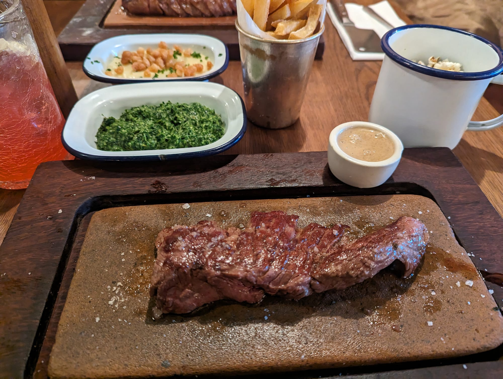
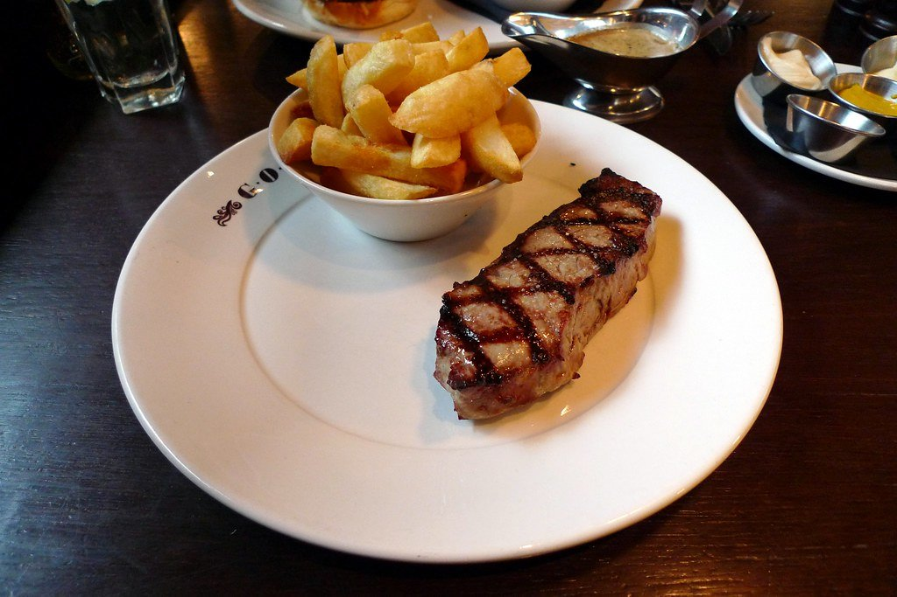

London does three different things with beef and they are not variations on each other. There is the **British steakhouse** — dry-aged native breeds over charcoal. There is the **Basque asador**, cooking rib chops from old dairy cows and serving them rare, sliced, for the table. And there is the **butcher's counter**, where the animal is the point and the room is incidental.

Order a txuleta expecting a sirloin and you will be surprised. So this guide starts with the places the sources agree on, then splits the rest by which of those three you actually want.

> 💡 **The Short Version:** **Hawksmoor** is the most-cited steak in London and the British benchmark. **Ibai** is the highest-placed, 7th in the world on the one ranking that covers this category. **Flat Iron** is £15 and genuinely good. **Blacklock** is the value pick and does chops and steaks equally. **The Guinea Grill** is the old-Mayfair one visitors never find.

> 📊 **The evidence behind this guide**
> Nothing here is ranked on one visit. This pass reads **21 sources carrying 119 citations** across **61 named restaurants**. **21 restaurants are named by two or more independent sources; 9 carry a dated ranking.**
> **Built on:** the World's 101 Best Steak Restaurants, which gives nine London rooms a judged placement, plus twelve publications.
> *Evidence rebuilt 30 August 2026 · [How we rank →](/how-we-rank/)*

## Where they are

  

    Map of the best steak restaurants in London
  

  

    
Loading the interactive map…

  

  <noscript>
    
The interactive map requires JavaScript. Every entry below lists its area.

  </noscript>

| If you are near… | Where to eat |
| --- | --- |
| **The City & Farringdon** | Ibai, Lutyens Grill, The Quality Chop House, Smiths of Smithfield |
| **Spitalfields & Shoreditch** | Hawksmoor, Brat, Sagardi |
| **Soho & Covent Garden** | Blacklock, Flat Iron, The Devonshire, Hawksmoor Seven Dials |
| **Mayfair** | The Guinea Grill, Goodman, CUT at 45 Park Lane |
| **Marylebone** | Lurra |
| **South Kensington** | Macellaio RC |
| **Further out** | Zoilo (Fitzrovia), Karve Steakhouse (Lower Clapton) |

**Price guide:** **£** under £15 · **££** £15–£35 · **£££** £40–£70 · **££££** £90+.

---

## The most agreed on

Ranked by how many independent sources name each one. Where a restaurant also has a placement in the World's 101 Best Steak Restaurants 2026, it is shown.

### Hawksmoor, Spitalfields

*££££ · several sites · Cited by 8 sources · #13, World's 101 Best Steak Restaurants*

**British beef dry-aged and grilled over charcoal**, in rooms that were mostly something else first — a brewery, a bank, a ballroom. Spitalfields was the original and set the template every London steakhouse since has worked from.

The beef is native breed, dry-aged on the bone and cooked over charcoal rather than in a broiler, which is the distinguishing choice. **Porterhouse and rib for two, priced by weight**, and the **bone-marrow gravy** and dripping-cooked chips are the sides that matter. The Sunday roast is among the best in London.

**££££ and it books weeks ahead.** Several London sites; Spitalfields, Guildhall and Air Street are the ones people name.

### Flat Iron, Soho

*£ · £15 · no bookings · Cited by 7 sources*

**One cut, one price.** No bookings, and the queue moves. The cheapest good steak in central London by a considerable distance, and the second most-cited restaurant on this page — which for a £15 plate is the whole argument.

*The whole proposition, in one photograph. The steak comes sliced on a board with a cleaver-handled knife, and the sides are ordered separately — creamed spinach and beef dripping chips are the two worth having.*

Popcorn arrives while you wait and there is free salted caramel ice cream at the end, which is a large part of why the queue is tolerable.

### CUT at 45 Park Lane, Mayfair

*££££ · 5 min from Hyde Park Corner · Cited by 6 sources*

**Wolfgang Puck's steakhouse inside 45 Park Lane**, and the room where London first met USDA prime alongside British and Japanese beef on the same menu.

The proposition is comparison: **Japanese A5 wagyu, USDA prime and British native breed** listed side by side and priced accordingly, so you can taste what the differences actually are. Everything comes off a hardwood and charcoal broiler.

**££££ and it books weeks ahead.** The most expensive steak in this guide by a distance, and the only place to do that comparison in one sitting.

### The Guinea Grill, Mayfair

*££££ · 7 min from Green Park · Cited by 6 sources · #99, World's 101 Best Steak Restaurants*

**A Mayfair pub with a grill room behind it that has been serving steak since 1952** — dark wood, red banquettes, and a room that has resisted every fashion since.

Beef is dry-aged in-house and grilled plainly, and the **steak and kidney pie** is as famous as the steaks — it has won national pie awards repeatedly and sells out most days. Order it if it is on.

**£££, and book for the grill room** — the pub at the front takes walk-ins and is a different, cheaper experience.

### Blacklock, Soho

*££ · chops and steaks · Cited by 6 sources*

Cooked over coals in a Soho basement, at prices well under the steakhouse average. The name says chops, but **the menu runs both** — skinny lamb and pork chops flattened under vintage Blacklock irons, and a proper steak list of Denver, bavette, rump cap, sirloin, sixth rib-eye and fillet at £16–24, dry-aged up to 55 days.

**The All In is the order** if there are two or more of you: pre-chop bites, then beef, pork and lamb piled onto charcoal-grilled flatbreads with a side each, for £28 a head. MORE FALLOW's chefs called the Canary Wharf site probably the best steakhouse in the UK.

The Sunday roast here is one of the best in London.

**Book:** [Reserve a table](https://theblacklock.com/restaurants/blacklock-soho/)

### The Quality Chop House, Clerkenwell

*£££ · 4 min from Farringdon · Cited by 4 sources*

**The 1869 room is Grade II listed and the wooden booths are deliberately uncomfortable** — built as a working man's dining hall and never refitted, with "Progressive Working Class Caterer" still on the sign.

The beef is properly sourced and simply cooked, but the dish that made the room famous is a side: **confit potatoes**, thin-sliced, pressed into a block, confited and fried so the layers separate. Order them regardless of what else you have.

**£££ and it books weeks ahead.** Farringdon. The butcher's shop next door sells the same beef to take home.

### Goodman, Mayfair

*££££ · 4 min from Oxford Circus · Cited by 4 sources*

A New York steakhouse played completely straight — leather booths, a specials chalkboard, and no concept beyond aged beef cooked correctly.

The useful quirk is that **USDA and British dry-aged cuts sit on the same menu**, so you can taste the difference in one sitting rather than arguing about it. Mayfair and the City are the sites to use.

*The dry-ageing is done in-house, and the American and British cuts sit side by side on one menu. Photo: [Ewan-M](https://www.flickr.com/photos/55935853@N00/4567552384), [CC BY-SA 2.0](https://creativecommons.org/licenses/by-sa/2.0/).*

---

Powered by <a target="_blank" rel="sponsored" href="https://www.getyourguide.com/london-l57/">GetYourGuide</a>

## By style

Three different products. Ordering the wrong one is the most common mistake on this page.

### British steakhouse

Dry-aged native breeds over charcoal — Longhorn, Hereford, Aberdeen Angus. [Hawksmoor](#hawksmoor-spitalfields), [Blacklock](#blacklock-soho), [The Guinea Grill](#the-guinea-grill-mayfair), [Goodman](#goodman-mayfair) and [The Quality Chop House](#the-quality-chop-house-clerkenwell) are all above. Two more:

#### Lutyens Grill, City of London

*££££ · 1 min from Bank · Cited by 3 sources · #35, World's 101 Best Steak Restaurants*

The old bank manager's office inside The Ned, which is exactly as clubbable as that sounds.

Rare-breed Longhorn and Hereford, and **44-day-aged prime rib carved at your table from a trolley** — the kind of service that had almost died out.

#### Smith & Wollensky, Covent Garden

*££££ · 4 min from Embankment · Cited by 3 sources*

The New York institution's London site, on the Adelphi building by the river. USDA Prime, dry-aged in house, and a room built at a scale nothing else here attempts.

### Basque asador

A coal fire and an aged rib chop. **Txuleta comes from old dairy cows rather than young cattle** — darker, more mineral, and far more intensely flavoured than a British steak. It is ordered rare and sliced for the table, and asking for it well done defeats the point.

#### Ibai, Farringdon

*££££ · 4 min from Barbican · Cited by 5 sources · #7, World's 101 Best Steak Restaurants*

**The highest-placed steak restaurant in London** on the only ranking that covers the category — seventh in the world. From Txuleta, one of the country's leading meat suppliers, who opened a restaurant to sell the best of what they source.

**Book:** [Reserve a table](https://www.ibai.london/)

#### Sagardi, Shoreditch

*£££ · 9 min from Old Street · Cited by 3 sources · #90, World's 101 Best Steak Restaurants*

London's most accessible asador — Ibai and Lurra book out weeks ahead, this one often does not. **Txuleton from old free-range cows**, over a charcoal grill set in the middle of the dining room, with the butchery room open to view as you walk in.

Cheaper than the other two, and the gap in quality is smaller than the gap in price.

#### Lurra, Marylebone

*££££ · 3 min from Marble Arch · Cited by 2 sources*

**Aged Galician txuleta and whole turbot over coals**, from the same team as Ibai. The turbot is as much the reason to come as the beef.

**Book:** [Reserve a table](http://www.sevenrooms.com/reservations/lurramarylebone)

### Butcher's counters and fire

#### Brat, Shoreditch

*£££ · 5 min from Shoreditch High Street · Cited by 2 sources · #17, World's 101 Best Steak Restaurants*

Tomos Parry cooking over wood in a first-floor room above a Shoreditch pub. Basque in influence rather than in name, and the **whole grilled turbot** is what it is known for — but the beef placed it 17th in the world.

**Book:** [Reserve a table](http://bratrestaurant.com/)

#### Macellaio RC, South Kensington

*£££ · 5 min from South Kensington · Cited by 2 sources*

**A butcher's counter that became a restaurant** — Piedmontese Fassona beef hung in the window and cut to order in front of you. Fassona is lean and low-fat, usually served rare or raw; the **carne cruda** is the dish that explains the place.

#### The Devonshire, Soho

*££ · 3 min from Piccadilly Circus · Cited by 2 sources · #45, World's 101 Best Steak Restaurants*

Better known as the hardest pint to get in Soho, but the dining room upstairs grills over coals and placed 45th in the world. Getting in is the whole problem — it does not take bookings for the bar, and the restaurant goes weeks out.

---

## Best value

* **[Flat Iron](#flat-iron-soho)** — £15 for a single 200g cut, no bookings. *Cited by 7 sources*
* **[Blacklock](#blacklock-soho)** — the All In at £28 a head, and a dry-aged steak list from £16. *Cited by 6 sources*
* **[Hawksmoor](#hawksmoor-spitalfields)** — the set lunch is the same beef and the same kitchen at a fraction of the dinner price. *Cited by 8 sources*
* **[The Guinea Grill](#the-guinea-grill-mayfair)** — the award-winning steak and kidney pie, in a Mayfair grill room, for a fraction of the beef price. *Cited by 6 sources*
* **[Sagardi](#sagardi-shoreditch)** — the cheapest of the three asadors and the easiest table. *Cited by 3 sources*

---

## Other restaurants worth knowing

Backed by the sources but not written up above, either because only two guides name them or because they sit outside the styles covered.

| Restaurant | Area | Price | What it is | Cited by |
| --- | --- | --- | --- | --- |
| **Zoilo** | Fitzrovia | £££ | Argentine, cooking by region rather than by cut | 2 sources · #96, World's 101 |
| **Chelsea Grill** | Chelsea | £££ | Placed 55th in the world and named by almost nobody else | 1 source · #55, World's 101 |
| **Sucre** | Soho | £££ | Argentine wood-fire cooking in a large Soho basement | 2 sources |
| **Gaucho** | Various | £££ | The Argentine chain; consistent rather than exciting, and everywhere | 2 sources |
| **M Restaurant** | Threadneedle Street | ££££ | A tasting flight of beef from different countries, side by side | 2 sources |
| **Daffodil Mulligan** | Old Street | £££ | Irish cooking over fire from Richard Corrigan | 2 sources |
| **Karve Steakhouse** | Lower Clapton | ££ | Everything over wood fire, and halal — a rare combination at this level | 1 source |
| **Smiths of Smithfield** | Farringdon | £££ | Next to the meat market it buys from, which is the entire proposition | 1 source |
| **Brutto** | Clerkenwell | ££ | The Florentine T-bone for sharing. Well supported as **Italian** rather than as steak | — |
| **Zelman Meats** | Knightsbridge | ££ | Sliced picanha and sharing cuts from the Goodman group, priced well under its parent | — |

[See all steak restaurants →](/restaurants/cuisine/british)

---

## What to know

* **Ask how it is aged.** Dry-aged and wet-aged are different products and every restaurant here will tell you which.
* **Basque txuleta is ordered rare and sliced** for the table. Asking for it well done defeats the point and the kitchen will tell you so.
* **Steak is priced by weight** at the asadors and butcher counters. Confirm the total before agreeing.
* **Rest matters.** The good places rest the meat properly, which is why it arrives later than you expect.
* **Flat Iron and The Devonshire take no bookings** for their main rooms. Everything else here does, and Ibai and Lurra need weeks.
* **Service charge** of 12.5% is discretionary and standard.

---

## Continue planning your London trip

- 🥩 **[The Best Sunday Roast in London](/articles/best-sunday-roast-london/)**
- 🍝 **[The Best Italian Restaurants in London](/articles/best-italian-restaurants-london/)**
- 🥘 **[Best Spanish Restaurants in London](/articles/best-spanish-restaurants-london/)**
- ⭐ **[Special Occasion Restaurants in London](/articles/special-occasion-restaurants-london/)**
- 🍽️ **[Eat in London: Restaurants, Food Markets & Quick Food Hub](/articles/eat-in-london-guide/)**
- 💷 **[Cheap Eats in London](/articles/cheap-eats-london/)**
