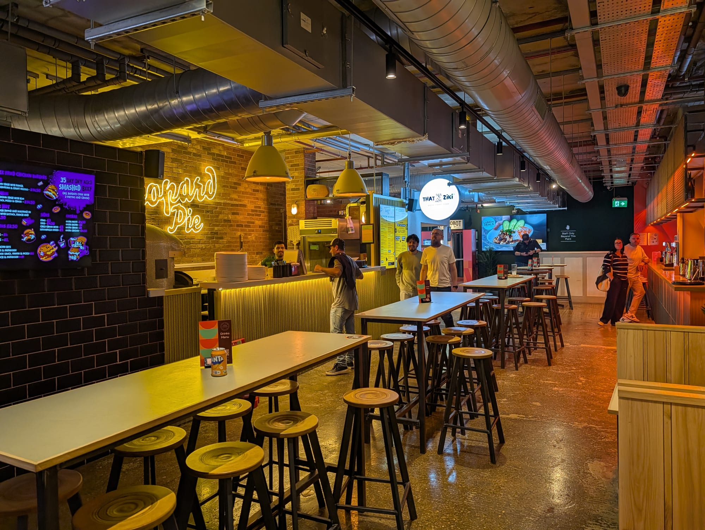
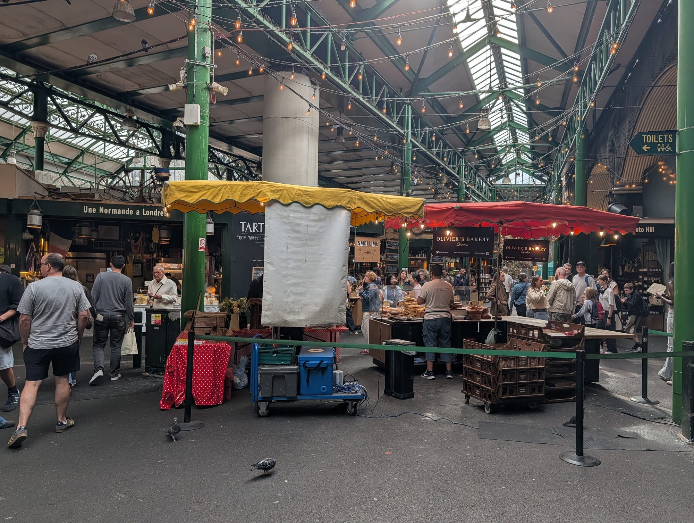
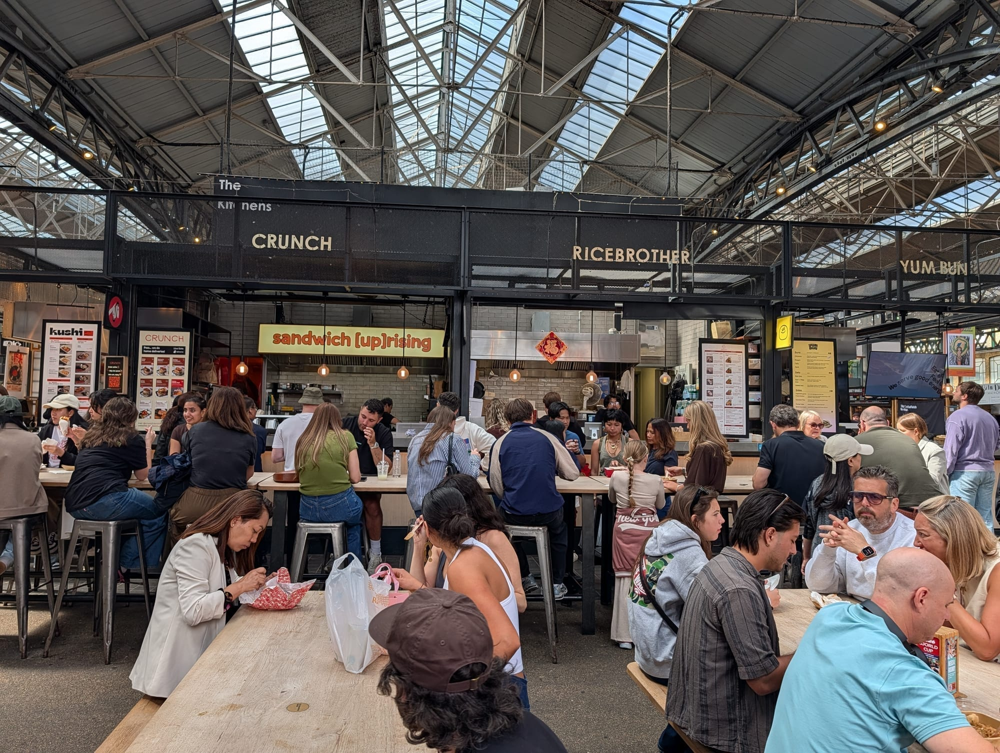
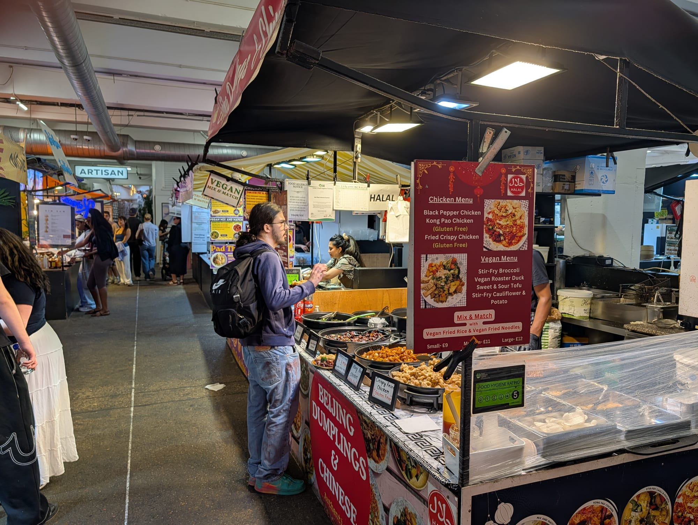
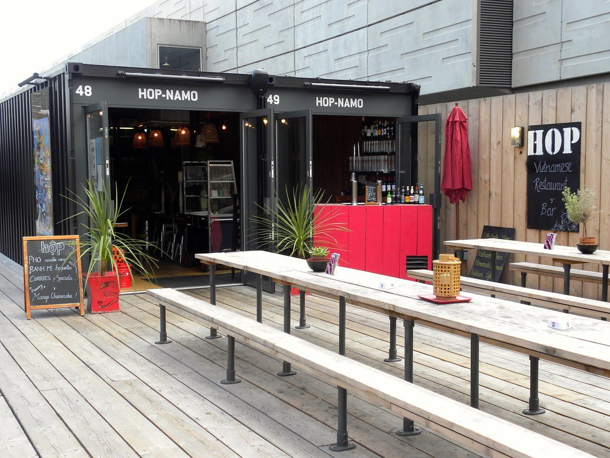
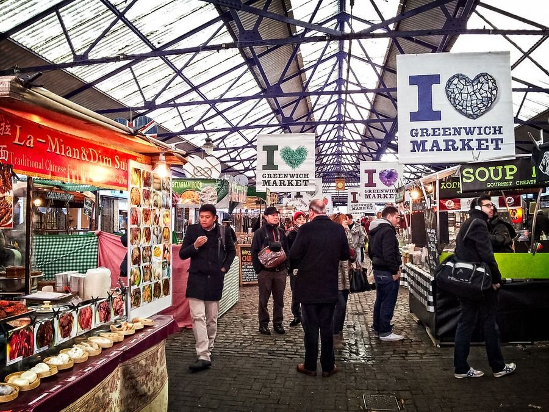

London's street food is not one thing, and the difference that actually decides your afternoon is not the food. It is the roof.

**Covered food halls** — Seven Dials, the Arcades, Market Halls, Boxpark — trade most days, have proper seating, and work in the rain. **Outdoor markets** — Maltby Street, Broadway Market, the Southbank Centre — have better atmosphere, worse seating, and several of them only exist two or three days a week. Turning up on the wrong day is the standard way to waste a morning here, and it is the thing this guide is built around.

> 💡 **The Short Version:** **Borough** is the one everything else is measured against, and it is **closed Mondays**. **Seven Dials Market** is the best covered hall in the centre. **Bang Bang Oriental** in Colindale has the deepest pan-Asian line-up in Britain and is a proper trek. **Maltby Street** is Friday evening to Sunday only. And **Mercato Metropolitano at Elephant & Castle closes at the end of 2026** — go while you can.

> 📊 **How this guide is put together**
> Street food has no judged award and only a handful of editorial rankings, so this is **not** a consensus ranking in the way our restaurant guides are. Three independent lists — Time Out, Hot Dinners and DesignMyNight — are used to establish which venues the press agrees are worth naming; everything else here is **checked against each venue's own site**.
> **Prices are deliberately not listed.** Almost no London food hall publishes a venue-wide price guide, and a made-up figure is worse than none. Assume roughly £9–16 for a main plate almost everywhere, less at the weekday street markets.
> *Checked 31 August 2026 · [How we rank →](/how-we-rank/)*

---

## Where they are

  

    Map of London's street food markets and food halls
  

  

    
Loading the interactive map…

  

  

    <i class="restaurant-map-key restaurant-map-key--editorial" aria-hidden="true"></i> Covered food hall
    <i class="restaurant-map-key restaurant-map-key--streetfood" aria-hidden="true"></i> Market, yard or street market
  

  <noscript>
    
The interactive map requires JavaScript. Every venue below lists its area and nearest station.

  </noscript>

**The pattern the map shows**, which is worth knowing before you plan: the covered food halls cluster in the centre and in the places people commute through, while the outdoor markets sit in a ring around them — Hackney, Bermondsey, Peckham, Brixton, Greenwich. The best of the outdoor ones are the furthest out, and several of those are weekend-only.

---

## The comparison

**Days are the column that matters.** Hours shift seasonally and by trader at almost every venue on this page, so treat them as a guide and check before a special trip.

| Venue | Area | Type | Traders | Variety | Seating | Days |
| --- | --- | --- | --- | --- | --- | --- |
| **Borough Market** | London Bridge | Market | 100+ stalls and shops | Everything | Scarce | **Closed Mon**, Tue–Sun |
| **Seven Dials Market** | Covent Garden | Food hall | 21 | Pan-global | Plenty | Daily |
| **Arcade Food Hall** | Tottenham Court Rd | Food hall | 7 chef-led | Thai, Levantine, Mexican, ramen | Plenty | Daily |
| **Arcade Food Hall** | Covent Garden | Food hall | 7 chef-led | Greek Cypriot, Thai, Indian, tacos | Plenty | Daily, latest in the centre |
| **Arcade Food Hall** | Battersea | Food hall | 13 | The widest spread of the three | Plenty | Daily |
| **Bang Bang Oriental** | Colindale | Food hall | 25+ | Pan-Asian, unmatched depth | Plenty, 450 covers | Daily |
| **Market Halls Victoria** | Victoria | Food hall | 9 + 3 bars | Burgers, Thai, Malaysian, kebabs | Plenty, 3 floors + roof | Daily |
| **Market Halls Oxford Street** | Oxford Circus | Food hall | 9 + 2 bars | Malaysian, Thai, BBQ, pizza | Plenty | Daily |
| **Market Halls Canary Wharf** | Canary Wharf | Food hall | 11 + 3 bars | Caribbean, Thai, Malaysian | Plenty | Daily, breakfast to late |
| **Market Halls Paddington** | Paddington | Food hall | 8 | Argentine grill, Greek, Thai | Plenty | Daily |
| **Tower Bridge Collective** | Shad Thames | Food hall | 13 | Korean, Thai, Ethiopian, Palestinian | Plenty, 2 floors | Daily from 8am |
| **Mercato Metropolitano** | Elephant & Castle | Food hall | 40+ | The most genuinely diverse | Plenty | Daily · **closing end of 2026** |
| **Mercato Mayfair** | Mayfair | Food hall | 19 | Italian-led, in a Grade I church | Plenty | Daily |
| **Boxhall** | Liverpool Street | Food hall | 14 | Sri Lankan, Singaporean, bao | Plenty, Edwardian arcade | Daily |
| **Boxpark Shoreditch** | Shoreditch | Container | ~15 food | Greek, Caribbean, pizza, burgers | Plenty | Daily |
| **Boxpark Camden** | Camden | Container | ~15 food | Birria, Nepali, Vietnamese, Greek | Plenty | Daily |
| **Boxpark Wembley** | Wembley Park | Container | 22–24 | Greek, Korean, Brazilian BBQ | Plenty | Daily · **event days differ** |
| **Boxpark Croydon** | East Croydon | Container | 22–24 | Afghan, Taiwanese, West African | Plenty | Daily, latest closing |
| **Market Place** | Leicester Sq, St Paul's, Vauxhall, Peckham, Harrow | Food hall | 9–16 per site | Argentine, Filipino, Greek, Thai | Plenty | Daily · **St Paul's closed Sun** |
| **Old Spitalfields Market** | Spitalfields | Market | 45 food businesses | Global, plus restaurants | Some, covered | Daily · **Thu is antiques, opens 8am** |
| **Upmarket, Brick Lane** | Brick Lane | Market hall | 40+ | Pan-global, cheapest in the east | Scarce | Daily, **11am–6pm only** |
| **Camden Market** | Camden | Market | Not published | As broad as it gets | Some, canalside | Daily · **Thu night market to 9pm** |
| **Greenwich Market** | Greenwich | Market | 120 shops and stalls | Global | Scarce | Daily · **street food market Fri–Sun** |
| **Brixton Village** | Brixton | Arcades | Not published | Caribbean, Colombian, Japanese | Plenty | **Closed many Mondays** |
| **Maltby Street** | Bermondsey | Market | ~11 + arches | French, Ethiopian, Cuban, Greek | Scarce | **Fri 5.30–9pm, Sat, Sun only** |
| **Broadway Market** | Hackney | Market | Not published | Global, plus produce | Scarce | **Sat and Sun only** |
| **Netil Market** | London Fields | Market | 7 | Burgers, noodles, bagels | Some | Daily, later Wed–Sat |
| **Southbank Centre Food Market** | Waterloo | Market | 30–40 | Dosas, Afghan, Vietnamese | Scarce | **Fri–Sun only** |
| **Canopy Market** | King's Cross | Market | ~20 | Spanish, Greek, Thai, oysters | Some, covered | **Wed–Sun only** |
| **Hackney Bridge** | Hackney Wick | Container | 8 | Filipino, pizza, tacos, sushi | Plenty, canalside | **Closed Mon** |
| **Vinegar Yard** | London Bridge | Yard | Not published | Indian, pan-Asian, burgers | Plenty | **Closed Mon, opens late afternoon** |
| **Flat Iron Square** | Southwark | Yard | 5 | Greek, fried chicken, pizza | Plenty | Daily, more beer garden than market |
| **Corner Corner** | Canada Water | Food hall | 4–5 | Fried chicken, tacos, bao | Plenty, huge | Daily, kitchens from midday |
| **Canteen** | North Greenwich | Food hall | 6 | Jamaican, ramen, Greek, congee | Plenty | Daily, **traders from 11.30am** |
| **Pop Brixton** | Brixton | Container | 9 | Trinidadian, Greek, West African | Plenty, outdoor | **Closed Mon · closing for good** |
| **Peckham Levels** | Peckham | Container | Reduced — check | Varies | Plenty, Level 6 view | **Closed Mon and Tue** |
| **Whitecross Street** | Old Street | Street market | Not published | Kurdish, Korean, Ethiopian | Standing only | **Weekday lunchtimes only** |
| **Leather Lane** | Farringdon | Street market | 103 pitches | Thai, Lebanese, Indian | Standing only | **Mon–Fri, ~10am–4pm** |
| **Broadway Market Tooting** | Tooting | Arcade | 28 | Ramen, Basque, Jamaican, Filipino | Plenty | **Many units closed Mon, evenings only midweek** |
| **Food Hall @ 17&Central** | Walthamstow | Food hall | 8 + bar | Mexican, Neapolitan pizza, South Asian, wok | Plenty, plus soft play | Daily from 9am |

---

## Covered food halls

Trade most days, seat everybody, work in the rain. If you are travelling with people who want different things and nobody wants to make a decision, this is the format.

### Seven Dials Market, Covent Garden

*21 traders · daily · Cited by 3 sources*

**The best covered food hall in central London**, in a former banana-ripening warehouse off Earlham Street. Twenty-one traders over two floors with two bars, run by KERB.

The line-up is a genuine spread rather than a burger court: **Bleecker** for dry-aged smash cheeseburgers, **Pick & Cheese** for a conveyor belt of British cheese matched to condiments — which is the only one of its kind anywhere — plus pizza, dumplings and a long run of pan-global counters. Communal benches downstairs, a mezzanine above.

**Plenty of seating, walk-in only, and it is rammed between 7pm and 9pm on Friday and Saturday.** Weekday lunch is the civilised time. Two minutes from Covent Garden station.

*Seven Dials Market, in a former banana-ripening warehouse. Twenty-one traders over two floors.*

### Arcade Food Hall, Tottenham Court Road, Covent Garden and Battersea

*7–13 kitchens per site · daily · Cited by 3 sources*

**The chef-led end of the format** — closer to a collection of proper restaurants sharing a room than a street food market, and priced accordingly.

Tottenham Court Road has seven kitchens including **Plaza Khao Gaeng** for Southern Thai curries and **Supa Ya Ramen**. Covent Garden has seven more and stays open latest of anything in central London on a Friday. Battersea has thirteen and the widest cuisine spread of the three, including **BAO** and Indonesian duck at **Bebek! Bebek!**

**Plenty of seating, indoors, walk-in.** The Tottenham Court Road site is inside Centre Point, straight up from the Tube.

### Bang Bang Oriental, Colindale

*25+ kiosks · daily · Cited by 3 sources*

**The deepest pan-Asian food hall in Britain** and the successor to the much-missed Oriental City — Chinese, Korean, Japanese, Vietnamese, Malaysian, Singaporean and Taiwanese counters around 450 covers.

It is strip-lit and functional rather than handsome, and that is the point: this is where you go for regional cooking that central London does not do, not for the room. Expect **hand-pulled noodles, Hong Kong roast duck and char siu over rice, Malaysian nasi goreng and laksa, Korean fried chicken, Taiwanese bao and bubble tea, Vietnamese pho** and a proper dim sum counter, with a large Asian supermarket attached.

**Be honest with yourself about the journey.** Colindale is a 45-minute Tube ride from the centre on the Northern line, and this is a destination rather than a stop. **Walk-in only, no reservations.**

### Market Halls, Victoria, Oxford Street, Canary Wharf and Paddington

*8–11 kitchens per site · daily · Cited by 3 sources*

**Four sites, all in places you already have to be** — which is the whole proposition. Between eight and eleven kitchens each, plus bars.

Recurring names worth ordering from: **Le Bab** for gourmet kebabs, **Gopal's Corner** for Malaysian roti canai from the founder of Roti King, and **Black Bear Burger**, a former National Burger Awards winner. Victoria has three floors and a roof terrace; Paddington is seconds from the station and the best pre-train meal in London.

**Plenty of seating, walk-in, and most sites open from 8am** for breakfast.

### Food Hall @ 17&Central, Walthamstow

*8 traders plus a bar · daily from 9am*

**The most family-shaped food hall in London**, inside the 17&Central centre a minute from Walthamstow Central, and the only one on this page with a **soft play area** built into it.

Eight kitchens and a cocktail bar: **Carne** for Mexico City and Tijuana street food, **Grano Fresco** for Neapolitan pizza, **Rice N Spice** for South Asian grills and kebabs, **Hi Wok**, **Condito**, **Monkey Bite**, **Naked Chips** for loaded fries, and **Perky Blenders**, the east London roaster, for coffee. **The Drift** does the cocktails.

**Open earlier and later than almost anything comparable: 9am to 9pm Monday to Thursday, 9pm on Friday and Saturday, and 10am to 7pm on Sunday.** Starting at 9am means it works for breakfast, which most food halls do not.

There are two event spaces and a programme of classes, supper clubs and workshops, so it functions as a community building rather than purely as somewhere to eat — which is the reason to come out here rather than a reason to avoid it. **45 Selborne Walk, E17 7JR**, and the Victoria line puts you at the door.

### Tower Bridge Collective, Shad Thames

*13 kitchens · daily from 8am*

**The newest serious food hall in central London**, open since October 2025 in a converted office block a minute from the southern end of Tower Bridge. Thirteen independent kitchens over two floors — no chains.

Korean fried chicken from **Clapping Seoul**, Palestinian **musakhan** from Baity, Greek gyros from Thatziki, Eritrean and Ethiopian stews from **House of Habesha**, Neapolitan pizza from Leopard Pie.

**Open 8am to 10.30pm every day**, with a children's play area and sandpit, which almost no other food hall bothers with. Full entry in our [markets guide](/articles/best-london-markets/#tower-bridge-collective-shad-thames).

*Tower Bridge Collective, open since October 2025. Thirteen independent kitchens over two floors.*

### Mercato Metropolitano, Elephant & Castle

*40+ traders · daily · **closing at the end of 2026** · Cited by 2 sources*

**The best-value and most genuinely diverse big food hall in London**, and it has an expiry date — Southwark approved the Borough Triangle redevelopment in March 2026 and the site trades only until the end of the year.

Forty-plus independents across 17,000 square feet, and the range is the reason to mourn it: Nigerian **jollof rice and suya**, **Uzbek plov** cooked in a kazan, Syrian **shawarma and fatteh**, Korean fried chicken, Sri Lankan **kottu roti**, Jamaican **jerk chicken**, Argentine **empanadas and choripán**, Nepali **momo**, and a large Italian contingent doing pizza, pasta and salumi. Indoor and outdoor seating, and a bar that stays open late.

**Go before it closes.** Its sibling at Wood Wharf is smaller and calmer, with a riverside terrace and garden igloos, and is not closing.

---

Powered by <a target="_blank" rel="sponsored" href="https://www.getyourguide.com/london-l57/">GetYourGuide</a>

## Markets where the food is the point

Better atmosphere, worse seating, and several only exist a few days a week.

### Borough Market, London Bridge

*100+ stalls · **closed Mondays** · Cited by 2 sources*

**The most famous food market in Britain and the one everything else is measured against** — a wholesale market since at least the 12th century, now produce traders and hot food side by side under the railway.

**Borough Market Kitchen** is the dedicated street food section. Elsewhere it is cheese, fish, charcuterie and produce, plus **Bao Borough** for Taiwanese bao and **Arabica** for shawarma. Horn OK Please and Gujarati Rasoi are the two vegetarian Indian stalls worth crossing London for.

**Closed Mondays.** Tuesday to Friday 10am–5pm, Saturday 9am–5pm, Sunday 10am–4pm, and seven days through December. Saturday is heaving; **Tuesday or Wednesday morning is the same market with room to move.** Seating is scarce — this is a standing-and-walking market.

*Borough Market on a weekday morning, which is the only sensible time to go.*

### Maltby Street Market, Bermondsey

*~11 traders plus arch businesses · **Friday evening to Sunday only***

**A cramped railway alley called the Ropewalk that everyone rediscovers every summer** — and the market Londoners use instead of Borough, ten minutes away.

French, Ethiopian, Vietnamese, Cuban sandwiches, Chinese dumplings, Argentine empanadas and duck frites, plus permanent arch businesses doing gin, cheese and wine.

**Friday 5.30–9pm, Saturday 10am–5pm, Sunday 11am–4pm — and nothing the rest of the week.** Seating is scarce and largely uncovered: brilliant on a dry Saturday, miserable in the rain.

### Southbank Centre Food Market, Waterloo

*30–40 traders · **Friday to Sunday only***

**The most reliable weekend street food in central London**, and the only place on the South Bank where you can eat well within sight of the Thames without a restaurant bill.

Indian dosas from **Horn OK Please**, Afghan, Vietnamese, Polish, Levantine, French crêpes and Sicilian cannoli.

**Friday 12pm–9pm, Saturday and Sunday 11am–9pm, plus bank holiday Mondays 12pm–6pm.** The catch nobody mentions: **it is on the Belvedere Road side, behind the Royal Festival Hall — not on the river.** Thousands walk past it every weekend forty metres away. Seating is picnic benches and the wall. **Closed from around 21 December to 30 January**, when the Winter Market takes the space.

*The Southbank Centre Food Market. Friday to Sunday only, and behind the Royal Festival Hall rather than on the river.*

### Broadway Market, Hackney

*Saturday and Sunday only*

**The archetypal east London weekend** — global street food alongside produce, bakery and cheese, on a street that is otherwise ordinary shops.

The food runs to **salt beef bagels, Ghanaian and Nigerian plates, dumplings, paella, raclette and toasties**, threaded between produce stalls, a very good cheesemonger and several bakeries — it is a shopping market with excellent hot food rather than a food market with shopping attached.

**Saturday 9am–5pm and Sunday 10am–4pm, and that is it.** Seating is nonexistent: buy something and take it into London Fields, which is what everybody does. **Netil Market** is two minutes away, smaller and scruffier, and open more days.

### Old Spitalfields Market, Spitalfields

*45 food and drink businesses · daily · Cited by 1 source*

**More a retail market with very good food attached than a street food destination**, under a Victorian roof between Liverpool Street and Brick Lane.

**The Kitchens** is the food section — a dozen counters around long communal tables, and the most reliable weekday lunch in the area. There is a KERB sports bar and a run of sit-down restaurants around the edge.

**Open daily, but Thursday is the antiques day and starts at 8am** with a different, earlier rhythm. Covered, so it works in the rain, and seating is reasonable.

*The Kitchens at Old Spitalfields — a dozen counters around shared tables, and the most reliable weekday lunch in the area.*

### Upmarket, Brick Lane

*40+ traders · daily, 11am–6pm*

**The cheapest pan-global grazing in east London**, in the Old Truman Brewery — Ethiopian injera, Korean skewers and roughly everything else.

It is now open **daily rather than weekends only**, which catches people out in both directions: the food hall trades every day, but the surrounding retail markets only expand at weekends, and **everything shuts at 6pm.**

Seating is scarce and it is chaotic. Note that the **Boiler House**, which older guides still send people to, is no longer one of the Truman Brewery's markets.

*The format in one frame: a stall cooking one cuisine properly, a hand-lettered board doing the selling, and forty more a few steps down the hall. Note the queue is one person deep — this is what a weekday lunchtime looks like, and why it beats the weekend.*

### Canopy Market, King's Cross

*~20 food traders · **Wednesday to Sunday only***

**The most civilised market on this page** — under the West Handyside Canopy, a Victorian goods canopy behind Granary Square, with traders who take themselves seriously and a decent wine list.

Spanish tapas and paella, Greek gyros, Thai curries, Indian chaat and fresh Italian pasta, plus **Rocks Oysters** shucking to order and **Bread Ahead** doughnuts — the last two being the reason a lot of people come at all. There is a proper bar rather than a drinks stall.

**Closed Monday and Tuesday.** Covered but open-sided — sheltered from rain, not from cold.

---

Powered by <a target="_blank" rel="sponsored" href="https://www.getyourguide.com/london-l57/">GetYourGuide</a>

## Container yards and regeneration sites

Outdoor, sociable, drink-led, and the format most likely to have changed since you last looked.

*Boxpark Shoreditch, built out of shipping containers in 2011. It was served notice in 2024 and reprieved. Photo: [JasonParis](https://www.flickr.com/photos/94064020@N00/8063833095), [CC BY 2.0](https://creativecommons.org/licenses/by/2.0/).*

* **Boxpark Shoreditch** — the original, and it survived the closure notice it was served in 2024. Around fifteen food units plus shops and a bar, daily.
* **Boxpark Camden** — on the old Buck Street Market site by the station, 10am–11pm daily. Birria tacos, Nepali momo, Vietnamese pho and Black Bear Burger.
* **Boxpark Wembley and Croydon** — 22 to 24 units each. Wembley is a matchday and gig venue first; **its hours change for stadium events**. Croydon is the latest-opening and the most local-feeling.
* **Hackney Bridge**, Hackney Wick — eight kitchens plus a canalside garden, **closed Mondays**. The last of the Wick's canal yards still doing this properly.
* **Vinegar Yard**, London Bridge — scrap-metal dinosaurs, a weekend flea market and a handful of traders. **Closed Mondays and it does not open until late afternoon midweek**, which surprises lunchtime visitors.
* **Flat Iron Square**, Southwark — five food traders, two bars and a taproom in railway arches. More beer garden than food market, and its own site publishes conflicting hours.
* **Corner Corner**, Canada Water — enormous, with free live music and an indoor vertical farm, but only four or five kitchens. **Kitchens run from midday**; the café opens earlier.
* **Peckham Levels** — **closed Monday and Tuesday**, and the food offer has shrunk since the site changed hands. The Level 6 view is still one of the best free things in south London. Check what is actually open before travelling.

---

## Weekday lunch markets

Standing only, no seating, and a two-to-four hour window. These are for people who work nearby, which is exactly why they are good.

* **Leather Lane**, Farringdon — **Monday to Friday, roughly 10am–4pm**, busiest 12–2. Thai, Lebanese and Indian counters among 103 pitches. Go at 12.15 and join the longest queue.
* **Whitecross Street**, Old Street — **weekday lunchtimes only**, and sources disagree on whether it runs Monday to Thursday or all week. Kurdish, Korean, Ethiopian, Mexican and a hog roast.
* **Strutton Ground**, Westminster — a small civil-servant lunch market, weekdays, unglamorous and reliable.
* **Exmouth Market**, Farringdon — stalls at weekday lunchtimes on a pedestrianised street that is worth visiting for its restaurants anyway.
* **Berwick Street**, Soho — **much diminished**, down from around fifty stalls two decades ago to as few as a dozen on a slow day. Worth a pass-through if you are in Soho; never plan a trip around it.

---

## Further out, and worth the journey

* **Broadway Market Tooting** — 28 restaurants and bars in a covered arcade, and the best-value sit-down eating in south London. **Many units close Monday and open only from late afternoon midweek**; weekends are the reliable time.
* **Brixton Village and Market Row** — covered arcades of small independent restaurants rather than stalls, so everybody seats their own. **Many close Mondays.**
* **Greenwich Market** — the covered Georgian hall trades daily; the **Cutty Sark street food market alongside it is Friday to Sunday only.**

*Greenwich Market. The covered hall is one of the nicest rooms in London to eat in, and it trades every day.*
* **Kingston Ancient Market** — a handsome market square with hot food, seven days a week.
* **Deptford Market Yard** — railway arches with a fortnightly Saturday market, much less discovered than Maltby Street.

---

## Seasonal, and once a year

* **Southbank Centre Winter Market** — Alpine chalets on the Queen's Walk, **3 November to 4 January**, daily. It displaces the regular food market for those weeks.
* **Hyde Park Winter Wonderland** — the biggest concentration of food stalls in London for six weeks, **mid-November to early January**. Expensive, enormous, and not really a street food destination.
* **Wembley Park Market** — **weekend dates that move month to month**, and shift around stadium events. Always check first.
* **Alexandra Palace Farmers' Market** — every **Sunday 10am–3pm**, though the location alternates between the park and Campsbourne School.
* **Brockley Market** — **Saturdays only, 10am–2pm.** A four-hour window with excellent hot breakfast stalls.
* **Herne Hill Market** — **Sundays only, 10am–4pm.**
* **Victoria Park Market** — **Sundays**, and you eat in one of London's best parks.

---

Powered by <a target="_blank" rel="sponsored" href="https://www.getyourguide.com/london-l57/">GetYourGuide</a>

## Going, or already gone

Street food turns over faster than any other part of London eating, and a lot of guides are years out of date.

* **Mercato Metropolitano, Elephant & Castle** — trading only **until the end of 2026**. A 892-home redevelopment was approved in March 2026.
* **Pop Brixton** — in administration since 2024, lease extended to winter 2026, and a 288-home scheme for the site has been approved. Expect closure.
* **Street Feast's four sites** — Dinerama, Hawker House, Giant Robot and Model Market are **all closed**. The operating company was liquidated in 2020.
* **Buck Street Market**, Camden — now Boxpark Camden.
* **Market Halls Fulham** — closed in 2021. The four remaining sites all trade.
* **The Boiler House**, Brick Lane — no longer listed by the Old Truman Brewery.

---

## What to know

* **Check the day, not the hours.** Maltby Street, Broadway Market, the Southbank Centre, Canopy Market and the Cutty Sark market are all part-week only. This is the single most common wasted journey.
* **Borough is closed on Mondays**, and so are Hackney Bridge, Vinegar Yard and many Brixton Village units. Monday is the worst day for street food in London by a distance.
* **Covered halls for rain and for groups; outdoor markets for atmosphere.** If it is wet or somebody in your party is fussy, pick a food hall.
* **Seating is the thing people underestimate.** Borough, Maltby Street, Broadway Market and the Southbank Centre are all standing-and-walking. Every food hall on this page seats you properly.
* **Take a card.** The Southbank Centre is cash-free across the whole site and most hall traders are card-only.

---

## Continue planning your London trip

- 🛒 **[London's Best Markets: 19 Compared](/articles/best-london-markets/)** — including the flower, antiques and shopping markets
- 💷 **[Cheap Eats in London](/articles/cheap-eats-london/)** — 34 places to eat well under £15
- 🍔 **[The Best Burgers in London](/articles/best-burgers-london/)**
- 🗺️ **[Eat in London: the full food handbook](/articles/eat-in-london-guide/)**

---

*This guide is independent and contains no paid placements. Trading days were checked against each venue's own site in August 2026 — but they change, so confirm before travelling for a specific market.*
