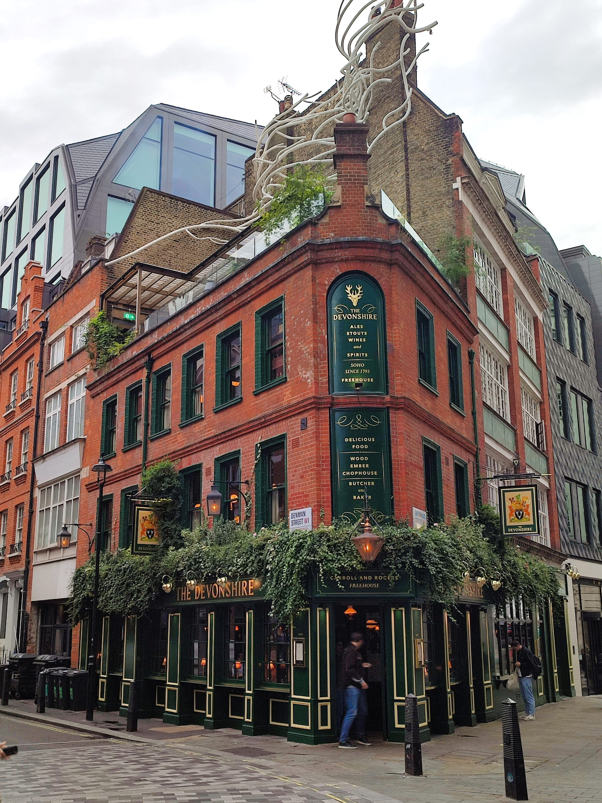
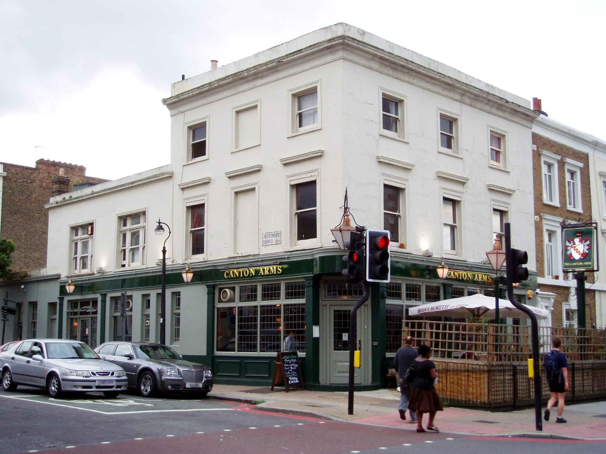
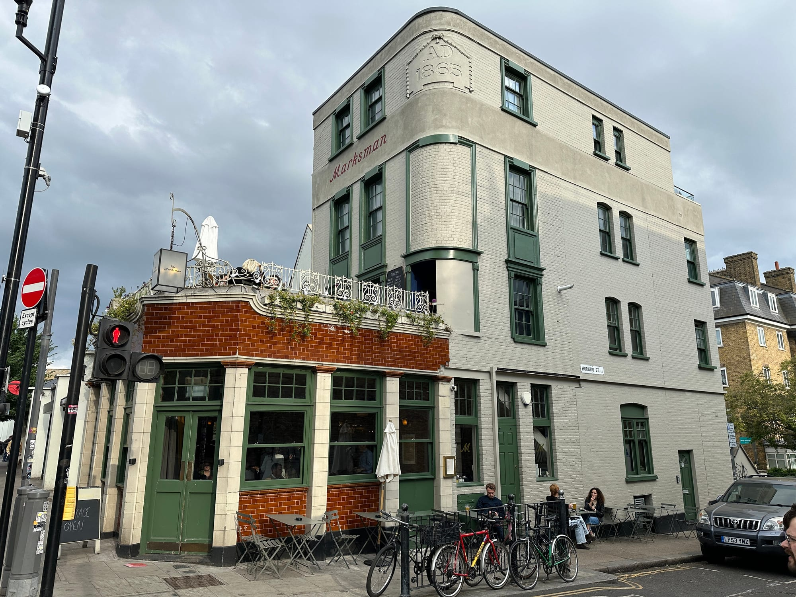

The Sunday roast is the meal London does that almost nowhere else attempts: a joint cooked for hours, a Yorkshire pudding the size of the plate, potatoes roasted in the fat and gravy poured over all of it. It is served for about five hours, one day a week, and then it is gone until next Sunday.

That scarcity is the whole practical problem — the good ones sell out, most want booking by Thursday, and turning up hopefully at three is how people end up eating a disappointing one. So rather than add another opinion, we counted. Every pub below is placed by how many independent awards, critics and reviewers name it, and where it actually finished when a ranking exists.

> 💡 **The Short Version:** **The Devonshire** is the most-cited roast in London and the UK's number one gastropub. **The Red Lion & Sun** is #3 in the country and the roast guides mostly miss it. **Canton Arms** is the best-placed pub that still takes walk-ins. **The Harwood Arms** is the only Michelin-starred pub. **Blacklock** and **Hawksmoor** are the group answer. And **The Tamil Crown** does the most interesting roast in the city.

> 📊 **The evidence behind this guide**
> Nothing here is ranked on one visit. This pass reads **19 sources carrying 115 citations** across **82 named pubs and restaurants**. **22 are named by two or more independent sources; 23 carry a dated ranking.**
> **Built on:** the Estrella Damm ranking and eight independent publications. Worth knowing: Estrella Damm judges the pub as a whole, across all seven days — so a rank below is evidence about the pub, not a verdict on the roast.
> *Evidence rebuilt 30 August 2026 · [How we rank →](/how-we-rank/)*

---

## Where they are

  

    Map of the best Sunday roasts in London
  

  

    
Loading the interactive map…

  

  <noscript>
    
The interactive map requires JavaScript. Every entry below lists its area.

  </noscript>

Eight of the sixteen ranked entries sit wholly outside Zone 1 and three more straddle Zones 1–2, so for most of this list a good Sunday roast means getting on a train. Of the four that are properly central, two — Blacklock and Hawksmoor — are restaurants rather than pubs.

---

## The most-cited roasts in London

### The Devonshire, Soho

*££ · Piccadilly Circus · Cited by 5 sources · #1, Estrella Damm Top 50 Gastropubs 2026*

The only pub in this guide that is both the most-cited roast and the top-ranked gastropub in the country, which is a rarer alignment than it sounds — the two usually disagree. It got there barely two years after opening.

The ground floor is a Guinness pub and a good share of the queue is there for the pour rather than the food. The roast is upstairs. Three separate video reviewers filmed a full day here in 2026, and all three describe the same problem: getting in.

**Book:** [devonshiresoho.co.uk](https://devonshiresoho.co.uk/) · **two minutes from Blacklock**

*The ground floor is a Guinness pub and the roast is upstairs. Photo: [Ewan-M](https://commons.wikimedia.org/wiki/File:Devonshire,_Soho,_W1.jpg), [CC BY-SA 4.0](https://creativecommons.org/licenses/by-sa/4.0/).*

### The Red Lion & Sun, Highgate

*££ · Highgate · Cited by 2 sources · #3, Estrella Damm Top 50 Gastropubs 2026*

The best-placed London pub in the country after The Devonshire, and the biggest gap between what a ranking says and what the roast guides do. Third in the UK, and the editorial lists barely acknowledge it — two sources here name it against The Camberwell Arms' four.

If you want the highest-rated London roast you have a realistic chance of booking, this is the one the data actually points at.

The roast itself is a straight, serious one: **beef cooked pink, dripping-roasted potatoes, a tall Yorkshire and a jug of gravy**, in a proper Highgate pub with a garden rather than a dining room pretending to be one. It is also the roast **Oisin Rogers of The Devonshire sends people to**, which is the strongest recommendation available in this trade.

**Book:** [theredlionandsun.com](http://www.theredlionandsun.com/) · **four minutes from The Bull**

### Canton Arms, Stockwell

*££ · Stockwell · Cited by 2 sources · #11, Estrella Damm Top 50 Gastropubs 2026 · #19, Time Out*

An old South Lambeth Road boozer that never rebranded into anything, ranked eleventh in the country, at pub prices. It is also the only pub near the top of this list that deliberately holds back space for walk-ins.

That combination — high placement, low price, no booking required — does not exist anywhere else in this guide.

**Book:** [cantonarms.com](https://cantonarms.com/bookings/)

*An old South Lambeth Road boozer that never rebranded, ranked eleventh in the country, and the realistic walk-in on this page. Photo: [Ewan Munro](https://commons.wikimedia.org/wiki/File:Canton_Arms,_South_Lambeth,_SW8_(3838932573).jpg), [CC BY-SA 2.0](https://creativecommons.org/licenses/by-sa/2.0/).*

### The Baring, Islington

*££ · Angel · Cited by 2 sources · #17, Estrella Damm Top 50 Gastropubs 2026*

**Seventeenth in the country in the 2026 Estrella Damm Top 50**, and in The Infatuation's description more a sit-down restaurant than a pub you can drink in — which is the fair way to set expectations.

The roast is a proper plated one rather than a pub carvery: **beef with a Yorkshire pudding that arrives properly risen**, roast potatoes in beef fat, and greens that have been cooked rather than boiled. Gravy comes in a jug and is refillable, which is the test.

**££, closed Monday, and it books weeks ahead for Sunday.** Islington. Book the moment you decide — the Sunday service fills first.

### The Marksman, Hackney

*££ · Bethnal Green · Cited by 2 sources · #23, Estrella Damm Top 50 Gastropubs 2026*

**Downstairs is a proper pub; upstairs is the dining room that won Michelin's Pub of the Year** — and the two halves genuinely work as separate propositions.

The Sunday roast is served in the upstairs room, and the dish everyone remembers is the pudding: a **brown butter and honey tart** that has been on the menu since the beginning and is worth ordering even if you are full. The beef and the trimmings underneath it are as good.

**££, closed Monday.** Hackney Road. Drink downstairs first; the dining room is a different room in every sense.

*Two pubs in one building on Hackney Road: an unprettified local downstairs, the dining room above. Photo: [Matt Brown](https://commons.wikimedia.org/wiki/File:The_Marksman_pub_254_Hackney_Road_2025-05-08.jpg), [CC BY 2.0](https://creativecommons.org/licenses/by/2.0/).*

### The Waterman's Arms, Barnes

*££ · Barnes Bridge · Cited by 2 sources · #33, Estrella Damm Top 50 Gastropubs 2026*

**A Barnes riverside pub, picked out for the setting as much as the roast** — and on a clear Sunday the setting is genuinely the reason to make the trip out west.

A straightforward, well-executed roast: beef or chicken, **roast potatoes, Yorkshire pudding and proper gravy**, in a low-ceilinged pub by the Thames. Nothing on the plate is trying to be clever, which suits the room.

**££, closed Monday.** Book for Sunday, and ask for a table by the window or outside — that is what you are travelling for.

### The Tamil Crown, Islington

*££ · Angel · Cited by 3 sources · #35, Estrella Damm Top 50 Gastropubs 2026*

**The second pub from The Tamil Prince team**, doing the same Tamil-kitchen-in-a-Victorian-boozer format that London does better than anywhere else — and the Sunday roast is where the two traditions collide.

The roast comes with the trimmings you expect and **masala-spiced gravy and potatoes** that you do not. It should not work and it does. The rest of the menu is the Tamil cooking the group is known for.

**££. Sibling to The Tamil Prince, also in Islington — two separate pubs, not two names for one.** Book for Sunday.

### The Harwood Arms, Fulham

*£££ · Fulham Broadway · Cited by 3 sources · #36, Estrella Damm Top 50 Gastropubs 2026*

**London's only Michelin-starred pub**, and **the venison comes from the owners' own stalking** — which is the fact that explains the whole menu.

The **venison scotch egg** is the signature and has been for years: a soft-yolked egg in coarse venison sausagemeat, fried and served with a sharp relish. The Sunday roast is built on the same game and British produce, and the standard is restaurant rather than pub.

**£££ and it books weeks ahead** — Sunday goes first and by a distance. Fulham, and worth planning a month out.

### The Bull & Last, Highgate

*££ · Tufnell Park · Cited by 2 sources · #39, Estrella Damm Top 50 Gastropubs 2026*

**A Highgate Road pub on the edge of Hampstead Heath, 39th in the UK gastropub rankings** — and the obvious end point for a walk on the Heath, which is how most people arrive.

The roast is a serious one: **beef cooked pink**, dripping-roasted potatoes, a large Yorkshire, and the trimmings done properly. The rest of the week it runs a full gastropub menu with charcuterie made in-house.

**££. NOT the same pub as The Bull, which is also in Highgate and also on this list** — different sites, different owners, and people get them confused constantly. Book for Sunday.

### The Camberwell Arms, Camberwell

*££ · Denmark Hill · Cited by 4 sources · #60, Estrella Damm extended list (51–100) · #13, Time Out*

The most-cited pub roast in south London and the second most-cited anywhere in this guide — four independent sources, more than any pub above it except The Devonshire.

Its ranking is more modest than its press: **#60, on the extended 51–100 list rather than the Top 50 itself.** Both facts are true and they point in different directions, which is exactly the sort of thing a guide should say out loud rather than pick a side on. What every source does agree on is the portion size.

**Book:** [thecamberwellarms.co.uk](https://www.thecamberwellarms.co.uk/)

### The Parakeet, Kentish Town

*££ · Kentish Town · Cited by 2 sources · #61, Estrella Damm extended list (51–100) · #20, Time Out*

**A Kentish Town pub rebuilt around an open fire**, and one of the most talked-about openings of recent years — the fire is in the middle of the kitchen and does most of the cooking.

The Sunday roast comes off that fire: **meat cooked over wood** rather than in an oven, which gives it a smoke you do not get elsewhere on this list, with the trimmings around it. Midweek the menu is fire-led small and large plates.

**££ and it books well ahead for Sunday.** Kentish Town. The bar takes walk-ins if the dining tables have gone.

### The Drapers Arms, Islington

*££ · Highbury & Islington · Cited by 2 sources · #67, Estrella Damm extended list (51–100)*

**A Barnsbury pub carried by both the extended gastropub ranking and The Infatuation**, and — usefully — **the easiest table in Islington on a Sunday**.

A classic plated roast: beef, pork or a vegetarian option, **roast potatoes, Yorkshire pudding, seasonal greens and a jug of gravy**. The pub itself is a proper one — high ceilings, worn tables, a garden at the back.

**££, and it books a few days ahead rather than weeks**, which makes it the sensible option when the more fashionable rooms have gone.

---

## What the ranking does and does not tell you

The Estrella Damm Top 50 Gastropubs is the only judged, dated ranking that reaches this topic. It is genuinely useful — and it is not a roast award. It ranks the pub across everything it does, every day of the week.

So the honest way to read the table below is: *these pubs are demonstrably good, and here is how good, but nobody scored the Sunday plate.*

| Rank | Pub | Where | Price |
| --- | --- | --- | --- |
| **#1** | The Devonshire | Soho | ££ |
| **#3** | The Red Lion & Sun | Highgate | ££ |
| **#11** | Canton Arms | Stockwell | ££ |
| **#17** | The Baring | Islington | ££ |
| **#23** | The Marksman | Hackney | ££ |
| **#24** | The Hero of Maida | Maida Vale | ££ |
| **#25** | The Kerfield Arms | Camberwell | ££ |
| **#33** | The Waterman's Arms | Barnes | ££ |
| **#35** | The Tamil Crown | Islington | ££ |
| **#36** | The Harwood Arms | Fulham | £££ |
| **#39** | The Bull & Last | Highgate | ££ |
| **#43** | The Knave of Clubs | Shoreditch | ££ |
| **#47** | The French House | Soho | £££ |

Thirteen London pubs in the Top 50. A further ten appear on the extended 51–100 list — The Camberwell Arms (#60), The Parakeet (#61), Anchor & Hope (#64), The Pelican (#65), The Drapers Arms (#67), The Fat Badger (#75), The Eagle (#77), The Lady Mildmay (#83), The Blue Stoops (#88) and Parlour (#91).

**Why that matters:** an extended-list place is often reported as if it were a Top 50 place. #60 and "#60 of the top 50" are not the same claim, and three of the best-known London roast pubs sit on the wrong side of that line.

---

## Time Out disagrees with everyone

Worth knowing before you treat any single list as the answer. Time Out's ranked 28 London Sunday lunches and the Estrella Damm Top 50 share almost no names at all.

Time Out's number one is **The Golden Tooth** on Green Lanes — the Papi team's pub, from chef Matthew Scott and sommelier Charlie Carr. It appears nowhere in the gastropub ranking, and only one source in this entire sources name it. Its #2 is a northern Thai residency at a Peckham boozer and its #3 is a Grade II-listed former Clerkenwell courthouse. Neither The Devonshire, Blacklock, Hawksmoor nor The Harwood Arms appears anywhere on its list.

| Time Out rank | Pub | Also cited by |
| --- | --- | --- |
| **#1** | The Golden Tooth, Green Lanes | — |
| **#2** | Rice Paddy at The White Horse, Peckham | — |
| **#3** | Sessions Arts Club, Clerkenwell | — |
| **#4** | The Macbeth, Hoxton | The Infatuation |
| **#12** | The Quality Chop House, Clerkenwell | Mark Wiens (video) |
| **#13** | The Camberwell Arms, Camberwell | Estrella Damm #60, The Infatuation, Sphere |
| **#19** | Canton Arms, Stockwell | Estrella Damm #11 |
| **#20** | The Parakeet, Kentish Town | Estrella Damm #61 |
| **#22** | The Chalk Freehouse, Chelsea | — |
| **#28** | Clapton Country Club, Clapton | one video source |

That divergence is a finding, not an error. Two serious sources looking at the same city produced almost disjoint lists — which is the argument for counting across sources rather than following one.

---

## The roasts that are not in a pub

Four of the best-supported roasts in London are served in restaurants. That changes the day: no bar to wait in, no arriving for a pint and deciding to eat, and usually no dogs or spontaneous second hours.

### Blacklock, Soho

*££ · Piccadilly Circus · Cited by 5 sources, all video*

Joint most-cited roast in this guide alongside The Devonshire — and the make-up of that support is unusual enough to state plainly. **All five sunday-roast citations are video.** No award, no masthead roast list. Its editorial reputation sits in the steak sources, not these.

The "All In" is a run of every cut on the menu, priced per head — one 2026 review put the Shoreditch site at £28 a head. Built for groups in a way almost no pub kitchen manages, and with several London sites, a full Sunday at one branch does not mean a full Sunday everywhere.

**Book:** [theblacklock.com](https://theblacklock.com/restaurants/blacklock-soho/) · **two minutes from The Devonshire**

### Hawksmoor, Spitalfields

*££££ · Shoreditch High Street · Cited by 2 sources*

**British beef dry-aged and grilled over charcoal**, in rooms that were mostly something else first — a brewery, a bank, a ballroom. Spitalfields was the original.

The Sunday roast is the reason it appears here: a **rib of beef with bone-marrow gravy**, dripping-cooked potatoes and a Yorkshire the size of the plate. It is the most expensive roast in this guide and among the best.

**££££ and it books weeks ahead for Sunday.** Several London sites; the roast is served at all of them, unlike the breakfast.

### The Quality Chop House, Clerkenwell

*£££ · Farringdon · Cited by 2 sources · #12, Time Out*

**The 1869 room is Grade II listed and the wooden booths are deliberately uncomfortable** — it was built as a working man's dining hall and never refitted, and the sign outside still reads "Progressive Working Class Caterer".

The **confit potatoes** are the signature and among the most famous side dishes in London: thin-sliced, pressed into a block, confited and fried until the layers separate. The Sunday roast is built around properly sourced beef and those potatoes.

**£££ and it books weeks ahead.** Farringdon. The booths are as hard as they look — that is the listed part.

### Fallow, Piccadilly

*£££ · Piccadilly Circus · Cited by 2 sources, both video*

**Whole-animal and root-to-stem cooking pushed further than anywhere else in London** — offcuts, byproducts and discarded species treated as the menu rather than a footnote.

The Sunday roast follows the same thinking, using cuts most kitchens would grind, and the à la carte is known for a **smoked cod's head** and **corn ribs with kombu**. **It runs a breakfast service too**, which is why it surfaced on that pass as well as this one.

**£££ and it books weeks ahead.** 52 Haymarket, minutes from Piccadilly Circus.

---

## What a roast costs, and where the value is

Sunday roast is one of the few London meals where price maps fairly closely onto quality — and where the bottom of the range is a genuinely good meal rather than a compromise.

**The three tiers, roughly:**

* **£14–£18** — neighbourhood pubs doing a proper roast with no chef's name attached. Most good local pubs south and east sit here.
* **£17–£24** — the mid-range, where most of the pubs in this guide live. Dry-aged beef, a real Yorkshire, and vegetables that have been thought about.
* **£28–£71** — the top end. Hawksmoor was reviewed at £29.50 in 2026 and The Harwood Arms at £71. At the top of that you are buying provenance and a kitchen with ambitions well beyond Sunday.

**How to spend less:**

* **Go to a neighbourhood pub rather than a destination one.** The gap in quality between a £17 roast and a £30 one is much smaller than the gap in price.
* **Blacklock's All In is priced per head**, and for a group it is among the better-value roasts in central London, because the meat keeps coming.
* **Share the sides.** Almost every pub here charges separately for cauliflower cheese and extra potatoes, and one between two is plenty.
* **Book early in the sitting.** The 12pm and 1pm slots are easier to get and the kitchen is fresher — by four o'clock the beef has usually been resting a while.

> **Markets and food halls do not really do roasts.** This is the one London meal that has stayed in pubs. If you see a roast on a market stall it is a sandwich — which can be excellent, but it is a different thing.

---

## Also named, with less behind them

Everything else the sources carry by at least two independent sources, or by a ranked list.

| Venue | Where | Price | Sources | What it is |
| --- | --- | --- | --- | --- |
| **The Macbeth** | Hoxton | ££ | 2 · Time Out #4 | A revamped Hoxton boozer doing what Time Out calls a rowdy Portuguese luncheon |
| **The George** | Fitzrovia | ££ | 2 | Boozy downstairs, dining room upstairs; both serve the roast. Not The George Inn in Borough |
| **The Golden Tooth** | Green Lanes | ££ | 1 · Time Out #1 | Time Out's number one, from the Papi team; named by nothing else here |
| **Roe** | Canary Wharf | £££ | 2 · both video | Roe by Fallow, at Wood Wharf; creator-backed rather than critic-backed |
| **The Clarence Tavern** | Stoke Newington | ££ | 2 | A gastropub that works equally as a slap-up meal or a few pints |
| **Clapton Country Club** | Clapton | ££ | 2 · Time Out #28 | Sunday lunch with live jazz, in an old tram shed |
| **CUT at 45 Park Lane** | Mayfair | ££££ | 2 | The Wolfgang Puck room in the Dorchester group, priced accordingly |
| **The Hero of Maida** | Maida Vale | ££ | Estrella Damm #24 | Ranked but not covered by any roast list here |
| **The Kerfield Arms** | Camberwell | ££ | Estrella Damm #25 | The higher-ranked Camberwell pub, and the less famous one |
| **The Knave of Clubs** | Shoreditch | ££ | Estrella Damm #43 | Ranked, and quiet on a Sunday by Shoreditch standards |
| **The French House** | Soho | £££ | Estrella Damm #47 | Tiny Soho dining room above the bar |
| **Anchor & Hope** | Waterloo | ££ | Estrella Damm #64 | On The Cut by the Young Vic; long-running and rarely bookable |
| **The Pelican** | Notting Hill | ££ | Estrella Damm #65 | All Saints Road, and one of the pricier neighbourhood roasts |
| **The Eagle** | Clerkenwell | ££ | Estrella Damm #77 | The Farringdon Road pub generally credited with inventing the gastropub, in 1991 |

---

## What to know

* **Roasts run roughly 12pm to 5pm** and stop when the meat runs out. Arrive by 3pm at the latest.
* **Book several weeks ahead** for The Devonshire, The Harwood Arms and Hawksmoor; two to three weeks for the neighbourhood pubs. **Canton Arms** is the realistic walk-in.
* **Check whether it is a pub or a restaurant.** Blacklock, Hawksmoor, The Quality Chop House and Fallow are restaurants, and The Baring is closer to one than not.
* **Ask what the beef is.** The pubs worth travelling for will tell you the breed and the ageing without being asked.
* **Vegetarian roasts are now standard**, but they vary enormously. Ask before booking if it matters.
* **A ranking is about the pub, not the plate.** Every rank on this page comes from an award that judges the whole pub — useful evidence, not a verdict on the roast.

Powered by <a target="_blank" rel="sponsored" href="https://www.getyourguide.com/london-l57/">GetYourGuide</a>

---

Powered by <a target="_blank" rel="sponsored" href="https://www.getyourguide.com/london-l57/">GetYourGuide</a>

## Continue planning your London trip

- 🥩 **[The Best Steak in London](/articles/best-steak-restaurants-london/)**
- 🐟 **[The Best Seafood Restaurants in London](/articles/best-seafood-restaurants-london/)**
- 🍺 **[London's Historic Pubs and Dining Rooms](/articles/historic-pubs-dining-rooms-london/)**
- 🍳 **[The Best Breakfast and Brunch in London](/articles/best-breakfast-brunch-london/)**
- 🍽️ **[Eat in London: Restaurants, Food Markets & Quick Food Hub](/articles/eat-in-london-guide/)**
