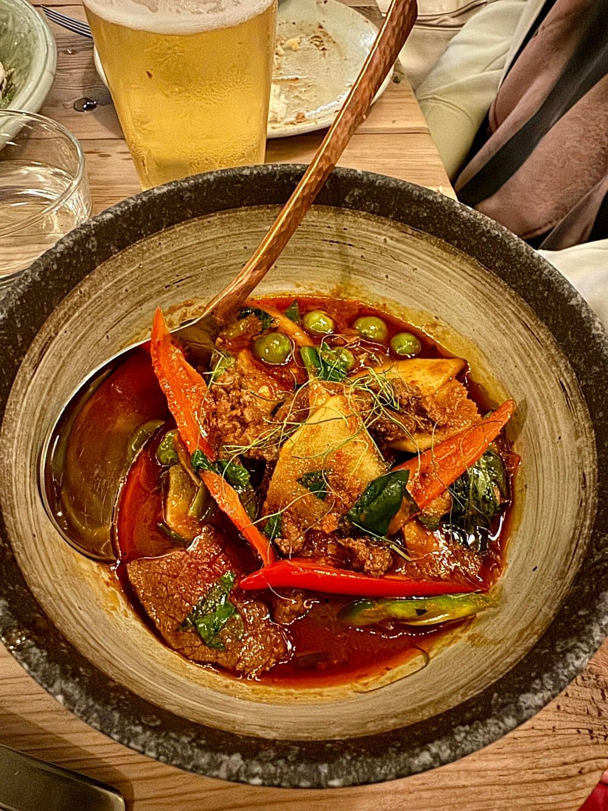
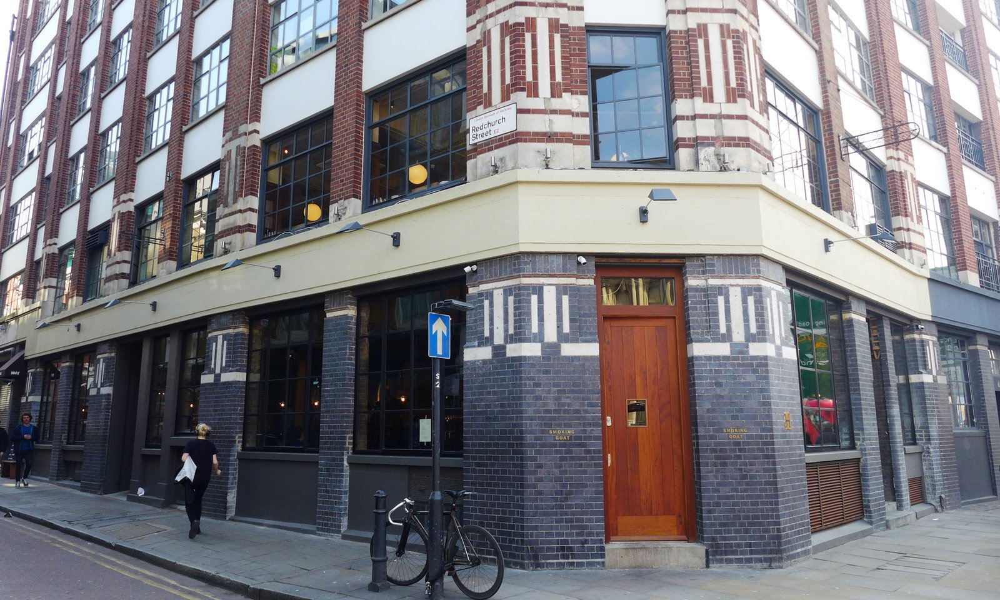

Thai food in London used to mean one menu with the same forty dishes on it. It now means **regional cooking**, and the difference between the regions is not a detail — Isaan food from the north-east is sour, fermented and built on dried chilli, while Southern Thai is coconut-rich and hotter again. They are different meals.

So this guide is arranged by **what each kitchen actually cooks**. The best of it is also, unusually, not expensive.

> 💡 **The Short Version:** **AngloThai** is the only Michelin-starred Thai restaurant in the UK. **Kiln** in Soho is the best counter cooking — sit at the bar. **Singburi** moved to Shoreditch in 2025 and is the one people argue about. **Esarn Kheaw** has cooked Isaan on the Uxbridge Road since 1992. And **Plaza Khao Gaeng** does Southern curry-over-rice at three sites now.

> 📊 **The evidence behind this guide**
> Nothing here is ranked on one visit. This pass reads **13 sources carrying 127 citations** across **64 named restaurants**. **18 restaurants are named by two or more independent sources; 1 holds a Michelin star.**
> **Built on:** unusually strong agreement — Singburi is named by seven independent sources, more than the top restaurant in half the guides on this site.
> *Evidence rebuilt 30 August 2026 · [How we rank →](/how-we-rank/)*

## Where they are

| If you are near… | Where to eat |
| --- | --- |
| **Soho & Chinatown** | Kiln, Speedboat Bar |
| **Fitzrovia & Bloomsbury** | Khao So-i, Plaza Khao Gaeng (Centre Point) |
| **Marylebone** | AngloThai, Nipa Thai (Bayswater) |
| **Shoreditch & Spitalfields** | Singburi, Som Saa, Smoking Goat |
| **Borough & London Bridge** | Kolae, Plaza Khao Gaeng (Borough Yards) |
| **Covent Garden** | Plaza Khao Gaeng |
| **King's Cross** | Paolina |
| **North London** | Farang (Highbury) |
| **Peckham & south** | Kruk, The Begging Bowl |
| **Hammersmith & west** | Esarn Kheaw, 101 Thai Kitchen, Khun Pakin, Chet's |
| **Wimbledon** | Flavour Hubb |

**Price guide:** **£** under £15 · **££** £15–£35 · **£££** £40–£70 · **££££** £90+.

---

## Isaan: the north-east

Sour, salty and hot, from the region bordering Laos. Som tam papaya salad, larb, grilled meat and sticky rice, built on fermented fish sauce and dried chilli rather than coconut milk. **This is the tradition London does best.**

### Esarn Kheaw, Shepherd's Bush

*££ · 314 Uxbridge Road · evenings only* · Cited by 2 sources

**London's first Isaan restaurant, open since 1992 and still run by the Puntar family**, cooking Ubon dishes nobody else in the city bothers with — and doing it in a green-fronted room on Uxbridge Road that has not changed in thirty years.

Isaan is the north-east: sour, salty and hot rather than sweet and coconut-heavy. **Som tam with sticky rice** is the order — green papaya pounded with lime, fish sauce and chilli — with **larb** and grilled meats alongside. Ask for it at Thai heat if you mean it.

**££, closed Sunday, book a few days ahead.** Shepherd's Bush, and the oldest kitchen of its kind in the country.

> ⚠️ Its own site lists **evenings only, Monday to Saturday** — no Sunday. Aggregators still show a lunch service. Ring before making a lunchtime trip.

### Som Saa, Spitalfields

*£££ · 43a Commercial Street · book ahead* · Cited by 5 sources

**The technical one.** Andy Oliver and Mark Dobbie both trained under David Thompson at Nahm, and Som Saa is where modern regional Thai cooking in London really starts — most of the chefs on this page trace back to it or to Kiln.

The **deep-fried whole seabass** with herbs has survived every menu change since it opened, including the refurbishment.

> A kitchen fire in May 2025 wrecked the extraction and shut it for six months. It **reopened on 11 November 2025** and is back at full strength — some guides still carry a "temporarily closed" flag that is long out of date.

*Northern Thai cooking in a Spitalfields warehouse, and hotter than most London Thai food dares to be. Photo: [Bex.Walton](https://www.flickr.com/photos/7831824@N04/34780201915), [CC BY 2.0](https://creativecommons.org/licenses/by/2.0/).*

### Khun Pakin Thai, Hammersmith

*££ · inside The Salutation, 154 King Street* · Cited by 2 sources

**Thai food out of a pub kitchen** — which in London usually means a bad green curry, and here means fierce Isaan cooking with no adjustment for the room it is in.

**Som tam, larb and grilled pork neck** off the charcoal, seasoned as they would be in Ubon rather than moderated for a Hammersmith pub audience. The heat is real and the kitchen will not soften it unless you ask.

**££, walk-in.** Two hundred metres from 101 Thai Kitchen, which makes this stretch of King Street the best Thai in west London by a distance.

### 101 Thai Kitchen, Hammersmith

*££ · 352 King Street · closed Mondays* · Cited by 2 sources

**A King Street veteran cooking Isaan and Southern in one kitchen**, two hundred metres from Khun Pakin — two serious Thai rooms on the same street, which happens nowhere else in London.

Two regional traditions on one menu: the sour-hot **Isaan** dishes — som tam, larb, grilled meats — and the coconut-heavy **Southern** curries, which are hotter and richer than anything Bangkok serves. Order across both to see the difference.

**££, closed Monday.** Plain room, long menu, and the sort of place where the Thai-language specials are the ones to ask about.

---

## Southern: coconut, curry and heat

Richer and hotter than the north-east, with more coconut, turmeric and seafood, and a border blur into Malaysia.

### Plaza Khao Gaeng

*££ · Centre Point, Borough Yards and Covent Garden* · Cited by 5 sources

**The most doctrinaire Southern kitchen in London**, and the format is the point: a *raan khao gaeng*, a curry-over-rice shop, where you choose from what is already cooked rather than ordering à la carte.

Southern Thailand's coast-to-jungle cooking, and a **Michelin Bib Gourmand for 2026**. It began as a single counter inside Arcade Food Hall at Centre Point and now has three sites — the Borough Yards railway arch opened in November 2025, and there is a Covent Garden room too.

### Singburi, Shoreditch

*££ · Unit 7, Montacute Yards · walk-ins welcome · closed Mondays* · Cited by 7 sources

**The most argued-about Thai restaurant in London.** It spent years as a cult address in Leytonstone before moving to a Shoreditch railway arch in 2025, with second-generation chef Sirichai Kularbwong formally taking over from his retiring parents, joined by Nick Molyviatis from Kiln and Alexander Gkikas.

The cooking is Southern-leaning but not strictly Southern — there is northern larb on the menu too, and the region shifted somewhat with the move. **Tiger prawn and cucumber curry**, raw beef larb with sawtooth coriander, smoked pork belly nam tok.

A **Bib Gourmand for 2026**, and it takes walk-ins, which most restaurants of this standing do not.

> Not everyone thinks the move worked. Some regulars of the Leytonstone room argue something was lost in translation to a bigger, smarter space. Most critics disagree. Go and take a side.

### Flavour Hubb, Wimbledon

*££ · inside Wimbledon Racquets and Fitness Club* · Cited by 2 sources

**Southern Thai cooked inside a badminton club**, which is exactly the sort of thing a guide exists to find.

Chef Supanno Yingviriya has roots in Surat Thani and trained in Phuket, and the menu is named **Hala Bala** after the forest straddling the Thailand–Malaysia border — which is precisely where this cooking sits. Crab curry noodles, house-made roti, and *khao yum*, the herb-and-rice salad that is really nasi kerabu.

---

Powered by <a target="_blank" rel="sponsored" href="https://www.getyourguide.com/london-l57/">GetYourGuide</a>

## The live-fire kitchens

The group of restaurants that made Thai food fashionable in London, all built around wood and charcoal.

### Kiln, Soho

*£££ · 3 min from Piccadilly Circus · counter is walk-in* · Cited by 5 sources

**Everything comes off wood and charcoal along a single counter** — there is no gas in the building, and the kitchen is the room. Sit at the bar and watch your food cooked a foot away.

The signature is the **short rib curry**, slow-cooked over embers and served with rice, and it is what the counter seats are worth queueing for. Around it, clay-pot noodles, grilled langoustines and the northern Thai cooking Ben Chapman built the place on — sharper and smokier than the Bangkok food most London Thai restaurants serve.

**Counter seats are walk-in only and the wait is real; tables can be booked.** £££, three minutes from Piccadilly Circus, and **lunch is materially cheaper than dinner for the same counter**.

### Smoking Goat, Shoreditch

*£££ · 1 min from Shoreditch High Street* · Cited by 4 sources

**Thai drinking food and live-fire cooking in a room that behaves like a bar** — the sibling to Kiln, and just as loud. The format is Bangkok's late-night eating rather than a restaurant service.

The **fish sauce wings** are the dish everyone orders and the one to judge it on: deep-fried, glazed in fish sauce and palm sugar, sticky and salty enough to demand another drink. Beyond them, lardo and langoustine over charcoal, and curries built for sharing across a crowded table.

**£££ and it books weeks ahead.** A minute from Shoreditch High Street. Come for an evening rather than a meal.

*Thai barbecue and a lot of noise. The chicken wings are the thing. Photo: [Ewan-M](https://commons.wikimedia.org/w/index.php?curid=174581316), [CC BY-SA 2.0](https://creativecommons.org/licenses/by-sa/2.0/).*

### Kolae, Borough

*£££ · 3 min from London Bridge* · Cited by 4 sources

**Southern Thai grilling from the Kiln team** — a different regional tradition again, built around charcoal and coconut rather than the Isaan and northern cooking that dominates London's Thai scene.

The signature is **kolae chicken**, the dish the restaurant is named after: butterflied, basted repeatedly in coconut and turmeric, and grilled over charcoal until the glaze caramelises into a crust. Southern curries around it, hotter and less sweet than Bangkok's.

**£££, books weeks ahead**, three minutes from London Bridge. Sit at the counter if you can — the grill is the show.

### Speedboat Bar, Chinatown

*££ · pool tables* · Cited by 4 sources

Built to feel like a **late-night Bangkok Chinatown canteen** — strip lights, football on the screens, **pool tables** — and the curries are good enough that it was ranked the fourth best restaurant in London.

The cooking is Thai-Chinese from Bangkok's Yaowarat district: **dry-aged noodle dishes**, wok-charred seafood and curries with real heat, built to be eaten with beer rather than wine. The pool tables are used, which tells you what kind of evening it is.

**£££ and it books weeks ahead.** Three minutes from Piccadilly Circus. Go as a group and order across the whole menu.

---

## The one with a star

### AngloThai, Marylebone

*££££ · 22 Seymour Place · tasting menus · book well ahead* · Cited by 6 sources

**The only Michelin-starred Thai restaurant in the UK**, and John Chantarasak won it within three months of opening — the star arrived in the 2025 Great Britain and Ireland guide and it has held it since.

The idea is Thai cooking built on **British seasonal produce** rather than imported substitutes, which sounds like a compromise and is the opposite: it forces genuinely new dishes rather than approximations of Bangkok ones. Run by Chantarasak with his wife Desiree.

Lunch, weekend and dinner tasting menus. Book well ahead.

---

## The new generation

### Kruk, Peckham

*££ · 213 Blenheim Grove · closed Mondays and Tuesdays* · Cited by 3 sources

The interesting thing about Kruk is that it **refuses to pick a region**. Khao soi from the north, moo hong from Phuket in the south, som tam from Isaan and a red jungle curry from the centre, all on one short menu — by design rather than by dilution.

Rob Willcox and Josh Lyons met at Farang and opened in **August 2025** in the Peckham railway arch that used to be Bar Story. They took a **Bib Gourmand within months**. The fried chicken with prickly ash and fish sauce glaze is the order, and the red jungle curry with chalk stream trout is the spiciest thing in this guide.

### Khao So-i, Fitzrovia

*£££ · 9 Market Place* · Cited by 3 sources

**Named for the northern Thai coconut curry noodle it is built around** — the newest room on these lists and already on all of them.

**Khao soi** is the dish: egg noodles in a coconut and curry broth, topped with a nest of the same noodles fried crisp, with pickled mustard greens, shallot and lime to add yourself. It is a Chiang Mai dish and almost nowhere in London does it properly. The rest of the menu is northern Thai in the same register.

**£££ and it books weeks ahead.** Fitzrovia, small, and the queue for walk-ins builds early.

### Farang, Highbury

*£££ · 11 min from Arsenal* · Cited by 5 sources

**A north London room doing modern Thai with none of the timidity** that usually comes with a neighbourhood address — the cooking is as hot and as sour as it should be.

The menu changes constantly and leans northern: **grilled meats, jungle curry, whole fish**, with heat that is not adjusted downward for Highbury. Set menus are the way most tables order.

**£££ and it books weeks ahead. Open Wednesday to Saturday only** — closed Sunday, Monday and Tuesday, which catches people out.

### The Begging Bowl, Peckham

*£££ · 168 Bellenden Road* · Cited by 5 sources

**Jane Alty trained under David Thompson** — the Australian chef who did more than anyone to document real Thai cooking — **and cooks northern Thai in Peckham**, in small plates meant to be ordered across the table.

The menu is a long list of small dishes rather than a few large ones: **curries, salads, grilled meats and relishes**, changing with the season, and designed so a table orders six or seven and shares everything. No single signature; the balance across the order is the point.

**£££, closed Monday, and it books weeks ahead.** Bellenden Road, and one of the restaurants that made Peckham a destination.

### Chet's, Shepherd's Bush

*£££ · an American diner* · Cited by 1 source

**Thai flavours through an American diner** — an LA-inspired hotel room in Shepherd's Bush where **the bar snacks and the drinks are doing as much work as the kitchen**.

The format is Thai-American crossover: **fried chicken with Thai seasoning**, larb-spiced burgers, and noodles alongside a serious cocktail list. It is a bar that feeds you properly rather than a restaurant with a bar attached.

**£££, book a few days ahead.** Inside The Hoxton, and open later than most of this guide.

### Nipa Thai, Bayswater

*£££ · 1 min from Lancaster Gate* · Cited by 2 sources

**One of the first Thai restaurants in London to charge what the French and Italian rooms charged** — plush, polished, and still doing it, in a teak-panelled dining room overlooking Hyde Park.

Royal Thai cooking rather than street food: **refined curries, carved fruit and delicate presentation**, cooked by a Thai kitchen brigade in a room that has kept its formality while everything around it went casual. The park view is half the price.

**£££, book a few days ahead.** Inside the Royal Lancaster on Bayswater Road. The antithesis of the Isaan rooms elsewhere in this guide, and deliberately so.

---

Powered by <a target="_blank" rel="sponsored" href="https://www.getyourguide.com/london-l57/">GetYourGuide</a>

## Best value

### Paolina, King's Cross

*£ · 181 King's Cross Road · from £5.95 · BYO · closed Sundays* · Cited by 2 sources

**Dishes from £5.95**, bring your own bottle, family-run, and no regional pretensions whatsoever — central Thai canteen classics done properly and cheaply. The counterweight to everything else on this page.

This is the Bangkok-standard repertoire rather than a regional one: **pad thai, green and red curry, pad krapow** with a fried egg on rice, and tom yum. It is the food the rest of this guide has spent fifteen years arguing is not the whole story, cooked well enough to remind you why it travelled in the first place.

**Thai pub kitchens are the other great London bargain.** An ordinary pub lets a Thai family run its kitchen and the food is routinely far better than the room suggests. Khun Pakin at The Salutation is the best of them, but most areas have one and they are rarely written about — ask locally.

Otherwise: **Kiln's lunch** is materially cheaper than dinner for the same counter, and **Speedboat Bar** costs less than it looks.

---

## What to know

* **Pick the region before the price.** Isaan and Southern cooking are different meals, not different price brackets. If you only try one thing, make it som tam and sticky rice at Esarn Kheaw or the curry-over-rice at Plaza Khao Gaeng.
* **Sit at the counter at Kiln.** Tables can be booked; the counter is walk-in and better.
* **Check the closed days.** Kruk shuts Mondays and Tuesdays, Singburi and 101 Thai Kitchen shut Mondays, Paolina shuts Sundays, and Esarn Kheaw serves evenings only.
* **Heat is negotiable** at every restaurant here — say what you want and they will cook to it. At Kruk and Khun Pakin, the default is genuinely hot.
* **Order across the table.** Thai meals are balanced across sour, hot, salty and sweet; a dish each misses the point entirely.
* **The lineage is real.** Som Saa's founders trained under David Thompson at Nahm, Singburi's new co-chef came from Kiln, and Kruk's pair met at Farang. Modern regional Thai in London is a small world.

---

## Continue planning your London trip

- 🥟 **[Best Chinese and East Asian Restaurants](/articles/best-chinese-east-asian-restaurants-london/)**
- 🇯🇵 **[Best Japanese Restaurants in London](/articles/best-japanese-restaurants-london/)**
- 💷 **[Cheap Eats in London](/articles/cheap-eats-london/)**
- 🍽️ **[Eat in London: Restaurants, Food Markets & Quick Food Hub](/articles/eat-in-london-guide/)**
- 🍜 **[Soho Area Guide](/articles/soho-area-guide/)**
- 🎨 **[Shoreditch Area Guide](/articles/shoreditch-area-guide/)**
