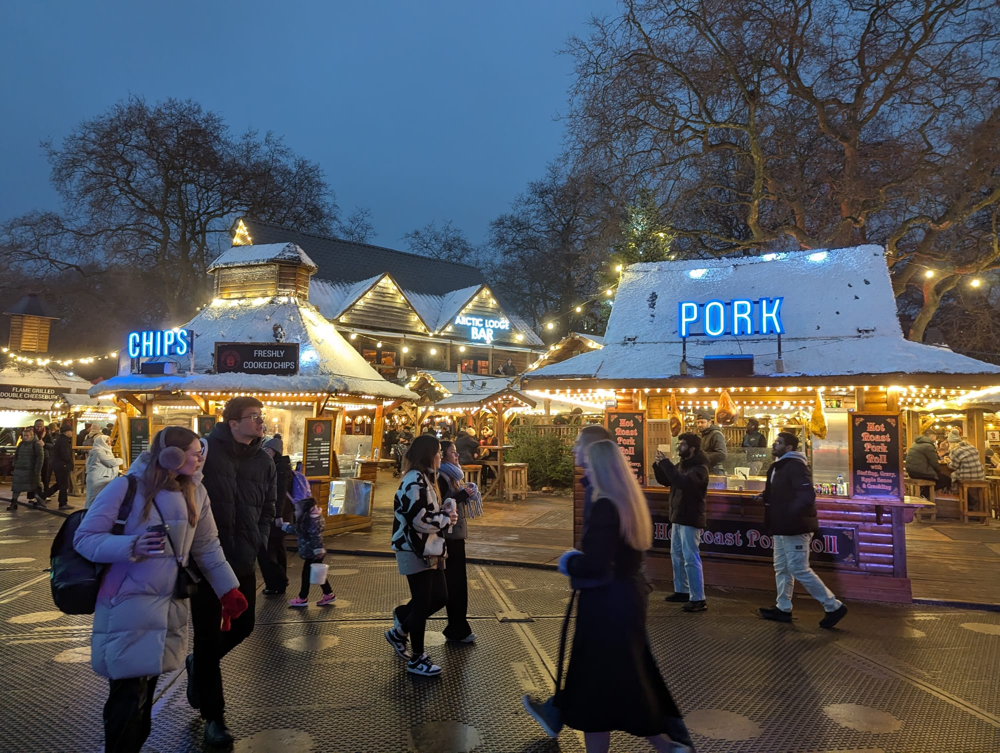
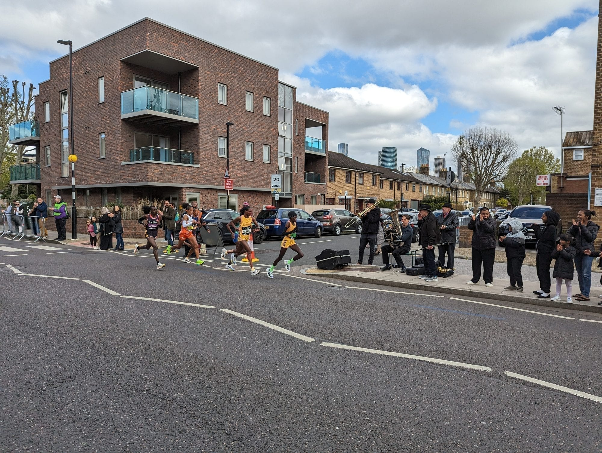
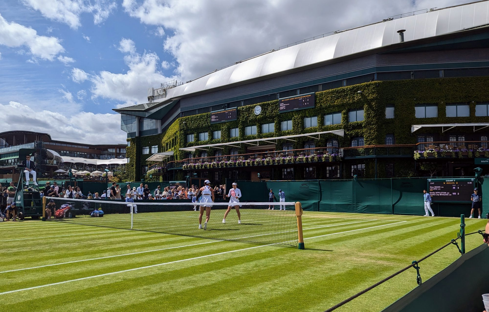
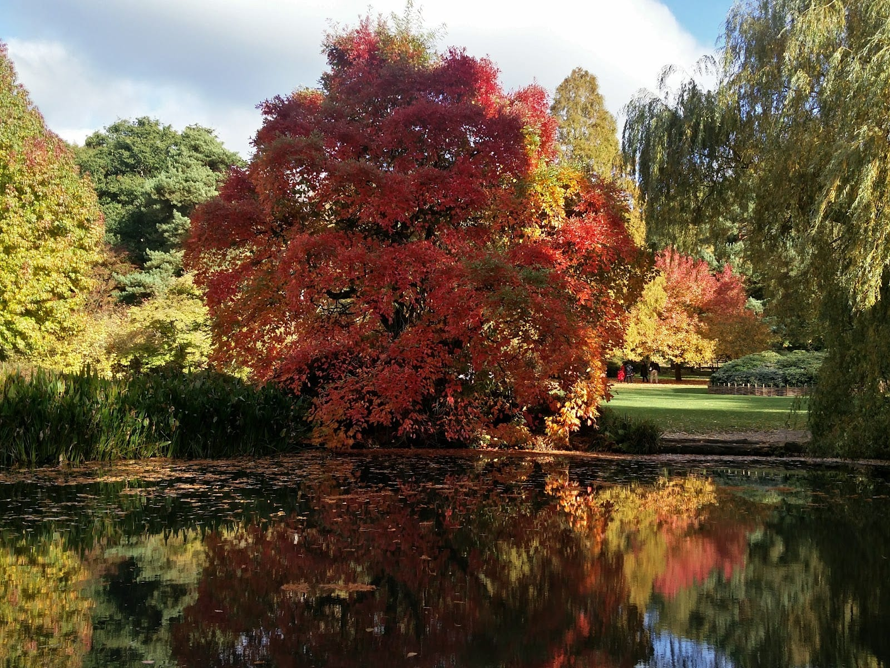

There's no single best month to visit London, only trade-offs. The sunniest month gets nearly four times the sunshine of the dullest, and budget hotels cost far more on a Saturday night. This works through what actually changes, month by month: weather from the Met Office's own long-run averages, school holidays and bank holidays for 2026-27, the events with dates you can actually rely on, and the costs that move with them.

> 💡 **The Short Version:** May, June and September are the best all-rounder months: mild (18-22°C average highs), 150-197 hours of sunshine a month, and outside the school summer holidays. July and August are warmest (23-24°C) and sunniest (192-206 hours) but also busiest: school summer holidays run for most of both months, and Wimbledon, Pride and Notting Hill Carnival all land in the same ten weeks. November to February is quieter, but October to January is the wettest run of the year (57-67mm a month, against 39mm in March) and December has under 8 hours of daylight. Whatever the month, a Saturday hotel night costs the most. If a fixed date decides your trip, work back from the confirmed events below rather than the month.

## Weather, month by month

Averages are the 1991-2020 climate normal for **Heathrow**, the Met Office's long-running station for London, published on metoffice.gov.uk. Sunrise and sunset are calculated for central London on the 15th of each month.

| Month | High / low | Rainfall | Sunshine | Sunrise–sunset (daylight) |
| --- | --- | --- | --- | --- |
| January | 8° / 3°C | 59mm | 59 hrs | 07:57–16:22 (8h25m) |
| February | 9° / 3°C | 45mm | 76 hrs | 07:12–17:16 (10h04m) |
| March | 12° / 4°C | 39mm | 120 hrs | 06:13–18:05 (11h53m) |
| April | 15° / 6°C | 42mm | 169 hrs | 06:03–19:58 (13h55m) |
| May | 18° / 9°C | 46mm | 197 hrs | 05:06–20:47 (15h40m) |
| June | 22° / 12°C | 47mm | 197 hrs | 04:40–21:21 (16h41m) |
| July | 24° / 14°C | 46mm | 206 hrs | 04:58–21:14 (16h15m) |
| August | 23° / 14°C | 54mm | 192 hrs | 05:44–20:25 (14h42m) |
| September | 20° / 12°C | 50mm | 150 hrs | 06:33–19:17 (12h43m) |
| October | 16° / 9°C | 65mm | 111 hrs | 07:22–18:09 (10h47m) |
| November | 12° / 5°C | 67mm | 68 hrs | 07:16–16:13 (8h57m) |
| December | 9° / 3°C | 57mm | 53 hrs | 07:57–15:53 (7h56m) |

**July is warmest and sunniest; November is wettest; March is driest; December has the least sunshine and the shortest days.** The swing in daylight is the one visitors underestimate: London gets more than double the daylight in June that it gets in December.

## How busy, and what it costs

**School holidays move London's crowds more reliably than the weather does.** Boroughs set their own calendars; Camden's 2026-27 dates are one example: October half term is **26-30 October 2026**, the Christmas break runs **21 December 2026 to 1 January 2027**, February half term is **15-19 February 2027**, the Easter holidays run **26 March to 9 April 2027**, and the May half term is **31 May to 4 June 2027**. The 2027 summer holidays start **23 July 2027**. Layer UK bank holidays on top — Good Friday and Easter Monday (**26 and 29 March 2027**), the early May and spring bank holidays (**3 and 31 May 2027**), the summer bank holiday (**30 August 2027**), and Christmas Day and Boxing Day (**25 and 28 December 2026**, the 28th a substitute day because the 26th falls on a Saturday) — and most of the year's crowd peaks are already on the calendar before a single event is added.

**Nationally, the pattern is the same shape.** VisitBritain's most recent forecast, published 27 August 2026, expects **44.2 million inbound visits to the UK across 2026**, up from 43.6 million in 2025. For the shape of the year rather than the total, the last monthly breakdown the Office for National Statistics has published — January to June 2024 — showed overseas visits to Great Britain ranging from **2.46 million in February**, the quietest month of that run, to **3.91 million in May**, with January at 3.36 million.

**Hotel prices move with the night of the week more than the month.** Across 51 budget London hotels (one room, two adults, including tax), priced on 14-15 September 2026, the median was **£113** for Sunday **11 October 2026** and **£135** for Wednesday **17 February 2027**. The Saturdays cost more: **£199.50** on **17 October 2026**, **£201.50** on **12 December 2026** and **£169** on **17 April 2027**. If price decides your dates, book a Sunday-to-Thursday night outside school holidays.

Powered by <a target="_blank" rel="sponsored" href="https://www.getyourguide.com/london-l57/">GetYourGuide</a>

## Month by month: what to expect

### Winter: December to February

**December** is the shortest, dullest month by the numbers — 53 hours of sunshine and under 8 hours of daylight around the solstice — and also the most concentrated: **Hyde Park Winter Wonderland** runs the whole month (it opens on Thursday 19 November 2026 and runs to 3 January 2027), Christmas Day falls on **Friday 25 December**, and school holidays start **21 December**. London's Thames fireworks on **31 December** are ticketed rather than free to watch from the riverside enclosures, and have sold out in past years.

*Hyde Park Winter Wonderland at dusk: chip stalls, hot roast pork rolls and the Arctic Lodge bar.*

**January** is quiet by every measure that matters: schools are back by **4 January 2027**, there's no half term, and the only bank holiday is New Year's Day itself (**Friday 1 January 2027**). It averages an 8°C high, with the year's second-lowest sunshine total.

**February** looks like January's twin on a thermometer (9°C average high) but gets noticeably more daylight and sunshine — 76 hours against January's 59. The one disruption is half term, **15-19 February 2027**, which briefly refills the big family attractions. **Lunar New Year's Day falls on Saturday 6 February 2027**, the start of the Year of the Goat; Chinatown usually marks it with a street celebration around that date.

### Spring: March to May

**March** is London's driest month on average (39mm), though still one of its coldest (12°C average high). Good Friday and Easter Monday fall on **26 and 29 March 2027**, with the Easter school holidays starting the same Friday and running to **9 April**. British Summer Time begins on **28 March 2027** — clocks go forward at 1am — which happens to be Easter Sunday itself that year.

**April** warms quickly (15°C average high, up from March's 12°C) and gets just over two more hours of daylight than March by mid-month. Two fixtures anchor the calendar: **The Boat Race, Sunday 11 April 2027**, and the **TCS London Marathon**, now run across **two days, Saturday 24 and Sunday 25 April 2027**. The Easter holidays run into the first nine days of the month before schools return.

*The elite women's race passing a brass band on the Marathon course in April.*

**May** is one of the year's better-balanced months: 18°C average highs, 197 hours of sunshine, and two bank holidays bookending it (**3 and 31 May 2027**), the second running straight into the May half term (**31 May-4 June**). The **RHS Chelsea Flower Show** runs **18-22 May 2027**. In the ONS's most recent monthly figures (January to June 2024), May was the busiest month, with 3.91 million overseas visits to Great Britain.

### Summer: June to August

**June** brings the year's longest days — 16 hours 41 minutes of daylight by mid-month, around the solstice — and its warmth without yet reaching July's peak (22°C average high). **Trooping the Colour**, the King's Birthday Parade, is always a Saturday in mid-June; in 2026 it was **13 June**, preceded by two rehearsal parades on the Saturdays before. **The Championships, Wimbledon** begin on **Monday 28 June 2027** — the tournament's 150th anniversary year, running to **11 July**. Pride in London's parade usually runs on a Saturday in late June or early July; the organisers confirm it returns in 2027.

**July is the warmest and sunniest month of the year** — 24°C average high, 206 hours of sunshine — and Wimbledon's fortnight closes it out on **11 July 2027**. The BBC Proms run at the Royal Albert Hall from mid-July to the Last Night in September (**12 September** in 2026). The month's other quirk: school summer holidays don't start until the very end of it (**23 July 2027** in Camden), so most of July is still term-time.

*Doubles on an outside court at Wimbledon, under the results boards for Centre and No.1 Court.*

**August** is peak family-holiday season: the school summer holidays run for essentially the whole month, the summer bank holiday falls on **Monday 30 August 2027**, and **Notting Hill Carnival** runs that same bank holiday weekend — **Saturday 28 August** (the steel band competition), **Sunday 29 August** (Family Day: J'ouvert's early-morning parade through mud and paint, then the children's procession) and **Monday 30 August** (the main adults' parade). Weather holds close to July's (23°C average high) but with slightly more rain.

### Autumn: September to November

**September** starts with schools going back in its first days (**2 September** in 2026), and fills its middle weeks with events: **Totally Thames** runs along the river all month, the **Great River Race** is rowed on a Saturday (**12 September** in 2026), **Open House** opens hundreds of buildings (**12-20 September** in 2026), and the Proms' **Last Night** closes the season (**12 September** in 2026). Our [full guide to September in London](/articles/things-to-do-in-london-in-september/) covers the month's exhibitions, openings and theatre in more depth.

**October** starts mild (16°C average high) and ends noticeably darker: the clocks go back on **Sunday 25 October 2026**, moving sunset from about 5.50pm the day before to 4.48pm overnight. Two fixtures dominate the middle of the month — the **BFI London Film Festival, 7-18 October 2026**, and **Frieze London and Frieze Masters, 14-18 October 2026** — then **half term, 26-30 October**, refills family attractions for the final week. Budget hotels priced at a median £113 for Sunday 11 October and £199.50 for Saturday 17 October. Our [October guide](/articles/things-to-do-in-london-in-october/) and [where to see autumn leaves](/articles/best-places-autumn-leaves-london/) cover the detail.

*Autumn colour reflected in a pond in Isabella Plantation, Richmond Park.*

**November is the wettest month (67mm) and one of the darkest**, with daylight down to under 9 hours by mid-month. **Bonfire Night falls on Thursday 5 November**, and **Hyde Park Winter Wonderland opens on 19 November 2026**, running to 3 January. Beyond fireworks displays, it's one of the quieter months for crowds, with no half term and no bank holiday.

Powered by <a target="_blank" rel="sponsored" href="https://www.getyourguide.com/london-l57/">GetYourGuide</a>

## Continue planning your London trip

- ✈️ **[The UK ETA Guide](/articles/uk-eta-guide/)** — the £20 permit to sort before you fly, whichever month you land
- 💷 **[London on a Budget](/articles/london-on-a-budget/)** — where the money really goes once you're here, and what's free
- 🎄 **[Christmas in London](/articles/christmas-in-london/)**, **[Hyde Park Winter Wonderland](/articles/hyde-park-winter-wonderland/)** and **[New Year's Eve in London](/articles/new-years-eve-london/)** — the December run in full
- 🎆 **[Bonfire Night in London](/articles/bonfire-night-london/)** and **[Halloween in London](/articles/halloween-london/)** — the autumn fireworks season
- 🍂 **[Where to See Autumn Leaves in London](/articles/best-places-autumn-leaves-london/)** — the named trees and the peak weeks
- 🏃 **[The London Marathon Guide](/articles/london-marathon-guide/)** and **[How to Get Wimbledon Tickets](/articles/wimbledon-tickets-guide/)** — entry routes for the two biggest sporting dates
- 🎬 **[The BFI London Film Festival](/articles/london-film-festival/)** — booking dates and a practical plan
- 🗓️ **[Things to Do in London in September](/articles/things-to-do-in-london-in-september/)** and **[in October](/articles/things-to-do-in-london-in-october/)** — the month-by-month detail this guide points to

*Weather: Met Office 1991-2020 averages for Heathrow. Sunrise and sunset for central London, in local time. School holidays: Camden's 2026-27 calendar; other boroughs and academies vary. Bank holidays: GOV.UK. Event dates from each organiser. Visitor figures: VisitBritain's forecast of 27 August 2026 and the ONS's monthly figures for January to June 2024. Hotel rates: medians across 51 budget London hotels priced on 14-15 September 2026. Checked 17 September 2026.*
