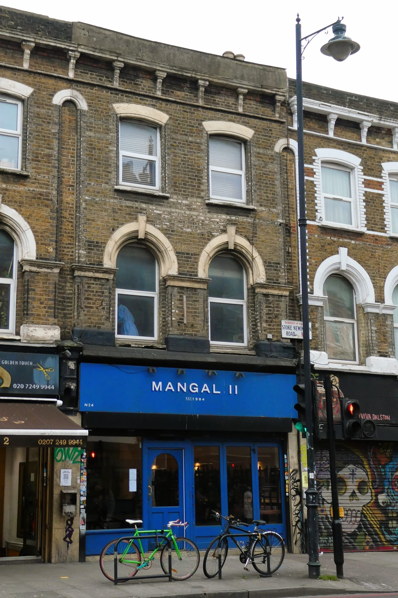
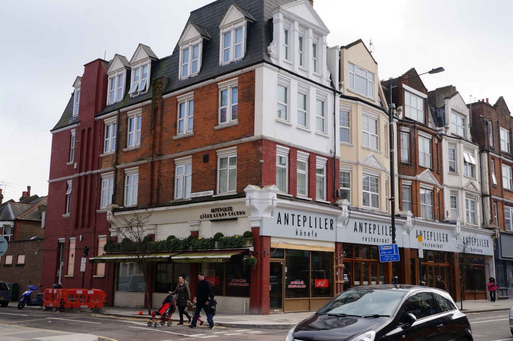
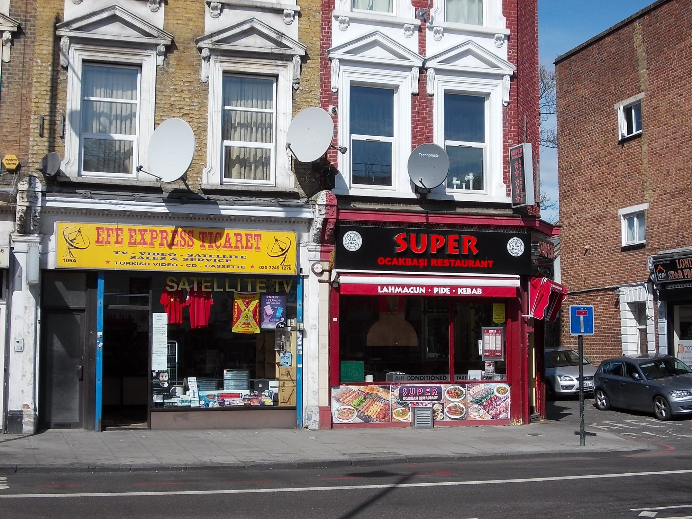

Turkish is the London cuisine with the clearest geography of any on this site. Nine of the twenty-seven restaurants that two or more guides agree on sit on **one road** — Green Lanes, running north through Newington Green, Stoke Newington and Harringay — and a second cluster sits a mile west in Dalston.

That is the useful fact, and no ranking gives it to you. So this guide is arranged by where the food actually is.

> 💡 **The Short Version:** **Mangal II** in Dalston and **Antepliler** on Green Lanes are the most-cited. **Gökyüzü** is the Green Lanes landmark. **Zahter** and **Yeni** are the two Soho rooms in the Michelin Guide. **Durak Tantuni** does the best cheap thing in the guide. And if you only make one trip, make it to Green Lanes rather than the West End.

> 📊 **The evidence behind this guide**
> Nothing here is ranked on one visit. This pass reads **7 sources carrying 97 citations** across **52 named restaurants**. **27 restaurants are named by two or more independent sources.**
> **Built on:** seven independent publications and Harden's inspected selection — Haz, Baraka and Leydi.
> *Evidence rebuilt 30 August 2026 · [How we rank →](/how-we-rank/)*

## Where they are

| If you are near… | Where to eat |
| --- | --- |
| **Green Lanes & Harringay** | Antepliler, Gökyüzü, Hala, Köfteci Metin, Durak Tantuni, Diyarbakır Kitchen, Enfes Ocakbaşı, Haringey Corbacisi |
| **Newington Green & Stoke Newington** | 19 Numara Bos Cirrik 2, Üstün Lahmacun & Pide Salonu, 01 Adana |
| **Dalston & Kingsland Road** | Mangal II, Mangal 1, Umut 2000 |
| **Soho** | Zahter, Yeni |
| **Marylebone** | Ishtar, Yamabahçe |
| **Borough & Fitzrovia** | Kismet, Kibele |
| **Notting Hill & west** | The Counter, Lokkanta, Fez Mangal |
| **The City** | Haz, Leydi, Baraka |
| **Elsewhere** | FM Mangal (Camberwell), Dükkan (Hoxton), The Mantl (Knightsbridge), Kibele (Fitzrovia), Mezze Grill (Wembley Park) |

**Price guide:** **£** under £15 a head · **££** £15–£35 · **£££** £40–£70 · **££££** £90+.

---

## The most-cited

### Mangal II, Dalston

*££ · Dalston · Cited by 5 sources*

Joint most-cited Turkish restaurant in London, and the one that has moved furthest from the format. The Infatuation calls it a classic Turkish restaurant doing things a bit differently; Time Out describes it as refined but endlessly satisfying. Run by the sons of the family behind Mangal 1 down the road.

The ocakbaşı is still the engine — **lamb chops, adana and quail** off the charcoal — but the kitchen plates it as a restaurant rather than a grill house, with a **mezze** list and seasonal vegetable dishes that would look out of place on Green Lanes. The **lahmacun** is the one dish that reads the same in both worlds.

**It takes bookings, which most of this list does not**, and it has a wine licence rather than a BYOB policy. That, and the price, is the difference between an evening here and an evening at the original.

**Not the same restaurant as Mangal 1**, which is a hundred yards away and a completely different night out.

*Mangal II on Stoke Newington Road, run by the sons of the family behind Mangal 1 down the road. Photo: [Ewan-M](https://commons.wikimedia.org/wiki/File:Mangal_II,_Dalston,_N16.jpg), [CC BY-SA 4.0](https://creativecommons.org/licenses/by-sa/4.0/).*

### Antepliler, Green Lanes

*££ · Harringay · Cited by 5 sources*

Joint most-cited, and in Time Out's words synonymous with Turkish cuisine in the capital. From Gaziantep in the south-east, which is why the kebabs and the pistachio work are the things to order.

There is a separate **Antepliler Künefe & Patisserie** further along Green Lanes doing the sweet half of the same tradition — künefe, the shredded-pastry-and-cheese dessert served hot.

*Antepliler on Green Lanes. The kitchen is from Gaziantep, which is why the kebabs and the pistachio work are what to order. Photo: [Ian S](https://commons.wikimedia.org/wiki/File:Antepliler_Restaurant,_Green_Lanes,_Harringay_-_geograph.org.uk_-_3873218.jpg), [CC BY-SA 2.0](https://creativecommons.org/licenses/by-sa/2.0/).*

### Gökyüzü, Green Lanes

*££ · Harringay · Cited by 4 sources*

The Green Lanes landmark, open since 1999, and the one people bring visiting relatives to. Enormous, brightly lit and permanently loud, with the grill running the length of the room and a queue outside most evenings that moves faster than it looks.

Order the **mixed grill** — it arrives on a platter built for four and feeds six, and comes with the free bread and salad that is the standard courtesy along this stretch. Adana, shish, lamb chops and liver all come off the same charcoal.

**Walk-in only, open all day and late.** Harringay Green Lanes overground is five minutes; go early evening on a weekday if you want to hear the person opposite you.

### The Counter, Notting Hill

*£££ · Notting Hill · Cited by 4 sources*

The modern one, and the furthest from the Green Lanes format of anything here. A chestnut-toned room with exposed brick and an **open ocakbaşı grill as the centrepiece** rather than hidden at the back — Turkish cooking rebuilt as a west London restaurant.

The grill still does the classics properly: **adana kebab**, lamb chops, and **lamb liver skewers**. Around them the kitchen takes liberties nobody on Green Lanes would — a **white chocolate babaganoush**, pistachio muhammara — and a **spinach and feta pide** that is the thing to order if you want one dish to judge it by.

The Infatuation calls it fun food in a moody dining room. Book at weekends; this is a restaurant rather than a grill house, and it fills.

### Yeni, Soho

*£££ · Soho · Cited by 4 sources*

The London offshoot of **Yeni Lokanta in Istanbul**, and the reason this guide is not entirely a Green Lanes list. A lapis-blue frontage on Beak Street, exposed brick, pastel green tiled tabletops and open shelves of spice jars — a room designed to be looked at.

Modern Turkish sharing plates rather than grills: the kitchen works from Anatolian technique but plates it as a Soho restaurant, and the menu moves with the season. Along with Zahter, one of only two Turkish restaurants in central London the Michelin Guide has picked up.

**Book.** Small, central, and the antithesis of the walk-in ocakbaşı — this is the one for a night out rather than a plate of grilled meat.

---

## Green Lanes

Nine of the twenty-seven restaurants here are on or just off this one road. If you make a single trip for Turkish food in London, make it this one — it is the Piccadilly line to Manor House or Turnpike Lane, and the restaurants run for about a mile.

*An ocakbasi on Stoke Newington High Street. The word means the charcoal grill is the restaurant — sit where you can see it. Photo: [Lucy Fisher](https://commons.wikimedia.org/wiki/File:Super_Ocakbasi_Restaurant,_Efe_Express_Ticaret_(8678907184).jpg), [CC BY 2.0](https://creativecommons.org/licenses/by/2.0/).*

### Hala, Green Lanes

*££ · Harringay · Cited by 2 sources*

**Family-run since 2002**, and the name regulars give when pushed past the obvious answers. Time Out calls it an undeniable leader among London's Turkish restaurants — smaller and warmer than Gökyüzü up the road, and the service is the reason people stay loyal.

The grill is impeccable and the **chicken wings** are what it is quietly famous for, alongside soups that regulars order before anything else. The **gözleme** — a crisp turnover stuffed with cheese and spinach, rolled and griddled to order — is the dish to have if you only have one.

Walk-in, all day. Harringay Green Lanes is a few minutes away, and it is calmer at lunch than any of its neighbours.

### Köfteci Metin, Green Lanes

*£ · Harringay · Cited by 2 sources*

The name translates as "meatball-maker Metin", and that is the menu. **Köfte and very little else** — a specialist rather than a full ocakbaşı, which on a street of enormous grill houses makes it the most focused room on Green Lanes.

The köfte are hand-rolled and grilled to order, served with bread, salad and not much ceremony. It is a counter rather than a dining room; you eat quickly, you eat well, and you leave.

**One of the cheapest proper meals in this guide** — walk-in, cash-friendly, and about fifteen minutes' walk from Turnpike Lane.

### Durak Tantuni, Harringay

*£ · Harringay · Cited by 2 sources*

An all-day and late-night **tantuni house**, serving a dish almost nowhere else in London does: finely chopped beef cooked on a flat iron plate with cottonseed oil, seasoned hard, and rolled into thin flatbread with tomato, onion and parsley. It comes from Mersin on the southern coast.

That is essentially the whole menu, and the point. A counter with a handful of seats rather than a restaurant, with the plate going constantly in the window — the tantuni is assembled in front of you in about ninety seconds.

**Walk-in, cheap, and open late**, which makes it one of the better things to eat in north London after midnight. Twelve minutes from Turnpike Lane.

### Diyarbakır Kitchen, Harringay

*££ · Harringay · Cited by 3 sources*

A reliable all-round ocakbaşı on Grand Parade, named for the Kurdish city in the south-east, and **entirely teetotal** — it trades with the local Turkish and Kurdish community rather than the Friday-night crowd, which is exactly why the cooking stays honest.

The **lamb ribs** and the carefully spiced **adana köfte** are the two to order. Its **lahmacun** is the best argument for coming: charred and blistered outside, an oozing smoky mince mixture in the middle, and eaten by hand. Drink **ayran**, the salted yoghurt drink, as everyone around you will be.

Walk-in, and the one to pick when a group cannot agree — the menu is broad enough to cover everyone.

### Enfes Ocakbaşı, Harringay

*££ · Harringay · Cited by 2 sources*

A brightly lit Green Lanes canteen with nothing to look at but the grill, which is the entire point. The Infatuation calls it a grill master on Green Lanes, and both the sources naming it lead on the same thing: the meat, and how well it is cooked.

A shimmering mound of **adana, shish, liver and chops**, each cooked properly rather than uniformly. **Grilled quail** and mounds of blushing **lamb liver** are the house specialities and the things to order over the obvious mixed grill. The free bread and salad that arrive unasked are generous enough to be a course.

Loud, walk-in, good for families and groups, and five minutes from Harringay Green Lanes.

### Haringey Corbacisi, Green Lanes

*£ · Harringay · Cited by 2 sources*

**A no-menu restaurant specialising in soups and stews** — you look at what is in the pots behind the counter and point. The least like a kebab house of anything on this page, and the closest thing in London to a Turkish home kitchen.

A *çorbacı* is a soup house, and the format is lunchtime working food: lentil soup, tripe soup, slow-cooked stews served over rice, changing with whatever has been made that morning. Nothing is grilled and nothing is explained; if you do not read Turkish, you order by looking.

**Cheap, quick and walk-in.** Come at lunch when the pots are full — by late afternoon the choice has thinned to whatever is left.

---

## Newington Green and Stoke Newington

### 19 Numara Bos Cirrik 2, Stoke Newington

*££ · Stoke Newington · Cited by 3 sources*

An old-school ocakbaşı, and the most confusingly named restaurant in this guide — sources write it as Cirrik, as Cirrik 19 Numara Bos, and as 19 Numara Bos Cirrik, with a numeral that refers to which branch you are standing in. There are several along the same corridor.

Sat further up from the noise of central Dalston, it is quieter than the Kingsland Road rooms and the **kebabs are superbly grilled** — the reason regulars argue for it over the louder names. Reviewers reliably single out the falafel too, which is unusual on an ocakbaşı menu.

Walk-in. Pick this one over Mangal 1 if you want to have a conversation with the meal.

### Üstün Lahmacun & Pide Salonu, Newington Green

*£ · Newington Green · Cited by 2 sources*

A tiny dedicated **lahmacun and pide shop** at the Newington Green end of Green Lanes, and a *salonu* rather than a restaurant — you eat quickly and cheaply, often standing.

The dough is kneaded fresh and rolled **to a Rizla-like transparency** before it goes into the wood-burning oven, which is what separates a real lahmacun from the leathery supermarket version. Minced lamb, tomato, pepper and parsley on top; you squeeze lemon over it, roll it, and eat it with your hands.

**Made to order, so there is a short wait, and worth it.** Walk-in, and among the cheapest things in this guide.

### 01 Adana, Newington Green

*££ · Newington Green · Cited by 2 sources*

Named after the **number plate code for Adana**, the southern city that gave the kebab its name, and the mixed grill is what the room is for. Roomy, which most of Green Lanes is not — you can bring eight people without booking a fortnight ahead.

The **adana** is the dish to judge it on: hand-minced lamb, seasoned with red pepper, pressed onto a flat skewer and grilled over charcoal. Chops, shish and liver alongside, with the standard bread and salad.

Walk-in, all day. The space is the argument for it over its neighbours rather than any single dish.

---

## Dalston

### Mangal 1, Dalston

*££ · Dalston · Cited by 2 sources*

The original, and a **BYOB ocakbaşı** just off the Dalston strip — The Infatuation calls it a boisterous institution, and it is the cheaper, rougher and considerably more fun end of this guide.

The dining room is usually packed with groups cracking open bottles they brought, and the **flatbread and salad arrive within seconds** of sitting down. Everything off the grill is right: **köfte**, pink **lamb chops**, and the **sweetbreads** that regulars order specifically.

**Bring your own — there is no licence**, which is half the reason the bill stays small. Walk-in, loud, and not the place for a quiet dinner.

### Umut 2000, Dalston

*££ · Kingsland Road · Cited by 2 sources*

A no-nonsense ocakbaşı just off Kingsland Road, and one of the three names in the perpetual argument about the best grill in Dalston — Mangal 1 and 19 Numara Bos Cirrik being the other two.

The case for this one is the **lamb ribs**, widely called Dalston's finest: fat rendering over the charcoal, meat pink and coming off the bone. The rest of the grill is straightforwardly good rather than showy.

Come for the grill and **sit where you can see it** — the ocakbaşı is the room's only real decoration. Walk-in.

---

## The modern rooms

### Zahter, Soho

*£££ · Soho · Cited by 3 sources*

Just off Carnaby Street, with an **open kitchen you can watch the chefs work in**, and along with Yeni one of only two Turkish restaurants in central London the Michelin Guide has picked up. Modern Anatolian rather than grill-house Turkish.

The **charcoal-grilled octopus** is the signature. Starters run to aubergine with yoghurt, stuffed peppers in tomato sauce and a **muhammara** — the walnut and red pepper paste — and the mains to chicken thighs and whole sea bass off the same coals.

**Book**, particularly at weekends. Central, small, and priced as a Soho restaurant rather than as a kebab house.

### Ishtar, Marylebone

*£££ · Marylebone · Cited by 2 sources*

Named after the Sumero-Babylonian goddess, and the most relaxed of the central options — a long-running Marylebone room built for a table that wants to sit for three hours rather than eat and go.

Modern Anatolian and Mediterranean rather than pure grill house: **hummus**, **kısır** (cracked wheat with finely chopped peppers and spring onion), **patlıcan ezmesi** — the smoky aubergine dip — and **patlıcan soslu**, aubergine sautéed in tomato sauce. Chargrilled meats and fresh fish behind the mezze.

**£££, and book a few days ahead** for a weekend table. Five minutes from Baker Street, and one of the few on this page that works for a business lunch.

### Yamabahçe, Marylebone

*££ · Marylebone · Cited by 2 sources*

Sat between Marylebone and Mayfair and **considerably cheaper than its postcode suggests**, which is the whole reason to know about it.

**Pide and lahmacun rather than a full grill menu** — the boat-shaped flatbreads baked to order and topped with cheese, egg or minced lamb, and the thin crisp lahmacun you roll up with lemon and parsley. A short mezze list alongside, and not much else.

Counter-ish and quick: this is lunch or an early dinner rather than an evening. Walk-in, and the bill will surprise you for the area.

### Dükkan, Hoxton

*££ · Hoxton · Cited by 2 sources*

Not a traditional Turkish restaurant, and **open only on certain days — check before travelling.** The most experimental thing in this guide, and closer to a residency than a fixed dining room.

The cooking works from Turkish and Anatolian technique rather than reproducing the ocakbaşı menu: mezze rebuilt with British produce, and a short changing list rather than a standing one. What is on depends on the week.

**Confirm the opening days before you go.** This is the entry on the page most likely to have changed since it was written, and it is worth a phone call rather than a journey.

### The Mantl, Knightsbridge

*££££ · Knightsbridge · Cited by 2 sources*

Turkish cooking taken to Knightsbridge prices, themed around the idea of a family gathering at a hearth — which is either the point or the marketing, depending on how the evening goes. Time Out has had it at number one.

The menu runs the regions: carefully spiced **mezze**, **adana kebab**, open-flame grilled meats and sharing platters, with **mantı** — the small lamb dumplings under garlic yoghurt and burnt butter — and **sarma beyti**, minced lamb wrapped in flatbread and sliced. The mantı is the dish that separates it from a grill house.

**££££ and built for an occasion** — celebration, a date, or an expense account. Book.

---

## The three with judged backing

Harden's is the only inspected source that covers Turkish food in London, and it lists three restaurants. All three are in the City, which says more about Harden's readership than about where the food is.

### Haz, City of London

*££ · City of London · Cited by 2 sources · Harden's*

**Chic and contemporary** in Time Out's description, and a small City group rather than one room — several branches including Mincing Lane, Plantation Place and Premier Place, which is why it turns up in so many City lists.

Broad modern Turkish: mezze to start, then **chargrilled kebabs, lamb chops and whole fish** off the grill, with a wine list built for a table of six on expenses. Portions and service are pitched at the lunch-hour rather than the long evening.

**The Turkish restaurant to book for a work lunch**, and one of only three in the City that Harden's inspects. Book for weekday lunch; quieter in the evenings, when the City empties.

### Leydi, City of London

*£££ · City of London · Cited by 2 sources · Harden's*

Modern Turkish inside the **Hyde London City hotel**, and a genuinely stylish room — dusty pink, soft-lit, and unlike anywhere else in this guide to sit in.

All-day mezze is the format and the thing to order: the spreads, the pickles, the warm bread. The kitchen is **hit-and-miss beyond that**, which is worth saying plainly — the room and the mezze are the reason to come, not the grill.

Listed by Harden's and by the Turkish-British press. Book, and go for a long lunch rather than a destination dinner.

### Baraka, City of London

*££ · City of London · Cited by 1 source · Harden's*

The third of Harden's three City Turkish rooms, and **named by nothing else in this guide** — which is worth stating rather than hiding. One inspector likes it; nobody else has written it up.

Standard modern Turkish for the postcode: **mezze, grilled meats and fish**, priced for the City lunch trade and geared to tables from surrounding offices.

Take the single citation for what it is. If you want a City Turkish table with more behind it, Haz has the broader backing and Leydi has the better room.

### Kismet, Borough

*£££ · Borough · books weeks ahead · Named by 4 new-opening guides, not yet by the Turkish lists*

**A meyhane in the style of Istanbul and northern Cyprus**, upstairs at The Globe on Bedale Street — in the building used as Bridget Jones's flat, which is the fact everyone mentions and the least interesting thing about it.

A meyhane is a drinking house that feeds you, and the format is the whole point: **long tables, rakı, and food that keeps arriving** — cold mezze first, then hot, then things off the grill, paced to the drinking rather than to a service. Order the rakı and let the kitchen run it.

**£££ and it books weeks ahead.** Come as a group; a table of two misses what the room is for. It is a minute from Borough Market, which makes it one of very few Turkish rooms in central London worth planning a night around.

Its backing is different from everything else on this page: four independent guides name it, but all of them as a *new restaurant* rather than as a Turkish one. The Turkish-specific lists have not caught up with it yet.

---

## Also named, with less behind them

Everything else carried by two or more independent guides.

| Venue | Where | Price | Sources | What it is |
| --- | --- | --- | --- | --- |
| **FM Mangal** | Camberwell | ££ | 3 | A longstanding south London favourite, famous for kofte and the bread that comes with it |
| **Kibele** | Fitzrovia | ££ | 2 | Named after the goddess of fertility and spring; the most decorated room in the guide |
| **Firin** | Central | ££ | 2 | A bakery-restaurant, carried by The Infatuation and the Turkish-British press |
| **E. Mono** | Green Lanes | £ | 2 | Carried by two independent write-ups and no masthead |
| **Fez Mangal** | Ladbroke Grove | £ | 1 · Time Out | Cafe-style, with a Mayfair branch; the cheapest Time Out lists |
| **Lokkanta** | Bayswater | ££ | 1 · Time Out | Notting Hill, and the tilework is the first thing anyone mentions |
| **Mezze Grill** | Wembley Park | ££ | 1 · Time Out | By the station, and built for a pre-gig meal at the stadium or the arena |

---

## What to know

* **Ocakbasi means the charcoal grill is the restaurant.** Sit where you can see it. The bread arriving straight off it is the point.
* **Most of Green Lanes is walk-in.** Mangal II and the central rooms take bookings; the Harringay grills largely do not, and the queue moves.
* **Many are BYOB or lightly licensed**, Mangal 1 included. Ask rather than assume.
* **Green Lanes runs late.** Gökyüzü and Durak Tantuni are both all-day and late-night, which almost nothing in the centre is.
* **There is no award for this.** Three restaurants here have any judged backing. The counts measure how much critics agree, nothing more.

---

## Continue planning your London trip

- 🥙 **[The Best Middle Eastern Restaurants in London](/articles/best-middle-eastern-restaurants-london/)**
- 🍽️ **[Eat in London: Restaurants, Food Markets & Quick Food Hub](/articles/eat-in-london-guide/)**
- 💷 **[Cheap Eats in London](/articles/cheap-eats-london/)**
- 🥩 **[The Best Steak in London](/articles/best-steak-restaurants-london/)**
- 🍛 **[The Best Indian Restaurants in London](/articles/best-indian-restaurants-london/)**
