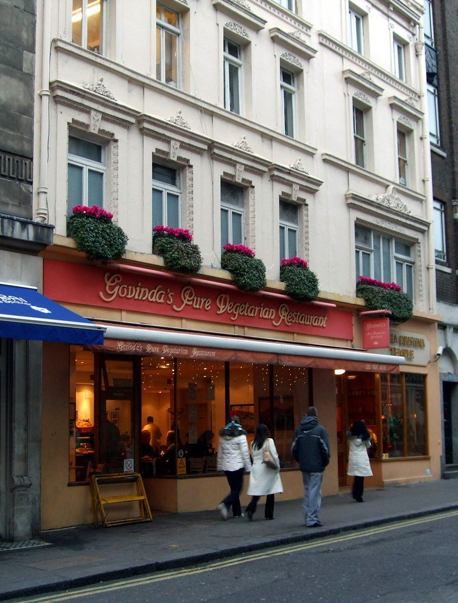

London has more Michelin-starred vegetarian and vegan cooking than any other city, and it also has a £10 thali on Drummond Street that has not changed since 1971. Both are worth knowing about, and most guides only tell you about one.

This one is arranged **by what you are actually paying**, because the range here is wider than in any other category on this site — from a fried chicken shop where nothing costs more than a burger to a tasting menu that books out months ahead.

> 💡 **The Short Version:** **Plates** is the UK's first Michelin-starred vegan restaurant and the hardest table on this page. **Mildreds** made vegetarian food in London normal and is still the easy answer. **Tofu Vegan** is the best value of the well-known ones. **Diwana** is the cheapest good meal in central London. And **Temple of Seitan** is vegan fried chicken that behaves exactly like fried chicken.

> 📊 **The evidence behind this guide**
> Nothing here is ranked on one visit. This pass reads **9 sources carrying 113 citations** across **66 named restaurants**. **19 restaurants are named by two or more independent sources.**
> **Built on:** deep specialist coverage — five of the nine publications write about nothing else, so this reaches kitchens the general press never reviews.
> *Evidence rebuilt 30 August 2026 · [How we rank →](/how-we-rank/)*

## Where they are

  

    Map of the best vegetarian and vegan restaurants in London
  

  

    
Loading the interactive map…

  

  

    <i class="restaurant-map-key restaurant-map-key--editorial" aria-hidden="true"></i> Recommended in this guide
    <i class="restaurant-map-key restaurant-map-key--streetfood" aria-hidden="true"></i> Market stall & counter
  

  <noscript>
    
The interactive map requires JavaScript. Every entry below lists its area.

  </noscript>

| If you are near… | Where to eat |
| --- | --- |
| **Soho & Covent Garden** | Mildreds, Gauthier Soho, Club Mexicana, Saravanaa Bhavan |
| **Shoreditch & Spitalfields** | Plates, Unity Diner, Bubala, Pilpel |
| **Euston & Bloomsbury** | Diwana Bhel Poori House |
| **Islington** | Tofu Vegan, The Gate (Islington) |
| **Borough & London Bridge** | Horn OK Please, Gujarati Rasoi |
| **Fitzrovia** | Rovi, Shree Krishna Vada Pav |
| **Hackney & Camden** | Temple of Seitan, Sutton & Sons, Magic Falafel |
| **West London** | The Gate (Hammersmith), Petersham Nurseries (Richmond) |
| **North London** | Rasa (Stoke Newington) |

**Price guide:** **£** under £15 a head · **££** £15–£30 · **£££** £35–£60 · **££££** £80+.

---

## The starred rooms

### Plates, Shoreditch

*££££ · 320 Old Street · book months ahead · Michelin star* · Cited by 5 sources

In 2025 this became **the first fully vegan restaurant in Britain to win a Michelin star**. Kirk Haworth cooks a tasting menu with his sister Keeley running the room — one open kitchen, polished concrete, floor-to-ceiling windows.

The cooking treats vegetables with fine-dining technique rather than as a substitution exercise, which is the difference between this and almost everything that came before it.

Tables release in batches and go immediately. This is the hardest vegan booking in the country.

### Gauthier Soho, Soho

*££££ · 21 Romilly Street · book weeks ahead* · Cited by 4 sources

**Alexis Gauthier turned a classical French restaurant entirely vegan in 2021** — the same townhouse dining room, the same technique, and no animal products at all. Very few kitchens at this level have made that switch, and almost none kept the Michelin recognition through it.

**Tasting menus are the format**, built with classical French method rather than substitution: reductions, emulsions and pastry work done without dairy or eggs. The **"faux gras"** is the dish that gets written about and is a straight technical answer to a technical problem.

**££££, closed Sunday and Monday, and it books weeks ahead.** Across several floors of a Soho townhouse, which makes it feel like eating in a private house.

---

## The institutions

### Mildreds, Soho

*££ · 45 Lexington Street* · Cited by 5 sources

**Open on Lexington Street since 1988**, which makes it the restaurant that made vegetarian food in London **normal rather than worthy** — and it went fully vegan without losing the crowd, which almost nothing else has managed.

The menu is drawn from everywhere at once: **gyoza, burritos, mezze, Sri Lankan curry** and a burger, changing constantly. It is not trying to be a health food restaurant and never was.

**££. Sites in Soho, Camden, Covent Garden, King's Cross and Victoria** — Soho is the original and the one worth going out of your way for. **It does not take bookings at every site; check before travelling.**

### Mallow, Borough Market

*££ · Borough Market · entirely plant-based* · Cited by 2 sources

**The Mildreds kitchen given a lighter, more seasonal brief**, in a restored townhouse covered in floral murals at the edge of Borough Market.

The signature is the **turmeric milk bread with apricot harissa butter**, which most tables order before anything else. Beyond it, a seasonal, vegetable-led menu that leans Middle Eastern and changes with the market it sits beside.

**££ and it books ahead** at weekends. There is a second site at Canary Wharf. The Borough room is the prettier of the two by a distance.

### The Gate, Hammersmith

*£££ · 51 Queen Caroline Street* · Cited by 1 source

**Opened in 1989 in a former artists' studio** and still the most serious vegetarian cooking in west London — with **Indo-Iraqi-Jewish influences from the founding brothers** rather than a generic meat-free menu.

That heritage is the distinguishing thing: the food draws on the family's background in Mumbai and Iraq, so expect **spiced aubergine, tamarind, pomegranate and rose** rather than risotto and halloumi. Long-standing enough that it predates almost everything else on this list.

**£££ and it books ahead.** Hammersmith is the flagship, in a high-ceilinged studio space; there are sites in Islington and Marylebone.

### Rasa, Stoke Newington

*£ · Stoke Newington Church Street* · Cited by 1 source

**An all-vegetarian Keralan kitchen behind a shocking pink shopfront**, cooking with **coconut and curry leaf rather than cream** — which is what separates south Indian vegetarian food from the north Indian version most Londoners know.

**Dosa, avial, and the Keralan snacks** that come before the meal are the orders, with a set feast menu if you want the kitchen to decide. Nothing on the menu has ever contained meat; this is not a restaurant that converted.

**£, closed Monday, book a few days ahead.** Stoke Newington Church Street, and impossible to walk past.

---

## Best value

### Diwana Bhel Poori House, Euston

*£ · 121–123 Drummond Street · walk-in*

**Trading on Drummond Street since 1971** and the oldest of the Euston vegetarian Indian restaurants — pine benches, no decor to speak of, and it has not changed in decades, which is the appeal.

**Dosas, bhel poori** and an **all-you-can-eat lunchtime thali buffet** that is among the cheapest proper meals in central London. The buffet is the value order and the reason the room fills at noon.

**Under £15, walk-in, and BRING YOUR OWN ALCOHOL** — unlicensed, with **no corkage**. Five minutes from Euston, and there are three more vegetarian Indians on the same short street.

> 💡 **Bring your own wine.** It is unlicensed and charges no corkage, which is where the real saving lands. Pine benches, no decor — it has not changed in decades and that is the appeal.

### Govinda's, Soho

*£ · Soho Street · canteen service · vegetarian* · Cited by 1 source

Run by the Hare Krishna temple it shares a building with, and feeding Soho since 1979. Queue, tray, and a **rotating thali** — curries, breads, soup and a dessert — for less than almost anything else hot in W1.

Entirely vegetarian, largely vegan, and completely unbothered about whether you are either. One of the last places in central Soho where a full meal costs less than a pint.

*Run by the Hare Krishna temple next door. Cheap, plain and entirely vegetarian. Photo: [Ewan-M](https://www.flickr.com/photos/55935853@N00/3085944256), [CC BY-SA 2.0](https://creativecommons.org/licenses/by-sa/2.0/).*

### Indian Veg, Islington

*£ · 92-93 Chapel Market · all-you-can-eat*

**An all-you-can-eat North Indian vegetarian buffet that has fed Islington on a shoestring for decades**, in a room **papered floor to ceiling with hand-made posters about vegetarianism** — which is unlike anywhere else in this guide.

**The buffet is the whole offer**: a dozen or so curries, rice, dal and breads, refilled as long as you keep going, for a single very low price. The cooking is homely rather than refined and nobody is pretending otherwise.

**£, walk-in.** Chapel Market. Go hungry; the economics only work if you do.

### Temple of Seitan, Hackney

*£ · 10 Morning Lane · walk-in* · Cited by 2 sources

**A vegan fried chicken shop that behaves exactly like a fried chicken shop** — no lecture, no health framing, and the same menu board as any high-street counter.

**Seitan in a buttermilk-style batter**: burgers, wings, tenders and fries at chicken-shop prices. Seitan is wheat gluten, which fries and shreds closer to chicken than soy does — the reason this works where mock-meat rarely does.

**Under £12, counter service, walk-in.** Sites across London including Hackney, Camden, Brixton, Hammersmith, Waterloo and Wood Green; **some are takeaway only**, so check before planning to sit.

### Saravanaa Bhavan, Leicester Square

*£ · walk-in*

**The London outpost of the Chennai vegetarian chain** — a group that runs hundreds of restaurants worldwide and is the reference point for south Indian vegetarian food in most of them.

**The cheapest way in the West End to eat a properly made masala dosa**: a fermented rice-and-lentil crepe, crisp and nearly a foot across, with spiced potato inside and sambar and chutneys to dip. Idli, vada and thalis alongside.

**£, walk-in.** Leicester Square, and busiest at lunch. Order the dosa and eat it with your hands, which is how it is meant to go.

### Shree Krishna Vada Pav, Fitzrovia

*£ · 4 min from Oxford Circus · walk-in* · Cited by 1 source

**Vada pav — the Mumbai potato-fritter roll — done properly and cheaply**, from a counter rather than a dining room, and one of very few places in London serving it at all.

A **vada pav** is a spiced potato fritter in a soft bun with dry garlic chutney: Mumbai's street sandwich, and the whole reason to come. **Pav bhaji** and misal pav alongside, all under a fiver.

**£, walk-in, counter only.** Several London sites. Among the cheapest things in this guide and one of the most specific.

### Horn OK Please and Gujarati Rasoi, Borough

*£ · Borough Market · walk-in*

**Two Indian vegetarian street-food stalls that grew out of London's markets** and now trade as fixtures rather than pop-ups.

**Horn OK Please** does Mumbai street food — **pav bhaji, dosa and chaat** — named for the slogan painted on Indian lorries. **Gujarati Rasoi** cooks the Gujarati home repertoire from a mother-and-son team: **dhokla, undhiyu and thalis**, with the sweet-sour-spicy balance Gujarat is known for.

**£, walk-in, market hours** — both are lunch rather than dinner, and both close well before evening.

---

## Vegan by cuisine

"Vegan" tells you what is absent. These tell you what you are actually eating — and every one of them is a kitchen built around a specific tradition rather than a substitution menu.

### Facing Heaven, Hackney — Sichuan

*££ · Hackney · entirely vegan* · Cited by 4 sources

**Vegan Sichuan built on tofu and mushrooms rather than mock meat**, from the chef behind the much-missed Mao Chow — and named for the facing-heaven chilli, which points upward on the plant.

The signature is **crispy sweet and sour seaweed toast**, and the rest of the menu is proper Sichuan: **mapo tofu**, dan dan noodles and dry-fried greens with real numbing heat. Nothing is pretending to be meat, which is the whole approach.

**££, closed Sunday and Monday, book ahead.** Hackney, small, and among the best Sichuan cooking in London regardless of the vegan framing.

### Jam Delish, Islington — Caribbean

*££ · Angel · entirely vegan* · Cited by 5 sources

**Plant-based Caribbean from siblings cooking their grandparents' recipes** — and it won a **2025 award judged against Caribbean kitchens generally rather than vegan ones**, which is the detail that matters.

**Caribbean small plates** are the format: jerk-spiced dishes, dumplings, plantain and curries built on jackfruit and pulses rather than mock meat. The seasoning is the point and it is not moderated.

**££ and it books ahead.** Islington. The one to bring someone who assumes plant-based Caribbean means a compromised curry.

### Itadaki Zen, King's Cross — Japanese

*££ · 139 King's Cross Road · entirely vegan* · Cited by 2 sources

**An entirely vegan Japanese kitchen** near King's Cross, run on macrobiotic and Buddhist *shojin ryori* principles — the temple cooking tradition, which has been vegan for centuries and predates the word by a long way.

Expect **tempura, donburi and set meals** built on seasonal vegetables, seaweed and tofu, with dashi made from kombu rather than fish. There is no attempt to imitate meat; the tradition never needed to.

**££ and it books ahead** — a small room with limited covers. Closed some weekdays, so check before travelling.

### En Root, Clapham and Peckham — Indian and East African

*££ · Clapham and Peckham · entirely vegan* · Cited by 3 sources

Started in Herne Hill in 2016 and now cooking in Clapham and Peckham, on the **Indian-East African-Caribbean crossover** that most of London's Indian restaurants never touch — the food of the Gujarati families who went to East Africa and then came here.

Plantain chaat, and a mango lassi cheesecake people cross the river for. Small bites run £5–8 and larger plates £11–15.

Both sites are south of the river and the reason to go is that nothing in Zone 1 cooks this.

### Purezza, Camden — pizza

*££ · Camden · entirely vegan* · Cited by 4 sources

**Britain's first vegan pizzeria**, and the one that solved the hard part — the cheese.

Purezza makes its own **cashew and rice-milk mozzarella** in-house rather than buying a commercial substitute, which is why the pizza works where most vegan versions do not. The dough is a long-fermented Neapolitan base, and there is a **hemp-flour option**. The **parmigiana pizza**, layered with aubergine, is the one to order.

**££, walk-in with bookings taken.** Camden is the London site; the company started in Brighton. Busiest at weekends.

---

## Modern plant-based

### Tofu Vegan, Islington

*££ · 105 Upper Street · book weeks ahead* · Cited by 7 sources

**Chinese vegan cooking built on tofu rather than mock meat**, and the most-cited vegan restaurant in this guide at seven sources — which for a category this new is remarkable.

The menu is regional Chinese made without animal products: **mapo tofu**, aubergine in garlic sauce, cumin-spiced "lamb" from seitan, and shredded tofu skin dishes most London Chinese restaurants do not serve at all. The kitchen is not doing substitution so much as leaning on a tradition that already had these dishes.

**££ and it books weeks ahead** — Upper Street is the original and there are now several London sites.

### Club Mexicana, Mayfair

*££ · Mercato Mayfair · also Boxhall City* · Cited by 3 sources

**Tacos, nachos and burritos built on jackfruit and vegan chicken** — started as a market stall and now in Kingly Court, and **the rare vegan restaurant nobody eats at because it is vegan**.

The **jackfruit carnitas** and the vegan **al pastor** are the orders, with salsas and pickles doing the work the meat would. Loud, cheap and busy, and the menu never mentions what is missing.

**££. Also at Seven Dials Market and on Commercial Street in Spitalfields** — Kingly Court is the sit-down one; the market sites are counters. Walk-in.

### Naïfs, Peckham

*£££ · set menu £38 · entirely vegan* · Cited by 2 sources

A small room on a quiet Peckham residential street cooking a seasonal set menu, and **listed in the Michelin Guide** — a Guide entry rather than a star or a Bib Gourmand, which is still rare for an entirely vegan kitchen.

The set menu is £38, with dessert a further £10. For Michelin-recognised cooking that is among the better value in London at any diet, and the desserts are the part people write about afterwards.

Worth checking before you go: Naïfs periodically drops regular service for ticketed events.

### Tendril, Oxford Circus

*£££ · 5 Princes Street · mostly vegan* · Cited by 4 sources

Vegetable-led cooking with global borrowings, in a room a minute off Regent Street that behaves like a neighbourhood restaurant — which in that postcode is the harder trick.

Real technical skill, particularly with **texture**, the thing vegetable cooking most often gets wrong. A **Michelin Guide** selected restaurant, first listed in 2024.

It bills itself as a *(mostly)* vegan kitchen and means it — there is dairy on the menu, so this is the one entry here to check if you are strictly vegan. Small dishes £10–13, mains around £18, and a three-course prix fixe at £27 on weekday lunchtimes.

### Holy Carrot, Notting Hill

*£££ · Notting Hill · entirely vegan* · Cited by 2 sources

Plant-based cooking that also drops refined sugar, gluten and additives, which sounds like a list of restrictions and eats like none of them. **Kentish purple potato croquettes**, the holy maki platter, and a coconut-cream eclair to finish.

The most designed room on this page, and priced for Notting Hill — small plates £13–15, larger ones £22–26.

One thing to know: the **Spitalfields site is vegetarian rather than vegan** and serves eggs and dairy. Portobello Road is the fully vegan one.

### Unity Diner, Shoreditch

*££ · non-profit* · Cited by 1 source

**A non-profit vegan diner where the profits fund animal-rights work** — set up by the campaigner Earthling Ed, and the only restaurant in this guide whose accounts are the point.

The menu is American diner food done vegan: **burgers, hot dogs, mac and cheese, milkshakes**, plus a **vegan "fish" and chips** built on banana blossom. Nothing is health food and none of it is subtle, which is the intention.

**££, walk-in with bookings taken.** Shoreditch, open late, and busiest in the evening.

### Rovi, Fitzrovia

*£££ · Ottolenghi group*

**The Ottolenghi group's fermentation-and-fire room, where vegetables go on the grill and get the treatment meat usually gets** — the clearest statement of what that kitchen has argued for twenty years.

Everything passes through fire or a ferment: **charred cabbage**, koji-aged vegetables, and celeriac shawarma carved off a spit. There is meat on the menu and it is the afterthought rather than the centre. The pickling programme is visible from the room.

**£££ and it books weeks ahead.** Not a vegetarian restaurant, and the best argument in London that it does not need to be one.

### Bubala, Spitalfields

*£££ · entirely vegetarian* · Cited by 3 sources

**Entirely vegetarian and almost never described that way** — the point is that nobody at the table notices what is missing, which is why five independent sources name it.

Middle Eastern small plates off charcoal: **halloumi with black seed honey**, the dish everyone photographs, **confit potato latkes**, oyster mushroom skewers and hummus with more depth than most meat kitchens reach. The grill does the work meat would.

**£££ and it books weeks ahead.** Small, loud, and busy enough that nobody is there as a concession to somebody else's diet.

### Petersham Nurseries, Richmond

*££££ · Michelin Green Star*

**A restaurant inside a working plant nursery** on the edge of Richmond, with the dining room under glass among the plants for sale — one of the most unusual settings in London and a long way from anywhere.

The cooking is Italian-leaning and vegetable-led, built on produce from the kitchen garden: **seasonal salads, hand-made pasta, wood-roasted vegetables**. There is meat and fish, but the garden dictates the menu.

**££££ and it books weeks ahead**, particularly for weekend lunch. A twenty-minute walk from Richmond station along the towpath, which is the right way to arrive.

---

## What to know

* **"Vegan-friendly" and "entirely vegan" are different things.** We have marked which is which above. A restaurant with one vegan main is not the same as a kitchen built around it.
* **Indian vegetarian food is the best value in London**, and it is not a compromise — south Indian and Gujarati cooking is vegetarian by tradition rather than adaptation.
* **Drummond Street by Euston** has several vegetarian Indian restaurants within a hundred metres, most of them unlicensed and BYO.
* **Book Plates months ahead**, and Tofu Vegan a few weeks. Everything else here is walk-in or a few days out.
* **Service charge** of 12.5% is discretionary and standard, though counters and market stalls generally do not add it.

Powered by <a target="_blank" rel="sponsored" href="https://www.getyourguide.com/london-l57/">GetYourGuide</a>

---

## Continue planning your London trip

- 🍽️ **[Eat in London: Restaurants, Food Markets & Quick Food Hub](/articles/eat-in-london-guide/)**
- 💷 **[Cheap Eats in London](/articles/cheap-eats-london/)**
- 🍛 **[The Best Indian Restaurants in London](/articles/best-indian-restaurants-london/)**
- 🍕 **[The Best Pizza in London](/articles/best-pizza-london/)**
- 🛍️ **[London Markets by Day](/markets/)**
- 🎨 **[Shoreditch Area Guide](/articles/shoreditch-area-guide/)**
