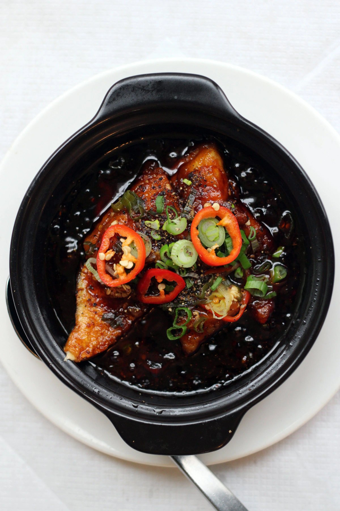
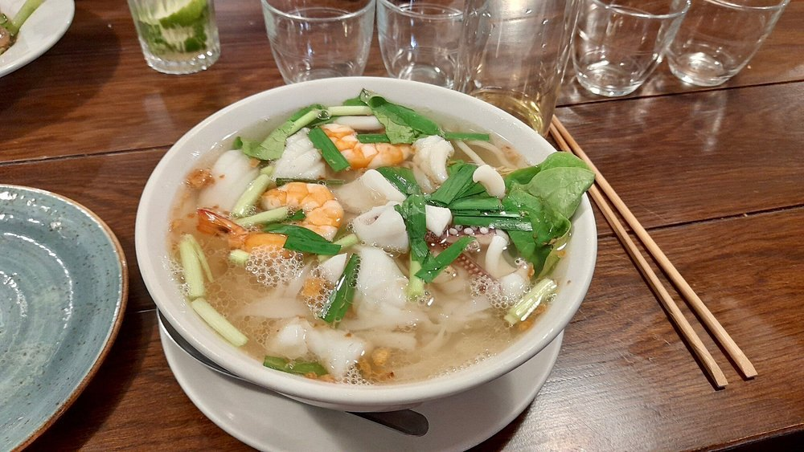
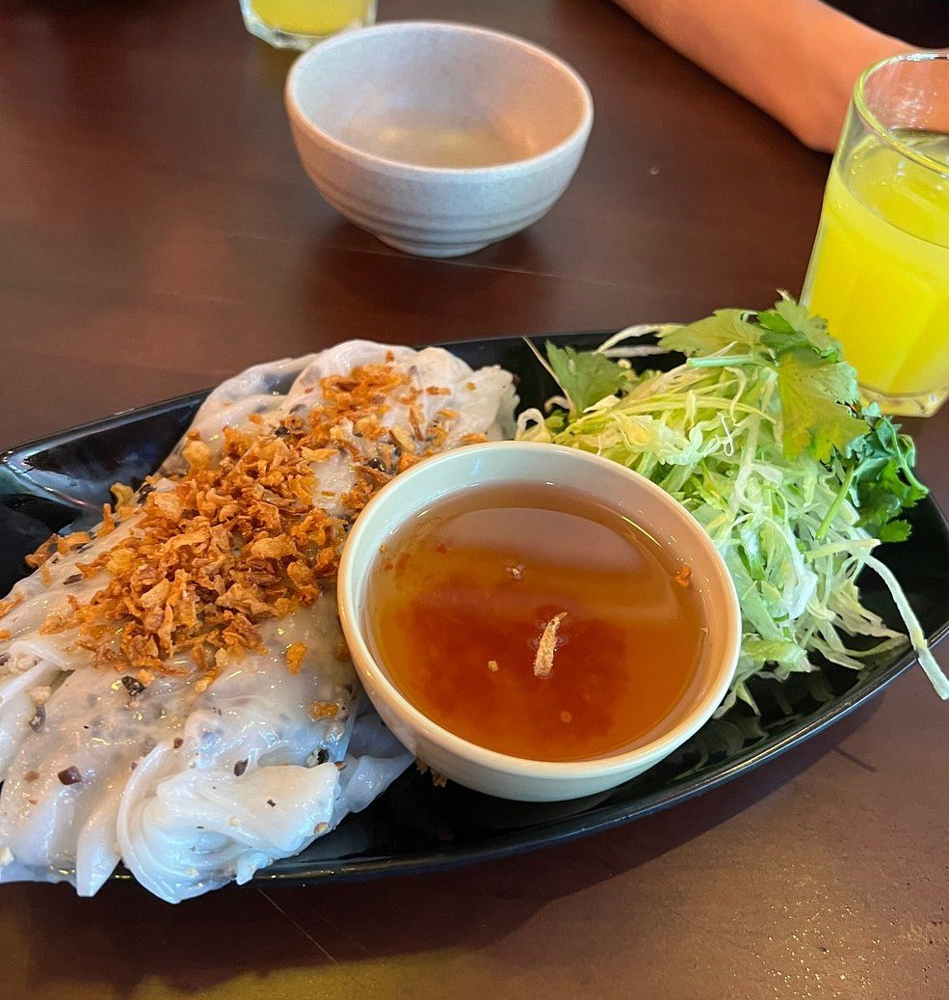

There is a stretch of Kingsland Road that London has called the Pho Mile for twenty years, and every guide to Vietnamese food in the city starts there.

The evidence says it is still where the most-recommended restaurants are — and also that it is no longer where the interesting arguments are happening. **The one judged award went to Peckham. One of the most respected rooms is out at Surrey Quays. And the bánh mì people argue about comes from a bakery on the Mile itself that opened recently rather than from any of its institutions.**

> 💡 **The Short Version:** **Sông Quê Café** on Kingsland Road is named by eight sources, more than anything else. **Lai Rai** in Peckham has the only Michelin Bib Gourmand. **Phở Thúy Tây** near Surrey Quays is the specialist's phở. **Kêu** for bánh mì choice, **Bánh** for the one critics pick. Northern and southern cooking are genuinely different — ask which a kitchen does.

> 📊 **The evidence behind this guide.**
> Nothing here rests on one visit. This pass reads **13 independent sources carrying 88 citations** across **48 named venues**. **19 are named by two or more sources; one carries a dated award.**
> **Built on:** one judged award, five mastheads, five independent writers and two YouTube channels — counted per creator, so a channel's five videos are one voice.
> *Evidence built 8 September 2026 · [How we rank →](/how-we-rank/)*

## Where they are

| If you are near… | Where to eat |
| --- | --- |
| **Kingsland Road & Hoxton** | Sông Quê Café, Việt Grill, Mien Tay, Bánh, Sen Viet Vegan |
| **Soho & Covent Garden** | Cây Tre, Hoa Sen (Drury Lane) |
| **Holborn & central** | Viet Eat, Kêu |
| **London Fields & Hackney** | Green Papaya |
| **Peckham** | Lai Rai |
| **Deptford** | Eat Vietnam |
| **Rotherhithe & Surrey Quays** | Phở Thúy Tây |
| **Battersea** | Mien Tay, Lavender Hill |

**Price guide:** **£** under £15 a head · **££** £15–£30 · **£££** £35+.

---

## Kingsland Road, settled

The strip is real and it still holds the top of the list: **the two most-cited Vietnamese restaurants in London are both on it.** But treat it as one destination and you will miss most of what has happened since.

**Sông Quê Café** and **Việt Grill** are the veterans and the most-named. **Bánh**, a bakery a few doors along, is the newcomer that critics now point at for the city's best sandwich. And the three rooms most likely to be recommended by someone Vietnamese are in **Deptford, Rotherhithe and on Drury Lane** — not on the Mile at all.

So: start on Kingsland Road, but do not finish there.

### Sông Quê Café — the most-cited Vietnamese restaurant in London

*£ · Kingsland Road, Shoreditch · Cited by 8 sources*

*Braised in a clay pot until the sauce is almost black, then finished with raw chilli and spring onion. Southern cooking, which is what the strip mostly serves.*

A bright green corner site that has drawn **queues since 2002**, family-run, with recipes from the owner Mrs Ánh Phạm. The cooking is **southern** — sweeter and herbier than the northern style — and the menu is long enough to be daunting on a first visit.

Eight sources name it, including both YouTube channels in this pass and Thuy Hoang, whose own family have been regulars for years. **No bookings in practice: the queue is the system**, and it moves.

### Việt Grill — the same family, the smarter room

*££ · Kingsland Road, Hoxton · Cited by 6 sources*

*A seafood noodle soup at Việt Grill. The bánh cuốn is the order the regulars come for, but the broths are not an afterthought.*

From **Hiếu Nguyễn**, who is also behind Cây Tre in Soho and the Kêu bánh mì shops — so three of the names on this page come from one operator, which is worth knowing before you treat them as independent recommendations.

The order is the **Hanoi-style steamed rice rolls (bánh cuốn)**: soft, with a warm dipping sauce made from meat broth and fish sauce rather than the cold nước chấm most places serve. It is the dish the restaurant's Vietnamese regulars come for, and the room is the most designed on the strip.

### Mien Tay — south-western cooking, and it grew

*£ · Kingsland Road and Lavender Hill, Battersea · Cited by 4 sources*

Specialises in **south-western Vietnamese** food rather than the general menu the strip mostly serves, and became popular enough that it **expanded into the building next door** before opening the Battersea site. That is the clearest evidence of demand on this page.

---

## The ones off the strip

### Lai Rai — the only judged award

*££ · Rye Lane, Peckham · Michelin Bib Gourmand 2026 · Cited by 2 sources*

**The only Vietnamese restaurant in the UK or Ireland with a Michelin Bib Gourmand**, awarded in February 2026 — the guide's mark for good cooking at a fair price rather than a star.

It is barely covered by the London lists, which is the interesting part: the judges and the magazines are not looking at the same city. If you want the room a jury picked rather than the one the mile made famous, this is it.

### Phở Thúy Tây — northern phở, and a position on it

*£ · 1B Rotherhithe Old Road, SE16 2PP · Steps from Surrey Quays Overground · Cited by 4 sources*

*Steamed rice rolls under a heap of crisp fried shallots, with the dipping sauce alongside rather than poured over.*

Chef patron **Thúy Nguyễn's parents ran a phở stand in Hanoi**, and she opened here in 2014 out of dissatisfaction with how Vietnamese food was being cooked in Britain. The room is café-style and unpretentious; most of the customers are Vietnamese.

**The beef phở takes around twenty hours**, and she makes her own chilli sauce for it — declining the southern practice of adding hoisin and Thai basil to the bowl, which is a genuine argument rather than a quirk. The menu runs past the familiar into eel, frog's legs and a crab and shrimp-paste vermicelli soup with a snail patty (*bún riêu cua chả ốc*) that almost nothing in Britain serves.

**Thursday to Sunday she cooks specials** from whatever she has sourced that week.

### Eat Vietnam — where the community eats

*£ · 234 Evelyn Street, Deptford, SE8 5BZ*

Family-run by Bình Lê and Shelly, cooking from the **Vietnamese Midlands and South** with recipes from Shelly's mother and mother-in-law. **Sixty per cent of the customers are Vietnamese and the chefs live locally** — the co-owner's line is that they would never move from this part of London.

Order the **quails marinated in lemongrass** off the charcoal, and the *bánh khọt* — mini coconut pancakes with prawns, eaten wrapped in lettuce with herbs and pickled carrot, then dipped. Time Out names it their pick for Vietnamese barbecue.

**A second site opened a few yards along Evelyn Street and runs Thursdays to Sundays only.**

### Hoa Sen — Vietnamese and Chinese, on Drury Lane

*££ · 22 Drury Lane, WC2B 5RH · Cited by 3 sources*

Chef patron **Bình Nguyễn left Hanoi at fourteen** to work in Hong Kong kitchens, became expert in both cuisines, and came to Britain in the 1990s to help other Vietnamese families start restaurants. His own kitchen fuses the two deliberately rather than by accident.

The **Lạng Sơn roast duck**, spiced with *hạt*, is the dish he travels to Vietnam looking for ideas for. There is a fresh papaya salad with beef jerky (*gỏi đu đủ bò khô*) as well. It is the most central serious Vietnamese room in London.

### Green Papaya — the one London Fields keeps quiet

*£–££ · London Fields · Cited by 4 sources*

Family-run, and unusually for London it **leads on stir-fries and the country's other mainstays rather than on phở**. The locals would rather you did not know, which is roughly what four sources naming it has already ruined.

---

## By dish, because the word covers several different meals

The searches settle this: **phở and bánh mì each return a full page of dedicated guides from serious publishers**, and no publication anywhere writes a guide to northern Vietnamese London. So the useful division is what you are eating, with region carried per restaurant.

**Phở.** Phở Thúy Tây for the northern, twenty-hour version. Kingsland Road for the general one — the Mile got its nickname honestly.

**Bánh mì.** **Kêu** has the range: crispy pork belly, kimchi roast chicken, roast duck, and an "original" built on mortadella, across central and east London. **Bánh** on Kingsland Road is the critics' pick and Time Out's outright choice for the sandwich.

**Barbecue and grills.** Eat Vietnam in Deptford, for the lemongrass quails off the charcoal.

**Regional and modern rooms.** Hoa Sen on Drury Lane for the Vietnamese-Chinese crossover; Việt Grill for Hanoi rice rolls in a designed room; Lai Rai in Peckham for the version a Michelin jury liked.

**Vegan.** Sen Viet Vegan in Hoxton, which Time Out picks for exactly that.

---

## What to know

**Ask whether the kitchen cooks northern or southern.** It is the single most useful question on this page and almost no guide prints it. Northern is cleaner and more restrained; southern is sweeter and herbier, and it is what most of Kingsland Road serves. One chef here refuses to put hoisin in her phở on those grounds.

**Check days, not times.** Eat Vietnam's second Evelyn Street site opens Thursdays to Sundays only, and Phở Thúy Tây's specials run Thursday to Sunday. Both are easy to miss on a Monday.

**Three of these names share one owner.** Việt Grill, Cây Tre and the Kêu shops are all Hiếu Nguyễn's. They are good and they are also not three independent opinions about where to eat.

**The queue at Sông Quê is the booking system.** It has been there since 2002 and it moves faster than it looks.

*Evidence built 8 September 2026 from thirteen independent sources. The Bib Gourmand is from the 2026 Michelin Guide UK, verified against Michelin's own listing. Addresses, chef backgrounds and opening days are from the sources named against each entry.*
