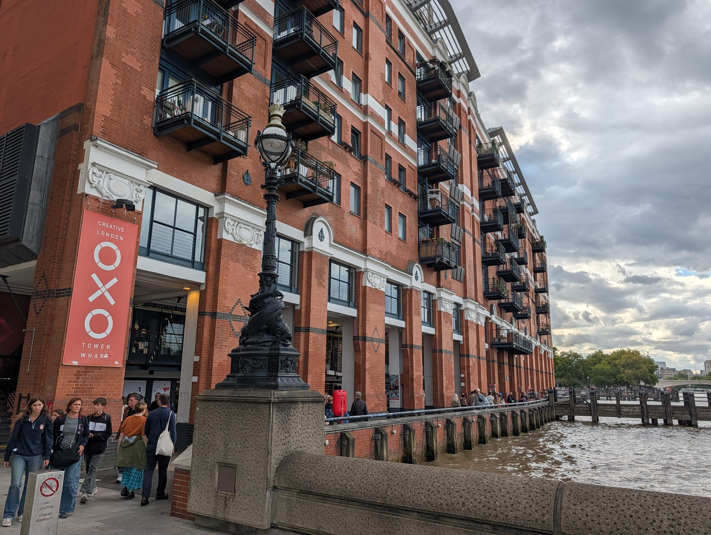
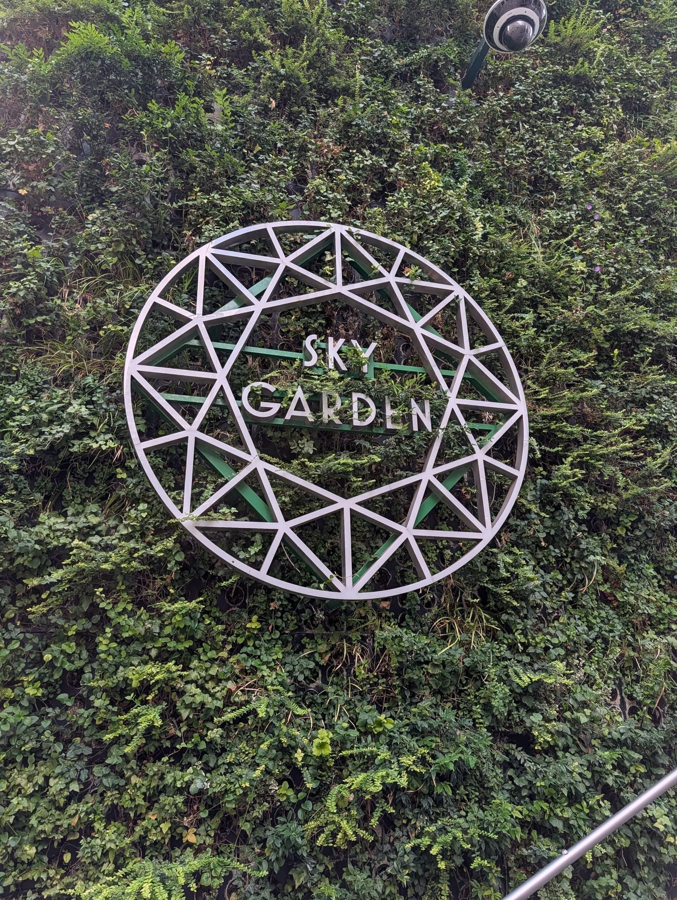
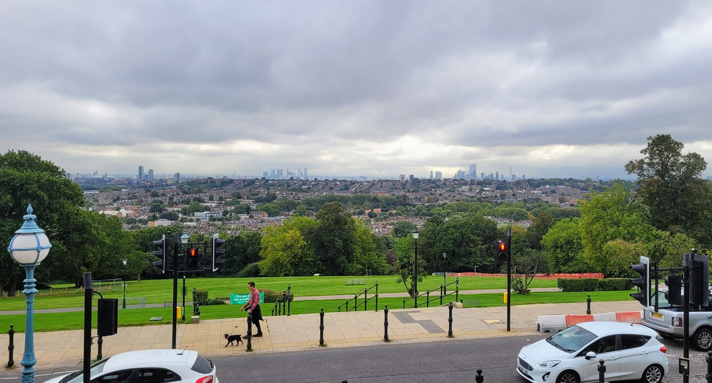

The best view in London is free, and it is higher than the one you pay for.

**Horizon 22** sits on level 58 of 22 Bishopsgate at **254 metres**. The View from The Shard's gallery is on floor 72 at **244.3 metres**. Horizon 22 opened in 2023, costs nothing, and is roughly ten metres higher.

That changes the whole shape of this question. The Shard still has something no free viewpoint offers — an **open-air** deck at that altitude — but it is no longer the highest public view in the city, and anything telling you otherwise is out of date.

> 💡 **The Short Version:** **Horizon 22** is free, ticketed, and the highest public viewpoint in London. **The Garden at 120** is free with no booking at all, which makes it the answer at short notice. **One New Change** gives you St Paul's at eye level for nothing. **Parliament Hill** is the best free panorama. And **Frank's Cafe** in Peckham is the best rooftop bar view, from the top of a car park.

> 📘 **How we choose these (editorial note)**
> No paid placements. These are drawn from a wide spread of sources rather than any single list - the food and travel press, the big listings sites, independent blogs and specialists, video, and what Londoners recommend themselves - and cross-referenced against each other. Free means genuinely free — no minimum spend and no drink required. Heights are given only where they could be verified. Booking rules and opening hours at the free viewpoints change often; check on the day.

## Where they are

| If you are near… | Where to go |
| --- | --- |
| **The City** | Horizon 22, The Garden at 120, Sky Garden, The Lookout at 8 Bishopsgate, One New Change, The Monument, St Paul's |
| **London Bridge & Bankside** | The View from The Shard, Aqua Shard, Tate Modern Level 10, Southwark Bridge |
| **South Bank** | OXO Tower gallery, Waterloo Bridge, Forza Wine, 12th Knot |
| **Covent Garden** | Royal Ballet and Opera terrace |
| **Tower & Bermondsey** | Tower Bridge |
| **Victoria** | Westminster Cathedral bell tower |
| **Battersea** | The Chimney Lift |
| **Greenwich & south-east** | Greenwich Park, Blackheath Point, Island Gardens, Severndroog Castle |
| **North London** | Parliament Hill, Kenwood, Primrose Hill, Alexandra Palace |
| **Richmond** | Richmond Hill, King Henry VIII's Mound |
| **Peckham & east** | Frank's Cafe, Bōkan, Netil360 |

---

## Free, and no booking needed

### The Garden at 120, City of London

*Free · 15th floor · walk straight in*

**The single most useful viewpoint in London.** A 360-degree open-air rooftop garden with a water rill and wisteria, fifteen storeys up — and no ticket, no booking and no queue system.

Everything else free and high in the City makes you plan ahead. This one you can decide on while standing in the street.

Summer hours run to 9pm on weekdays. **Closed on bank holidays**, and it shuts in high wind, storms, ice or extreme heat, since the whole thing is outdoors.

### One New Change Roof Terrace, City of London

*Free · walk-in · reported open 6am to midnight*

Not a panorama — **one spectacular framed view of St Paul's**, directly opposite and close enough to feel like you could touch the dome.

The long hours are what make it valuable. It is the best free sunrise viewpoint in the City by a distance, and one of the few places you can photograph the cathedral lit up late at night.

The irony worth knowing: looking *at* St Paul's from here is free, and climbing *up* St Paul's costs £27.

### Tate Modern, Level 10, Bankside

*Free · walk-in · open to 9pm Friday and Saturday*

The Thames, St Paul's, Canary Wharf, and on a clear day reportedly as far as Wembley.

Since the 2023 privacy ruling over the neighbouring flats, the south side is permanently closed, so this is about three-quarters of a circle rather than a full one. It remains the best free late-evening viewpoint on the south bank.

### OXO Tower Public Viewing Gallery, South Bank

*Free · 8th floor · barely signposted*

A statutory public viewing deck attached to a smart restaurant, looking straight onto the Millennium Bridge and St Paul's.

**Most people walk past assuming it is private.** Take the lift to the eighth floor and ask staff to point you to the public viewing platform — it exists, it is free, and you do not need to buy anything.

*The OXO Tower. The gallery is on the eighth floor and almost nothing at street level tells you it is there.*

Hours are not published anywhere official, and in practice track the restaurant's.

### Royal Ballet and Opera terrace, Covent Garden

*Free · during opening hours*

The amphitheatre bar terrace, open to anyone from noon, with the best elevated view down onto Covent Garden Piazza and the market roof.

The venue **rebranded from the Royal Opera House in 2024**, so older guides list it under the old name. Closed to non-ticketholders during gala performances.

---

## Free, but you need a ticket

### Horizon 22, City of London

*Free · level 58 · 254 metres · free timed ticket required*

**The highest public viewpoint in London, and it costs nothing.** Level 58 of 22 Bishopsgate, at 254 metres — about ten metres above The Shard's paid gallery.

You see the Gherkin, St Paul's, Tower Bridge and the Thames laid out below. Widely described as the highest free viewing gallery in Europe, though the venue itself only claims London.

The honest caveat: it is **fully enclosed behind glass**. There is no open air, and photographs pick up reflections. If you want wind in your face, that is what The Shard's top deck sells.

Free timed tickets are released online and go quickly.

### Sky Garden, City of London

*Free · level 35 · book weeks ahead*

Three storeys of planted terraces under a glass shell on top of the Walkie-Talkie. Free tickets release **every Monday morning for three weeks ahead**, and go fast. Slots last an hour and you must arrive within fifteen minutes of yours.

The thing almost nobody mentions: **there are paid walk-in slots** at management's discretion, around £11.50 early morning and from £15.50 in the evening. If you have missed the free tickets, that is a cheaper answer than booking the restaurant.

> ⚠️ One visitor lift is currently out of service and capacity is reduced, so some ticket holders are being turned away at their booked slot. Rebooking is advised.

### The Lookout at 8 Bishopsgate, City of London

*Free · 50th floor · booking required*

A roughly 240-degree sweep from the fiftieth floor, strongest to the west and south.

> ⚠️ **This does need booking**, contrary to what a lot of guides say. Free tickets release **every other Monday**, up to two weeks ahead, for a 45-minute slot.

Worth the effort for one reason: on **Mondays and Fridays it stays open until 9pm**, which makes it the only free City viewpoint that reliably catches a summer sunset.

---

## Ticketed

### The View from The Shard, London Bridge

*From £25.95 online · floors 68–72 · gallery at 244.3m*

The highest **open-air** viewing deck in the country, on floor 72.

Be clear about what that sentence does and does not say. It is no longer the highest public view in London — Horizon 22 is higher and free. What roughly £26 buys you is open sky at 244 metres, which no free viewpoint anywhere in the city offers.

> ⚠️ Ignore the marketing line about being "almost twice the height of any other viewing platform in the capital." It has not been true since 2023.

Powered by <a target="_blank" rel="sponsored" href="https://www.getyourguide.com/london-l57/">GetYourGuide</a>

### Aqua Shard, London Bridge

*No admission fee · level 31 · book a table*

**The tip most guides leave out.** A cocktail at Aqua Shard, on level 31 of the same building, costs less than a ticket to the viewing gallery and gets you two-thirds of the height with a seat and a drink.

You need a reservation, and you are buying a drink rather than admission, but there is no entry charge.

### The Monument, City of London

*£7 adult, £3.50 child · 61.5 metres · 311 steps*

**The cheapest ticketed viewpoint in London**, and a genuine piece of history — Wren's column to the Great Fire, and the tallest thing in London when it opened in 1677.

Manage your expectations. It is now surrounded by buildings four times its height, so you are buying a historic climb and a caged platform at close range, not a panorama. At £7, that is fair.

No lift, and 311 steps.

### St Paul's Cathedral, Golden Gallery

*£27 adult · 85 metres · 528 steps*

The most expensive viewpoint on this page, and the hardest work — 528 steps with no lift to the top.

What you get is the Millennium Bridge axis, Tate Modern, the river and the City from the dome of the building everything else is arranged around.

### Tower Bridge Exhibition

*£15.80 summer / £18 standard · walkways 42 metres up*

Glass floors in the high-level walkways and the Victorian engine rooms, which are the real draw — the height is modest.

**Two free alternatives on the same structure:** the North Bastion pavement upstream is the officially designated viewpoint and costs nothing, and the bridge lift times are published on their site, so you can watch it open for free.

### The Chimney Lift, Battersea

*From £24 adult, £17 child · 109 metres*

A glass lift that rises **109 metres up inside the north-west chimney** of Battersea Power Station and out of the top.

**Renamed from Lift 109** — older guides and signage still use the old name. Worth it for the mechanism rather than the panorama: Battersea is not central, so the skyline is a fair way off.

### Up at The O2, Greenwich

*From £37 · summit platform 52 metres*

A guided climb over the roof of the dome on a fabric walkway, ending on a platform 52 metres up.

**Overrated as a viewpoint, worth it as an activity.** At 52 metres you are lower than Parliament Hill, and you are in Greenwich looking at Canary Wharf rather than central London. You are paying for the climb.

### Alexandra Palace: The Summit

*From £24.50 adult · guided roof climb · 130m above sea level*

A guided walk across the palace roof, billed as the highest roof walk in the UK, ending at the Angel of Plenty statue.

Honest note: **the free terrace below gives you essentially the same panorama.** The Summit buys the climb and the statue, not a different view.

### Westminster Cathedral Bell Tower, Victoria

*Around £9 adult · 64 metres · has a lift*

Genuinely obscure, and the practical detail that sells it: **it is the only central London tower view with a lift instead of a staircase.**

The gallery looks straight down Victoria Street towards Westminster, in a part of London with no other viewpoint at all. Tickets from the cathedral shop, **Wednesday to Sunday only**.

> ⚠️ Sources disagree on the price — older listings show £6. Check at the shop.

---

## The protected views

Several of London's best free views are **protected by law**. The Greater London Authority's View Management Framework fixes an official assessment point for each one — a precise spot, a compass bearing and a target landmark — and buildings cannot be put up in the way.

That is why these particular hills still have a view when so much else has been built out, and it is worth knowing which specific spot the protection applies to.

### Parliament Hill, Hampstead Heath

*Free · 98 metres*

**The most complete free panorama in London**, and the only protected viewpoint with official vistas to *both* St Paul's and the Palace of Westminster.

The official guidance gives a tip most visitors never hear: **stand at the summit for St Paul's, and walk east for the Palace of Westminster.** They are two different vantage points, a short stroll apart.

You can also pick out the BT Tower, The Shard, Canary Wharf, St Pancras and the Broadgate Tower. There is an orientation board.

### Kenwood, Hampstead Heath

*Free · the highest protected point in London*

The viewing gazebo in front of the orientation board at Kenwood sits at **114 metres** — sixteen metres higher than Parliament Hill's assessment point, and the highest official viewpoint in the whole protected set.

It has its own orientation board, a protected sightline to St Paul's nearly eight kilometres away, and a fraction of the crowd. **The most under-sold viewpoint in London.**

### Primrose Hill

*Free · 64 metres*

The photograph everyone takes, with protected vistas to both St Paul's and Westminster, and all three Westminster towers visible.

Two honest notes. The official framework itself now admits **the Euston towers partly obscure the City cluster**, with St Paul's framed between two of them — the view is not what it was.

> ⚠️ And the detail nearly every guide misses: Primrose Hill is **currently closed 10pm to 6am on Friday, Saturday and Sunday nights**, from early April to early November. People turn up for a late summer view and find the gates shut.

### Alexandra Palace terrace

*Free · 94 metres*

Looking south to St Paul's, the London Eye, the BT Tower, The Shard, Canary Wharf and St Pancras.

*The view south from the terrace. Canary Wharf is on the left, the City cluster and the Shard further right.*

The precise tip: **there are two official points and they do different jobs.** One is better for the wide panorama; the other, approached from the north-east car park, is where St Paul's lines up — and only that second one carries the protected vista.

### Greenwich Park, by the General Wolfe statue

*Free · 48 metres*

The classic Greenwich composition down through the Old Royal Naval College to the Queen's House, with St Paul's and Tower Bridge beyond and The Monument just to the right of the bridge.

> ⚠️ **This view is free and outside the ticketed Observatory.** The designated viewpoint is the terrace by the General Wolfe statue, on the public path. Do not pay £24 for the panorama — pay for the Meridian and the astronomy if you want those.

### Blackheath Point, Greenwich

*Free · 48 metres*

**The best genuinely little-known viewpoint in London.** A full protected panorama with an orientation board and a Battle of Britain memorial, and almost nobody goes.

The detail no other guide will give you: **Tower Bridge sits between St Paul's and the City cluster, and the dome of the Old Bailey is just visible to the right of the cathedral's peristyle.**

### King Henry VIII's Mound, Richmond Park

*Free · 59 metres*

A single telescopic sightline to **St Paul's ten miles away**, framed through a gap in a hedge, and protected as a linear view in its own right.

Be realistic: **it is a keyhole, not a vista.** The aperture changes with the seasons and with pruning, and on a hazy day you will see very little. Go for the oddness of it.

### Richmond Hill

*Free · protected by Act of Parliament*

The bend of the Thames below Petersham Meadows with Glover's Island at its centre, painted by Turner and Reynolds, and **the only view in England protected by its own Act of Parliament** — the Richmond, Petersham and Ham Open Spaces Act 1902.

> ⚠️ The protected view is from **the Terrace Walk pavement at the top of Richmond Hill**, not from inside Terrace Gardens below. They are commonly confused and the gardens do not have it.

---

## Bridges and the river

Nine Thames crossings are formally designated protected river views. All are free, open at all hours, and need no booking.

### Southwark Bridge

**The most underrated free view in London.** The official framework describes the view north as dominated by St Paul's with the wide expanse of the Thames in the foreground — and you also get Tate Modern, the Millennium Bridge, the BT Tower and St Bride's.

The Millennium Bridge crowds are two hundred metres away looking at a narrower version of the same thing.

### Waterloo Bridge

Still the one to lead with: **the only crossing that gives you Westminster in one direction and the City and St Paul's in the other** from a single spot. Free, always open, best at dusk.

### London Bridge

The Tower of London, Tower Bridge and HMS Belfast, with Canary Wharf beyond. The official tip is precise: **the best view of the Tower is from close to the Southwark bank.**

### Tower Bridge, the free pavement

The North Bastion on the upstream side is the designated viewpoint — the Tower of London, St Paul's, The Monument and HMS Belfast, with what the framework calls the free sky space around the White Tower.

### Island Gardens, Isle of Dogs

The **Canaletto view**: the Old Royal Naval College across the water with the Queen's House and the Observatory rising behind it, composed exactly as it was painted. Officially protected, and free.

> ⚠️ Reach it by DLR to Island Gardens. The Greenwich Foot Tunnel is the romantic route but its lift hours could not be verified, and the alternative is around a hundred steps.

### London Cable Car

*£7 single, or £2 a crossing with a multi-trip ticket · 90 metres*

Ninety metres above the Thames between Greenwich Peninsula and the Royal Docks.

**The tip that makes it worth doing:** a £20 multi-journey ticket gives ten one-way trips — £2 a crossing — valid a year, and sold only at the terminals. At the £7 walk-up fare it is a short ride over a stretch of river with no famous landmarks; at £2 it is a bargain.

> ⚠️ Pay-as-you-go journeys here **do not count towards daily or weekly caps**. It also runs to 11pm on Saturdays, the latest option on this page.

---

## Rooftop bars

### Frank's Cafe, Peckham

*Free entry · seasonal · card only*

A bar on the top deck of a **multi-storey car park** on Rye Lane, with an uninterrupted central London skyline across the whole of south London. The best free-entry rooftop view in the city.

> ⚠️ **Seasonal.** It runs mid-May to mid-September, Wednesday to Sunday, and then shuts for the year. Lift access needs arranging with security on the ground floor.

### Bōkan, Canary Wharf

*Floors 37–39 · rooftop terrace on 39*

**The best high view in east London**, and the one place you see the Canary Wharf towers from *inside* the cluster rather than across the river at it. Restaurant on 37, bar on 38, terrace on 39.

### Duck & Waffle, City

*40th floor · open 24 hours*

Forty floors up and **the only London viewpoint open at four in the morning**, which genuinely makes sunrise an option.

### SUSHISAMBA, City

*38th and 39th floors*

An orange tree growing through an open-air terrace on the 39th floor of the Heron Tower — one of very few genuinely outdoor high terraces in London. Expensive.

Not to be confused with their Covent Garden site, which is on the market building's Opera Terrace and much lower.

### Aviary, Shoreditch

*10th floor · opens 6:30am*

The unusual thing here is the hour: **open from 6:30am on weekdays**, making it one of the only rooftops in London serving breakfast with a City skyline.

### 12th Knot, South Bank

*12th floor · closed Sunday and Monday*

The Thames and the City from Sea Containers. Over-18s, walk-ins accommodated, and **shut on Sundays and Mondays**, which catches people out.

### Forza Wine, National Theatre

A terrace on top of the National Theatre looking straight up the Thames, with no entry fee. There are further sites in Peckham and Soho.

---

## What to know

* **The highest view is free.** Horizon 22 beats The Shard's gallery by around ten metres and costs nothing. Anything that still calls The Shard the highest public viewpoint in western Europe is out of date.
* **Three free viewpoints need tickets** — Horizon 22, Sky Garden and The Lookout. Only The Garden at 120, One New Change, Tate Modern and the OXO gallery are true walk-ins.
* **Check the day, not just the hour.** Severndroog Castle's viewing platform opens **Sundays only**. Westminster Cathedral's tower is Wednesday to Sunday. Frank's Cafe is seasonal. The Garden at 120 shuts on bank holidays.
* **Primrose Hill closes at 10pm at weekends** from April to November. This is new and almost nothing has caught up.
* **You can usually avoid paying.** Greenwich's famous view is outside the paid Observatory. St Paul's is free to look at from One New Change. Aqua Shard is cheaper than a Shard ticket. The best Tower Bridge view is the free pavement.
* **The best light** is the hour before sunset — and most free City viewpoints close before it in winter. The Lookout on a Monday or Friday, or Tate Modern on a Friday or Saturday, are the exceptions.

---

Powered by <a target="_blank" rel="sponsored" href="https://www.getyourguide.com/london-l57/">GetYourGuide</a>

## Continue planning your London trip

- 🎪 **[Free Things to Do in London](/free/)**
- 🏛️ **[The Best Museums in London](/articles/best-museums-london/)**
- 🌳 **[London's Parks and Gardens](/articles/best-parks-gardens-london/)**
- 🍸 **[The Best Cocktail Bars in London](/articles/best-cocktail-bars-london/)**
- 🏙️ **[City of London Area Guide](/articles/city-of-london-area-guide/)**
- ⛵ **[Greenwich Area Guide](/articles/greenwich-area-guide/)**
