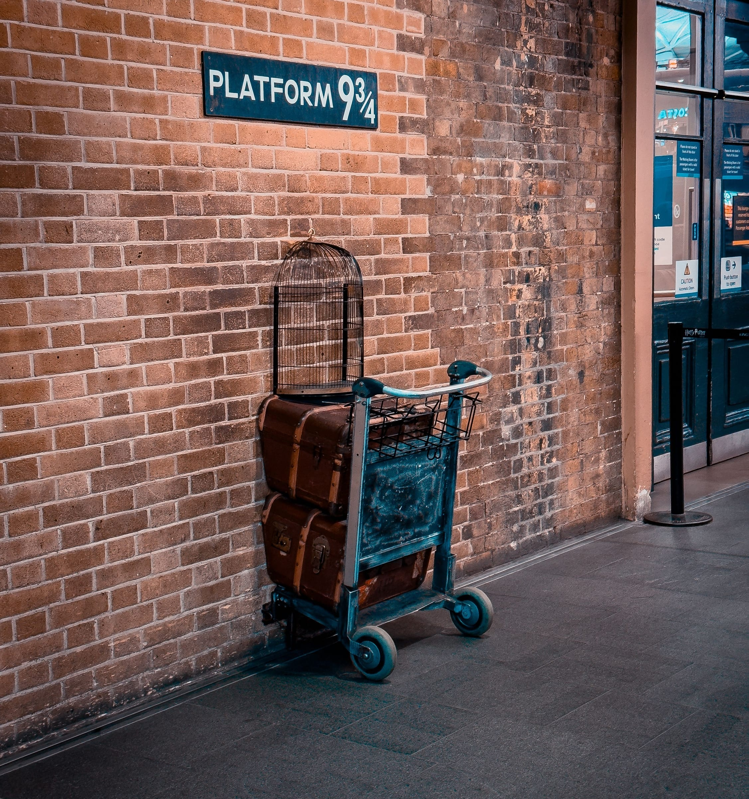

London has hundreds of guided walks, and most lists of the best ones mix tours you can book with tours you can't. **Every tour on this page is bookable on GetYourGuide**, and each is here because the evidence backs it: Tripadvisor's Travellers' Choice awards, the walking-tour lists from Time Out, Visit London and the travel writer Nomadic Matt, and review scores on GetYourGuide itself. Nothing below is rated under 4.5.

> 💡 **The Short Version:** The strongest award record belongs to **Liquid History Tours' historic pub walk**, Tripadvisor's No. 1 experience in the UK in 2025 and No. 7 in the world in 2026 (**£35**). For a first visit, take a **Blue Badge guide round Westminster** (from about **£30**). The best score from a big pool of reviews is the **Great British Rock and Roll walk**, 5.0 from 2,251. Most themed walks cost **£15–£35** and last **two hours**; food tours run **£59–£92**.

> 📘 **How we choose these (editorial note).** Only tours sold on GetYourGuide are listed, and we earn a commission if you book through our links; the price is the same either way. No operator paid to be included. Ratings, review counts and prices were checked on GetYourGuide on 11 September 2026. Prices are the lowest adult price for the standard option and move with the date.

## The pick for each theme

| Best for | Tour | From | Length |
|---|---|---|---|
| A first visit | Westminster Abbey, Big Ben and Buckingham Palace, Rosotravel | £30 | 3–4 hours |
| Pubs | Historic Pubs of Central London, Liquid History Tours | £35 | 3½ hours |
| Music | The Great British Rock and Roll Walking Tour, Experience Local | £32 | 2 hours |
| Jack the Ripper | Jack the Ripper Evening Walking Tour, Meet The Street Tours | £20 | 2 hours |
| Harry Potter | The Most Comprehensive Harry Potter Tour, Tours Teatralizados RV | £22 | 3¼–3½ hours |
| Food | East End Food Tour, Eating London | £89 | 3½ hours |
| Street art | The Original London Street Art Tour, Alternative London | £20 | 2 hours |
| Ghosts | Ghastly Ghosts, Meet The Street Tours | £20 | 2 hours |

## First time in London: the big sights

These cover the postcard sights, Parliament, the Abbey and Buckingham Palace, with enough history to make them mean something.

### Westminster Abbey, Big Ben and Buckingham Palace — Rosotravel

*From about £30 · 3–4 hours · Blue Badge guide · 4.8 from 3,940 reviews · <a href="https://www.getyourguide.com/activity/-t512555?partner_id=WWP7I0R&amp;cmp=best-walking-tours-london" target="_blank" rel="sponsored nofollow noopener" data-affiliate="gyg">Book on GetYourGuide</a>*

The guides are **Blue Badge** holders, the top professional qualification for London guides, and the tour comes in two versions. The **four-hour** one includes skip-the-line entry to **Westminster Abbey** with your guide, through Rosotravel's official partnership with the Abbey. The **three-hour** one is a city walk that ends at the Abbey in time for a free organ recital, a service or evensong. Either way you see Buckingham Palace, the Houses of Parliament and Big Ben, which is from the outside only. Tripadvisor reviewers give the same tour 4.9 from 349 reviews.

### 30 London Sights in a Day — Top Sights Tours

*£47 · 5 hours · small group · 4.8 from 896 reviews · <a href="https://www.getyourguide.com/activity/-t169045?partner_id=WWP7I0R&amp;cmp=best-walking-tours-london" target="_blank" rel="sponsored nofollow noopener" data-affiliate="gyg">Book on GetYourGuide</a>*

The one to take if you have a single day and want the lot. It goes through **Green Park to Buckingham Palace for the Changing of the Guard**, then Downing Street, Horse Guards Parade, Westminster Abbey, Parliament Square and Big Ben, before a Tube ride east for the **Tower of London and London Bridge**. Options add entry to the Tower or the Tower Bridge exhibition afterwards. On Tripadvisor, as *London 30 Top Sights with Fun Local Guide*, it has 4.9 from 2,008 reviews.

### The Changing of the Guard, With an Expert — Urban Saunters

*From £15 · 2–4 hours · 4.8 from 2,718 reviews · <a href="https://www.getyourguide.com/activity/-t413142?partner_id=WWP7I0R&amp;cmp=best-walking-tours-london" target="_blank" rel="sponsored nofollow noopener" data-affiliate="gyg">Book on GetYourGuide</a>*

Rather than standing in the crowd at the palace railings, you **walk with the guards as they march to Buckingham Palace**, while the guide explains what each button, gesture and colour in the ceremony signifies. Nomadic Matt, who took more than 25 London walking tours for his list, picks this one. The ceremony doesn't happen every day, so check the tour's calendar before planning around it. One option adds tickets to the palace's State Rooms, which open to visitors from July to September.

### Medieval London From the Tower — The Sights of London Tour

*£18 · 2 hours · starts at Tower Hill · 4.9 from 408 reviews · <a href="https://www.getyourguide.com/activity/-t433959?partner_id=WWP7I0R&amp;cmp=best-walking-tours-london" target="_blank" rel="sponsored nofollow noopener" data-affiliate="gyg">Book on GetYourGuide</a>*

Meet outside the western exit of **Tower Hill** station, then cross **Tower Bridge** and follow the Thames west past **HMS Belfast**, which took part in the D-Day landings, into Shakespeare's Southwark. The guide is a historian and the story runs from the Romans to now. At £18 it costs less than most tours on this page.

## Historic pubs

### Historic Pubs of Central London — Liquid History Tours

*£35 · 3½ hours · starts at St Paul's · 4.9 from 1,236 reviews · <a href="https://www.getyourguide.com/activity/-t27204?partner_id=WWP7I0R&amp;cmp=best-walking-tours-london" target="_blank" rel="sponsored nofollow noopener" data-affiliate="gyg">Book on GetYourGuide</a>*

Tripadvisor's Travellers' Choice awards named this the **No. 1 experience in the UK in 2025**, No. 4 in the world that year, and **No. 7 in the world in 2026**. On Tripadvisor it runs as *London Small Group Tour of Historical Pubs*, with 5.0 from more than 10,000 reviews. The walk is a gentle two miles from **St Paul's** (meet at Exit 2, on Panyer Alley), stopping at **four historic pubs**, down Fleet Street, "the street of shame", and into a Victorian gin palace. Time Out's report on the award names Ye Olde Cheshire Cheese, off Fleet Street, as one of the old pubs you meet. Nomadic Matt links this exact tour. You buy your own drinks, so bring cash and ID.

Powered by <a target="_blank" rel="sponsored" href="https://www.getyourguide.com/london-l57/">GetYourGuide</a>

### Soho's Music Pubs — Experience Local

*£32 · 2½ hours · starts at Piccadilly Circus · 4.9 from 973 reviews · <a href="https://www.getyourguide.com/activity/-t80541?partner_id=WWP7I0R&amp;cmp=best-walking-tours-london" target="_blank" rel="sponsored nofollow noopener" data-affiliate="gyg">Book on GetYourGuide</a>*

From the Eros statue at **Piccadilly Circus**, where the guide waits with an open umbrella, into Soho for **four pubs** with music history: ones where John Lennon drank, and the place where Jimi Hendrix gave his last live performance. Same company as the rock and roll walk further down, in the same format with pints.

### Ancient Pubs and Historic Taverns — Side Routes

*From £28 · 2–2½ hours · small group · 4.9 from 217 reviews · <a href="https://www.getyourguide.com/activity/-t1188504?partner_id=WWP7I0R&amp;cmp=best-walking-tours-london" target="_blank" rel="sponsored nofollow noopener" data-affiliate="gyg">Book on GetYourGuide</a>*

A smaller-group alternative through cobbled streets and hidden courtyards, from coaching inns to Victorian gin palaces, with pubs dating back to the 16th century and the history of British ale along the way. For where to eat and drink in the oldest rooms afterwards, see our guide to [London's historic pubs and dining rooms](/articles/historic-pubs-dining-rooms-london/).

## Jack the Ripper

Ripper walks start at dusk in Whitechapel and Spitalfields, where the murders of 1888 happened, and they are some of the most-reviewed walking tours on GetYourGuide. If you're here for Halloween, our [Halloween guide](/articles/halloween-london/) covers which Ripper walks run on the night itself.

### Jack the Ripper Evening Walking Tour — Meet The Street Tours

*£20 · 2 hours · starts at Aldgate · 4.9 from 1,527 reviews · <a href="https://www.getyourguide.com/activity/-t54688?partner_id=WWP7I0R&amp;cmp=best-walking-tours-london" target="_blank" rel="sponsored nofollow noopener" data-affiliate="gyg">Book on GetYourGuide</a>*

The highest-scoring Ripper walk on GetYourGuide with more than 500 reviews. You meet at **Aldgate** station and walk the streets where the murders happened, with as much time on the East End's poverty in the 1880s, the slums and the gin, as on the suspects.

### The Original Jack the Ripper Walking Tour — See Your City

*£22 · 2 hours · 4.7 from 8,757 reviews · <a href="https://www.getyourguide.com/activity/-t359535?partner_id=WWP7I0R&amp;cmp=best-walking-tours-london" target="_blank" rel="sponsored nofollow noopener" data-affiliate="gyg">Book on GetYourGuide</a>*

The big one: nearly 9,000 reviews, and the only one of these three that runs in **Spanish, German, Italian, French, Portuguese and Japanese** as well as English, so the meeting point depends on the language you book. The guides call themselves Ripperologists. You look at the photographic evidence at the crime scenes and weigh up the suspects, passing Spitalfields Market on the way.

### Ripper-Vision — Secret Chamber Tours

*£18 · 1¾ hours · starts at Aldgate East · 4.5 from 1,900 reviews · <a href="https://www.getyourguide.com/activity/-t104249?partner_id=WWP7I0R&amp;cmp=best-walking-tours-london" target="_blank" rel="sponsored nofollow noopener" data-affiliate="gyg">Book on GetYourGuide</a>*

The guides carry **handheld projectors** and cast period photographs, crime-scene images, maps and newspaper illustrations onto the walls of the streets where the murders happened. The operator bills it as an immersive experience rather than a standard walk. Meet at **Aldgate East, Exit 3**, not Aldgate, outside the Whitechapel Gallery. On Tripadvisor it has 4.6 from 3,091 reviews. It isn't suitable for children under 10 without a parent's consent.

## Ghost walks

### Ghastly Ghosts — Meet The Street Tours

*£20 · 2 hours · after dark · starts at All Hallows by the Tower · 4.9 from 815 reviews · <a href="https://www.getyourguide.com/activity/-t56795?partner_id=WWP7I0R&amp;cmp=best-walking-tours-london" target="_blank" rel="sponsored nofollow noopener" data-affiliate="gyg">Book on GetYourGuide</a>*

After dark from **All Hallows by the Tower**, one of London's oldest churches, with a Saxon arch and recycled Roman tiles, through the alleys of the City to **St Paul's Cathedral**, on tales of terrible crimes, unsolved murders and the ghosts that followed. Visit London picks this company's walk as its London ghost tour. It's the same operator as the best-scoring Ripper walk above.

### Ghosts, Ghouls and Gallows — See Your City

*£22 · 2 hours · 4.5 from 1,383 reviews · <a href="https://www.getyourguide.com/activity/-t96390?partner_id=WWP7I0R&amp;cmp=best-walking-tours-london" target="_blank" rel="sponsored nofollow noopener" data-affiliate="gyg">Book on GetYourGuide</a>*

Past the site of what the tour calls London's most haunted house, through parks with grim histories, ending at the **Tower of London**, lit up against the night. It runs in French and German as well as English.

## Harry Potter

None of these go inside a studio. For the Warner Bros tour and everything else Potter, see our [Harry Potter in London guide](/articles/harry-potter-london/). What these do is walk you round the real places the books drew on and the films used.

### The Most Comprehensive Harry Potter Tour in London — Tours Teatralizados RV

*£22 · 3¼–3½ hours · starts at King's Cross · groups of up to 15 · 4.9 from 1,103 reviews · <a href="https://www.getyourguide.com/activity/-t772912?partner_id=WWP7I0R&amp;cmp=best-walking-tours-london" target="_blank" rel="sponsored nofollow noopener" data-affiliate="gyg">Book on GetYourGuide</a>*

The highest-rated Harry Potter walk with more than 1,000 reviews, and the longest. It starts at **King's Cross**, with a stop at the official shop, and covers 18 scenes from the eight films, among them **Leadenhall Market**, which was Diagon Alley in *Philosopher's Stone*; **Borough Market**, the Leaky Cauldron in *Prisoner of Azkaban*; and the **Millennium Bridge** the Death Eaters destroy. Groups are capped at 15, and it runs in English and Spanish. Our Harry Potter guide picks it too.

### Magical London — See Your City

*£20 · 2¼–2½ hours · 4.7 from 22,547 reviews · <a href="https://www.getyourguide.com/activity/-t174648?partner_id=WWP7I0R&amp;cmp=best-walking-tours-london" target="_blank" rel="sponsored nofollow noopener" data-affiliate="gyg">Book on GetYourGuide</a>*

**22,547 reviews**, more than any other tour on this page. It opens with a quiz that sorts you into a Hogwarts house and keeps score in house points as you go, taking the Tube between stops: **Shakespeare's Globe, Borough Market**, the alleys that inspired Knockturn Alley, the Leaky Cauldron, the London Eye and Trafalgar Square. Nomadic Matt names it among his GetYourGuide picks.

Powered by <a target="_blank" rel="sponsored" href="https://www.getyourguide.com/london-l57/">GetYourGuide</a>

### Harry Potter Movies Walking Tour — Top Sights Tours

*£15 · 3 hours · starts at King's Cross · kids go free · 4.7 from 3,208 reviews · <a href="https://www.getyourguide.com/activity/-t187638?partner_id=WWP7I0R&amp;cmp=best-walking-tours-london" target="_blank" rel="sponsored nofollow noopener" data-affiliate="gyg">Book on GetYourGuide</a>*

It starts where you'd hope: inside **King's Cross**, at the stairs up to the Parcel Yard beside the Platform 9¾ shop. From there it takes in the **Millennium Bridge**, the Leaky Cauldron, the **Palace Theatre** where *Harry Potter and the Cursed Child* plays, Leicester Square and the House of Spells shop. The listing says kids go free, which makes it the cheap family option.

*The Platform 9¾ trolley at King's Cross, where the Harry Potter Movies walk begins.*

## Film, TV and books

### Sherlock Holmes — Brit Movie Tours

*£20 · 2 hours · starts at Piccadilly Circus · 4.7 from 815 reviews · <a href="https://www.getyourguide.com/activity/-t25865?partner_id=WWP7I0R&amp;cmp=best-walking-tours-london" target="_blank" rel="sponsored nofollow noopener" data-affiliate="gyg">Book on GetYourGuide</a>*

It starts outside the **Criterion** at 224 Piccadilly, the bar where, in *A Study in Scarlet*, Dr Watson first hears about Holmes. Then it goes on to the gentlemen's clubs and grand hotels of the stories, the real places that inspired Conan Doyle, and filming locations from the adaptations. Visit London includes a Sherlock Holmes walk in its 21 best.

### James Bond and Spies — Where Now Tours

*£16 · 2–2½ hours · starts by the London Eye · 4.9 from 227 reviews · <a href="https://www.getyourguide.com/activity/-t640062?partner_id=WWP7I0R&amp;cmp=best-walking-tours-london" target="_blank" rel="sponsored nofollow noopener" data-affiliate="gyg">Book on GetYourGuide</a>*

How Ian Fleming's own wartime intelligence work became Bond, plus London's other spies, real and invented: John le Carré's George Smiley, Mick Herron's *Slow Horses* and Robert Ludlum's Jason Bourne. You'll see where Bond goes for his martini. It meets by the **London Eye**, and at £16 it's one of the cheapest walks here. For more of the city on screen, see our [London filming locations guide](/articles/london-filming-locations/).

### Notting Hill — Brit Icon Tours

*£25 · 2 hours · starts at Notting Hill Gate · 4.6 from 281 reviews · <a href="https://www.getyourguide.com/activity/-t108004?partner_id=WWP7I0R&amp;cmp=best-walking-tours-london" target="_blank" rel="sponsored nofollow noopener" data-affiliate="gyg">Book on GetYourGuide</a>*

The **blue door** and the **travel bookshop** from the film, the houses of famous residents, and **Portobello Road market** on market day. Meet outside Calder's Pharmacy at 55–57 Notting Hill Gate, from Exit 1 of the station.

### Paddington Bear — Brit Movie Tours

*£25 · 2½ hours · starts at Paddington station · 4.6 from 145 reviews · <a href="https://www.getyourguide.com/activity/-t48858?partner_id=WWP7I0R&amp;cmp=best-walking-tours-london" target="_blank" rel="sponsored nofollow noopener" data-affiliate="gyg">Book on GetYourGuide</a>*

It starts outside the **Paddington Bear shop inside Paddington station**, with the statue close by, and follows the bear through places from more than 20 books and the films, including Mr Gruber's antique shop. Visit London includes a Paddington walk in its 21 best.

## Music

### The Great British Rock and Roll Music Walking Tour — Experience Local

*£32 · 2 hours · starts at Tottenham Court Road · 5.0 from 2,251 reviews · <a href="https://www.getyourguide.com/activity/-t453983?partner_id=WWP7I0R&amp;cmp=best-walking-tours-london" target="_blank" rel="sponsored nofollow noopener" data-affiliate="gyg">Book on GetYourGuide</a>*

**A perfect 5.0 from 2,251 reviews**, the best score at that volume of any tour on this page. The walk covers where the Rolling Stones, the Beatles, Pink Floyd and Led Zeppelin started out, the studios where Bowie, Queen and Hendrix recorded, and the places Elton John and Clapton got going. Meet under the big digital screens at **The Now Building, Centre Point**, by Tottenham Court Road station, where the guide holds an open umbrella. Tripadvisor reviewers score it 5.0 too, from 1,640 reviews.

Powered by <a target="_blank" rel="sponsored" href="https://www.getyourguide.com/london-l57/">GetYourGuide</a>

### The Beatles: Abbey Road, Trident and Savile Row — Compleat Walks

*£49 · 2 hours · starts at the Dominion Theatre · 4.8 from 107 reviews · <a href="https://www.getyourguide.com/activity/-t1042501?partner_id=WWP7I0R&amp;cmp=best-walking-tours-london" target="_blank" rel="sponsored nofollow noopener" data-affiliate="gyg">Book on GetYourGuide</a>*

**Abbey Road Studios**, **Trident Studios** in Soho where *Hey Jude* was recorded, **Savile Row** and the Apple building whose roof hosted the Beatles' last live performance, and the place Paul McCartney lived at the height of Beatlemania. Meet outside the Dominion Theatre.

### Amy Winehouse's Camden — Compleat Walks

*£29 · 2 hours · starts at the Roundhouse · 4.9 from 79 reviews · <a href="https://www.getyourguide.com/activity/-t974418?partner_id=WWP7I0R&amp;cmp=best-walking-tours-london" target="_blank" rel="sponsored nofollow noopener" data-affiliate="gyg">Book on GetYourGuide</a>*

It starts outside the **Roundhouse** at Chalk Farm, where she made her last stage appearance in July 2011, then covers at least nine Camden stops: three of her homes, four of the bars and pubs she drank in, at least five murals and her life-size statue.

### West End Musicals Silent Disco — Silent Disco Walking Tours

*£38 · 2 hours · 4.9 from 70 reviews · <a href="https://www.getyourguide.com/activity/-t210975?partner_id=WWP7I0R&amp;cmp=best-walking-tours-london" target="_blank" rel="sponsored nofollow noopener" data-affiliate="gyg">Book on GetYourGuide</a>*

Wireless headphones, a performer as host, and songs from the big musicals as you walk, sing and dance through Theatreland past the famous theatres, with backstage stories on the way. Wear flat shoes: heels aren't allowed. Visit London includes silent disco walks in its 21 best.

## Food

Food tours cost three or four times as much as a history walk because the tastings are included, so plan them instead of a meal rather than before one.

### East End Food Tour — Eating London

*£89 · 3½ hours · groups of up to 12 · 4.9 from 84 reviews · <a href="https://www.getyourguide.com/activity/-t136652?partner_id=WWP7I0R&amp;cmp=best-walking-tours-london" target="_blank" rel="sponsored nofollow noopener" data-affiliate="gyg">Book on GetYourGuide</a>*

The one with the award: Tripadvisor's Travellers' Choice 2025 put *Eating London: Brick Lane, Shoreditch & Spitalfields Food Tour* at **No. 12 among the world's food and drink experiences**. It walks Brick Lane, Spitalfields and Shoreditch with tastings along the way, including a specialist cheese shop, a hole-in-the-wall, **mini fish and chips with mushy peas** at an award-winning chippie and a Brick Lane curry. You pass the old Jewish Soup Kitchen and the pub linked to Jack the Ripper's victims. The GetYourGuide listing is the operator's 10-year anniversary edition.

### Borough Market — Secret Food Tours

*£92 · 3 hours · small group · 4.8 from 599 reviews · <a href="https://www.getyourguide.com/activity/-t67794?partner_id=WWP7I0R&amp;cmp=best-walking-tours-london" target="_blank" rel="sponsored nofollow noopener" data-affiliate="gyg">Book on GetYourGuide</a>*

Six British classics plus a "secret" dish in and around **Borough Market** and London Bridge: award-winning fish and chips, a top-rated sausage roll, and **British cheeses with cider or local beer**. For the rest of London's markets, see our [markets guide](/articles/best-london-markets/).

### Soho and Chinatown — Carpe Diem Tours

*£76 · 3 hours · 4.8 from 253 reviews · <a href="https://www.getyourguide.com/activity/-t943039?partner_id=WWP7I0R&amp;cmp=best-walking-tours-london" target="_blank" rel="sponsored nofollow noopener" data-affiliate="gyg">Book on GetYourGuide</a>*

Four cuisines, Mediterranean, Indian, Chinese and British, at pre-booked tables with a set menu, so there's no queueing, through **Soho and Chinatown**.

### East London Food — No Diet Club

*£59 · 3½ hours · starts at midday · 4.9 from 134 reviews · <a href="https://www.getyourguide.com/activity/-t508003?partner_id=WWP7I0R&amp;cmp=best-walking-tours-london" target="_blank" rel="sponsored nofollow noopener" data-affiliate="gyg">Book on GetYourGuide</a>*

All the food is included for £59, the lowest price of these four: local cheese, local ice cream, the chai they rate as London's best, their favourite bakery and some surprises, between midday and 4pm. The founders started out in London's street-food markets in 2017. For eating on your own terms, see our [street food guide](/articles/best-street-food-london/).

Powered by <a target="_blank" rel="sponsored" href="https://www.getyourguide.com/london-l57/">GetYourGuide</a>

## Street art

### The Original London Street Art and Graffiti Tour — Alternative London

*From about £20 · 2 hours · starts at Old Spitalfields Market · 4.8 from 1,518 reviews · <a href="https://www.getyourguide.com/activity/-t51536?partner_id=WWP7I0R&amp;cmp=best-walking-tours-london" target="_blank" rel="sponsored nofollow noopener" data-affiliate="gyg">Book on GetYourGuide</a>*

Meet under the **White Goat statue on Brushfield Street**, outside Old Spitalfields Market (the nearest station is Liverpool Street), for work by around 40 street artists across **Spitalfields, Brick Lane and Shoreditch**. The guides are part of the scene themselves. To find the pieces on your own, see our [London street art guide](/articles/london-street-art/).

*Murals on a Shoreditch corner, the ground both Alternative London tours cover.*

### Street Art Tour and Spray-Painting Workshop — Alternative London

*From £35 · 3–4 hours · 4.9 from 337 reviews · <a href="https://www.getyourguide.com/activity/-t70507?partner_id=WWP7I0R&amp;cmp=best-walking-tours-london" target="_blank" rel="sponsored nofollow noopener" data-affiliate="gyg">Book on GetYourGuide</a>*

The same company's tour, followed by a **45-minute spray-painting workshop** where you make a piece of your own. Tripadvisor's Travellers' Choice 2026 ranked it **No. 14 among the world's once-in-a-lifetime experiences**.

## Churchill and the Second World War

### Winston Churchill and London in WWII — Urban Saunters

*£29 · 1½–3 hours · 4.9 from 167 reviews · <a href="https://www.getyourguide.com/activity/-t408590?partner_id=WWP7I0R&amp;cmp=best-walking-tours-london" target="_blank" rel="sponsored nofollow noopener" data-affiliate="gyg">Book on GetYourGuide</a>*

It starts at the **Battle of Britain monument** on the Embankment and walks Westminster as it was in the 1940s: Parliament, the Abbey, the **Cenotaph**, the old War Office, **Downing Street** and Whitehall, and what life was like for Londoners in a city under siege. One option adds entry to the **Churchill War Rooms**.

### Westminster and the Churchill War Rooms — Top Sights Tours

*£75 · 5 hours · War Rooms entry included · 4.7 from 398 reviews · <a href="https://www.getyourguide.com/activity/-t212046?partner_id=WWP7I0R&amp;cmp=best-walking-tours-london" target="_blank" rel="sponsored nofollow noopener" data-affiliate="gyg">Book on GetYourGuide</a>*

A half-day combining the Westminster sights, from Green Park and Buckingham Palace (with the Changing of the Guard on ceremony days) to Downing Street, with a visit to the **Churchill War Rooms**, the underground bunker the war cabinet worked from.

## Hidden London and social history

### Secret Old London — Fun London Tours

*£20 · 1½ hours · starts at Barbican · 4.8 from 174 reviews · <a href="https://www.getyourguide.com/activity/-t75509?partner_id=WWP7I0R&amp;cmp=best-walking-tours-london" target="_blank" rel="sponsored nofollow noopener" data-affiliate="gyg">Book on GetYourGuide</a>*

Ninety minutes from **Barbican** station through the part of the City that still shows its medieval and Tudor past: a medieval churchyard, a hidden memorial to heroic self-sacrifice, one of London's principal execution sites and the outline of the **Roman amphitheatre**.

### Black Legacies — Black Legacies London

*£30 · 2 hours · three routes · 5.0 from 29 reviews · <a href="https://www.getyourguide.com/activity/-t909831?partner_id=WWP7I0R&amp;cmp=best-walking-tours-london" target="_blank" rel="sponsored nofollow noopener" data-affiliate="gyg">Book on GetYourGuide</a>*

Choose from three trails, **Westminster, Brixton or the City of London**, each on the history and culture of London's Black communities. The Westminster route traces an African presence in London from Roman times to today. For Westminster you meet at the Eros statue, and the guide wears a green cap.

Powered by <a target="_blank" rel="sponsored" href="https://www.getyourguide.com/london-l57/">GetYourGuide</a>

## Before you book

* **Most can be cancelled free up to 24 hours ahead**, and many let you reserve now and pay later. Check the terms on each listing before relying on it.
* **They run in the rain.** Most operators go ahead in all weather, so bring a coat.
* **Arrive ten minutes early.** Several guides hold up an umbrella or wear a cap so you can spot them, and a late start is hard to catch up on a walk.
* **Ripper and ghost walks run in the evening**, and Changing of the Guard tours in the morning, so one of each fits in a day.
* **Children:** the Harry Potter and Paddington walks are the family ones. Ripper-Vision isn't suitable for under-10s without a parent's consent.
* **Rather go on your own?** Our self-guided walks cover [Westminster](/articles/westminster-walk/), [the City](/articles/city-of-london-walk/), [the South Bank](/articles/south-bank-walk/), [Covent Garden](/articles/covent-garden-walk/) and [Shoreditch and Spitalfields](/articles/shoreditch-spitalfields-walk/), with maps.
* **Already buying a bus tour?** Tootbus and Big Bus tickets bundle in some walking tours. See [London tour buses compared](/articles/london-tour-buses-compared/).
