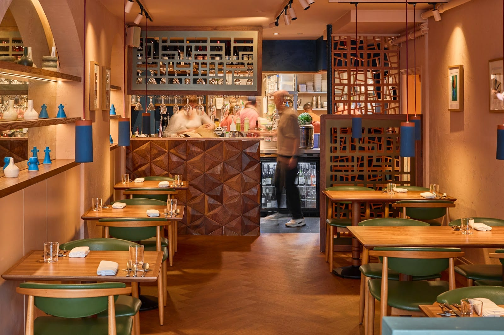
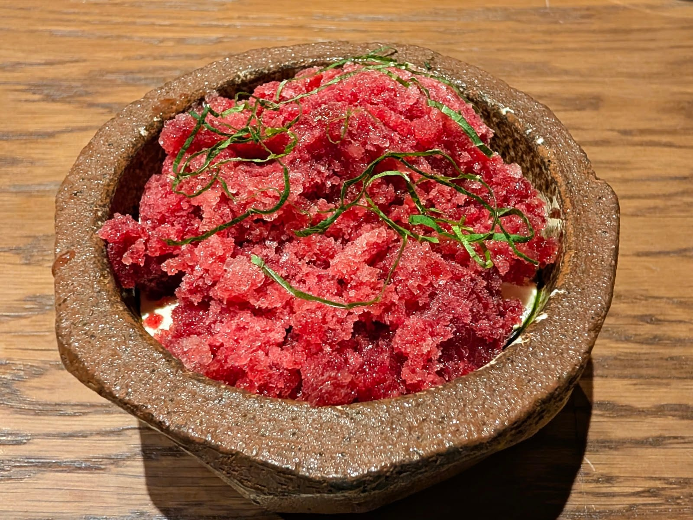
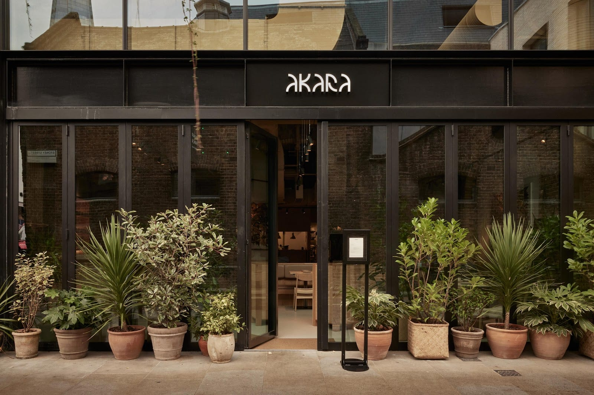
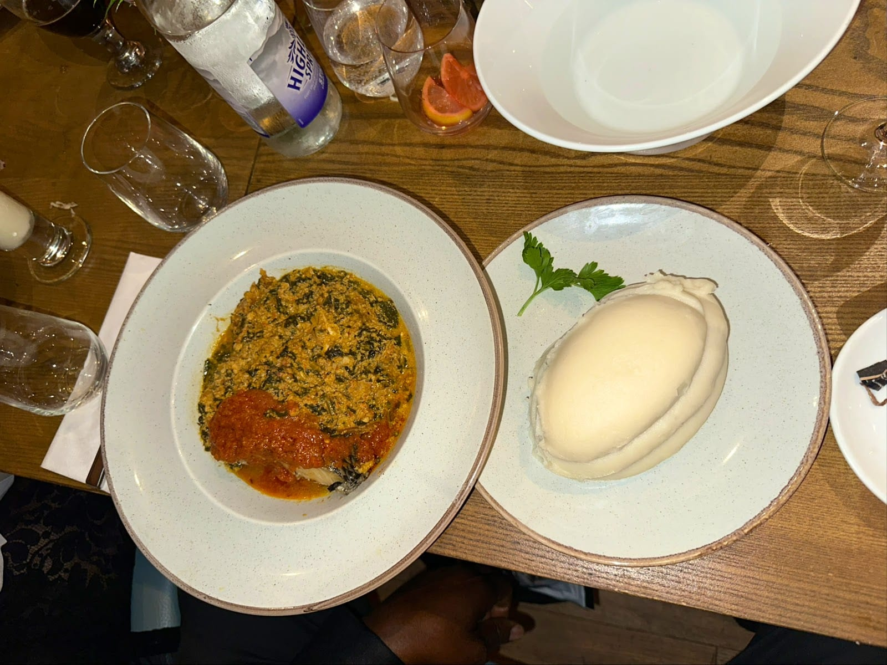
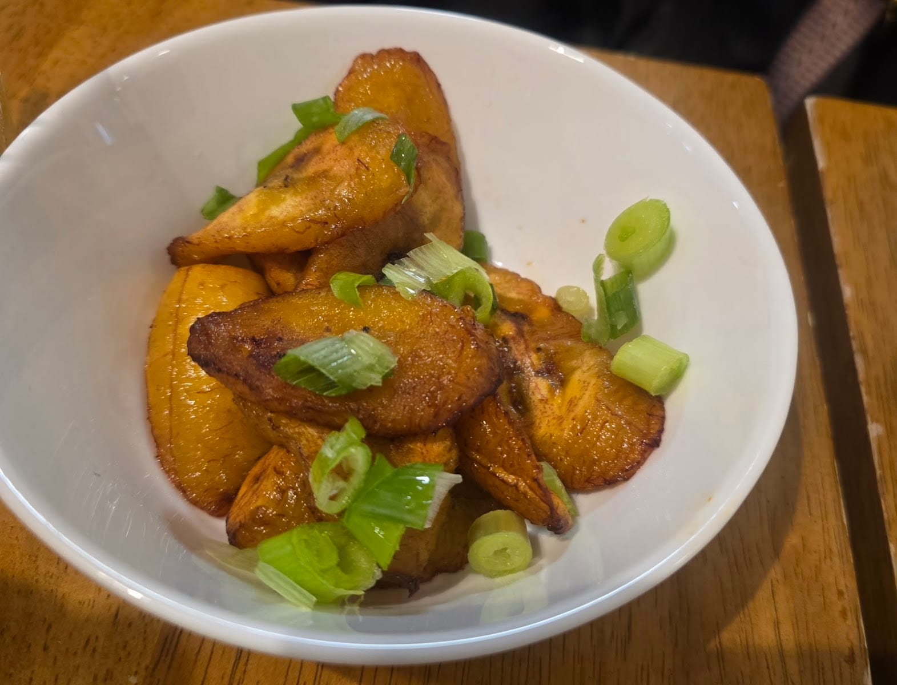
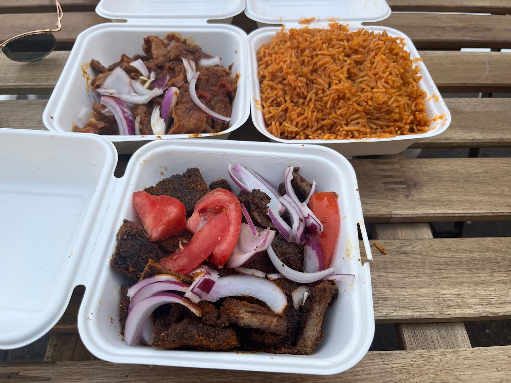

**Michelin's African selection for Greater London contains three restaurants and every one of them holds a distinction** — two one-stars and a Bib Gourmand in the 2026 guide. Two of the three have the same owner, and all three awards have been made since 2024.

The published lists have followed the stars up and largely stopped there. **What they cover thinly is the part of the scene the stars came out of**: Chishuru began as a three-month pop-up in Brixton Village, won in a cooking competition; The Flygerians started as street food in 2016; Suuyar was a stall on a Peckham street corner before it took a shop. Those are not the humble-origins paragraph of the story. They are still where most of this food is sold.

> 💡 **The Short Version:** **Chishuru** in Fitzrovia holds a Michelin star and its chef took Chef of the Year at the 2024 National Restaurant Awards. **Akoko**, four streets away, holds a star too. **Akara** in Borough Yards took a Bib Gourmand in the 2026 guide and is the one to book if a tasting menu is more evening than you want. For Ghanaian, **Waakye Joint** in Tottenham; for Ivorian, **Sikatiô** in Brockley, which a ranked London-wide list puts at number 34 in the city. Cheapest serious plate on this page: **Bola Cuisine** in New Cross, under a tenner.

> 📊 **The evidence behind this guide.**
> Nothing here rests on one visit. This pass reads **15 independent sources carrying 115 citations** across **43 named venues**, and **24 venues are named by two or more independent sources. Five carry a dated award.**
> **Built on:** four judged bodies — the Michelin Guide, the National Restaurant Awards, The Good Food Guide and The World's 50 Best — four editorial mastheads, three independent London publications and four YouTube creators, counted per creator, so a channel's six videos are one voice.
> *Evidence built 22 September 2026 · [How we rank →](/how-we-rank/)*

## Where they are

| If you are near… | Where to eat |
| --- | --- |
| **Fitzrovia** | Akoko, Chishuru |
| **Borough & London Bridge** | Akara |
| **The Strand** | Ikoyi |
| **St James's** | Papa L's Kitchen |
| **Peckham** | Alhaji Suya, The Flygerians, Lolak Afrique, Mingles, Suuyar, Wazobia |
| **Old Kent Road & Bermondsey** | 805, 19FiftySeven, Presidential Suya |
| **New Cross** | Bola Cuisine, Papi's Grill |
| **Brockley** | Sikatiô |
| **Brixton** | Enish, Sato's Kitchen, Asafo |
| **Tottenham** | Chuku's, Waakye Joint, Uncle John's Bakery |
| **Dalston & Haggerston** | Aso Rock, Lekki |
| **Homerton** | Eko Bar |
| **Plaistow & Plumstead** | Kate's Cafe, Angels Bakery |
| **Waterloo** | Naija High Street |
| **Elephant & Castle and Walworth** | Safna Kitchen, Eazy Kitchen |
| **Islington** | Walfathou Kitchen |
| **West Kensington** | Pitanga |
| **Cricklewood & Streatham** | Demi's |
| **Beckenham** | Kneluchii |

**Price guide:** **£** under £20 a head · **££** £20–£45 · **£££** £50–£150 · **££££** £300+.

---

## The winners

**These are the three restaurants Michelin classifies as African in Greater London, and there is no fourth.** Chishuru and Akoko hold a star each in the 2026 guide; Akara holds a Bib Gourmand, the inspectors' good-value award. Akoko and Akara belong to the same founder, Aji Akokomi.

The sources split almost exactly between the top two — ten independent sources name Chishuru, ten name Akoko. Both kitchens took a chef award at the 2024 National Restaurant Awards, voted by an academy of more than 200 chefs, restaurateurs and food writers, and **Chishuru took the more senior one**: Adejoké Bakare was Chef of the Year, while Akoko's then head chef Ayo Adeyemi was Chef to Watch. Akoko is the older room with the longer tasting menu; Chishuru is the one the jury put first.

### Chishuru, Fitzrovia — a competition prize that became a Michelin star

*£££ · 3 Great Titchfield Street, W1W 8AX · Cited by 10 sources · One Michelin star, 2026 guide · #77 of 100, National Restaurant Awards 2026 · [book a table](https://www.chishuru.com/reservations)*

In 2019 **Adejoké Bakare's friends entered her for the Brixton Kitchen competition**, whose prize was a three-month pop-up in Brixton Village. She won the amateur category, opened the pop-up in September 2020, moved to Fitzrovia in September 2023, and was awarded a Michelin star on 5 February 2024 — the first Black woman in the United Kingdom to hold one.

*Set menu only, at both sittings: £55 at lunch and £105 at dinner, with a £65 pre-theatre menu bookable between 5.30pm and 6pm.*

The kitchen cooks across three Nigerian traditions, Yoruba, Igbo and Hausa, and the restaurant's own description is "a modern west African restaurant" rather than a Nigerian one. Set menu only: **sinasir**, a fermented rice cake, under butternut squash purée; **àsáró**, a creamy yam and sweet potato porridge, with smoked eel; **mọ́ínmọ́ín**, a steamed black-eyed bean cake, salted with cured trout; a spiral of cabbage slathered in egusi. The name is a Hausa phrase for the silence that falls over a table when the food arrives.

Tables are inscribed with Nsibidi, the ideographic script of southeastern Nigeria, and the wine list is entirely French. **Lunch is £55 a head and dinner £105, set menu only both times**, with a £65 pre-theatre menu bookable between 5.30pm and 6pm. There are dietary requirements the kitchen states plainly it cannot work around, so read that page before you book for a group.

### Akoko, Fitzrovia — twelve courses and a hand-washing ritual

*£££ · 21 Berners Street, W1T 3LP · Cited by 10 sources · One Michelin star, 2026 guide · #52 of 100, National Restaurant Awards 2025 · [book a table](https://www.sevenrooms.com/reservations/akoko)*

**Aji Akokomi's restaurant took its Michelin star in 2024 and holds it in the 2026 guide**, and its then head chef Ayo Adeyemi took Chef to Watch at the 2024 National Restaurant Awards. The name means first, or time, in Yoruba. Michelin's inspectors quote Akokomi on what the place is for: "We aim to prove that West African cuisine deserves its place in fine dining by highlighting its unique flavours and culinary traditions on its own terms."

*Twelve courses drawing on Nigeria, Ghana, Senegal and The Gambia rather than one of them. £130 at lunch and dinner and about two and a half hours; a shorter lunch menu is £65.*

The tasting menu draws on Nigeria, Ghana, Senegal and The Gambia rather than one of them. **Tatale** — a pancake made from over-ripe plantain and warm Ghanaian spices — arrives with goat cashew cream and caviar; **ọ̀jọ̀jọ̀**, a water yam fritter, carries baobab and yaji; there is a version of **ebunuebunu**, the green seafood soup of Ghana's Akan communities, with ribbons of squid. Dessert is ice cream scented with **uda**, grains of selim, a spice that tastes somewhere between smoke and black pepper.

The room is pastel and quiet with an open kitchen and a counter, and the meal opens with a scented hand-washing. **The full tasting menu is £130 at lunch and dinner and takes two and a half hours; a shorter lunch menu is £65.** The kitchen publishes a list of allergies it cannot accommodate — tomato, allium, ginger, coconut milk, bell pepper, shiitake, soy and chilli among them — which is unusual enough to check before booking.

### Akara, Borough Yards — the fritter the Atlantic carried, at a third of the price

*££ · Arch 208, 18 Stoney Street, SE1 9AD · Cited by 9 sources · Michelin Bib Gourmand, 2026 guide · [book a table](https://www.sevenrooms.com/reservations/akara)*

**Aji Akokomi's second restaurant, open since September 2023, and it took a Bib Gourmand in the 2026 guide** — the award Michelin gives for good cooking at a fair price, which is a different and in some ways harder thing than a star. Choose it over Akoko if a tasting menu is more evening than you want.

*Arch 208 is on the Stoney Street side of Borough Yards. Behind the folding doors it is a railway arch with a long counter facing the open kitchen, and the counter is the seat to ask for.*

It is built around **akara**: a black-eyed bean fritter, crisp outside and cotton-loose inside, that travelled with enslaved West Africans to Brazil and is eaten there as acarajé. The kitchen serves both lineages at once, which is why Michelin files its cuisine as African and Brazilian.

Order more than one filling — BBQ tiger prawn, crab kulikuli, and a vegan BBQ celeriac that is not a consolation. Then **efik rice**, a coconut-scented rice from southeastern Nigeria and western Cameroon, **short rib suya** with a nutty yaji crumb, and **lamb fataya**, the Senegalese pastry, under a squid-ink yassa sauce. Drink a Chapman, the Nigerian punch.

A railway arch with blond wood, a long counter facing the open kitchen and a rainbow of artwork on the walls. Michelin's inspectors mark it good for solo dining, and the counter is the seat to ask for. The same allergy restrictions as Akoko apply.

---

## Ikoyi, and what its two stars are actually for

*££££ · 180 Strand, WC2R 1EA · Cited by 8 sources · Two Michelin stars, 2026 guide · #24 of 100, National Restaurant Awards 2026 · #15, The World's 50 Best Restaurants 2025 · [the restaurant's site](https://ikoyilondon.com/)*

It is named after a district of Lagos, eight of the fifteen sources here name it, and it is the most decorated restaurant on this page — so leaving it out would be a fiction. It is also **not in Michelin's African selection: the 2026 guide gives its cuisine as "Creative"**, and the three restaurants Michelin does file as African in London are the three above.

*The tasting menu is £395, with a shorter one at £180. Reservations open on the 1st of each month at noon, two months ahead, and go the same day.*

Everyone close to it says the same thing. Ikoyi's own website describes "spice-based cuisine around British micro-seasonality" and never uses the words West African. Time Out's entry says "it isn't quite a West African restaurant". The World's 50 Best calls the cooking "category-free". Vittles is blunter: Jeremy Chan and Iré Hassan-Odukale, it writes, "managed to kid themselves — or kid their PR — that they were opening a West African restaurant" in 2017, and the Strand room "has given up the pretence of being tied to any one region of Earth".

What survives of the original idea is the best-known dish in the building: **smoked jollof rice**, on the menu in some form since the start, arriving late in the meal rather than as a centrepiece. Around it is food from nowhere in particular — dried citrus, squid worked into marshmallow, Scotch bonnet in the puddings.

It won the Highest Climber Award at the 2025 World's 50 Best and sits 15th on that list. **The tasting menu is £395, with a shorter one at £180. Reservations open on the 1st of each month at noon, two months ahead**, and that is the only realistic way in. Go for Chan's cooking; do not go expecting the food in the rest of this guide.

---

## Also strongly backed

### Chuku's, Tottenham — Nigerian small plates, and a brunch that outsells the dinner

*££ · 274 High Road, N15 4AJ · Cited by 7 sources · [book a table](https://www.chukuslondon.co.uk/nigerian-tapas-restaurant-bookings)*

Run by **siblings Ifeyinwa and Emeka Frederick** and billed as the world's first Nigerian tapas restaurant — small plates in a cuisine where everybody normally guards their own bowl. The Good Food Guide named it in **Best Local Restaurants in London 2025**, and Grace Dent has called it a tiny slice of sleek, contemporary Lagos.

*Pounded yam is boiled yam beaten smooth; you pinch a piece off and use it to scoop the stew. Closed Mondays, and Tuesday to Friday it opens at 5.30pm for dinner only.*

**Jollof quinoa**, plantain waffles, suya-spiced meatballs, **ojojo** (yam croquettes) and **sticky zobo wings**, glazed with the hibiscus-and-citrus drink Nigerians drink cold. The tricoloured egusi bowl takes the stew apart and rebuilds it as a shareable vegan dish. Finish with chin chin cheesecake, built on the deep-fried snack.

Two minutes from Seven Sisters on the Victoria line. **Closed Mondays, and dinner only from Tuesday to Friday** — it opens at 5.30pm. Weekends run from noon, and the Saturday and Sunday brunch of three sharing dishes and drinks is the busiest service of the week.

### 805, Old Kent Road — the Nigerian institution, open since 2001

*££ · 805 Old Kent Road, SE15 1DZ · Cited by 5 sources · [the restaurant's site](https://www.805restaurants.com/)*

The oldest name on this page and the one south London Nigerian families have been marking occasions in for a quarter of a century, with further London sites at Hyde Park and Hendon. The Infatuation calls it a pioneer of British West African fine dining; Olive's writer remembers being taken there in a gingham school dress.

*This is how the leaf stews arrive — the stew in one dish, the pounded yam in another, to tear and dip by hand. 805 takes walk-ins as well as bookings, which almost nothing else at this price does.*

The signature is **monika fish**, crisp-skinned and fierce with Scotch bonnet. Beyond it, **efo riro** — a spinach stew loaded with pepper sauce, goat, crayfish and iru, fermented locust bean — with pounded yam to tear and dip, **edikaikong**, and coconut fried rice. Lamb suya as a starter.

Polished plates, smart service and music loud enough to carry a table of twelve. **It takes walk-ins and bookings both**, which almost nothing else at this price does, and it runs late.

### The Flygerians, Peckham — street food that stayed in the neighbourhood

*£ · 14 Bournemouth Close, Peckham Palms, SE15 4PB · Cited by 4 sources · [the restaurant's site](https://theflygerians.com/)*

**Sisters Jess and Jo Edun** learned to cook from their grandmother, began trading street food in 2016 and now run a small bar inside **Peckham Palms**, the hair and beauty hub built to rehouse Black-owned businesses displaced by the station redevelopment.

*Plantain fried until the sugars catch at the cut edges. It comes on the jollof plate and in the gizdodo, with gizzard and sweet pepper, at £6.50.*

The **2 Fly Chicks Plate** is the order — two pieces of chicken in Mama's Forbidden Sauce, a sweet smoky red marinade, with jollof and plantain, £17.50. Jollof on its own is £9.50, gizdodo (gizzard with sweet pepper and plantain) £6.50, and there is a **Naija fish and chips**: battered red bream with cassava chips and hot sauce, £13.50. Sweet agege bread comes toasted with garlic butter.

Halal, with vegan options. **Closed Mondays, and it does not open until 1pm** any day of the week; Saturdays run to 11pm with a DJ.

### Sikatiô, Brockley — Ivorian, and ranked 34th in the city

*££ · 5 Brockley Cross, SE4 2AB · Cited by 4 sources · #34 of 99, The Vittles 99, 2025*

**Lynda Beble and Brice Assemian opened it in November 2022** after selling frozen sauce gombo and kedjenou out of Akwaba Market, their Ivorian grocery in Deptford — which is also how they get their ingredients. Jonathan Nunn's ranked ninety-nine puts it 34th in London and says a restaurant this accomplished "should, by rights, be in Paris". Olive's writer is more direct about why you would travel for it: "There aren't many places to dig into Ivorian cuisine in London."

*Attiéké is cassava fermented, grated and steamed until it eats like a fluffy couscous, and it is the side to order with the fish. The plates are built for sharing rather than for one.*

The dish is the **soupe du pêcheur**, a fisherman's soup of gently poached fish, crab and prawn served in an Asanka earthenware grinder, and after that the **croaker**, deep-fried in what Vittles calls a chainmail of crispy skin. **Choukouya** is on-bone lamb smoked through to the marrow. Sides are Ivorian: **attiéké**, a fluffy cassava couscous, **abolo**, faintly sweet steamed rice cakes, and alloco, ripe fried plantain. Drink bissap, the hibiscus infusion.

A small, casual neighbourhood room a minute from Brockley station, and the plates are built for sharing rather than for one. Come hungry and come in a pair at least.

### Pitanga, West Kensington — Nigerian food with a twist, since 2018

*££ · 220 North End Road, W14 9NX · Cited by 4 sources · [the restaurant's site](https://www.pitangalondon.com/)*

Opened on 31 May 2018 by **Nky Iweka**, who bills herself Executive Mamaput after the roadside cooks of Lagos, and it is the westernmost entry in this guide — everything else is central, south or north-east. The menu is built to be navigable by people who have never eaten Nigerian food, without thinning it: shredded stockfish stew and goat suya sit next to a Taste of Nigeria set menu.

Vegan, vegetarian and gluten-free versions run right through the list rather than being appended. The Lagos Jump Salad is the dish the restaurant is known for.

A small, quiet dining room rather than a lounge, which sets it apart from most of the Nigerian rooms on this page. **Bookable, and worth booking** — it seats few.

---

## By country, because they are not one cuisine

Jollof and fried plantain are on nearly every menu here, which is exactly why the shopfronts are hard to read from the pavement. The differences are elsewhere, and the writers who know this food sort by country rather than by continent — Time Out's title promises Ghana, The Gambia and Ivory Coast by name.

### Nigerian

**Aso Rock** in Dalston (10 Bradbury Street, N16 8JN, [its site](https://www.asorockfood.com/)) is the one to know for **ayamase**, the stew of green peppers, habanero, onion and iru fried in bleached palm oil that Felicia Ajibabi Adesina created in the town of Ikenne. The Adesina family have run it for decades; it started as a takeaway counter and now has a small neon-lit bar to drink a Guinness at while you wait. *Cited by 2 sources.*

**Eko Bar & Restaurant** (245 Wick Road, Homerton, E9 5DG) is a Nigerian lounge that does not wake up until late — a live band plays funk versions of afrobeats on Fridays, the asun goat arrives chewy and hot, and there is imported palm wine. *Cited by 1 source.*

**Lekki** (323 Kingsland Road, Haggerston, E8 4DL) is the soup restaurant: egusi to finish with your hands once the pounded yam has gone, and Nigerian pies at lunchtime that are Cornish pasties with the seasoning changed. *Cited by 1 source.*

**Enish** ([its site](https://enishglobal.com/)) is the chain, with a Brixton site at 330A Coldharbour Lane and others at Finchley Road, Oxford Street and Covent Garden. Go for the things the smaller kitchens do not carry: **isiewu**, a spiced goat's-head stew from eastern Nigeria, and pomo, cow skin. Resident DJs, and most branches run late. *Cited by 3 sources.*

**Demi's** (89 Cricklewood Broadway, NW2 3JG, and Streatham) is where to eat southeastern Nigerian dishes that barely appear elsewhere in London — **ofe nsala**, a pale peppery catfish broth thickened with puna yam, and **oha**, made with a bitter leaf and cocoyam. *Cited by 2 sources.*

**Kneluchii** in Beckenham is the smart Nigerian room the outer south-east did not used to have: asun, dun dun (fried yam blocks with a sweet pepper relish), and **banga**, the Niger Delta sauce made from palm fruit. *Cited by 1 source.*

**Papi's Grill** in New Cross ([its site](https://www.papisgrill.co.uk/)) is a charcoal operation — asun, tozo beef under suya powder, and a £70 seafood feast for two. **Book the bottomless brunch a fortnight out.** *Cited by 2 sources.*

### Ghanaian

**Waakye Joint** (80A West Green Road, Tottenham, N15 5NS, and Streatham High Road) is the one to send people to. **Waakye** is rice and black-eyed beans steamed with dried sorghum leaves until both turn red-brown, and it comes as a full plate: salad, noodles, boiled egg, fried fish and **shito**, the Ghanaian chilli sauce made with dried fish and prawn. Order **tofi** — deep-fried turkey tails — with yam fries alongside. A hot counter rather than a dining room, and the waits are long. *Cited by 3 sources.*

*The plate is built at the counter from trays like these, which is why the queue is long but keeps moving. Under a tenner, and enough of it to skip dinner.*

**Kate's Cafe** in Plaistow is the home-kitchen one: grilled fish with omo tuo, pounded yam, banku and kenkey, and stews to put them in — **nkatenkwan**, thick with peanut, and abenkwan, made from palm fruit. Its founder Kate has died and her family are running it on. *Cited by 2 sources.*

**19FiftySeven** on the Old Kent Road ([book a table](https://19fiftyseven.co.uk/dine-with-us/)) is named for the year Ghana became the first sub-Saharan country to gain independence. The groundnut soup with **omo tuo**, sticky rice balls, comes in a clay pot; **kelewele** is very ripe plantain fried with cloves, cayenne and calabash nutmeg. Soap and water arrive at the table. **Dinner Wednesday to Saturday, plus lunch and dinner on Sunday — that is the whole week.** *Cited by 3 sources.*

**Uncle John's Bakery** in Tottenham has been going since **John and Emelia Mensah set it up in 1995**: bouncy sweet bread, warm bofrot doughnuts, bags of savoury chin chin cracked with black pepper, and hot meat and fish pies heated to order. *Cited by 1 source.*

**Asafo** (60 Morrish Road, Brixton Hill, SW2 4EG) is small, family-run and the place to eat fried yam and plantain with chofi, or waakye south of the river. *Cited by 1 source.*

### Ivorian

**Sikatiô** in Brockley, above, is the one address, and it is the highest-placed West African restaurant on the only ranked London-wide list in this guide. Its owners also run **Akwaba Market** in Deptford, which is where to buy attiéké and sauce graine to cook at home.

### Senegalese and Gambian

The Senegambian kitchens are scattered and none of them is central, which is why they go missing from the round-ups.

**Safna Kitchen** at Elephant and Castle does **ebbeh** — boiled cassava with prawn and crab in a tangy sauce made with unrefined red palm oil — and **domoda**, the Gambian peanut stew, alongside jollof platters with grilled meat. Ask for wonjo, the Gambian hibiscus drink. *Cited by 1 source.*

**Walfathou Kitchen** in Islington is family-run and serves **dahen**, rice cooked in a buttery peanut and tomato sauce, and **chura gerteh**, a sweet rice-and-peanut porridge cut with yoghurt. *Cited by 1 source.*

**Eazy Kitchen** (302 Walworth Road, SE17 2TE) is the Gambian grill: barbecued and charcoal-cooked plates, and set up for takeaway as much as sitting down. *Cited by 1 source.*

**Papa L's Kitchen** (16–17 Jermyn Street, SW1Y 6LT) is the only West African dining room in St James's. Lawrence Gomez cooks Gambian-rooted food after stints at The Ivy and Sexy Fish — **benachin**, the country's one-pot rice, tempura okra, warm coco bread, grilled tiger prawns — and rotates sixteen dishes every quarter. There is a pre-theatre deal, Wednesday to Saturday between 5pm and 6.30pm. *Cited by 2 sources.*

### Sierra Leonean

**Mingles** (18 Choumert Road, Peckham, SE15 4SE) cooks Sierra Leonean, which almost nowhere in London does. **Plasas** is the dish — cassava leaf pounded and cooked down with palm oil and fish or meat — with rice, jollof and fried fish alongside. A small room on a street of Nigerian kitchens. *Cited by 1 source.*

---

## Cheapest

The cheap end of this cuisine is genuinely cheap, and it is mostly nowhere near zone 1.

* **Bola Cuisine**, 328 New Cross Road, SE14 6AG — there is a menu, but the actual system is that you ask for a combination and a price is agreed. Plantain, cassava, egusi, puff puff, and **change from a tenner or even a fiver**. Room for about six people, so eat elsewhere. *Cited by 1 source.*
* **Angels Bakery**, 136 Plumstead High Street, SE18 1JQ — a bakery that also does jollof and grilled suya, and both are better than they need to be. Sweet bread spooned with shito is the snack. *Cited by 1 source.*
* **The Flygerians**, Peckham — jollof £9.50, gizdodo £6.50, three wings £5. *Cited by 4 sources.*
* **Lolak Afrique**, 38–40 Choumert Road, Peckham, SE15 4SE — counter-order Nigerian bukka food. Get the **abula**: ewedu, a leafy green; gbegiri, blended beans, sweet and yellow; and a red tomato stew, all three on one plate. *Cited by 2 sources.*
* **Waakye Joint**, Tottenham and Streatham — the full waakye plate, under a tenner, and enough of it to skip dinner. *Cited by 3 sources.*
* **Uncle John's Bakery**, Tottenham — bofrot, chin chin and a fish pie for the price of a coffee. *Cited by 1 source.*

## Quickest

Counters, stalls and takeaway operations where you are out inside fifteen minutes.

* **Alhaji Suya**, 15 Peckham Park Road, SE15 6TR — suya wrapped and handed over, with branches in Greenwich, Brixton and Walworth. The yaji is imported from Kano state, where the owner is from. **One thing to know before travelling for it:** Vittles reports that the shop burned down and reopened without its live fire grill. *Cited by 2 sources.*
* **Naija High Street**, Lower Marsh Market, Waterloo, SE1 7AB — grilled chicken or fish, or beef stew, in a tray with jollof, beans, plantain and egusi. **The sides are all vegan**, and it is five minutes from Waterloo station, which nothing else here is. *Cited by 2 sources.*
* **Bola Cuisine**, New Cross — boxed up from the pot in a couple of minutes. *Cited by 1 source.*
* **Aso Rock**, Dalston — began as a takeaway and still works best as one. *Cited by 2 sources.*
* **Angels Bakery**, Plumstead — pies, bread and a hot counter. *Cited by 1 source.*

---

## Market stalls and counters

This is the part the restaurant lists undersell, and on this subject it is not a footnote. **Three of the best-known West African kitchens in London started on a stall.** Chishuru's Michelin star began with a three-month pop-up in Brixton Village won in a competition. The Flygerians traded street food and pop-ups for years before taking a unit in Peckham Palms. **Suuyar** ran a stall on the corner of Choumert Road and Rye Lane, where Kolawole Ajayi handed out tasters and filmed himself serving customers, and now has a shop at the tip of Peckham Rye doing an all-you-can-eat suya buffet.

*Suya is thin beef grilled over fire and dusted in yaji, a spice of ground peanut and chilli, with raw onion and tomato piled on top. Jollof comes in its own box.*

Named traders only — the halls are not the recommendation.

* **Naija High Street**, Lower Marsh Market, Waterloo. Run by Sisi Olonje as a weekday lunch stall; most of the queue is office workers who are not Nigerian. *Cited by 2 sources.*
* **Suuyar**, Peckham. The buffet is the draw and the suya is the reason it exists. *Cited by 2 sources.*
* **The Flygerians**, inside Peckham Palms on Bournemouth Close. *Cited by 4 sources.*
* **KayBizz Dishes**, Peckham. People travel for the abula and its signature "1960s stew". *Cited by 1 source.*
* **D&K Gambian Roast Chicken and Rice**, Forest Gate Market, E7. Roast chicken and rice cooked to order at a stall, and the east London end of the Senegambian scene. *Cited by 1 source.*

**Peckham is the centre of this, and Choumert Road is the street.** Lolak Afrique at 38–40 does Nigerian bukka food and Mingles at 18 does Sierra Leonean; Alhaji Suya is round the corner on Peckham Park Road, and Wazobia has been on Rye Lane since 1994. The [Peckham area guide](/articles/peckham-area-guide/) covers the grocers, butchers and the sixty-unit indoor market the cooking comes out of. Southwark also runs street-market pitches on Choumert Road and the roads off Rye Lane, and publishes no trading days for any of them, so treat those as luck.

Brixton is the other cluster — Enish on Coldharbour Lane, Sato's Kitchen, an Alhaji Suya branch, Asafo up on Brixton Hill — and it is where Chishuru started. Deptford's contribution is a shop rather than a kitchen: **Akwaba Market**, the Ivorian grocery whose owners went on to open Sikatiô, and still the supply line behind it.

---

## Recently opened

**Suuyar** has moved from a Peckham street corner into a shop at the tip of Peckham Rye, and the suya buffet came with it. **Sato's Kitchen** is a new Nigerian halal kitchen in Brixton run by an owner called Agatha, and the only people who have written it up are two YouTube creators. **Akara** is the most recent of the dining rooms, open since September 2023 and already holding a Bib Gourmand. And **Gold Coast** does a £35 all-you-can-eat Ghanaian buffet, which is a format nothing else on this page attempts.

---

## Booking

* **Weeks ahead:** Ikoyi, where reservations open on the 1st of each month at noon and are gone the same day. Chishuru and Akoko at weekends.
* **A few days:** Akara, Chuku's, Pitanga, Sikatiô, Papa L's Kitchen. Papi's Grill wants a fortnight for the bottomless brunch specifically.
* **Bookable but rarely needed:** 805, Enish, Aso Rock, Eko Bar, 19FiftySeven.
* **Walk in:** Bola Cuisine, Angels Bakery, Waakye Joint, Alhaji Suya, Naija High Street, Uncle John's Bakery, Lolak Afrique. None takes reservations. Waakye Joint is the one with a real queue, and it is a counter queue rather than a door queue — long but moving.
* **Check the day, not the hour.** More kitchens here close two days a week than open seven. 19FiftySeven serves Wednesday to Sunday only; Chuku's is shut Mondays and does not open until 5.30pm from Tuesday to Friday; The Flygerians is shut Mondays and never opens before 1pm.

---

## Continue planning your London trip

- 🍽️ **[Eat in London: Restaurants, Food Markets & Quick Food Hub](/articles/eat-in-london-guide/)**
- 🌴 **[The Best Caribbean Restaurants in London](/articles/best-caribbean-restaurants-london/)** — the other side of London's Black food scene, and it overlaps in Peckham and Brixton
- 🥘 **[The Best Street Food in London](/articles/best-street-food-london/)** — every multi-trader market and food hall, compared on traders, seating and which days they exist
- 💷 **[Cheap Eats in London](/articles/cheap-eats-london/)** — the same under-£15 territory across every other cuisine
- 🍗 **[The Best Fried Chicken in London](/articles/best-fried-chicken-london/)**
- 🕌 **[The Best Halal Restaurants in London](/articles/best-halal-restaurants-london/)** — several kitchens on this page are halal
- 🎨 **[Peckham Area Guide](/articles/peckham-area-guide/)**
- 🏛️ **[Fitzrovia Area Guide](/articles/fitzrovia-area-guide/)** — Akoko and Chishuru are four streets apart in it

*Evidence built 22 September 2026 from fifteen independent sources. Prices and set-menu costs are from each restaurant's own site as read on that date. Stalls and takeaway counters change hours more often than restaurants do — check before travelling.*
