Wetherspoons gets dismissed as just the cheap option, which undersells what's actually going on. It is a 45-year-old, FTSE 250-listed pub company that has spent decades buying banking halls, ballrooms, cinemas and dock offices that nobody else wanted, keeping the marble and the plasterwork, and putting an £8.68 fried breakfast and a £1.89 bottomless coffee underneath it. Around 90 of its pubs are in Greater London, from a 1913 bank headquarters in the City to a unit in the Paddington Basin development that opened barely a year ago.

This is the practical case for the chain first — the real prices, the actual menu, which perks are still genuinely running in 2026 — and then the London branches worth going out of your way for: the six landmark buildings, plus the ones by the mainline stations that don't get written up nearly as often.

> 💡 **The Short Version:** Six branches earn a special trip: **The Crosse Keys** (a marble 1913 banking hall), **Hamilton Hall** (the Great Eastern Hotel's old ballroom, and the chain's first pub in central London), **The Liberty Bounds** (Tower Hill), **The Ledger Building** (Grade I-listed, Canary Wharf), **The Rochester Castle** (Stoke Newington, trading since 1991) and **The Mossy Well** (Muswell Hill). Four more sit inside or beside King's Cross/St Pancras, Euston, Paddington and Waterloo — three of those opened in 2024 or 2025. On price: a pint here runs roughly half what a standard Zone 1 pub charges. The coffee refill is still real, still £1.89, and the twice-yearly beer festival is still running — this autumn's is 7–18 October.

## The practical case

### What it actually costs

Wetherspoon has never published a national price list — every branch sets its own, and even the printed table menus (checked at Hamilton Hall for this guide) list food and coffee prices in full but leave beer, wine and spirits blank, pointing to the app instead. That makes one exact figure impossible to pin down centrally, but the gap itself is well established: a pint of lager or cask ale in an ordinary Zone 1 pub runs **£6 to £8**, and the same drink at a Wetherspoons — or at most pubs in outer London — tends to come in at roughly half that, **around £3 to £4**, moving with the branch the same way any London pub's prices do.

For scale: Wetherspoon's own chairman, Sir Tim Martin, used **£5** as "approximately the average price of a pint these days" in a September 2025 statement reprinted in the company's 2025 annual report. That's a UK-wide figure, not a Wetherspoon one — and it already sits above what most branches in this guide charge.

### The food

The menu doesn't change branch to branch — burgers, curries, jacket potatoes, pub classics — though prices do, by the menu's own small print. At Hamilton Hall's table menu, checked for this guide in September 2026: small plates are **three for £14.99** (three for £12 on Mondays), a burger deal with chips and a drink included runs **£7.99 to £9.49**, a full curry with a drink is **£10.43 to £14.20** depending on the dish and whether the drink is alcoholic, jacket potatoes start at **£6.99**, and an all-day brunch — two eggs, bacon, two sausages, beans, chips — is **£12.17** with a soft drink.

None of that is the reason to go for the cooking, but the standards behind it are checked rather than asserted: a 5-out-of-5 food hygiene rating, the highest rating in the Sustainable Restaurant Association's certification for 2024–2026, 100% UK and Irish beef traceable farm to fork, 100% free-range eggs carrying the British Lion mark and RSPCA-assured, sustainably-sourced cod and haddock, and a children's menu that has won awards through an independently run secret-diner survey.

### The breakfast

Served from opening until 11.30am everywhere, though "opening" moves branch to branch — Hamilton Hall serves from 7am, The Crosse Keys from 8am. The range, at Hamilton Hall's prices: a Small breakfast (egg, bacon, sausage, beans, hash brown) is **£6.13**, the Traditional adds a second hash brown and a slice of toast for **£7.01**, and the Large — two eggs, bacon, two sausages, beans, three hash browns, mushroom, two toast — is **£8.68**. Vegetarian and vegan versions sit in the same band. Eggs Benedict is £7.36, and a breakfast muffin with tea, coffee, hot chocolate or a soft drink included is £6.01.

### The coffee refill

Still real, still current as of the branch menus checked for this guide in September 2026. Tea, coffee and hot chocolate are **£1.89 each**, with free refills all day, every day — decaffeinated tea and coffee are the one exclusion. The coffee is 100% Arabica Lavazza from Rainforest Alliance-certified farms. One catch reported by users of the ordering app: a refill ordered to the table still has to be collected from the counter yourself, not brought over.

### Everything else worth knowing

**The app orders to your table** — food, a round of drinks, or both — and pays by card, Apple Pay, Payit or PayPal, with a reorder function built for buying rounds in a group. It also books Wetherspoon's own hotels (more than 50 of them, 1,329 rooms, across England, Ireland, Scotland and Wales). It carries 1.4 million ratings at 4.7 out of 5 on the App Store.

**There's no loyalty scheme.** The app's own advertised feature list — order, pay, reorder, book a hotel — says nothing about points or rewards, unlike comparable pub-chain apps sold right alongside it in the App Store that lead with the word "Rewards."

**The real ale side is genuine, not assumed.** Wetherspoon ran its first beer festival in 1990 — four days, six beers — and has run one twice a year since; past festivals have featured up to 50 beers, ten of them from overseas. This autumn's runs **Wednesday 7 to Sunday 18 October**, thirty real ales including five international beers, with the first-ever Wetherspoon festival beers from Singapore and Ukraine alongside the usual UK brewers. Separately, **280 Wetherspoon pubs** currently carry CAMRA's own acclaim for the quality of their real ale, and the group holds Cask Marque accreditation.

**Prices are not the same everywhere.** That includes the six branches below — a City pint and a Muswell Hill pint are not the same number, and neither is published online. Check the app once you're inside, not before.

## Six branches built into something else

| Branch | Area | Building's earlier life | Wetherspoon since |
| --- | --- | --- | --- |
| **The Crosse Keys** | City, EC3V 0DR | HQ of the Hongkong and Shanghai Banking Corporation, opened 1913 | 1999 |
| **Hamilton Hall** | Liverpool Street station, EC2M 7PY | Ballroom of the Great Eastern Hotel; Grade II listed | 1991 — the chain's first pub in central London and at a station |
| **The Liberty Bounds** | Tower Hill, EC3N 4AA | Just outside the City's old "liberty" boundary, by the Tower Hill scaffold site | 1999 |
| **The Ledger Building** | West India Quay, Canary Wharf, E14 4AL | c.1800 dock office that held the West India Docks' ledgers; Grade I listed | 2001 |
| **The Rochester Castle** | Stoke Newington, N16 0NY | Rebuilt 1801 on a site trading as The Green Dragon since at least 1702 | 1991 |
| **The Mossy Well** | Muswell Hill, N10 3SH | An Express Dairy tea room from 1900, later licensed premises | 2015 |

### The Crosse Keys, City of London

*9 Gracechurch Street, EC3V 0DR · opens 8am weekdays, closes 11pm (midnight Fri) · under-18s 8am–9pm only*

The former headquarters of the Hongkong and Shanghai Banking Corporation, designed by W Campbell Jones and opened for business on 22 October 1913 — marble columns, a glass-domed ceiling, and a banking hall running the length of the room. Wetherspoon has traded here since 1999. The name is older than the building: an inn called The Crosse Keys stood nearby from the 16th century, licensed for plays performed by the Queen's Men, and was a busy coaching inn by the early 1800s.

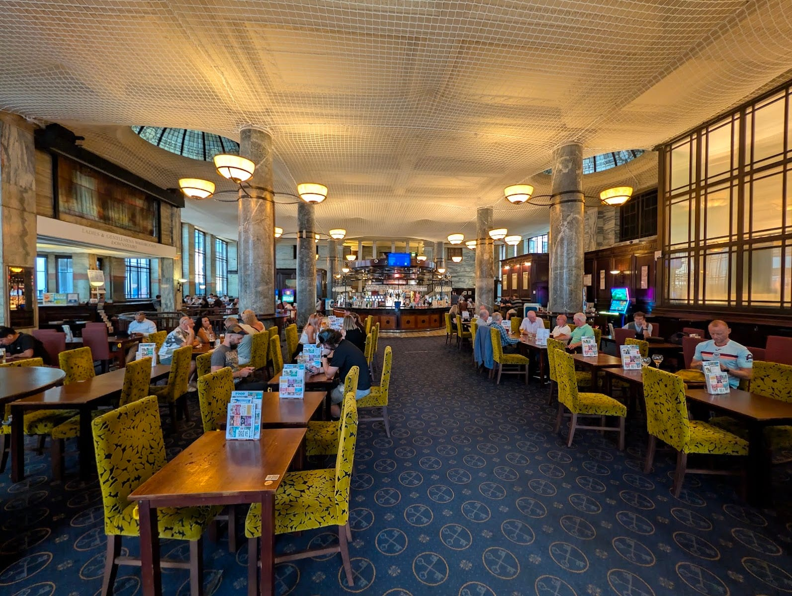

*The banking hall itself — marble columns down the room and a glass dome overhead, at Wetherspoon prices since 1999.*

### Hamilton Hall, Liverpool Street

*Street-level concourse, Liverpool Street station, EC2M 7PY · opens 7am Mon–Sat, 9am Sun, closes 11.30pm (10.30pm Sun)*

The former ballroom of the Great Eastern Hotel, named after Lord Claud Hamilton, chairman of the Great Eastern Railway from 1893 to 1923 — gilded plasterwork, chandeliers and cornicing kept intact under a Grade II listing. It opened as a Wetherspoons on 6 December 1991, and it matters more than the average branch for one reason: it was **the company's first pub in central London, and its first inside a train station**, a format the chain has since repeated at four more mainline termini (below). CAMRA records around ten handpumps on the bar.

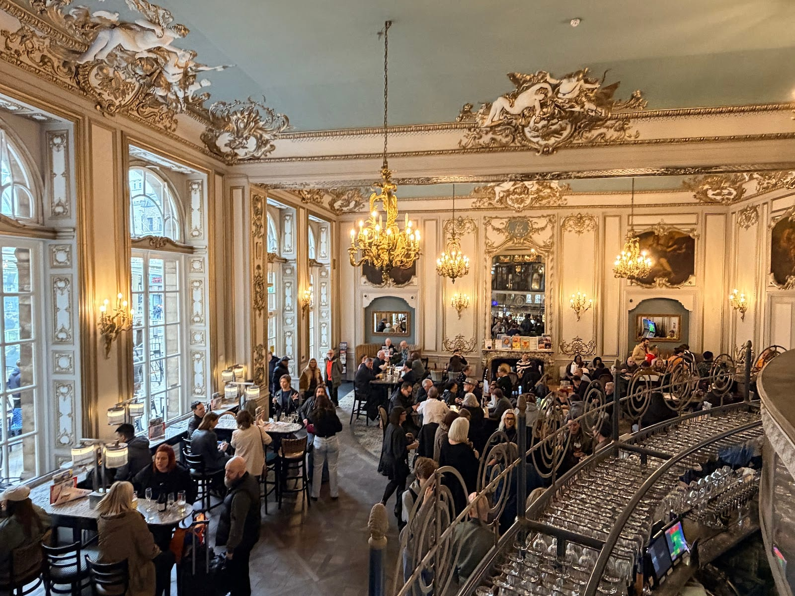

*The Great Eastern Hotel's old ballroom — gilded plasterwork and chandeliers, and the chain's first pub in central London.*

### The Liberty Bounds, Tower Hill

*15 Trinity Square, EC3N 4AA · closes midnight*

Named for its position just outside the old boundary, or "liberty," that the City of London once controlled from this point — and standing close to the site of the Tower Hill scaffold, where prisoners from the Tower met their end through the 16th and 17th centuries. Wetherspoon has run it since 1999. It's the one branch here without a distinct building story of its own — but a useful stop regardless: breakfast runs until noon, with free refills on tea and Lavazza coffee all day.

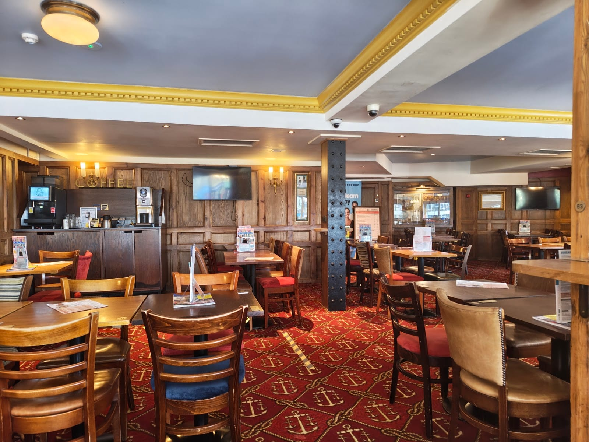

*Free refills on tea and Lavazza coffee all day — the one thing this branch is known for, absent a building story of its own.*

### The Ledger Building, Canary Wharf

*4 Hertsmere Road, West India Quay, E14 4AL · closes 11pm · under-18s 9am–9pm only*

An early-1800s dock building standing at the northwest corner of the old Import Dock, named for its original job storing the ledgers of the West India Docks. CAMRA lists the building Grade I — the highest tier of protection, and a step above the Grade II carried by Hamilton Hall. It's a colonnaded, quayside room that predates every tower around it by close to two centuries, and by some distance the cheapest place to eat or drink at Canary Wharf. Wetherspoon has traded here since 2001.

The Crosse Keys, Hamilton Hall and this one get a fuller architectural write-up in our [historic pubs and dining rooms guide](/articles/historic-pubs-dining-rooms-london/), alongside the free Museum of London Docklands next door.

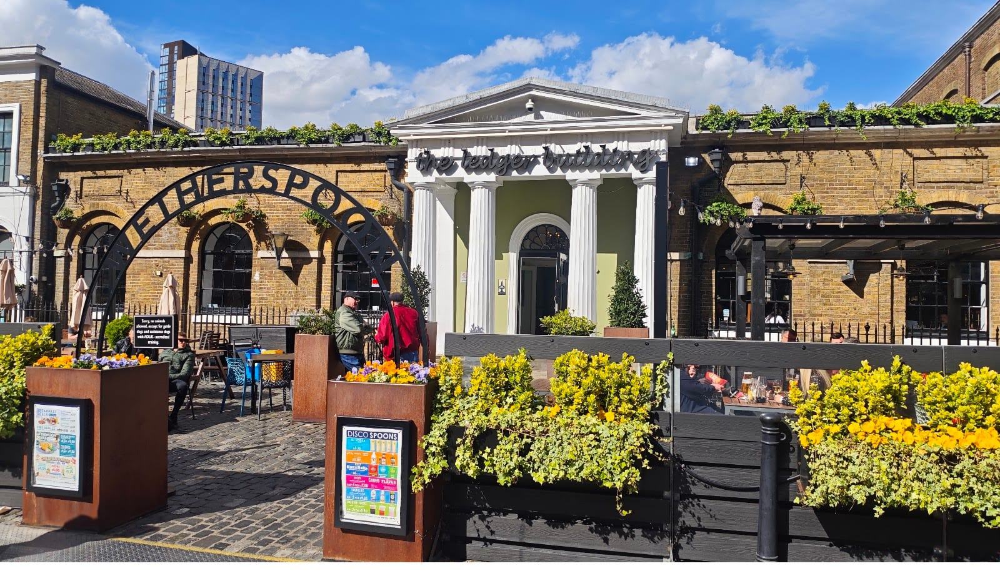

*The colonnaded dock office at West India Quay, predating every tower now built up around it by close to two centuries.*

## Near the mainline stations

Besides Hamilton Hall, above, four more London termini have a Wetherspoons worth knowing about — and three of the four opened in 2024 or 2025.

### The Barrel Vault, King's Cross / St Pancras

*St Pancras International station, N1C 4QP · opened 2018*

St Pancras's train shed sits on a raised iron deck, designed by the engineer William Barlow to clear the natural slope of the land — and the vast undercroft beneath it, supported by hundreds of cast-iron columns, was used historically to store thousands of barrels of Burton beer. That's the name, and it sits inside the station itself, on the King's Cross/St Pancras interchange.

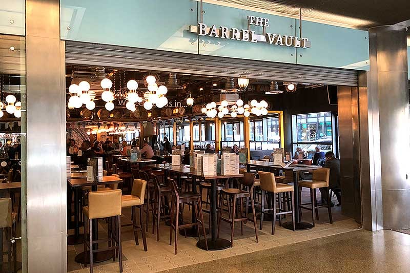

*Barrel-shaped lights over the bar, on the same iron deck where Burton beer barrels were once stored below.*

### The Captain Flinders, Euston

*34–38 Eversholt Street, NW1 1DA · opened February 2024 · closes 10.30pm*

Named for Captain Matthew Flinders, the Royal Navy explorer who led the first circumnavigation of Australia (1801–03) and whose work popularised the country's name. His remains were discovered by archaeologists during the HS2 dig at Euston; a statue of Flinders leaning over a map, with his pet cat Trim, now stands on the station's main concourse. One of the newest Wetherspoons in London.

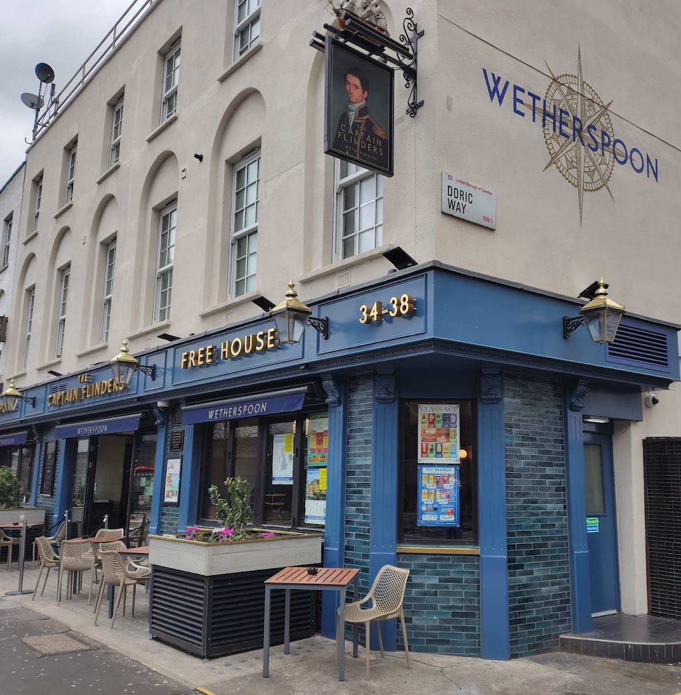

*The sign portrait of Captain Matthew Flinders, whose remains turned up nearby during the HS2 dig at Euston.*

### The Sir Alexander Fleming, Paddington

*5 Merchant Square, Paddington Basin, W2 1AS · opened October 2025 · closes 10.30pm*

The newest branch in this guide, barely a year old at time of writing, in the modern Merchant Square development by Paddington station. Alexander Fleming discovered penicillin at St Mary's Hospital, Paddington, in 1928 — almost certainly the reason for the name.

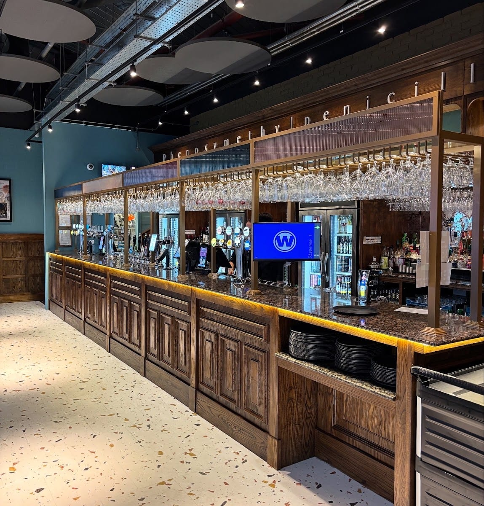

*Phenoxymethylpenicillin spelled out above the bar — a nod to the discovery made a short walk away at St Mary's Hospital.*

### The Lion, The Unicorn, Waterloo

*Upper-Ground Floor, The Sidings (under platforms 20–24), Waterloo station, SE1 7BH · opened September 2024*

Named after the Lion and Unicorn Pavilion, one of the structures built for the 1951 Festival of Britain on the South Bank alongside the Dome of Discovery and the 90-metre Skylon. The pavilion held two large straw figures — "symbols of Britain's character" — in a steel-framed hall with a long mural of British history inside. Everything from that festival was demolished except the Royal Festival Hall; this pub is the only place left that carries its name.

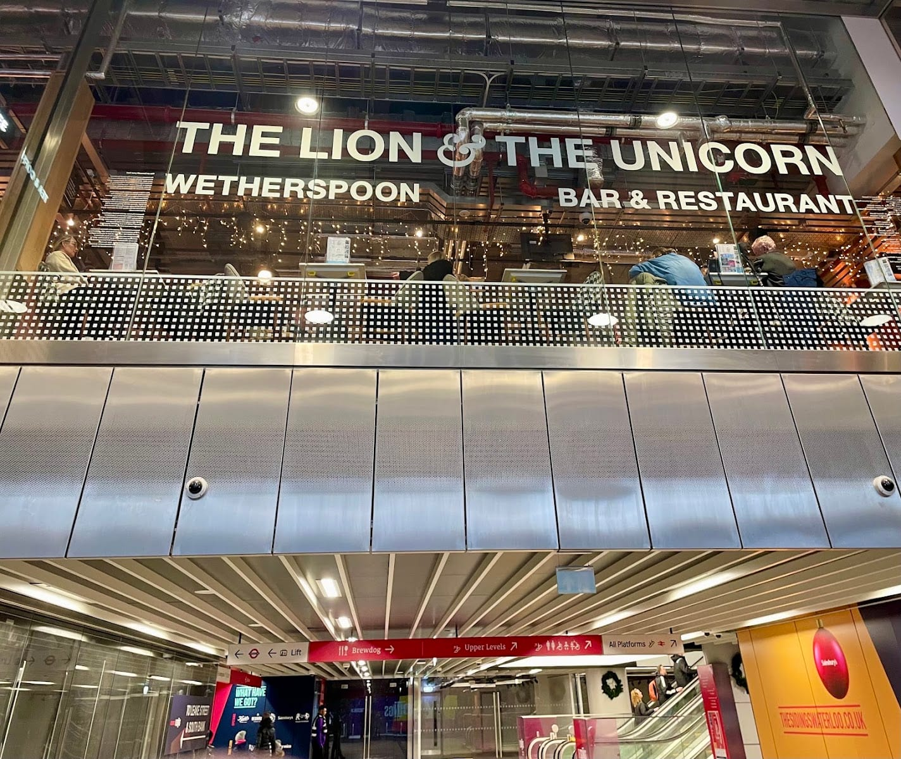

*Under the platforms at Waterloo — the last place in London still carrying the name of the 1951 Festival of Britain pavilion.*

Victoria has two branches rather than a standout single one: **Willow Walk** on Wilton Road, named after a tree-lined thoroughfare that grew up on a causeway once crossing marshland toward Westminster Abbey, and a branch inside the station itself that has traded, plainly, as **Wetherspoons** since March 1993 — among the earliest of the London branches in this guide, behind only Hamilton Hall and The Rochester Castle.

## Further out, and one more worth the detour

### The Rochester Castle, Stoke Newington

*143–145 Stoke Newington High Street, N16 0NY · closes midnight*

The earliest recorded pub on this site was The Green Dragon, trading by at least 1702. The current building replaced it in 1801 and takes its name from its builder, Richard Payne, who came from Rochester. Wetherspoon has run it since 5 May 1991, making it one of the company's earliest London conversions alongside Hamilton Hall.

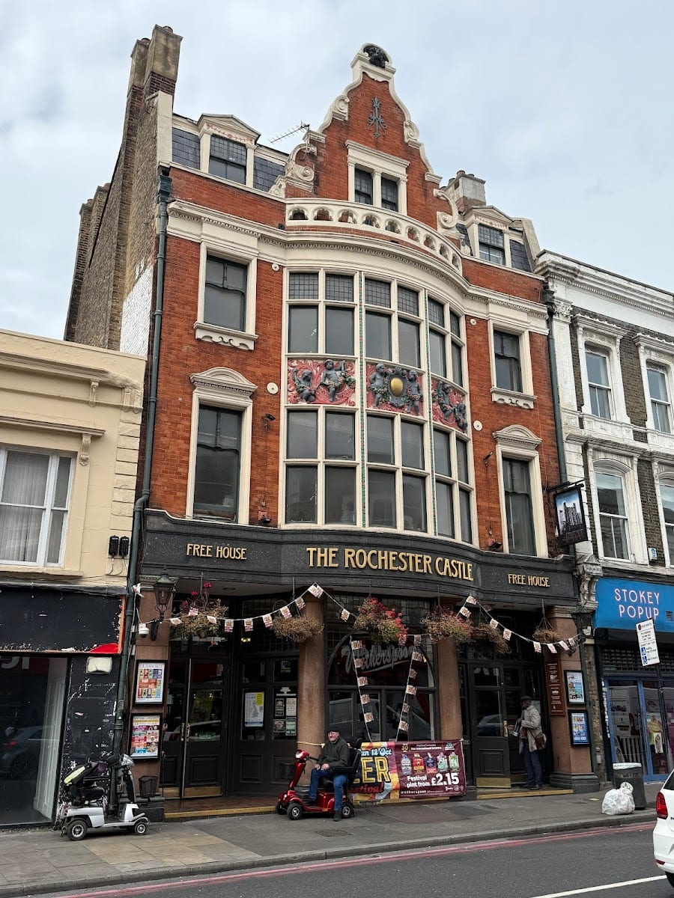

*The 1801 building on Stoke Newington High Street, trading as a Wetherspoons since May 1991 — one of the company's earliest London pubs.*

### The Mossy Well, Muswell Hill

*258 Muswell Hill Broadway, N10 3SH · closes midnight*

Muswell Hill itself takes its name from a medieval "mossy well" — a holy well that became a place of pilgrimage after a Scottish king was said to have been cured by its water. This particular building was Belle Vue Lodge by the early 1800s, an Express Dairy tea room from 1900 with a milk depot behind it, and licensed premises from the early 1980s before Wetherspoon took it over in October 2015 — decades after the other five branches above, and a useful reminder that not every London Wetherspoons is a 1990s conversion. The very first Wetherspoons pub of all opened less than a mile from here, on Colney Hatch Lane, on 9 December 1979 — a former bookmaker's shop that traded for a month as "Martin's Free House" before being renamed. It's a separate, older building from The Mossy Well itself.

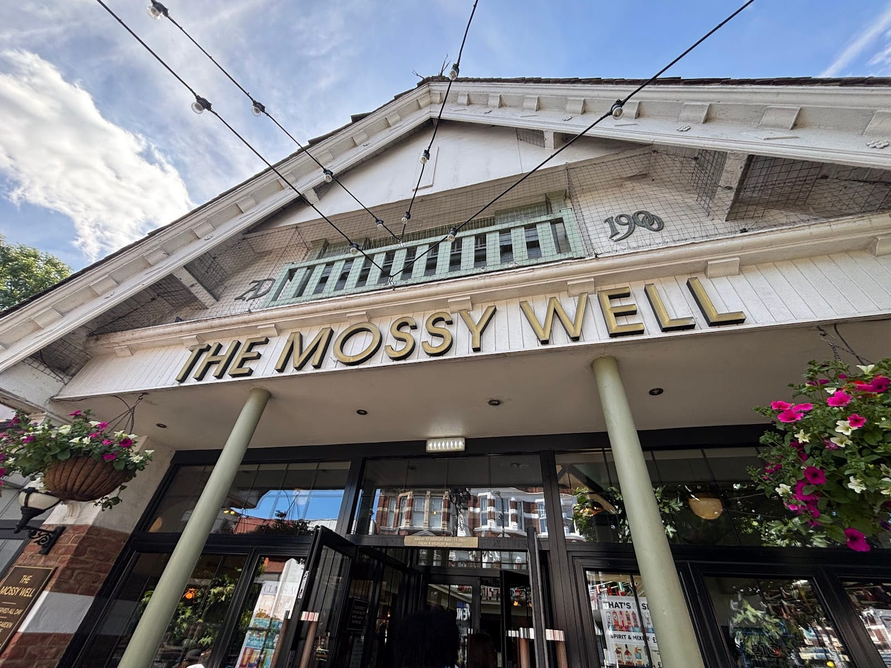

*The 1900 datestone from the building's years as an Express Dairy tea room, before Wetherspoon took it over in 2015.*

### The Montagu Pyke, Soho

*105–107 Charing Cross Road, WC2H 0BP · closes 10.30pm*

Built in 1911 as Pyke's Cambridge Circus Cinematograph Theatre — the 16th and last of the cinemas opened by the pioneering exhibitor Montagu Pyke. A fire gutted it in 1915; rebuilt as the Super Cinema, it later traded as the Tatler, then Filmcenta, then a three-screen Cannon. In 1988 it became a home of the Marquee Club, the music venue that hosted decades of British rock before finally closing here in 1996. Wetherspoon moved in afterwards.

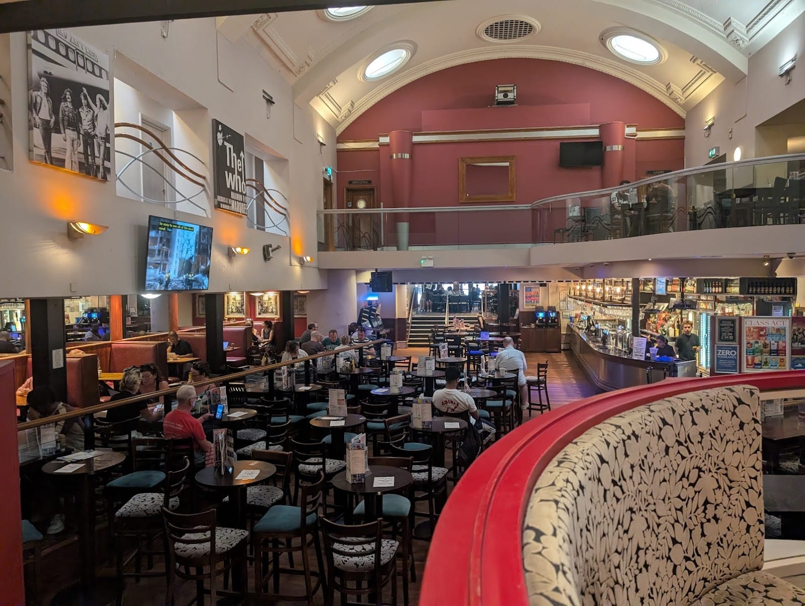

*The old cinema auditorium, later the Marquee Club — the rock posters on the wall are the only reminder of its years as a music venue.*

Looking for a proper sit-down Sunday lunch rather than a fry-up? Wetherspoons serves a roast, but it isn't the destination version — our [best Sunday roast guide](/articles/best-sunday-roast-london/) covers the pubs actually worth booking ahead for. And for more of London's cheapest good meals beyond this one chain, see our [cheap eats guide](/articles/cheap-eats-london/) and [best breakfast and brunch guide](/articles/best-breakfast-brunch-london/), both of which cover further branches of their own.

## Continue planning your London trip

- 🇬🇧 **[Classic British Food in London](/articles/classic-british-food-london/)** — Scotch eggs, pie and mash, sausage rolls and proper puddings, dish by dish.
- 🍺 **[London's Historic Pubs and Dining Rooms](/articles/historic-pubs-dining-rooms-london/)**
- 🍻 **[The Best Craft Beer Pubs in London](/articles/best-craft-beer-pubs-london/)**
- 🥩 **[The Best Sunday Roast in London](/articles/best-sunday-roast-london/)**
- 🍳 **[The Best Breakfast and Brunch in London](/articles/best-breakfast-brunch-london/)**
- 💷 **[Cheap Eats in London](/articles/cheap-eats-london/)**

*Addresses, opening hours and building histories are from each pub's own page on jdwetherspoon.com, checked in September 2026; CAMRA's listing grades for Hamilton Hall and The Ledger Building are as indexed on camra.org.uk over the same period. Menu prices are Hamilton Hall's own table menu as printed in September 2026 — Wetherspoon sets prices per branch, and does not publish drink prices at all outside its app.*
