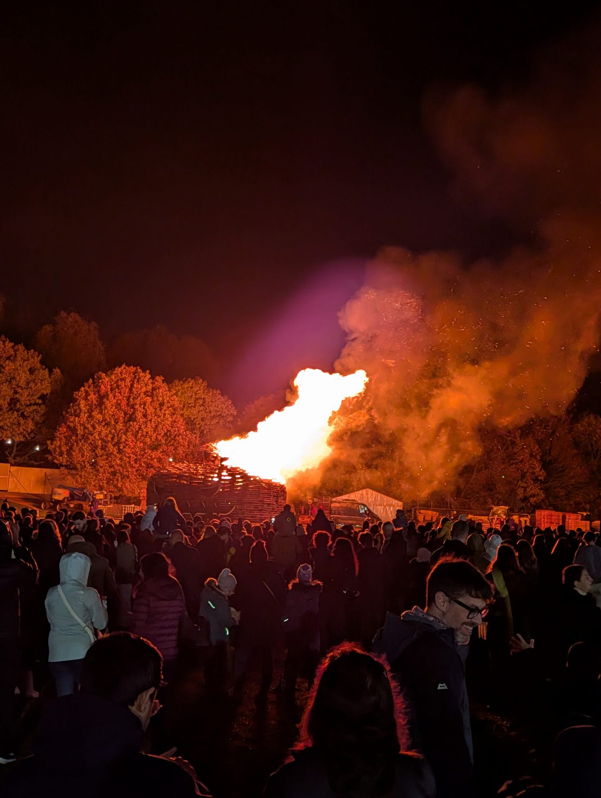
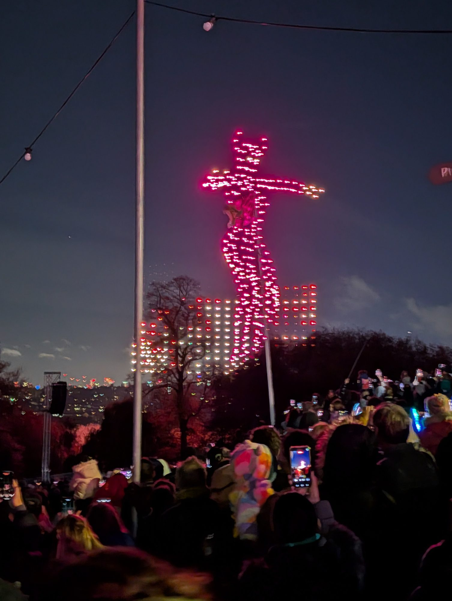
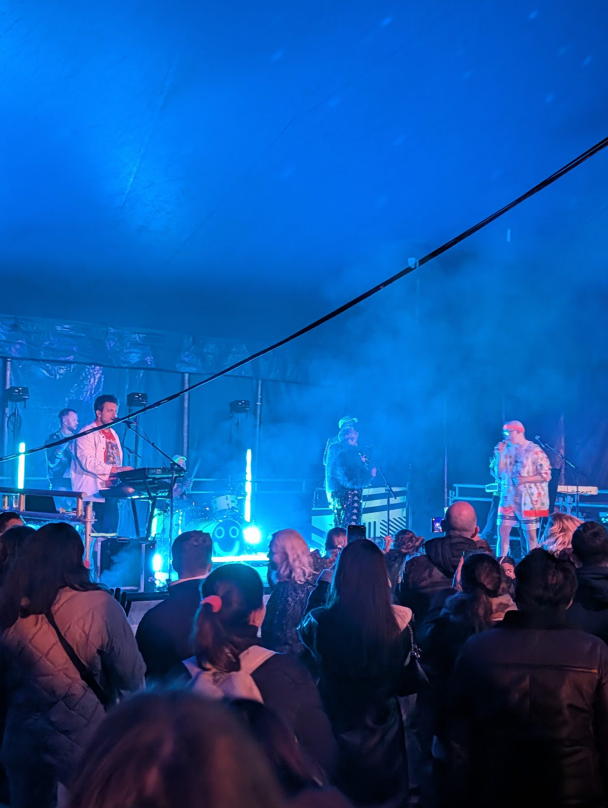

**Bonfire Night 2026 is Thursday 5 November, but the fireworks are on Saturday 7th** — **thirteen displays land on that one night**, with a second wave on the Sunday.

Just three run on the 5th itself: Coram's Fields, Wimbledon Park and Stow. So if you climb a hill on Bonfire Night expecting a skyline full of rockets, you will mostly see other people's back gardens.

This guide lists every display you can buy a ticket for, the one that is still free, which famous ones no longer run at all, and — the part most guides get wrong — the free viewpoints that are actually open after dark.

> 💡 **The Short Version:** The real night is **Saturday 7 November**. **Alexandra Palace** goes on presale at **midday on Wednesday 2 September** and sells out. Several displays sell out, and the early-bird tiers close through late August and September. The only genuinely free display is **Coram's Fields** on the 5th, where adults must bring a child. For a free view, **Parliament Hill** has no gates and never closes — while **Greenwich Park shuts at 6pm**, before anything starts.

---

## When everything actually happens

| Date | What is on |
| --- | --- |
| **Sat 31 Oct** | Enfield Town Park Halloween Spooktacular |
| **Sun 1 Nov** | Richmond Family Fireworks · Colets, Thames Ditton |
| **Thu 5 Nov** | **Coram's Fields (free)** · Wimbledon Park · Stow |
| **Fri 6 Nov** | Stow · Esher Rugby · Totteridge |
| **Sat 7 Nov** | **The big one** — Alexandra Palace · Morden Park · Harrow · Dulwich · Southgate · Kempton Park · Beckenham · West Wickham · Bromley High · Chislehurst · Stow, plus Battersea and Blackheath expected |
| **Sun 8 Nov** | Alexandra Palace family day · Meath School, plus Battersea expected |

---

## Alexandra Palace: the big one, and the format has changed

The best-known display in London, on a ridge with one of the great views over the city — and **the format is different this year**.

| | Saturday 7 November | Sunday 8 November |
| --- | --- | --- |
| **Gates** | 16:00 | 16:00 |
| **Display** | **8pm** | **6pm** |
| **The night** | Party night — German Bier Festival, live music and DJs | **Family day, new for 2026** — reduced capacity, children's entertainment |

Also on site across the weekend: a bonfire, funfair, **ice skating** on the permanent indoor rink, street food and bars.

The event is now called the Fireworks and Drone Festival. The drones fly formations above the park alongside the fireworks.

> ⚠️ **The presale opens at 12pm on Wednesday 2 September 2026**, and the priority sign-up list is the only route to early-bird pricing. This event sells out, so join the list rather than relying on catching the general sale.

**Expect around £15–£18 for an adult and £11–£12 for a child**, based on 2025 prices of £15.50 and £10.50 in advance. Under-10s go free on the Sunday, on early-bird tickets only.

> ⚠️ The advertised "from £10.50" is a child price for an 11 to 15-year-old, not adult entry.

Two things that changed from last year: the event has **moved off Halloween** — 2025 ran on 31 October and 1 November with ghost tours and fancy dress, and 2026 is a straight Bonfire Night weekend — and Sunday is now a dedicated family day rather than a second party night.

**Getting there:** Alexandra Palace rail (from Moorgate) or Wood Green on the Piccadilly line.

---

## What each display costs

Prices below were published by the organisers and checked in late August 2026. Several early-bird tiers close on the dates shown.

| Display | Date | Prices | Notes |
| --- | --- | --- | --- |
| **Stow Firework Spectacular**, Walthamstow | **5, 6 and 7 Nov**, gates 16:00 | Adult **£11** · Child 6–15 **£5** · Under-5 **£1** · Family **£27** | Two displays, 6pm and 8pm, one ticket covers both. **Online only, no gate sales.** Sold out four years running |
| **Harrow Fireworks + Diwali**, Byron Park | **Sat 7 Nov**, fireworks ~19:45 | Adult **£12.95** · Child 3–15 **£8.95** · Under-3 free · VIP £41.95 | **Cash only on the gate.** Printed tickets only — phones are not accepted |
| **Southgate**, The Walker Ground | **Sat 7 Nov**, fireworks and drones 19:30 | Adult **£13** · Child **£8.50** · Family **£39** · Under-5 free | **Early bird ends 1 September.** Sold out in 2025 |
| **Dulwich Sports Club** | **Sat 7 Nov**, fireworks ~19:00 | Adult **£13** · Junior 12–16 **£8** · **Under-12s £1** | "Kids for a Quid". Adult tier closes 23 Oct. No gate sales |
| **Kempton Park**, Sunbury | **Sat 7 Nov**, fireworks 19:30 | **From £10** | Last entry 7pm. Funfair to 10pm. Kempton Park station from Waterloo |
| **Enfield Town Park** | **Sat 31 Oct**, display ~18:30 | Adult **£14.70** · Under-16 **£10** · Under-5 **£4** | **Early bird ends 31 August.** No gate sales, and **tickets must be collected in person** before the day |
| **Bonfire Night on the Thames** | **Sat 7 Nov**, boards 19:00 | Adult **£50** · Child **£45** | Boat from Festival Pier with buffet and DJ, viewing the Battersea display |

> ⚠️ **Campfire Club at Cody Dock** appears in fireworks listings but is **live music and a bonfire, not a fireworks display**. Worth going to on its own terms — just do not turn up expecting rockets.

---

## On-sale dates to diarise

| Display | Date | Tickets on sale |
| --- | --- | --- |
| **Richmond Family Fireworks** | Sun 1 Nov | **Tue 1 September**, early bird to 30 Sept |
| **Alexandra Palace** | Sat 7 and Sun 8 Nov | **Wed 2 September, 12pm presale** |
| **Battersea Park** | Two nights, **dates not yet announced** | **Tue 8 September** — presale 09:00, general midday |
| **Bromley High School** | Sat 7 Nov | **Mon 28 September** |
| **West Wickham** (Rotary) | Sat 7 Nov | **1 October** — capped at 1,550, no gate sales |
| **Beckenham Charity Fireworks** | Sat 7 Nov | Not announced — mailing list only, **never any gate sales** |
| **Blackheath** | Expected early Nov, **not confirmed** | Not announced — sign-up only |
| **Merton**: Wimbledon Park and Morden Park | **Wimbledon Park Thu 5 Nov · Morden Park Sat 7 Nov** | Not announced — mailing list only |

**Richmond has sold out four years running**, grandstand seats go first, and **under-5s still need a ticket**. Parking is £10, advance only, and sold out last year.

> ⚠️ **Merton's two parks get swapped constantly in listings.** The council's own page says **Wimbledon Park on Thursday 5 November** and **Morden Park on Saturday 7 November** — which is also the reverse of 2025, so last year's pattern will mislead you too.

---

## The one free display

**Coram's Fields**, Guilford Street, Bloomsbury WC1N 1DN — **Thursday 5 November 2026**. Gates 15:30, performances from 16:15, **display at 18:00**, closes 19:00. Free, no ticket, first come first served, with a capacity of around 6,000.

> ⚠️ **Adults may only attend accompanied by a child.** Coram's Fields is a children's park run by a children's charity, and that rule applies all year round. There is also a paid fast-track tier to skip the queue, so "free" comes with an upsell.

**No London borough council still funds a free public display.** The BBC asked all 32 under freedom of information and found **17 council events cancelled over cost in five years**, ten of them in Tower Hamlets alone. The displays that survive have migrated to cricket clubs, rugby clubs, schools, Scout groups and Rotary — and they charge.

---

## Watching for free, without a ticket

This is where most guides fail, because they recommend viewpoints that are **locked before the fireworks start**. Displays are at 7pm or 8pm, and several of the famous hills shut their gates at 4.30pm or 5pm.

| Viewpoint | November gates | Any good? |
| --- | --- | --- |
| **Parliament Hill**, Hampstead Heath | **No perimeter gates to close** | ✅ **The pick** |
| **Alexandra Park** | **Open 24 hours, all year** | ✅ |
| **Primrose Hill** | Closes **10pm**, not dusk | ✅ |
| **Blackheath** | Unenclosed common, no gates | ✅ |
| **Hyde Park** and **St James's Park** | 05:00–**midnight**, all year | ✅ |
| Richmond Park | Pedestrian gates lock **20:00** during the deer cull | ⚠️ Tight |
| Greenwich Park | **18:00** | ❌ |
| The Regent's Park | **16:30** | ❌ |
| Crystal Palace Park | About **17:00** | ❌ |
| Telegraph Hill | **16:30** | ❌ |
| Nunhead Cemetery | **16:00** | ❌ |
| Horniman Gardens | Sunset | ❌ |
| Severndroog Castle | Viewing platform **Sundays, daytime only** | ❌ |

**Parliament Hill is the answer.** At 98 metres it is the highest of the classic viewpoints, it has legally protected sightlines to both St Paul's and the Palace of Westminster, and — uniquely among the big viewpoints — the Heath has no perimeter gates to lock. Nearest stations are Gospel Oak and Hampstead Heath. Two honest drawbacks: the Heath is unlit, so bring a torch for the walk up, and the Westminster view is partly obscured by intervening construction.

**Alexandra Park is the clever one on 7 and 8 November**, because the park around the palace is open around the clock while the display happens inside it. What we cannot confirm is how much of the park is fenced off on event nights, so treat this as a plan worth phoning ahead about rather than a guarantee.

**Primrose Hill is the counterintuitive good news.** It is widely believed to shut for Bonfire Night; in fact it closes at **10pm**, well after any display. It is separately gated from The Regent's Park, so approach from the Chalk Farm side — the main park shuts at 16:30. Note the closure arrangements are announced each September, so check before you go.

**Greenwich Park is the trap.** The General Wolfe viewpoint is genuinely one of the best in London, it has a protected vista to St Paul's, and it is free — and the gates shut at **6pm** in November.

**Richmond Park deserves a note rather than a recommendation.** During the deer cull from 1 November, pedestrian gates lock at **20:00** — except on Friday and Saturday nights, when the park stays open. Car parks close at 16:30 regardless. And King Henry's Mound, the famous viewpoint, sits inside Pembroke Lodge Gardens, which are separately enclosed with no published closing time. The protected view to St Paul's is also a keyhole through a hedge, not a panorama. It is not a fireworks viewpoint.

**Rooftops mostly close too early.** Sky Garden shuts its terrace at 18:00 on weekdays, Horizon 22 at 18:00, and The Garden at 120 at 18:30. The exception is **Tate Modern's Level 10 viewing floor**, free and open until 21:00 on Friday and Saturday — which makes it a real option on 6 and 7 November, though not on the Thursday.

---

## The famous ones that no longer run

People still search for all of these.

| Display | What happened |
| --- | --- |
| **Victoria Park** | Cancelled every year since 2020. Tower Hamlets cut ten events over costs |
| **Crystal Palace Park** | Pulled in 2023 on budget grounds. The park is mid-way through a £52m restoration |
| **Southwark Park** | Cut in 2023. Nothing scheduled for 2026 |
| **Ravenscourt Park and Bishop's Park** | Scrapped in 2022 on air-quality grounds, replaced by a laser show — which was itself dropped in 2024 |
| **Clissold Park** | Cancelled 2020–22 on budget grounds, never revived |
| **Danson Park, Bexley** | Cancelled in 2025 for the first time in 56 years |
| **Bounds Green** | Confirmed not running in 2026 — not enough volunteers. Hoping for 2027 |
| **Chiswick Business Park** | Discontinued — the organisers said it no longer fitted their role in the community |
| **Carshalton and Sutton** | Cancelled permanently. No ticketed display anywhere in Sutton |
| **Lord Mayor's Show Thames fireworks** | Abolished by the City of London Corporation |

> 💡 **Blackheath is the exception — it is coming back.** Cancelled from 2019 to 2024 when Lewisham withdrew funding, it returned in 2025 and sold out. Local reporting in July 2026 says it returns this year, and the organiser runs it as a weekend event in late October or early November — but **no 2026 date or price has been confirmed**, so watch for an announcement. The change worth knowing is that it is **no longer free**: it is now ticketed and fenced, which drew local criticism about pricing out families who had gone for decades.

---

## Four traps worth knowing about

1. **One Harrow display is sold under at least twelve different names.** Sites branded for Uxbridge, Hillingdon, Wembley, Ruislip, Ealing and Pinner all sell the **same single event at Byron Park in Harrow**. There is no separate display in any of those places.
2. **A lookalike ticket site is advertising Alexandra Palace on the wrong dates.** One secondary broker lists it for 30–31 October; the official dates are **7 and 8 November**. Its own footer admits it is a secondary broker. Book through the venue.
3. **Battersea's own website has been showing last year's content**, including a "tickets are now sold out" banner from the 2025 event. Check the on-sale date rather than the banner.
4. **Croydon Road Recreation Ground is in Beckenham, not Croydon.** Searches for Croydon fireworks surface it, and it is a long way from Croydon.

Listings aggregators are unusually unreliable this year — several sites headed "2026" are carrying recycled 2025 dates and prices. Go to the official page.

---

## Practicalities

**Dress for standing still in the cold.** London's November average is about **11°C by day and 5°C overnight**, so an evening on an exposed hilltop sits somewhere between the two — and the clear, calm nights that make for the best viewing are the coldest ones. November is also one of the wetter months in the south east, and no café is open on Parliament Hill at 8pm. Hat, gloves and a flask.

**Fireworks are banned in the Royal Parks and on Hampstead Heath**, and the rules are enforced by the police. Setting off your own is legal elsewhere until **midnight on Bonfire Night**, and 11pm on other nights.

---

## Why we do this at all

The Gunpowder Plot was a London event. In 1605 a group of conspirators packed barrels of gunpowder into the undercroft beneath the House of Lords, intending to destroy the Palace of Westminster and kill James I at the State Opening. Guy Fawkes was caught in the cellar. The bonfires that November were spontaneous celebrations of the king's survival, and they have been burning every year since.

You can still visit the site: the Palace of Westminster is on Parliament Square, and the story is told in Parliament's own collections.

---

## Continue planning your London trip

- 🌳 **[Best Parks and Gardens in London](/articles/best-parks-gardens-london/)**
- 🏙️ **[The Best Views in London](/articles/best-views-london/)**
- 💷 **[London on a Budget](/articles/london-on-a-budget/)**
- 🚇 **[How to Use the London Underground](/articles/how-to-use-the-london-underground/)**

---

*Dates, prices and on-sale times are as published by the venues and organisers and checked in late August 2026. Some 2026 prices were unpublished at that point — where a 2025 figure is given as a guide it is labelled as such. Park opening times are from the Royal Parks' own 2026 schedules and the relevant councils. Always check the official event page before travelling.*
