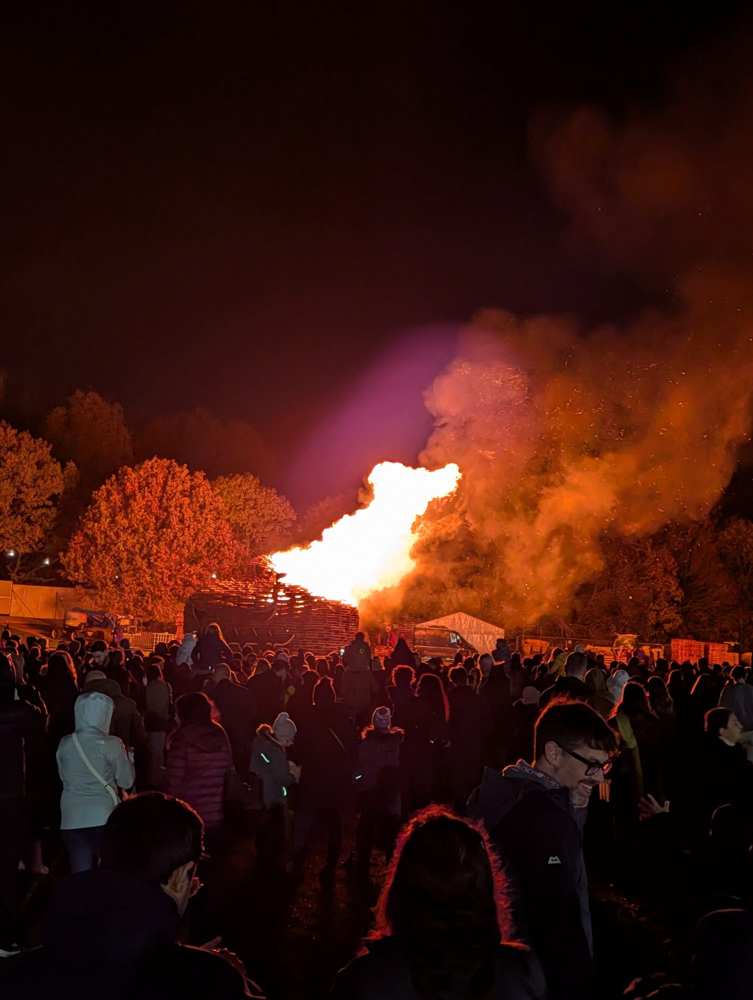
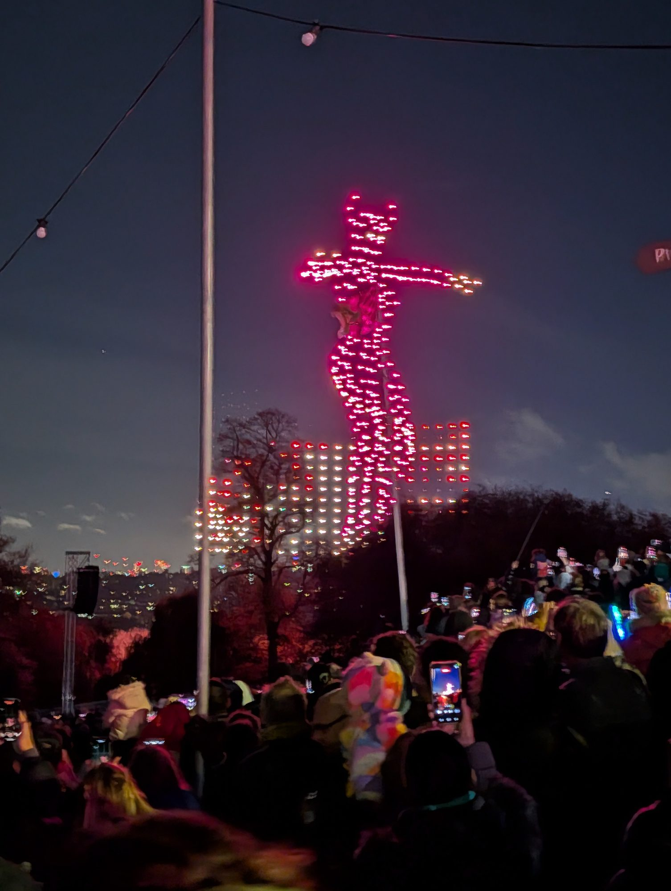
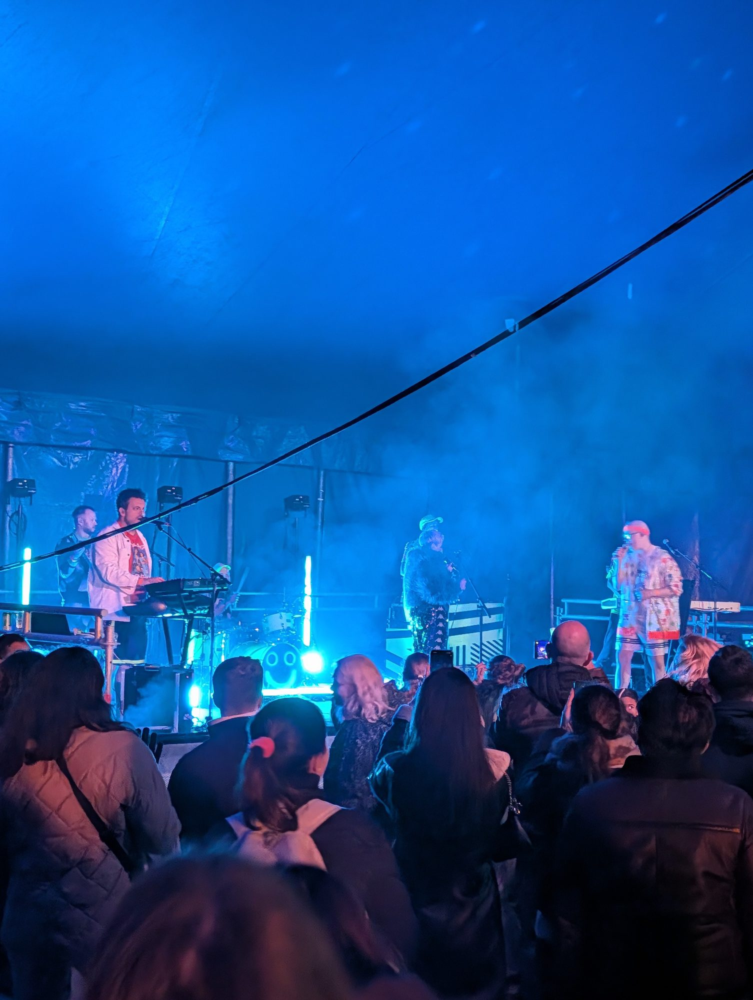
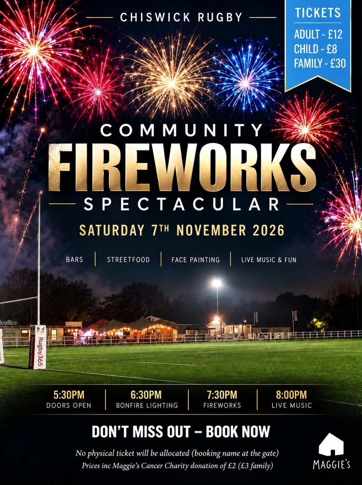

**Bonfire Night 2026 is Thursday 5 November, but the fireworks are on Saturday 7th** — **most of the displays land on that one night**, with a second wave on the Sunday.

Just three run on the 5th itself: Coram's Fields, Wimbledon Park and Stow. So if you climb a hill on Bonfire Night expecting a skyline full of rockets, you will mostly see other people's back gardens.

This guide lists every display you can buy a ticket for, the one that is still free, which famous ones no longer run at all, and the free viewpoints that are actually open after dark.

> 💡 **The Short Version:** The real night is **Saturday 7 November**. **Alexandra Palace** and **Battersea Park** are both on sale and both sell out. **Danson Park** is back after cancelling in 2025, and Richmond's early-bird prices ended on **30 September 2026**. The only free display is **Coram's Fields** on the 5th, where adults must bring a child. For a free view, **Parliament Hill** has no gates and never closes — while **Greenwich Park shuts at 6pm**, before anything starts.

---

> 🎃 **Coming a week earlier?** Our [Halloween in London guide](/articles/halloween-london/) covers the same fortnight — the ticketed events, the free ones, and which of the scare attractions are worth the money.

> 🧭 **Plan the rest of it:** [Getting around on the night](/articles/getting-around-london-transport-guide/) · [Late-night eating](/articles/late-night-eating-london/) · [New Year's Eve fireworks](/articles/new-years-eve-london/) · [Things to do in London in October](/articles/things-to-do-in-london-in-october/) · [Things to do in London in November](/articles/things-to-do-in-london-in-november/)

## When everything actually happens

| Date | What is on |
| --- | --- |
| **Sat 24 Oct** | Sunshine Garden Centre, New Southgate |
| **Sat 31 Oct** | Enfield Town Park Halloween Spooktacular |
| **Sun 1 Nov** | Richmond Family Fireworks · Colets, Thames Ditton |
| **Thu 5 Nov** | **Coram's Fields (free)** · Wimbledon Park · Stow |
| **Fri 6 Nov** | Stow · Totteridge · Orpington Golf Centre · Farringtons School, Chislehurst · Esher Rugby |
| **Sat 7 Nov** | **The big one** — Alexandra Palace · **Battersea Park** · **Blackheath** · Danson Park · Morden Park · Harrow · Southgate · Ealing Cricket Club · Brentham Club · Dulwich · Beckenham · West Wickham · Chislehurst Rotary · Bromley High · Kempton Park · Chiswick Rugby Club · Lift Richmond Park · Stow |
| **Sun 8 Nov** | Alexandra Palace family day · **Battersea Park** · St Francis Monks Hill, Selsdon |

---

## Alexandra Palace: the best-known one, and the format has changed

The best-known display in London, on a ridge with one of the great views over the city — and **the format is different in 2026**.

| | Saturday 7 November | Sunday 8 November |
| --- | --- | --- |
| **Gates** | 16:00 | 16:00 |
| **Last entry** | 20:05 | 18:05 |
| **Display** | **8pm** | **6pm** |
| **The night** | Party night — headline DJ set from Eats Everything, and a German Bier Festival (18+, extra ticket) with a Queen tribute | **Family day, new for 2026** — smaller capacity, Barrioke with Shaun Williamson, a Junior Jungle kids' rave |

Also on site across the weekend: a bonfire, funfair, **ice skating** on the permanent indoor rink, street food and bars.

The event is now called the Fireworks and Drone Festival. Hundreds of choreographed drones, flown by Celestial, runners-up on Britain's Got Talent 2026, fly formations over the park before the fireworks take over.

> ⚠️ **Tickets are on sale now.** Both nights are sold through [DICE](https://link.dice.fm/lb38fc167352), the ticket link on the festival's own site, and through Universe and Fever; the festival names those three as its only official partners. This event sells out, so do not wait for November.

**Alexandra Palace's own page says tickets start from £11.50, and the under-10 ticket is £6.50 including fees.** Under-10s went free on early-bird tickets, and that offer has ended. Universe lists tickets from £6.05 to £18.70 a night, fees included.

- Adult tickets are 16+. Children aged 11–15 and 0–10 each need their own ticket, and must be with an adult aged 21 or over.
- The site is cashless.
- No food or drink may be brought in, except for young children.
- The German Bier Festival (Saturday, 18+), ice skating, the Summit rooftop and the Sunday premium viewing area are add-on tickets, and none can be bought on its own.

Two things changed from 2025: the event has **moved off Halloween** — 2025 ran on 31 October and 1 November with ghost tours and fancy dress, and 2026 is a straight Bonfire Night weekend — and Sunday is a dedicated family day, not a second party night.

**Getting there:** Alexandra Palace station, on Great Northern trains from Moorgate or King's Cross, is at the Wood Green entrance to the park. Wood Green on the Piccadilly line is a 20-minute walk. The W3 bus is diverted and does not stop at the Palace, and there is no public parking.

---

## Battersea Park: the other large paid display

**Battersea Park is the other large paid display in London**, and it sells out in much the same way. It is the bigger of the two on the only published figure — [Time Out](https://www.timeout.com/london/things-to-do/bonfire-night-fireworks-displays-in-london) puts it at 50,000 ticketed spectators a night, and neither Alexandra Palace nor Battersea publishes a capacity of its own.

**Saturday 7 and Sunday 8 November**, run by Wandsworth Council, with tickets on sale. On the Saturday gates open at 6pm, a Rudimental DJ set starts at 7.30pm, last entry is 8pm, the fireworks start at about 8.30pm and the show ends at 11pm, with a Disco Ceilidh party after the display. On the Sunday gates open at 4.30pm, the Lords of Lightning electrical show is at 5.45pm, last entry is 6.30pm, the fireworks start at about 7pm and the show ends at 9.30pm. The two nights are different shows with different soundtracks.

**General admission (16+) is £16.70, rising to £18.10 for the final release; youth tickets (5–15) are £11.50, and under-5s go free but still need a ticket.** Tickets are advance only, sold through Kaboodle from the [Battersea Park Fireworks booking page](https://www.batterseaparkfireworks.com/booktickets) — there are no gate sales, no resale and no waiting list for sold-out dates. Bars and food stalls take cards only.

### Watching Battersea from the river instead

[London Party Boats](https://www.londonpartyboats.co.uk/tickets/bonfire-night-on-the-thames/229) runs a three-hour cruise that sails up to Battersea and holds position for the display, which is a way in if the park itself sells out — and a better view of a riverside firing point than most of the park gets.

| | |
| --- | --- |
| **Date** | Saturday 7 November 2026 |
| **Boarding** | 19:00 at Festival Pier, Belvedere Road, SE1 8XZ |
| **Departs / returns** | 19:15, back 22:00–22:15 |
| **Price** | **£50** adult, **£45** child 2–17, under-2s free but still need a ticket |
| **Included** | Hot buffet, welcome drink, live DJ, heated boat with an open upper deck, bar |

Under-18s must be with an adult, and adults need photo ID for the wristband if they want to be served at the bar. The route passes the Houses of Parliament on the way, which is a nice touch on this particular night.

> 💡 **The date matches.** The cruise sails on Saturday 7 November, the same night as the Saturday display in the park — so if the park sells out, the boat is the way to see the same show.

---

Powered by <a target="_blank" rel="sponsored" href="https://www.getyourguide.com/london-l57/">GetYourGuide</a>

## What each display costs

Prices are the organisers' own for 2026.

| Display | Date | Prices | Notes |
| --- | --- | --- | --- |
| **[Stow Firework Spectacular](https://www.stowfireworkspectacular.co.uk/)**, Walthamstow | **5, 6 and 7 Nov**, gates 16:00 | Adult **£11** · Child 6–15 **£5** · Age 0–5 **£1** · Family **£27**, no booking fees | Two displays, 6pm and 8pm, one ticket covers both; last entry 8pm. **Online only, no gate sales**, and babies need a ticket too. Sold out four years running. Wood Street station is three minutes' walk |
| **[Harrow Fireworks + Diwali](https://harrowfireworks.co.uk/buy-tickets/)**, Byron Park | **Sat 7 Nov**, fireworks ~19:45 | Adult **£13.95** · Child 3–15 **£8.95** · Under-3 free · VIP **£39.95** · plus £1.50 a ticket (£2 for VIP) | Free entry noon–3pm for the Diwali show; paid from 3pm. The Diwali stage show and Bollywood acts run through the night. Online sales stop at noon on the day, then tickets are sold only at the gate. **Printed tickets only** — phones are not accepted. The VIP pack adds a queue jump, a ride token, a meal token, front-row viewing and a glow toy |
| **[Southgate](https://www.eventbrite.co.uk/e/the-walker-ground-fireworks-2026-tickets-1997391432543)**, The Walker Ground | **Sat 7 Nov**, fireworks and drones 19:30 | Adult **£14** · Child up to 16 **£9.50** · Family (2 adults + 2 children) **£43** · Under-5 free, plus Eventbrite fees | Gates 17:00. The drone show is included in the ticket |
| **[Dulwich Sports Club](https://www.eventbrite.co.uk/e/dulwich-firework-display-2026-kids-for-a-quid-tickets-1991896534154)** | **Sat 7 Nov**, fireworks ~19:00 | Adult **£13** · Junior **£8** · **Under-12s £1**, plus Eventbrite fees | "Kids for a Quid". Doors 17:00, live music from 17:30. **Advance tickets only, none on the night**, and no parking. Herne Hill, North Dulwich and West Dulwich stations are each ten minutes' walk |
| **[Beckenham Charity Fireworks](https://www.beckenhamfireworks.com/)**, Croydon Road Recreation Ground | **Sat 7 Nov**, gates 16:30 | Adult 14+ **£18** · Child 5–13 **£6** · Under-5 free · Concession **£12.50**, plus fees (£19.08 an adult) | Two displays, 6pm for smaller children and 7.30pm. Run by the 5th Beckenham South Scout Group; the display has raised money for local charities since 1946. **No gate sales.** Some food stalls and rides take cash only, and there is no cash machine in the park. Clock House station is 11 minutes' walk |
| **[West Wickham Fireworks](http://westwickhamfireworks.com/where-to-buy-tickets/)**, Club Langley, Eden Park | **Sat 7 Nov**, gates 16:00, display 18:30 | Adult **£12** · Child under 18 **£6** · Family (2 adults + 2 children) **£30** · Under-5 free | A Rotary West Wickham charity display. **No gate sales.** Online sales are capped at 1,500 and close at 4pm on the day; the rest go through local schools and shops. E-tickets must be printed. No parking on site |
| **[Chislehurst Rotary](https://www.chislehurstfireworks.com/)**, Chislehurst Recreation Ground | **Sat 7 Nov**, gates 17:00, fireworks 19:30 | To 17 Oct: adult **£12** · child **£7.50** · family (2 adults + 2 children) **£25**. 18 Oct to 1 Nov: **£14** · **£9** · **£30**. From 2 Nov: **£18** · **£10** · **£40** | **Advance tickets only, none at the gate**; booking closes at 10am on 7 Nov. The organisers ask everyone to be inside by 7pm. Under-12s funfair, street food and a beer tent run by The Cockpit micropub. Elmstead Woods station is 15 to 20 minutes' walk |
| **[Bromley High School](https://www.eventbrite.co.uk/e/bromley-high-fireworks-2026-tickets-1992816335304)**, Blackbrook Lane | **Sat 7 Nov**, doors 17:45, fireworks 19:30 | Admission **£13**, or **£25** and **£33** with unlimited rides | Run by the school's Parents' Association, with a funfair, food stalls and a bar. Funfair and food run to 22:00. No refunds |
| **[Danson Park](https://www.skiddle.com/e/42711388)**, Bexleyheath | **Sat 7 Nov**, gates 16:00, fireworks 20:00 | Adult 16+ **£15** · Child 5–15 **£9** · Concession (65+ or disabled) **£12** · Under-5 free · Family from **£22** (1 adult, 1 child), plus Skiddle fees | Back after the 2025 cancellation. A 20-minute display fired to music over Danson Lake, with entertainment from 17:15, a funfair and a street food village. Two adults and two children is **£42**. Early-bird tickets have sold out and the organiser says prices rise closer to the day. Capacity 21,000 |
| **[Ealing Cricket Club](https://www.ticketor.com/ealingcc/tickets/ealing-cc-festival-of-fire-light-2026-366873)**, Corfton Road, W5 | **Sat 7 Nov**, gates 18:00, fireworks 19:45 | Early bird: adult **£13.50** · child 5–14 **£7.50** · family (2 adults + 3 children) **£33**. On the gate: **£17** and **£11**, no family tickets | The "Festival of Fire and Light", a Diwali-themed night. Kids' light quest and lantern parade from 18:00, live music and a DJ after the display. Ealing Broadway and North Ealing stations are a short walk |
| **[Brentham Club](https://www.ticketor.com/brenthamclub/tickets/fireworks-night-2026-367335)**, Meadvale Road, W5 | **Sat 7 Nov**, 17:00–21:00 | Adult 16+ **£13.50** · Child 3–15 **£7.50** · Family (2 adults + up to 3 children) **£33**, no booking fees | Online sales close at 15:20 on the day |
| **[Kempton Park](https://www.thejockeyclub.co.uk/kempton/events-tickets/fireworks/)**, Sunbury | **Sat 7 Nov**, fireworks 19:30 | **£10** in advance | Gates 5pm, last entry 7pm. Funfair to 10pm. Kempton Park station from Waterloo |
| **[Chiswick Rugby Club](https://www.chiswickrugby.co.uk/news/chiswick-rugby-community-fireworks-3000088.html)**, Dan Mason Drive, W4 | **Sat 7 Nov**, fireworks 19:30 | Adult **£12** · Child **£8** · Family **£30** | A charity display: £2 of each ticket, and £3 of a family ticket, goes to Maggie's. Doors 17:30, bonfire 18:30, live music from 20:00 |
| **[Richmond Family Fireworks](https://www.rag-events.co.uk/major-public-events-at-the-rag/richmond-family-fireworks/)**, Richmond Athletic Ground | **Sun 1 Nov**, gates 16:30, fireworks 19:00 | Adult 16+ **£12.50** · Child 5–15 **£7.50** · Grandstand **£17.50** · Under-5 free · Parking **£10**, booked in advance | A Halloween-themed display choreographed to music. The early-bird prices ended on 30 September 2026. **No gate sales.** Sold out four years running, grandstand seats go first, and **under-5s still need a ticket**. Last entry 18:30. Richmond station is under five minutes' walk |
| **[Enfield Town Park](https://www.dugdaleartscentre.co.uk/whats-on/town-park-fireworks)** | **Sat 31 Oct**, fireworks 19:00 | Adult **£15.40** · Under-16 **£10.50** · Under-5 **£4.25** · Family (2 adults, 1 child) **£35.20**, plus £1.50 a ticket | Halloween theme with a fancy-dress competition. Gates 17:00, last entry 18:30. No gate sales and no digital tickets: **collect them from Dugdale Arts Centre, 39 London Road, by 5pm on Friday 30 October** |
| **[Totteridge Fireworks Night](https://www.totteridgefireworks.co.uk/)**, Totteridge Millhillians Cricket Club, N20 | **Fri 6 Nov**, 17:00–23:30 | Tickets through the club's box office | The club's own night, raising money for the club and for Rays of Sunshine, a charity that grants wishes to seriously ill children |
| **[Bonfire Night on the Thames](https://www.londonpartyboats.co.uk/tickets/bonfire-night-on-the-thames/229)** | **Sat 7 Nov**, boards 19:00 | Adult **£50** · Child **£45** | Boat from Festival Pier with buffet and DJ, viewing the Battersea display |

### Smaller local displays

| Display | Date | Notes |
| --- | --- | --- |
| **[Sunshine Garden Centre](https://www.eventbrite.co.uk/e/sunshine-garden-centre-fireworks-extravaganza-saturday-24th-october-2026-tickets-2000606006420)**, Durnsford Road, N11 | **Sat 24 Oct**, doors 17:30, fireworks 19:00 | A Halloween fancy-dress night with a live band from 18:00. The ticket includes a BBQ or paella, mulled wine or a soft drink, and 15% off purchases in the garden centre on the night. Advance tickets on Eventbrite, no refunds |
| **[Orpington Golf Centre](https://www.eventbrite.co.uk/e/fireworks-spectacular-at-orpington-golf-centre-2026-tickets-2002217427223)**, Sandy Lane | **Fri 6 Nov**, gates 17:00, fireworks 19:30 | Run by Mytime Active. Hot dogs and burgers, a licensed bar and free parking |
| **[Farringtons School](https://www.eventbrite.co.uk/e/farringtons-fireworks-spectular-2026-tickets-2001706770836)**, Old Perry Street, Chislehurst | **Fri 6 Nov**, 18:00–21:00 | Run by the school's Parents' Association. Tickets on Eventbrite |
| **[Lift Richmond Park](https://www.eventbrite.co.uk/e/lift-richmond-park-formerly-rpas-firework-night-tickets-2000392873935)**, Park Avenue, SW14 | **Sat 7 Nov**, 17:30–21:30 | Formerly the Richmond Park Association's night. A bar, a BBQ, face painting and a DJ until 21:30. No sparklers; glow toys on sale. Tickets on Eventbrite, no refunds |
| **[St Francis Monks Hill](https://www.eventbrite.co.uk/e/family-fireworks-show-tickets-2002800236421)**, Broadcoombe, Selsdon | **Sun 8 Nov**, 17:30–19:00 | A church display at £5 a ticket, hot dog included |

> ⚠️ **Campfire Club at Cody Dock** appears in fireworks listings but is **live music and a bonfire, not a fireworks display**. Worth going to on its own terms — just do not turn up expecting rockets.

---

## Booking the large displays

| Display | Date | Where to book |
| --- | --- | --- |
| **[Alexandra Palace](https://www.alexandrapalace.com/whats-on/fireworks-drone-festival/)** | Sat 7 and Sun 8 Nov | **On sale** through DICE, Universe and Fever, the festival's three official partners. Prices are in the section above |
| **[Battersea Park](https://www.batterseaparkfireworks.com/)** | **Sat 7 and Sun 8 Nov** | **On sale** through Kaboodle, advance only. £16.70 to £18.10 for 16+, £11.50 for 5 to 15 |
| **[Blackheath](https://www.blackheathfireworks.com/)** | **Sat 7 Nov, 5pm–10pm** | **On general sale** on the organiser's own site: £16 adult, £10 youth, £5 child |
| **[Merton](https://www.merton.gov.uk/fireworks)**: Wimbledon Park and Morden Park | **Wimbledon Park Thu 5 Nov · Morden Park Sat 7 Nov** | **On sale** through See Tickets. The council says both shows sell out. Gates 5.15pm, a first show for young children at 6.45pm and the main one at 8.30pm |

> ⚠️ **Merton's two parks get swapped constantly in listings.** The council's own page says **Wimbledon Park on Thursday 5 November** and **Morden Park on Saturday 7 November** — which is also the reverse of 2025, so the 2025 pattern will mislead you too.

---

## The one free display

**[Coram's Fields](https://coramsfields.org/event/fireworks-night-2026/)**, Guilford Street, Bloomsbury WC1N 1DN — **Thursday 5 November 2026**. Gates 15:30, performances from 16:15, **display at 18:00**, closes 19:00. Free, no ticket, first come first served until the park is full.

> ⚠️ **Adults may only attend accompanied by a child.** Coram's Fields is a children's park run by a children's charity, and that rule applies all year round. A paid Fast-Track ticket guarantees entry and skips the queue, but gives no better view; Fast-Track and free accessible-area tickets are released in the first week of October.

**No London borough council still funds a free public display.** The BBC asked all 32 under freedom of information and found **17 council events cancelled over cost in five years**, ten of them in Tower Hamlets alone. The displays that survive have migrated to cricket clubs, rugby clubs, schools, Scout groups and Rotary — and they charge.

## Chiswick Rugby Club: a club display for charity

**[Chiswick Rugby Club's Community Fireworks](https://www.chiswickrugby.co.uk/news/chiswick-rugby-community-fireworks-3000088.html)** is a club-run night at its ground on Dan Mason Drive, W4, on **Saturday 7 November**. Doors open at 5.30pm, the bonfire is lit at 6.30pm, the fireworks go up at 7.30pm, and live music follows from 8pm. There are bars, street food and face painting.

**It raises money for Maggie's, the cancer support charity:** £2 of every ticket, and £3 of a family ticket, goes to it. Adults are **£12**, children **£8**, and a family ticket covering parents and all their children is **£30**.

Tickets are sold through the [club's online shop](https://www.chiswickrugby.co.uk/payments/chiswick-rugbys-community-fireworks-spectacular-159271.html), which asks you to register before you can buy. There is no physical ticket; you give the booking name at the gate.

---

Powered by <a target="_blank" rel="sponsored" href="https://www.getyourguide.com/london-l57/">GetYourGuide</a>

## Watching for free, without a ticket

Some of the best-known viewpoints are **locked before the fireworks start**. Displays are at 7pm or 8pm, and several of the famous hills shut their gates at 4.30pm or 5pm.

| Viewpoint | November gates | Any good? |
| --- | --- | --- |
| **Parliament Hill**, Hampstead Heath | **No perimeter gates to close** | ✅ **The pick** |
| **Alexandra Park** | **Open 24 hours, all year** | ✅ |
| **Primrose Hill** | Closes **10pm**, not dusk | ✅ |
| **Blackheath** | Unenclosed common, but **fenced on 7 Nov for the ticketed event** | ❌ On the night |
| **Hyde Park** and **St James's Park** | 05:00–**midnight**, all year | ✅ |
| Richmond Park | Pedestrian gates lock **20:00** during the deer cull | ⚠️ Tight |
| Greenwich Park | **18:00** | ❌ |
| The Regent's Park | **16:30** | ❌ |
| Crystal Palace Park | About **17:00** | ❌ |
| Telegraph Hill | **16:30** | ❌ |
| Nunhead Cemetery | **16:00** | ❌ |
| Horniman Gardens | Sunset | ❌ |
| Severndroog Castle | Viewing platform **Sundays, daytime only** | ❌ |

**Parliament Hill is the answer.** At 98 metres it is the highest of the classic viewpoints, it has legally protected sightlines to both St Paul's and the Palace of Westminster, and — uniquely among the big viewpoints — the Heath has no perimeter gates to lock. Nearest stations are Gospel Oak and Hampstead Heath. Two drawbacks: the Heath is unlit, so bring a torch for the walk up, and the Westminster view is partly obscured by intervening construction.

**Alexandra Park is the clever one on 7 and 8 November**, because the park around the palace is open around the clock while the display happens inside it. Some of the park is fenced off for the ticketed arena, so you will not get the same view as paying guests — but the fireworks go up over the whole hill.

**Primrose Hill is the counterintuitive good news.** It is widely believed to shut for Bonfire Night; in fact it closes at **10pm**, well after any display. It is separately gated from The Regent's Park, so approach from the Chalk Farm side — the main park shuts at 16:30. The 10pm closure applies on Friday, Saturday and Sunday nights until 8 November; on the Thursday, Bonfire Night itself, it is open all night.

**Greenwich Park is the trap.** The General Wolfe viewpoint is one of the best in London, it has a protected vista to St Paul's, and it is free — and the gates shut at **6pm** in November.

**Richmond Park deserves a note rather than a recommendation.** During the deer cull from 1 November, pedestrian gates lock at **20:00** — except on Friday and Saturday nights, when the park stays open. Car parks close at 16:30 regardless. And King Henry's Mound, the famous viewpoint, sits inside Pembroke Lodge Gardens, which are separately enclosed with no published closing time. The protected view to St Paul's is also a keyhole through a hedge, not a panorama. It is not a fireworks viewpoint.

**Rooftops mostly close too early.** Sky Garden shuts its terrace at 18:00 on weekdays, Horizon 22 at 18:00, and The Garden at 120 at 18:30. The exception is **Tate Modern's Level 10 viewing floor**, free and open until 21:00 on Friday and Saturday — which makes it a real option on 6 and 7 November, though not on the Thursday.

---

## The famous ones that no longer run

People still search for all of these.

| Display | What happened |
| --- | --- |
| **Victoria Park** | Cancelled every year since 2020. Tower Hamlets cut ten events over costs |
| **Crystal Palace Park** | Pulled in 2023 on budget grounds. The park is mid-way through a £52m restoration |
| **Southwark Park** | Cut in 2023. Nothing scheduled for 2026 |
| **Ravenscourt Park and Bishop's Park** | Scrapped in 2022 on air-quality grounds, replaced by a laser show — which was itself dropped in 2024 |
| **Clissold Park** | Cancelled 2020–22 on budget grounds, never revived |
| **Bounds Green** | Not running in 2026. The Wild Wolf Explorer Scout Unit says it lacks the volunteer leaders, and will decide in 2027 whether it can run the event the following year |
| **Chiswick Business Park** | Discontinued — the organisers said it no longer fitted their role in the community. [Chiswick Rugby Club](#chiswick-rugby-club-a-club-display-for-charity) runs a display in W4 on 7 November |
| **Carshalton and Sutton** | Cancelled permanently. No ticketed display anywhere in Sutton |
| **Lord Mayor's Show Thames fireworks** | Abolished by the City of London Corporation |

> 💡 **Blackheath is confirmed: Saturday 7 November, 5pm to 10pm, and tickets are on sale.** Cancelled from 2019 to 2024 when Lewisham withdrew funding, it returned in 2025 and sold out.
>
> **£16 an adult, £10 for 11 to 15s, £5 for under-10s.** A family of four is £40 with under-10s or £48 with teenagers, and there are single-parent family tickets at £26 and £34. Fairground rides cost extra on top of admission.
>
> **Last entry is 8pm and the display starts at 8pm**, so plan around it — arrive by seven if you want to see any of the rest of it. Three gates: Red (south, SE3 0TY), Pink (west, SE3 0UA) and Green (north, SE3 7BN).
>
> **You cannot bring your own food or drink in**; there are bars and caterers on site. Tickets are sold on the organiser's own site and through See Tickets. Free personal assistant tickets are available for disabled visitors: book the ticket on the organiser's own site, not See Tickets, then email proof of disability to the organiser.
>
> The Big Top has UK garage from DJ Luck & MC Neat and a set from Brandon Block, with Massaoke, the Lords of Lightning electrical show and comedy from the Big Belly Comedy Club.
>
> It is no longer free, which drew local criticism about pricing out families who had gone for decades.

---

Powered by <a target="_blank" rel="sponsored" href="https://www.getyourguide.com/london-l57/">GetYourGuide</a>

## Practicalities

**Dress for standing still in the cold.** London's November average is about **11°C by day and 5°C overnight**, so an evening on an exposed hilltop sits somewhere between the two — and the clear, calm nights that make for the best viewing are the coldest ones. November is also one of the wetter months in the south east, and no café is open on Parliament Hill at 8pm. Hat, gloves and a flask.

**Fireworks are banned in the Royal Parks and on Hampstead Heath**, and the rules are enforced by the police. Setting off your own is legal elsewhere until **midnight on Bonfire Night**, and 11pm on other nights.

---

## Why we do this at all

The Gunpowder Plot was a London event. In 1605 a group of conspirators packed barrels of gunpowder into the undercroft beneath the House of Lords, intending to destroy the Palace of Westminster and kill James I at the State Opening. Guy Fawkes was caught in the cellar. The bonfires that November were spontaneous celebrations of the king's survival, and they have been burning every year since.

You can still visit the site: the Palace of Westminster is on Parliament Square, and the story is told in Parliament's own collections.

---

## Continue planning your London trip

- 🌳 **[Best Parks and Gardens in London](/articles/best-parks-gardens-london/)**
- 🏙️ **[The Best Views in London](/articles/best-views-london/)**
- 💷 **[London on a Budget](/articles/london-on-a-budget/)**
- 🚇 **[How to Use the London Underground](/articles/how-to-use-the-london-underground/)**
- 📅 **[Best Time to Visit London](/articles/best-time-to-visit-london/)** — where November sits against the rest of the year

---

*Dates, prices and on-sale times are as published by the venues and organisers, last checked 5 October 2026. Park opening times are from the Royal Parks' own 2026 schedules and the relevant councils.*
