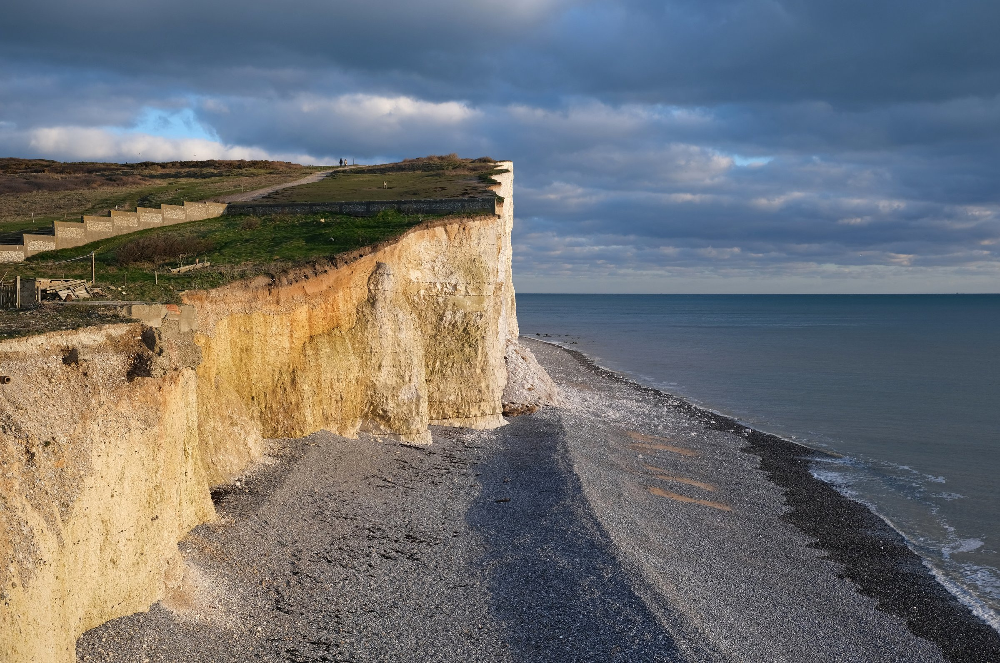
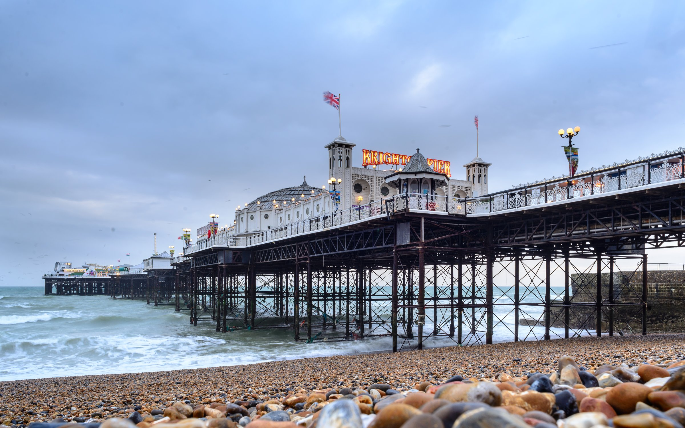
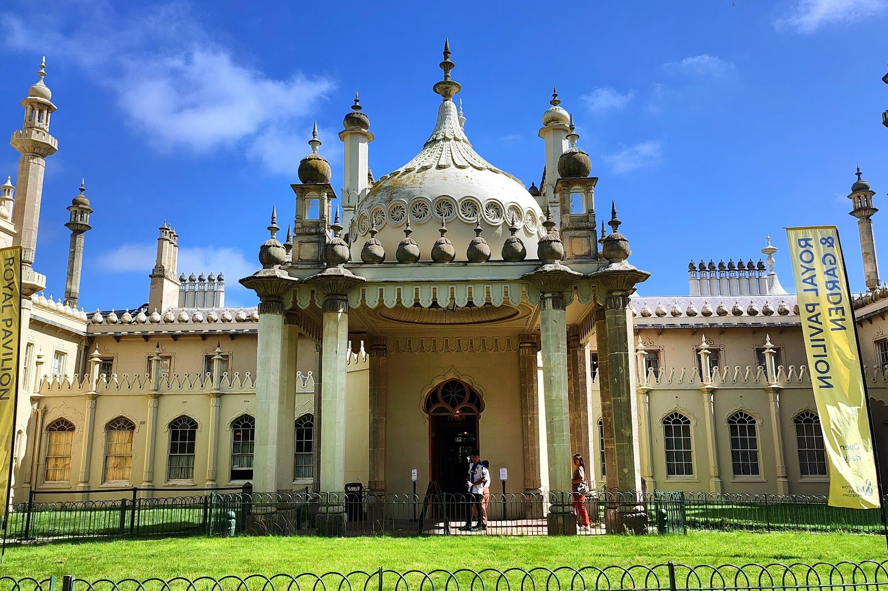
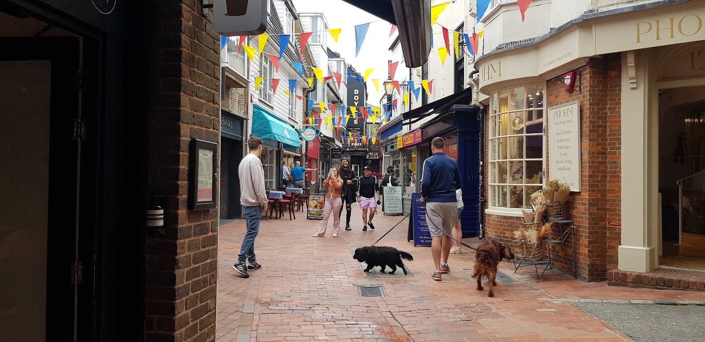
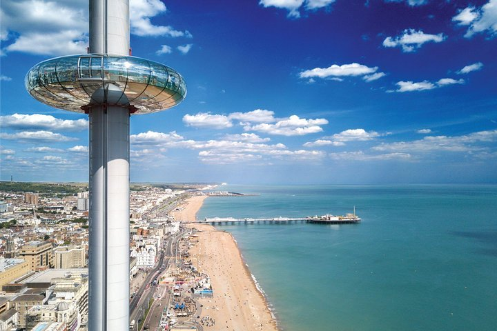
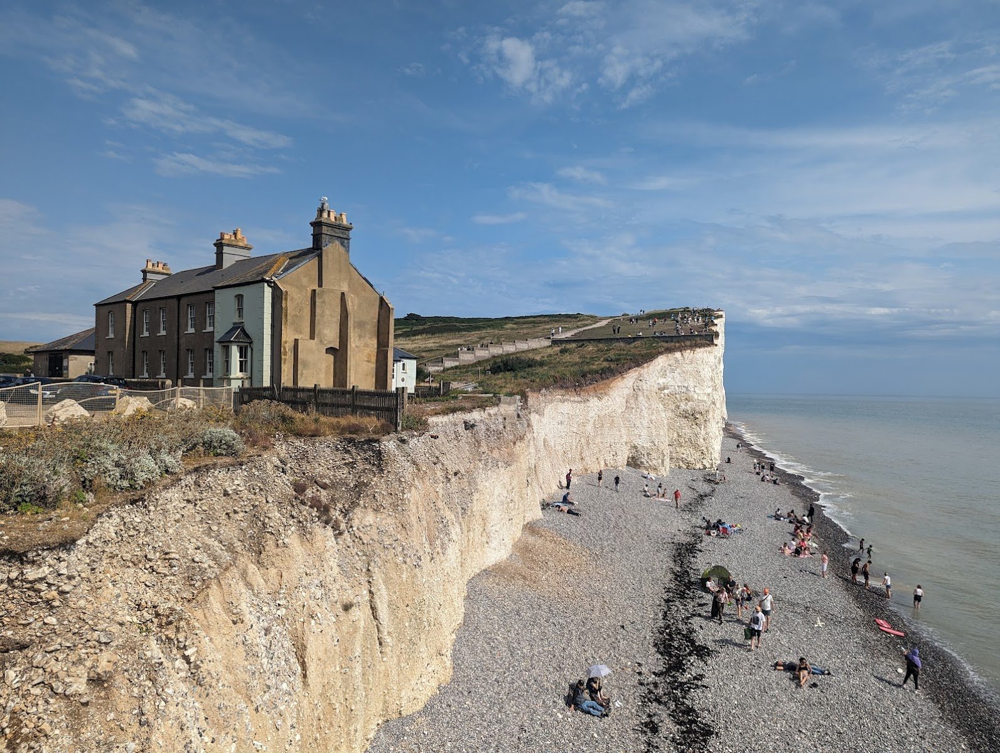

**Brighton is under an hour from Victoria or London Bridge, and the Seven Sisters chalk cliffs most people picture when they think of the English coastline are a bus ride further on from there.** That's the whole shape of the day: a seaside town with a pier, a Regency palace and a shopping district built into medieval lanes, and open chalk downland with a coastline that looks nothing like it twenty minutes later.

The two halves don't share a station, which is the part people get wrong. Brighton has its own direct trains from London; the Seven Sisters and Birling Gap don't, and need a bus or a second train once you're on the coast. Plan for both legs and the day works easily inside daylight hours, even in September.

> 💡 **The Short Version:** **Victoria or London Bridge to Brighton, under an hour direct**, Advance singles **from £8** one way. **The 12, 12A or 12X bus** from Brighton takes you on to the **Seven Sisters Country Park** at Exceat, flat fare **£3**; Birling Gap is a further 1.5-mile walk. **Royal Pavilion £21.50** (5% off booked online), **Brighton Pier admission £1** March–October, **Brighton i360 from £20.50**. **Stay at least 5 metres from the cliff edge** — the chalk erodes up to a metre a year and can collapse without warning. **Or book a tour instead** — <a href="https://www.getyourguide.com/activity/-t820119?partner_id=WWP7I0R&amp;cmp=brighton-seven-sisters-day-trip" target="_blank" rel="sponsored nofollow noopener" data-affiliate="gyg">the £105 Seven Sisters and Brighton Full-Day Tour</a> includes the train, Birling Gap, Seaford Head and a Brighton city tour in one booking, which saves you working out the bus connection yourself.

**Book a tour direct:**

- **£105** — <a href="https://www.getyourguide.com/activity/-t820119?partner_id=WWP7I0R&amp;cmp=brighton-seven-sisters-day-trip" target="_blank" rel="sponsored nofollow noopener" data-affiliate="gyg">Seven Sisters and Brighton Full-Day Tour, with train tickets included</a> — Birling Gap, Seaford Head and a Brighton city tour named on the itinerary
- **£109** — <a href="https://www.getyourguide.com/activity/-t122247?partner_id=WWP7I0R&amp;cmp=brighton-seven-sisters-day-trip" target="_blank" rel="sponsored nofollow noopener" data-affiliate="gyg">South Downs White Cliffs Day Trip, with train tickets included</a> — the best-reviewed of the three, 4.9 from 1,580 reviews
- **£84** — <a href="https://www.getyourguide.com/activity/-t395005?partner_id=WWP7I0R&amp;cmp=brighton-seven-sisters-day-trip" target="_blank" rel="sponsored nofollow noopener" data-affiliate="gyg">Brighton & Seven Sisters Small-Group Tour</a> — the cheapest of the three, capped group size

Powered by <a target="_blank" rel="sponsored" href="https://www.getyourguide.com/london-l57/">GetYourGuide</a>

*Birling Gap and the Seven Sisters.*

## Getting to Brighton

| | London → Brighton |
| --- | --- |
| **Operators** | Southern (from Victoria), Thameslink (from London Bridge and St Pancras), both direct |
| **Fastest** | **58 minutes** — distance is 47 miles |
| Frequency | 446 trains a day on the route |
| **Advance singles** | **From £8** one way, booked ahead |
| Oyster / contactless | **Neither works** — buy a ticket before you travel |

**Booking ahead is where the saving is**: Advance singles start at £8 one way, the same Advance-versus-walk-up pattern as most UK rail routes. Trains run frequently through the day on both operators, so there's rarely a reason to lock in one specific departure weeks out just to guarantee a seat. Which terminal you use comes down to which side of London you're starting from — the walk from Brighton station down to the seafront takes well under half an hour either way.

**The last train back leaves Brighton around 01:18**, later than most day trips in this series, which matters if you're staying for Brighton's evening rather than racing the Seven Sisters bus timetable. Check the specific time for your date before you commit to a late dinner.

## Getting to the Seven Sisters and Birling Gap

Neither the Seven Sisters Country Park nor Birling Gap has its own station. Get to Brighton first, then choose one of two ways onward.

**By bus, from Brighton.** The 12, 12A and 12X Coaster buses run along the coast road between Brighton, Newhaven, Seaford and Eastbourne, and all three call at the Seven Sisters Country Park visitor centre at Exceat — the Country Park's own advice is to use them rather than drive, since its car parks fill at peak times with no alternative parking nearby. A single fare is a flat **£3 anywhere on the network**, and a 24-hour ticket that covers multiple journeys runs to roughly £6–£7. **Birling Gap itself is a further 1.5-mile walk from the East Dean stop** on the same route; there's no direct bus into Birling Gap outside the seasonal timetable. The faster **13X limited-stop service** runs between Brighton and Seaford but skips the Seven Sisters and Birling Gap stops entirely, so it's only useful if Seaford itself is your destination.

**By train, to Seaford.** Southern runs a direct service from London on the Coastway East line via Lewes, about twice an hour off-peak, to Seaford — a longer journey than Brighton, at around 59 miles from London Bridge. From Seaford station it's **about an hour's walk** to the Seven Sisters Country Park visitor centre, and roughly **two hours on** from there to Birling Gap along the clifftop path. This only makes sense if walking the cliffs is the point of your day rather than a stop on it.

> 💡 **Doing both halves without a car means picking an order.** Brighton first, then the bus out to the cliffs and back, is the easier way round: the Coaster buses run all day, so you're not racing a single return service the way you would be coming from Seaford.

## Brighton and the Seven Sisters, compared: the day tours

Independent travel is cheaper and gives you longer in Brighton if you want it. A coach or train-inclusive day tour is worth the premium if working out the bus connection yourself, or fitting both halves into daylight hours, isn't something you want to plan.

| Tour | Hours | From | Rating | What it covers |
| --- | --- | --- | --- | --- |
| <a href="https://www.getyourguide.com/activity/-t820119?partner_id=WWP7I0R&amp;cmp=brighton-seven-sisters-day-trip" target="_blank" rel="sponsored nofollow noopener" data-affiliate="gyg">Seven Sisters and Brighton Full-Day Tour</a> | 9 | **£105** | 4.8 (345) | Train tickets included, Birling Gap, Seaford Head, a Brighton city tour and free time |
| <a href="https://www.getyourguide.com/activity/-t122247?partner_id=WWP7I0R&amp;cmp=brighton-seven-sisters-day-trip" target="_blank" rel="sponsored nofollow noopener" data-affiliate="gyg">South Downs White Cliffs Day Trip</a> | 9.5 | £109 | **4.9 (1,580)** | Train tickets included, a bus tour of the South Downs and a coastal walk to the Seven Sisters |
| <a href="https://www.getyourguide.com/activity/-t395005?partner_id=WWP7I0R&amp;cmp=brighton-seven-sisters-day-trip" target="_blank" rel="sponsored nofollow noopener" data-affiliate="gyg">Brighton & Seven Sisters Small-Group Tour</a> | 9 | **£84** | 4.7 (381) | Small-group format, Brighton and the Seven Sisters cliffs, no train specified |

**The Seven Sisters and Brighton Full-Day Tour is the one that names this guide's stops directly** — Birling Gap and Seaford Head both appear on its own itinerary, alongside a guided city tour of Brighton, and its price sits in the middle of the three. **The South Downs White Cliffs Day Trip is the better-reviewed option by a wide margin**, 4.9 from 1,580 reviews against a few hundred each for the other two, though its own description leans on the South Downs and the cliffs rather than naming Brighton itself, so check the itinerary if a proper look around the town matters to you. **The small-group tour is the cheapest of the three** and worth it if a smaller coach and more personal pace outweigh the saving the other two make on group size.

Powered by <a target="_blank" rel="sponsored" href="https://www.getyourguide.com/london-l57/">GetYourGuide</a>

## Brighton

### Brighton Pier

*Brighton Pier.*

**Walking onto the pier costs £1 a head, charged seasonally from March to October and at peak times only** — the charge stops once rides, kiosks and the restaurant start closing for the evening, and it's free outside that window entirely. Under-2s, Local Resident Card holders and anyone with a pre-booked rides wristband don't pay it either way. **The rides themselves are separate again**, bought individually on the pier or as a wristband online in advance. In late September the gates open at 11am with rides running to about 7:30pm; hours shift with the season, so check the day you're travelling.

### The Royal Pavilion

**£21.50 for an adult on the door, with 5% off standard admission booked online** — £13.00 for a child aged 5 to 18, and a family of one adult and two children gets one child ticket free. Residents of the BN1, BN2, BN3 and BN41 postcodes pay £16.50 for up to four children. **It's a 15–20 minute walk from Brighton station.** Open **9:30am to 5:45pm from April to September and 10am to 5:15pm from October to March**, last admission 45 minutes before closing, closed 25 and 26 December and 1 January. The audio guide is £3 in a group or £4 alone, or £3 on your own phone.

*The Royal Pavilion.*

### The Lanes

**A grid of narrow medieval alleyways bounded by North Street, Ship Street, Prince Albert Street and Bartholomew Square**, filled with antique dealers, jewellers and independent shops — the layout is the old fishing village Brighton grew from, unlike the wider Georgian streets around it. It costs nothing to walk through and is a natural link between the seafront and the station. North Laine, the separate grid of streets just north of here around Sydney Street and Kensington Gardens, is where the vintage clothing and record shops cluster if that's more your visit.

### Brighton i360

**The operator now trades simply as Brighton i360**, having dropped the British Airways branding from its name. **The standard View 360 ticket is from £20.50 through GetYourGuide**, and the whole visit — boarding, the ascent and the descent in the glass pod — takes about 30 minutes. The tower stands 162 metres tall on the seafront near the foot of the old West Pier, and typically opens by mid-morning, running into the evening; hours shift through the year, so check the date you're travelling.

## The Seven Sisters and Birling Gap

**The chalk cliffs are the reason to make the extra journey, and Birling Gap is the easiest place to stand at the bottom of them.** National Trust runs the car park, café and shop here, with steps down to the beach when the tide allows. **Parking is £2 for up to an hour, £4 for up to two hours and £8 beyond that**; NT members, motorcycles and Blue Badge holders park free, and there's no coach parking on site any more. The café and shop run **10am to 5pm until 24 October 2026, then 10am to 4pm** through the winter; the coastal path itself is open dawn to dusk year-round.

**Seven Sisters Country Park, back at Exceat, is the other end of the same stretch of coast** and the stop the Coaster buses serve directly. Car parking there is **£3.50 for up to two hours, £5 for up to four, £7 beyond that**, with no Blue Badge concession. The visitor centre and takeaway kiosk run the same seasonal hours as Birling Gap. **Walking between the two takes about two hours** along the clifftop path, over the Seven Sisters themselves — a walk worth doing only if you have the time and the boots for it, since there's no shortcut back once you've committed.

> ⚠️ **Stay at least 5 metres back from the cliff edge and base.** The chalk is unfenced and erodes at up to a metre a year; falls happen without warning and the path can be closer to the edge than it looks. If you need help on the cliffs, dial 999 or 112 and ask for the coastguard. The same caution applies further along the coast towards Beachy Head, where the cliffs are the highest on this stretch.

## How the day fits together

**Brighton first, then the coast, works better than the other way round.** A realistic shape: the 08:00 or earlier train into Brighton, the Royal Pavilion or a walk through the Lanes and down to the Pier through the late morning, lunch on the seafront, then the 12 or 12A bus out to Exceat or Birling Gap for the early-to-mid afternoon, before the same bus back into Brighton for the train home. Doing the cliffs first and Brighton second works too, but the bus timetable is the thing to check before you fix a plan either way, since it runs less often than the trains at either end of the day.

## What people get wrong

- **Assuming Brighton and the Seven Sisters share transport.** They don't — the train gets you to Brighton, and a separate bus or a second train gets you on to the cliffs.
- **Driving to Birling Gap or Seven Sisters Country Park expecting to park easily.** Both car parks fill at peak times with no useful alternative nearby; the bus is the recommended route for exactly this reason.
- **Trying to use Oyster or contactless for the train.** Neither works this far from London — buy a ticket before you travel.
- **Booking a coach tour by its title alone.** The three compared here cover similar ground for different prices and review counts — read the itinerary, not just the name.
- **Walking right up to the cliff edge for a photograph.** The chalk erodes unpredictably and the drop is not signposted every few metres.
- **Assuming the i360 or Pier have a single year-round admission time.** Both shift their hours with the season and the day of the week.

All prices and times checked 28 September 2026.

## Continue planning your day out

- 🗺️ **[Day trips from London](/articles/day-trips-from-london/)** — what the others cost, how long they take, and which days they are shut.
- 🗿 **[Stonehenge from London](/articles/stonehenge-day-trip/)** — the day trip here where a coach tour genuinely beats the train, unlike Brighton itself.
- 🐑 **[The Cotswolds from London](/articles/cotswolds-day-trip/)** — another destination where a bus timetable, not a train, decides your day.
- 🛁 **[Bath from London](/articles/bath-day-trip/)** — the other direct train over an hour out of London, priced and timed the same way.
- 🚇 **[Getting around London](/articles/getting-around-london-transport-guide/)** — how to reach Victoria and London Bridge before you set off.
- 🎟️ **[London transport costs and fares](/articles/london-public-transport-costs-and-fares/)** — how contactless and capping work on the London end of the trip.
