The British Museum holds about eight million objects and took 6.4 million visits in 2025, second only to the Natural History Museum among UK attractions. Entry is free. The exception is the Bayeux Tapestry, in Room 30 until 11 July 2027, which has its own timed ticket.

> 💡 **The Short Version:**
> - **Entry is free.** A free timed ticket from the museum's website is recommended; without one, entry depends on capacity and queues are expected. Every visitor goes through a security and bag check.
> - **The Bayeux Tapestry is separate and sold out until 2027.** Every ticket to 31 December 2026 has gone. General booking for 1 January to 31 March 2027 opens on **21 October 2026**. Adults are £33.
> - **Leave big bags behind.** Wheeled suitcases and bags over 40 x 40 x 50 cm or 8 kg are not allowed. The entrances are Great Russell Street and Montague Place.
> - **In one hour,** see the Rosetta Stone (Room 4), the Parthenon sculptures (Room 18) and the Assyrian lion hunt reliefs (Room 10). **In two,** go upstairs for the Egyptian mummies (Rooms 62 and 63), the Sutton Hoo helmet (Room 41) and the Lewis Chessmen (Room 40).
> - **Fridays are open late,** until 20:30. **Check the closures:** Room 41 (Sutton Hoo) is partially closed and Rooms 42 and 43 (Islamic world) are closed from 12 to 23 October 2026, and Room 4 (the Rosetta Stone) is closed from 11 to 22 January 2027. A <a href="https://www.getyourguide.com/activity/-t765419?partner_id=WWP7I0R&amp;cmp=british-museum-guide" target="_blank" rel="sponsored nofollow noopener" data-affiliate="gyg">two-hour guided tour with priority entrance on GetYourGuide</a> picks the route for you.

> ⚠️ **Bayeux Tapestry tickets to 31 December 2026 are sold out, and a free museum ticket does not include them.** The free events on 9 to 11 October are free to attend, but none of them gets you into Room 30.

---

## The Bayeux Tapestry

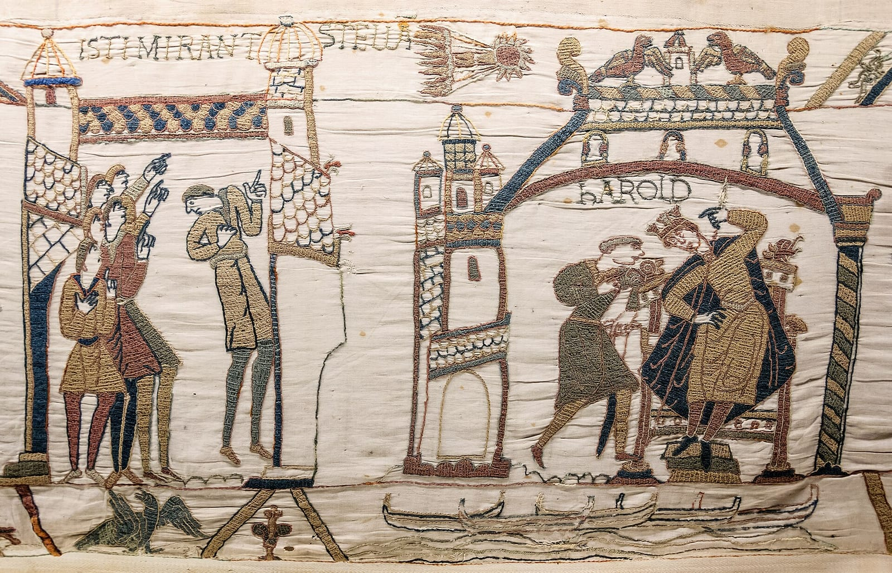

*Halley's Comet and King Harold, from the Bayeux Tapestry. Photo: [Myrabella](https://commons.wikimedia.org/wiki/File:Bayeux_Tapestry_32-33_comet_Halley_Harold.jpg) (public domain).*

The Bayeux Tapestry is an embroidered cloth nearly 70 metres long and 50 centimetres tall, telling the story of the Norman Conquest and the Battle of Hastings in 1066. It is in **Room 30, the Sainsbury Exhibitions Gallery**, from 10 September 2026 to **11 July 2027**, on loan from Bayeux and out of France for the first time in nearly a thousand years. Entry is by timed ticket only, and the [museum's exhibition page](https://www.britishmuseum.org/exhibitions/bayeux-tapestry) is where they are sold.

### Where tickets stand

- **10 September to 31 December 2026:** sold out.
- **1 January to 31 March 2027:** general booking opens on **21 October 2026**. Members' priority tickets for this window, like those for October to December, are already fully booked.
- **April to 11 July 2027:** the final members' priority window opens in January 2027, and general booking opens in early 2027.

Tickets are emailed four days before your visit. A booking takes up to ten tickets, only the booker can use them and ID may be checked; multiple bookings from the same email address are cancelled.

| Ticket | Standard slot | Off-peak slot |
| --- | ---: | ---: |
| Adult | £33 (£36.50 with the £3.50 donation) | £27 (£30.50 with donation) |
| National Art Pass | £16.50 | £13.50 |

Students, 16 to 18s and jobseekers pay £25. Disabled visitors pay £25 and an assistant goes free; booking is required. Under-16s are free with an adult, up to four per adult. The cheapest adult slot is £25 (£28.50 with donation), valid only on term-time weekdays between 15:30 and 16:20. Reciprocal entry and passes from ICOM, ICOMOS, MA and NMDC are not valid between September and December 2026.

### Inside Room 30

Allow about 40 minutes. Entry is timed and the route is one-way. Photography is allowed without flash; drawing and sketching are not. Buggies and large bags are not allowed in; the paid cloakroom is subject to capacity. The exhibition is open Sunday to Wednesday 10:00 to 18:00 and Thursday to Saturday 10:00 to 21:00, and staff start clearing the room ten minutes before closing.

The audio guide is free in the British Museum Audio app: download it before you come, and bring your own headphones.

### The free Bayeux events

Both sit alongside the exhibition without including it:

- **[Bayeux Late: medieval making](https://www.britishmuseum.org/events/bayeux-late-medieval-making), Friday 9 October, 17:30 to 20:30.** Workshops and activities, free to drop in at any time. Contributors include Matilda Ngute of The Textile Club, Olivia Swarthout of Weird Medieval Guys and the embroidery artist Bella Lane.
- **[Big Bayeux Bash](https://www.britishmuseum.org/events/big-bayeux-bash), Saturday 10 and Sunday 11 October.** Free drop-in family workshops inspired by the medieval world, for children aged six and over with their adults. First come, first served.
- **Bayeux Late: reimagining the Bayeux Tapestry, Friday 4 December,** also free.

---

## Getting in

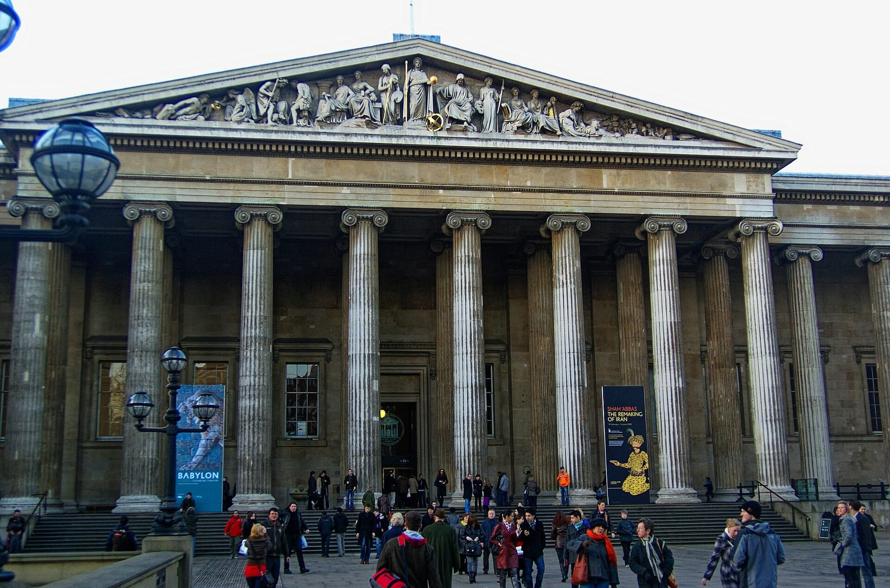

*The Great Russell Street front. Photo: [Txllxt TxllxT](https://commons.wikimedia.org/wiki/File:London_-_Great_Russell_Street_-_British_Museum_II.jpg), [CC BY-SA 4.0](https://creativecommons.org/licenses/by-sa/4.0/).*

General admission is free. A free timed ticket from the [museum's website](https://www.britishmuseum.org/visit) is recommended; without one, entry depends on capacity and queues are expected. Every visitor goes through a security and bag check, and wheeled suitcases and bags over 40 x 40 x 50 cm or 8 kg are not allowed.

- **Great Russell Street** is the main entrance, under the portico.
- **Montague Place** is the second entrance, on the north side.
- **Hours:** the galleries open daily 10:00 to 17:00, with last entry at 16:45, and on Fridays until 20:30, with last entry at 20:15. They start clearing ten minutes before closing. The Great Court stays open until 17:30, and until 20:30 on Fridays. The museum is closed on 24, 25 and 26 December.

The cloakroom is open 10:00 to 17:00 (20:30 on Fridays), with the last deposit an hour before closing. Turn left after the main entrance. Box office: +44 (0)20 7323 8181.

Powered by <a target="_blank" rel="sponsored" href="https://www.getyourguide.com/london-l57/">GetYourGuide</a>

---

## What to see in one or two hours

The museum is built to defeat completeness, so pick a few objects and walk straight to them. Rooms 4, 6, 10 and 18 are on the ground floor and make a one-hour loop; Rooms 40, 41 and 62 to 64 are upstairs.

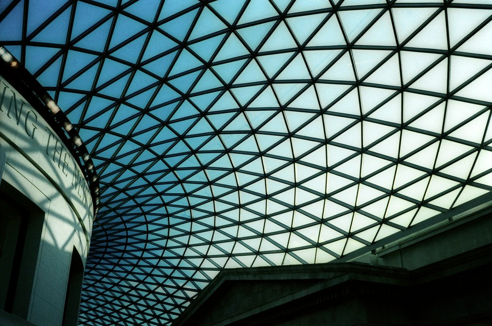

*The Great Court roof. Photo: [rbrwr](https://www.flickr.com/photos/38411862@N00/467099756), [CC BY-SA 2.0](https://creativecommons.org/licenses/by-sa/2.0/).*

### The Great Court

A glass roof by Foster + Partners over what was an open courtyard hidden from the public for 150 years, opened in 2000, with the circular Reading Room at its centre. It is one of the few places in central London where you can sit indoors without buying anything, and the Great Court itself is open until 17:30 (20:30 on Fridays).

### The Rosetta Stone, Room 4

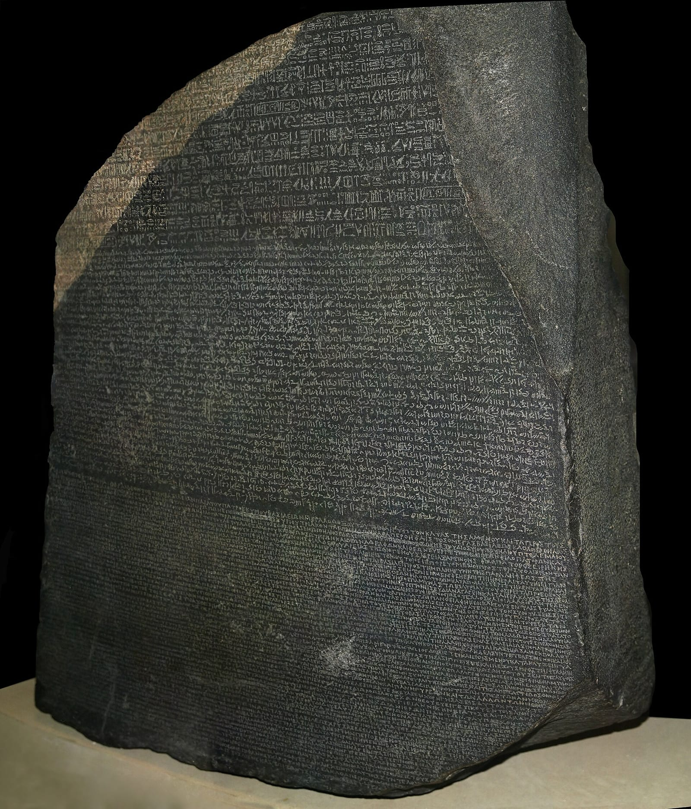

*The Rosetta Stone. Photo: [Hans Hillewaert](https://commons.wikimedia.org/wiki/File:Rosetta_Stone.JPG), [CC BY-SA 4.0](https://creativecommons.org/licenses/by-sa/4.0/).*

A decree of 196 BC carved in three scripts, found in 1799 and on display in London since 1802. The Greek text let scholars read the hieroglyphs, and Champollion announced the breakthrough in 1822. It sits in a case in the middle of the Egyptian sculpture gallery. **Room 4 is closed from 11 to 22 January 2027.**

### The Parthenon sculptures, Room 18

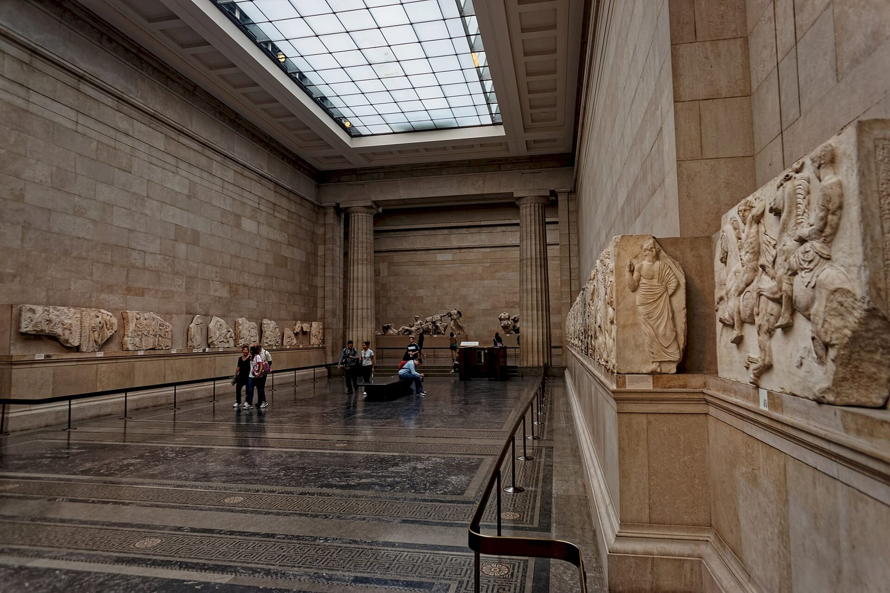

*The Parthenon sculptures in Room 18. Photo: [Txllxt TxllxT](https://commons.wikimedia.org/wiki/File:London_-_Great_Russell_Street_-_British_Museum_-_Greece-_Parthenon_-_Elgin_Marbles_-_View_NW_II.jpg), [CC BY-SA 4.0](https://creativecommons.org/licenses/by-sa/4.0/).*

Frieze panels, metopes and pediment figures made for the Parthenon in Athens in the fifth century BC, hung round a single skylit hall. The frieze is a procession of riders and sacrificial animals at eye level on the long walls; the reclining figures from the east pediment are at the far end.

### The Assyrian galleries, Rooms 6 and 10

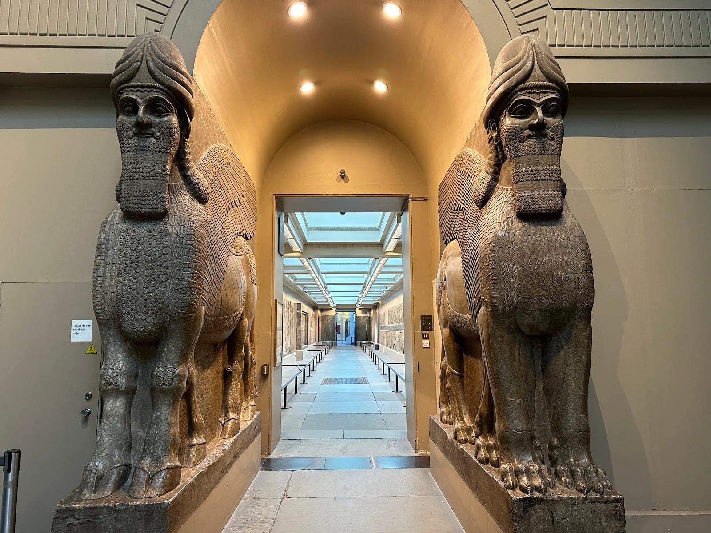

*The lamassu at the entrance to the Assyrian galleries.*

The human-headed winged bulls guard the doorway into the long Assyrian gallery. Beyond them, in Room 10, are the lion hunt reliefs from Ashurbanipal's North Palace at Nineveh, carved around 645 to 635 BC: the king on his chariot, lions shot with arrows, and a dying lioness with a spear through her.

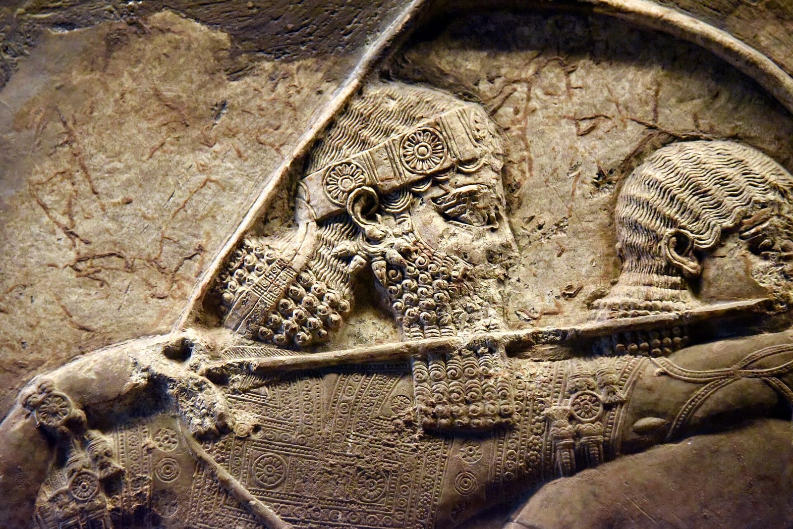

*Ashurbanipal, in the lion hunt reliefs. Photo: [Osama Shukir Muhammed Amin](https://commons.wikimedia.org/wiki/File:Assyrian_king_Ashurbanipal,_detail_of_a_lion-hunt_scene_from_Ninevah,_Iraq._British_Museum,_London.jpg), [CC BY-SA 4.0](https://creativecommons.org/licenses/by-sa/4.0/).*

### The Egyptian mummies, Rooms 62 and 63

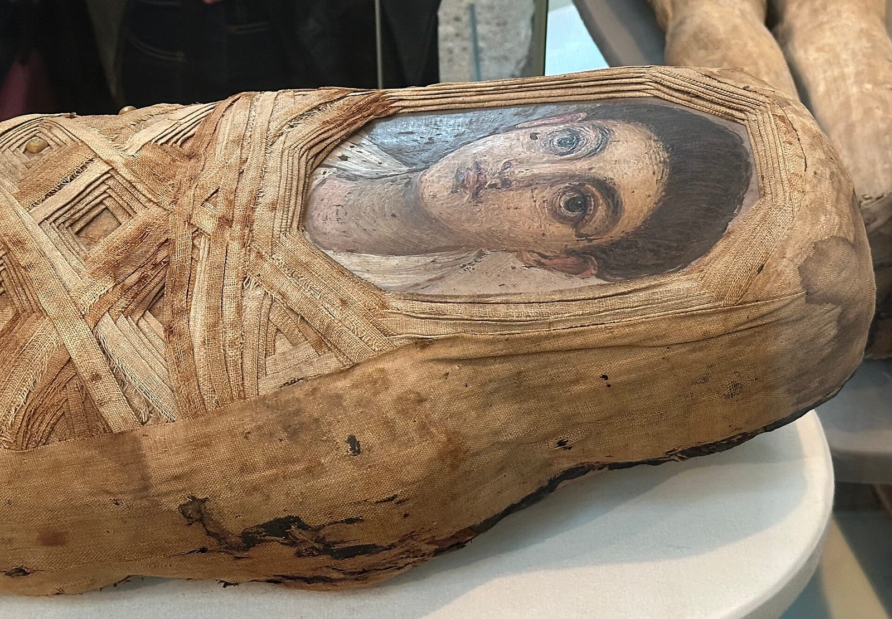

*A mummy with a painted portrait panel. Photo: [APK](https://commons.wikimedia.org/wiki/File:Mummy_of_an_adolescent_boy,_British_Museum.jpg), [CC BY 4.0](https://creativecommons.org/licenses/by/4.0/).*

Upstairs, the mummies and coffins fill Rooms 62 and 63. In Room 64 is Ginger, a man of about 18 to 23 who was buried in the sand around 3400 BC and preserved naturally, hair and skin included.

### The Sutton Hoo helmet, Room 41

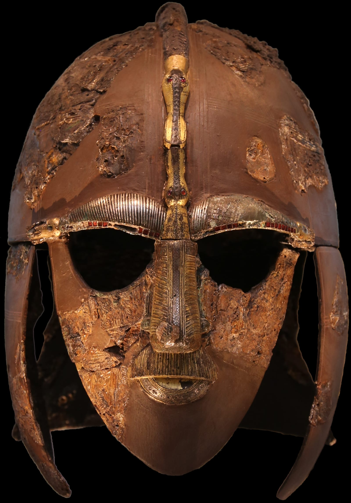

*The Sutton Hoo helmet. Photo: [Geni](https://commons.wikimedia.org/wiki/File:Sutton_Hoo_helmet_2016.png) (public domain).*

The helmet came out of an Anglo-Saxon ship burial in Suffolk, dug by Basil Brown in 1939 on land owned by Edith Pretty, who gave the finds to the museum. The original is reconstructed from fragments and shown beside a replica of how it looked whole. **Room 41 is partially closed from 12 to 23 October 2026.**

### The Lewis Chessmen, Room 40

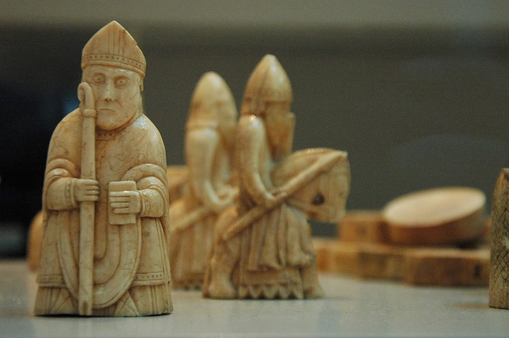

*The Lewis Chessmen. Photo: [Helen Simonsson](https://commons.wikimedia.org/wiki/File:Lewis_chessmen,_British_museum,_London.jpg), [CC BY-SA 2.0](https://creativecommons.org/licenses/by-sa/2.0/).*

Walrus-ivory chess pieces found on the Isle of Lewis, probably made in Norway around AD 1150 to 1200. The museum holds 82 of them and the National Museum of Scotland holds 11. The berserkers bite their shields, and the queens rest a hand on their cheek.

### Planned closures

The museum publishes [planned gallery closures](https://www.britishmuseum.org/visit#gallery-information). The dated ones:

- **Room 41 (Sutton Hoo) partially, and Rooms 42 and 43 (Islamic world):** 12 to 23 October 2026.
- **Reading Room:** 13 and 20 November 2026.
- **Room 4 (Rosetta Stone), Rooms 6a and 9:** 11 to 22 January 2027.
- **Rooms 7 and 8:** 8 to 19 February 2027.

---

## Paid exhibitions and free extras

- **Korea** runs from 1 October 2026 to 31 January 2027. It is ticketed and booked separately on the [exhibitions page](https://www.britishmuseum.org/exhibitions-events).
- **Declaring Independence: USA 250** is free and runs through October 2026.

---

## Tours

The museum is easier with a route chosen for you. A <a href="https://www.getyourguide.com/activity/-t765419?partner_id=WWP7I0R&amp;cmp=british-museum-guide" target="_blank" rel="sponsored nofollow noopener" data-affiliate="gyg">two-hour guided tour with priority entrance on GetYourGuide</a> takes the main objects in order, and the widget above shows availability by date. Entry itself is free, so what you are paying for is the guide.

Powered by <a target="_blank" rel="sponsored" href="https://www.getyourguide.com/london-l57/">GetYourGuide</a>

---

## Practical information

### Getting there

- **Tube:** Russell Square (Piccadilly line), about five minutes' walk. Holborn (Central, Piccadilly) and Tottenham Court Road (Elizabeth line, Central, Northern) are both about seven.
- **For Montague Place,** come in from Russell Square, or walk round from Tottenham Court Road.

### Food and drink

- **Court Cafés,** Great Court ground floor, 10:00 to 17:00.
- **Great Court Restaurant,** 11:30 to 17:00, last sitting 16:00. Booking is essential, though walk-ins are sometimes taken.
- **Pizzeria,** south-west corner of the ground floor, left after the main entrance, 11:00 to 16:00.
- **Coffee Lounge,** first floor overlooking the Reading Room, 10:30 to 16:30.

For a sit-down meal outside, Charlotte Street in Fitzrovia is about eight minutes' walk west across Tottenham Court Road; our [Fitzrovia guide](/articles/fitzrovia-area-guide/) covers it.

### Step-free access

Montague Place is step-free, and the Great Russell Street entrance has lifts either side of its 12 steps. Rooms 16, 67, 69 and 95 have no lift or level access. There is no Changing Places toilet on site; the museum points visitors to Great Ormond Street Hospital, 15 minutes' walk from Montague Place. Free wheelchair loans need two working days' notice, booked on weekdays, and staff cannot push wheelchairs. Concession exhibition tickets come with a free companion ticket. Our [step-free London guide](/articles/step-free-london/) covers the rest.

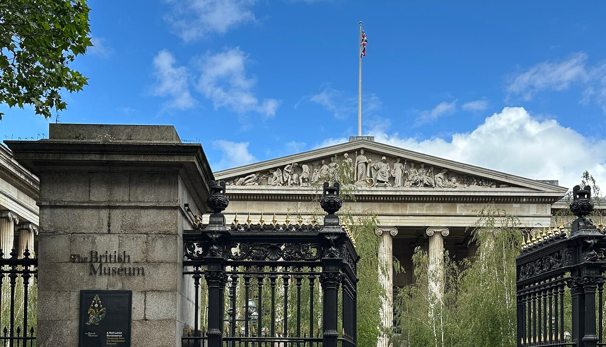

*The Great Russell Street gates. Photo: [APK](https://commons.wikimedia.org/wiki/File:British_Museum_from_Great_Russell_Street_with_sign.jpg), [CC BY 4.0](https://creativecommons.org/licenses/by/4.0/).*

### Common mistakes to avoid

- **Turning up for the Bayeux Tapestry without a ticket.** It is timed and booked online; the museum's free entry ticket does not include it.
- **Bringing a wheeled suitcase.** Wheeled suitcases and bags over 40 x 40 x 50 cm or 8 kg are not allowed.
- **Trying to see everything.** Pick three galleries and leave.

---

## Nearby

The British Museum sits in Bloomsbury, so the garden squares, Lamb's Conduit Street and the small free museums are all within ten minutes. Sir John Soane's Museum, a house kept as its owner left it in 1837, is covered in [the best museums in London](/articles/best-museums-london/).

---

## Continue planning your London trip

- 🏛️ **[Bloomsbury Area Guide](/articles/bloomsbury-area-guide/)** — the garden squares, bookshops and small museums around the British Museum.
- 🛏️ **[Where to Stay in Bloomsbury](/articles/where-to-stay-bloomsbury/)** — hotels a few minutes' walk from the colonnade.
- 🖼️ **[Best Museums in London](/articles/best-museums-london/)** — the other free national museums and the small ones nearby.
- 💷 **[London on a Budget](/articles/london-on-a-budget/)** — free sights and booking hacks across Zone 1.
- 👨‍👩‍👧 **[London with Children](/articles/london-with-children/)** — the museum as part of a day with children.
- ♿ **[Step-Free London](/articles/step-free-london/)** — the British Museum's lifts and entrances alongside the other big sights.
- 🌧️ **[London in the Rain](/articles/london-in-the-rain/)** — the museum as an all-day indoor plan.
- 🍂 **[Things to Do in London in October](/articles/things-to-do-in-london-in-october/)** — the Bayeux events and what else is on in October 2026.
- 🗺️ **[Three Days in London Itinerary](/articles/three-days-in-london-itinerary/)** — where the museum fits into a Zone 1 plan.
- 🏰 **[Tower of London Guide](/articles/tower-of-london-guide/)** and **[Westminster Abbey Guide](/articles/westminster-abbey-guide/)** — the two historic sights most visitors pair with it.

---

*Opening hours, closures, Bayeux Tapestry ticket dates and prices are the British Museum's own, as published on britishmuseum.org on 7 October 2026.*
