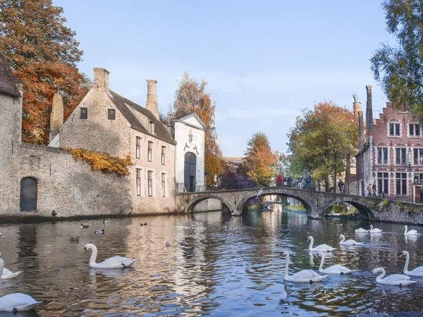
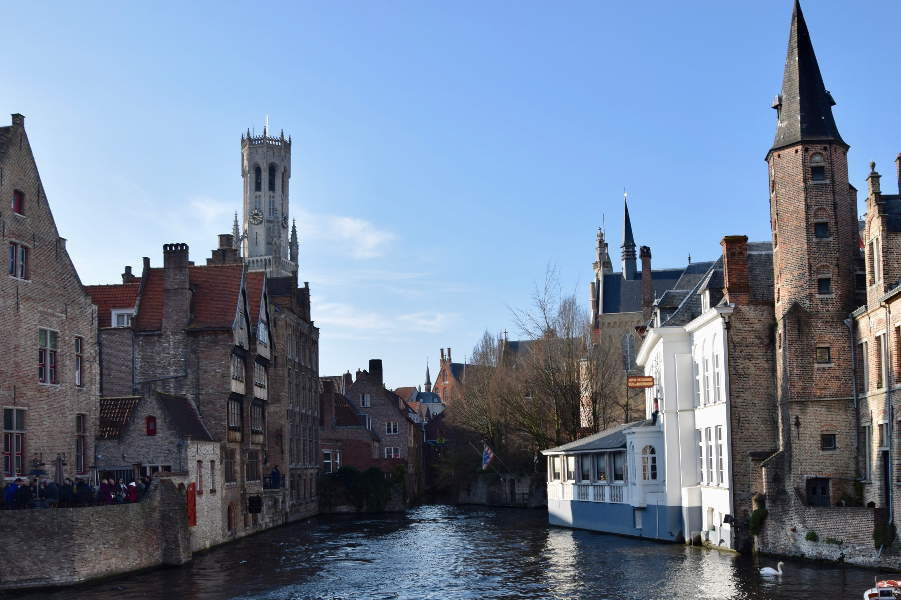
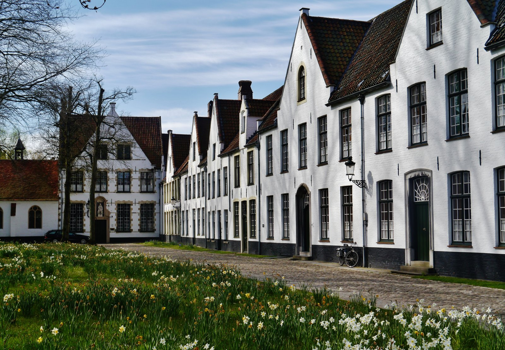
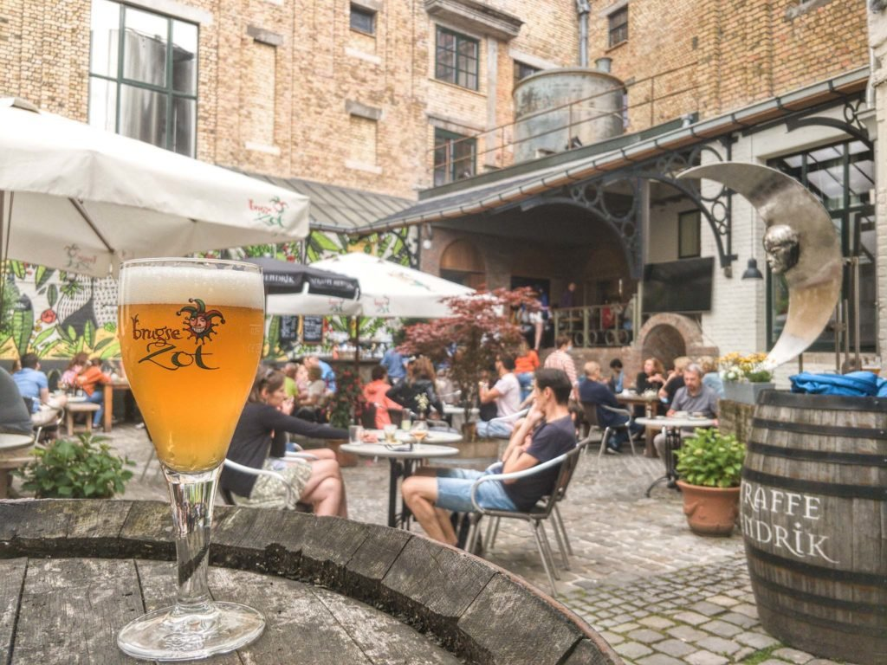

**St Pancras to Bruges is a four-hour trip with one change, and the two legs are priced and booked completely separately: Eurostar Standard to Brussels from £39 one-way, then a fixed-price Belgian train ticket for the last hour, from €17.60.** There's no single through-ticket any more — Eurostar stopped selling one in 2025 — and no coach tour does the trip from London either. This is a train day, done in two bookings.

That makes Bruges a slightly different proposition from Paris or Brussels itself: you're not stepping off the Eurostar into the city, you're changing onto a regional service for another hour. But Bruges rewards the extra leg. The old centre is small enough to cover on foot, ringed by a canal, and it doesn't have a single sprawling must-see the way Paris has the Louvre — the Belfry, the canals, the Begijnhof and a chocolate shop or two are a full and unhurried day.

> 💡 **The Short Version:** **St Pancras to Brussels-Midi on Eurostar, then change for Bruges.** Eurostar Standard from **£39** one-way; the connecting Belgian train is a separate ticket, **€17.60** each way in 2nd class on weekdays, **€12.30** at weekends, bought at Brussels-Midi with no reservation needed. **Arrive 75 minutes before departure** at St Pancras (Standard/Plus) — UK exit, EU entry and EES biometric registration all happen before you board. You need **a passport, not an ID card**, issued within **10 years** and valid **3 months** after you leave; **ETIAS isn't required yet**. The realistic **07:04 Eurostar** gets you into Bruges by **11:26**, and the last train that gets you home same-day leaves Bruges at **18:58** — call it **seven and a half hours** in the city. **There's no London coach tour to Bruges** — the round drive is too long for a day — but you can still book ahead: the <a href="https://www.getyourguide.com/activity/-t399508?partner_id=WWP7I0R&amp;cmp=bruges-day-trip" target="_blank" rel="sponsored nofollow noopener" data-affiliate="gyg">£38 boat, chocolate and walking tour</a> is the way round the fact that you can't pre-book an individual canal boat ticket any other way — you queue for one on the day. **If you'd rather stay the night** than work back from the last train, [Where to stay](#where-to-stay) has four hotels — one a level walk from Brugge station.

**Book a tour direct:**

- **£38** — <a href="https://www.getyourguide.com/activity/-t399508?partner_id=WWP7I0R&amp;cmp=bruges-day-trip" target="_blank" rel="sponsored nofollow noopener" data-affiliate="gyg">Bruges: Boat, Chocolate and Guided Walking Tour, small group</a> — 4.8 from 4,999 reviews, 2.5 hours, and the boat seat is guaranteed rather than queued for
- **£51** — <a href="https://www.getyourguide.com/activity/-t851218?partner_id=WWP7I0R&amp;cmp=bruges-day-trip" target="_blank" rel="sponsored nofollow noopener" data-affiliate="gyg">Belgian Chocolate-Making Workshop with Beer Tasting</a> — make your own pralines, then taste your way through Belgian beer, 2 hours
- **£34** — <a href="https://www.getyourguide.com/activity/-t1184030?partner_id=WWP7I0R&amp;cmp=bruges-day-trip" target="_blank" rel="sponsored nofollow noopener" data-affiliate="gyg">Walking Tour with Chocolate Tasting and Boat Ride</a> — the same three elements on a different schedule, 4.8 from 229 reviews

Powered by <a target="_blank" rel="sponsored" href="https://www.getyourguide.com/london-l57/">GetYourGuide</a>

## Getting there: Eurostar to Brussels, then a Belgian train

| | London St Pancras → Brussels-Midi |
| --- | --- |
| **Operator** | Eurostar, direct |
| **Journey time** | **Typically 2h01**, calling at Lille; around 10 departures a day |
| Eurostar Standard | **From £39** one-way, lead-in fare |
| Recommended arrival, St Pancras | **75 min** before (Standard/Plus), 45 min (Premier) |
| Booking window | Released **10–11 months** ahead |

Eurostar's own site was quoting Standard fares to Brussels from £39 one-way on 27 September 2026 — like every Eurostar fare, that's a lead-in price for the cheapest seat on the cheapest date, and it climbs the closer you book to travel. Plus and Premier both cost more for a wider seat, a meal and lounge access; the classes work the same way on every Eurostar route (see the comparison further down this guide's [Paris day trip](/articles/paris-day-trip/), which breaks down what each one adds).

Brussels-Midi is not the end of the journey. Change there onto a Belgian InterCity train — three an hour, heading for Ostend, Knokke or Blankenberge, all of which call at Bruges — for the last leg.

### Brussels to Bruges: a separate ticket, and a separate train

**The connecting train from Brussels-Midi to Bruges takes about an hour**, calling at Ghent St Pieters roughly halfway. It's a fixed-price Belgian domestic ticket, unrelated to your Eurostar booking:

| Belgian ticket, Brussels-Midi → Bruges | 2nd class | 1st class |
| --- | --- | --- |
| **Standard fare, weekday** | **€17.60** | €28.00 |
| **Weekend / public holiday fare** | **€12.30** | €19.70 |
| Youth (under 26) | €10.60 | €16.90 |
| Senior (65+) | €10.60 | €16.90 |

These are fixed prices with unlimited availability, good for any train that day — no reservation and no booking ahead needed. Up to four children under 12 travel free with a fare-paying passenger over 12. Buy it at a machine or the ticket office at Brussels-Midi once you're through the Eurostar gates; there's no need to book it from the UK.

> ⚠️ **Eurostar used to sell this as one ticket, and no longer does.** Until 31 March 2025, Eurostar sold an "Any Belgian Station" fare that covered onward travel to Bruges, Ghent or Antwerp on the same booking — SNCB, the Belgian operator, asked Eurostar to stop, and Eurostar withdrew it at SNCB's request. Eurostar's own app copy still references "any Belgian station"; the wording has outlived the ticket. Eurostar has said it may start selling through tickets to specific Belgian stations again, but hadn't as of September 2026 — budget for two separate tickets.

## Check-in and the border

St Pancras is where the whole border process happens, not Brussels-Midi on the way in. Eurostar's own recommended arrival times:

| Station | Class | Recommended arrival | Gate closes |
| --- | --- | --- | --- |
| **St Pancras** (outbound) | Standard / Plus | **75 min before** | 30 min before |
| St Pancras (outbound) | Premier | 45 min before | 15 min before |
| **Brussels-Midi** (return) | Standard / Plus | **45–60 min before** | 30 min before |
| Brussels-Midi (return) | Premier | 30–45 min before | 15 min before |

**You need a passport, not an ID card.** Since Brexit, UK nationals are non-EU travellers on this route. Your passport must have been **issued less than 10 years before** the date you enter Belgium and stay **valid for at least 3 months after** the day you leave — a passport that fails either rule is turned away at the gate.

**EU Entry/Exit System (EES) registration** happens at St Pancras before you board: a passport scan, a facial photo and, on your first crossing, fingerprints, at a self-service kiosk ahead of the ticket gates. It's free and needs no advance application.

**ETIAS, the EU's separate pre-travel authorisation scheme for visa-exempt visitors, is not required yet.** The EU had been targeting the last quarter of 2026 for launch, then dropped that date from its own site in August 2026 without setting a new one. No ETA or visa is needed for a UK citizen travelling out to Belgium either way; the UK's own Electronic Travel Authorisation only applies to foreign nationals entering Britain.

**Luggage:** one handbag or daypack plus two further items up to 85cm at their widest point for Standard and Plus, three bags plus the daypack for Premier. No weight limit, but you carry and store it yourself.

## Is Bruges actually doable as a day trip?

Yes, and the sums work in your favour once you're there, because the border admin is on the way in, not adding to both ends.

On a weekday, the earliest sensible Eurostar is **07:04 from St Pancras**, arriving Brussels-Midi at **10:05**. The connecting InterCity leaves Brussels-Midi at **10:29** — a 24-minute change — and reaches Bruges at **11:26**. (There's an earlier 06:16 Eurostar that lands in Bruges by 10:26, but that means checking in at St Pancras by around 05:00, which is a lot to ask for a day trip.)

Coming back, the **last connection that gets you home the same night** leaves Bruges at 18:58, reaches Brussels-Midi at 19:53, and the Eurostar departs at 20:56, landing at St Pancras at 21:57.

That's **11:26 to somewhere around 18:00** once you allow time to get to the station — call it **seven to seven and a half hours** in Bruges. It's a longer day than Windsor or Bath, but a shorter one than Paris, and Bruges' old centre is compact enough that you don't lose much of it to transit once you've arrived: nothing covered in this guide is more than a 15-minute walk from anything else.

## Getting into the centre from the station

**Bruges' station is simply called "Brugge"** — it's on the edge of the historic centre, not a satellite station you need transport from. It's a **20-minute walk** to the Markt, or a frequent De Lijn bus covers the same ground if you'd rather not walk in with luggage. There's no need to book a taxi in advance; the walk is flat, well signed, and takes you past the Begijnhof and Minnewater ("the Lake of Love") on the way in.

*Minnewater, the "Lake of Love".*

## The Markt and the Belfry

*The Belfry seen from the Rozenhoedkaai. Photo: [Ank Kumar](https://commons.wikimedia.org/wiki/File:Rozenhoedkaai_(canal)_and_Belfry_of_Bruges,_Bruges,_Belgium_(Ank_Kumar,_Infosys_Limited)_01.jpg), [CC BY-SA 4.0](https://creativecommons.org/licenses/by-sa/4.0/).*

**The Markt is the square everything else in Bruges points back to**, framed by the guild houses on one side and the 83-metre Belfry on the other. Climbing it means **366 steps**, and the reward at the top is a view over the whole city and, on a clear day, out to the coast. On the way up you pass the old treasury, where the city's seals and funds were kept in the Middle Ages, and the room holding the keyboard used to play the 47-bell carillon — the city still employs its own carillonneur, who plays it live on **Wednesdays, Saturdays and Sundays, 11:00 to 12:00**.

| Belfry ticket | Summer (1 Apr–2 Nov) / weekend / Christmas | Winter weekday (3 Nov–31 Mar) |
| --- | --- | --- |
| **Adult** | **€16** | **€15** |
| Under 18 | €14 | €13 |
| Under 7 | Free | Free |

**Book online ahead if you can — it's a busy location and last entry is one hour before closing.** Opening hours run **9:00–20:00 daily** through summer; in winter it's **10:00–18:00 Monday to Friday and Sunday**, but Saturdays keep the longer 9:00–20:00 hours year-round. The Belfry has been UNESCO-listed since 1999 as one of 56 surviving medieval belfries across Belgium and France.

> ⚠️ **The Belfry is closed to visitors from 19 to 22 October 2026 for maintenance work.** If your day falls in that window, the Markt itself, the guild houses and the Historium next door (Markt 1, with a VR ride through medieval Bruges) are still open — it's only the tower climb that's affected.

## The canals and the boat trips

Bruges' canals — 'reien' locally — are the reason the city is nicknamed the Venice of the North, and a boat is the way to see the backs of buildings the streets don't show you. **Five boat companies run the same 30-minute route between Jan van Eyck Square and the Begijnhof**, at identical prices, from five separate jetties: Huidenvettersplein, Rozenhoedkaai, Wollestraat, Nieuwstraat and Katelijnestraat.

| Boat trip | Price |
| --- | --- |
| **Adult** | **€15.00** |
| Child (4–11) | €9.00 |
| Under 4 | Free |

**You can't book an individual ticket in advance — you simply buy one at the jetty and wait your turn**. On a sunny afternoon that queue can run long, and it catches people out. Boats run daily from 10:00 to 18:00, March through October; from November to February one jetty is guaranteed open on a rotation, with the other four opening at their own discretion. None of the five companies' boats are wheelchair accessible, since every jetty is reached by steps down to water level.

Powered by <a target="_blank" rel="sponsored" href="https://www.getyourguide.com/london-l57/">GetYourGuide</a>

## The Begijnhof

Through a gate off Wijngaardplein, the **Begijnhof — the "Princely Beguinage Ten Wijngaerde," founded in 1245** — is a walled cluster of whitewashed houses around a quiet, tree-lined garden. It was built for the beguines: lay women who lived a religious, celibate life without joining a full convent order. Today it houses single women from Bruges alongside a small number with a religious vocation, and it's still lived in, not preserved as a museum piece.

*The Begijnhof.*

**Entry is free**, and it's UNESCO World Heritage-listed. The one thing to know before you go in: the Begijnhof asks visitors to keep to a genuine hush, not a polite murmur — this is somebody's home, not a courtyard attraction, and the City of Bruges is explicit that it expects every visitor to respect that.

## Chocolate and beer

**Belgian beer culture was recognised by UNESCO as intangible cultural heritage in 2016**, and Bruges' own brewery, **De Halve Maan on Walplein**, has been making beer in the same spot since 1856, now in its sixth generation of the same family. Its **Classic tour (45 minutes, €16, including one beer)** takes you through the brewing hall and up 220 steps to a rooftop with a 360-degree view of the city, ending with an unfiltered Brugse Zot or Straffe Hendrik — this is the only place in the world you can drink either beer unfiltered. The **XL tour (90 minutes, €26, including three beers)** adds a tasting session in the original cellars, but runs weekends only. Under-6s go free on either tour; 7 to 15s pay €8.50.

For chocolate, **The Chocolate Line on Simon Stevinplein**, founded by Dominique Persoone, was voted Belgium's best chocolate shop by Gault & Millau in 2023 — known for flavours well outside the usual praline range and for collaborations with Michelin-starred restaurants and fashion houses. It's open **9:30–18:30 Tuesday to Saturday, 10:30–18:30 on Sundays and Mondays**. If you'd rather see how chocolate is made than just buy it, **Choco-Story, the chocolate museum on Wijnzakstraat**, is open daily, 10:00–18:00, with last tickets at 17:00.

*De Halve Maan's courtyard.*

## Where to stay

Stay near Brugge station if the plan is an early train home or on to Ghent or Brussels the following morning; stay in the old centre if you'd rather still be a two-minute walk from the Markt once the day-trippers have gone.

- **[Guesthouse Keizershof](hotelscom:h13168703)** — on Oostmeers, a level walk to Brugge station and on the same route into town as the Begijnhof and Minnewater; the Markt is a further ten minutes on. A small family-run guesthouse, price band £, with breakfast at the neighbouring restaurant.
- **[Hotel Dukes' Palace Bruges](hotelscom:h1853344)** — on Prinsenhof, a few minutes from the Burg and the Markt and about twenty from the station; a 5-star hotel built through a former ducal palace, price band £££, with a spa — sauna and jacuzzi — that's the reason to pick it over a plainer central room.
- **[Hotel Heritage](hotelscom:h66083)** — on Niklaas Desparsstraat, just off the Markt and about twenty minutes from the station; a Relais & Chateaux townhouse hotel in a 19th-century mansion, price band £££, on a quiet side street despite the location.
- **[Hotel Botaniek](hotelscom:h4320447)** — on Waalsestraat, close to the Burg and about twenty minutes from the station; a nine-room townhouse hotel, price band ££, with breakfast included and served until 10:30am.

## What people get wrong

- **Assuming one ticket covers the whole trip.** Eurostar stopped selling the through fare to Belgian stations in March 2025 — budget for a separate Belgian ticket at Brussels-Midi.
- **Looking for a London coach tour to Bruges.** It doesn't exist as a same-day product; the drive alone is close to nine hours round trip.
- **Turning up at a boat jetty expecting a short wait.** Individual tickets can't be booked ahead, and the queue on a busy afternoon can eat half an hour.
- **Planning the day around the very last Eurostar back.** Work backwards from the last Belgian train that still makes your Eurostar connection, not from Eurostar's own last departure of the night.
- **Visiting on a day the Belfry is shut for maintenance.** Check the 19–22 October 2026 closure before booking a specific date.
- **Expecting the beguines' courtyard to be a normal tourist stop.** The Begijnhof is still lived in, and the City of Bruges asks for real quiet, not just lowered voices.

All prices and times checked 27 September 2026.

## Continue planning your trip

- 🇫🇷 **[Paris day trip](/articles/paris-day-trip/)** — the other Eurostar day trip from London, and how the border process and the hours compare.
- 🎢 **[Disneyland Paris from London](/articles/disneyland-paris-from-london/)** — the Eurostar to a theme park, by way of Paris or Lille.
- 🇧🇪 **[Brussels day trip](/articles/brussels-day-trip/)** — if the extra Belgian train is one leg too many, Brussels itself is two hours from St Pancras.
- 🇳🇱 **[Amsterdam from London](/articles/amsterdam-from-london/)** — the direct Eurostar via Brussels and Rotterdam, better as a night away than a day.
- 🚂 **[St Pancras hotels: where to stay in King's Cross](/articles/where-to-stay-kings-cross/)** — for the earliest trains, when checking in the night before beats a 5am alarm.
- 🗺️ **[King's Cross area guide](/articles/kings-cross-area-guide/)** — what's around St Pancras if you arrive back with the evening still ahead of you.
- 🚇 **[London transport costs and fares](/articles/london-public-transport-costs-and-fares/)** — getting to St Pancras itself before the Eurostar leg begins.
- 🗺️ **[Day trips from London](/articles/day-trips-from-london/)** — how Bruges compares with Paris, Bath, Stonehenge and the rest.
