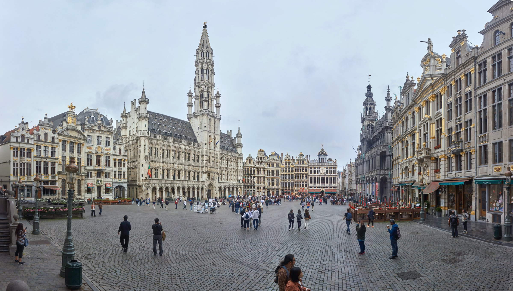
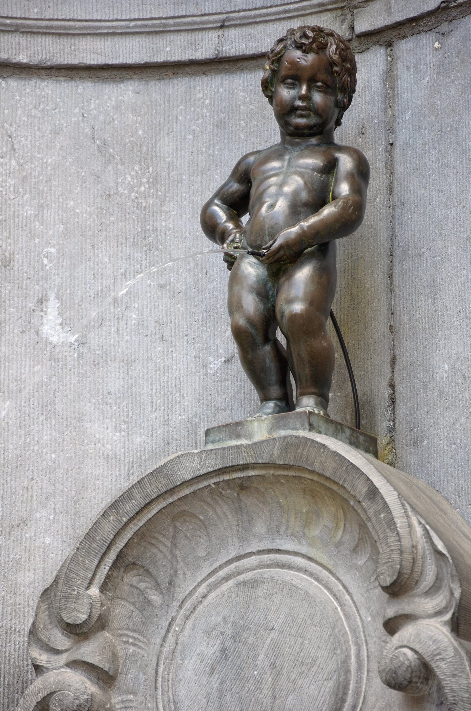
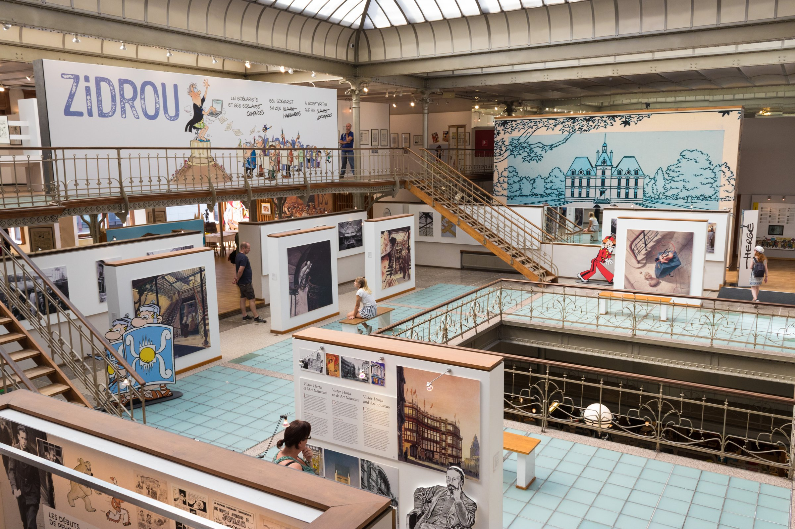
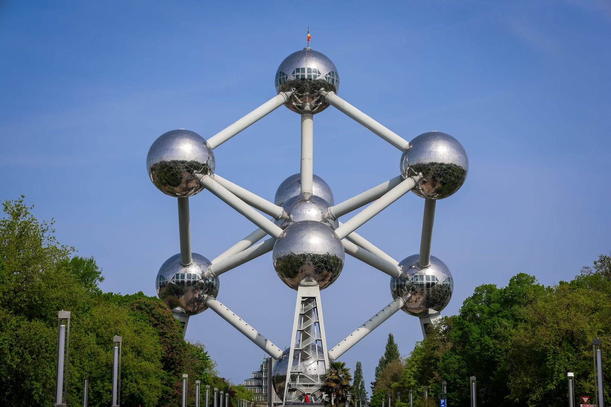
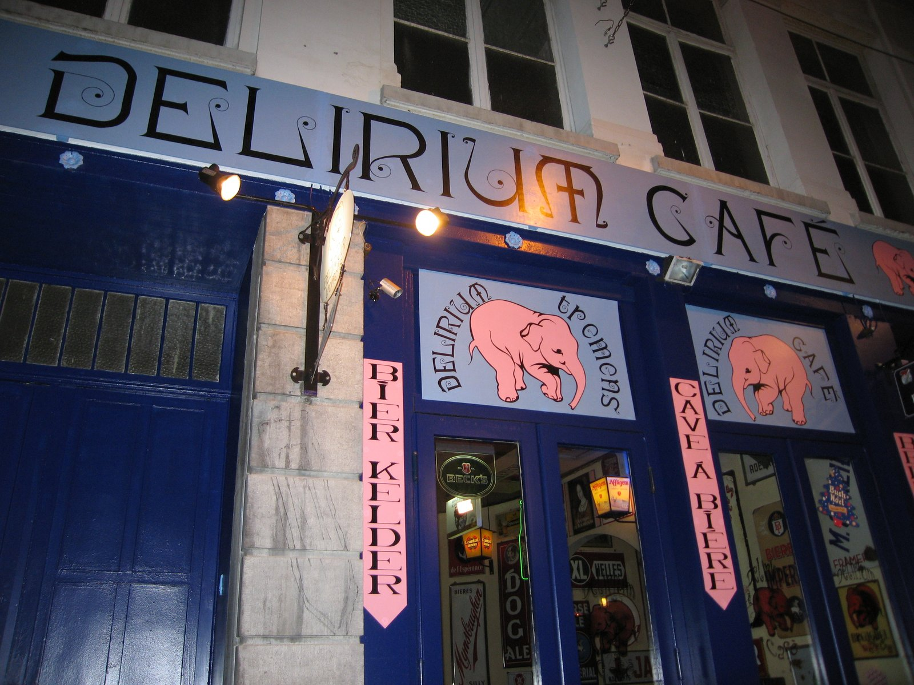

**St Pancras to Brussels-Midi is as little as 1 hour 51 minutes on Eurostar's fastest trains, and the fare that seat sells for starts around £51 in Eurostar Standard booked ahead — cheaper and faster than the same railway's trip to Paris.** Both figures come from Eurostar's own booking engine and two independent timetable checks, all run the same day.

Brussels gets less attention than Paris as a Eurostar day trip, which is exactly what makes the maths work in your favour: a shorter train, the same border process to learn once, and — if you take one of the earlier departures — close to a full working day in the city before you need to think about the platform home.

> 💡 **The Short Version:** **St Pancras to Brussels-Midi, from 1h51 direct** (1h57–2h06 on the trains we checked). Eurostar Standard **from £51** one-way booked ahead (£39 on some promotional dates); **Eurostar Plus** from **£98**; **Eurostar Premier** a flat **£325 one-way / £490 return**. **Arrive 75 minutes before departure** for Standard or Plus (45 for Premier) — UK exit, Belgian entry and EU Entry/Exit System registration all happen at St Pancras before you board, and the same process runs in reverse at Brussels-Midi for the way home. You need **a passport, not an ID card**, issued within **10 years** and valid **3 months** after you leave the Schengen area — **ETIAS isn't live yet**, so there's nothing else to apply for. Take the early train and the last realistic one back leaves Brussels **around 19:56–20:56**, giving **eight to eleven hours** in the city. **Or skip the route-planning** — a <a href="https://www.getyourguide.com/activity/-t204439?partner_id=WWP7I0R&amp;cmp=brussels-day-trip-short-version" target="_blank" rel="sponsored nofollow noopener" data-affiliate="gyg">2.5-hour guided walking tour</a> (4.6★, 4,262 reviews) covers the Grand-Place, the guildhalls and Manneken Pis in one loop, which matters when you're working with a fixed number of hours. **If you'd rather stay the night**, see [where to stay](#where-to-stay) below.

## Getting there: the Eurostar

| | London St Pancras → Brussels-Midi |
| --- | --- |
| **Operator** | Eurostar, direct |
| **Journey time** | **From 1h51** (1h57–2h06 on the trains we checked) |
| Eurostar Standard, from | **£51** one-way, £78 return (from £39 on some promotional dates) |
| Eurostar Plus, from | £98 one-way, £140 return |
| Eurostar Premier | **£325 one-way, £490 return** — barely moves with the date |
| Recommended arrival, St Pancras | **75 min** before (Standard/Plus), 45 min (Premier) |
| Trains per day | Around 10, roughly hourly to two-hourly |

Eurostar's own site quotes fares to Brussels from £39 for a promotional-fare seat; the steadier advance fare, checked the same day on Seat61's published fare table and Trainline's live timetable, was £51 one-way in Standard. Both are real, checked prices rather than a single quote, so treat the range as what to expect rather than a guarantee for your date.

### Eurostar Standard, Plus or Premier

Eurostar renamed its travel classes in 2024: **Eurostar Standard, Eurostar Plus and Eurostar Premier** replace the old Standard, Standard Premier and Business Premier on every London route, Brussels included.

| | Eurostar Standard | Eurostar Plus | Eurostar Premier |
| --- | --- | --- | --- |
| **Exchange** | Free up to 1hr before | Free up to 1hr before | Free up to **48hrs after** departure |
| **Refund** | Up to 7 days before, £25 fee | Up to 7 days before, £25 fee | Free, up to 48hrs after departure |
| **Luggage** | 2 bags + 1 daypack | 2 bags + 1 daypack | **3 bags** + 1 daypack |
| **Seat** | Standard | Extra spacious, meal included | Extra spacious, hot meal, lounge |
| **Lounge** | — | — | St Pancras, Paris, Brussels |

For one day in Brussels, Standard does the job — it's refundable up to a week out for a £25 fee and free to change up to an hour before your train. Plus is worth the difference mainly for the meal service; Premier is priced for the lounges and the flexible ticket, not for a day trip.

Eurostar bookings open **10 to 11 months ahead**, and — like every fare on this route — the price climbs as the train fills, so book as early as your dates allow.

## See Brussels with a guide

If you'd rather not plan the route yourself with a fixed number of hours on the clock, a local guide covers the ground faster than working it out from a map on the day.

- **2.5 hours, 4.6★ (4,262 reviews)** — <a href="https://www.getyourguide.com/activity/-t204439?partner_id=WWP7I0R&amp;cmp=brussels-day-trip-walking-tour" target="_blank" rel="sponsored nofollow noopener" data-affiliate="gyg">Guided walking tour of the Lower and Upper City</a>, taking in the Grand-Place, the guildhalls and the city's major landmarks
- **4.9★ (449 reviews)** — <a href="https://www.getyourguide.com/activity/-t509947?partner_id=WWP7I0R&amp;cmp=brussels-day-trip-food-tour" target="_blank" rel="sponsored nofollow noopener" data-affiliate="gyg">City-centre food tour with tastings</a>, if the point of the day is as much what you eat as what you see
- **4.7★ (967 reviews)** — <a href="https://www.getyourguide.com/activity/-t46955?partner_id=WWP7I0R&amp;cmp=brussels-day-trip-beer-tasting" target="_blank" rel="sponsored nofollow noopener" data-affiliate="gyg">Belgian beer tasting in Brussels</a>, a seated introduction rather than a bar crawl

Powered by <a target="_blank" rel="sponsored" href="https://www.getyourguide.com/london-l57/">GetYourGuide</a>

## Check-in and the border

As with every London-departing Eurostar, the whole border process happens at St Pancras before you leave — UK exit, Belgian entry and EU biometric registration — rather than on arrival in Brussels.

| Station | Class | Recommended arrival |
| --- | --- | --- |
| **St Pancras** (outbound) | Standard / Plus | **75 min before** |
| St Pancras (outbound) | Premier | 45 min before |
| **Brussels-Midi** (return) | Standard / Plus | **75 min before** |
| Brussels-Midi (return) | Premier | 45 min before |

> ⚠️ **This is longer than the 20 minutes Eurostar recommends for journeys between Paris, Brussels, Amsterdam and Cologne.** Those don't cross the UK border. Any route that starts or ends at St Pancras carries the longer recommendation, so don't apply the shorter figure to this trip.

**You need a passport, not an ID card.** UK nationals are non-EU travellers on this route. Your passport must have been **issued less than 10 years before** the date you enter Belgium and stay **valid for at least 3 months after** the day you leave the Schengen area — a passport that fails either rule is turned away at the gate.

**The EU's Entry/Exit System (EES)** has applied to this route since **12 October 2025**, and by 10 April 2026 it had fully replaced the old manual passport stamp. It means a passport scan, a photo and, on your first crossing, fingerprints, done at self-service kiosks in three zones of St Pancras before the ticket gates. It's free, needs no advance booking, and your digital record then lasts three years.

**ETIAS is a separate, later step, and it isn't live yet.** The UK government's own guidance says the EU expects to start ETIAS operations from autumn 2026, with the exact date still to be announced — so there is nothing for a UK traveller to apply for today, and any site charging you for one now is not official.

**Luggage:** one handbag or daypack plus two further items, none over 85cm at their widest point, for Standard and Plus — three bags plus the daypack for Premier.

## Is Brussels actually doable as a day trip?

Yes, and it's a kinder trip than Paris on the same pattern, simply because the train is shorter.

The first Brussels train each day leaves St Pancras at **06:16**, reaching Brussels-Midi at **08:13** — but that means checking in by around 5am. The more realistic early option is the **08:16**, arriving **10:13**. Checked the same day, the last Brussels–London service still showing on the timetable left Brussels around **19:56–20:56**, arriving St Pancras roughly two hours later.

Boarding the 08:16 and returning on the last train gives you from **10:13 to around 18:40–19:40** in Brussels before you need to be through Brussels-Midi's 75-minute check-in — call it **eight and a half to nine and a half hours**. Take the 06:16 instead and the day stretches past **eleven hours**. Either way, that's more room than the roughly seven hours Paris gives you on the equivalent pattern, because the train itself takes less of the day.

*The Grand-Place, Brussels' central square and the natural start of the day — rebuilt within four years of a 1695 bombardment, and a UNESCO World Heritage Site since 1998.*

## Getting into Brussels: from Midi to the centre

Brussels-Midi's own Metro and premetro (underground tram) station sits directly beneath the platforms, on lines 2, 4, 6 and 10. From there it's a **premetro ride of about 10 minutes to De Brouckère**, right by the Bourse and a short walk from the Grand-Place — or you can walk the whole way in about 20 minutes if the weather's on your side. A single STIB/MIVB ticket covers either option.

Powered by <a target="_blank" rel="sponsored" href="https://www.getyourguide.com/london-l57/">GetYourGuide</a>

## What to do with the day

### The Grand-Place and Manneken Pis

The Grand-Place is where nearly every route starts, and it earns the position: a market square ringed by guildhalls, with the Town Hall's 96-metre spire — topped with a gilded statue of St Michael, the city's patron saint, placed there in 1454 or 1455 — rising over the whole thing. Most of what you see was rebuilt within four years after a French army under Marshal de Villeroy bombarded the square in 1695; UNESCO listed it as a World Heritage Site in 1998.

**Manneken Pis** is a five-minute walk south-west of the square — a bronze fountain figure of a small boy, **55.5cm tall**, first commissioned in 1619. The statue on the street today is actually a 1965 replica; the original is kept in the Brussels City Museum, on the Grand-Place itself. The figure is dressed several times a week from a wardrobe of roughly a thousand costumes, on a published schedule posted at the railings — since 2017, retired costumes have their own small museum, the GardeRobe MannekenPis, close by.

*Manneken Pis, a short walk from the Grand-Place. This bronze figure dates from 1965; the 1619 original is in the Brussels City Museum.*

### The comic-strip walls

Brussels has been painting comic-book murals onto blank gable walls since 1991, a joint project between the city and the Belgian Comic Strip Center; there are now more than 50, most of them inside the Pentagon (the ring road that marks the old city walls), so a walk between two or three sights will usually cross one without planning for it. Look out for Tintin's rocket, Gaston Lagaffe on the Rue de l'Écuyer, and the Smurfs.

The **Belgian Comic Strip Center** itself — the indoor museum, not the outdoor walls — is worth the admission if you want the history behind the murals: it's housed in a former textile warehouse designed by Victor Horta in Art Nouveau style in 1906, and the museum opened inside it in 1989. Adult admission is €14.

> ⚠️ **The Belgian Comic Strip Center is closed on Mondays.** The murals themselves are outdoors and always viewable — it's only the indoor museum that has a closing day, so check which one you actually want before you plan around it.

*Inside the Belgian Comic Strip Center, in the Art Nouveau building Victor Horta designed as a textile warehouse in 1906.*

### The Atomium question

The **Atomium** — nine steel spheres, 102 metres tall, built as the symbol of the 1958 World's Fair and never meant to outlast it — is the most photographed thing in Brussels that isn't the Grand-Place, and it's a genuine detour rather than a stop on the way to anything. It sits at Heysel, north of the centre, and the fastest route is a **direct 15-minute Metro line 6 ride from Brussels-Midi itself**, no change needed — useful, because it means you don't have to backtrack through the centre to reach it. Six of the nine spheres are open to visitors, including a panorama restaurant in the top one; adult admission is **€17**, which also covers the neighbouring Design Museum Brussels. It's open every day, 10am to 6pm, so unlike the Comic Strip Center it isn't a Monday problem.

*The Atomium, at Heysel.*

The honest answer on whether it's worth the trip: if you're on one of the early trains and can give it 90 minutes to two hours there and back, it's a straightforward add-on. If you took the later 08:16 and want a proper look at the centre as well, it's the first thing to cut — the Grand-Place, Manneken Pis and the comic walls sit close together, and the Atomium doesn't.

### Waffles, frites and beer

**Waffles** come in two shapes here, and they're not interchangeable: a Brussels waffle is light, crisp and rectangular, made from a yeasted batter and usually dusted with icing sugar or piled with toppings; a Liège waffle is smaller, denser and irregularly oval, made from a brioche-like dough studded with pearl sugar that caramelises as it cooks. Both are sold from stands across the centre.

**Frites** come from a paper cone with a dollop of mayonnaise rather than ketchup as the default, fried twice — once to cook the potato through, once to crisp it — at a **frietkot** (a fries stand, sometimes just a hatch in a wall) rather than a restaurant. Whether the fry itself is Belgian or French in origin is a live dispute between food historians on both sides of the border; nobody disputes that Belgians eat more of them.

**Beer** is the other constant. The Delirium Café, in the Impasse de la Fidélité alley just off the Bourse, held the Guinness World Record for the longest beer list — **2,004 different beers** — when it opened in December 2003, and the list has only grown since.

*The Delirium Café, just off the Bourse.*

Powered by <a target="_blank" rel="sponsored" href="https://www.getyourguide.com/london-l57/">GetYourGuide</a>

### Chocolate shops

**Neuhaus**, still trading from the Galeries Royales Saint-Hubert a few minutes from the Grand-Place, is where the modern filled chocolate began: Jean Neuhaus opened an apothecary on the site in 1857, and it was his grandson, Jean Neuhaus II, who created the first chocolate-filled praline in 1912. Neuhaus's wife, Louise Agostini, invented the ballotin — the small box that stops pralines crushing each other — shortly after, and both are still standard across the trade. Other names worth the walk: **Mary**, official supplier to the Belgian royal court since the 1930s, and **Pierre Marcolini**, the newer, more experimental end of the same tradition.

## Onward to Bruges and Ghent

Both are a short Belgian train on from Brussels — Bruges about an hour from Brussels-Midi, Ghent around 35 minutes — but that's the reason to treat them as their own trip rather than bolt them onto this one: added to the London leg, the maths stops working for a single day. If you want to see both, a guided day trip run from Brussels itself covers the transport and a local guide in one booking; the independent, cheaper option is buying a Belgian Rail ticket on the day, which needs no advance booking on domestic routes. Either way, it's a better fit as its own day trip from London on the same Eurostar route — see the **[Bruges day trip guide](/articles/bruges-day-trip/)** for the fares and the hours that leaves you.

Powered by <a target="_blank" rel="sponsored" href="https://www.getyourguide.com/london-l57/">GetYourGuide</a>

## Where to stay

Stay near Brussels-Midi only if you need the five-minute walk to a morning train — the streets immediately around the station are one of the city's biggest pickpocketing spots and get a reputation for rough edges after dark. Everyone else is better off in the old centre, one premetro stop away, with a short ride back to Midi for the return journey.

- **[Jill Hotel Brussels](hotelscom:h6715906)** — Avenue Fonsny, a two-minute walk from Gare du Midi's platforms and premetro; a 4-star boutique fit-out behind a plain façade, with a hidden garden terrace. **££**, and only worth booking for the early train, not an evening in the area.
- **[Hotel Amigo](hotelscom:h808295)** — Rue de l'Amigo, between the Grand-Place and Manneken Pis; a five-star with its own Italian restaurant and Bar Magritte's live jazz. **£££**, for the location as much as anything.
- **[Hotel Le Plaza Brussels](hotelscom:h54732)** — Boulevard Adolphe Max, a ten-minute walk from the Grand-Place past the Rue Neuve shops; a traditional, formal hotel rather than a boutique one. **££**, and quieter than staying right on the square.
- **[ibis Brussels off Grand Place](hotelscom:h16260)** — Rue du Marché aux Herbes, two minutes from the Grand-Place; a modern budget-chain room with a breakfast buffet that includes Belgian waffles. **£**, the cheapest of the four for the same walk to the square.

## What people get wrong

- **Treating check-in like a UK domestic train.** Eurostar wants 75 minutes at St Pancras for Standard and Plus, not the 10 or 15 minutes a British train gets away with.
- **Bringing an ID card instead of a passport.** UK nationals need a passport for this route, checked against both the 10-year issue rule and the 3-month validity rule.
- **Paying for an ETIAS application.** It isn't live yet; any site selling one now isn't the official EU service.
- **Trying to fit in the Atomium on a short afternoon.** It's a real 30-minute round trip on the Metro before you've looked at anything, worth it only if you have the hours.
- **Turning up at the Belgian Comic Strip Center on a Monday.** The murals outdoors are always there; the indoor museum isn't.
- **Bolting Bruges or Ghent onto the same day.** Both need their own hour of travel from Brussels-Midi, on top of the Eurostar you've already spent getting there.
- **Asking for ketchup with your frites and getting a funny look.** Mayonnaise is the default; ask if you want anything else.

All prices and times checked 27 September 2026.

## Continue planning your trip

- 🗺️ **[Day trips from London](/articles/day-trips-from-london/)** — what the others cost, how long they take, and which days they are shut.
- 🇫🇷 **[Paris day trip](/articles/paris-day-trip/)** — the other Eurostar day trip here, and how the fares and the hours compare.
- 🇧🇪 **[Bruges day trip](/articles/bruges-day-trip/)** — the onward Belgian train from Brussels-Midi, as its own day out from London.
- 🇳🇱 **[Amsterdam from London](/articles/amsterdam-from-london/)** — the same train carries on to Rotterdam and Amsterdam, better as a night away than a day.
- 🛏️ **[Where to stay near King's Cross](/articles/where-to-stay-kings-cross/)** — for a hotel within walking distance of St Pancras before an early train.
- 🚇 **[King's Cross area guide](/articles/kings-cross-area-guide/)** — what's around the station if you arrive back with time to spare.
