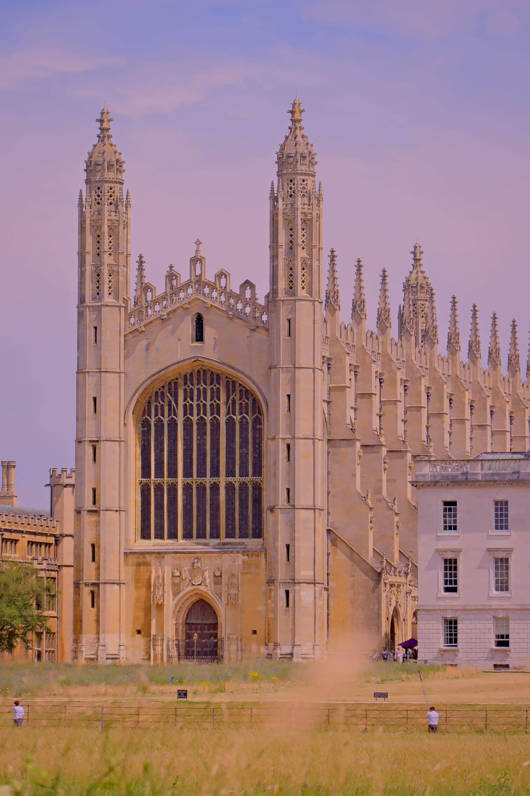
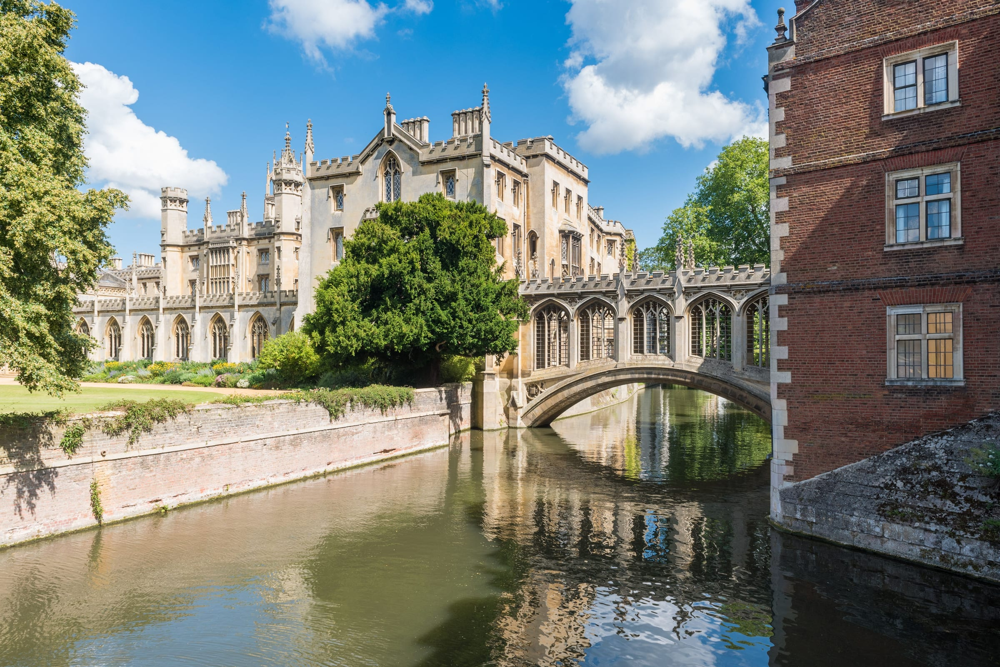
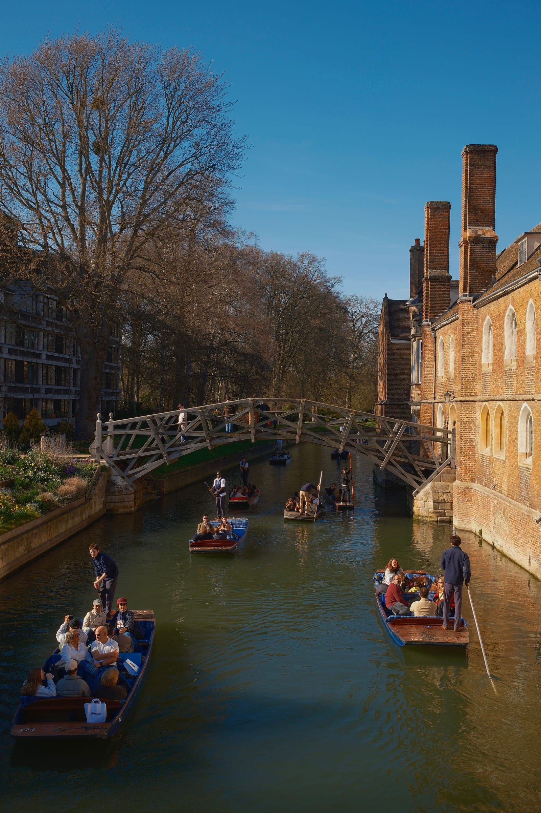
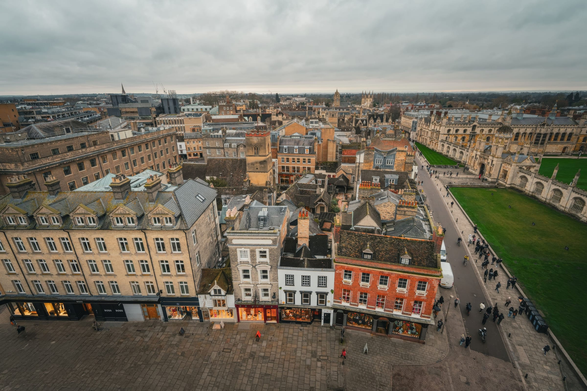

**An Off-Peak return from King's Cross to Cambridge is £32.40, and the fast train does it in 49 minutes.** That is closer than most people think, and it is the reason Cambridge works as a day trip in a way that needs no planning beyond one decision: which college you are paying to go into.

Contactless does not work. That trips people up at the gate, and it also costs them the 2FOR1 discount, which needs a paper or e-ticket from National Rail.

> 💡 **The Short Version:** **King's Cross, 49 minutes**, Off-Peak return **£32.40**, Advance singles from **£15.20**. **Liverpool Street is cheaper at £27.50** but takes 1h25. **Oyster and contactless are not valid.** **King's College £16.75** booked early, **St John's £17** but summer only, **Queens' £5**, and **Trinity does not admit the public to its courts** — £10 for a Porter-led tour. The **Fitzwilliam Museum is free**, the **Botanic Garden £7.74** in advance, the **Round Church £3.50**. **Punting is £28.50 an hour** for a whole self-hire punt, or **from £41** chauffeured. **Never buy punting from someone on King's Parade** — touting is a criminal offence in Cambridge and those sellers are unlicensed. Last direct train back **23:51**.

Powered by <a target="_blank" rel="sponsored" href="https://www.getyourguide.com/london-l57/">GetYourGuide</a>

**Book a tour direct:**

- **£119** — <a href="https://www.getyourguide.com/activity/-t2095?partner_id=WWP7I0R&amp;cmp=cambridge-day-trip" target="_blank" rel="sponsored nofollow noopener" data-affiliate="gyg">Oxford and Cambridge in a day</a>

*King's College Chapel, the £16.75 ticket that most visitors buy. Photo: The IOP, Pexels.*

## Getting there

### The train, and the 49-minute one

Two London termini serve Cambridge and they are not equivalent.

| From | Fastest | Off-Peak return | Notes |
| --- | --- | --- | --- |
| **King's Cross** | **49 min direct** | **£32.40** | Also slow direct trains at 1h29–1h30, and routes with a change at 1h19 |
| **Liverpool Street** | 1h 25 direct | **£27.50** | Greater Anglia claims 1h05 at its best; £27.50 applies only to the direct trains |

**The 49-minute service is the one to aim for**, and it runs roughly hourly alongside the slow one. Out of King's Cross the 09:35 and the 09:24 leave eleven minutes apart and arrive 52 minutes apart.

> ⚠️ **The cheap return is not valid on the earliest fast trains.** On the Tuesday we checked, the 09:24 fast departure was quoted at **£48.10** return while the 10:54 — the same journey, an hour and a half later — was **£32.40**. If you want the cheap fare and the fast train, leave after 10:00.

**Advance singles beat the walk-up return.** A month out, singles from King's Cross were **£15.20** each, so £30.40 for the day against £32.40 bought three days before. It is a small saving on this route, because the off-peak walk-up fare is already cheap. From Liverpool Street, Greater Anglia advertises Advance singles **from £8.00 each way**.

> ⚠️ **Oyster and contactless are not accepted.** Greater Anglia's own Cambridge station page states it outright: Oyster cards are not valid at this station. Cambridge is far outside the pay as you go area, which stops just beyond Zone 9.

**Cambridge station is about a mile from the centre**, a 20 to 25 minute walk. Stagecoach Citi 1, 3 and 7 run in, and PLUSBUS can be added to a rail ticket. The ticket office is open 05:10 to 23:00 Monday to Saturday and from 07:00 on Sundays.

### The coach, which is cheap but awkward

National Express runs from **£6.20 one way**, and the fastest service is **1 hour 15 minutes from London Stratford to Cambridge Trumpington** — which is the park and ride site on the southern edge, not the centre.

> ⚠️ **The Victoria coach is no use for a day trip.** Service 491 runs from Victoria Coach Station to Cambridge (Parkside) up to once a day, and the first and last daily departure from Victoria is listed as **15:00**. If you want a coach there and back in a day, it is the Stratford services or nothing.

### Driving, and why park and ride wins

Cambridge is about 106km by road, off the M11 at Junction 13 for Madingley Road. Then the arithmetic decides it for you.

| Parking | Cost |
| --- | --- |
| **Park and ride**, five sites | **Free for up to 18 hours**, then £4.50 adult return on the bus |
| Park and ride, child bus fare | £1.00, and four under-5s go free per paying adult |
| **Grand Arcade, weekday, over 5 hours** | **£33.50** |
| Grand Arcade, weekend, over 5 hours | £36.50 |
| Grand Arcade, blue badge | First three hours free |
| Station car park | £17.50 a day |

**The five park and ride sites are Babraham Road, Madingley Road, Milton, Newmarket Road and Trumpington.** Bus tickets are bought from the driver with cash or contactless; a £10 small group ticket covers up to three people all day, £15 covers up to five. Stay past 18 hours and parking costs £10, paid through RingGo within the first hour of arrival.

Powered by <a target="_blank" rel="sponsored" href="https://www.getyourguide.com/london-l57/">GetYourGuide</a>

## The colleges

*The Bridge of Sighs at St John's. Photo: Jean-Luc Benazet, Pexels.*

This is the part worth getting right, because the colleges are not a set of equivalent tickets and two of the famous four are shut for large parts of the year.

| College | Adult | What you get |
| --- | --- | --- |
| **King's** | **£16.75** early bird, £17–£18 otherwise | The Chapel and the grounds, self-guided, 15-minute arrival slots |
| **St John's** | **£17** | The courts, the riverside grounds and the Bridge of Sighs — **6 July to 30 September only** |
| **Queens'** | **£5** | Self-guided, including the Mathematical Bridge, Old Hall and Chapel |
| **Trinity** | **£10** for a tour | **The courts are not open to the public.** A Porter-led tour at 10:00 or 14:00, booked ahead, paid by card on the day |
| Trinity: the Backs | **Free** | The grounds beside the Cam, normally 09:00–17:00 |
| Trinity: Wren Library | **Free** | Noon–14:00 weekdays, 10:30–12:30 Saturdays, **in term time only** |

**Trinity's tour meets at the Great Gate on Trinity Street**, under-12s go free, and the Dining Hall is not included at the moment while work goes on. No bicycles, no dogs, no picnics, and nobody walks on the grass.

**King's prices move with the week, not the season.** The early bird price for a given week ends on the Sunday night before it: a Saturday slot booked early was £16.75 adult and £14.25 for a student or a child aged 5 to 17, with family passes at £43.25 for one adult and up to three children, or £59.00 for two adults and up to three children. Arrival slots ran 09:30 to 16:00 in 30-minute steps, and individual afternoon slots were marked closed to visitors. Tickets are non-refundable, and **there are no public toilets in the college**.

**St John's is cheaper for almost everyone except full-price adults.** Over-66s, students and National Disability Card holders pay £10; children aged 12 to 16 pay £10, dropping to £8 between 25 June and 1 September. Card only, no Amex, and no re-entry once you are in.

**Queens' is the bargain and the most restricted.** £5, under-12s free, 10:00 to 16:00, in through the Visitors' Gate on Queens' Lane. Groups of six or more must be led by a Cambridge Blue Badge Guide and are turned away without one.

> ⚠️ **Queens' closes for the whole exam term — 19 April to 4 July in 2026.** It also shuts for MA Graduation on 28 February, General Admission on 2 July, Open Days on 9 and 10 July, a Degree Congregation on 23 July, private functions on 12 April, 11 July, 8 and 15 August, an Open Day on 11 September, Bridge the Gap on 13 September, and Freshers' week from 29 September to 6 October.

**St John's has the same problem from the other direction:** paid general entry exists only between 6 July and 30 September. Outside that window the free list — alumni, University and CAMCard holders with guests, Cambridge residents with a CB postcode, prospective students, and anyone going to a chapel service — is the only way in.

**The free alternative at King's is a service.** Chapel services are free and open to visitors. You will not be let in once one has begun, so arrive early; allow up to an hour for Evensong and an hour and a quarter for Holy Communion. No bags bigger than airline hand luggage, and no photography.

## Punting, and the men on King's Parade

*Photo: Merve Aktas Yalman, Pexels.*

**Punting is the thing people get ripped off on, and the mechanism is specific.** The Conservators of the River Cam licence exactly **six punting stations**: La Mimosa on the corner of Jesus Green, Quayside, Trinity College, the Mill Pond on Silver Street, Mill Lane, and the Granta mill pond near Sheep's Green. Licensed companies trade at their own station and nowhere else.

> ⚠️ **Anyone selling you a punt trip on King's Parade or Market Square is unlicensed.** Cambridge City Council has a Public Spaces Protection Order prohibiting touting for punt custom anywhere in the city. Breaching it is a criminal offence carrying a £100 fixed penalty notice or prosecution, and uniformed enforcement officers and police patrol for it. **Buy at a punting station**, where the price is posted and the boat is the company's own.

Scudamore's has been going since 1910 and runs the Mill Lane station at Granta Place and the Quayside station at Magdalene Bridge.

| Punting | Price |
| --- | --- |
| **Self-hire, 1 hour** | **£28.50 per punt** |
| Self-hire, 90 minutes | £35.50 per punt |
| Self-hire, 3 hours | £54.00 per punt |
| **Shared chauffeured, 45 minutes** | **From £41.00**, family rows from £35.00 |
| Private chauffeured, 45 minutes | From £115 per punt |
| Private punt and walking tour, 105 minutes | From £220 |
| Grantchester self-hire, 90 min / 3 hr / 6 hr | £35.50 / £54.00 / £72.00 |

**Self-hire is per boat, not per person** — up to six, five seated and one punting. You need to be 16 to hire without an adult, arrive 15 minutes early, leave a contactless card deposit and sign the conditions. Overtime is £3.50 per six minutes. **On-the-day kiosk prices match the online prices for self-hire**, but not for the chauffeured tours, where the kiosk can differ.

**The shared chauffeured tour is sold by the row or the section**, not by the head: a row of up to two, a row of up to three, a section of four or a section of six, on a punt carrying twelve across four benches. It lasts 45 minutes and finishes where it started.

> 💡 **College Backs hires cannot go upriver.** If you want Grantchester and the meadows, book the Grantchester boats from the Granta station — a College Backs punt is not allowed up there.

## What costs nothing, and what costs almost nothing

*Photo: Cara Denison, Pexels.*

| | Price | Hours |
| --- | --- | --- |
| **Fitzwilliam Museum** | **Free** | Tue–Sat 10:00–17:00, Sun 12:00–17:00, last entry 16:40. **Closed Mondays** |
| **Cambridge Market** | **Free to wander** | 10:00–16:00 daily except 25–26 December and 1 January |
| **The Backs, Jesus Green, Parker's Piece** | **Free** | Daylight |
| **Botanic Garden** | **£7.74** advance, £8.60 on the gate | Apr–Sep 10:00–18:00, Oct 10:00–17:00, Nov–Jan 10:00–16:00 |
| **Round Church** | **£3.50**, £1 students and teenagers | Wed–Sat 10:00–17:00, last entry 16:45. Closed Sundays |

**The Fitzwilliam is the single best free thing in Cambridge** and it is closed on Mondays, which is the most common wasted trip. Ticketed exhibitions are free for under-18s, pay what you can on the first Sunday of the month, and free for 18 to 25s and students who join the Fitz List. Groups of ten or more pay £5 a head.

**The Botanic Garden is five minutes' walk from the station**, through the Station Road Gate on Hills Road, which makes it the obvious first or last stop of the day. Children up to 16 are free. Booking a day ahead takes 10% off — though not on event days like Apple Day or Cambridge Botanic Lights. The price shown first on its site is £9.50, which includes an optional 10% donation; £8.60 is the actual standard admission.

**The Round Church is not free**, despite how often it is listed that way. £3.50 standard, £1 for teenagers and students, free for Cambridge residents in CB1 to CB5 and under-13s. It is a 12th-century round church, founded between 1114 and 1131, one of only four medieval round churches left in England, and the visit is an exhibition plus a 23-minute film narrated by Sir David Suchet. Its own guided walks are £16, £14 for students and 13 to 18s, and include entry.

### Grantchester

Grantchester is the walk out of Cambridge along the Cam, and the Orchard Tea Garden at **47 Mill Way, CB3 9ND** has been the point of it for over 125 years. Tea and scones are served under the fruit trees in summer and indoors in the Rupert Brooke Room when the weather turns. **It takes no bookings for lunch** — walk in, unless you are ten or more. Its published winter timetable is Wednesday to Sunday, 10:00 to 16:00, weather permitting.

The Orchard publishes three of its own walks once you are there: a 1km circular, a 2km route to Byron's Pool past the Rupert Brooke statue at The Old Vicarage, and a 3.5km loop through Grantchester Meadows on the river path, back past the Red Lion and the Green Man.

## Does 2FOR1 work in Cambridge?

Yes, on less than you would hope, and on nothing academic.

- **Rutherford's Punting, shared punting experience** — 2FOR1
- **Museum of Cambridge** — 2FOR1
- **Scholars Punting** — 20% off
- **Cambridge Bike Tour** — discounted

**No college is in the scheme, and neither is Scudamore's.** The offer needs a valid National Rail ticket, which is another reason the contactless question matters here: there is no way to qualify without buying a real train ticket.

⚡ **[National Rail 2FOR1: how to actually get it](/articles/national-rail-2for1-london-attractions/)** — the rules, the eVouchers, and the attractions that are only a third off.

## How long the day takes

**Seven hours in Cambridge is plenty and five is enough.** The centre is small, the colleges are a ten-minute walk apart, and the only thing that eats time is the river.

A working shape: leave King's Cross at 10:54 for the fast train, in at 11:43. Walk or bus into the centre. One paying college, lunch at the market, punting mid-afternoon, the Fitzwilliam before it closes at 17:00, the Botanic Garden on the way back to the station if you still have light.

| Last train back | Departs | Arrives |
| --- | --- | --- |
| **King's Cross, last fast** | 22:42 | 23:32 |
| **King's Cross, last direct** | **23:51** | 01:04 |
| **Liverpool Street, last direct** | **22:48** | 00:18 |

After the 22:48 to Liverpool Street you are into journeys with a change — the 23:51 gets in at 01:40.

Powered by <a target="_blank" rel="sponsored" href="https://www.getyourguide.com/london-l57/">GetYourGuide</a>

## What people get wrong

- **Tapping in with contactless.** It is not valid, and it also forfeits 2FOR1.
- **Taking the 09:24 to save time** and paying £48.10 instead of £32.40.
- **Buying punting from someone on King's Parade.** Unlicensed, and illegal for them to be selling it there.
- **Turning up at Trinity expecting to walk into Great Court.** The courts are closed to the public. The Backs and the Wren Library are free; everything else is a booked tour.
- **Planning around St John's in May.** It does not take paying visitors until 6 July.
- **Planning around Queens' in June.** It is shut for exams until 4 July.
- **Arriving at the Fitzwilliam on a Monday.**
- **Driving in and parking at Grand Arcade.** Over five hours on a weekday is £33.50, against free parking and a £4.50 bus at any park and ride.
- **Booking the Victoria coach** and finding it leaves once a day, at 15:00.

All prices checked 12 September 2026.

## Continue planning your day out

- 🎓 **[Oxford from London](/articles/oxford-day-trip/)** — the other one, priced and timed the same way.
- 🏰 **[Windsor from London](/articles/windsor-day-trip/)** — the shortest of the big three day trips.
- 🚇 **[London transport costs and fares](/articles/london-public-transport-costs-and-fares/)** — where contactless does work, and how capping behaves.
- 🎟️ **[National Rail 2FOR1](/articles/national-rail-2for1-london-attractions/)** — the discount this trip unlocks.
- 🗺️ **[Day trips from London](/articles/day-trips-from-london/)** — what the others cost, how long they take, and which days they are shut.
