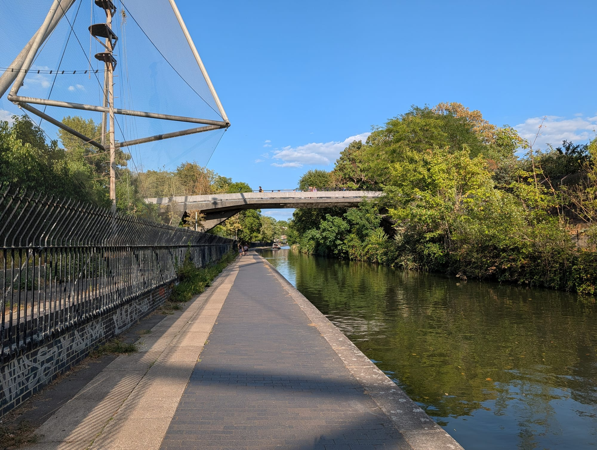
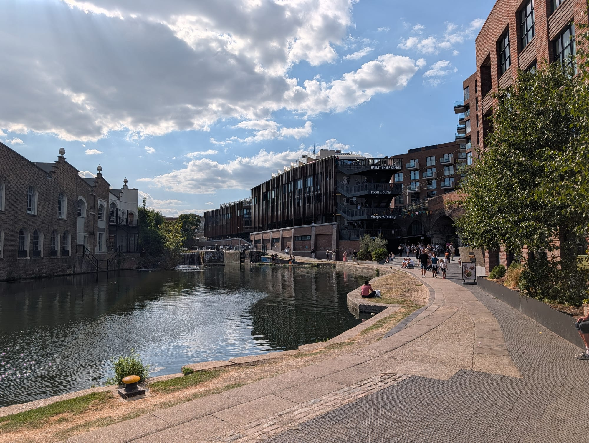
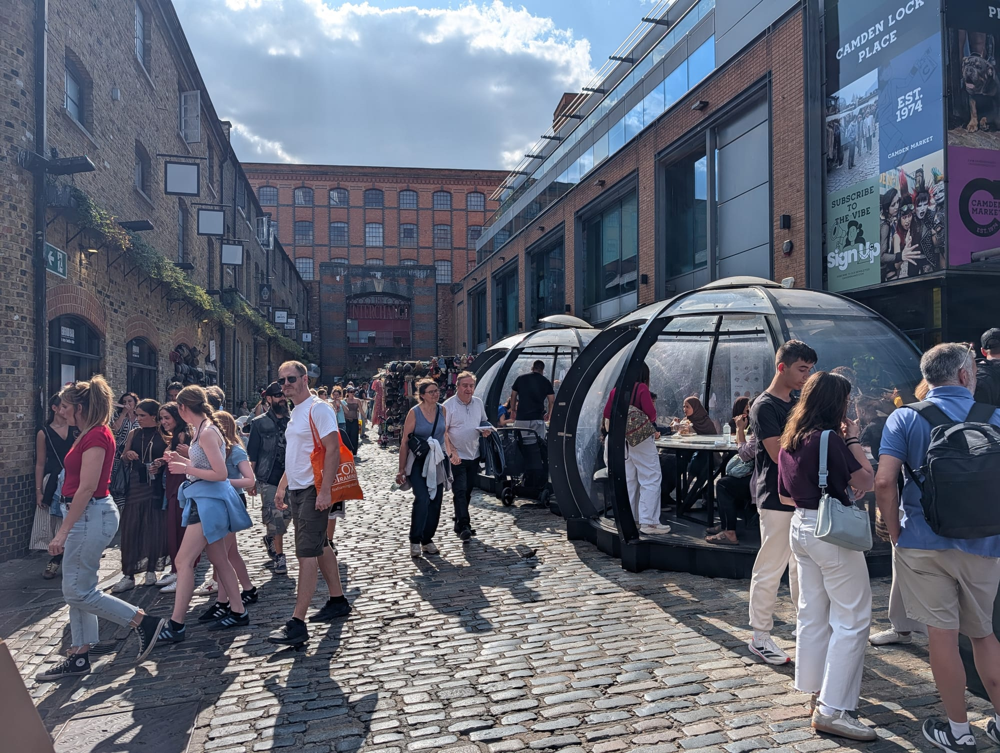
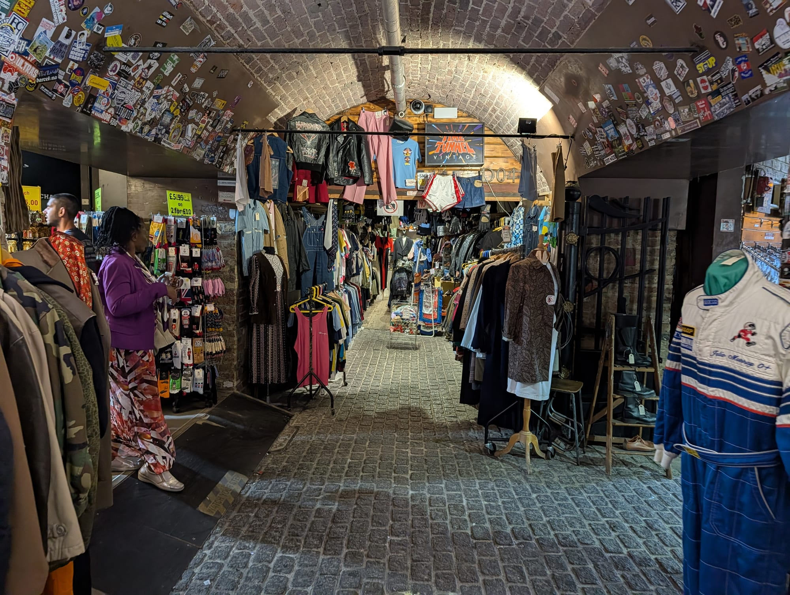
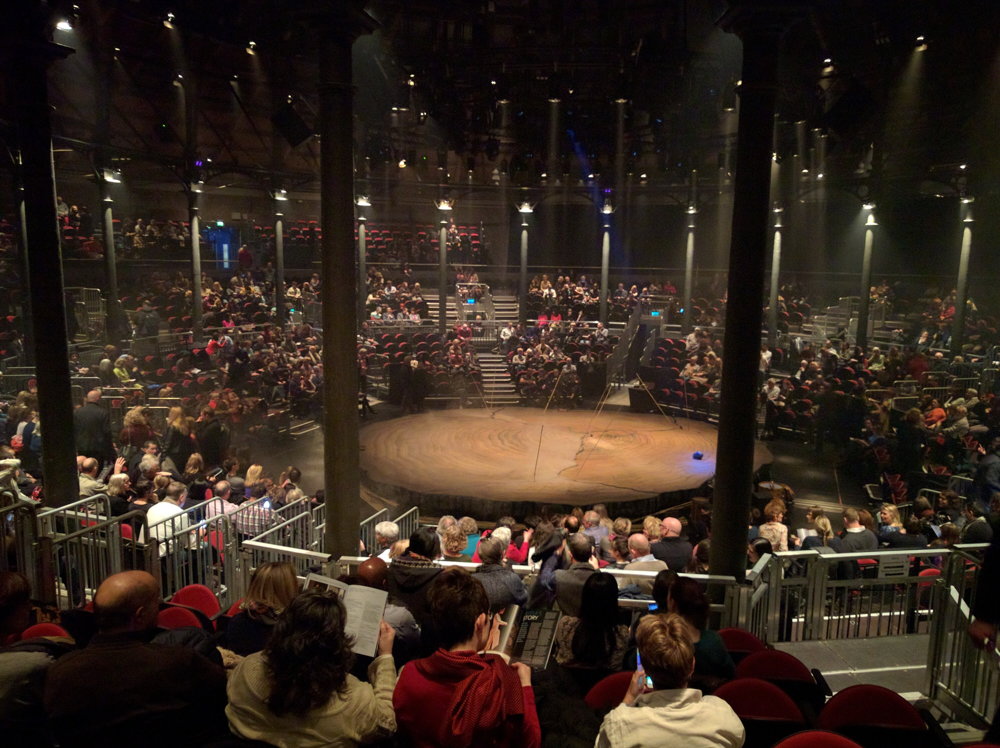
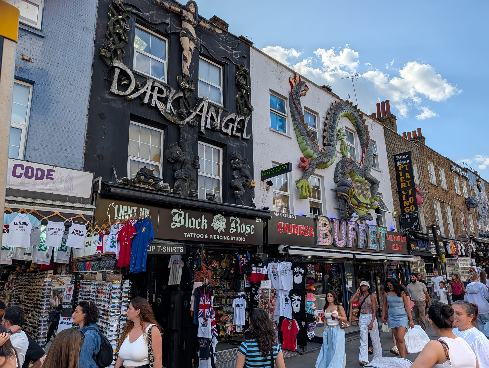
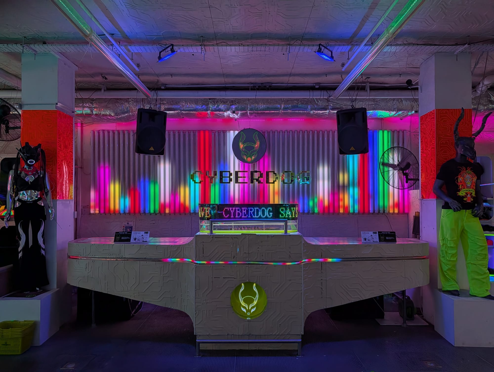
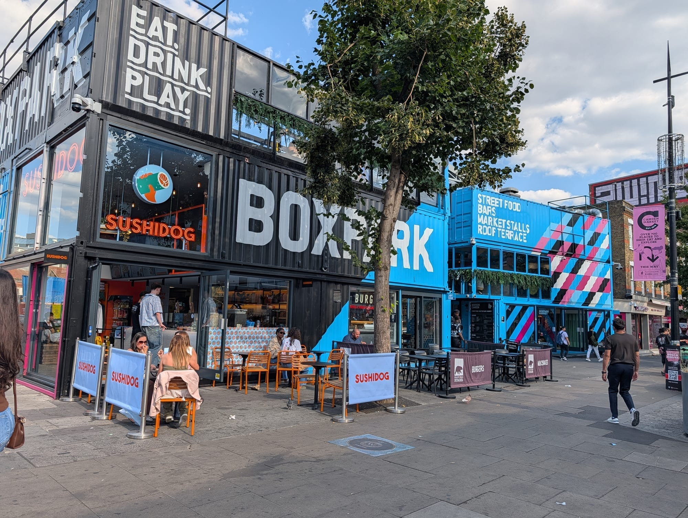
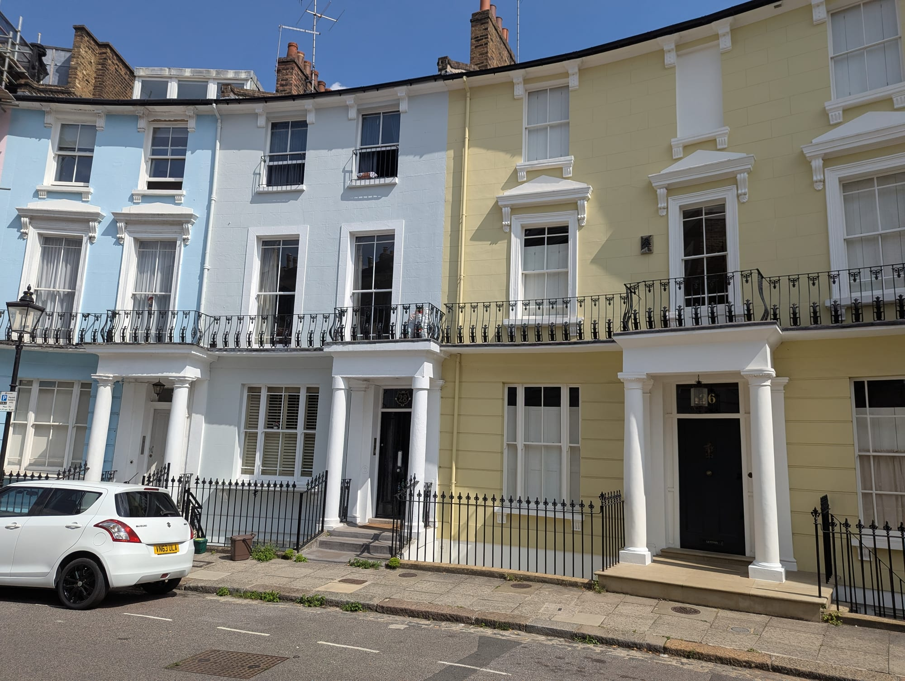
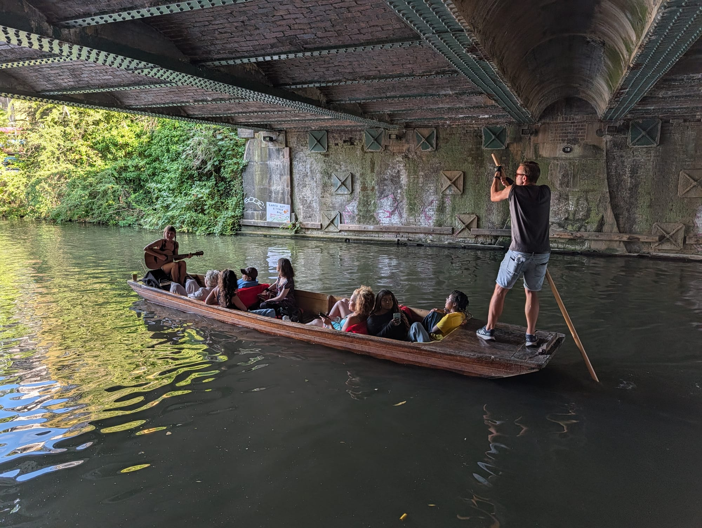

Camden built its reputation on markets and music, and it still trades on both. What began as a craft market by the canal lock in 1974 now sprawls across five separate markets and draws around 250,000 people a week.

It is not subtle, and it is not for everyone. But the canal, Primrose Hill fifteen minutes north-west, and the surviving music venues make it more than the T-shirt stalls suggest.

Camden has its own share of the commemorative plaques marking where notable people lived or worked - see them on our [interactive map](/plaques/?area=camden).

## Why visit — and who should skip it

**Come here if** you want street food, vintage, or live music, or you want to walk the Regent's Canal. The food at Camden Lock is genuinely good and genuinely cheap — dozens of traders, most under £10.

**Skip it if** crowds bother you. Camden on a Sunday afternoon is among the most congested places in London — crowded enough that the Tube station ran exit-only for years to cope. If you want the market without the crush, come on a weekday morning.

## Top sights and activities

1. **Camden Lock Market** — The original, beside the lock itself. Craft stalls and the best of the street food, with terraced seating above the water.
2. **Stables Market** — The largest, running back into the tunnels and vaults of a Victorian horse hospital. Vintage clothing, antiques and furniture, plus the bronze horse statues.
3. **Camden Lock and the Regent's Canal** — The lock still operates. The towpath runs east to King's Cross in 30 minutes and west to Little Venice in about 50.
4. **Primrose Hill** — Fifteen minutes north-west. A free panorama of the entire central skyline, with a naming plaque at the summit. The village below it has the pastel terraces of **Chalcot Crescent**, used as the Browns' house in the *Paddington* films.
5. **The Roundhouse** — A former railway engine shed turned venue, where Pink Floyd, Hendrix and The Doors all played. Still a working music and theatre space.
6. **The Electric Ballroom and the Dublin Castle** — Two surviving live venues. The Dublin Castle is small, sticky and where Madness and Blur played early sets.
7. **Regent's Park and London Zoo** — Fifteen minutes south-west along the canal, with the zoo's landmark Snowdon Aviary structure visible from the towpath. It no longer holds birds - it was reimagined as **Monkey Valley** and now houses the zoo's monkeys.

*The towpath heading toward the zoo. This is the old Snowdon Aviary frame, built in 1965 - now home to the zoo's monkeys rather than its birds.*

## Key streets and micro-districts

### Camden Lock and the canal
The centre of it, and the part worth arriving early for. **Camden Market opens 10am to 7pm daily**, including bank holidays, and the cobbled lanes between the lock and the railway arches are close to impassable by early afternoon at a weekend. Before eleven on a weekday you can actually see what the stalls are selling.

The **food is the main event now** rather than the clothing — around a hundred street food counters across the lock and Hawley Wharf, from Cuban to Korean to Argentinian, most plates £8 to £12. **Hawley Wharf's food halls run 11.30am to 11pm**, considerably later than the market itself, so the lock empties in the evening while the restaurants beside it fill.

**The canal is the best way out.** The **London Waterbus** runs from beside the lock to **Little Venice in 45 minutes** — **£17 adult, £14 child, under-4s free** — through Regent's Park, the grounds of London Zoo and the 248-metre Maida Hill tunnel. Boarding closes five minutes before departure. Walking the towpath the same way is free and takes about an hour.

*Camden Lock. The boat on the right is a London Waterbus service — it runs from here to Little Venice, through Regent's Park and the London Zoo grounds.*

*Hawley Wharf, the redevelopment beside Camden Lock. It opened in 2021 on the site of the old Canal Market, after a fire had closed it for years.*

*Camden Lock Place, between the market and Hawley Wharf. The glass pods are outdoor seating for the restaurants either side.*

### Stables Market and Chalk Farm Road
North past the railway bridge, and **the part of Camden actually worth slowing down for**. The Stables are the Victorian horse hospital and tunnels built for the animals that hauled canal barges, now cut through with railway arches full of dealers — vintage clothing, furniture, militaria, records. Expect **£15 to £60** for a decent vintage piece, more for branded denim or leather.

**Go on a weekday if you want to look at anything properly.** The arches are narrow, the good stalls are the ones people stop at, and on a Saturday you shuffle.

Opposite stands the **Roundhouse**, built in 1847 as an engine shed to turn locomotives and now one of London's better music venues — the cast-iron columns inside are the originals. Worth checking what is on before you come, since the building alone justifies a ticket. It is covered in full in our [live music guide](/articles/best-live-music-venues-london/).

*The vintage dealers under the arches in Stables Market. This is the part of Camden worth going slowly through.*

*Inside the Roundhouse. It was built in 1847 to turn locomotives, and the cast-iron columns are the originals.*

### Camden High Street
From the Tube station north. The loudest and least interesting part — chain shops, tattoo studios and the oversized shop-front sculptures.

*The High Street sculptures. They date from the 1980s, when shops competed to be findable in a crowd — the dragon and the boot are the two everybody photographs.*

Two things on this stretch are worth stopping for. **[Cyberdog](https://www.cyberdog.net/)**, under the Stables, is a cybergoth and rave clothing shop built like a nightclub — neon, a DJ booth and staff dancing on podiums. It has been there since 1994 and there is nothing else like it in Britain.

*Cyberdog. Free to walk into, and worth it whether or not you would ever wear any of it.*

**BOXPARK Camden** on the High Street is the newer container development — street food counters, bars and a roof terrace.

*BOXPARK Camden. Sushidog and a run of other counters downstairs, with a roof terrace above.*

### Inverness Street and Parkway
West of the High Street, and where Camden stops performing at you. **Inverness Street** was a working fruit and veg market for a century and is now much reduced — a handful of stalls rather than the row it was — but the street itself is lined with pubs and small restaurants that serve locals rather than the market crowd.

**Parkway is the one to walk.** It runs from the Tube down toward Regent's Park, and the eating is materially better and cheaper than anything you will find fifty metres east: proper neighbourhood Greek, Italian and Indian rooms, plus **The Dublin Castle**, the pub where Madness got their start and still a small live venue most nights.

**This is where to eat if the market has worn you out** — five minutes from the crowds, and you will get a table.

### Primrose Hill village
North-west across the railway, and a different world within ten minutes' walk — pastel stucco terraces, independent shops along Regent's Park Road, and pubs that fill with people who live here rather than people visiting.

**The hill itself is the reason to come.** It rises to about **63 metres** and the summit is **one of London's protected viewpoints**, which is a legal designation: the trees are kept low and nothing may be built that blocks the sightline to St Paul's and the City. It is free, always open, and one of the best skyline views in the city — busiest at sunset, and on New Year's Eve genuinely packed.

**Chalcot Crescent** stood in for the Brown family's house in the *Paddington* films. These are private homes, so photograph from the pavement and keep the noise down.

*Chalcot Crescent, Primrose Hill. The Browns' house in the Paddington films is on this curve — these are private homes, so photograph from the pavement.*

Powered by <a target="_blank" rel="sponsored" href="https://www.getyourguide.com/london-l57/">GetYourGuide</a>

## Where to eat and drink

| Spot | Style | Price | Why go |
| --- | --- | --- | --- |
| **Camden Lock food stalls** | Global street food | £ | Dozens of traders, most under £10; eat on the canal terraces |
| **Poppies** | Fish and chips | ££ | A 1950s-styled chippy on Hawley Crescent, and the best-known name in Camden for it |
| **Hook Camden Town** | Fish and chips | ££ | Sustainable, freshly battered, on Parkway |
| **BOXPARK Camden** | Street food hall | £ | Containers on the High Street — counters, bars and a roof terrace |
| **The Dublin Castle** | Music pub | £ | Small back room with a genuine claim on Britpop history |
| **Namaaste Kitchen** | Indian grill | ££ | Parkway; a step up from the market food |
| **The Lansdowne** | Gastropub | ££ | Primrose Hill; where locals go to escape the market |
| **Chin Chin Labs** | Ice cream | £ | Liquid-nitrogen ice cream made in front of you |

## Canal boat trips from Camden

Five different operators run from Camden Lock, and they are genuinely different trips rather than the same ride at different prices. All of them use the same stretch of the Regent's Canal — through Regent's Park and **the grounds of London Zoo**, where the painted wolves and the colobus monkeys are visible from the water, and in most cases through the **Maida Hill tunnel**, a little over 240 metres long, which has no towpath and is worth the ticket on its own.

| Trip | Route | How long | From | What makes it different |
| --- | --- | --- | --- | --- |
| **[London Waterbus](https://www.londonwaterbus.com/)** | Camden ↔ Little Venice | ~45 min each way | £17 adult, £14 child | Pick the historic narrowboat, which is guided and has forward-facing seats, or the Comfort Cruiser barge, which has booth seating, tables and a licensed bar |
| **[Jason's Trip](https://www.jasons.co.uk/)** | Little Venice ↔ Camden | ~45 min | £19 single, £25 return | Running since **1951** — the original Regent's Canal tour — on a canal boat built in **1906** |
| **[Jenny Wren](https://walkersquay.com/)** | Camden → Little Venice → back | **~90 min round trip** | Phone to book | Guided the whole way, and the only one that **works a lock while you are aboard**. Ends where it started, so no walk back |
| **[My Fair Lady](https://walkersquay.com/my-fair-lady/)** | Regent's Canal | An evening, a Sunday lunch or afternoon tea | Phone to book | A **restaurant boat** — fully enclosed and heated, three courses cooked in a galley on board |
| **[The Music Boat](https://www.getyourguide.com/london-l57/london-regent-s-canal-punting-boat-ride-with-live-music-t1298125/)** | Camden loop | ~45 min | £16.25 | A **punt with live musicians** aboard, from Camden Lock from 11am. Passes the Pirate Castle and St Mark's Church |

*The Music Boat. It is a punt rather than a narrowboat, so it is open to the weather and much closer to the water than the waterbus.*

**Which to pick.** For getting somewhere, the Waterbus or Jason's Trip — both are one-way journeys that happen to be scenic. For a round trip with no walk back, Jenny Wren, which also takes you through a working lock. For an evening out rather than a sightseeing trip, My Fair Lady. The Music Boat is the one people remember, and the one to avoid in bad weather.

> ⚠️ **None of them stop at London Zoo.** The route runs through the zoo's grounds and you can see the painted wolves and colobus monkeys from the water, but there is no zoo landing — the old combined boat-and-zoo ticket is long gone, and plenty of guides still say otherwise. The nearest stop is Camden Market, about fifteen minutes' walk from the entrance.

> ⚠️ Timetables are seasonal and several of these run a reduced winter service or stop entirely. Check before travelling for a specific boat, and note that one-way tickets mean walking or taking the Tube back.

## Getting there

**By Tube.** **Camden Town** (Northern) is the obvious choice, but it is severely congested at weekends. For years it ran **exit-only on Sunday afternoons**; that was lifted in 2019, so you can board there again, but queues to enter still build badly. **Chalk Farm** one stop north is the better approach, and it puts you at the Stables Market end.

**By Overground.** **Camden Road** is a five-minute walk east and far less crowded.

**By canal.** The towpath from King's Cross takes 30 minutes on foot. The narrowboat waterbus from Little Venice takes about 45 minutes — see [canal boat trips](#canal-boat-trips-from-camden) above for which service is which.

**Best approach.** Arrive at Chalk Farm and walk south through Stables Market to the Lock. You start at the good end and finish near the station.

## How long to spend, and when to go

| If you have | Do this |
| --- | --- |
| **Two hours** | Camden Lock, Stables Market and lunch on the canal |
| **Half a day** | Add Primrose Hill and the walk back along the towpath |
| **A full day** | Walk the canal to King's Cross, or take the waterbus to Little Venice |

**Best time:** Weekday mornings. Same markets, a fraction of the people.

**Avoid:** Sunday afternoon, the single busiest period, when queues build just to get into Camden Town station.

## Suggested three-hour route

1. **Start:** **Chalk Farm** station, not Camden Town.
2. **Stables Market:** South into the horse hospital tunnels and the vintage dealers.
3. **Camden Lock:** Down to the water for street food on the terraces.
4. **The towpath:** West along the **Regent's Canal** past the zoo's old aviary structure.
5. **Primrose Hill:** Up for the skyline panorama.
6. **Finish:** A pub in **Primrose Hill village**, or back down for the Northern line.

Powered by <a target="_blank" rel="sponsored" href="https://www.getyourguide.com/london-l57/">GetYourGuide</a>

## Common mistakes to avoid

1. **Arriving at Camden Town station on a Sunday afternoon.** You can board there — the old exit-only rule ended in 2019 — but the queues are grim. Use Chalk Farm.
2. **Walking north up the High Street and stopping there.** The good part is past the bridge at the Lock and Stables.
3. **Eating on the High Street.** The canal-side food stalls are cheaper and much better.
4. **Missing Primrose Hill.** Fifteen minutes away, free, and the best view in north London.
5. **Not watching your pockets.** Dense crowds make this a known spot for pickpockets.
6. **Taking the Tube to King's Cross.** The canal walk is 30 minutes and far more pleasant.

## Where to stay

Cheap by central standards, well connected on the Northern line, and noisy near the market.

- **Camden Town** — Hostels and budget hotels. Convenient, lively and loud at night.
- **Primrose Hill** — Fifteen minutes north-west, considerably quieter and more expensive.
- **King's Cross** — Thirty minutes along the canal, with far better transport connections.
