Canary Wharf is built on the West India Docks, which handled the sugar and rum trade from the 1800s until the docks closed in 1980. What went up in their place from the late 1980s is Britain's densest cluster of tall buildings, arranged around the water that is still there.

The docks are the point. Nearly every walkway here runs alongside a stretch of Victorian dock, and the contrast between the water, the surviving warehouses and the glass above them is what makes the place worth an afternoon.

*The docks catch the light better than the towers do. Worth timing a walk for sunset.*

Canary Wharf has its own share of the commemorative plaques marking where notable people lived or worked - see them on our [interactive map](/plaques/?area=canary-wharf).

## Why visit — and who should skip it

**Come here if** you like modern architecture, or want to swim in a dock between skyscrapers, or want a free museum and a roof garden almost nobody visits, or it is raining — much of Canary Wharf is connected by covered walkway and underground mall.

**Skip it if** you came to London for old streets and traditional pubs. That part of the old advice still holds: this is a purpose-built estate, and nothing here is historic except the docks themselves and a handful of Georgian warehouses.

> **What changed.** Guides written before about 2023 describe an office district that empties at weekends, and that is no longer accurate. **Eden Dock** opened in October 2024, **Mercato Metropolitano** arrived at Wood Wharf, **Fairgame** now trades until 1am on Saturdays, and a **50-metre floating swimming pool opened in June 2026**. Around 3,500 people live here, and that is projected to roughly double by 2027 as Wood Wharf completes.
>
> It is honest to call it an estate halfway through becoming a neighbourhood — the new leisure sits alongside the old mall rather than replacing it.

## Top sights and activities

1. **Crossrail Place Roof Garden** — Free, open daily, and built on top of the Elizabeth line station under a timber lattice roof. Planted by hemisphere along the meridian line. The single best thing here.
2. **Museum of London Docklands** — Free, in a Georgian sugar warehouse on West India Quay. The story of the docks, the river, and London's part in the transatlantic slave trade. Rarely busy.
3. **Eden Dock** — Floating planted islands and wetland walkways installed in Middle Dock, turning a stretch of open water into a genuine habitat. Free, and best seen from the boardwalk on the north side.
4. **The dockside walks** — Middle Dock, West India Quay and the Wood Wharf boardwalks. Flat, quiet and lined with water on both sides.
5. **Sea Lanes** — A **50-metre heated floating swimming pool** at the western end of Eden Dock, open since **19 June 2026**. **£10** to swim, **£18** with the sauna. Weekdays 6am–9pm, weekends 7am–7pm.
6. **Open water swimming in Middle Dock** — Separate from the pool, and colder: a marked, lifeguarded open-water venue in the dock between the towers, running seasonally from roughly June to October since 2022. Booked in advance, and around £9.50 a session plus annual membership.
7. **Fairgame** — Electronic fairground games and street food on Fisherman's Walk, and the clearest sign the estate's weekends have changed: **open until 1am on Saturdays and midnight on Sundays**. From £15 a head for 75 minutes off-peak.
8. **Skuna hot tub and barbecue boats** — Self-drive boats on the dock with a hot tub or a barbecue on board, and heated igloo boats in winter.
9. **The public art** — Around seventy works scattered across the estate, all free to see and mostly unmarked. There is a printed trail if you want one.
10. **Wood Wharf** — The newest quarter, east of the towers, and where the good restaurants are. A floating Hawksmoor, a genuine waterside promenade, and Mercato Metropolitano's food hall on George Street.
11. **One Canada Square** — The pyramid-topped tower that was Britain's tallest building from 1991 to 2012. No public viewing floor, but the lobby is worth a look.
12. **Winter Lights** — A **free** light-art festival across the estate every January, no booking needed. The 2026 edition ran 20–31 January, 5pm to 10pm, and was the tenth. Dates for 2027 are not published yet.

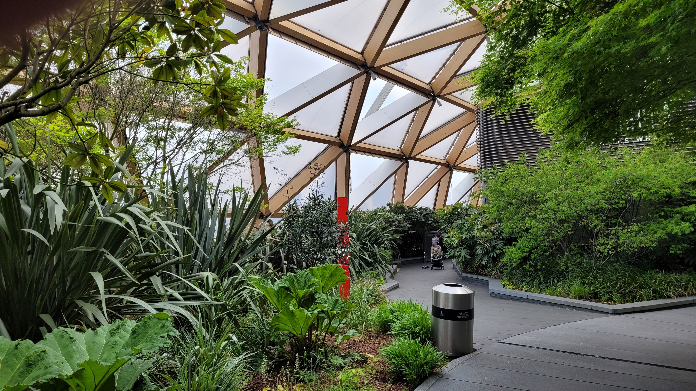

*Inside the Crossrail Place Roof Garden. It sits directly on top of the Elizabeth line station and is free to enter.*

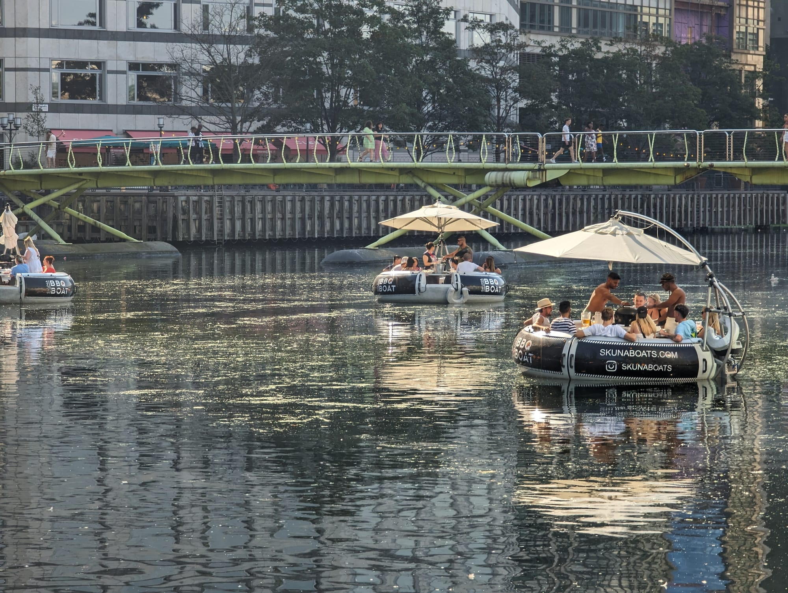

*Skuna's barbecue boats on Middle Dock. You drive them yourself and cook while you go - no licence needed.*

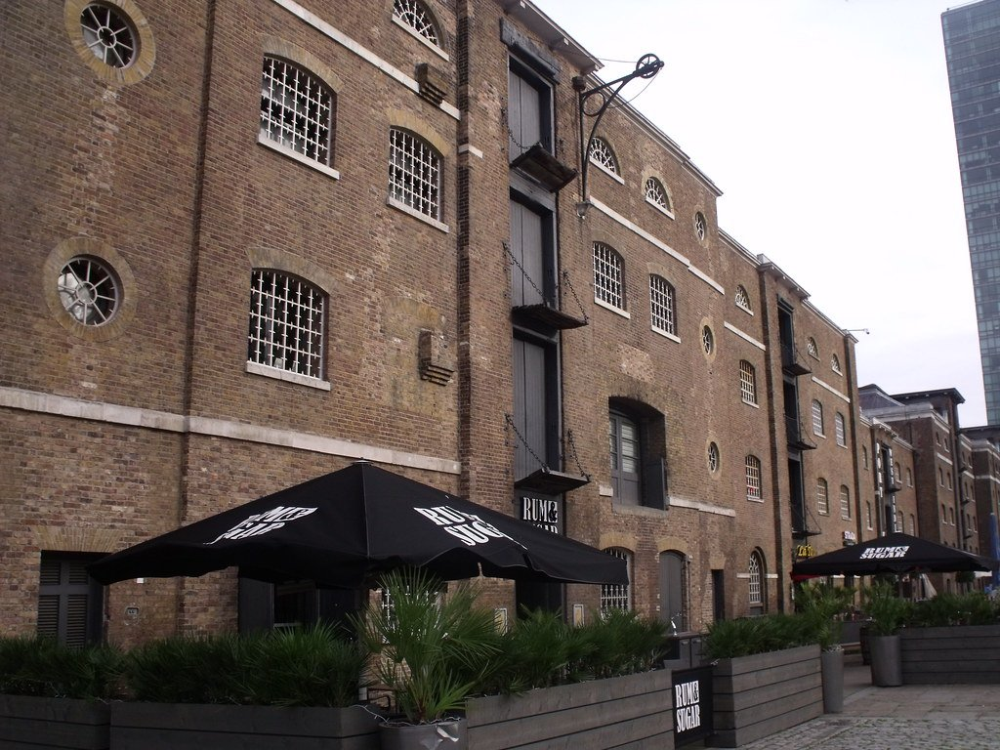

*The Museum of London Docklands, in a Georgian sugar warehouse on West India Quay. Free, and much quieter than the Canary Wharf towers opposite. Photo: [ell brown](https://www.flickr.com/photos/39415781@N06/6455266221), [CC BY 2.0](https://creativecommons.org/licenses/by/2.0/).*

## Key streets and micro-districts

### Canada Square and the malls
The centre. One Canada Square, the park, and the underground shopping levels that connect most of the estate.

### West India Quay
North across the footbridge. The surviving Georgian warehouses, the Docklands museum and a run of restaurants under the arches.

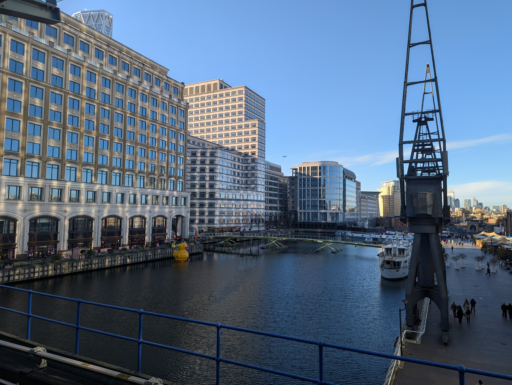

*West India Quay. The Georgian sugar warehouses on the left house the Museum of London Docklands; the preserved crane on the right is one of several left along the dock.*

### Crossrail Place
The Elizabeth line station, with the roof garden on top and a food court below.

### Wood Wharf
East. New residential blocks, the boardwalk and the best of the waterside dining.

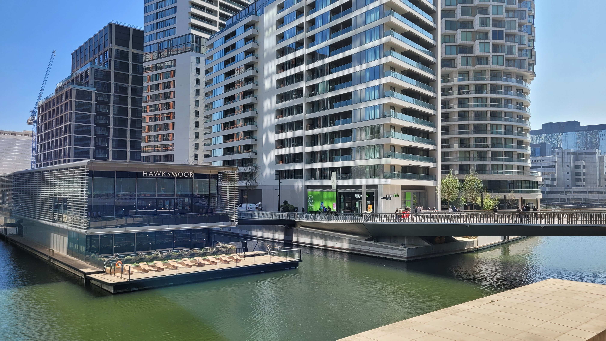

*Wood Wharf's restaurant strip. Hawksmoor's site here floats on the dock itself.*

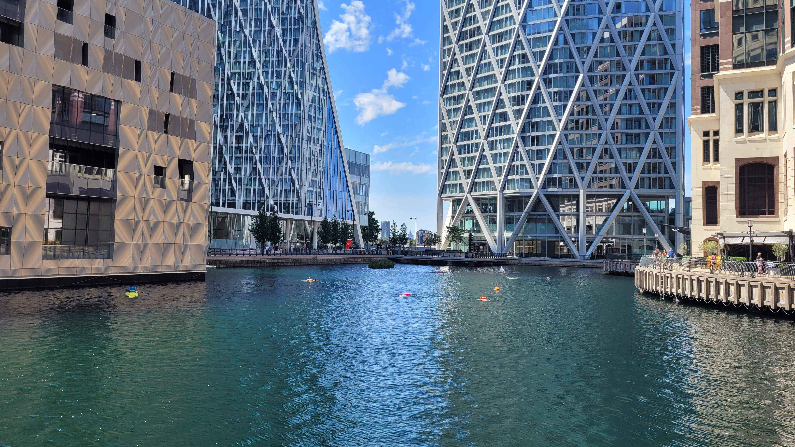

*Open water swimming in Middle Dock. Sessions are lifeguarded and booked in advance.*

### Heron Quays and South Dock
South, facing the water towards Greenwich, and the quietest part to walk.

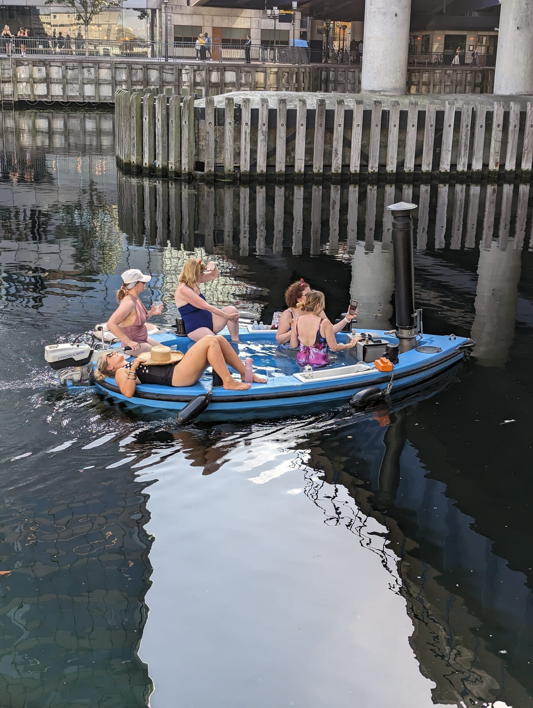

*The hot tub boats run year-round. The chimney is a wood burner, and the water is properly hot in January.*

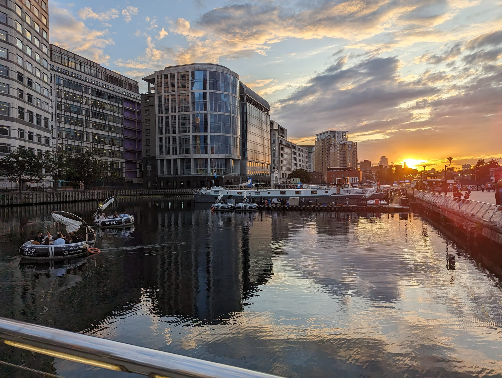

*Middle Dock at sunset, with the barbecue boats out. The docks face west, so this is what the last hour of light does to them.*

## Where to eat and drink

| Spot | Style | Price | Why go |
| --- | --- | --- | --- |
| **Hawksmoor Wood Wharf** | Steakhouse | £££ | On the water at Wood Wharf; book ahead |
| **The Ivy in the Park** | Modern British | £££ | Canada Square Park, with terrace seating |
| **Crossrail Place food court** | Mixed | ££ | Under the roof garden; quick and covered |
| **West India Quay arches** | Chain restaurants | ££ | Reliable, waterside, open at weekends |
| **The Gun** | Historic riverside pub | ££ | Fifteen minutes east on the Thames; genuinely old, with a Tower Bridge view |
| **Mercato Metropolitano** | Food hall | £ | 10 George Street, Wood Wharf; the budget option, open since 2022 |
| **Fairgame** | Games and street food | ££ | Fisherman's Walk; open to 1am Saturdays |
| **Big Easy / Roka** | Various | ££ | Crossrail Place; reliably busy at weekends |

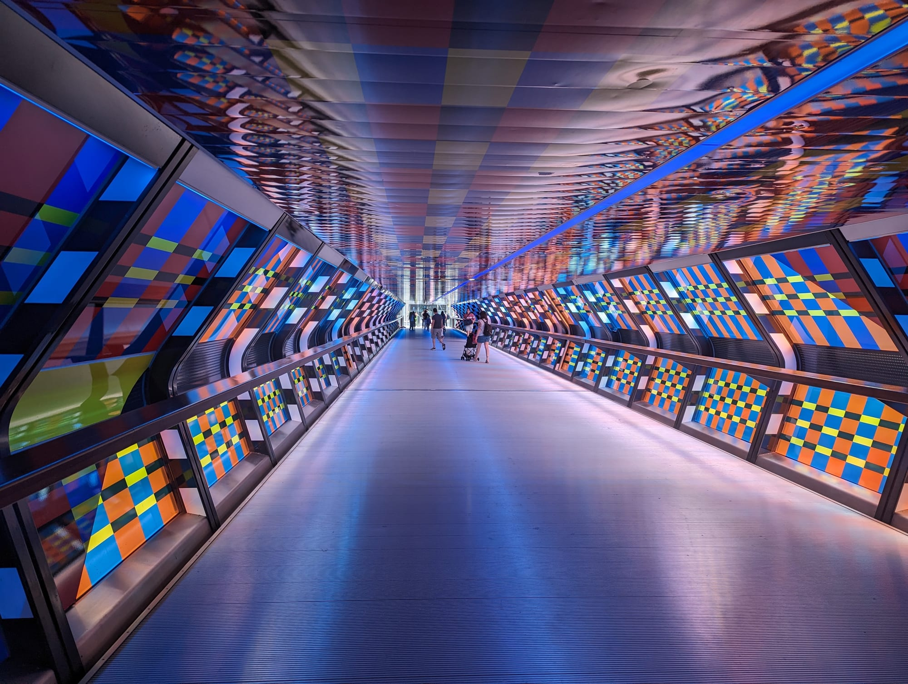

*Adams Plaza Bridge, the covered walkway between Canary Wharf station and Crossrail Place. It is a short cut people photograph rather than a sight in itself.*

## Getting there

**By Elizabeth line.** The fastest option by a distance: **six minutes** from Liverpool Street, about thirteen from Bond Street. Spacious, air-conditioned and step-free.

**By Jubilee line.** Fifteen minutes from Waterloo, and one stop from North Greenwich for the O2.

**By DLR.** Slower but far more scenic — it runs on a viaduct through the docks. Sit at the front; there is no driver.

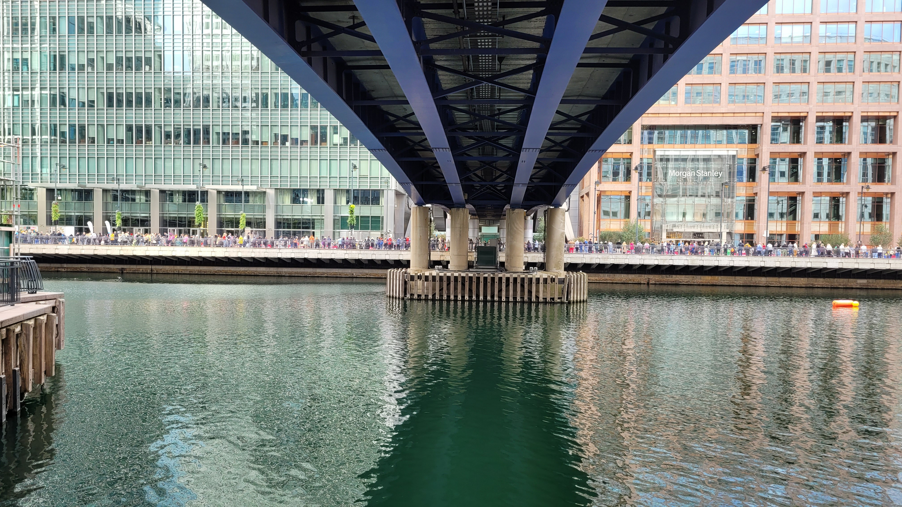

*The DLR viaduct threading between the towers. The elevated track is why the front-seat view works.*

**On foot to Greenwich.** DLR two stops to **Island Gardens**, then the **Greenwich Foot Tunnel** under the river. Free and open at all hours.

*Winter Lights runs across the estate for two weeks each January. It is free, needs no ticket, and is the busiest the walkways get all year.*

## How long to spend, and when to go

| If you have | Do this |
| --- | --- |
| **One hour** | Crossrail Place Roof Garden and the Middle Dock walk |
| **Two to three hours** | Add the Museum of London Docklands, Eden Dock and Wood Wharf |
| **Half a day** | Add a swim at Sea Lanes and lunch at Wood Wharf |
| **A full day** | All of the above, then Greenwich via the Foot Tunnel |

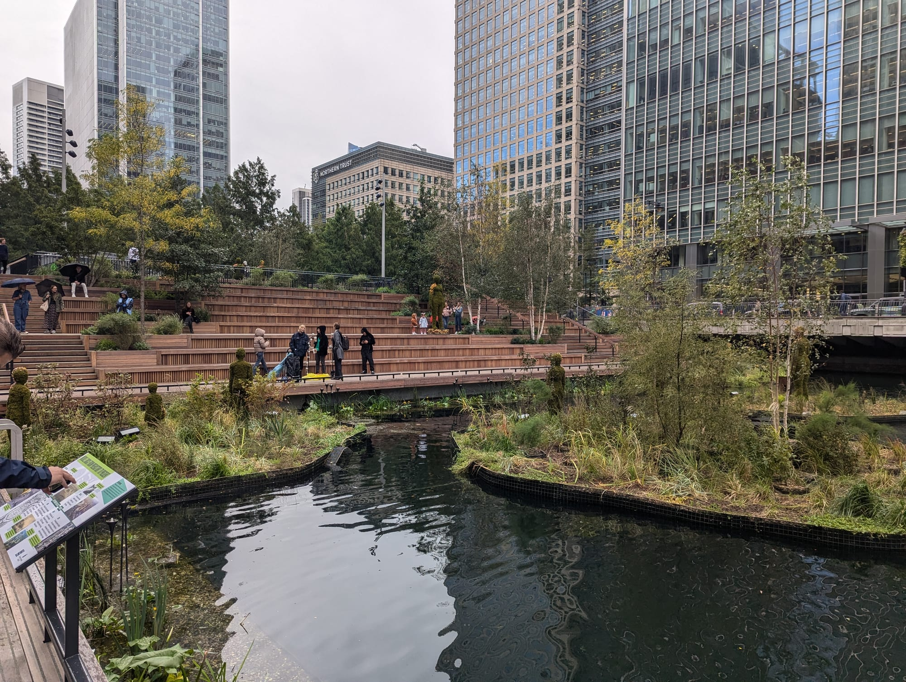

*Eden Dock, the planted wetland installed in Middle Dock. The timber terracing doubles as seating.*

**Best time:** Early evening gives the best photographs, with the towers lit and reflecting in the docks. Weekday lunchtimes are the busiest and most alive; weekends are quieter on the walkways but the water and the restaurants are now the reason to come.

**Sundays are no longer a write-off.** The malls keep short Sunday hours and some older chain units shorten further, so do not plan a shopping trip. Everything else — Eden Dock, the pool, the museum, the roof garden, Wood Wharf — runs as normal.

## Suggested two-hour route

1. **Start:** Canary Wharf Elizabeth line station. Up to the **Crossrail Place Roof Garden**.
2. **West India Quay:** North over the footbridge to the **Museum of London Docklands**. Free.
3. **Canada Square:** South through the park past **One Canada Square**.
4. **Wood Wharf:** East to the boardwalk and the water.
5. **Finish:** DLR to **Island Gardens** and the **Greenwich Foot Tunnel**, or back on the Elizabeth line.

## Common mistakes to avoid

1. **Reading a guide written before 2023.** Most still say the estate empties at weekends and is worth two hours. Eden Dock, the swimming and the Wood Wharf restaurants have changed that.
2. **Planning a Sunday shopping trip.** The malls keep short Sunday hours. Everything else is open.
3. **Missing the roof garden.** It is on top of the station and free, and most visitors walk underneath it without knowing.
4. **Taking the Jubilee line from the City.** The Elizabeth line from Liverpool Street takes six minutes.
5. **Trying to walk here from the Tower.** Much further than the map suggests. Use the DLR.
6. **Looking for a viewing platform.** There is not one anywhere in Canary Wharf. One has been proposed for 8 Canada Square, but building cannot start until HSBC leaves in 2027, so it is years away. The free views are Horizon 22 and the Sky Garden in the City.
7. **Expecting the ice rink.** It ran for years in Canada Square Park but is **paused for winter 2026**. Winter Lights in January is unaffected.

## Where to stay

Modern, well connected and often cheaper than Zone 1, with the trade-off of a quiet evening.

- **Canary Wharf** — Large business hotels, and **often much cheaper at weekends** when corporate demand drops. That inversion is the single best-value thing about staying here.
- **Wood Wharf** — Newer, on the water, and closer to the better restaurants.
- **North Greenwich** — One stop on the Jubilee line, handy for the O2.
