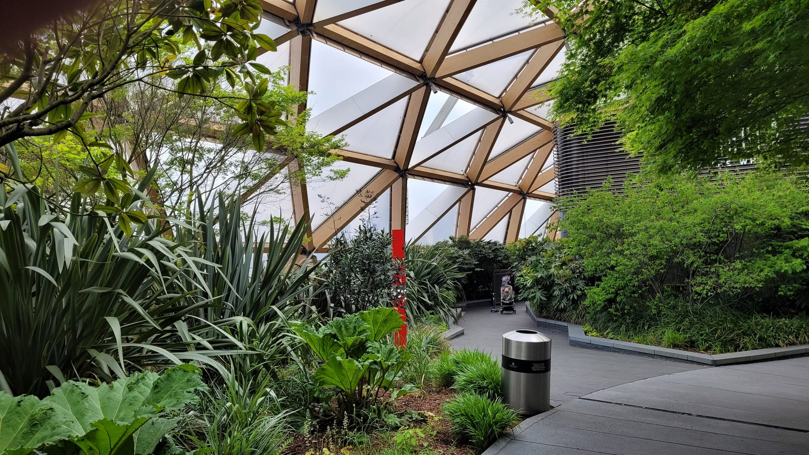
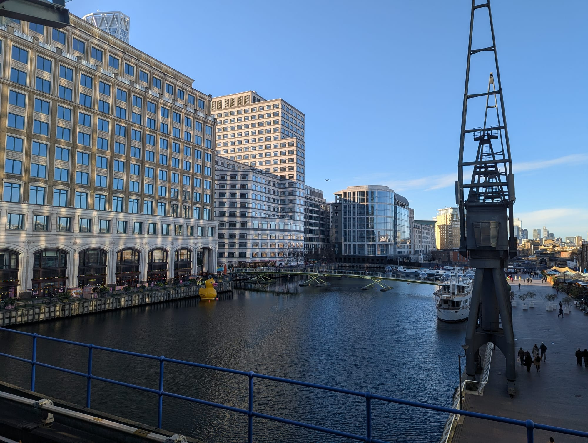
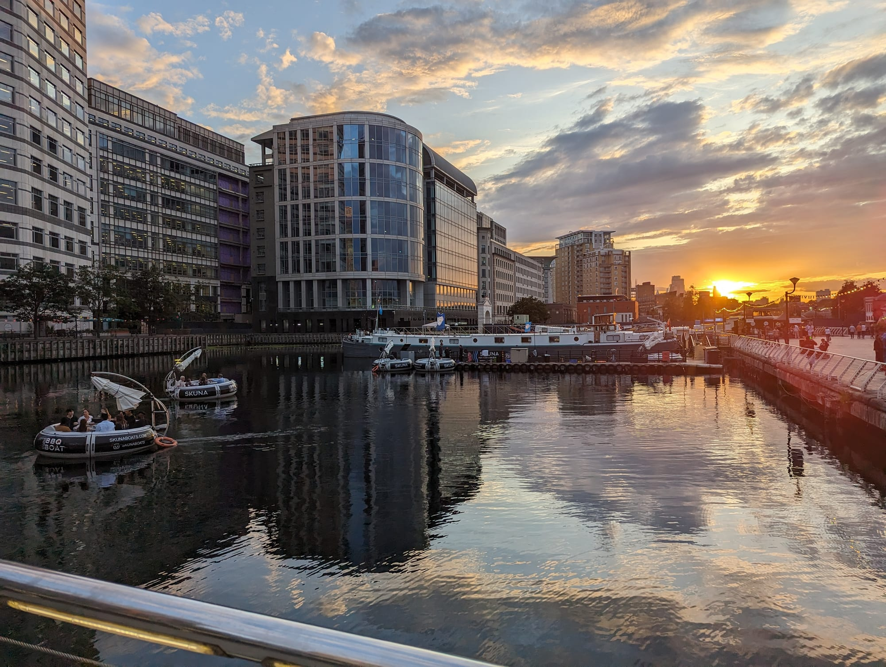
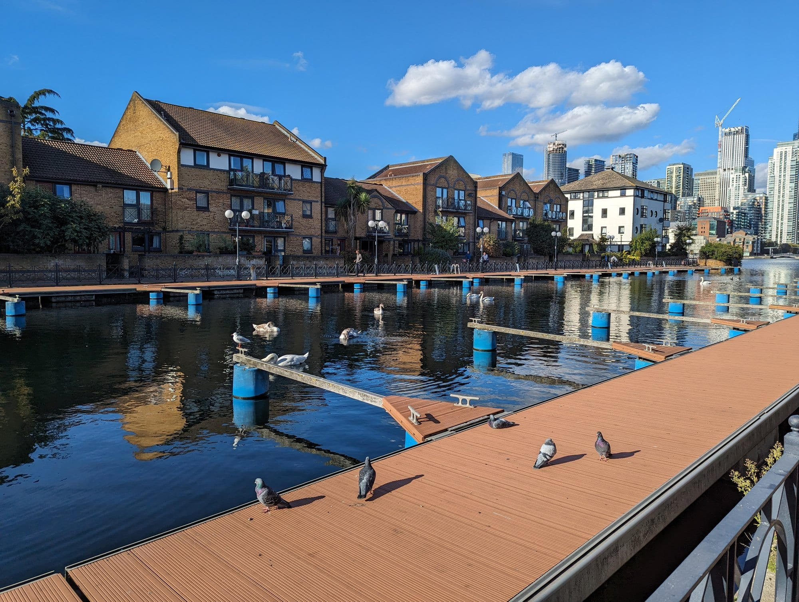
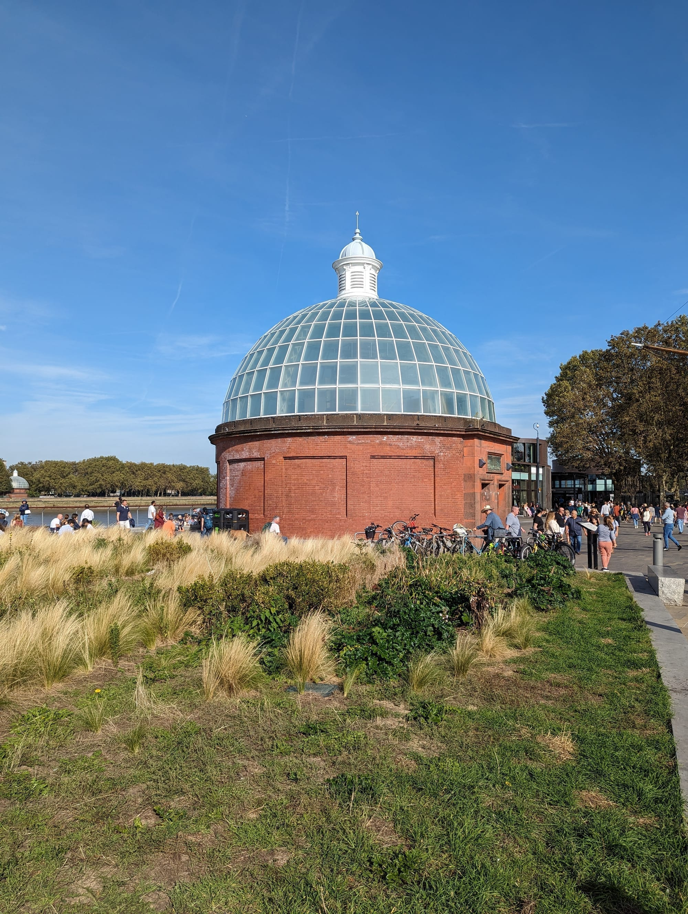
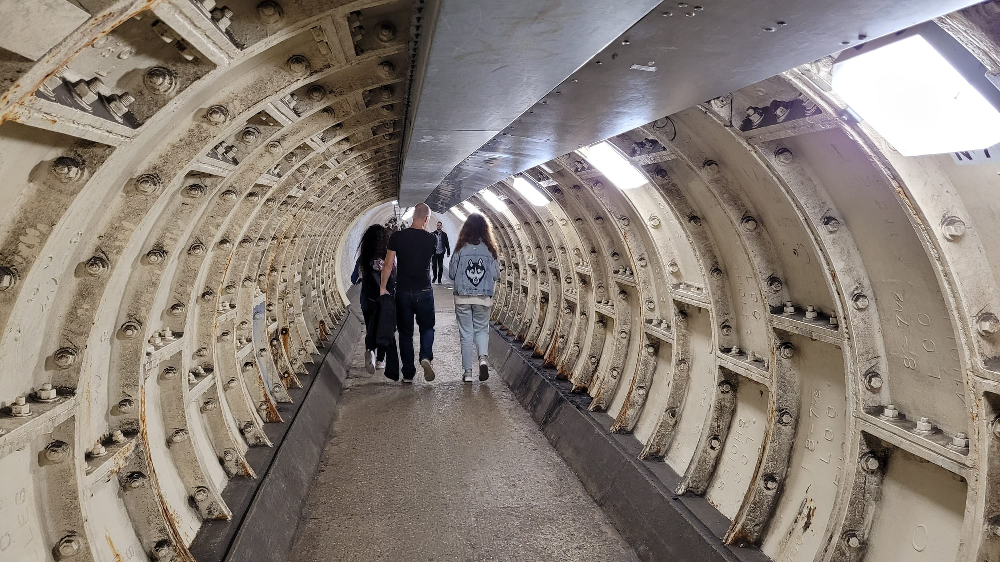
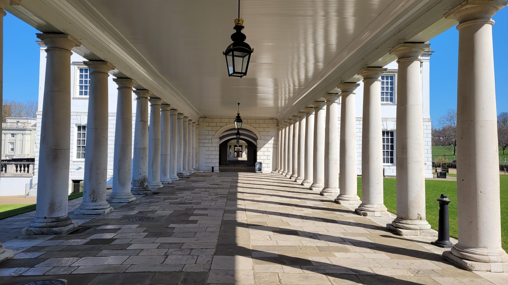
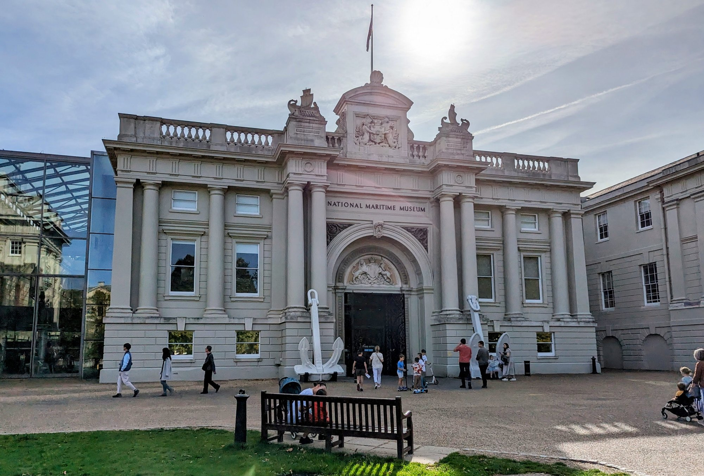
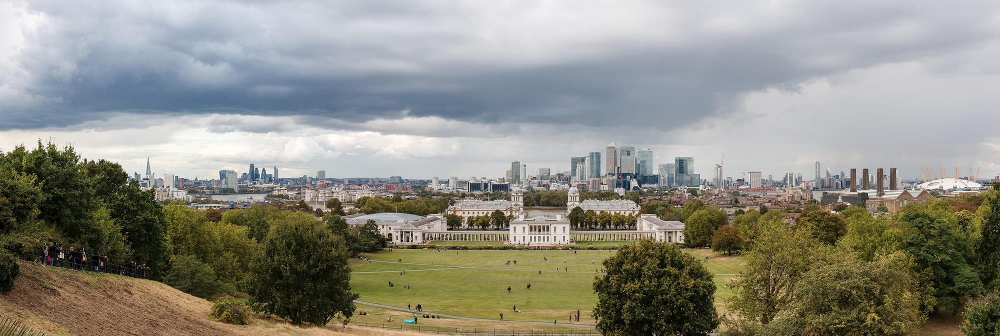

There are two good half-days here and almost nobody joins them up. Canary Wharf gets an hour from people waiting for a train; Greenwich gets a day trip that arrives by boat and leaves by boat. They are on opposite banks of the same reach of river, and the crossing between them is free and takes five minutes.

**This walk uses it.** Eleven stops, five on each bank, with the **Greenwich Foot Tunnel** exactly in the middle at stop six: a white-tiled 1902 tunnel under the Thames that you go down into at Island Gardens and come up out of beside the *Cutty Sark*. It is about **6.5km and takes three to four hours** with stops, or a full day if you go into the Observatory and the ship properly.

Eight of the eleven stops are free. The route also has a spine most people miss: **the Prime Meridian runs through both ends of it.** Crossrail Place at stop one sits almost exactly on the line and is planted by hemisphere because of it; the Royal Observatory at stop eleven is where the line was drawn.

For the areas either side — where to stay, where to eat, the O2, the swimming — see the [Canary Wharf area guide](/articles/canary-wharf-area-guide/) and the [Greenwich area guide](/articles/greenwich-area-guide/). This is the walking route that joins them.

> 💡 **The Short Version:** Walk **north to south**, starting at the free **Crossrail Place Roof Garden** and finishing on **Greenwich hill**. The **foot tunnel is free, open around the clock, and its lifts now run 24 hours** — the council publishes a live status page, so you can check before you commit to it. **Greenwich Market is open daily now**, whatever older guides say. Do the free museums before the paid ones: **London Museum Docklands** and the **National Maritime Museum** cost nothing and are better than their reputations. And you can trust your phone here — **Google Maps routes walkers through the tunnel** rather than sending you round by a bridge.

## The route

  

    Map of the walk, numbered in walking order
  

  

    
Loading the map…

  

  

    <i class="route-map-marker" aria-hidden="true">1</i> On the route, in walking order
    <i class="route-map-marker route-map-marker--alt" aria-hidden="true">+</i> Optional detour
  

  <noscript>
    
The map needs JavaScript. Every stop below is numbered in walking order with its nearest station.

  </noscript>

**[Open the whole route in Google Maps →](https://www.google.com/maps/dir/?api=1&origin=51.506102,-0.017603&destination=51.477362,-0.000846&waypoints=51.507634,-0.023869%7C51.505302,-0.022872%7C51.492045,-0.011673%7C51.486998,-0.008210%7C51.483291,-0.010166%7C51.482933,-0.009614%7C51.481583,-0.009045%7C51.481784,-0.006632%7C51.480776,-0.005123&travelmode=walking)** — all eleven stops in walking order, set to walking directions, which is the version to put on your phone. It comes back as **4.0 miles and about an hour and a half of actual walking**, with 377 feet of ascent — almost all of it in the last ten minutes.

| # | Stop | Cost | Open |
| --- | --- | --- | --- |
| **1** | Crossrail Place Roof Garden | Free | Daily |
| **2** | London Museum Docklands | **Free** | Daily 10am–5pm |
| **3** | Cabot Square and the docks | Free | Always |
| **4** | Mudchute Park and Farm | Free | Farm 9am–4pm, park dawn–dusk |
| **5** | Island Gardens | Free | Always |
| **6** | **Greenwich Foot Tunnel** | Free | **Around the clock** |
| **7** | Cutty Sark | **Ticket** | Daily 10am–5pm |
| **8** | Greenwich Market | Free | Daily 10am–5.30pm |
| **9** | Old Royal Naval College | Grounds free | Daily; Painted Hall ticketed |
| **10** | National Maritime Museum | **Free** | Daily 10am–5pm |
| **11** | Greenwich Park & the Observatory | Park free | Gates 6am–8pm |
| **+** | Wood Wharf and Eden Dock | Free | Always |
| **+** | The Trafalgar Tavern | Free to look | Pub hours |

---

## 1. Crossrail Place Roof Garden

*The best thing in Canary Wharf is on top of a station, and it is free. Most people walk underneath it to a train without knowing it is there.*

**Start on the roof of the Elizabeth line station**, in a garden that hardly anyone visits.

Crossrail Place is a timber lattice hull built into the old North Dock, so the whole structure sits in water. The **roof garden inside it is free to visit and open daily** — Canary Wharf's own line is that it is open "until 9pm or sunset in summer", and it is one of the largest roof gardens in London.

Here is the detail that makes it the right opening for this particular walk. **Crossrail Place sits almost exactly on the Meridian line**, and the planting is arranged by which hemisphere the species come from: **Asian plants such as bamboos to the east of the line, ferns and others from the Americas to the west.** You are standing on longitude zero, more or less, at the start of a walk that ends where longitude zero was invented.

There is an amphitheatre in the middle of it that local groups and schools use for free performances, and a food court on the level below if you want to start with coffee.

> 💡 **You can reach it without going outside.** Come up from the Elizabeth line, Jubilee or DLR platforms and follow signs for Crossrail Place. In heavy rain this stop and the next are both indoors.

## 2. London Museum Docklands

*A Georgian sugar warehouse with a museum inside it, five minutes north across the footbridge. Photo: [ell brown](https://www.flickr.com/photos/39415781@N06/6455266221), [CC BY 2.0](https://creativecommons.org/licenses/by/2.0/).*

**Free, open seven days, and the best hour on the north bank.** It is now called **London Museum Docklands** rather than the Museum of London Docklands, which is why you may not find it where you expect.

It occupies **No. 1 Warehouse on West India Quay**, a Georgian sugar warehouse that is one of the few things here older than the 1980s, and it covers four hundred years of the river, the port and London's part in the transatlantic slave trade across three floors. Its own guidance is that **entry is free with no need to book**, that it is **open 10am to 5pm every day**, and that you should allow at least an hour. The galleries start clearing twenty minutes before closing.

It is rarely busy, which is remarkable for a free museum this good five minutes from a Zone 2 station.

*West India Quay itself. The low brick terrace on the left is the warehouse range; the crane is one of several left standing along the dock.*

## 3. Cabot Square and the docks

*The docks face west, so this is what the last hour of light does to them. Worth timing an evening walk for, though it makes the hill at the far end a climb in the dark.*

Back over the footbridge and into the middle of the estate. This is **less a stop than twenty minutes of walking beside water** — which is the whole argument for doing this on foot rather than taking the DLR two stops.

Canary Wharf is built on the **West India Docks**, which handled sugar and rum from the 1800s until they closed in 1980. The water was kept. **Cabot Square** is the formal centre, with its fountain, and almost every walkway off it runs along a dock edge: Middle Dock, the Wood Wharf boardwalks, the basins under the DLR viaduct. Nothing here is ticketed and nothing closes.

Head **south across South Dock** and you leave the towers behind quickly. Within ten minutes the buildings drop to four storeys and you are on the Isle of Dogs proper.

> 💡 **The detour: Wood Wharf and Eden Dock.** Ten minutes east is the newest quarter — a waterside restaurant strip with a floating Hawksmoor, and **Eden Dock**, a set of planted floating islands and wetland walkways installed in Middle Dock. Both are free to walk. It adds twenty minutes to the round trip and it is the part of Canary Wharf that is busiest at weekends.

Powered by <a target="_blank" rel="sponsored" href="https://www.getyourguide.com/london-l57/">GetYourGuide</a>

## 4. Mudchute Park and Farm

**Working farmland in Zone 2, with the towers still visible over the fence.** This is the surprise of the walk and the reason to come down the middle of the island rather than along the river.

Mudchute is a community charity rather than an attraction, and it says so plainly: **32 acres, over a hundred animals, open every day, free of charge.** The **farm is open 9am to 4pm** — the animals start going in at 3pm, so arrive before then if the animals are the point — and the **park is open dawn to dusk**. There is a café in the courtyard, open Tuesday to Sunday.

The name is the giveaway about what the ground is. Mudchute's own history is that the land was **created from the spoil of dredging Millwall Dock** and then left alone for decades — and that in **1974 the Greater London Council earmarked it for a high-rise estate**. The islanders campaigned, the estate was never built, and the Mudchute Association was formed in 1977 to keep it. Everything you are standing in is the result of that.

*The docks on the way down — now marinas ringed with moorings and warehouse conversions. This stretch is easy to have almost entirely to yourself.*

## 5. Island Gardens

**A small riverside park at the southern tip of the Isle of Dogs, and the single best free view on the north bank.**

You come out of the trees onto a river wall and the whole of Maritime Greenwich is laid out directly opposite: **the Old Royal Naval College split into two wings, the Queen's House framed dead centre in the gap between them, and Greenwich Park rising behind with the Observatory on top.** Nothing about that composition is accidental, and it is the reason this is the arrival to walk towards rather than away from.

This is the **Canaletto view**, painted from about this spot in 1751, and it is protected in London's planning rules as a designated townscape view. It costs nothing and there is a bench.

**Look, then walk a minute west** along the river wall to the round brick building with the glass dome. That is the way across.

## 6. The Greenwich Foot Tunnel

*The southern rotunda, on the Greenwich side. There is an identical one at Island Gardens, and you would walk past either without registering it.*

**The hinge of the walk, and the reason to do it in this order.** You go down through a glazed rotunda on the Isle of Dogs, walk under the Thames through 1902 white tile, and come up in a UNESCO World Heritage Site.

The **former London County Council built it in 1902** so that workers living south of the river could reach the docks and shipyards on the north bank in any weather — the Woolwich tunnel followed in 1912. The **Royal Borough of Greenwich runs it on behalf of Tower Hamlets**, and it is free.

**The lift question is the one that matters, and the answer is now good.** The refurbishment delivered **four new lifts across the two tunnels which the council states are operational 24 hours every day**, along with CCTV throughout, new lighting, new rotunda roofs and external signs showing lift availability.

> 💡 **Check the lifts before you commit.** The council publishes a **[live status page for both ends of both tunnels](https://www.royalgreenwich.gov.uk/parking-transport-and-streets/travel-foot-bike-or-public-transport/check-status-foot-tunnels)**, with thirty-day availability figures beside each one. On 9 September 2026 both Greenwich lifts were in service, with **99.91% availability on the south lift and 99.93% on the north** over the previous thirty days. That is the number to look at rather than any guidebook, including this one. If a lift is down, the spiral stairs still work; if the tunnel itself is shut, the **DLR runs between Cutty Sark and Island Gardens** and takes three minutes.

Two rules people break. **You must not cycle through** — dismount and push. And **e-bikes are barred from the tunnel altogether**, which catches out hire-bike riders: you have to end the ride before you go in and start a new one on the other side.

One oddity worth knowing if you are walking in the evening: the tunnels are **wet-cleaned monthly, on the first Tuesday and Wednesday of the month between 8pm and 10pm**. It stays open, but there is a fair amount of water underfoot.

*Inside. Straight, lit, and about five minutes of walking — the sound is the part people remember.*

**Your phone will get this right, which is not a given for a river crossing.** Ask Google Maps for walking directions from Island Gardens to the Cutty Sark and it returns a **nine-minute, 0.3-mile route labelled "via Greenwich Foot Tunnel"**, drawn straight under the water. It does not send you round by Tower Bridge and it does not quietly put you on the DLR. The Google Maps link at the top of this page uses the tunnel too.

> ⚠️ **The council has applied to replace the lifts entirely.** Its submission to the Department for Transport's Structures Fund says the lifts and parts of the structure are at end of life, and a decision is expected in autumn 2026. Nothing about that affects a visit today, but it is the reason to check the status page rather than assume.

## 7. The Cutty Sark

**You come up and it is directly in front of you** — the last surviving tea clipper, in a dry dock and raised so that you can walk about underneath the hull, which is the part of the ticket that is actually worth the money.

**£22 adult and £11 child, open daily 10am to 5pm with last entry at 4.15pm.** Royal Museums Greenwich sells a **day pass covering the Cutty Sark and the Royal Observatory together for £38 adult and £19 child**, which is the saving to make if you intend to do both — and on this route you may well not.

If you are not going in, the ship is free to walk around and the dry dock is open to the street. **The Gipsy Moth** next to it has a large beer garden, and Greenwich Market runs a street food market on Cutty Sark Gardens.

## 8. Greenwich Market

*Under a roof, which makes it the wet-weather lunch stop as well as the good-weather one.*

Two minutes inland, and the lunch stop.

> ⚠️ **Ignore anything that tells you it shuts on Mondays.** The market's own guidance is now **daily, 10am to 5.30pm, including weekends and bank holidays**. The only closures it publishes are **Christmas Day and the first six Mondays of the year**, when the traders take a break after the Christmas rush. A great many guides — ours included, until we checked — still carry the old Tuesday-to-Sunday line.

It is covered, it is free to walk into, and it mixes crafts, antiques and makers with food rather than being one or the other, which is unusual for London. **Goddards at Greenwich** has been selling pie and mash a few doors away since 1890 — its own claim, and its recipes have not changed since — and it is the most Greenwich lunch available.

**Weekends are shoulder-to-shoulder.** A weekday gets you the same market with room to look at the stalls.

Powered by <a target="_blank" rel="sponsored" href="https://www.getyourguide.com/london-l57/">GetYourGuide</a>

## 9. The Old Royal Naval College

*Nineteen years of one man's work. Thornhill was paid a pound a square yard for the walls and three for the ceiling. Photo: [Maciek Lulko](https://www.flickr.com/photos/62401943@N06/10402473936), [CC BY 2.0](https://creativecommons.org/licenses/by/2.0/).*

**Wren's hospital for seamen, and the grandest set of buildings on the river.** Three different things here have three different answers on cost, so it is worth separating them.

**The grounds are free and open daily 8am to 11pm** — much longer than anything else on this walk, and the reason this is a good evening stop.

**The Chapel of St Peter and St Paul is open daily to everyone, 10am to 5pm.** It was built to Wren's design between 1696 and 1712, burned, and was rebuilt in 1779 by James 'Athenian' Stuart, whose neo-classical interior is the version you see. It is still an active place of worship and it is one of the finest rooms in London that most visitors walk straight past.

**The Painted Hall is the ticket: £19 general admission, and children go free** — up to four per paying adult. James Thornhill spent **nineteen years** on it, which is the fact everyone repeats, and the ticket converts into an annual pass at no extra cost, which is the fact nobody mentions. It includes a multimedia guide in eight languages including BSL, the Skittle Alley and the Discover Greenwich museum, and there are talks about the ceiling every half hour from 11am to 4pm.

> ⚠️ **The ticket desk and the Painted Hall are not the same building.** The Visitor Centre is 98m from the Cutty Sark; the Painted Hall is a further **245m** from the Visitor Centre. Allow for the walk. On access: the site is step-free between the gates, but the **toilets in the King William Undercroft below the Painted Hall currently have no step-free access, because the lift there is broken.**

*The colonnade running down to the Queen's House. Everything left on this walk is within five minutes of this spot.*

> 💡 **The detour: the Trafalgar Tavern.** Five minutes east along the river past the College is a pub that **opened in 1837**, the year Victoria came to the throne, and that Dickens used as the setting for Bella Wilfer's wedding breakfast in *Our Mutual Friend*. **Whitebait** is the thing to order — the whitebait dinners are what made it famous. One honest caveat from its own history: it shut in 1915 and did not reopen as a pub until **1965**, when the interior was gutted and remodelled by craftsmen from Pinewood Studios, so the Regency opulence you are sitting in is largely a film set. It is the best place on the route to stop if you have decided against the hill.

## 10. The National Maritime Museum and the Queen's House

*Free, and consistently underrated because it sits between two things that charge.*

**Both of these are free, and both are open daily 10am to 5pm with last entry at 4.15pm.** Royal Museums Greenwich recommends booking online, but neither needs a paid ticket.

The **National Maritime Museum** is the largest maritime museum in the world. **Nelson's Trafalgar coat** is the object people come out talking about — the museum's own description is that the bullet hole from the French sharpshooter who hit him is visible in the left shoulder, with blood on the tails and left sleeve thought to be his secretary's. The children's galleries are genuinely good rather than dutiful.

The **Queen's House** next door is the building framed in the gap you were looking at from Island Gardens. It is Inigo Jones's villa, it holds the art collection — including the Armada Portrait of Elizabeth I — and the **Tulip Stairs** inside it are, in the museum's words, the **first geometric self-supporting spiral stair in Britain**. Walking up them costs nothing. The house closes on 24, 25 and 26 December and otherwise runs seven days.

**Do these before the Observatory, not after.** They are free, they are at the bottom of the hill, and by the time you have climbed the hill you will not want to come back down for them.

## 11. Greenwich Park and the Royal Observatory

*The end of the walk, looking back at the beginning of it. The towers on the horizon are stop one.*

**The climb is steeper than it looks from the bottom.** Allow ten minutes from the Maritime Museum, take the path rather than the grass in wet weather, and know that there is a gentler approach from Blackheath Gate if you would rather not do it in one go. Google's profile for this route gives **377 feet of ascent**, and essentially all of it is here.

**Greenwich Park is free and its pedestrian gates are open 6am to 8pm.** It is the oldest enclosed royal park in London, there has been a deer herd in The Wilderness since the seventeenth century, and **the view from the top of the hill is free** — the Naval College and Queen's House directly below, the river, Canary Wharf opposite and the O2 to the right.

**The Royal Observatory at the summit is ticketed: £24 adult, £12 child.** Standard hours are 10am to 5pm with last entry at 4pm; through **September it opens until 6pm with last entry at 5pm**. That buys the Prime Meridian line in the courtyard, Wren's Octagon Room and the Great Equatorial Telescope, plus optional daily Treasures tours at 11am and 3pm for £5 more.

**You do not have to pay to finish this walk well.** The view from the hill outside is the famous one and it is free, and after eleven stops and a river crossing, standing on the hill looking back at Canary Wharf is a better ending than a queue.

---

## Where to eat

The good news about this route is that the food is at both ends and in the middle, so you are never more than half an hour from lunch.

**Greenwich Market at stop eight is the answer.** Covered, daily, and stalls rather than restaurants — go before noon or after two, and go on a weekday if you want to be able to see what is on the tables. **Goddards** for pie and mash is a few doors away.

If you want to eat before you cross:

- **Wood Wharf** (££–£££) — the waterside restaurant strip on the detour at stop three, including a Hawksmoor that floats on the dock. The best sit-down food on the north bank and the busiest part of Canary Wharf at weekends.
- **Mercato Metropolitano** (£) at 10 George Street — a food hall, and the budget option on that side.
- **The West India Quay arches** (££) at stop two — chain restaurants, but they face the water and they open at weekends.
- **Mudchute Kitchen** (£) at stop four — a farm café, Tuesday to Sunday, and the only food on the middle third of the walk.

And after:

- **The Trafalgar Tavern** (££) — the Dickens pub on the river, five minutes east of the Naval College.
- **The Old Brewery** (££) — inside the Naval College grounds, so it works as a stop rather than a detour.
- **The Gipsy Moth** (££) — beside the Cutty Sark, with a large beer garden.

For the full picture at either end, the area guides cover it: [Canary Wharf](/articles/canary-wharf-area-guide/#where-to-eat-and-drink) and [Greenwich](/articles/greenwich-area-guide/#where-to-eat-and-drink).

## The best day to go

**Any day works, which is unusual for a London walk.** Nothing you would build the day around has a weekly closure — the two free museums, the market, the Cutty Sark, the Painted Hall, the tunnel and the parks all run seven days. This route has no Borough Market problem.

| Day | What you get |
| --- | --- |
| **Tue–Thu** | The quietest version. Greenwich Market with room to browse and Canary Wharf at full working pace |
| **Monday** | Everything open. Mudchute's courtyard café is the one thing shut, outside school holidays |
| **Friday** | Same as above, and Canary Wharf's bars fill from about 5pm |
| **Saturday** | Greenwich shoulder-to-shoulder; Wood Wharf and Eden Dock at their best |
| **Sunday** | Greenwich busy, Canary Wharf's malls on short hours, everything else normal |

**What actually closes:** almost nothing. **Greenwich Market** shuts on Christmas Day and the **first six Mondays of the year**. The **Queen's House** closes 24 to 26 December. Canary Wharf's shopping malls keep short Sunday hours, which matters only if you were planning to shop.

**On time of day:** start at 10am and you reach the market at about one and the hill in the late afternoon, with the light behind you looking back at the City — which is when that view is at its best. Start later than midday in winter and you will be climbing the hill in the dark.

**On the season:** the tunnel, the parks and the docks work in any weather, and both museums and the market are indoors, so this is a better wet-day walk than it sounds.

Powered by <a target="_blank" rel="sponsored" href="https://www.getyourguide.com/london-l57/">GetYourGuide</a>

## Getting there and back

**Start:** Canary Wharf (Elizabeth line, Jubilee, DLR). The Elizabeth line is six minutes from Liverpool Street and about thirteen from Bond Street, and the roof garden is directly above the platforms.

**Finish:** Greenwich or Cutty Sark (DLR and, at Greenwich, National Rail), or **Greenwich Pier** for Uber Boat by Thames Clippers, which is the best way to leave. Cutty Sark station closed for a full escalator replacement in 2025 and is **open and running normally again**.

**Cutting it short** is easy for the first two-thirds: the DLR shadows the whole Isle of Dogs, with stations at Heron Quays, South Quay, Crossharbour, Mudchute and Island Gardens, so you are never more than five minutes from a train. After the tunnel you are in Greenwich and everything is walkable.

**On step-free access:** the route is flat and paved from stop one to stop ten. The two pinch points are the **foot tunnel**, which depends on the lifts — running 24 hours, with the status page above to check — and the **climb to the Observatory**, which is a genuine hill with no lift at all. Stopping at stop ten gives you a step-free walk end to end.

**Walked the other way**, Greenwich to Canary Wharf, it works and the tunnel is just as good. But you do the hill first, before you know what you are looking at, and you finish at an office estate rather than a view. This direction is better.

## Carry on walking

- **[Wapping to Canary Wharf](/articles/wapping-canary-wharf-walk/)** — ends at Crossrail Place, where this one starts, so walk it first.

## What to do with the rest of the day

- **[The South Bank walk](/articles/south-bank-walk/)** — the other river route, on the opposite bank and eleven stops of its own.

- **[The Greenwich area guide](/articles/greenwich-area-guide/)** — the O2, North Greenwich, the river boats and where to stay.
- **[The Canary Wharf area guide](/articles/canary-wharf-area-guide/)** — the swimming, Eden Dock, Winter Lights and the rest of the estate.
- **[Walks along the Thames](/articles/london-walks-along-the-thames/)** — six more river stretches, including Rotherhithe to Greenwich, which arrives at stop seven from the other direction.
- **[Free things to do in London](/free/)** — eight of these eleven stops cost nothing.
