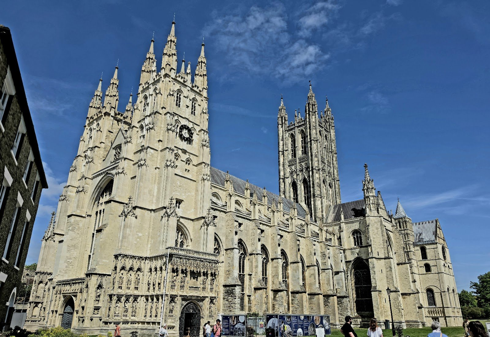
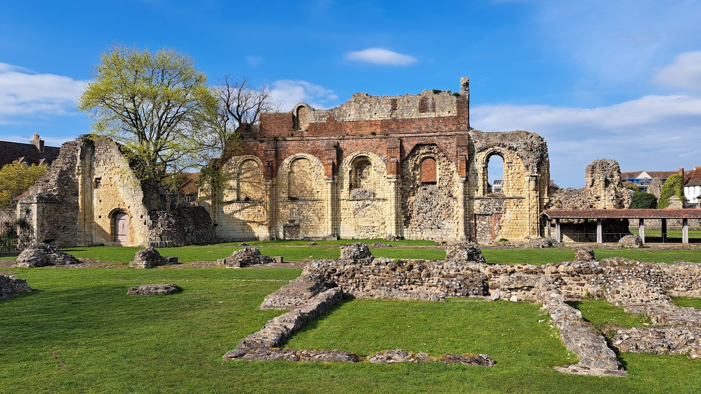
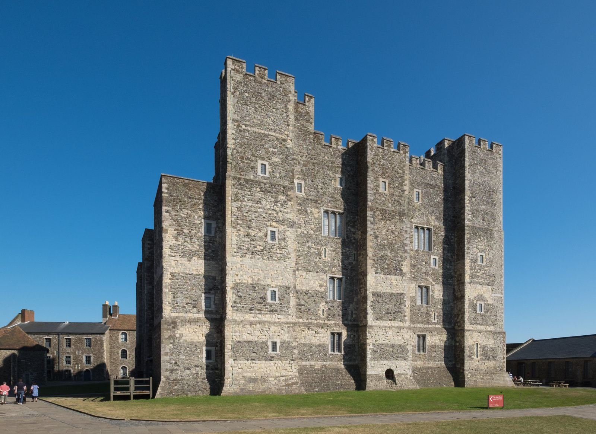
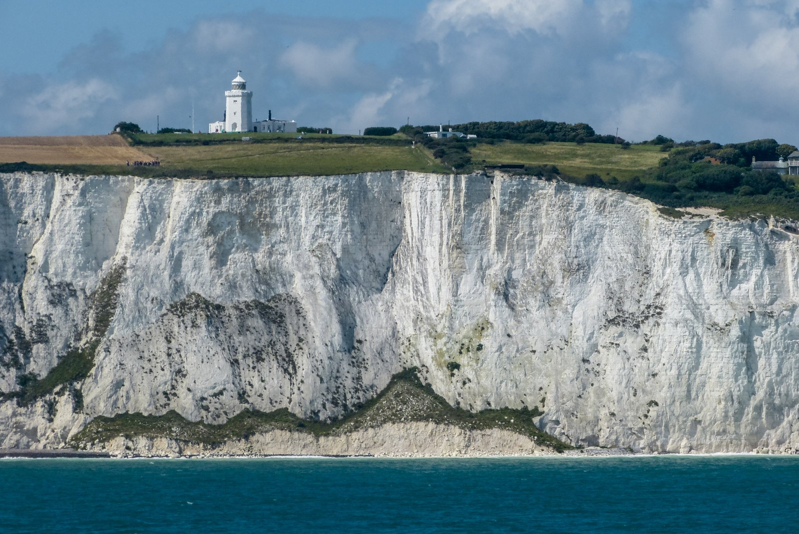
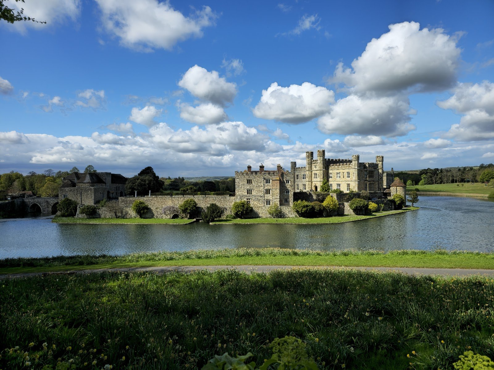

**Canterbury and Dover are each under an hour from London on Southeastern's high-speed line out of St Pancras, and both work well as their own day trip.** Leeds Castle is the odd one out: it has no station worth the name, so the only way to fit all three into a single day is one of the coach tours that link them, typically £79–£125 from central London.

This guide covers Canterbury alone, Dover alone, and the tours that do the full trio — including which of those tours is worth booking, and which is really a photo stop dressed up as a visit.

> 💡 **The Short Version:** **Canterbury**: St Pancras to Canterbury West is **54–58 minutes direct** on the high-speed line; Victoria to Canterbury East is **1h30 direct** but cheaper. **Canterbury Cathedral is £19.50** (April–September) or **£18.00** (October–March), **kids free**. **Dover**: St Pancras to Dover Priory is **1h06 direct**; Victoria is **up to 2 hours**. **Dover Castle from £24.65** on a weekday, includes the Secret Wartime Tunnels. **The White Cliffs walk is free.** **Leeds Castle has no useful station** — the nearest, Bearsted, is a 5-minute taxi or 30–40 minute walk from the gate — so seeing it alongside Canterbury and Dover in one day means **a coach tour, from £79**. **Or book the tour that does all three** — <a href="https://www.getyourguide.com/london-l57/leeds-castle-private-viewing-canterbury-cathedral-dover-t2257/?partner_id=WWP7I0R&amp;cmp=canterbury-dover-day-trip" target="_blank" rel="sponsored nofollow noopener" data-affiliate="gyg">Leeds Castle, Canterbury Cathedral & Dover at £105</a> covers the whole trio in one booking.

**Book a tour direct:**

- **£79** — <a href="https://www.getyourguide.com/london-l57/from-london-white-cliffs-of-dover-and-canterbury-day-trip-t106654/?partner_id=WWP7I0R&amp;cmp=canterbury-dover-day-trip" target="_blank" rel="sponsored nofollow noopener" data-affiliate="gyg">White Cliffs of Dover and Canterbury Day Trip</a> — Canterbury and the White Cliffs walk, no Leeds Castle, the best-reviewed tour on this route at 4.6 from 3,231 reviews
- **£105** — <a href="https://www.getyourguide.com/london-l57/leeds-castle-private-viewing-canterbury-cathedral-dover-t2257/?partner_id=WWP7I0R&amp;cmp=canterbury-dover-day-trip" target="_blank" rel="sponsored nofollow noopener" data-affiliate="gyg">Leeds Castle, Canterbury Cathedral & Dover</a> — all three in one day, 4.4 from 805 reviews
- **£110** — <a href="https://www.getyourguide.com/london-l57/from-london-canterbury-white-cliffs-and-dover-castle-t65397/?partner_id=WWP7I0R&amp;cmp=canterbury-dover-day-trip" target="_blank" rel="sponsored nofollow noopener" data-affiliate="gyg">Canterbury Cathedral, Dover Castle and White Cliffs</a> — the one that gets you inside Dover Castle itself, not just the cliffs

Powered by <a target="_blank" rel="sponsored" href="https://www.getyourguide.com/london-l57/">GetYourGuide</a>

## Canterbury by train

Two railways reach Canterbury, landing at two different stations about 15 minutes' walk apart — worth knowing before you book a return.

| | St Pancras → Canterbury West | Victoria → Canterbury East |
| --- | --- | --- |
| **Line** | Southeastern high-speed (HS1) | Southeastern classic line |
| **Fastest, direct** | **54–58 min** | **1h30** |
| Cheapest single (Super Off-Peak) | **£43.00** | **£35.50** |
| Anytime Day Single | £50.80 | £42.70 |

**The high-speed line is roughly twice as fast for about £7–8 more each way.** A classic-line ticket bought for travel that avoids the fast trains entirely runs cheaper still, around £41.20, but the journey stretches past two hours with a change at Ashford — not a saving worth making on a day trip. Super Off-Peak fares carry a later time restriction than plain Off-Peak, so they suit a mid-morning start rather than the first train out.

> ⚠️ **St Pancras trains use Canterbury West; Victoria trains use Canterbury East.** If you go out on the fast line and come back the slow way — or the other way round — you need to walk between stations, not change platforms.

## Canterbury Cathedral

The reason most people come, and the one unmissable sight in the city.

| Ticket, booked in advance | Price |
| --- | --- |
| **Adult, April–September** (excl. weekends in Jul/Aug) | **£19.50** |
| **Adult, October–March** | **£18.00** |
| Adult, weekends in July & August | £21.00 |
| **Under-18s** | **Free, every day** |
| Canterbury World Heritage Pass, adult (Cathedral + St Martin's Church + St Augustine's Abbey) | £29.50 |
| Media guide hire | £5 |

Admission covers the Cathedral, Precincts, gardens, exhibitions and a guided trail; the media guide is optional. **Opening hours are Monday to Saturday 10:00–17:00, last admission 16:00.** Sunday is different: the grounds and shop open at 11:30, but the church itself doesn't open to visitors until 12:30, running through to 17:00 with the same 16:00 last-admission cutoff. The Cathedral can close parts of itself at short notice for services, so build in some slack rather than timing a visit to the last half hour.

**The World Heritage Pass is worth it if you're staying more than an hour or two**: for £29.50 it also covers St Martin's Church, the oldest parish church in continuous use in the English-speaking world, and the English Heritage ruins of St Augustine's Abbey, both a short walk from the Cathedral gates.

## Dover by train

One station, and the fast line's advantage is bigger than on the Canterbury run.

| | St Pancras → Dover Priory | Victoria → Dover Priory |
| --- | --- | --- |
| **Fastest, direct** | **1h06** | **Up to 1h59** |
| Fastest, one change | — | **1h32** |
| Cheapest single (Super Off-Peak) | **£43.00** | **£34.90** |
| Anytime Day Single | £58.60 | £50.50 |

> ⚠️ **"Direct" from Victoria isn't always the fastest option.** The no-change Victoria service can take close to two hours; a service with one interchange does the same trip in around 1h32. Check the journey time on the specific train, not just whether it changes.

## Dover Castle

England's largest castle, and the admission price includes the Secret Wartime Tunnels tour used to run the Dunkirk evacuation.

| Adult admission (with 10% Gift Aid) | To 18 Oct 2026 | From 19 Oct 2026 |
| --- | --- | --- |
| **Weekday** | **£24.65** (£27.20) | £27.03 (£29.75) |
| **Weekend** | £27.03 (£29.75) | **£24.65** (£27.20) |
| Child, weekday / weekend | £12.32 / £13.51 | £13.51 / £12.32 |
| Family (2+3), weekday / weekend | £61.79 / £67.57 | £67.57 / £61.79 |

**The cheaper day of the week flips at the end of October** — weekdays are the bargain now, weekends are from 19 October. English Heritage members go free. **Hours are daily 10:00–17:00 to 18 October, then 10:00–16:00 from 19 October.**

## The White Cliffs walk

The clifftop path is National Trust open-access land, not a ticketed attraction — there's no admission charge to walk it. The usual starting point is the Trust's Gateway visitor centre at Langdon Cliffs, a signed route up from Dover town, from where the path runs out towards South Foreland Lighthouse with the sea on one side and grazed chalk grassland on the other. The cliffs themselves reach about 110m and stretch for roughly eight miles either side of Dover; dogs are welcome on leads through the grazing land. Wear proper shoes — the path runs close to unfenced drops in places — and check the tide and weather before you go, since the cliff edge is exposed to the Channel wind.

## Leeds Castle — why the coach is the practical way in

Leeds Castle sits between Maidstone and Ashford, and unlike Canterbury or Dover, no train runs anywhere near the gate.

| Ticket | Online | Onsite |
| --- | --- | --- |
| **Adult Explorer** | **£34.50** | £38.50 |
| Adult Ultimate Explorer | £45.50 | £49.50 |
| **Child (3–15) Explorer** | **£24.50** | £28.00 |
| Family 1 (1 adult + up to 3 children) | £87.00 | £97.00 |
| Family 2 (2 adults + up to 3 children) | £115.00 | £128.50 |
| Under-3s | Free | Free |

Admission covers unlimited return visits for a year. **Current hours (1 October–19 November 2026): grounds 10:00–17:00, the Castle itself 10:30–15:30, last entry 15:00.**

**By train, Southeastern runs to Bearsted and Hollingbourne**, 25–30 minutes from Ashford International or 70–75 minutes from Victoria — but from either station it's still a 5-minute taxi ride or a 30–40 minute walk to the gate, with no shuttle bus laid on. Leeds Castle's own green-travel offer gives 20% off admission if you show a same-day train, bus or cycling ticket at the Visitor Centre, which takes some of the sting out of the taxi fare. For a solo day trip from London, the maths rarely works: a 70-minute train plus a 30-minute walk each way eats most of a day before you've reached the gate, which is why the coach operators — Evan Evans, Golden Tours and Premium Tours all run scheduled sightseeing coaches here — are how most visitors from London actually arrive.

## The tours that do all three in one day

**Be honest with yourself about what these buy you: a full but rushed day, with an hour or two at each stop rather than a leisurely visit to any of them.** They're the only way to see Leeds Castle, Canterbury and Dover together without two full separate days, and the better-reviewed ones are genuinely good value against the £34.50 Leeds Castle ticket alone.

| Tour | Price | Rating | What it adds |
| --- | --- | --- | --- |
| <a href="https://www.getyourguide.com/london-l57/leeds-castle-private-viewing-canterbury-cathedral-dover-t2257/?partner_id=WWP7I0R&amp;cmp=canterbury-dover-day-trip" target="_blank" rel="sponsored nofollow noopener" data-affiliate="gyg">Leeds Castle, Canterbury Cathedral & Dover</a> | **£105** | 4.4, 805 reviews | The most-reviewed of the three-stop tours |
| <a href="https://www.getyourguide.com/london-l57/leeds-castle-canterbury-dover-and-greenwich-t1309/?partner_id=WWP7I0R&amp;cmp=canterbury-dover-day-trip" target="_blank" rel="sponsored nofollow noopener" data-affiliate="gyg">Leeds Castle, Canterbury, Dover and Greenwich</a> | £105 | **4.7**, 120 reviews | Adds a Thames river cruise through Greenwich on the way back |
| <a href="https://www.getyourguide.com/london-l57/leeds-castle-canterbury-dover-greenwich-boat-ride-snack-t969/?partner_id=WWP7I0R&amp;cmp=canterbury-dover-day-trip" target="_blank" rel="sponsored nofollow noopener" data-affiliate="gyg">Leeds Castle, Canterbury, Dover & Greenwich Boat Ride</a> | £98 | 4.4, 338 reviews | Early entry and mead tasting at Leeds Castle, plus a Greenwich boat ride |

**If Leeds Castle isn't the point and you just want Canterbury and Dover together, skip the castle stop entirely** — the two-stop tours run cheaper and leave more time at each place:

| Tour | Price | Rating | Worth knowing |
| --- | --- | --- | --- |
| <a href="https://www.getyourguide.com/london-l57/from-london-white-cliffs-of-dover-and-canterbury-day-trip-t106654/?partner_id=WWP7I0R&amp;cmp=canterbury-dover-day-trip" target="_blank" rel="sponsored nofollow noopener" data-affiliate="gyg">White Cliffs of Dover and Canterbury Day Trip</a> | **£79** | **4.6**, 3,231 reviews | Cheapest and by far the most booked; the White Cliffs stop is a walk, not a Dover Castle visit |
| <a href="https://www.getyourguide.com/london-l57/from-london-canterbury-white-cliffs-and-dover-castle-t65397/?partner_id=WWP7I0R&amp;cmp=canterbury-dover-day-trip" target="_blank" rel="sponsored nofollow noopener" data-affiliate="gyg">Canterbury Cathedral, Dover Castle and White Cliffs</a> | £110 | 4.6, 1,173 reviews | The only one of the three that takes you inside Dover Castle |
| <a href="https://www.getyourguide.com/london-l57/from-london-tour-of-the-kent-coast-and-canterbury-t391446/?partner_id=WWP7I0R&amp;cmp=canterbury-dover-day-trip" target="_blank" rel="sponsored nofollow noopener" data-affiliate="gyg">Canterbury & White Cliffs of Dover Tour</a> | £79 | 4.7, 492 reviews | Small-group, with more time allowed at each stop |

> ⚠️ **Read what "Dover" means on the tour before you book.** Most of these tours stop at the White Cliffs for a walk and a view, not at Dover Castle. Only the £110 tour above puts you inside the castle itself — if the tunnels and the keep are the point, that's the one to pick, not the cheaper cliffs-only trips.

Powered by <a target="_blank" rel="sponsored" href="https://www.getyourguide.com/london-l57/">GetYourGuide</a>

## How long each day takes, and the trains home

**Canterbury**: the first direct high-speed train from St Pancras is **06:37, arriving 07:40** — early, but not a pre-dawn start. **The last direct train back is 22:23, arriving 23:18.** After that, the next service takes over six hours with a change, so 22:23 is a hard deadline, not a soft one. That gives a genuine 14-hour day if you want it, though the Cathedral's own last admission at 16:00 (17:00 on Sundays) means the sightseeing day is really over by mid-afternoon — the extra hours are for the rest of the city, or Dover, if you've paired the two.

**Dover**: the first direct high-speed train is **07:07, arriving 08:13**, and the **last direct train back is 22:48, arriving 23:54.** Dover Castle's last admission is earlier than the Cathedral's — 17:00 to 18 October, then 16:00 — so plan the castle for the first half of the day and leave the White Cliffs walk, which has no closing time, for whenever the light holds.

A **16-25 Railcard, Disabled Persons Railcard or Two Together Railcard** cuts a third off Off-Peak and Super Off-Peak singles on both routes, which turns the £43.00 Super Off-Peak Canterbury or Dover fare into around £28.70 — worth having if you're making this trip more than once.

## What people get wrong

- **Booking Canterbury from Victoria without checking the time.** It's genuinely direct, but it's 1h30 against 54–58 minutes from St Pancras — a real difference on a day trip.
- **Assuming Dover from Victoria is quicker because it says "direct."** The no-change service can take nearly two hours; a train with one change is often faster.
- **Turning up at Canterbury Cathedral on a Sunday morning expecting to go straight in.** The church doesn't open until 12:30, even though the grounds open at 11:30.
- **Booking a "Canterbury and Dover" tour expecting to see Dover Castle.** Most of them stop at the White Cliffs for a walk; only one of the tours above takes you inside the castle.
- **Trying to reach Leeds Castle by train without budgeting for the taxi or the walk.** The nearest stations are 70–75 minutes from Victoria, and then still 30–40 minutes on foot from the gate.
- **Not showing a train ticket at Leeds Castle.** The 20% green-travel discount is only given at the Visitor Centre, on production of the ticket.
- **Booking Dover Castle without checking which half of the pricing calendar you're in.** The cheap day of the week swaps from weekday to weekend on 19 October.

All prices and times checked 28 September 2026.

## Continue planning your day out

- 🗺️ **[Day trips from London](/articles/day-trips-from-london/)** — what the others cost, how long they take, and which days they are shut.
- 🎓 **[Cambridge from London](/articles/cambridge-day-trip/)** — another under-an-hour train, priced and timed the same way.
- 🛁 **[Bath day trip](/articles/bath-day-trip/)** — the other big train day out, and how its Advance fares compare with Southeastern's Off-Peak singles.
- 🗿 **[Stonehenge from London](/articles/stonehenge-day-trip/)** — the other trip where a coach tour beats the train outright.
- 🐑 **[The Cotswolds from London](/articles/cotswolds-day-trip/)** — the same "no useful station" problem Leeds Castle has, solved the same way.
- 🚇 **[London transport costs and fares](/articles/london-public-transport-costs-and-fares/)** — how contactless and capping work on the London end of the trip.
