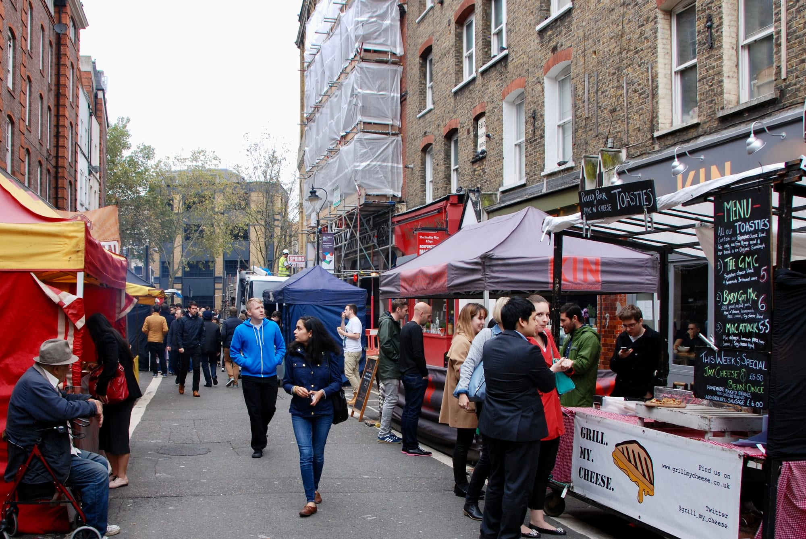
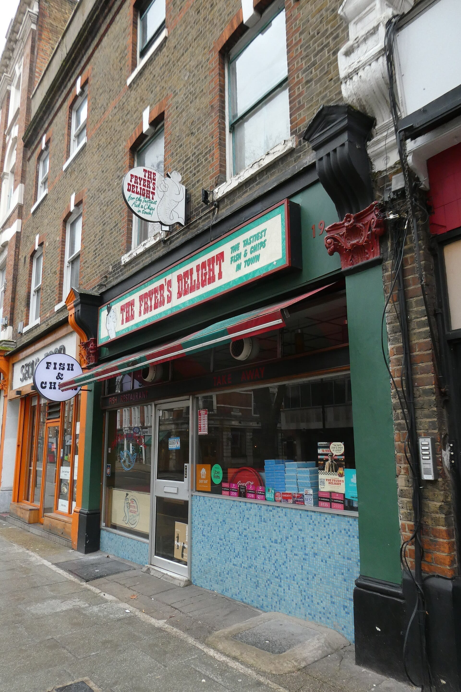
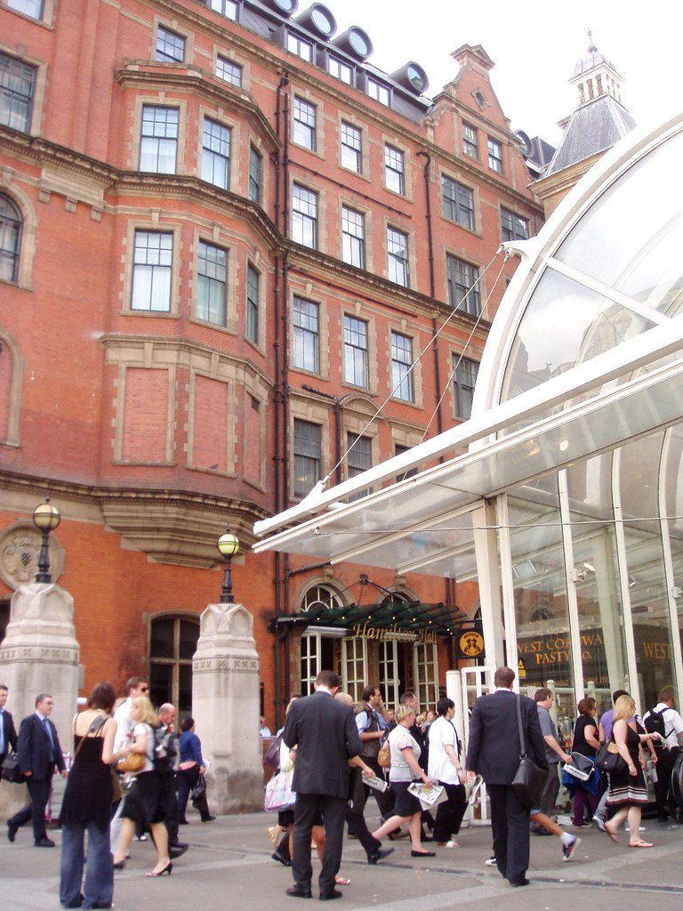

Eating cheaply in London is not the same as eating badly, and the places that prove it are almost never restaurants. They are market stalls, pizza slice counters and takeaway windows — where you are paying for food rather than for table service and a rent-heavy dining room.

Nothing on this page is here because it is *good value for the money*. That is a different question, and a £60 tasting menu can answer it. Everything here is here because **the price itself is the reason to go**: a full meal for less than the cost of two coffees in Soho.

> 💡 **The Short Version:** **ICCO** does a twelve-inch pizza for £3.95. **Kolkati** at Seven Dials is the best fiver in Covent Garden. **Michael's Fish Bar** is the cheapest good chippy in London — bring cash. **Horn OK Please** at Borough Market is the best cheap vegetarian food in the city. And **Kung Fu Noodle** is a proper cooked meal minutes from Leicester Square.

> 📊 **The evidence behind this guide**
> Nothing here is ranked on one visit. This pass reads **11 sources carrying 183 citations** across **140 named places**. **11 places are named by two or more independent sources.**
> **Built on:** 140 places across every corner of London, and the eleven several writers independently rate. Some entries are the cheap version of something with its own guide here, and carry the count from **their own** sources, labelled — *Cited by 7 fish and chips sources*. A bare number always means the cheap-eats sources.
> *Evidence rebuilt 30 August 2026 · [How we rank →](/how-we-rank/)*

## Where they are

  

    Map of the cheap eats in London
  

  

    
Loading the interactive map…

  

  

    <i class="restaurant-map-key restaurant-map-key--editorial" aria-hidden="true"></i> Recommended in this guide
    <i class="restaurant-map-key restaurant-map-key--streetfood" aria-hidden="true"></i> Market stall, counter & food hall
  

  <noscript>
    
The interactive map requires JavaScript. Every entry below lists its area.

  </noscript>

| If you are near… | Where to eat |
| --- | --- |
| **Fitzrovia & Tottenham Court Road** | ICCO, PaStation, Shree Krishna Vada Pav, The Attendant |
| **Soho & Piccadilly** | Breadstall, Govinda's |
| **Covent Garden & Leicester Square** | Kolkati, Bad Boy Pizza Society, Saravanaa Bhavan, Sagar |
| **Chinatown** | Kung Fu Noodle |
| **Waterloo & Lower Marsh** | Marie's Café |
| **Euston** | Murger Han |
| **King's Cross** | Paolina Thai Cuisine |
| **Borough & London Bridge** | Horn OK Please, Gujarati Rasoi |
| **Holborn & Bloomsbury** | Hiba Express, The Fryer's Delight, Tongue & Brisket (Leather Lane) |
| **City & Liverpool Street** | The Crosse Keys, Hamilton Hall |
| **Canary Wharf** | The Ledger Building |
| **Spitalfields & Shoreditch** | Sud Italia |
| **North & East London** | Voodoo Ray's (Dalston), Mickey's Chippy (Stoke Newington), Michael's Fish Bar (Leytonstone), Comalera (Walthamstow), Indian Veg (Islington) |
| **South London** | Ken's Fish Bar (Herne Hill), Fish Lounge (Clapham), Silk Road (Camberwell) |
| **Greenwich & West** | Hullabaloo, Sarv's Slice (Ealing) |

---

## Under a fiver

### ICCO, Fitzrovia

*£3.95 · 46 Goodge Street · 2 min from Goodge Street* · Cited by 2 italian sources

**A twelve-inch pizza from £3.95**, made to order and eaten in, two minutes from Goodge Street — roughly a third of what anywhere else in central London charges. Trading since 1999 and calling itself "the People's Pizzeria".

**The £3.95 is the marinara**, which has no cheese — tomato, garlic and oregano, and a perfectly good pizza in its own right. Toppings push the price up and it stays cheap; nothing on the board reaches double figures.

**Under £10, walk-in, counter-style and busy in the evenings.** A quick meal rather than a night out, and there is a second site in Camden.

### Kolkati, Covent Garden

*£ · Seven Dials Market · 3 min from Covent Garden · walk-in*

**Kati rolls the Kolkata way** — and the detail that matters is the bread: a **paratha cooked with egg through it**, so the wrap is layered and slightly custardy rather than a dry tortilla.

That paratha is wrapped round spiced chicken or paneer with **pickled onion and lime**, and eaten standing. It is Kolkata's answer to a kebab and almost nowhere else in London makes it properly.

**£, walk-in, counter only.** Covent Garden. Under a fiver for the vegetarian roll and not much more for the chicken.

### Shree Krishna Vada Pav, Fitzrovia

*£ · 4 min from Oxford Circus · walk-in* · Cited by 1 source

**Vada pav — the Mumbai potato-fritter roll — done properly and cheaply**, from a counter rather than a dining room.

A **vada pav** is a spiced potato fritter in a soft bun with dry garlic chutney: Mumbai's street sandwich, sold on every corner there and almost nowhere here. **Pav bhaji** and misal pav alongside, all under a fiver.

**£, walk-in, counter only.** Several London sites. Among the cheapest things in this guide and one of the most specific.

---

## Market stalls

The cheapest serious food in central London, and the reason to walk through a market at lunchtime.

### Horn OK Please, Borough

*£ · Borough Market · 4 min from London Bridge · walk-in*

**Samosa chaat built to order** — the samosas **crushed under chickpea curry, yoghurt and tamarind while still hot**, which is the trick and the reason it does not go soggy on the way to you.

An all-vegetarian Borough Market stall named for the slogan painted on the back of Indian lorries. **Pav bhaji and dosa** alongside the chaat, cooked in front of the queue and served in boxes.

**£, walk-in, closed Monday, market hours only** — this is lunch, and it is gone well before evening.

### Gujarati Rasoi, Borough

*£ · Borough Market · 4 min from London Bridge · walk-in*

**Mother-and-son Gujarati cooking from family recipes** — thalis, bhajia and dhal — **at a market where almost everything else is European**, which is the reason the queue is what it is.

Gujarati food balances sweet, sour and spicy in a way no other Indian regional cuisine does, and the **thali** is the way to see it: several small dishes, rice, bread and dal on one tray. **Undhiyu** in season is the dish to ask about.

**£, walk-in, closed Monday, market hours.** Borough Market, and one of very few stalls there cooking a home tradition rather than a restaurant one.

### Bad Boy Pizza Society, Covent Garden

*£ · Seven Dials Market · 2 min from Covent Garden · walk-in* · Cited by 8 pizza sources

**Twenty-two-inch New York pies sold by the slice** from a counter inside Seven Dials Market — and, unusually for a market stall, **a two-time National Pizza of the Year winner**.

New York style means a wide, foldable slice with a thin base and a crisp edge — a different thing from the Neapolitan rounds elsewhere in these guides. Sold by the slice, so a serious lunch costs a few pounds.

**£, walk-in, and it trades on Seven Dials Market hours rather than its own.** The brand also runs residencies at Vinegar Yard and The Railway in Tulse Hill, and opened its first permanent restaurant on Bethnal Green Road in August 2025.

### Sud Italia, Spitalfields

*£ · Old Spitalfields Market · 8 min from Aldgate East · walk-in* · Cited by 1 source

**Wood-fired pizza from a stall in Old Spitalfields Market** — one of the few genuine market pizzas in central London, baked in a mobile oven rather than reheated.

A short Neapolitan list: **margherita and marinara** off a properly fermented dough, blistered in ninety seconds and handed over folded in paper. Nothing costs much and nothing is complicated.

**£, walk-in, and it trades on market hours only.** Old Spitalfields, and the lunch queue is the market's own workers as much as visitors.

### Comalera, Walthamstow

*£ · 2 min from St James Street · walk-in* · Cited by 3 mexican sources

**A Walthamstow stall pressing its own tortillas** — and **the cheapest serious tacos on any of these lists**.

A *comal* is the flat griddle a tortilla is cooked on, and the name is the promise: masa pressed and griddled to order rather than bought in packs, which is the single thing that separates a good taco from a bad one. A short list of fillings, salsas made on site.

**£, walk-in, and open Friday to Sunday only** — closed Monday through Thursday, so check the day before travelling.

### Hullabaloo, Greenwich

*£ · Greenwich Market · 4 min from Cutty Sark · walk-in*

**A permanent fixture in Greenwich Market rather than a rotating stall**, doing vegetarian and vegan Indian street food — which means it is there when you are, unlike most market traders.

**Dosa, chaat and curries** served in boxes, cooked to order, and generous for the money. Everything is vegetarian and much of it vegan, without either being the selling point.

**£, walk-in, market hours.** Greenwich Market, which is covered — so it works in the rain, unlike most of this section.

---

Powered by <a target="_blank" rel="sponsored" href="https://www.getyourguide.com/london-l57/">GetYourGuide</a>

## Counters and pizza slice shops

### PaStation, Fitzrovia

*£ · 1 min from Tottenham Court Road · walk-in* · Cited by 1 source

**Fresh pasta under a tenner in generous portions**, near Tottenham Court Road — a business that **built its following online rather than through the guides**, which is why it took the press so long to notice.

Pasta is made on site and cooked to order at a counter: **cacio e pepe, ragù, carbonara** in portions that are noticeably larger than the price suggests. Not refined, and not trying to be.

**Under £10, walk-in, counter service.** Fitzrovia, and busiest at lunch when the surrounding offices empty.

### Breadstall, Soho

*£ · Berwick Street · 5 min from Piccadilly Circus · walk-in* · Cited by 7 pizza sources

**A Berwick Street pizza slice counter**, on the Soho market street rather than in a dining room — **slow-fermented dough with a crisp bottom and a puffed, almost naan-like crust.**

The long ferment is what makes the difference: the base is light and open rather than chewy, and the slices are cut from trays and reheated to order. Toppings change through the day.

**£, walk-in, standing only.** A second site trades in Battersea. One of the better fast lunches in Soho and among the cheapest.

### Voodoo Ray's, Dalston

*£ · walk-in · late* · Cited by 2 late-night sources

**Enormous New York slices sold until the small hours**, which is the only specification that matters at that time of night.

**Slices, not whole pizzas** — a quarter of a twenty-two-inch pie, foldable, cheap, and available when almost nothing else is. The toppings are straightforward and the point is the hour.

**£, walk-in, and it serves well past midnight at weekends.** Dalston is the original; there are sites in Peckham and Shoreditch.

### Sarv's Slice, Ealing

*£ · Filmworks Walk · 7 min from Ealing Broadway · walk-in* · Cited by 3 sources

Detroit-style squares and Neapolitan rounds from a family-run counter in the Filmworks development beside Ealing Broadway station.

The dough is **cold-fermented for 72 hours**, which is what gives the Detroit slice its airy, custardy middle and the lacy fried-cheese edge where it meets the pan. Slices run about £6.75–£7.95 and whole pizzas £22.50–£28, with vegan, vegetarian and halal options across the menu.

The cheapest genuinely good pizza in west London, and worth the Central line trip if you are a Detroit-style sceptic.

### The Attendant, Fitzrovia

*£ · 7 min from Goodge Street · walk-in*

**Built inside a restored Victorian public lavatory**, with **the original porcelain urinals turned into the counter you sit at** — which is either the best or the worst idea in this guide, depending on your tolerance.

The lavatory closed in the 1960s and sat sealed for fifty years before it was converted. Coffee is the main trade, with **sandwiches, salads and brunch plates** alongside — proper cooking rather than a novelty menu.

**£, walk-in.** Foley Street, and you go down a staircase from the pavement. Small, so it fills at lunch.

---

## Proper sit-down meals under £15

### Kung Fu Noodle, Chinatown

*£ · walk-in* · Cited by 2 chinese sources

**Noodles pulled to order in the window** — the dough stretched, folded and slapped against the counter in full view — and **the cheapest proper cooked meal in Chinatown**.

Hand-pulled noodles in beef broth are the order, with dan dan noodles and dumplings alongside. Watching the pulling is half the reason to queue; the other half is that a bowl costs less than a sandwich in most of central London.

**£, walk-in.** Chinatown, and the queue moves because the cooking takes minutes.

### Saravanaa Bhavan, Leicester Square

*£ · walk-in*

**The London outpost of the Chennai vegetarian chain** — a group running hundreds of restaurants worldwide and the reference point for south Indian vegetarian food in most of them.

**The cheapest way in the West End to eat a properly made masala dosa**: a fermented rice-and-lentil crepe, crisp and nearly a foot across, with spiced potato inside and sambar and chutneys to dip. Idli, vada and thalis alongside.

**£, walk-in.** Leicester Square, busiest at lunch. Eat the dosa with your hands, which is how it is meant to go.

### Hiba Express, Holborn

*£ · 2 min from Holborn · walk-in* · Cited by 2 Middle Eastern sources

**A Lebanese counter doing wraps and grills at a fraction of what the surrounding offices charge** — and one of the better cheap lunches in a part of London badly served for them.

**Chicken and lamb shawarma** carved off the spit into flatbread with garlic sauce and pickles, plus falafel wraps and mixed grills over rice. Everything is made to order at the counter.

**£, walk-in, counter service.** Holborn, and queues out the door between noon and two — go either side of it.

### Silk Road, Camberwell

*£ · 47 Camberwell Church Street · walk-in* · Cited by 2 sources

Xinjiang cooking from China's far north-west — cumin, chilli and hand-cut noodles rather than anything you would recognise from a Cantonese menu — and **only three items on the entire menu cost more than £8**.

The **big plate chicken** is the order: bone-in chicken in a green chilli broth, poured over ribbon noodles, easily enough for two. The cumin and chilli lamb skewers are the other thing to get.

Worth knowing it moved. Silk Road shut in August 2023 and reopened eighteen months later in new premises next door, so any listing sending you to number 49 is out of date.

### Marie's Café, Waterloo

*£ · 90 Lower Marsh · BYO, £1 corkage · cash preferred*

A Formica greasy spoon serving fry-ups to Waterloo cabbies at lunchtime, which in the evening **takes the English menu off the wall and becomes a Thai restaurant**. Same room, same tables, entirely different kitchen.

Pad thai, jungle curry and som tum at around £11 a plate, and roughly £15 a head for two courses. It is unlicensed and **BYO with £1 corkage**, which is the detail that makes it one of the cheapest good dinners in central London — bring your own bottle from the shop up the road.

### Murger Han, Euston

*£ · 62 Eversholt Street · also Mayfair, the City and Elephant & Castle* · Cited by 1 source

London's first dedicated **Xi'an** specialist, built around two things: the *murger*, a chopped pork bun that predates the hamburger by a very long way, and **biang biang noodles** — hand-pulled ribbons wide enough to need folding.

Four branches now, and Euston is the one to use if you are passing through. Nothing here is trying to be refined and that is the point.

### Govinda's, Soho

*£ · Soho Street · canteen service · vegetarian* · Cited by 2 sources

Run by the Hare Krishna temple it shares a building with, and serving Soho since 1979. Canteen queue, tray, and a **rotating thali** — curries, breads, soup and a dessert — for well under what anything else in W1 charges for a hot meal.

Entirely vegetarian, largely vegan, and completely unbothered about whether you are either. One of the last places in central Soho where a full meal costs less than a pint.

### Indian Veg, Islington

*£ · 92-93 Chapel Market · all-you-can-eat* · Cited by 2 sources

**An all-you-can-eat North Indian vegetarian buffet that has fed Islington on a shoestring for decades**, in a room **papered floor to ceiling with hand-made posters about vegetarianism** — unlike anywhere else in this guide.

**The buffet is the whole offer**: a dozen or so curries, rice, dal and breads, refilled as long as you keep going, for a single very low price. The cooking is homely rather than refined and nobody is pretending otherwise.

**£, walk-in, no bookings.** Chapel Market. Go hungry — the economics only work if you do.

### Paolina Thai Cuisine, King's Cross

*£ · 181 King's Cross Road · BYO · closed Sundays* · Cited by 2 thai sources

**Dishes from £5.95, bring your own bottle, family-run**, and no regional pretensions whatsoever — the central Thai canteen repertoire done properly and cheaply.

This is the Bangkok standard rather than a regional menu: **pad thai, green and red curry, pad krapow** with a fried egg on rice, and tom yum. Cooked to order in a plain room by people who have been doing it for years.

**Under £10, BYO with no corkage, closed Sundays, walk-in.** 181 King's Cross Road, and among the cheapest sit-down meals in this guide.

### Sagar, Covent Garden

*£ · 31 Catherine Street · also Panton Street, Fitzrovia, Hammersmith, Harrow* · Cited by 1 source

South Indian **Udupi** cooking — the strict vegetarian tradition from coastal Karnataka — and the **masala dosa** is what to order: a crisp fermented rice crêpe the length of your forearm, with spiced potato inside and sambar and chutneys alongside.

Five branches, all sit-down, and the Covent Garden one is a few minutes from the theatres. One of the cheapest proper cooked meals in the West End, and entirely vegetarian.

---

Powered by <a target="_blank" rel="sponsored" href="https://www.getyourguide.com/london-l57/">GetYourGuide</a>

## Salt beef, and the sandwich that undercuts everything

### Tongue & Brisket, Leather Lane

*£ · 24-26 Leather Lane · also Goodge Street and Wardour Street* · Cited by 2 sources

Home-cured salt beef, carved to order, piled into a sandwich — and the **classic salt beef is £8**, or £10 for the large. The Reuben is £9.50, and ox tongue the same as the beef.

A deli that does almost nothing else, which is why it does this well. Leather Lane is the original and shuts earliest at 4pm on weekdays; **Wardour Street runs to 8pm and is the only one open Sundays**.

*Leather Lane at lunchtime. The market stalls are the reason the street is worth the walk, and Tongue & Brisket sits on it. Photo: [Mastermelt Group](https://commons.wikimedia.org/wiki/File%3ALeather_Lane_street_market%2C_Hatton_Garden%2C_London_EC1.jpg), [CC BY 2.0](https://creativecommons.org/licenses/by/2.0).*

---

## Fish and chips under £12

### Michael's Fish Bar, Leytonstone

*£ · 4 The Pavement, Hainault Road · walk-in · cash only* · Cited by 2 fish and chips sources

**The chippy east London locals vote for** — 61% of Leytonstoner readers picked it — at prices central London stopped charging a decade ago.

**Cod and haddock in a flaky batter with thick chips**, fried to order, and nothing else going on. A takeaway counter with no seating at all, which is the point and the reason the queue moves.

**CASH ONLY, under £10, closed Sunday.** Bring notes and eat it walking. Leytonstone is the far end of the Central line, which is why the prices have not moved.

> ⚠️ **Cash only.** There is no card machine and no dining room.

### The Fryer's Delight, Bloomsbury

*£ · 6 min from Holborn · walk-in* · Cited by 7 fish and chips sources

The most-cited chippy in London, and the reason is simple: it still fries in **beef dripping** rather than vegetable oil, which almost everywhere else abandoned decades ago and which is why the chips taste the way they used to.

Formica tables, a room untouched since long before the current fashion for untouched rooms, and a counter that does takeaway for people who cannot get a seat. Under £12 for the lot.

*Formica tables, a room unchanged in decades, and chips still fried in beef dripping. Photo: [Ewan-M](https://commons.wikimedia.org/wiki/File:Fryer%27s_Delight,_Holborn,_WC1.jpg), [CC BY-SA 4.0](https://creativecommons.org/licenses/by-sa/4.0/).*

### Ken's Fish Bar, Herne Hill

*£ · 6 min from North Dulwich · walk-in* · Cited by 4 fish and chips sources

**A south London chippy that three separate guides single out over far better-known names**, which is the whole reason it is here rather than a shop with a press office.

**Cod and haddock in a crisp batter, chips fried properly**, and the standard sides. No restaurant menu, no grilled options, no reinvention — a counter doing one thing.

**£, walk-in, closed Sunday.** Herne Hill, a few minutes from the station and the Sunday market, and cheap enough that a full portion still leaves change from a tenner.

### Fish Lounge, Clapham

*£ · 16 min from Brixton · walk-in* · Cited by 5 fish and chips sources

**A Clapham chip shop with three guides behind it** and none of the tourist traffic of the central ones — Time Out has placed it second in London, which is a considerable claim for a shop most people have not heard of.

Fish bought fresh and **fried to order in a crisp, light batter with hand-cut chips**. The menu runs beyond cod and haddock into **sea bass, salmon and grilled options**, which is unusual at this price.

**£, walk-in, closed Sunday and Monday.** A small counter with limited seating — most people take it away.

### Mickey's Chippy, Stoke Newington

*£ · walk-in* · Cited by 1 source

**The Stoke Newington chippy that turns up on every north London list**, a few doors from one of the better pubs in the area — which is either a coincidence or the plan.

**Cod and haddock fried to order in a light batter with thick chips**, and the sides done as they should be. A counter operation with a handful of seats.

**£, under £12, walk-in, closed Sunday.** Take it to the pub down the road; most people do.

---

## Wetherspoons, and why they earn a mention

Nobody needs telling that Wetherspoons is cheap, and with around 37 branches in central London alone — roughly 800 across the UK — you are rarely far from one. What is worth knowing is that four of the London ones are in buildings people would pay to look at, and that all four open at 8am for a cooked breakfast that costs less than a coffee and pastry almost anywhere else.

Order at the bar or through the app. No table service, no music, no booking.

### The Crosse Keys, City of London

*£ · 9 Gracechurch Street · from 8am*

**The former headquarters of the Hongkong and Shanghai Banking Corporation, opened 1913** — marble columns, a glass-domed ceiling and a banking hall the length of the room, at Wetherspoon prices.

**The food is the standard Wetherspoon menu** — burgers, curries, a full cooked breakfast from 8am — which is the point: extraordinary room, ordinary plate, and the cheapest bill in central London for the setting.

**£, walk-in. Order at the bar or through the app** — no table service by default and no music, which is the house style rather than an off day.

### Hamilton Hall, Liverpool Street

*£ · Liverpool Street Station concourse · from 8am*

**The former ballroom of the Great Eastern Hotel**, off the Liverpool Street concourse — gilded plasterwork, chandeliers and cornicing kept intact, modelled on a salon at Versailles.

**Wetherspoon menu and prices** under that ceiling: **cooked breakfast from 8am**, burgers and pub standards after. Grade II listed, and reopened after a long refurbishment.

**£, walk-in. On the station concourse**, which makes it the most useful of these if you are killing time before a train.

*A Wetherspoons in the former ballroom of the Great Eastern Hotel, complete with chandeliers and gilt mirrors. Photo: [Ewan-M](https://www.flickr.com/photos/55935853@N00/2804281208), [CC BY-SA 2.0](https://creativecommons.org/licenses/by-sa/2.0/).*

### The Ledger Building, Canary Wharf

*£ · 4 Hertsmere Road, West India Quay*

**An 1800 dock building on West India Quay that once held the West India Docks ledgers** — colonnaded front, quayside terrace, and **by some distance the cheapest place to eat or drink at Canary Wharf**.

**Wetherspoon menu and prices** — cooked breakfast, burgers, pub standards — inside a listed dock office that predates every tower around it by nearly two centuries.

**£, walk-in. A footbridge from the Canary Wharf towers and next door to the Museum of London Docklands, which is free** — the two make an easy afternoon.

### The Montagu Pyke, Charing Cross Road

*£ · 105–107 Charing Cross Road*

**A former cinema on Charing Cross Road**, named after the silent-film entrepreneur who built a chain of them across London before the First World War.

**Wetherspoon menu and prices** — cooked breakfast from 8am, burgers, curries — in a large multi-level room a minute from Leicester Square, where almost nothing else is under a tenner.

**£, walk-in.** The most useful of the four for the West End: order at the bar or by app, and there is no table service.

---

Powered by <a target="_blank" rel="sponsored" href="https://www.getyourguide.com/london-l57/">GetYourGuide</a>

## Eating cheaply in London: what actually helps

* **Markets beat restaurants.** Seven Dials, Borough, Old Spitalfields and Greenwich all sit inside the sightseeing core and all have stalls under £10.
* **Lunch is cheaper than dinner** at the same places — many central restaurants run set lunches at half their evening price.
* **Counters have no service charge.** The discretionary 12.5% on a London restaurant bill does not apply at a stall or takeaway window.
* **South Indian and Gujarati cooking** is where London's cheapest food is also genuinely among its best, rather than merely cheap.
* **Tap water is free and must be provided** by any licensed premises. Ask for it rather than buying bottled.
* **Cash only** at Michael's Fish Bar. Everywhere else here takes cards.

---

## Continue planning your London trip

**Paying less to eat out in London.** A few different strategies, and they rarely combine — pick the one that fits how you eat:

- 🍽️ **[Set Lunch and Pre-Theatre Menus](/articles/restaurant-deals-london/)** — the restaurant's own fixed price, no membership, biggest single saving
- 💳 **[Restaurant Discount Cards](/articles/restaurant-discount-cards-london/)** — Tastecard and the rest, and why one costs £29.99 and its twin £79.99
- 📱 **[Off-Peak Restaurant Apps](/articles/off-peak-restaurant-apps-london/)** — First Table and EatClub — cheaper if you will eat early or walk in
- 🥂 **[Bottomless Brunch](/articles/bottomless-brunch-london/)** — 38 packages compared on price per minute, and what “bottomless” covers
- 👨‍👩‍👧 **[Kids Eat Free](/articles/kids-eat-free-london/)** — every free and £1 children's offer with a London branch
- 🍽️ **[Eat in London: Restaurants, Food Markets & Quick Food Hub](/articles/eat-in-london-guide/)**
- 🐟 **[The Best Fish and Chips in London](/articles/best-fish-and-chips-london/)**
- 🍕 **[The Best Pizza in London](/articles/best-pizza-london/)**
- 🎪 **[Free Things to Do in London](/free/)**
- 🛍️ **[London Markets by Day](/markets/)**
- 🍛 **[The Best Indian Restaurants in London](/articles/best-indian-restaurants-london/)**
