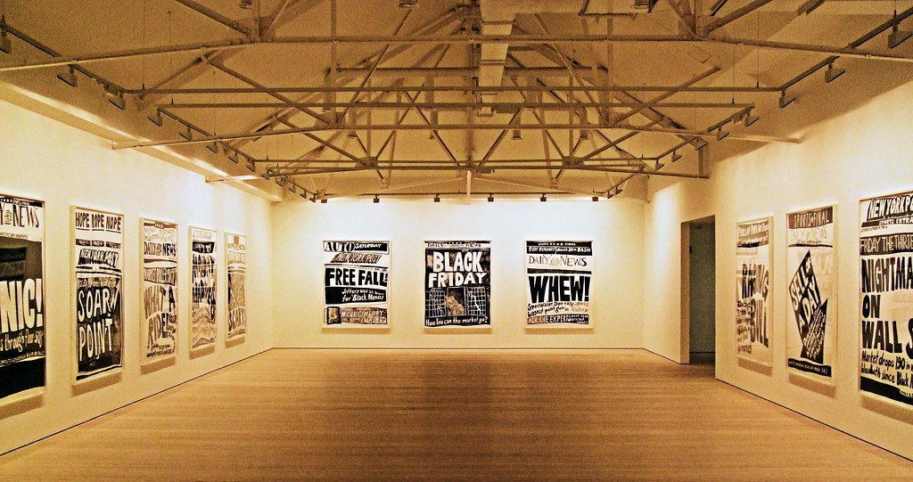
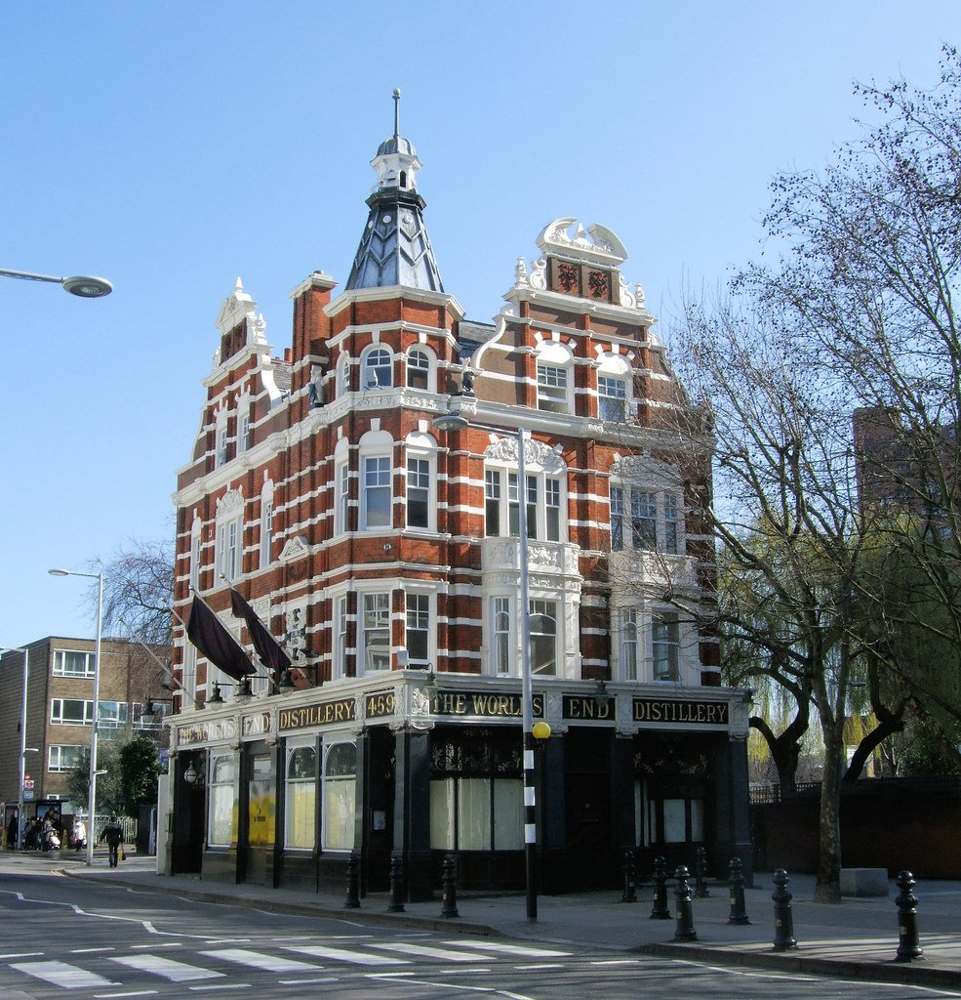
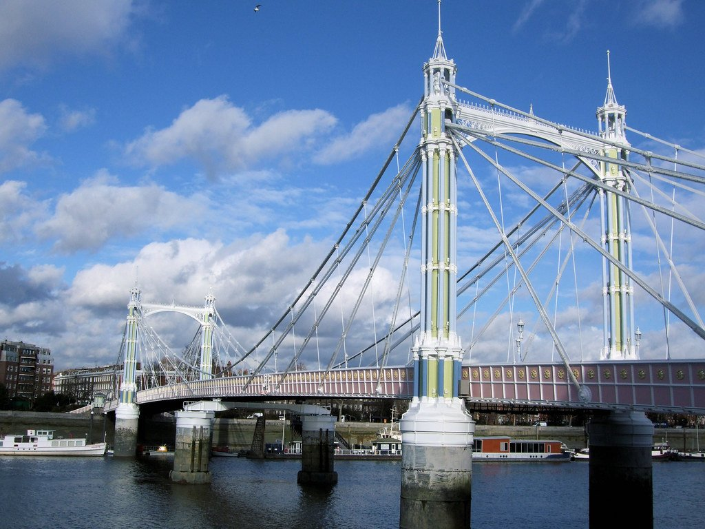

Chelsea is a low-rise, well-kept stretch between the King's Road and the Thames, and it is more interesting for walking than for shopping. The King's Road made its name in the 1960s and again with punk in the 1970s; most of that has been replaced by chains, and the reasons to come now are the side streets, the river and two very good gardens.

Chelsea has its own share of the commemorative plaques marking where notable people lived or worked - see them on our [interactive map](/plaques/?area=chelsea).

## Why visit — and who should skip it

**Come here if** you like walking through good architecture, or you want a garden, a gallery and a riverside afternoon without queuing for anything. The stretch from Sloane Square down to Cheyne Walk is one of the most pleasant hours' walking in London.

**Skip it if** you came for the King's Road you have read about. That version is gone. Also skip it if you are on a budget — this is one of the most expensive postcodes in the country and everyday things cost accordingly.

## Top sights and activities

1. **Chelsea Physic Garden** — London's oldest botanic garden, walled and founded in 1673 to grow medicinal plants. Four acres, easy to miss from the road, and the best thing in Chelsea. Check opening days.
2. **Royal Hospital Chelsea** — Wren's 1682 veterans' home, still housing around 300 Chelsea Pensioners. The grounds are open and host the Flower Show each May.
3. **Saatchi Gallery** — Free contemporary art in a former barracks at Duke of York Square. Reliably worth an hour.
4. **King's Road** — The two-mile spine. Best at the western end past World's End, where the independents survive.
5. **Cheyne Walk and the Chelsea Embankment** — Riverside Georgian houses with blue plaques on half of them: Turner, Whistler, Rossetti, Elizabeth Gaskell. The walk between Albert Bridge and Battersea Bridge is the prettiest in the area.
6. **Albert Bridge** — Cast-iron, painted pink and green, and lit by 4,000 bulbs at night. Still signed to ask troops to break step when crossing.
7. **Duke of York Square** — A pedestrian square off the King's Road with a Saturday fine food market and the Saatchi Gallery behind it.

*The Saatchi Gallery in the old Duke of York's HQ. Free to enter, and the rooms are as much of the draw as what is hung in them. Photo: [Jim Linwood](https://www.flickr.com/photos/54238124@N00/31367858771), [CC BY 2.0](https://creativecommons.org/licenses/by/2.0/).*

## Key streets and micro-districts

### Sloane Square and the eastern King's Road
The entrance to Chelsea. The Royal Court Theatre, Peter Jones, and the chain-heavy first stretch of the King's Road.

### Duke of York Square
Off the north side of the road. Food market on Saturdays, Saatchi Gallery, and the best seating in the area.

### Cheyne Walk and Chelsea Embankment
The riverfront. Georgian terraces, blue plaques, houseboats moored west of Battersea Bridge.

### World's End and the western King's Road
Past the bend. Where the independent shops still are, including the surviving Vivienne Westwood shop with the backwards clock.

### The Chelsea backstreets
Between the King's Road and the river: Bywater Street, St Leonard's Terrace, Margaretta Terrace. Painted terraces and almost no traffic.

*The World's End, at the far end of the King's Road. The stretch around it is where the punk shops were. Photo: [Jim Linwood](https://www.flickr.com/photos/54238124@N00/5506552067), [CC BY 2.0](https://creativecommons.org/licenses/by/2.0/).*

## Where to eat and drink

| Spot | Style | Price | Why go |
| --- | --- | --- | --- |
| **Duke of York Square Market** | Fine food market | ££ | Saturdays only; the best value eating in Chelsea |
| **Colbert** | French brasserie | ££ | Sloane Square corner spot built for watching the square |
| **The Cross Keys** | Historic pub | ££ | Chelsea's oldest pub, on Lawrence Street since 1708 |
| **Bluebird** | Modern British | £££ | In a 1923 art deco garage on the King's Road |
| **The Pig's Ear** | Gastropub | ££ | Backstreet pub off the river end, popular with locals |
| **Chelsea Physic Garden Cafe** | Garden cafe | ££ | Requires garden admission, but you are sitting in it |

*Albert Bridge, repainted in 1992 in the pink, green and blue it wears now. Troops crossing it are still told to break step. Photo: [Jim Linwood](https://www.flickr.com/photos/54238124@N00/6769918981), [CC BY 2.0](https://creativecommons.org/licenses/by/2.0/).*

## Getting there

**By Tube.** **Sloane Square** (District, Circle) is the eastern entrance and the only Tube station actually in Chelsea. The western end has no Tube at all — this is the catch.

**Getting to the western end.** Take the **11, 19, 22 or 49 bus** along the King's Road, or walk from Sloane Square (25 minutes end to end). **Imperial Wharf** on the Overground serves the far south-west.

**Best exit.** From Sloane Square there is one exit; turn right for the King's Road, left for Sloane Street and Knightsbridge.

**On foot.** Fifteen minutes to South Kensington, fifteen across Albert Bridge to Battersea Park.

## How long to spend, and when to go

| If you have | Do this |
| --- | --- |
| **Two hours** | Sloane Square, Duke of York Square, Saatchi Gallery |
| **Half a day** | Add the Physic Garden and the Cheyne Walk river stretch |
| **A full day** | Add Royal Hospital, the backstreets and Battersea Park over the bridge |

**Best time:** Weekday afternoons. Saturday brings the food market but also the crowds.

**Avoid:** Chelsea Flower Show week in late May unless you have tickets — the whole area is congested and Sloane Square station struggles.

## Suggested two-hour walking route

1. **Start:** Sloane Square station. Cross to the **Royal Court Theatre**.
2. **Duke of York Square:** West off the King's Road for the **Saatchi Gallery**.
3. **Royal Hospital:** South down Franklin's Row to the **Royal Hospital Chelsea** grounds.
4. **Physic Garden:** West along Royal Hospital Road — the entrance is easy to miss.
5. **Cheyne Walk:** Continue to the river and turn west past the blue plaques.
6. **Finish:** **Albert Bridge**, and either cross to Battersea Park or head back up to the King's Road.

## Common mistakes to avoid

1. **Expecting the 1960s King's Road.** It is mostly chains now. The side streets and the river are the reason to come.
2. **Walking the whole King's Road for the shops.** It is two miles. Take a bus west and walk back.
3. **Turning up at the Physic Garden unannounced.** It is closed on some days and the entrance on Royal Hospital Road is genuinely hard to spot.
4. **Assuming there is a Tube at the western end.** There is not. Sloane Square is the only one, at the far eastern edge.
5. **Eating on the King's Road itself.** You pay a premium for the address. Duke of York Square on a Saturday is far better value.
6. **Visiting during Flower Show week without a plan.** Late May is the one time to avoid.

## Where to stay

Quiet, attractive and expensive, with limited Tube access — a good base if you value calm over convenience.

- **Sloane Square** — The only part with direct Tube access. Boutique hotels and townhouses.
- **South Kensington** — Fifteen minutes north-west, better connected, and next to the museums.
- **Earl's Court and Fulham** — West and considerably cheaper, with District line access.
