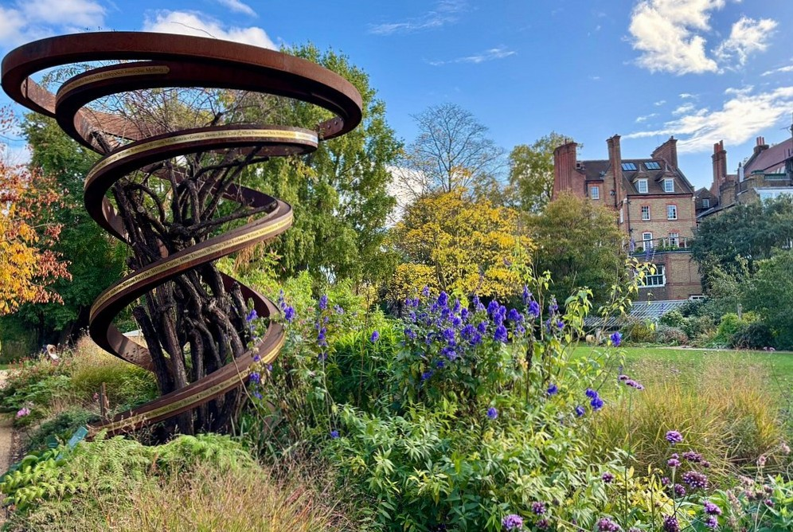

**Oscar Wilde, Mark Twain, Bram Stoker and George Eliot all lived within about ten minutes' walk of each other**, and most people walking through Chelsea have no idea. The plaques are on ordinary house walls on ordinary streets, and there is no signage telling you they are there.

This is a route through them. **Eleven numbered stops from Cheyne Walk to Belgrave Square**, about **4km and two to three hours**, and the plaques themselves are all free because they are on the outside of buildings.

There are **184 blue plaques** inside the square this walk covers, **163 of them marking where somebody lived, worked or died**. No route can take in all of them. This one takes the ones you would stop for, and adds the handful of places worth going into along the way.

For the wider areas — the shops, the pubs, where to stay — see the [Chelsea area guide](/articles/chelsea-area-guide/) and the [Belgravia area guide](/articles/belgravia-area-guide/).

> 💡 **The Short Version:** Go on a **Wednesday** — it is the only day all three ticketed stops are open. Start on **Cheyne Walk**, which has the densest plaque run in London, and finish at **Belgrave Square**. The best single street is **Tite Street**, where Oscar Wilde and Peter Warlock are thirty metres apart. Everything on the walk is free except the **Physic Garden** and **Carlyle's House**. And these are people's homes — photograph from the pavement.

## The route

  

    Map of the walk, numbered in walking order
  

  

    
Loading the map…

  

  

    <i class="route-map-marker" aria-hidden="true">1</i> On the route, in walking order
    <i class="route-map-marker route-map-marker--alt" aria-hidden="true">+</i> Optional detour
  

  <noscript>
    
The map needs JavaScript. Every stop below is numbered in walking order with its nearest station.

  </noscript>

**[Open the whole route in Google Maps →](https://www.google.com/maps/dir/?api=1&origin=51.48196,-0.17418&destination=51.498638,-0.154374&waypoints=51.48412,-0.169788%7C51.48457,-0.162262%7C51.48415,-0.16416%7C51.4858,-0.1609%7C51.4871,-0.16267%7C51.4886,-0.16118%7C51.487384,-0.157394%7C51.492226,-0.155877%7C51.4913,-0.1525&travelmode=walking)** — all eleven stops in walking order, set to walking directions, which is the version to put on your phone.

| # | Stop | Cost | Open |
| --- | --- | --- | --- |
| **1** | Cheyne Walk | Free | Always |
| **2** | Carlyle's House | £12 | **Wednesdays only, pre-booked** |
| **3** | Chelsea Physic Garden | £15 | **Closed Saturdays** |
| **4** | George Eliot, 4 Cheyne Walk | Free | Always |
| **5** | Tite Street | Free | Always |
| **6** | Mark Twain, Tedworth Square | Free | Always |
| **7** | Bram Stoker, St Leonard's Terrace | Free | Always |
| **8** | Royal Hospital Chelsea | **Free** | **Closed Mondays** |
| **9** | Sloane Square & Saatchi Gallery | **Free** | Daily |
| **10** | Ebury Street | Free | Always |
| **11** | Belgrave Square | Free | Always |
| **+** | Alexander Fleming, Danvers Street | Free | Always |

---

## 1. Cheyne Walk and Whistler

**The densest run of plaques in London**, and the place to understand why this walk exists at all.

Cheyne Walk faces the river, and for a hundred years it was where painters and writers went when they could afford to. **James Abbott McNeill Whistler** is at number 96. Along the same terrace: **J. M. W. Turner**, who died here under an assumed name; **Dante Gabriel Rossetti**, who kept a menagerie in the garden including a wombat; and, at number 4, **George Eliot** — stop four, because it is worth its own.

Look up rather than ahead. The plaques are at first-floor level and the houses are otherwise unremarkable, which is the point of the scheme.

> ⚠️ **These are private homes.** Every house on this walk except Carlyle's is lived in. Photograph from the pavement, do not stand on anyone's steps, and do not ring the bell to ask.

## 2. Carlyle's House, Cheyne Row

**The one house on this walk you can go inside**, and the reason to make this a Wednesday.

Thomas Carlyle lived at 24 Cheyne Row from 1834 until his death in 1881, and the house is kept by the National Trust more or less as he and Jane Carlyle left it — her writing table in the drawing room, the sound-proofed attic study he built to escape the neighbours' chickens.

> ⚠️ **It opens on Wednesdays only**, 11am to 4.30pm, and **all visits are pre-booked timed entry**. £12 adult, £6 child, under-5s free. Turning up on a Thursday gets you a plaque and a closed door.

## 3. Chelsea Physic Garden

*Stop three, and the only green one on the route. Closed all day Saturday, which catches people who assume a garden opens at weekends.*

Four acres of walled botanic garden, founded in 1673 by the Society of Apothecaries to grow medicinal plants — **the second-oldest botanic garden in Britain**, and completely invisible from the street.

It is the one green stop on the route and it is genuinely a garden rather than a park: glasshouses, a rock garden built partly from Icelandic lava, and beds arranged by what the plants are *for* rather than where they come from.

> ⚠️ **Open Sunday to Friday, 11am to 5pm, last entry 4pm — closed all day Saturday**, which catches people who assumed a garden opens at weekends. £15 adult, £6.50 for ages 5–25, under-5s free.

## 4. George Eliot on Cheyne Walk

Number 4, and the inscription is the interesting part: **"George Eliot 1819–1880 novelist died here."**

She moved in with her new husband in December 1880 and was dead within three weeks. Most plaques say *lived here*; the handful that say *died here* are doing something different, and this is the sharpest example on the walk.

Powered by <a target="_blank" rel="sponsored" href="https://www.getyourguide.com/london-l57/">GetYourGuide</a>

## 5. Tite Street: Oscar Wilde and Peter Warlock

**The best single street on this route.** Two plaques about thirty metres apart, and a third era of the same address.

**Oscar Wilde** lived at 34 Tite Street from 1884 until his arrest in 1895 — the house where he wrote *The Importance of Being Earnest*, and the house whose contents were auctioned on the pavement to pay his costs.

A few doors along, **Peter Warlock** — the composer born Philip Heseltine, dead at thirty-six in 1930 of coal gas in a room with the cat put out first. Tite Street was an artists' street by design: **John Singer Sargent** painted here too.

## 6. Mark Twain on Tedworth Square

**"Samuel L. Clemens, 'Mark Twain' 1835–1910 American writer lived here in 1896–7."**

A one-year plaque, and the year matters. Twain came to London after his daughter Susy died of meningitis while he was abroad, and he was bankrupt from a failed investment in a typesetting machine. He spent the year in this square writing *Following the Equator* to pay the creditors off, and did.

## 7. Bram Stoker on St Leonard's Terrace

**Dracula was written from this address.** Stoker was Henry Irving's business manager at the Lyceum, doing the novel around the day job, and the house looks exactly like every other house on the terrace.

This is the point at which the walk's argument lands: four writers whose names everyone knows, in four ordinary houses, inside a ten-minute square.

## 8. The Royal Hospital Chelsea

Wren's home for army veterans, founded by Charles II in 1682 and still doing the job — around three hundred **Chelsea Pensioners** live here, and the scarlet coats are everyday dress rather than costume.

**The exhibition in the Soane Stable Yard is free and needs no ticket**, and it is the best-value stop on the walk.

> ⚠️ **Open Tuesday to Sunday, 9am to 5pm, last admission 4pm — closed Mondays.**

## 9. Sloane Square and the Saatchi Gallery

The halfway point and the obvious place to stop. **Sloane Square** has the Royal Court Theatre on one side; **Duke of York Square** off it has the **Saatchi Gallery**, which is **free and open seven days, 10am to 6pm**.

The gallery closes for a few days at a time between exhibitions to install the next one, which is worth a check if it is the reason you came rather than a bonus on the way past.

## 10. Ebury Street and Mozart's first symphony

You are in Belgravia now, and the plaque here is the oldest story on the walk.

**Wolfgang Amadeus Mozart composed his first symphony at 180 Ebury Street in 1764, aged eight.** The family was in London on a three-year European tour, Leopold fell ill, and the children were forbidden from touching the harpsichord while he recovered — so Wolfgang wrote a symphony instead.

It is a **brown plaque rather than a blue one**, which is a good moment to notice that the scheme has never been consistent: English Heritage runs the blue ones now, but boroughs, societies and private owners have all put up their own.

**Ian Fleming is at number 22, on the same street** — about eight minutes' walk from Mozart at 180. *"Creator of James Bond lived here."* Two plaques of that size on one residential street is the most efficient stretch of the whole walk, and neither house is anything to look at.

Between the two, **Mary Shelley** is at **24 Chester Square**, a two-minute detour north. She died in that house in 1851, decades after writing *Frankenstein* at eighteen — the square garden is private and railed, so you look at the house across it.

## 11. Belgrave Square and the Belgravia plaques

**The grandest square on the route and the least residential** — most of the houses are embassies now, which is why the plaques thin out on the square itself and cluster on the streets around it.

Within a few minutes: **William Wilberforce**, who *died here* on Cadogan Place; **Alfred Lord Tennyson**, who lived on Upper Belgrave Street in 1880 and 1881; **Matthew Arnold**; and **Walter Bagehot**, the economist whose name is on the *Economist*'s main column to this day.

Belgravia's plaque density is lower than Chelsea's but the names are heavier — this was where power lived rather than where art did, and the two neighbourhoods read completely differently as a result.

---

## The detour: Alexander Fleming

**Alexander Fleming**, Danvers Street — *"discoverer of penicillin lived here"*. Two minutes west of the route between stops 1 and 2, and the only plaque on this walk marking something that changed the world rather than described it.

He is the second Fleming here. **Ian Fleming** is at 22 Ebury Street, and he is on the route rather than off it — see stop ten.

## Where to eat

This is an expensive postcode and the walk does not pass much that is cheap.

- **Duke of York Square** (££) at stop nine — the food market runs on **Saturdays**, and there are cafés around the square the rest of the week. The natural halfway stop.
- **The Cross Keys**, Lawrence Street (££) — a pub near stop 2 with its own heritage plaque listing the drinkers: **Dylan Thomas, Turner, Agatha Christie, Whistler and John Singer Sargent**. Worth it for the plaque alone.
- **The Chelsea Physic Garden café** (££) at stop three — only useful if you have paid to go in, and closed on Saturdays with the garden.

For the fuller picture, the [Chelsea](/articles/chelsea-area-guide/#where-to-eat-and-drink) and [Belgravia](/articles/belgravia-area-guide/#where-to-eat-and-drink) area guides cover it.

## The best day to go

**Wednesday**, and this route is unusually clear-cut about it, because three stops close on three different days.

| Day | What you get |
| --- | --- |
| **Wednesday** | **Everything.** The only day Carlyle's House opens at all |
| **Tue, Thu, Fri** | Physic Garden and Royal Hospital open; Carlyle's House shut |
| **Sunday** | Physic Garden and Royal Hospital open; quietest streets |
| **Saturday** | **Physic Garden shut.** Duke of York Square food market on |
| **Monday** | **Royal Hospital shut**, Physic Garden open, Carlyle's shut |

**What never closes:** every plaque on the walk. They are on the outside of buildings on public streets, so the core of this route works at any hour on any day, in any weather, for nothing. If you are here on a Monday in February, you still get Wilde, Twain, Stoker, Eliot and Whistler.

**On time of day:** the plaques are at first-floor height on north- and south-facing terraces, so late morning and mid-afternoon light them best. Cheyne Walk faces south over the river and is at its best early.

Powered by <a target="_blank" rel="sponsored" href="https://www.getyourguide.com/london-l57/">GetYourGuide</a>

## Getting there and back

**Start:** Sloane Square (District, Circle) and walk south-west down to the river, or South Kensington (District, Circle, Piccadilly) and walk south. Cheyne Walk has no station of its own, which is part of why it stays quiet.

**Finish:** Hyde Park Corner (Piccadilly) or Victoria (Victoria, District, Circle, rail), both a few minutes from Belgrave Square.

The route is **flat and step-free on pavements throughout**. Walked in reverse it works but ends at the river with a longer walk to a station.

## What to do with the rest of the day

- **[The Chelsea area guide](/articles/chelsea-area-guide/)** and **[the Belgravia area guide](/articles/belgravia-area-guide/)** — the King's Road, the pubs, the garden squares and where to stay.
- **[London's blue plaques](/articles/london-blue-plaques/)** — how the scheme works, who qualifies, and the interactive map of every plaque in the city.
- **[The plaque map](/plaques/?area=chelsea)** — all 184 in this square, filtered to the area, if you want to build your own route.
- **[Free things to do in London](/free/)** — nine of these eleven stops cost nothing.
