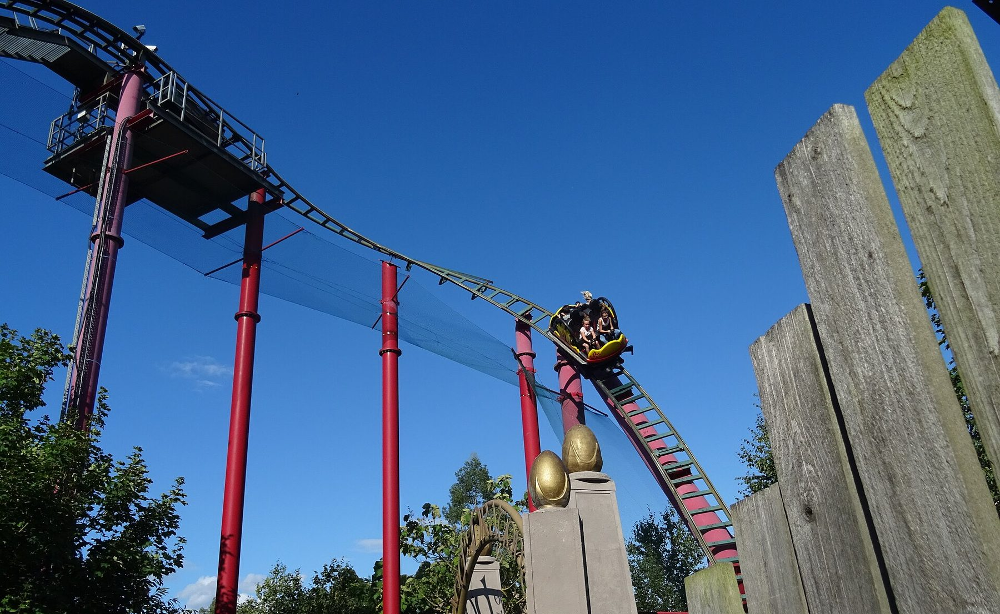
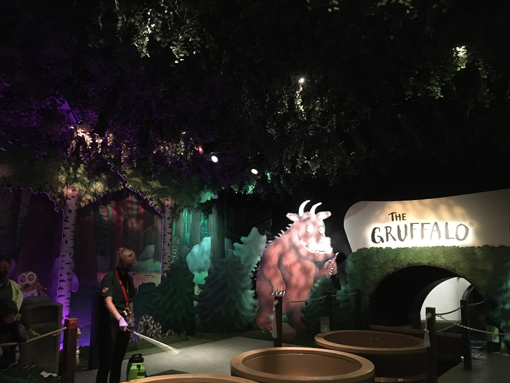
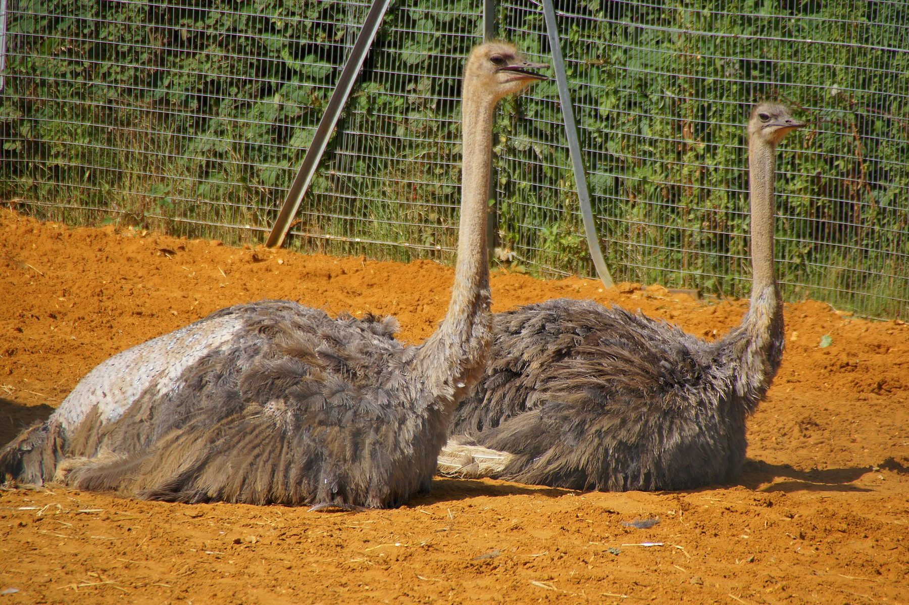

**Chessington World of Adventures costs from £32 booked online and £68 at the gate, and the ticket includes a zoo and an aquarium.** Children under 90cm go free. It is the one big theme park inside Greater London: Chessington South is in Zone 6, so you can get there on an Oyster card.

It is a park for families with children of about 3 to 12. Only one ride needs 1.4m, there are four rides from 0.9m in the World of PAW Patrol land that opened in 2026, and Chessington Zoo puts giraffes and meerkats between the rollercoasters.

> 💡 **The Short Version:** **Best for children of about 3 to 12.** **Book online**: from **£32**, against **£68** at the gate, with the **zoo and SEA LIFE included** and **under-90cm free**. **Waterloo to Chessington South, 36 minutes, every half hour, £5.20 off-peak on Oyster or contactless**, then a **10-minute walk**. Driving, park for **£13** booked ahead, and check the ULEZ. **Closed on Tuesdays and Wednesdays in early October**, and on most days from November. **Howl'o'ween** runs to 1 November 2026 and **Christmas at Chessington** from 21 November. **Or book through GetYourGuide**: the <a href="https://www.getyourguide.com/activity/-t112474?partner_id=WWP7I0R&amp;cmp=chessington-world-of-adventures-day-trip" target="_blank" rel="sponsored nofollow noopener" data-affiliate="gyg">official day ticket</a> can be **cancelled free up to 24 hours before**, which helps if you are watching the weather.

## What tickets cost

| Ticket | Online | At the gate |
| --- | --- | --- |
| **Day ticket: theme park, zoo and SEA LIFE** | **From £32** | **£68** |
| **Under 90cm** | **Free** | Free |
| Adult and Pre-Schooler, Monday to Friday in term time | £29 | — |
| Howl'o'ween day ticket, October 2026 | From £34 | £66 |
| Christmas Village and park entry, 21 November to 24 December 2026 | From £32 | — |
| Chessington Annual Pass | From £64 a year | — |

**The price depends on the date**: the cheapest days are weekdays in term time, and booking ahead saves up to £33 a head. **There is no family ticket.** Everyone 90cm and over needs a ticket, booked online to guarantee entry, and that includes passholders and carers; carers go free with accepted documentation. **Under-12s must be with someone aged 18 or over.**

**The Adult and Pre-Schooler ticket** covers one adult and one child aged 4 or under, Monday to Friday in term time, for £29. For a parent with a toddler on a weekday it is the cheapest way in.

### The cheapest way in

- **Book online, for a weekday in term time.**
- **Travelling by train as a group?** The [Days Out Guide](https://www.daysoutguide.co.uk/chessington-world-of-adventures-resort) takes **a third off the online advance price for up to six people** with one National Rail ticket, from £23 a head. Oyster and contactless do not count, so this only pays if you buy a rail ticket. It is valid in the main season only, and the terms exclude the Zoo Days and the winter event. Rules in our [National Rail 2FOR1](/articles/national-rail-2for1-london-attractions/) guide.
- **Already have a London Pass?** Chessington is one of the out-of-town attractions on it, and it has to be reserved in advance; our [London Pass guide](/articles/london-pass-guide/) says whether the pass pays for itself.
- **Going twice, or to Thorpe Park as well?** The Chessington Annual Pass is from £64. The **Merlin Essential Pass, £139**, covers both parks, [LEGOLAND Windsor](/articles/legoland-windsor-day-trip/) and the London Eye, but is barred on 25 busy days, including 17, 24, 25 and 31 October 2026; the £239 Gold Pass adds free parking.

## Booking through GetYourGuide

GetYourGuide sells Chessington's own <a href="https://www.getyourguide.com/activity/-t112474?partner_id=WWP7I0R&amp;cmp=chessington-world-of-adventures-day-trip" target="_blank" rel="sponsored nofollow noopener" data-affiliate="gyg">day ticket</a>, issued by the resort, with **free cancellation up to 24 hours before**. For a family that wants to wait for a dry forecast before committing, that is the case for booking there. Under-90cm children are still free and collect their ticket at the gate.

GetYourGuide sells no coach or transfer package from London, and with a train from Waterloo every half hour there is little need for one.

Powered by <a target="_blank" rel="sponsored" href="https://www.getyourguide.com/london-l57/">GetYourGuide</a>

## Getting there

| | Train | Driving |
| --- | --- | --- |
| **From** | London Waterloo, also Clapham Junction and Wimbledon | Central London on the A3 |
| **Journey** | **36 min** to Chessington South, every 30 min, then a 10-min walk | Two miles off the M25 and the A3 |
| **Cost** | **£5.20 off-peak**, £8.50 peak, each way | Parking **£13** in advance, £15 on the day |
| Pay with | **Oyster or contactless**: Zone 6 | ULEZ charge if your car does not meet the standard |

### Train

**South Western Railway runs two trains an hour from Waterloo to Chessington South**, taking 36 minutes, by way of Clapham Junction and Wimbledon. The station is the end of the line and **is in Zone 6, so Oyster and contactless both work**: £5.20 off-peak and £8.50 at peak times (Monday to Friday, 06:30–09:30 and 16:00–19:00). If you are already on a Zone 1–6 Travelcard or have hit your daily cap, the journey costs nothing extra.

**The park is about a 10-minute walk from the station.** Buses also run to the resort: the 71 from Kingston and the 467 from Epsom.

### Driving

The postcode is **KT9 2NE**, on the A243 Leatherhead Road, two miles from the M25 and the A3. From London, take the A3 to Hook and follow the signs; on the M25, it is junction 9 from the south and junction 10 from the north.

**Standard parking is £13 booked ahead and £15 on the day**, a 5 to 10-minute walk from the Explorer Gate. **Express Parking, £25**, is next to the Lodge Gate entrance. Hotel guests park free.

> ⚠️ **The resort is inside the ULEZ.** Every entrance is within London's Ultra Low Emission Zone, so a car that does not meet the standard pays the daily charge on top of parking. Check your vehicle on [TfL's checker](https://tfl.gov.uk/modes/driving/check-your-vehicle/) before you go.

## When it is open

*Dragon's Fury. Photo: [BenBowser](https://commons.wikimedia.org/wiki/File:Dragon%27s_Fury_CWOA.JPG), [CC BY-SA 4.0](https://creativecommons.org/licenses/by-sa/4.0/).*

**The park opens at 10:00** and closes between 16:00 and 19:00 depending on the date: 17:00 at weekends in October 2026, 16:00 on term-time weekdays, and 19:00 from 23 October to 1 November.

> ⚠️ **Chessington is shut on some weekdays in October, and on most days in November.** In 2026 it is closed on Tuesday 6, Wednesday 7, Tuesday 13 and Wednesday 14 October. After 1 November it opens only on 7 and 8 November until Christmas at Chessington begins on 21 November. Check the [opening calendar](https://www.chessington.com/plan-your-visit/before-you-visit/opening-hours/) before you book.

### Howl'o'ween 2026

**3–4 and 10–11 October, then every day from 17 October to 1 November 2026.** Day tickets are from £34 online (£66 at the gate). It is the family version of Halloween: shows, a Vampire's Lair scare zone with living statues, rides running at dusk and PAW Patrol pups in costume, but no scare mazes. **Enchanted Hollow: Trick or Treat** is an extra, from £9 a head. Our [Halloween in London](/articles/halloween-london/) guide sets it against Thorpe Park's Fright Nights, which is for teenagers and adults.

### Christmas at Chessington 2026

**Selected days from 21 November to 24 December 2026.** The Christmas Village, with a visit to Father Christmas's grotto, a toy workshop and a panto, comes with park entry from £32; entry on its own is from £24. **Only selected rides open.** The gates open at 09:00 on Christmas dates and rides from 10:00. The open days are weekends from 21 November, Friday 11 to Monday 14 December, and every day from 17 to 24 December. The park then opens with selected rides from 27 December 2026 to 3 January 2027; it is closed on 25 and 26 December.

### Coming in 2027: Minecraft World

**Minecraft World**, a land based on the video game, opens at Chessington in 2027, with **Escape the Nether**, which the resort calls the world's first Minecraft rollercoaster, and a Minecraft World Hotel. Chessington has not announced the opening date or the coaster's height limit.

## The rides, and the height you need

Most of Chessington's rides take children from 0.9m or 1.1m, and several have no minimum at all if a small child rides with someone aged 16 or over. **Rattlesnake is the only ride that needs 1.4m.**

| Ride | Minimum height | What it is |
| --- | --- | --- |
| **Rattlesnake** | **1.4m** | Rollercoaster in the Forbidden Kingdom |
| **Mandrill Mayhem** | **1.2m** | Jumanji-themed coaster with the park's first inversion |
| **Dragon's Fury** | **1.2m** | Spinning coaster, so no two rides are the same |
| Croc Drop | 1.2m; under 1.3m with someone 16+ | 25m drop tower |
| Ostrich Stampede | 1.2m; under 1.3m with someone 16+ | Whirling ride in World of Jumanji |
| Mamba Strike | 1.2m; under 1.3m with someone 16+ | Thrill ride in World of Jumanji |
| Vampire | 1.1m; under 1.3m with someone 16+ | Rollercoaster in the Wild Woods |
| Blue Barnacle | 1.1m; under 1.3m with someone 16+ | Ride on Shipwreck Coast |
| Tiger Rock | 1.2m to 1.3m with someone 16+ | Log flume |
| ZUFARI | 1.0m to 1.3m with someone 16+ | Off-road truck ride |
| **World of PAW Patrol: Chase's Mountain Mission** | **0.9m**; under 1.1m with someone 16+ | Junior coaster |
| Skye's Helicopter Heroes, Marshall's Firetruck Rescue | 0.9m; under 1.1m with someone 16+ | PAW Patrol family rides |
| Zuma's Hovercraft Adventure | 0.9m; under 1.2m with someone 16+ | Spinning hovercraft ride on water |
| Griffin's Galleon | 0.9m; under 1.2m with someone 16+ | Galleon ride in the Land of the Dragons |
| Seastorm, Trawler Trouble | 0.9m to 1.1m with someone 16+ | Family rides on Shipwreck Coast |
| The Gruffalo River Ride Adventure | Under 1.1m with someone 16+ | Boat ride through the story |
| Room on the Broom – A Magical Journey | Under 1.1m with someone 16+ | Attraction based on the book |
| Tomb Blaster | Under 1.1m with someone 16+ | Mummy-themed ride in the Forbidden Kingdom |

**For the smallest children** there are Sea Dragons, Elmer's Flying Jumbos, Tiny Truckers, Treetop Hoppers, Jungle Rangers, the River Rafts mini log flume, the Adventure Tree Carousel and Dragon's Playhouse soft play, as well as Rubble and Rocky's Playzone in World of PAW Patrol. The full list, with the land each ride is in, is on the [rides page](https://www.chessington.com/explore/theme-park-zoo/rides-attractions/).

*The Gruffalo River Ride Adventure. Photo: [Jcrazyhead37](https://commons.wikimedia.org/wiki/File:Gruffalo_River_Ride_Adventure.jpg), [CC BY-SA 4.0](https://creativecommons.org/licenses/by-sa/4.0/).*

### What suits which age

- **Under 90cm (free):** the carousel, the Gruffalo and Room on the Broom attractions with an adult, soft play, and the zoo and aquarium.
- **0.9m to 1.1m:** add the four PAW Patrol rides, Griffin's Galleon and Seastorm.
- **1.1m:** Vampire and Blue Barnacle.
- **1.2m:** Mandrill Mayhem, Dragon's Fury, Croc Drop and the Jumanji rides; nearly everything.
- **1.4m:** Rattlesnake. Teenagers who want big coasters should go to [Thorpe Park](/articles/thorpe-park-day-trip/) instead.

### The zoo and SEA LIFE

*Ostriches at Chessington Zoo. Photo: [Chris Sampson](https://commons.wikimedia.org/wiki/File:Two_ostriches,_Chessington_World_of_Adventure_and_Zoo.jpg), [CC BY 2.0](https://creativecommons.org/licenses/by/2.0/).*

**Chessington Zoo and the SEA LIFE aquarium are in every day ticket**: over 1,000 animals, including Rothschild's giraffes on the Wanyama Reserve, meerkats, lions and California horn sharks. Allow an hour or two for them; the aquarium is indoors if it rains.

## Queues and Fastrack

**Weekdays in term time are the quietest days**; school holidays and event days are the busiest. Chessington's own advice is to **arrive early and leave the most popular rides until last**, going against the flow of the crowd. Use the Chessington app for live queue times.

| Fastrack, October 2026 prices | From | What it covers |
| --- | --- | --- |
| Bronze | £15 | Three skips, on your choice of rides |
| **Silver** | **£29** | **Six skips** |
| Gold | £75 | All day on the Fastrack rides |
| World of PAW Patrol | £20 | One ride on each of the four PAW Patrol rides, in a two-hour slot |

**PAW Patrol is not covered by Bronze, Silver or Gold**; it has its own Fastrack. Every Fastrack is for one person, scans once every three minutes and does not include park entry. Numbers are limited, so book it ahead.

**Early Ride Time** tickets, sold on top of a day ticket, open selected rides before the rest of the park; hotel guests get it free. **Parent Swap**, collected from Guest Help and Information, lets one adult queue while the other waits with a child too small to ride, then sends the second adult through the Fastrack queue.

## Food, lockers and bags

**You can bring a picnic.** There are picnic areas and seating across the resort, and you can go back to the car for lunch: get a hand stamp on the way out.

**Lockers are £1 an hour or £5 for the day for a small one, £2 an hour or £10 for the day for a large one**, card only, in Adventure Point behind the gift shop, by the Vampire entrance in the Wild Woods and by the Dragon's Fury exit. Coin-operated lockers are by Tiger Rock. You can open yours as often as you like within the hire period.

## Staying over

The resort has two hotels next to the park, the **[Safari Resort Hotel and the Azteca Resort Hotel](https://www.chessington.com/short-breaks/accommodation/azteca-safari-resort-hotels/)**, with themed rooms (Gruffalo, Room on the Broom, PAW Patrol and others); some rooms look out over the giraffes on the Wanyama Reserve. They are sold as short breaks **from £73 a person**, for two adults and two children sharing a standard room on selected dates, including **a day's entry, breakfast, Early Ride Time, the Savannah Splash Pool and free parking**. Christmas breaks start at £62 a person.

## What people get wrong

- **Going on a Tuesday or Wednesday in October**, or a weekday in November, when the park is shut.
- **Driving in an older car** without checking the ULEZ.
- **Expecting the PAW Patrol rides on a Gold Fastrack.** They need their own.
- **Taking teenagers.** One ride needs 1.4m; Thorpe Park is the thrill park.
- **Skipping the zoo and the aquarium.** Both are in the ticket.

## Continue planning your London trip

- 🎢 **[Theme parks near London](/articles/theme-parks-near-london/)** — every park within a day trip, compared on price, journey and season.
- 🌀 **[Thorpe Park](/articles/thorpe-park-day-trip/)** — the thrill park, for teenagers and adults.
- 🧱 **[LEGOLAND Windsor](/articles/legoland-windsor-day-trip/)** — the other big park for under-12s.
- 🐷 **[Paultons Park](/articles/paultons-park-day-trip/)** — Peppa Pig World, on the edge of the New Forest.
- 👨‍👩‍👧 **[London with kids](/articles/london-with-children/)** — free farms, zoos and family days out in the city.
- 🍝 **[Kids eat free in London](/articles/kids-eat-free-london/)** — the deals that cut the cost of the rest of the trip.
- 🎃 **[Halloween in London](/articles/halloween-london/)** — Howl'o'ween against the city's other Halloween events.
- 🗺️ **[Day trips from London](/articles/day-trips-from-london/)** — what the others cost, how long they take, and which days they are shut.
