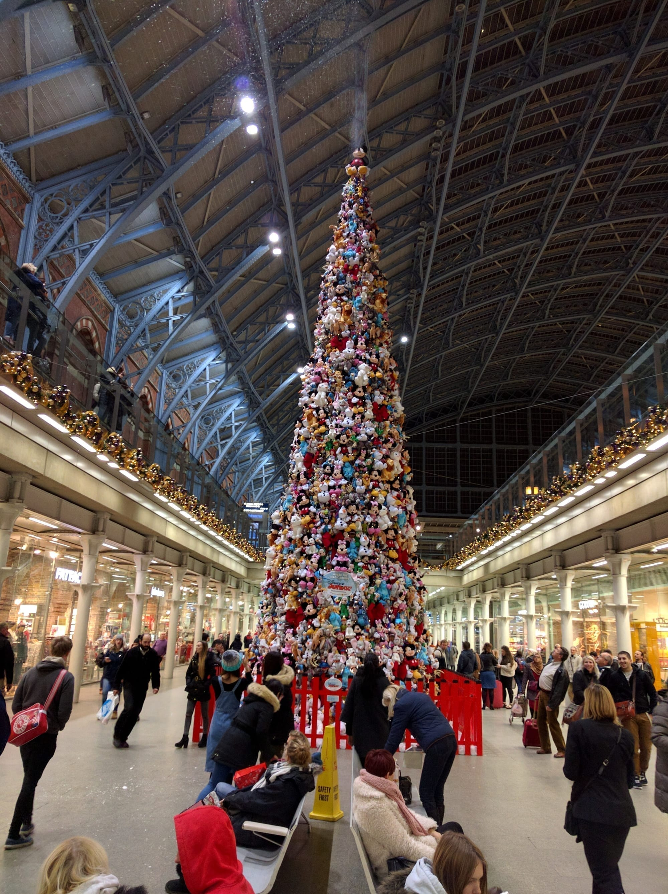
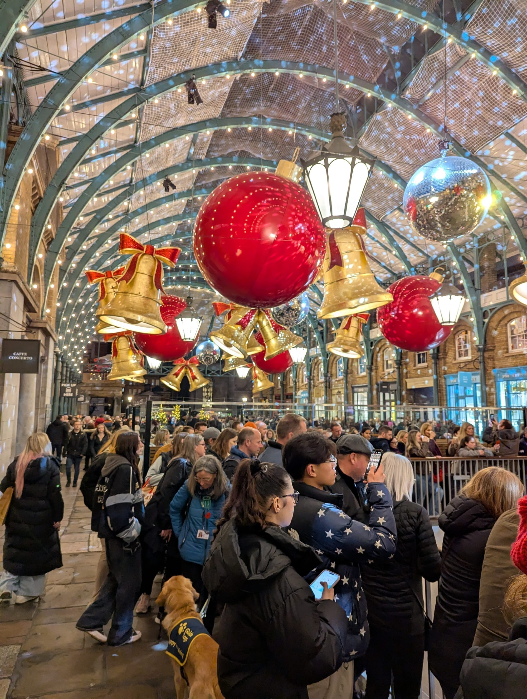
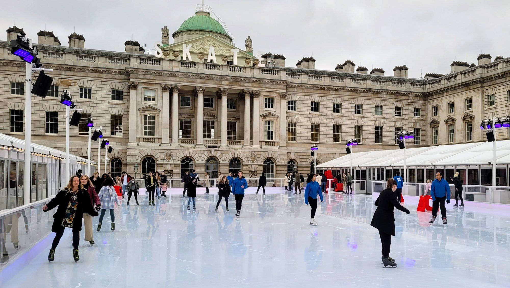

**Christmas in London runs from mid-November to the first week of January**, and most of it — the markets, the lights, the outdoor rinks — is free to look at even if the rides and skating aren't. The one thing to know before anything else: Hyde Park Winter Wonderland is not a free-to-wander street market, whatever the name suggests. Here's what's actually on, what it costs, and what's quietly stopped running.

---

## Hyde Park Winter Wonderland

**19 November 2026 – 3 January 2027**, open every day except Christmas Day, closing at 10pm with last entry at 9.30pm.

**Entry is not free**, whatever the name suggests, and everybody in your group needs a timed ticket even if you only want to look at the market. In advance that is **£1 off-peak** (Monday to Thursday through November), **£5.50 standard** or **£8.25 peak**, and more on the door. Spend £25 online in one transaction on rides or attractions and entry becomes free.

Inside, **Santa's Grotto, the Christmas Market, the light arches and every band and DJ are free**. Everything else is not: the ice rink is £12.65–£19.25, the Giant Wheel £8.80–£12.10, the new Gandeys K-Pop Dragon Circus £13.75–£19.80 — and it is Gandeys this year, not Zippos, which had been the resident circus since 2009. Every fairground ride is charged separately on top.

The quietest and cheapest visit is the same visit: a Monday to Wednesday daytime in late November, when entry is £1 and the attraction prices drop with it.

> 🎡 **[The full Winter Wonderland guide](/articles/hyde-park-winter-wonderland/)** — every published price, all four gates, the free live music, the Bavarian Hall's 18+ evening rule, and what is new for 2026.

---

## Christmas markets

### Central London

| Market | 2026 dates | Distinctive for |
| --- | --- | --- |
| **Trafalgar Square** | 6 Nov 2026 – 3 Jan 2027 | The Norway spruce, Oslo's annual gift to London since 1947; tree switch-on **3 December** |
| **Covent Garden** | From November 2026 (exact date TBC) | The Piazza's 55ft tree, giant bells and baubles inside the Market Building |
| **Southbank Winter Market** | Not yet published (2025 ran 3 Nov–4 Jan) | Riverside chalets by the London Eye, food-led rather than gift-led |
| **Leicester Square** | Not yet published (2025 ran 1 Nov–4 Jan) | An ice rink around the Shakespeare statue |
| **Old Spitalfields Market** | Not yet published | Neon-lit wreaths, Santa Saturdays, a photo-op phone box |
| **Camden Market** | Not yet published | An Ice Palace Grotto and a free carol singalong to open the season |
| **King's Cross / Coal Drops Yard** | Not yet published | Canopy Market's 50+ stalls, plus rotating themed pop-ups (past years: a Mexican Christmas market, a Japanese homeware market) |
| **Winter by the River**, London Bridge City | Not yet published (2025 ran 13 Nov–4 Jan) | Thames-side stalls with Tower Bridge views, a heated two-storey "Glasshouse" |

Only Trafalgar Square has confirmed 2026 dates this early — the rest are still running last year's information as of publication. All are free to browse; ice rinks, grottos and the Glasshouse are separate paid extras.

Worth a detour even though it isn't a market: **St Pancras International's** concourse hosts an oversized Christmas tree every year, built from a different donated material each season for charity — past years have used everything from champagne bottles to, as pictured, thousands of soft toys. It's free to see and right by the Coal Drops Yard/King's Cross lights above, so easy to fold into the same visit.

*The Apple Market's arcade, dressed for the season — one of the more elaborate covered displays in central London.*

### Beyond the centre

Four have solid, confirmed 2026 dates:

- **Greenwich** — Lantern Parade and Christmas lights switch-on, **Wednesday 18 November 2026**, 4–6pm, starting at the Old Royal Naval College and ending at Greenwich Market. Free. The market itself trades as usual through December.
- **Kingston** — **12 November 2026 – 3 January 2027**, 40-plus wooden cabins plus a small Alpine Village corner with a carousel. Free entry.
- **Crystal Palace** — the Handmade Palace Art & Craft Market, **21–22 November 2026**, in the Victorian Crystal Palace Subway. £2.50 entry, no step-free access.
- **Blackheath** — the Blackheath Christmas Fair, a charity craft fair rather than a market village, **15 November 2026** at Blackheath Halls.

A few more are likely to return but hadn't confirmed 2026 dates at the time of writing: **Wimbledon** (both the Piazza market and the separate Christmas in the Village event), **Wembley Park Festive Market**, **Ealing Broadway**, and **Columbia Road's** Christmas Wednesdays, where the flower-market street's shops stay open late through December.

**Worth knowing what's gone:** Clapham Common's Winterville hasn't run since 2018. Alexandra Palace's Christmas offering is an ice rink and panto rather than a market. Neither is worth planning a trip around.

---

Powered by <a target="_blank" rel="sponsored" href="https://www.getyourguide.com/london-l57/">GetYourGuide</a>

## Christmas lights: where to see them

None of the big shopping streets had announced 2026 switch-on dates at the time of writing — they're typically confirmed from late September — but the pattern repeats every year: the best-known streets switch on first, in the opening two weeks of November, and the lights stay up until around Twelfth Night in early January.

| Street | Known for |
| --- | --- |
| **Oxford Street** | "Sky Full of Stars" — over 5,000 illuminated stars the length of the street |
| **Regent Street** | The "Spirit(s) of Christmas" — illuminated angel figures, a Regent Street signature for decades |
| **Carnaby Street** | A completely different sculptural light installation each year |
| **Bond Street & South Molton Street** | Tens of thousands of LEDs on a different theme annually; South Molton Street's own blue-lit arches |
| **Covent Garden & Seven Dials** | The Piazza tree plus Seven Dials' light "canopies" radiating from the sundial monument |
| **Marylebone High Street** | "Merry Marylebone" — a full afternoon street festival with a ferris wheel and live music, not just lights |
| **Chelsea** | King's Road part-pedestrianised for a festival day; Sloane Street's lights run the length of the boulevard |
| **Canary Wharf** | No switch-on ceremony — the whole estate becomes a themed winter village from October, with its own ice rink |

**Trafalgar Square's tree is the one fixed date**: the lighting ceremony is **Thursday 3 December 2026**. It's a Norway spruce, a gift from the City of Oslo to London every year since 1947 in gratitude for Britain's support during the Second World War — felled at a formal ceremony in Norway, shipped over, and dressed only in traditional vertical strings of white lights rather than baubles.

One practical note: TfL periodically closes Oxford Circus station's entrances for short periods when crowds build on Saturday evenings in December. Bond Street or Tottenham Court Road are the backup stations if that happens to you.

---

## Ticketed light trails

Different from the free street displays above — these are paid, walk-through experiences.

**Christmas at Kew** is the benchmark. **13 November 2026 – 3 January 2027**, a 3km illuminated trail through Kew Gardens taking upwards of two hours. Adult tickets from **£29.50 off-peak, £37 peak**; a Kew Gardens day visit is a separate ticket bolted on for an extra £12. Book through [kew.org](https://www.kew.org/kew-gardens/whats-on/christmas).

**Hampton Court Palace** runs two separate things this year: **The Winter Palace**, a new indoor immersive walkthrough included in standard palace admission (£32–£35 adult), running **28 November 2026 – 3 January 2027**; and a **separate ice rink**, **20 November 2026 – 3 January 2027**, priced separately and not yet published.

**Chelsea Winter Village & Illuminations**, at the Royal Hospital Chelsea, is a genuine outdoor light trail — 1.5km, 45–75 minutes — running **25 November – 28 December 2026**. Adult tickets from £19 off-peak, rising to £30.95 at peak times.

**Worth knowing what's gone or uncertain:** Kenwood House's well-loved Neverland trail on Hampstead Heath has been **cancelled for 2026** after weak ticket sales. Lightopia's Crystal Palace edition appears to have quietly stopped — its booking site no longer resolves. Chiswick House's event (now an indoor theatrical trail rather than the outdoor "Lightopia" walk it used to be) hadn't confirmed 2026 dates at the time of writing.

---

## Ice rinks and Santa's grottos

**Still running:** **Somerset House** (11 November 2026 – 10 January 2027, tickets £11–£28.50, on sale from September 2026), **Hampton Court Palace** (20 November 2026 – 3 January 2027, price not yet published), and **Alexandra Palace** — a permanent, year-round indoor rink rather than a seasonal one, dressed for Christmas with a panto-on-ice show, currently £11.75–£12.75.

*Somerset House is the one worth booking rather than the one you walk past. The courtyard is enclosed on all four sides, so the rink sits inside an eighteenth-century quadrangle rather than in a car park.*

**Book Somerset House early.** It is the most popular outdoor rink in London and the good evening slots go within days of release — daytime sessions midweek are far easier and, in a courtyard this size, no less impressive.

**No longer running, so don't plan around them:** the **Natural History Museum's** rink closed permanently after the 2024 season and its old site is now a wildlife garden. **Tower of London's** rink has been discontinued for several years. **Canary Wharf's** rink is paused for the 2026 season specifically, described as a break rather than a closure.

For grottos, **Fortnum & Mason's** "Storytelling with Father Christmas" and **Hamleys'** Regent Street grotto are both expected back but hadn't gone on sale at the time of writing — 2025 prices were roughly £36–£45 and from £65 for a group of three, respectively. **Harrods'** famous grotto has been discontinued with no plans to reopen. **Selfridges** doesn't run a formal grotto — Santa and his elves roam the shop floor for free instead.

---

## Seeing the lights from a bus

The lights are free to walk past, but the streets that carry the best of them — Oxford Street, Regent Street, Knightsbridge — are also the ones with the worst December pavements. A bus solves that, and there are two quite different ways to do it.

### The cheap way: a normal red bus

**Route 390** runs Oxford Street end to end and costs **£1.75**. **Route 139** does Oxford Circus to Trafalgar Square. Sit at the front of the top deck after dark and you have most of the same view for the price of a bus fare, with a Hopper transfer inside the hour if you want to chain two routes together. This is the answer for most people, and nobody sells it because nobody makes anything from it.

### The tour: a decorated vintage Routemaster

**Christmas Bus Tour** runs an open-top 1960s Routemaster, decked out, with live commentary — **75 minutes**, departing from **8 Northumberland Avenue, WC2N 5BY**, beside Trafalgar Square. Typical departures are **4.10pm, 6.15pm and 7.45pm**, with more on busier dates. The route takes in Oxford Street, Regent Street, Knightsbridge and a pass by Winter Wonderland. **A top open-deck seat is guaranteed on every booking**, which is the thing you are paying for — the view is the product, and a lower-deck seat would defeat it.

**All ages, and under-5s go free** on an adult's lap with no ticket needed.

> ⚠️ **Two things to check before you book.** The bus is a genuine 1960s Routemaster, which means **there is no space to store a wheelchair or a pushchair** — the operator says so plainly and asks you to phone before booking rather than turning up. And it is **open-top in December**: dress for standing on a cold street for 75 minutes, because that is effectively what it is.
>
> Note also that the operator's own London page still carries **"Operating November and December 2025"** in its body text while the header advertises 2026 booking. Take the dates from the booking form, not the page.

**B Bakery's afternoon tea bus** also runs seasonal versions from Victoria — that one feeds you, takes 90 minutes and costs rather more. It is covered in full in our [afternoon tea guide](/articles/best-afternoon-tea-london/).

---

## Christmas theatre

Panto is not the only thing on, and two of the best tickets in London at Christmas are not pantomimes at all.

### A Christmas Carol, The Old Vic

**12 November 2026 – 9 January 2027.** Jack Thorne's adaptation, directed by Matthew Warchus, now in its tenth season and **London's longest-running version of the story**. The auditorium is reconfigured in the round and the show comes out into it — mince pies included, genuinely.

It is warmer and less reverent than the book suggests — handbells, carols sung by the cast, and a Scrooge redeemed by the room rather than in spite of it. **Two hours with an interval, and the recommended age is eight and over**, which makes it the rare Christmas show that suits a mixed-age group without anyone being talked down to.

### Christmas Carol Goes Wrong, Wyndham's Theatre

**18 December 2026 – 23 January 2027, from £15.** Mischief — the company behind *The Play That Goes Wrong* — doing the same story as a disaster: the Cornley crew feuding over who plays Scrooge while the set comes apart around them.

**It is the answer to "we want something Christmassy but not a panto and not earnest."** It also runs well past Christmas, into late January, which makes it the easiest festive ticket to get if you leave it late.

### Into the Woods, Noël Coward Theatre

**22 September 2026 – 9 January 2027.** Sondheim and Lapine's fairy-tale collision — Cinderella, Rapunzel, Jack and a baker's wife all wanting something — transferred to the West End after a sell-out run at the Bridge and won the Olivier for Best Musical Revival on the way.

**It is the least Christmassy thing here and the best argument for booking it.** The second act takes the happy endings apart, so it suits adults and older children rather than a family with small ones, and it runs through to 9 January if December is already spoken for.

### The Great Christmas Feast, The Lost Estate

**The third way to do *A Christmas Carol*, and the only one you eat your way through.** The Lost Estate in West Kensington stages it as an immersive Victorian evening built around the moment Dickens first read the story aloud — live music, theatre performed around the tables, and a full feast rather than a pre-theatre bite.

It is the same story as the Old Vic's and Mischief's, and a completely different night: you are seated at a table inside it rather than watching from a seat. The Lost Estate has been doing this since 2017, and its current shows run £74.85 to £119.85, so budget accordingly.

> ⚠️ **Confirmed for 2026, but nothing else is.** The company says the Feast returns and is running a **presale signup**, but **no dates and no prices have been published** — its own show page is still an empty 2022 stub. Join the presale list rather than waiting for a listing to appear, because these sell through the list first.

**[More immersive nights out →](/articles/immersive-experiences-london/)** · **[The cabaret guide →](/articles/best-cabaret-london/)**

---

Powered by <a target="_blank" rel="sponsored" href="https://www.getyourguide.com/london-l57/">GetYourGuide</a>

## Christmas for children

The shows below are the ones built for children rather than tolerated by them, and they book earlier than anything else in this guide. Grottos and ice rinks are further up the page.

### The Snowman, Peacock Theatre

**21 November 2026 – 3 January 2027, from £18** plus a £4 transaction fee. **1 hour 30 including a 20-minute interval.**

It has run for 32 years and **this year it is a new production** — a world premiere staged by Sadler's Wells with Birmingham Rep, with new puppets and Howard Blake's score still intact, 'Walking in the Air' included. If you saw the old one, this is not that. The safest first theatre trip in London at Christmas, and the shortest.

### Nutcracker, English National Ballet, London Coliseum

**17 December 2026 – 10 January 2027.** Over a hundred dancers and musicians, with the ENB Philharmonic playing Tchaikovsky live — which is the argument for this one over a recording in a smaller room.

**The Royal Ballet's Nutcracker at Covent Garden** runs every Christmas as well, and is the grander and more expensive of the two. Either works from about five upwards; both sell out early, so book the moment the dates open rather than in November.

### Pantomime

**Two worth booking properly**, rather than picking whatever is nearest: **Hackney Empire's** *Jack and the Beanstalk* (21 November – 31 December 2026), directed by and starring Olivier winner Clive Rowe, **£10–£48**; and the **London Palladium's** *Cinderella* (5 December 2026 – 10 January 2027), with Dawn French and Jennifer Saunders reuniting as the Ugly Sisters for the first time in 17 years.

### For the under-fives

**The Gruffalo** and its stablemates — *The Gruffalo's Child*, *Room on the Broom*, *The Smeds and The Smoos* — are made by Tall Stories, a London company, and at least one of them is usually playing somewhere in the city over Christmas. **The Gruffalo runs 55 minutes with no interval and is aimed at three and over**, which is the right shape for an age group that will not sit through a ballet. Venues and dates change every year, so check the company's own listings rather than booking on the strength of the name.

> ⚠️ **Children's shows sell out first.** The Snowman, both Nutcrackers and the Palladium panto are usually gone for the good December dates by early autumn. If you are reading this in November, look at early January — the runs continue past Christmas and the seats are easier and cheaper.

---

## Afternoon tea at Christmas

Every grand hotel reprints its tea menu for Christmas, usually from early November to the first week of January, and the food changes more than the room does — chestnut, clementine, spiced pear, a mince pie in place of a scone. **The prices go up with it**, so a festive sitting costs more than the same tea in February.

**Claridge's** is the one to book if you want the occasion rather than the novelty. Its festive menu runs from early November to 3 January at **£120 on weekdays and £130 at weekends**, in the Art Deco Foyer under the jade-and-white china, and it is the room where people dress up without being told to.

**The Winter Garden at The Landmark** is the one to book if you are bringing someone who wants to photograph it. Eight storeys of glass atrium and full-grown palms, decorated for the season, with a pianist and a harpist — the most theatrical tea room in London that is not a palace.

**Fortnum & Mason** is the sensible choice on a shopping day. The Diamond Jubilee Salon is four floors above the food hall, so the tea and the Christmas shopping are the same trip, and it is the one place where the leaf matters more than the pastry.

**The Ritz** is the most formal and the hardest to get. Five sittings a day, a dress code that is actually enforced, and a Palm Court that needs no seasonal help. Book months out for December.

> ⚠️ **Festive menus are priced and dated separately from the standard tea**, and the good rooms sell December out by early autumn. Check the hotel's own site rather than a listings page, and confirm which menu your booking is for.

**[The full afternoon tea guide, with every price →](/articles/best-afternoon-tea-london/)**

---

## Good to know

**TfL runs no services at all on Christmas Day** — no Tube, buses, Overground, DLR, Elizabeth line, trams or river boats. It's the same every year. Black cabs, private hire, Santander Cycles and rental e-scooters are the only options moving. **Boxing Day is reduced rather than closed** — Tube and buses typically run to a Sunday timetable from around 7am, with the Elizabeth line historically closed altogether. Check [tfl.gov.uk/christmas-travel](https://tfl.gov.uk/christmas-travel) nearer the date for the exact 2026 detail.

---

*Christmas Day and switch-on dates for 2026 are still being confirmed by several venues as this guide was written — where a date says "not yet published," check the venue's own site closer to November.*
