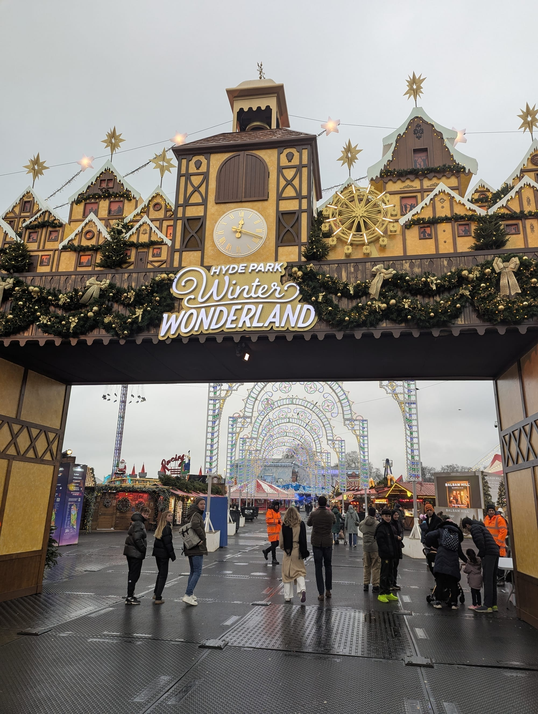
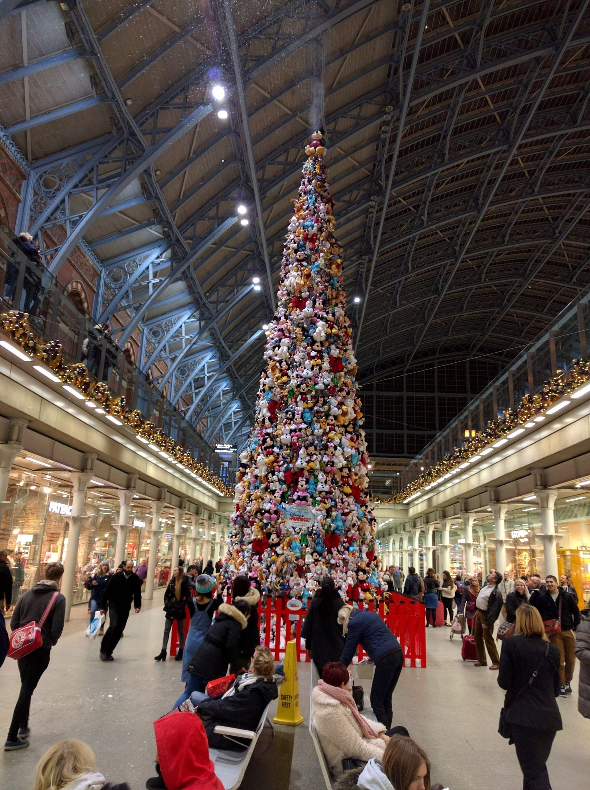
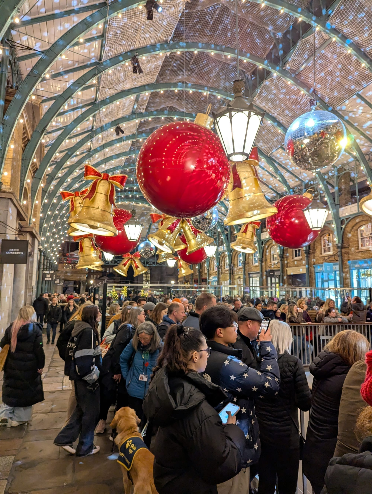
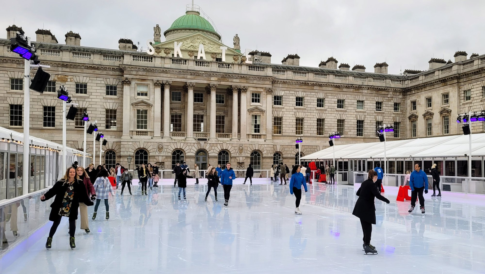
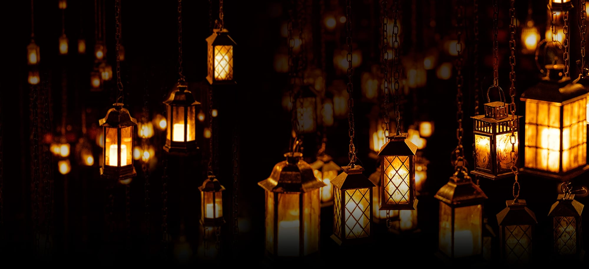
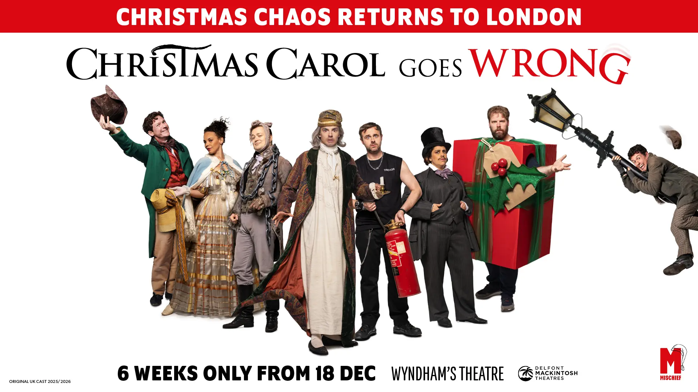
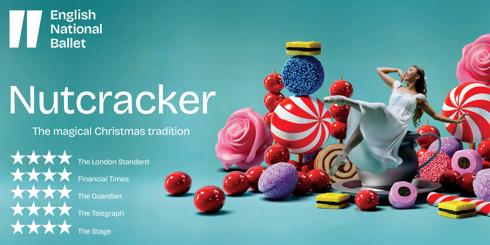

**Christmas in London runs from mid-November to the first week of January**, and most of it — the markets, the lights, the outdoor rinks — is free to look at even if the rides and skating aren't. The one thing to know before anything else: Hyde Park Winter Wonderland is not a free-to-wander street market, whatever the name suggests. Here's what's actually on, what it costs, and what's stopped running.

---

> 🧭 **Plan the rest of it:** [Hyde Park Winter Wonderland](/articles/hyde-park-winter-wonderland/) · [Christmas lights walk](/articles/christmas-lights-walk-london/) · [Christmas Day restaurants](/articles/christmas-day-restaurants-london/) · [New Year's Eve](/articles/new-years-eve-london/)

## Hyde Park Winter Wonderland

**19 November 2026 – 3 January 2027**, open every day except Christmas Day, closing at 10pm with last entry at 9.30pm.

**Entry is not free**, whatever the name suggests, and everybody in your group needs a timed ticket even if you only want to look at the market. In advance that is **£1 off-peak** (Monday to Thursday through November), **£5.50 standard** or **£8.25 peak**, and more on the door. Spend £25 online in one transaction on rides or attractions and entry becomes free.

Inside, **Santa's Grotto, the Christmas Market, the light arches and every band and DJ are free**. Everything else is not: the ice rink is £12.65–£19.25, the Giant Wheel £8.80–£12.10, the new Gandeys K-Pop Dragon Circus £13.75–£19.80 — and it is Gandeys in 2026, not Zippos, which had been the resident circus since 2009. Every fairground ride is charged separately on top.

The quietest and cheapest visit is the same visit: a Monday to Thursday daytime in late November, when entry is £1 and the attraction prices drop with it.

> 🎡 **[The full Winter Wonderland guide](/articles/hyde-park-winter-wonderland/)** — every published price, all four gates, the free live music, the Bavarian Hall's 18+ evening rule, and what is new for 2026.

---

## Christmas markets

**Kingston** is the first chalet market with its 2026 dates out, **12 November 2026 to 3 January 2027**, in the Ancient Market Place. In the centre, the **Southbank Centre Winter Market** is the food one and is cash-free, **Trafalgar Square's** chalets sit under the Norway spruce (lit **3 December**), and **Leicester Square's** ring an ice rink; none of the three had announced 2026 dates by late September. **Borough Market** opens every day from **30 November** and closes **25 to 27 December**. Almost all are free to walk into: Winter Wonderland's market needs an entry ticket from £1, and the Chelsea Physic Garden fair is £6 to £10.

> 🎄 **[Every Christmas market in London, with dates and hours →](/articles/christmas-markets-london/)** — the central markets, Kingston, Greenwich, Wimbledon and Battersea, and the maker fairs at the British Library, King's Cross and Chelsea Physic Garden.

Worth a detour even though it isn't a market: **St Pancras International's** concourse hosts an oversized Christmas tree every year, built from a different donated material each season for charity — past years have used everything from champagne bottles to, as pictured, thousands of soft toys. It's free to see and next door to King's Cross, so it folds into a visit to Canopy Market or a Crafty Fox maker market in Granary Square.

*The Apple Market, Covent Garden.*

---

## Christmas lights: where to see them

The big shopping streets confirm their switch-on dates from late September, but the pattern repeats every year: the best-known streets switch on first, in the opening two weeks of November, and the lights stay up until around Twelfth Night in early January. To see them in one evening on foot, follow our [Christmas lights walk](/articles/christmas-lights-walk-london/): ten stops from Selfridges to Trafalgar Square, with each street's 2026 switch-on date.

| Street | Known for |
| --- | --- |
| **Oxford Street** | "Sky Full of Stars" — over 5,000 illuminated stars the length of the street |
| **Regent Street** | The "Spirit(s) of Christmas" — illuminated angel figures, a Regent Street signature for decades |
| **Carnaby Street** | A completely different sculptural light installation each year |
| **Bond Street & South Molton Street** | Tens of thousands of LEDs on a different theme annually; South Molton Street's own blue-lit arches |
| **Covent Garden & Seven Dials** | The Piazza tree plus Seven Dials' light "canopies" radiating from the sundial monument |
| **Marylebone High Street** | "Merry Marylebone" — a full afternoon street festival with a ferris wheel and live music, not just lights |
| **Chelsea** | King's Road part-pedestrianised for a festival day; Sloane Street's lights run the length of the boulevard |
| **Canary Wharf** | No switch-on ceremony — the whole estate becomes a themed winter village from October (its ice rink is taking a break for 2026) |

**Trafalgar Square's tree is the one fixed date**: the lighting ceremony is **Thursday 3 December 2026**. It's a Norway spruce, a gift from the City of Oslo to London every year since 1947 in gratitude for Britain's support during the Second World War — felled at a formal ceremony in Norway, shipped over, and dressed only in traditional vertical strings of white lights, not baubles.

One practical note: TfL periodically closes Oxford Circus station's entrances for short periods when crowds build on Saturday evenings in December. Bond Street or Tottenham Court Road are the backup stations if that happens to you.

---

## Ticketed light trails

Different from the free street displays above — these are paid, walk-through experiences.

**Christmas at Kew** is the benchmark. **13 November 2026 – 3 January 2027**, a 3km illuminated trail through Kew Gardens taking upwards of two hours. Adult tickets from **£29.50 off-peak, £37 peak**; a Kew Gardens day visit is a separate ticket bolted on for an extra £12. Book through [kew.org](https://www.kew.org/kew-gardens/whats-on/christmas).

**[Hampton Court Palace](/articles/hampton-court-palace-guide/)** runs two separate things in 2026: **The Winter Palace**, a new indoor immersive walkthrough included in standard palace admission (£32–£35 adult), running **28 November 2026 – 3 January 2027**; and a **separate ice rink**, **20 November 2026 – 3 January 2027**, priced separately: £19.50 adult off-peak, £21.50 peak, family £59.50–£65.50 (see our [ice skating guide](/articles/ice-skating-london/)).

**Chelsea Winter Village & Illuminations**, at the Royal Hospital Chelsea, is a genuine outdoor light trail — 1.5km, 45–75 minutes — running **25 November – 28 December 2026**. Adult tickets from £19 off-peak, rising to £30.95 at peak times.

**What has gone:** Kenwood House's well-loved Neverland trail on Hampstead Heath has been **cancelled for 2026** after weak ticket sales, and Lightopia's Crystal Palace trail ended when the company behind it went into administration in January 2023.

---

Powered by <a target="_blank" rel="sponsored" href="https://www.getyourguide.com/london-l57/">GetYourGuide</a>

## Ice rinks and Santa's grottos

**Five outdoor rinks are confirmed for 2026-27:** **Somerset House** (11 November 2026 – 10 January 2027; adults £13–£28.50, children £11–£15, plus a £1.50 fee per ticket; on sale since 10am on 25 September 2026), **Hampton Court Palace** (20 November – 3 January; adults £19.50 off-peak, £21.50 peak), **Glide at Battersea Power Station** (6 November – 3 January), **the Queen's House** in Greenwich (18 November – 3 January) and the rink inside Winter Wonderland. **Alexandra Palace** has a year-round indoor rink, from £11.75. Dates, prices and children's rules for every rink are in our [London ice skating guide](/articles/ice-skating-london/).

*The rink at Somerset House.*

**Book Somerset House early:** prices vary through the run and the lowest go to early bookers. **Not running in 2026:** the **Natural History Museum's** rink has closed for good, **Canary Wharf's** is taking a break for the season, and there is no **Tower of London** rink.

For grottos, **Fortnum & Mason's** "Storytelling with Father Christmas" and **Hamleys'** Regent Street grotto are both expected back but are not on sale yet — 2025 prices were roughly £36–£45 and from £65 for a group of three, respectively. **Harrods'** famous grotto has been discontinued with no plans to reopen. **Selfridges** doesn't run a formal grotto — Santa and his elves roam the shop floor for free instead. Outside the centre, **[Chessington World of Adventures](/articles/chessington-world-of-adventures-day-trip/)**, in Zone 6, puts Father Christmas's grotto in a Christmas Village on selected dates from 21 November to 24 December 2026, with park entry from £32; [theme parks near London](/articles/theme-parks-near-london/) has the other parks' Christmas dates.

---

## Seeing the lights from a bus

The lights are free to walk past, but the streets that carry the best of them — Oxford Street, Regent Street, Knightsbridge — are also the ones with the worst December pavements. A bus solves that, and there are two quite different ways to do it.

### The cheap way: a normal red bus

**Route 390** runs Oxford Street end to end and costs **£1.75**. **Route 139** does Oxford Circus to Trafalgar Square. Sit at the front of the top deck after dark and you have most of the same view for the price of a bus fare, with a Hopper transfer inside the hour if you want to chain two routes together. This is the answer for most people, and nobody sells it because nobody makes anything from it.

### The tour: a decorated vintage Routemaster

**Christmas Bus Tour** runs an open-top 1960s Routemaster, decked out, with live commentary — **75 minutes**, departing from **8 Northumberland Avenue, WC2N 5BY**, beside Trafalgar Square. Typical departures are **4.10pm, 6.15pm and 7.45pm**, with more on busier dates. The route takes in Oxford Street, Regent Street, Knightsbridge and a pass by Winter Wonderland. **A top open-deck seat is guaranteed on every booking**, which is what you are paying for — the view is the product, and a lower-deck seat would defeat it.

**All ages, and under-5s go free** on an adult's lap with no ticket needed.

> ⚠️ **Two things to check before you book.** The bus is a genuine 1960s Routemaster, which means **there is no space to store a wheelchair or a pushchair** — the operator says so plainly and asks you to phone before booking rather than turning up. And it is **open-top in December**: dress for standing on a cold street for 75 minutes, because that is effectively what it is.

**B Bakery's afternoon tea bus** also runs seasonal versions from Victoria — that one feeds you, takes 90 minutes and costs rather more. It is covered in full in our [afternoon tea guide](/articles/best-afternoon-tea-london/).

---

## Christmas theatre

Panto is not the only thing on, and two of the best tickets in London at Christmas are not pantomimes at all. For every panto, Nutcracker and children's show with dates, prices and age guidance, see [Christmas shows and pantomimes in London](/articles/christmas-shows-london/).

### A Christmas Carol, The Old Vic

**10 November 2026 – 9 January 2027**, previews to 23 November. Jack Thorne's adaptation, directed by Matthew Warchus, now in its tenth season and **London's longest-running version of the story**. The auditorium is reconfigured in the round and the show comes out into it — mince pies included.

*The Old Vic's staging, in the round.*

It is warmer and less reverent than the book suggests — handbells, carols sung by the cast, and a Scrooge redeemed by the room rather than in spite of it. **Two hours with an interval, and the recommended age is eight and over**, which makes it the rare Christmas show that suits a mixed-age group without anyone being talked down to. Book on [Ticketmaster](https://www.ticketmaster.co.uk/a-christmas-carol-tickets/artist/890378).

### Christmas Carol Goes Wrong, Wyndham's Theatre

**18 December 2026 – 23 January 2027, from £15.** Mischief — the company behind *The Play That Goes Wrong* — doing the same story as a disaster: the Cornley crew feuding over who plays Scrooge while the set comes apart around them.

**It is the answer to "we want something Christmassy but not a panto and not earnest."** It also runs well past Christmas, into late January, which makes it the easiest festive ticket to get if you leave it late.

### Into the Woods, Noël Coward Theatre

**22 September 2026 – 9 January 2027.** Sondheim and Lapine's fairy-tale collision — Cinderella, Rapunzel, Jack and a baker's wife all wanting something — transferred to the West End after a sell-out run at the Bridge and won the Olivier for Best Musical Revival on the way.

**It is the least Christmassy thing here and the best argument for booking it.** The second act takes the happy endings apart, so it suits adults and older children, not a family with small ones, and it runs through to 9 January if December is already spoken for.

### The Great Christmas Feast, The Lost Estate

**The third way to do *A Christmas Carol*, and the only one you eat your way through.** The Lost Estate in West Kensington stages it as an immersive Victorian evening built around the moment Dickens first read the story aloud — live music, theatre performed around the tables, and a full feast, not a pre-theatre bite.

It is the same story as the Old Vic's and Mischief's, and a completely different night: you are seated at a table inside it, not watching from a seat. The Lost Estate has been doing this since 2017, and its current shows run £74.85 to £119.85, so budget accordingly.

> ⚠️ **Confirmed for 2026, but nothing else is.** The company says the Feast returns and is running a **presale signup**, but **no dates and no prices have been published**. Join the presale list rather than waiting for a listing to appear, because these sell through the list first.

**[More immersive nights out →](/articles/immersive-experiences-london/)** · **[The cabaret guide →](/articles/best-cabaret-london/)**

---

Powered by <a target="_blank" rel="sponsored" href="https://www.getyourguide.com/london-l57/">GetYourGuide</a>

## Christmas for children

The shows below are the ones built for children, not tolerated by them, and they book earlier than anything else in this guide. Grottos and ice rinks are further up the page.

### The Snowman, Peacock Theatre

**21 November 2026 – 3 January 2027, from £18** plus a £4 transaction fee. **1 hour 30 including a 20-minute interval.**

It has run for 32 years and **in 2026 it is a new production** — a world premiere staged by Sadler's Wells with Birmingham Rep, with new puppets and Howard Blake's score still intact, 'Walking in the Air' included. If you saw the old one, this is not that. The safest first theatre trip in London at Christmas, and the shortest. Book on [Ticketmaster](https://www.ticketmaster.co.uk/the-snowman-tickets/artist/1408779).

### Nutcracker, English National Ballet, London Coliseum

**17 December 2026 – 10 January 2027.** Over a hundred dancers and musicians, with the ENB Philharmonic playing Tchaikovsky live — which is the argument for this one over a recording in a smaller room. Book on [Ticketmaster](https://www.ticketmaster.co.uk/the-nutcracker-english-national-ballet-tickets/artist/1632757).

**The Royal Ballet's Nutcracker at Covent Garden** runs every Christmas as well, and is the grander and more expensive of the two. Either works from about five upwards; both sell out early, so book the moment the dates open, not in November.

### Pantomime

**Two worth choosing over whatever is nearest**: **Hackney Empire's** *Jack and the Beanstalk* (21 November – 31 December 2026), directed by and starring Olivier winner Clive Rowe, **£10–£48**; and the **London Palladium's** *Cinderella* (5 December 2026 – 10 January 2027), with Dawn French and Jennifer Saunders reuniting as the Ugly Sisters for the first time in 17 years.

### For the under-fives

**The Gruffalo** and its stablemates — *The Gruffalo's Child*, *Room on the Broom*, *The Smeds and The Smoos* — are made by Tall Stories, a London company, and at least one of them is usually playing somewhere in the city over Christmas. **The Gruffalo runs 55 minutes with no interval and is aimed at three and over**, which is the right shape for an age group that will not sit through a ballet. Venues and dates change every year, so check the company's own listings, not booking on the strength of the name.

> ⚠️ **Children's shows sell out first.** The Snowman, both Nutcrackers and the Palladium panto are usually gone for the good December dates by early autumn. If you are reading this in November, look at early January — the runs continue past Christmas and the seats are easier and cheaper.

---

## Carols

### The big one: the Royal Albert Hall

**Carols at the Royal Albert Hall** is the largest carol concert in the country and has been running for the best part of a century. The **Royal Choral Society** sings it with the **Royal Philharmonic Orchestra** — full orchestra, soloists, an audience of five thousand joining in, and a run of performances across the last two weekends before Christmas, including Christmas Eve.

It is a concert, not a service, so it is loud, secular in feel and completely unembarrassing to attend with people who never go to church. **Tickets go on sale in the spring and the Christmas Eve performances go first.**

### Churches worth the trip

**St Martin-in-the-Fields**, on the corner of Trafalgar Square, runs the best programme in London — a long season of carols by candlelight, and the one to pick if you want the sound of a proper church rather than a concert hall. **St Paul's Cathedral** and **Westminster Abbey** both hold carol services under the dome and in the nave respectively, and both are extraordinary and heavily oversubscribed. **Southwark Cathedral** is the quieter, easier alternative on the south bank, and **Union Chapel** in Islington does the least formal version of all, in a Victorian octagon with the pews still in.

> ⚠️ **Cathedral carol services are free but not open-door.** St Paul's and Westminster Abbey release seats by ballot or advance booking, and the queue for any unallocated space forms long before the doors do. Check each cathedral's own site from about October — a service being free does not mean you can turn up at seven and get in.

### Carols for nothing

**Trafalgar Square is the answer.** A Norway spruce is given to London by the city of Oslo every year in thanks for wartime support, and from the day it is lit until Christmas Eve there are **carols under it most evenings, sung by a different choir each night and free to stand and listen to**. Most are collecting for a charity, so bring change. It is the most reliably free Christmas music in London and the least publicised.

**The other free option is a parish church.** Most London churches hold a carol service in the fortnight before Christmas with no ticket and a collection plate at the end, and the singing is often better than the size of the building suggests. Look at what is on near where you are staying, not travelling for a name.

**In the shopping streets**, carol singers turn up through December at **Covent Garden**, **Leadenhall Market**, **Burlington Arcade** and the **Southbank Centre's** winter market — unscheduled and unticketed, so they are something you walk into, not plan around.

### More carol concerts to book

Beyond the free ones above, several concert halls run ticketed carol and candlelight evenings through December.

---

Powered by <a target="_blank" rel="sponsored" href="https://www.getyourguide.com/london-l57/">GetYourGuide</a>

## Afternoon tea at Christmas

Every grand hotel reprints its tea menu for Christmas, usually from early November to the first week of January, and the food changes more than the room does — chestnut, clementine, spiced pear, a mince pie in place of a scone. **The prices go up with it**, so a festive sitting costs more than the same tea in February.

**Claridge's** is the one to book if you want the occasion, not the novelty. Its festive menu runs from early November to 3 January at **£120 on weekdays and £130 at weekends**, in the Art Deco Foyer under the jade-and-white china, and it is the room where people dress up without being told to.

**The Winter Garden at The Landmark** is the one to book if you are bringing someone who wants to photograph it. Eight storeys of glass atrium and full-grown palms, decorated for the season, with a pianist and a harpist — the most theatrical tea room in London that is not a palace.

**Fortnum & Mason** is the sensible choice on a shopping day. The Diamond Jubilee Salon is four floors above the food hall, so the tea and the Christmas shopping are the same trip, and it is the one place where the leaf counts for more than the pastry.

**The Ritz** is the most formal and the hardest to get. Five sittings a day, a dress code that is actually enforced, and a Palm Court that needs no seasonal help. Book months out for December.

> ⚠️ **Festive menus are priced and dated separately from the standard tea**, and the good rooms sell December out by early autumn. Check the hotel's own site, not a listings page, and confirm which menu your booking is for.

**[The full afternoon tea guide, with every price →](/articles/best-afternoon-tea-london/)**

---

## Eating out on Christmas Day itself

Almost nothing opens on 25 December, no transport runs, and what does open is a fixed menu paid for in advance. It is a different exercise from booking a festive lunch in December, and it needs doing by late October.

**[Christmas dinner in London, and what it costs →](/articles/christmas-day-restaurants-london/)**

---

## Good to know

**TfL runs no services at all on Christmas Day** — no Tube, buses, Overground, DLR, Elizabeth line, trams or river boats. It's the same every year. Black cabs, private hire, Santander Cycles and rental e-scooters are the only options moving. **Boxing Day is reduced, not closed** — Tube and buses typically run to a Sunday timetable from around 7am, with the Elizabeth line historically closed altogether. Check [tfl.gov.uk/christmas-travel](https://tfl.gov.uk/christmas-travel) nearer the date for the exact 2026 detail.

**Deciding whether December is worth it against the rest of the year?** [Best Time to Visit London](/articles/best-time-to-visit-london/) sets its weather, crowds and cost against every other month.

---

