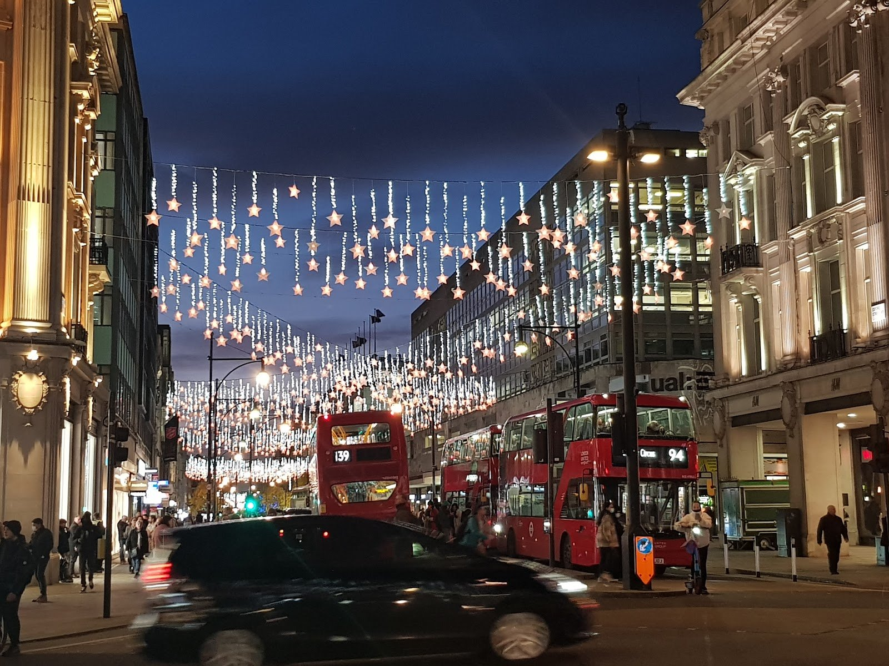
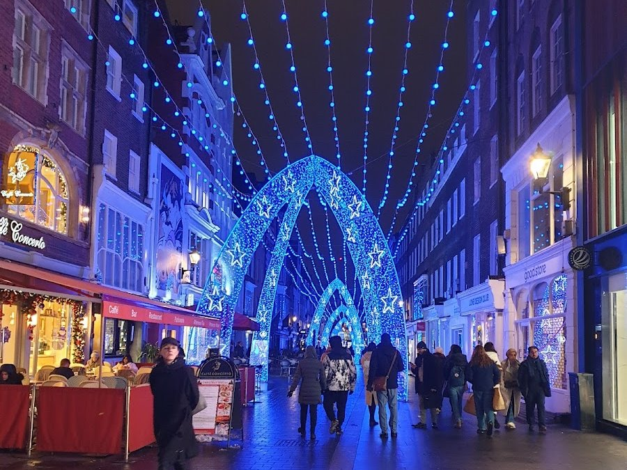
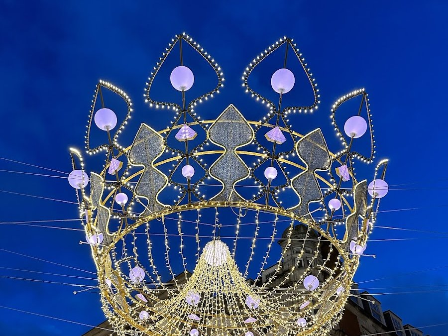
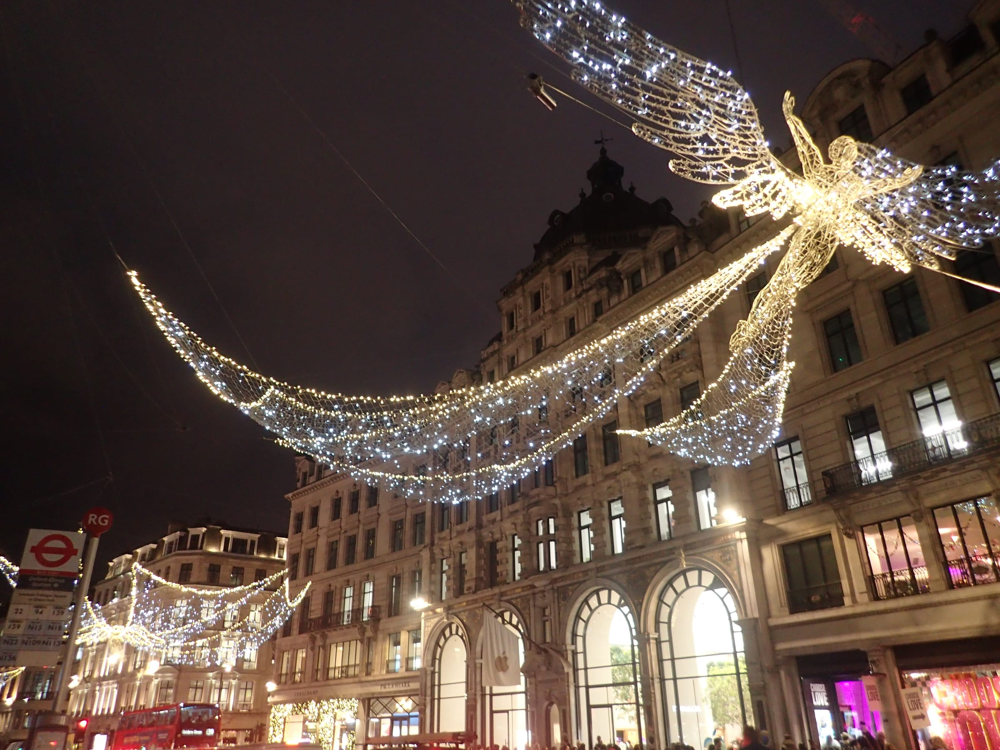
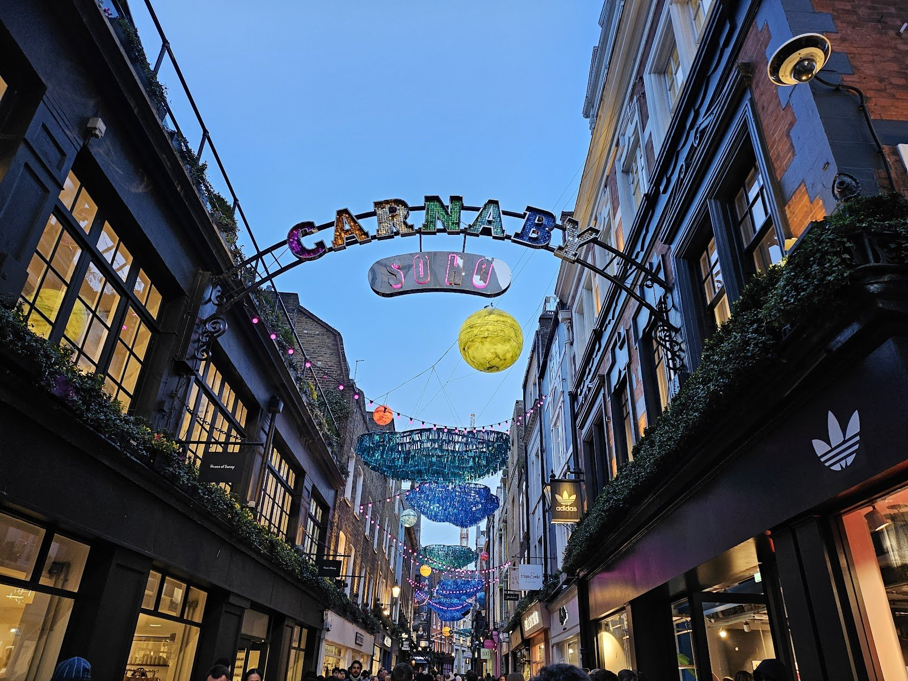
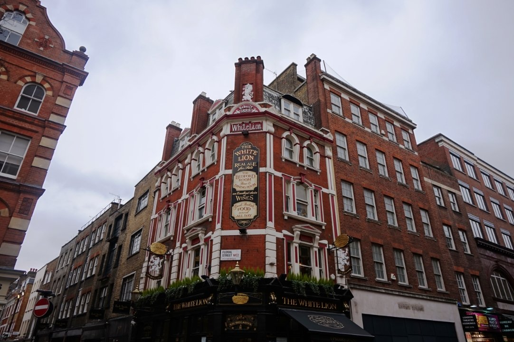
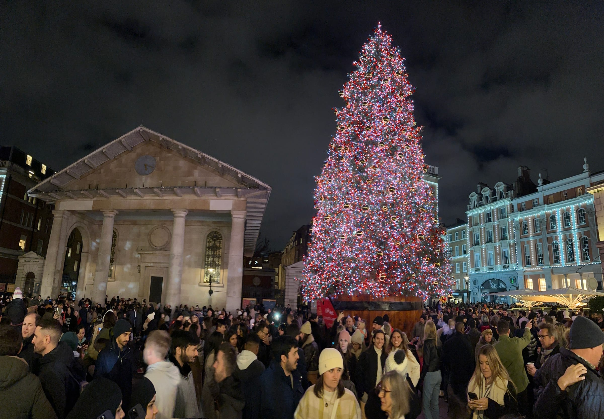
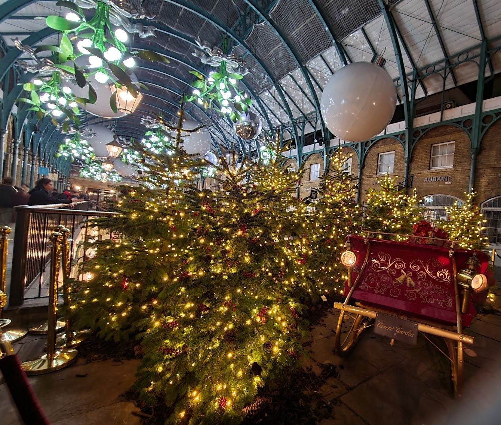

Most people see London's Christmas lights from a crush at Oxford Circus on a Saturday night: one street, one direction, shoulder to shoulder. The displays actually run in a line of about 5km from Selfridges to Trafalgar Square, and several of the best hang over side streets that the crowd walks past: St James's Market, Glasshouse Street, Seven Dials, Floral Street.

**This walk strings them together in one evening.** It starts at Selfridges, goes down Bond Street to Piccadilly, doubles back up the Regent Street Quadrant under the angels, crosses Soho by Carnaby, and finishes at the Covent Garden and Trafalgar Square trees. Every stop is free.

It is **about 5km, 70 minutes of walking**, and two to two and a half hours with stops. Start at dusk.

> 💡 **The Short Version:** Start at **Selfridges at about 4.30pm** in December (5pm in early November), when it is properly dark. **Carnaby's switch-on is Wednesday 4 November 2026 and Covent Garden's is Thursday 12 November**. Oxford Street, Regent Street and Bond Street had not announced their 2026 dates by late September; all three light up every year, and Oxford Street and Regent Street were on by 6 November last year. **Go Monday to Wednesday, or on Sunday after 6pm** when the big shops have shut. The Trafalgar Square tree is only lit from **Thursday 3 December**; before that, finish at Covent Garden.

## The route

  

    Map of the walk, numbered in walking order
  

  

    
Loading the map…

  

  

    <i class="route-map-marker" aria-hidden="true">1</i> On the route, in walking order
  

  <noscript>
    
The map needs JavaScript. Every stop below is numbered in walking order with its nearest station.

  </noscript>

**[Open the whole route in Google Maps →](https://www.google.com/maps/dir/?api=1&origin=51.515177,-0.15239&destination=51.50845,-0.12845&waypoints=51.513666,-0.147824%7C51.508131,-0.140042%7C51.509118,-0.133252%7C51.51005,-0.1364%7C51.51301,-0.138669%7C51.513754,-0.126905%7C51.512136,-0.124969%7C51.511979,-0.122741&travelmode=walking)** — all ten stops in walking order, set to walking directions, which is the version to put on your phone.

| # | Stop | 2026 switch-on | Runs |
| --- | --- | --- | --- |
| **1** | Oxford Street | Not yet announced (3 Nov in 2025) | Every year |
| **2** | South Molton Street | — | Its own blue arches in previous years; the way through to Bond Street |
| **3** | Bond Street | Not yet announced | Every year, often a new design |
| **4** | St James's Market | With Regent Street | Every year |
| **5** | Regent Street, the Quadrant | Not yet announced (6 Nov in 2025) | Every year since 1954 |
| **6** | Carnaby Street | **Wed 4 November** | Confirmed for 2026 |
| **7** | Seven Dials | **Thu 12 November** | Confirmed for 2026 |
| **8** | Floral Street | **Thu 12 November** | Confirmed for 2026 |
| **9** | Covent Garden | **Thu 12 November** | Confirmed for 2026 |
| **10** | Trafalgar Square tree | **Thu 3 December** | Every year |

---

## 1. Oxford Street

Start outside **Selfridges** and walk east.

**This should be Oxford Street's first Christmas without traffic.** The Oxford Street Development Corporation says the stretch from Orchard Street, the west side of Selfridges, to Great Portland Street is on track to go traffic-free by late October 2026, with buses, taxis and cycles diverted off it. If it goes to plan, you can walk down the middle of the street and look up.

The lights go up every year and are usually among the first in London to go on. In 2025 the scheme was **Sky Full of Stars**, thousands of white stars strung the length of the street, lit from **Monday 3 November**; in 2023 the date was 2 November. The 2026 date had not been announced by late September. The stars have run on a timer, **3pm to 11pm** in 2023, and stay up until early January.

*Oxford Street's stars, at Oxford Circus.*

Walk east past **Bond Street station**, about five minutes, and turn right just beyond it.

## 2. South Molton Street

A short **pedestrian street** running south from Oxford Street next to Bond Street station, and the calm way into Mayfair: no traffic, and a fraction of the Oxford Street crowd. In previous years the street has hung its own arches of blue lights.

*South Molton Street, in a previous year's lights.*

At the bottom it meets **Brook Street**. **Claridge's** is a hundred metres to the right, and every Christmas it hands the tree at the foot of its staircase to a different fashion designer to dress. Turn left, then right into **New Bond Street**.

## 3. Bond Street

Walk the full length, New Bond Street into Old Bond Street, down to Piccadilly. It is about 800 metres of jewellers' and fashion houses' windows, most of them dressed for Christmas.

**The Bond Street lights go up every year, and the design changes.** Peacock feathers hung for eight years; in 2022 they were replaced by a scheme taken from the Crown Jewels, with a tiara-shaped gateway at each end, necklace-like strands across the street and **four crowns over the main junctions**, modelled on the Imperial State Crown and built from 93,652 LEDs. The crowns were back in 2025. Stand under a junction and look straight up to see the strands hanging inside the ring. The street has switched on in mid-November in recent years; the 2026 date had not been announced by late September.

*One of the Bond Street crowns.*

At the bottom, turn left along **Piccadilly**, past Burlington Arcade, the Royal Academy and Fortnum & Mason, to Piccadilly Circus. Keep going across the Circus and into **Regent Street St James's**, the lower stretch of Regent Street running south.

## 4. St James's Market

On the left of Regent Street St James's, a pedestrian square of offices and restaurants between Regent Street and Haymarket, and the first place you will see **the Spirits**.

Regent Street's angels do not stop at Regent Street. The Crown Estate, which owns the street, hangs them over St James's Market, Glasshouse Street, Swallow Street and Quadrant Arcade as well as the main road: **more than 30 Spirits** in the 2025 display. Here you can stand under them without traffic or a crowd moving you along.

Walk back up to Piccadilly Circus and bear left into the curve of Regent Street.

## 5. Regent Street and the Spirits of Christmas

*Regent Street in December 2025. Photo: Marathon, [CC BY-SA 2.0](https://creativecommons.org/licenses/by-sa/2.0/), via [Wikimedia Commons](https://commons.wikimedia.org/wiki/File:Christmas_lights_in_Regent_Street_2025_-_geograph.org.uk_-_8214152.jpg).*

**The Quadrant**, the curve running north-west from Piccadilly Circus, is the stretch to walk slowly.

- **What they are:** giant winged figures in white light under canopies of LEDs, **more than 300,000 bulbs** in all. 2025 was their tenth year. They were designed by **Paul Dart of James Glancy Design**, who remembers seeing Spirits over this street as a child in 1961.
- **How long they have been here:** Regent Street has put up Christmas lights **every year since 1954**.
- **When they are on:** on a timer every day from early evening.
- **When they switch on:** 6 November in 2025 and 7 November in 2024. The 2026 date had not been announced by late September.
- **The photo:** the Crown Estate's own advice is to stand on the pedestrian island in the middle of the street, under a Spirit.

Look left down **Swallow Street** and right along **Glasshouse Street** and into **Quadrant Arcade** as you pass: the Spirits carry on into each of them.

> ⚠️ **Regent Street closed to traffic for one Saturday in December 2025**, 2pm to 9pm on 6 December, with stalls and choirs along the street. If it repeats in 2026 it will be the busiest evening of the season here. No 2026 date had been announced by late September.

Carry on up Regent Street past the top of the Quadrant and turn right into **Beak Street**, then left into Carnaby Street.

Powered by <a target="_blank" rel="sponsored" href="https://www.getyourguide.com/london-l57/">GetYourGuide</a>

## 6. Carnaby Street and Kingly Court

**Carnaby's switch-on is Wednesday 4 November 2026**, the earliest confirmed date on this walk. The 2026 theme is "the feel-good nostalgia of the 90s", in the words of Shaftesbury Capital, which owns the street. In 2024 the street put up a new design-led installation; the 2026 design had not been shown by late September.

*Carnaby's arch sign, in a previous year's lights.*

**Kingly Court** opens off the west side of Carnaby: three floors of restaurants around a courtyard, which is covered through the winter. It is the obvious place to stop for dinner on this walk. The courtyard is busiest from 6pm to 8pm and most of its restaurants take bookings, so book a table on a Friday or Saturday.

Oxford Circus is five minutes north if you want to stop here.

## 7. Seven Dials

The longest stretch between stops, about a kilometre and 14 minutes. Cross Soho eastwards along **Broadwick Street**, turn right down **Wardour Street**, left along **Old Compton Street** to Cambridge Circus, and take **Earlham Street** to the Dials.

Seven Dials is part of **Covent Garden's switch-on on Thursday 12 November 2026**. Its display is the **Canopies of Light** over the streets, with the **Sundial Pillar** as the centrepiece. The pillar was cut in 1693–4 by Edward Pierce, then England's leading stonemason. It carries **six dial faces**; the column itself is the seventh.

**Seven Dials Market**, in the old banana warehouse on Earlham Street, is the cheapest sit-down meal on the route: around twenty street-food traders and two bars, walk-in for small groups. Open **Monday and Tuesday noon to 10pm, Wednesday to Saturday 11am to 11pm, Sunday 11am to 9pm**.

## 8. Floral Street

Go down **Mercer Street** to Long Acre, turn right, left into Garrick Street, and left again into **Floral Street**.

A narrow cobbled street of fashion shops, strung with Covent Garden's lights, and the quiet approach to the Piazza. Covent Garden says **more than 300,000 lights** go up across the district for 2026. Walk it east and turn right down **James Street** into the Piazza.

*Floral Street, by day.*

## 9. Covent Garden: the tree and the Market Building

*The tree on the West Piazza. Photo: Matt Brown, [CC BY 2.0](https://creativecommons.org/licenses/by/2.0/), via [Wikimedia Commons](https://commons.wikimedia.org/wiki/File:Busy_Covent_Garden_with_Christmas_tree_2023-12-17.jpg).*

**Covent Garden's switch-on is Thursday 12 November 2026.** Three things to see:

- **The tree**, British-grown, on the **West Piazza** in front of St Paul's Church.
- **The Market Building**, hung with **gold bells, mirror balls and baubles**, all returning for 2026. The upper level, by the rail over the lower courtyard, puts you closest to them.
- **The Box Office Bar** on the Piazza, serving mulled wine for a second year.

*The Market Building, in a previous year's decorations.*

**For the view from above**, go up to **Bar Cicoria on level five of the Royal Opera House**, in the north-east corner of the Piazza. It is a covered, heated terrace looking down on the market roof and the lights, it takes walk-ins, and no ticket is needed. Open daily from midday, to 11pm Monday to Saturday and 9.15pm on Sunday. The building is cashless and bags are checked at the door.

On Thursdays through the season Covent Garden runs **Festive Thursdays**, with late-night shopping and choirs; the details are published in November. It makes Thursday the liveliest night here and the most crowded.

## 10. Trafalgar Square

From the Piazza take King Street and New Row to St Martin's Lane, and follow it south past the Coliseum to Trafalgar Square, about nine minutes.

**The tree is lit at a ceremony on Thursday 3 December 2026.** It is a Norwegian spruce, chosen in the forests around Oslo, which sends one every year, and shipped over by sea. It is dressed in the Norwegian way, with **vertical strings of white lights** and no baubles, and stays until just before Twelfth Night.

> ⚠️ **Walking before 3 December, there is no tree to see yet.** Finish at Covent Garden instead: Leicester Square station is five minutes west of the Piazza.

---

## Where to eat

- **Kingly Court** (££), stop six: three floors of restaurants around a covered courtyard, about halfway round. Book at weekends.
- **Seven Dials Market** (£), stop seven: street food and two bars, open until 11pm Wednesday to Saturday.
- **Bar Cicoria** (££), stop nine: small plates and drinks on the Royal Opera House terrace, over the Piazza lights.

For more, see the [Soho guide](/articles/soho-area-guide/) and [where to eat in Covent Garden](/articles/covent-garden-area-guide/#where-to-eat-and-drink).

Powered by <a target="_blank" rel="sponsored" href="https://www.getyourguide.com/london-l57/">GetYourGuide</a>

## The best time to go

**Start after dark, and it gets dark early.** Sunset in central London:

| Date | Sunset | Dark enough by about |
| --- | --- | --- |
| 4 November | 4.30pm | 5pm |
| 12 November | 4.18pm | 4.50pm |
| 3 December | 3.55pm | 4.30pm |
| Mid-December | 3.52pm | 4.30pm |

A 4.30pm start at Selfridges in December puts you at Covent Garden at about 6.30pm with time to stop. Plan to be finished by 11pm.

**Which night:**

| Day | What to expect |
| --- | --- |
| **Monday to Wednesday** | **The quietest.** After 6.30pm, once the commuters have gone |
| **Thursday** | Festive Thursdays in Covent Garden: late shopping, choirs, bigger crowds at the Piazza |
| **Friday** | After-work crowds early in the evening, then full restaurants |
| **Saturday** | **The busiest night of the week** in December on Oxford Street and Regent Street |
| **Sunday** | Busy until the big shops shut; **quiet after 6pm** |

**The case for Sunday evening.** Large shops in England can open for only six hours on a Sunday, and on Oxford Street and Regent Street they close by 6pm. The lights stay on, the shoppers go home and the pavements thin out. Seven Dials Market is open until 9pm and Bar Cicoria until 9.15pm.

**Switch-on nights are the most crowded of the season:** Carnaby on 4 November and Covent Garden on 12 November, and Oxford Street and Regent Street on theirs. Go for the countdown if that is the point; for the lights, choose another night.

## Rather ride?

An open-top bus tour covers Oxford Street, Regent Street and the West End with commentary, and saves your feet in the cold. It will not go down Carnaby, Seven Dials or St James's Market, which are pedestrian. To carry on after the walk, The Classic Tour's <a href="https://www.getyourguide.com/activity/-t1236950?partner_id=WWP7I0R&amp;cmp=christmas-lights-walk-london" target="_blank" rel="sponsored nofollow noopener" data-affiliate="gyg">Vintage Open-Top Bus Night Tour</a> leaves from Northumberland Avenue, just off Trafalgar Square where the walk ends: 75 minutes on a 1960s Routemaster past floodlit Parliament, the London Eye, St Paul's and the Tower, with a live guide, from £25 on GetYourGuide and rated 4.6 from 860 reviews.

Powered by <a target="_blank" rel="sponsored" href="https://www.getyourguide.com/london-l57/">GetYourGuide</a>

## Getting there and back

**Start:** Marble Arch (Central line), four minutes west of Selfridges, or Bond Street (Elizabeth line, Central, Jubilee), four minutes east of it; from Bond Street, walk to Selfridges first or start at stop two. **Finish:** Charing Cross (Bakerloo, Northern and National Rail) is on Trafalgar Square; Embankment and Leicester Square are five minutes away.

**To cut it short:** Piccadilly Circus after stop five, Oxford Circus after Carnaby, or Leicester Square after Covent Garden. Avoid **Covent Garden station**: it has no escalators, only lifts and a 193-step spiral staircase, and the estate's own advice is to use Leicester Square at busy times.

**On Christmas Day there is no Tube and no bus**, so this is a walk for the days either side of it.

The route is flat, on pavements and pedestrian streets throughout, with a stretch of cobbles in Covent Garden. Walked in reverse it works just as well, and ends at Selfridges.

## Carry on walking

- **[Covent Garden: Leicester Square to Somerset House](/articles/covent-garden-walk/)** — the daytime version of stops seven to nine, with the markets, the Opera House and Neal's Yard.
- **[Westminster](/articles/westminster-walk/)** — it ends at Trafalgar Square, where this one does; walk it in reverse down Whitehall to the river.
- **[Baker Street to Marylebone through Regent's Park](/articles/regents-park-marylebone-walk/)** — it finishes at St Christopher's Place, across Oxford Street from Bond Street station, a few minutes from where this one starts.
- **[Fitzrovia to Mayfair](/articles/fitzrovia-mayfair-walk/)** — it crosses this route on Piccadilly and ends at Green Park, five minutes west of the bottom of Bond Street.

## What to do with the rest of the day

- **[Christmas in London](/articles/christmas-in-london/)** — the markets, ice rinks and ticketed light trails, and every other street display.
- **[Hyde Park Winter Wonderland](/articles/hyde-park-winter-wonderland/)** — its Red and Gold gates are nearest Marble Arch, where this walk starts. Entry needs a timed ticket.
- **[Christmas shows in London](/articles/christmas-shows-london/)** — the West End is all around the second half of this walk.
- **[Where to stay in Covent Garden](/articles/where-to-stay-covent-garden/)** or **[in Soho and the West End](/articles/where-to-stay-soho-west-end/)** — to be a few minutes' walk from the lights rather than a Tube ride.
- **[The Soho guide](/articles/soho-area-guide/)**, **[the Covent Garden guide](/articles/covent-garden-area-guide/)** and **[the Mayfair guide](/articles/mayfair-area-guide/)** — where to eat and drink along the route.
