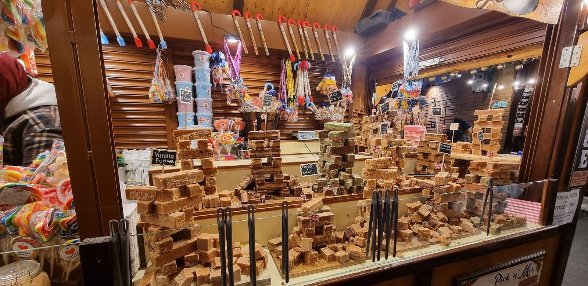
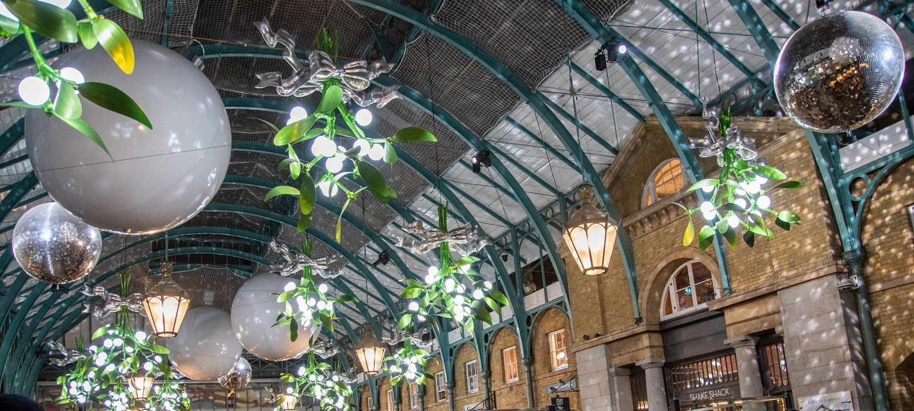
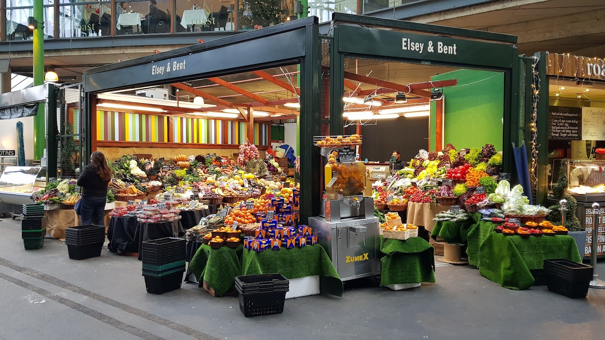
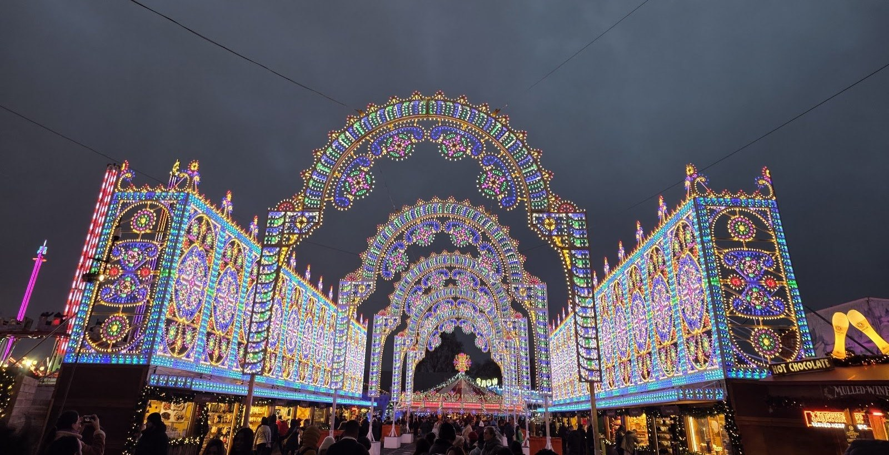
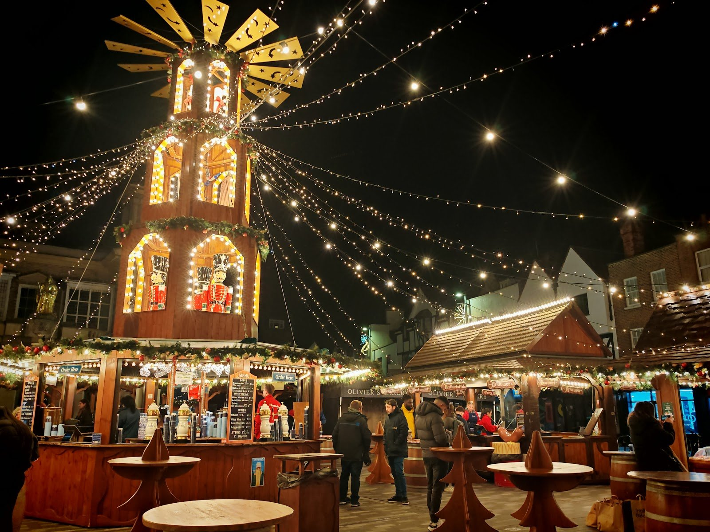
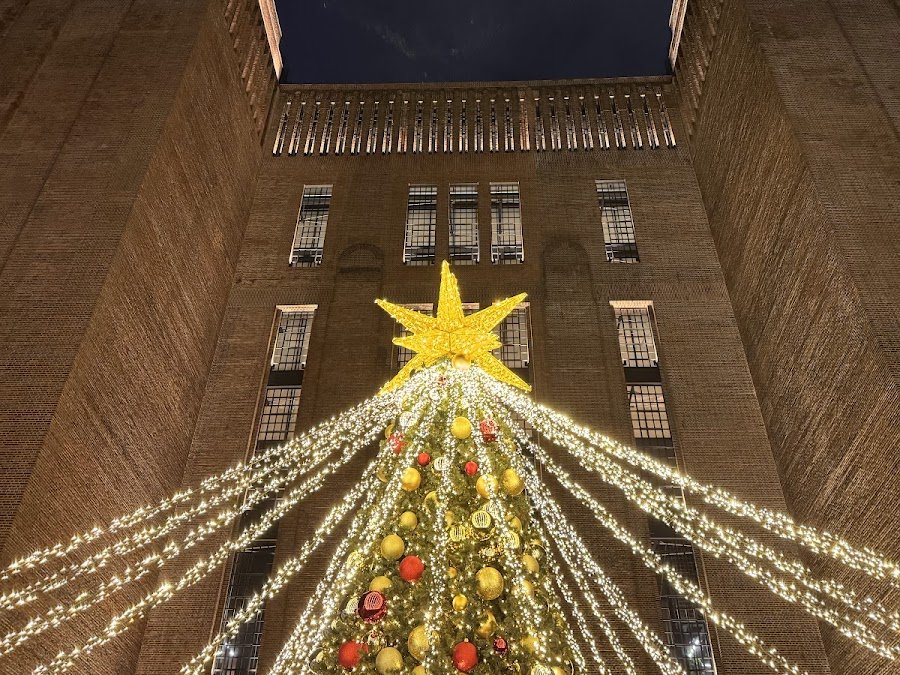

London's Christmas markets come in three kinds: the chalet markets that go up for six weeks in November, the year-round markets that dress up for December, and one-weekend maker fairs where the stallholders made what they sell. Most cost nothing to walk into. Most of the chalet markets also publish their dates late, so several below still carry their 2025 dates.

> 💡 **The Short Version:** **Kingston** is the one with its 2026 dates out: **12 November 2026 to 3 January 2027**, free, in the Ancient Market Place. In central London, the **Southbank Centre Winter Market** is the food one, beside the river and **cash-free**; **Trafalgar Square** has the Norway spruce, lit on **3 December**; **Leicester Square** puts its chalets round an ice rink. None of those three had announced 2026 dates by late September. **Borough Market** opens seven days a week from **30 November** and closes **25 to 27 December**. For handmade gifts, **Crafty Fox** has four 2026 dates, from the British Library on **14–15 November** to King's Cross on **12–13 December**. **Winter Wonderland's** market needs an entry ticket; nothing else here does, apart from Chelsea Physic Garden's fair.

> 🧭 **Plan the rest of it:** [Christmas in London](/articles/christmas-in-london/) · [Christmas lights walk](/articles/christmas-lights-walk-london/) · [Hyde Park Winter Wonderland](/articles/hyde-park-winter-wonderland/) · [Ice skating](/articles/ice-skating-london/) · [Christmas Day restaurants](/articles/christmas-day-restaurants-london/) · [New Year's Eve](/articles/new-years-eve-london/)

*Dates, hours and prices as published by each organiser on 27 September 2026.*

## The markets at a glance

| Market | Where | 2026 dates | Price | The catch |
| --- | --- | --- | --- | --- |
| **Southbank Centre Winter Market** | Queen's Walk, SE1 | Not yet announced (2025: 3 Nov – 4 Jan) | Free | Cash-free; closed Christmas Day and in 2025 on 31 Dec and 1 Jan |
| **Trafalgar Square** | North Terrace, WC2 | Not yet announced | Free | Small: one row of chalets. The tree is only lit from 3 December |
| **Leicester Square** | Leicester Square, WC2 | Not yet announced (2025: 1 Nov – 4 Jan) | Free; the rink is ticketed | Enclosed, and crowded in the evenings |
| **Covent Garden** | The Piazza and Market Building, WC2 | Lights on 12 Nov 2026 | Free | No chalet market: the draw is the decorations and the everyday market halls |
| **Borough Market** | Southwark Street, SE1 | Daily from 30 Nov 2026 | Free | Closed 25–27 Dec and 1 Jan; shuts at 5pm |
| **Winter by the River** | London Bridge City, SE1 | Not yet announced (2025: 13 Nov – 4 Jan) | Free; curling is paid | Closed Christmas Day |
| **Winter Wonderland market** | Hyde Park, W2 | 19 Nov 2026 – 3 Jan 2027 | Entry ticket from £1 | Everyone needs a timed ticket, even just for the market |
| **Kingston** | Ancient Market Place, KT1 | 12 Nov 2026 – 3 Jan 2027 | Free | Stalls shut at 6pm Sunday to Wednesday |
| **Greenwich Market** | Greenwich, SE10 | Daily, all year | Free | Closes at 5.30pm; the street food market next door stops after 29 Nov |
| **Wimbledon** | The Piazza, SW19 | Not yet announced (2025: three Thursday-to-Sunday weekends) | Free | Only 12 trading days |
| **Crafty Fox** | British Library, RSA House, King's Cross | 14–15 Nov, 5 Dec, 6 Dec, 12–13 Dec | Free at the British Library, with a ticket to book | One or two days each; different makers each day |
| **Chelsea Physic Garden fair** | Royal Hospital Road, SW3 | 26–29 Nov 2026 | £6–£10 | Ticketed; four days only |
| **Columbia Road** | Columbia Road, E2 | Not yet announced (2025: four Wednesday evenings) | Free | Shops only, 5–9pm, no road closure |

---

## Central London

### Southbank Centre Winter Market

**The food-led one, on the river between the London Eye and Waterloo Bridge.** Alpine-style chalets line the Queen's Walk with bars, street food and independent craft traders under strings of lights. The 2025 menu ran to duck wraps, Himalayan dumplings, Yorkshire pudding wraps, Dutch pancakes and churros, and the craft stalls sell jewellery, decorations and clothes made by independent designers.

- **Dates:** the Southbank Centre's winter season starts in November 2026, market included, but the dates are not yet announced. The 2025 market ran from **Monday 3 November 2025 to Sunday 4 January 2026**, closed on Christmas Day, New Year's Eve and New Year's Day.
- **Hours in 2025:** craft traders **11am–9pm**, food **11am–10pm**, bars **11am–11pm**, every day.
- **Price:** free to walk through.
- **Getting there:** Waterloo is about five minutes; from Embankment, cross the Golden Jubilee footbridge.

> ⚠️ **It is cash-free.** Bring a card or phone.

Friday and Saturday evenings are the fullest; a weekday lunchtime gets the same food with room to stand at the barrel tables. The Southbank Centre is stop three on our [South Bank walk](/articles/south-bank-walk/), and the market is the easiest one to pair with a show there.

### Trafalgar Square Christmas Market

**A single row of wooden chalets on the North Terrace, directly in front of the National Gallery**, selling decorations, gifts, mulled wine and hot snacks. It is small, and the setting is the reason to go: the gallery portico behind, St Martin-in-the-Fields to one side and the Norway spruce below.

- **Dates:** the market returns every year, opening in November and trading into early January. Its 2026 dates had not been announced by late September.
- **The tree:** a Norway spruce given by the people of Oslo every year since 1947. It is lit on **Thursday 3 December 2026** and stays until just before Twelfth Night. From the lighting until Christmas, charity choirs sing carols in one-hour sessions at its base most evenings, free to stand and listen.
- **Price:** free.
- **Getting there:** Charing Cross is two minutes; Leicester Square about five.

**Come after 3 December**, when the tree is lit and the choirs start; before that it is a row of stalls beside a fountain. It takes half an hour, so fold it into an evening with Leicester Square and Covent Garden, or a daytime visit to the [National Gallery](/articles/westminster-area-guide/).

### Leicester Square

**Chalets in the gardens around a circular ice rink**, run by Underbelly as Skate Leicester Square. The market is free; the rink is ticketed, and in 2025 opened 10am to 10pm, with the first session at 10.15am and the last at 9.15pm.

- **Dates:** in 2025 it ran **1 November 2025 to 4 January 2026**. The 2026 dates were not yet announced by late September.
- **Getting there:** Leicester Square station is a minute's walk; Piccadilly Circus about four.

*A fudge and pick-and-mix chalet at Leicester Square.*

**It is enclosed and gets crowded in the evenings**, which makes it awkward with a pushchair or shopping bags. Go in the afternoon, or stop on the way to a show rather than after it. For the rink itself, prices and sessions are in our [ice skating guide](/articles/ice-skating-london/).

### Covent Garden

**Covent Garden has no chalet market. What it has is a full set of Christmas decorations over the market halls that trade all year.** The lights go on on **Thursday 12 November 2026**: over 300,000 of them across the neighbourhood, the giant gold bells, mirror balls and baubles hung inside the Market Building, and a British-grown tree on the West Piazza beside St Paul's Church.

**What to buy:** the **Apple Market** under the glass roof sells antiques on Mondays and crafts and general goods the rest of the week, from about 10am to 6pm. The **East Colonnade** has handmade jewellery and gifts, and the **Jubilee Market Hall** on the south side is cheaper and closer to a general market. A mulled wine cart stands on Central Avenue through the season.

- **Price:** free.
- **Getting there:** Covent Garden station is two minutes but often exit-only when busy; Leicester Square is usually quicker.

*The gold bells under the Market Building's roof, lit after dark.*

**It is one of the busiest places in London on a December Saturday.** Go on a weekday morning to see the bells without the crowd, or after dark to see them lit; the [Christmas lights walk](/articles/christmas-lights-walk-london/) finishes here, via Seven Dials and Floral Street. More on the neighbourhood in our [Covent Garden area guide](/articles/covent-garden-area-guide/).

### Borough Market at Christmas

**The market to buy Christmas food rather than eat it standing up**, though it does both: cheesemongers, butchers, bakers and wine merchants under a Victorian iron roof, with the hot-food stalls in between. Borough has published its 2026 festive hours.

- **Daily from Monday 30 November 2026:** Monday to Friday **10am–5pm**, Saturday **9am–5pm**, Sunday **10am–4pm**. Outside December it is closed on Mondays.
- **Exceptions:** Wednesday 23 December **10am–6pm**; Christmas Eve **8am–3pm**; **closed 25, 26 and 27 December**; 31 December **10am–3pm**; closed New Year's Day; normal hours from Saturday 2 January 2027.
- **Price:** free.
- **Getting there:** London Bridge station is two minutes.

> ⚠️ **Christmas Eve closes at 3pm and the market does not reopen until 28 December.** If you are collecting an order for Christmas dinner, it is 8am on the 24th or earlier in the week.

*Elsey & Bent's fruit and vegetable stalls, with Roast restaurant on the floor above.*

Saturday between 11am and 2pm is the crush; Friday mid-morning is well stocked and calm. Kappacasein's toastie, the most queued-for thing here, trades only Thursday to Saturday. The stall-by-stall detail is in our [best London markets](/articles/best-london-markets/) guide, and Borough is the lunch stop on the [Bankside and Borough walk](/articles/bankside-borough-walk/).

### Winter by the River, London Bridge City

**Market stalls along the Thames between London Bridge and Tower Bridge**, with a heated two-storey Glasshouse bar serving mulled drinks, pizza and waffles, and a glass-walled curling venue with six lanes, booked by the 50-minute session.

- **Dates:** 2026 not yet announced. In 2025 it ran from **13 November 2025 to 4 January 2026**, **11am–10pm** daily; Christmas Eve 11am–5pm, closed Christmas Day, New Year's Eve 11am–9pm.
- **Price:** free to walk through; curling is paid.
- **Getting there:** London Bridge station, about five minutes.

Choirs sing on a published schedule through the season. On Tuesdays and Wednesdays until 4pm the curling lanes are taken by the offices around it, so book another day.

### Hyde Park Winter Wonderland

**Winter Wonderland has a Christmas market of 60-plus traders beside the ice rink, best reached through the Blue Gate at Hyde Park Corner**, plus more stalls along Luminarie Lane and a weekend artisan market in Market Square. It runs **19 November 2026 to 3 January 2027**, closed only on Christmas Day, until 10pm.

**The market is free once you are inside, but getting inside is not:** everyone needs a timed entry ticket, **£1 off-peak, £5.50 standard or £8.25 peak** in advance. Every price, gate and quiet time is in our [Winter Wonderland guide](/articles/hyde-park-winter-wonderland/).

*The Bavarian village at Winter Wonderland, with the big wheel behind.*

---

## Three markets in one evening, with a guide

The <a href="https://www.getyourguide.com/activity/-t317907?partner_id=WWP7I0R&amp;cmp=christmas-markets-london" target="_blank" rel="sponsored nofollow noopener" data-affiliate="gyg">Christmas Lights & Bites Tour</a> meets at Embankment, walks through Covent Garden and Trafalgar Square and finishes at the Southbank market: **2.5 hours for £99**, with mulled wine, spiced cider or hot chocolate and snacks on the way. It has four reviews so far. The same route on your own costs nothing and is about half an hour's walking.

Powered by <a target="_blank" rel="sponsored" href="https://www.getyourguide.com/london-l57/">GetYourGuide</a>

---

## Beyond the centre

### Kingston Christmas Market

**The first chalet market to publish its 2026 dates:** wooden stalls in the pedestrianised Ancient Market Place in Kingston upon Thames, a bar and live-music stage, and a carousel. The 2025 food traders included bratwurst, Yorkshire pudding wraps, Dutch pancakes and Belgian waffles, souvlaki, and pasta turned in a cheese wheel; the gift stalls sell personalised decorations, wooden music boxes and nutcrackers, jewellery and socks.

- **Dates:** **Thursday 12 November 2026 to Sunday 3 January 2027**, closed Christmas Day.
- **Stalls:** Sunday to Wednesday **10am–6pm**, Thursday to Saturday **10am–8pm**; 5.30pm close on Christmas Eve.
- **Bar, food and stage:** Monday **10am–8pm**, Tuesday and Wednesday **10am–9pm**, Thursday to Saturday **10am–10pm**, Sunday **10am–8pm**.
- **Price:** free; the carousel and rides are ticketed.
- **Cash or card:** most traders take both, and the organisers prefer card.
- **Getting there:** trains from Waterloo to Kingston, then about ten minutes' walk. The market address is KT1 1JS.

*The bar under the Christmas pyramid in Kingston's Market Place.*

**It is all open-air**, with some covered seating, and the organisers may close it in very bad weather. Weekends are busy enough that they advise against bringing dogs. Tuesday evening from 6pm is the open-mic night on the stage.

### Greenwich Market

**A covered market of designer-makers, antiques dealers and food stalls, trading since 1737**, which dresses up for Christmas rather than turning into a Christmas market. It is the one to visit for gifts made by the person selling them, many under £15.

- **Open:** daily **10am–5.30pm**, all year, closed Christmas Day. Arts and crafts on Monday, Wednesday, Friday and weekends; antiques and collectables on Tuesday, Thursday and Friday.
- **The Lantern Parade:** each November local schoolchildren carry lanterns from the Old Royal Naval College to the market, where the Christmas lights are switched on and the market stays open until 6pm. In 2025 it was Wednesday 19 November; the 2026 date is not yet announced.
- **Price:** free.
- **Getting there:** Cutty Sark DLR, three minutes.

**The Cutty Sark Street Food Market next door trades weekends only, and its last day in 2026 is 29 November.** After that, eat in the market hall. The Queen's House ice rink is ten minutes' walk away; see our [Greenwich area guide](/articles/greenwich-area-guide/) for the rest of the day.

### Wimbledon Christmas Market

**Love Wimbledon's market on The Piazza by the station**, with 70-plus local traders across its run: original art, candles, jewellery and knitwear, and food from Greek and Argentinian stalls to chimney cakes.

- **Dates:** 2026 not yet announced. In 2025 it ran three Thursday-to-Sunday weekends from 27 November to 14 December.
- **Hours in 2025:** Thursday and Friday **12pm–7pm**, Saturday and Sunday **11am–6pm**.
- **Price:** free, and dogs are welcome.
- **Getting there:** Wimbledon station, two minutes.

### Battersea Power Station

**A skate trail, a food-hut square and a makers' market around the power station.** The **Glide** ice rink and 200-metre riverside skate trail is confirmed for **Friday 6 November 2026 to Sunday 3 January 2027**. In 2025 the Salad Days Christmas Market of small independent makers ran on three weekends, from mid-November to mid-December, and winter food huts in Malaysia Square sold chimney cakes and Yorkshire pudding wraps until 4 January. The 2026 market dates are not yet announced.

- **Price:** free to walk round; skating is ticketed.
- **Getting there:** Battersea Power Station station (Northern line), three minutes.

*The Christmas tree at Battersea Power Station.*

More in the [Battersea area guide](/articles/battersea-area-guide/).

---

## Maker fairs worth a trip

### Crafty Fox Market

**Independent designer-makers, most of them selling their own work: ceramics, prints, jewellery, textiles and homewares.** Crafty Fox has run London maker markets since 2010, and four of its 2026 Christmas dates are out:

- **British Library**, 96 Euston Road: **Saturday 14 and Sunday 15 November 2026**, 10am–4pm, different traders each day. Free, with a free ticket to book.
- **RSA House**, 8 John Adam Street, just off the Strand: **Saturday 5 December 2026**, 11am–5pm, in the Georgian Great Room, with food, drink and workshops.
- **King's Cross**, The Crossing, Granary Square: **Sunday 6 December 2026**, 11am–5pm, with 110 makers, and again on **Saturday 12 and Sunday 13 December**, 11am–5pm.

**The King's Cross dates combine with Canopy Market**, the covered weekend food and makers' market two minutes away under the West Handyside Canopy. More in our [King's Cross area guide](/articles/kings-cross-area-guide/).

### Chelsea Physic Garden Christmas Fair

**Over 100 independent businesses inside London's oldest botanic garden**, selling homewares, clothes, accessories, artisan food and drink.

- **Dates:** **Thursday 26 to Saturday 28 November 2026, 10am–5pm**, and **Sunday 29 November, 10am–4pm**.
- **Price:** **£6 early bird, £8 booked in advance, £10 on the door**; free for Friends of the Garden.
- **Where:** 66 Royal Hospital Road, SW3 4HS. Sloane Square is about 15 minutes' walk.

It is the only ticketed fair here and worth booking early for the lower price. Our [Chelsea area guide](/articles/chelsea-area-guide/) has the rest of the neighbourhood.

### Columbia Road Christmas Wednesdays

**The shops behind the Sunday flower market stay open late on the Wednesdays before Christmas**, 5pm to 9pm, with a tree, mince pies and mulled wine, and the pubs and cafés open around them. In 2025 the dates were **26 November and 3, 10 and 17 December**; the 2026 dates are not yet announced.

It is shops rather than stalls, with no road closure and no carol singing, and it is far quieter than the Sunday market. Hoxton is about five minutes' walk.

---

## Year-round markets in December

**Old Spitalfields**, **Camden** and **Canopy Market** at King's Cross trade all year and add Christmas to what is already there rather than building a Christmas market. In December 2025 Spitalfields ran Christmas editions of its Wednesday Urban Makers market and a children's treasure trail on top of its daily stalls. None of the three had published a 2026 Christmas programme by late September. Days, hours and what each is for are in our [best London markets](/articles/best-london-markets/) guide.

**Carrying on:** the [Christmas lights walk](/articles/christmas-lights-walk-london/) passes Covent Garden and ends at Trafalgar Square; [ice skating](/articles/ice-skating-london/) covers the rinks at Leicester Square, Battersea and Greenwich; and [Christmas shows and pantomimes](/articles/christmas-shows-london/) has the evening after the market.

