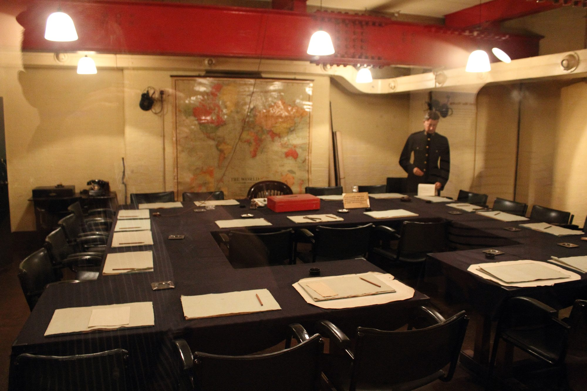
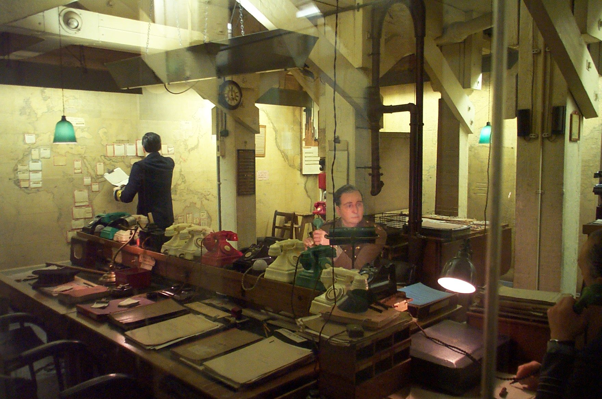
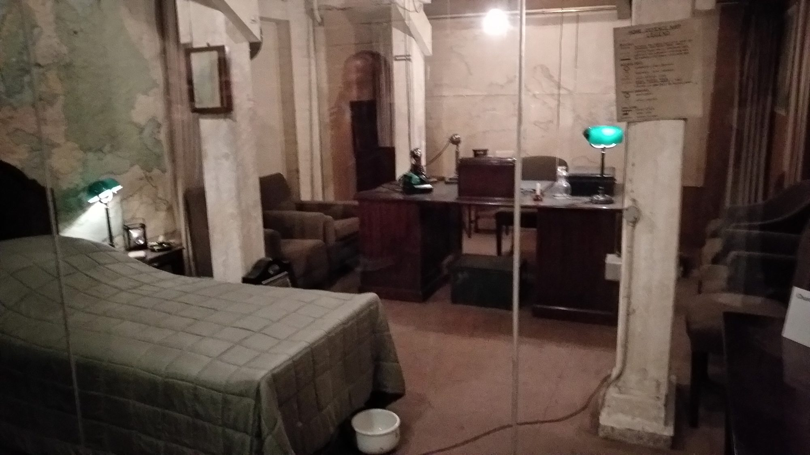
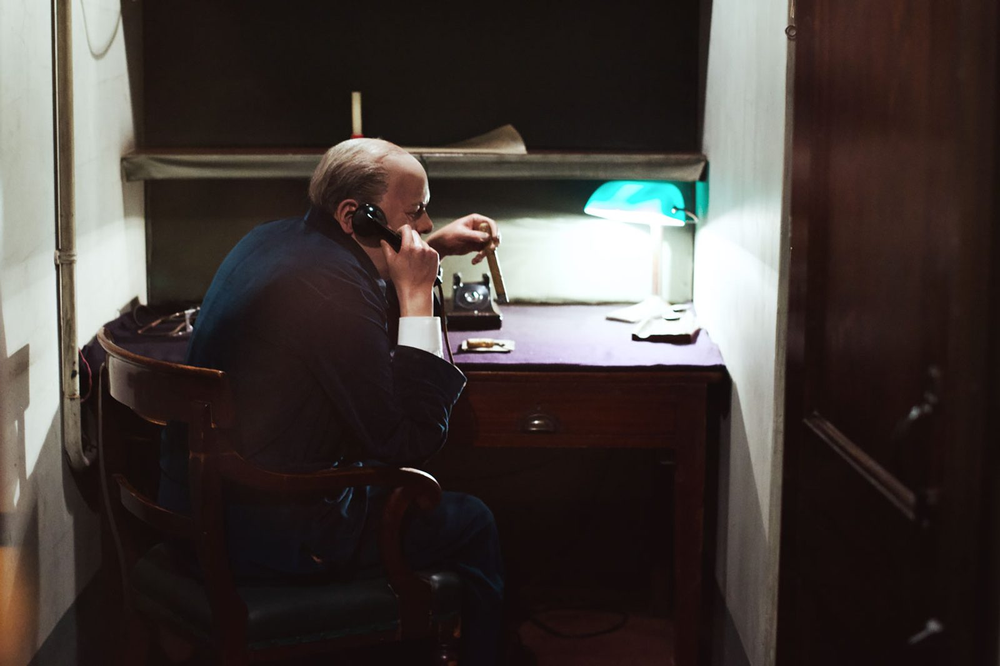
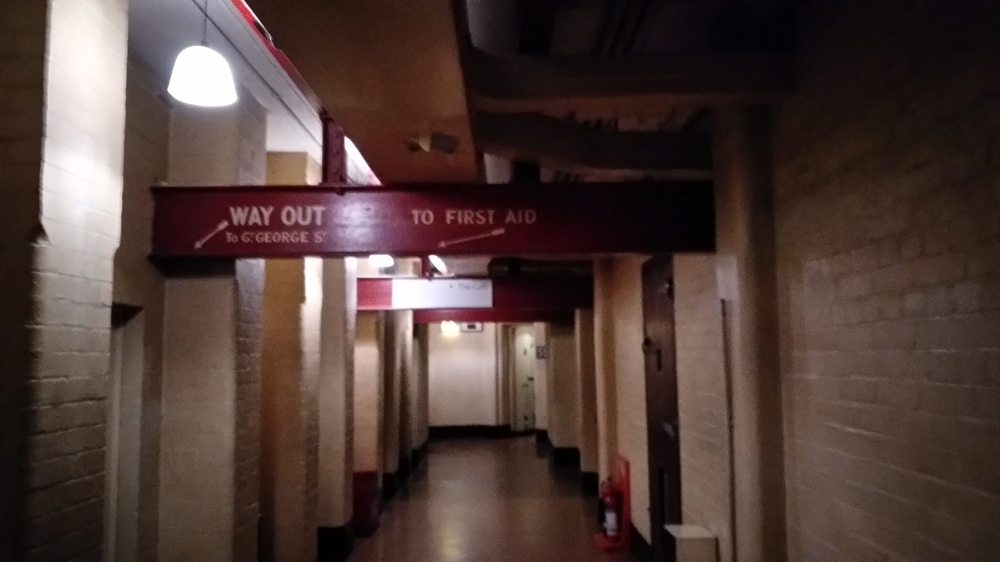

Fifteen steps beneath the pavements of Whitehall, behind blast-proof steel doors and a concrete slab up to three metres thick added in December 1940, sits the underground headquarters where Winston Churchill directed the British war effort.

Unlike most museum recreations, the Cabinet War Rooms are largely original. When the rooms went quiet on 16 August 1945, the lights were turned off, the Map Room was locked, and the entire subterranean complex was left untouched for decades. Today, pins still mark convoy positions on the Atlantic wall charts, pencil stubs sit beside blotters in the Cabinet Room, and Churchill's bedside cigar ash remains visible.

> 💡 **The Short Version:** Book a timed-entry slot online before you go — walk-up tickets are not guaranteed. **Adults pay £34, children (5–15) £17, concessions £30.60**, and under-5s and carers go free, one flat price with no donation add-on; **IWM members go free**. Every ticket already includes the **official audio guide**, so skip any third-party "exclusive audio tour". Churchill War Rooms is **not on The London Pass** or Go City. Allow **at least two hours** — IWM's own recommendation — for the historic rooms and the Churchill Museum.

---

## Tickets and prices

The Churchill War Rooms is operated by the **Imperial War Museums (IWM)**, an independent public charity.

Admission is by timed entry slot, from 9.30am with last entry at 5pm; the museum closes at 6pm.

| Ticket type | Price | Notes |
| --- | ---: | --- |
| Adult (16–64) | £34 | Includes the audio guide. |
| Child (5–15) | £17 | Must be accompanied by an adult. |
| Child (under 5) | Free | Still needs a ticket for headcount. |
| Concession (65+ / student / disabled) | £30.60 | Valid ID required on entry. |
| Carer | Free | One carer per disabled visitor. |
| IWM member | Free | Membership starts at £60 a year; members don't need to pre-book. |
| The London Pass / Go City | Not included | Buy a Churchill War Rooms ticket separately. |

*Prices are IWM's standard admission rates for 2 September 2026 to 31 March 2027, checked on iwm.org.uk and its ticketing system on 19 September 2026. There is one price per ticket type — IWM's booking system does not add a donation surcharge.*

### Booking a timed slot

Book directly through IWM, or through its official partner GetYourGuide, which sells the same timed-entry admission.

You can book a verified <a href="https://www.getyourguide.com/activity/-t926494?partner_id=WWP7I0R&amp;cmp=churchill-war-rooms-guide" target="_blank" rel="sponsored nofollow noopener" data-affiliate="gyg">Churchill War Rooms ticket on GetYourGuide</a>. Check real-time date availability using the calendar below:

Powered by <a target="_blank" rel="sponsored" href="https://www.getyourguide.com/london-l57/">GetYourGuide</a>

---

## The audio guide is free with admission

Every standard ticket includes IWM's own handheld audio guide, in thirteen languages: English, French, Spanish, German, Italian, Hebrew, Russian, Dutch, Polish, Portuguese, Mandarin, Swedish and Ukrainian. It also has a British Sign Language tour option with English captions, and an audio-described version.

Some resale platforms and tour operators sell "Churchill War Rooms with exclusive audio tour" packages, or bundle a Westminster walking tour with admission. These hand you the same standard-issue handset every ticket holder already gets — you would be paying again for something already included in the admission price above.

If you want a guided walk of Westminster, book one on its own merit, or follow our free [Westminster walking tour](/articles/westminster-walk/), then buy your War Rooms admission separately.

---

## Inside the bunker: the Cabinet Room, Map Room and Churchill Museum

The site divides into two connected parts: the preserved **Cabinet War Rooms** and the interactive **Churchill Museum**.

*The Cabinet War Room. The War Cabinet met here 115 times between 27 August 1939 and 16 August 1945, mostly during the Blitz and the later V-weapon attacks.*

### 1. The Cabinet Room
Directly past the entrance checkpoint lies the Cabinet Room. The room is arranged as a hollow square of tables surrounding Churchill's wooden armchair. Ministers sat facing each other on padded armchairs, while the Chiefs of Staff sat opposite Churchill, in a layout built for confrontation.

Churchill's chair sits at the centre of the table layout, identifiable by scratches on the wooden arms caused by his fingernails and ring during tense briefings. A red ministerial dispatch box sits on the table before him, alongside original inkwells, blotting paper, and ashtrays. The War Cabinet met here 115 times between the rooms becoming fully operational on 27 August 1939 and the Map Room going dark on 16 August 1945, most often during the Blitz and the later German V-weapon offensive.

*The Map Room. Sealed on 16 August 1945 following the surrender of Japan, the room retains its original wall charts, map pins, and colour-coded telephone lines.*

### 2. The Map Room
The Map Room was the operational nerve centre of the entire British Empire during the war, staffed around the clock by officers of the Royal Navy, British Army, and Royal Air Force.

When the bunker ceased operations on 16 August 1945, the officers packed their personal papers, turned off the ventilation, and locked the doors. The room stayed sealed until museum preparations began decades later.

Key details to examine:
- **The Global Convoy Map:** The immense map covering the main wall tracks merchant shipping convoys and U-boat concentrations across the North Atlantic, with tiny pinholes indicating daily movements.
- **The Colour-Coded Telephones:** On the central desk divider sits a row of rotary telephones. The green handset connected directly to No. 10 Downing Street; the red phone linked directly to the War Office, Admiralty, and Air Ministry; and the white handsets routed through military command switchboards.
- **The External Weather Indicator:** Because staff spent long hours below ground without daylight, a small wooden board indicated the current weather outside ("Sunny", "Rain", "Fog"), allowing officers to dress appropriately when surfacing.

*Churchill's underground bedroom. From this executive desk, Churchill made four wartime radio broadcasts to the British public via BBC microphone lines.*

### 3. Churchill's bedroom and desk (Room 64)
Room 64 was Churchill's personal underground bedroom and study. It contains a simple single bed covered with a plain quilt, a chamber pot, an executive writing desk, and a large map of the United Kingdom marked with coastal defence sectors.

Churchill was reluctant to sleep underground, declaring that he would not be "caged in a hole" while Londoners endured bombs above ground. He slept here only three times during the war, preferring his bed at 10 Downing Street or the reinforced No. 10 Annex on the ground floor of the Treasury building.

He used the desk itself constantly, for afternoon naps, private briefings, and wartime speeches. On the desk sits the BBC broadcast microphone from which he delivered four nationwide radio addresses to the British public.

*The Transatlantic Telephone Room. Disguised as a private toilet for Churchill's use only, this tiny cupboard housed a secret hotline to the White House.*

### 4. The Transatlantic Telephone Room (Room 60)
One of the most secret installations in wartime Britain was tucked inside Room 60: a cupboard made to look like a toilet, for Churchill's use only. Its existence was kept secret even from most of the people who worked in the bunker.

Inside sat a secure telephone extension connected to President Franklin D. Roosevelt in the White House, encrypted using **SIGSALY** — originally codenamed "Project X" — a voice-scrambling system built by Bell Telephone Laboratories. Speech was digitised, mixed with a randomly generated noise track, and sent by radio waves across the Atlantic, where a vocoder at the other end separated out the noise and reconstructed the voice.

The main SIGSALY terminal serving Britain sat in the sub-sub-basement of Selfridges department store on Oxford Street, operational from July 1943, with extensions to the US Embassy, Number 10 Downing Street and this cupboard in the War Rooms. Churchill and Roosevelt first spoke over the link in April 1944; senior military planners used the Selfridges terminal far more often, mostly to talk securely to Washington.

*The narrow reinforced corridors beneath the Treasury building.*

### 5. The Churchill Museum
Covering roughly half the site's footprint, the **Churchill Museum** is a modern, interactive biographical exhibition that opened in 2005.

Unlike the preserved bunker rooms, seen along narrow corridors, the museum occupies a wide central hall. Its centrepiece is an interactive digital timeline of Churchill's 90-year life.

Exhibits include:
- The velvet "siren suits" Churchill designed for quick dressing during night raids.
- Original wartime correspondence with Franklin D. Roosevelt and Joseph Stalin.
- Personal painting supplies and original oil landscapes created during his later years.

---

Powered by <a target="_blank" rel="sponsored" href="https://www.getyourguide.com/london-l57/">GetYourGuide</a>

## When to visit, and how long to allow

IWM says the quietest time to visit is the afternoon, after 3pm, though the site can still be busy with school and tour groups at any time of day. Visitors move through the preserved bunker rooms first, in a one-way route, then finish in the more open Churchill Museum.

Allow at least two hours — IWM's own recommendation — to see the Cabinet Room and Map Room on the audio guide at your own pace before taking your time in the Churchill Museum.

---

## Practical information and getting there

- **Where:** Clive Steps, King Charles Street, SW1A 2AQ.
- **Open:** 9.30am to 6pm daily, last entry 5pm.
- **Closed:** 24, 25 and 26 December.
- **Luggage:** no cloakroom, lockers or storage, and suitcases, wheeled luggage and large holdalls are not admitted.
- **Audio guide:** included in admission, in thirteen languages, with a British Sign Language tour option.

### Getting there by public transport
- **Underground:**
  - **Westminster station** (Jubilee, District, Circle lines) is a 6-minute walk (0.3 miles) west along Great George Street and Horse Guards Road.
  - **St James's Park station** (District, Circle lines) is a 7-minute walk (0.35 miles) north-east via Dartmouth Street and Birdcage Walk.
- **Buses:** Routes 11, 24, 87, 88, 148, 159, and 211 stop along Parliament Square and Whitehall, 4 minutes' walk from Clive Steps.
- **On foot:** The entrance is halfway down Clive Steps, connecting the west end of King Charles Street to Horse Guards Road on the edge of St James's Park.

### Accessibility
- Churchill War Rooms is wheelchair accessible, but IWM flags two pinch points on the route: the narrowest point is 68cm wide and the tightest corner turns 90 degrees. A lift carries visitors between street level and the bunker. Staff cannot push a visitor's wheelchair, so wheelchair users need to be self-propelled or supported by someone in their party.
- IWM lends manual wheelchairs free of charge, but they must be booked in advance on its wheelchair reservation page — they are not available on arrival.
- The audio guide carries an audio-described version and a British Sign Language tour option with English captions; large-print transcripts are available at the audio guide desk.

---

Powered by <a target="_blank" rel="sponsored" href="https://www.getyourguide.com/london-l57/">GetYourGuide</a>

## Continue planning your London trip

- 🏛️ **[Westminster Area Guide](/articles/westminster-area-guide/)** — Westminster Abbey, the Houses of Parliament, and historic pubs in SW1.
- 🚶 **[Westminster Walking Tour](/articles/westminster-walk/)** — step-by-step 4km route connecting the War Rooms with St James's Park and Whitehall.
- 🖼️ **[Best Museums in London](/articles/best-museums-london/)** — 17 compared, most of them free.
- 🎟️ **[The London Pass Guide](/articles/london-pass-guide/)** — which London attractions are included and how to calculate whether the pass pays off.
- 💷 **[London on a Budget](/articles/london-on-a-budget/)** — money-saving booking rules and free museums across Central London.
- 🚇 **[Getting Around London: Transport Guide](/articles/getting-around-london-transport-guide/)** — Tube fares, contactless payments, and bus navigation.
- ♿ **[Step-Free London](/articles/step-free-london/)** — the lift into the bunker, the 68cm pinch point, and step-free routes across the city.
