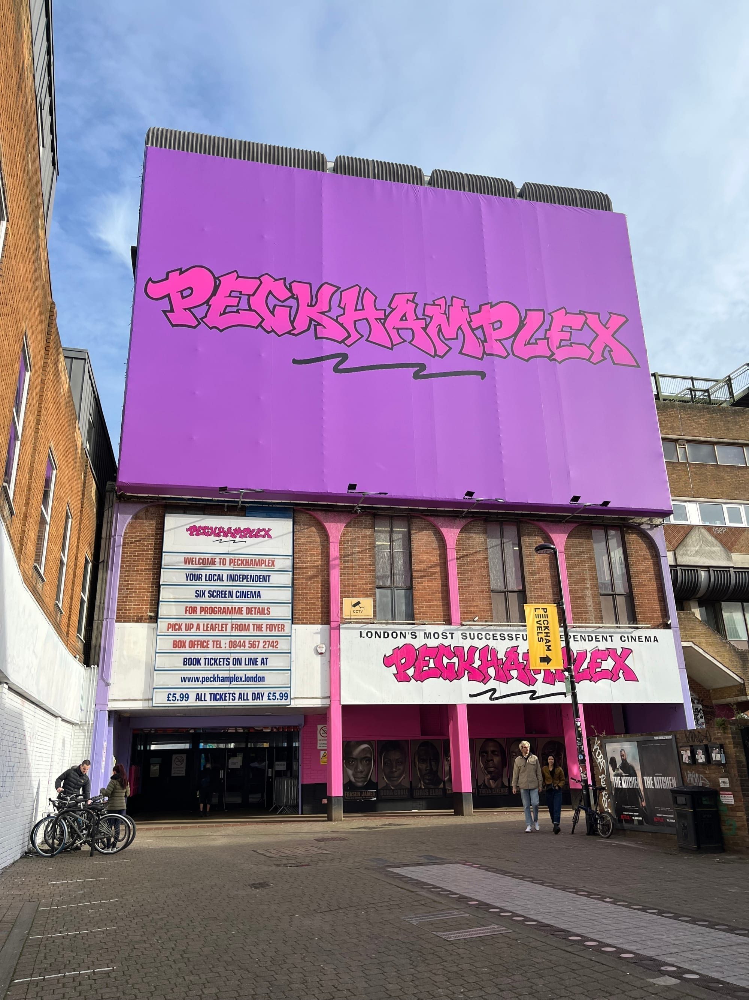

The same film, on the same evening, costs **£4.99 in Mile End and over £25 in Notting Hill**. Almost none of that difference is about the film.

This is a guide to paying the lower number. It covers every chain subscription, the memberships worth having, the partner deals that come through your phone network or your insurer, and the independents that quietly undercut all of them.

> 💡 **The Short Version:** Three things are free and most people miss them. **Meerkat Movies** now gives 2-for-1 cinema every Tuesday or Wednesday with **no purchase required** — just the Compare the Market app. If you are **16 to 25**, the under-25 schemes at **BFI (£4)**, **Picturehouse (£5.99)** and **Curzon** are free to join and beat every paid membership here. And the **CEA Card** costs £6.50 once and gets a disabled cinemagoer's companion in free. Beyond that: **under two films a month**, buy singles at **Genesis (£4.99 Mon–Wed)** or **Peckhamplex (£6.99)**. **Two or more**, a subscription wins. And **£15 at the Prince Charles** pays for itself in five visits.

---

## Start here: the free ones

These cost nothing, work across multiple chains, and are worth setting up before you consider paying for anything.

### Meerkat Movies — 2-for-1, no purchase needed

This is the best cinema deal in the country, and it changed recently in a way most people have not noticed. **You no longer need to buy insurance to get it.** Download the Compare the Market app, sign in, and a **2-for-1 cinema code** appears in the Rewards section.

- A **new code every week**, valid **Tuesdays or Wednesdays**
- Codes refresh every Thursday for the following week
- Two standard tickets, cheapest one free
- Redeemable online or at the box office
- Confirmed running **until 19 July 2027**

Participating cinemas are listed in the app. If you go to the cinema with another person even occasionally, this halves your cost for nothing.

### The CEA Card — £6.50, free companion ticket

The **CEA Card** is run by the UK Cinema Association and entitles a disabled cardholder to bring someone with them **free of charge** when buying a full-price ticket. It costs **£6.50** to apply.

It is accepted at essentially every chain in the country and is chronically under-claimed. Eligibility covers people who face barriers requiring assistance at the cinema, including sight or hearing loss, limited mobility, and neurodivergence. If it applies to you or someone you go with, it repays itself on the first visit.

---

## If you are under 25, read this first

**The under-25 schemes are the largest discounts in London cinema, and every one of them is free to join.** No paid membership beats them.

| Scheme | Cost to join | What you pay |
| --- | --- | --- |
| **BFI 25 & Under** | Free, ages 16–25 | **£4** at BFI Southbank any time, or **£6** at BFI festivals including the London Film Festival |
| **Picturehouse U25** | Free, ages 16–25 | **£5.99** all day Monday to Thursday |
| **Curzon Under 25** | Free | Discounted tickets all week |
| **ODEON myLIMITLESS Plus** | Student rate | **£15.99/month** — 20% off the usual price, verified through Student Beans |

BFI at £4 is the strongest of these — a full repertory programme, no day-of-week restriction. Picturehouse U25 at £5.99 covers most of the week at cinemas that would otherwise charge two or three times that.

---

## The cheapest tickets in London

For anyone paying per film with no membership, these are the numbers that matter.

| Cinema | Price | Conditions |
| --- | --- | --- |
| **Genesis**, Mile End | **£4.99** | Monday to Wednesday — adults, children, students and over-60s alike |
| **Genesis**, Mile End | £7.75 | Thursday |
| **Peckhamplex**, Peckham | **£6.99** + 60p booking fee | Any day, any time |
| **Prince Charles**, Leicester Square | £8 member / £11 non-member | Weekday matinee |
| **Genesis**, Mile End | £12 | Friday to Sunday |
| **Vue** | from £2.49 | Booked online, varies by site and screening |

Genesis is the cheapest standard adult ticket in London from Monday to Wednesday, and unusually the price is flat across every category — there is no cheaper concession because there does not need to be. Its weekend price of £12 is a different proposition, so the cheap window is genuinely Monday to Wednesday.

*Peckhamplex has been south London's cheap cinema for years, though the headline price has crept up — it is £6.99 plus a 60p booking fee now, not the £5.99 still painted on the board.*

---

Powered by <a target="_blank" rel="sponsored" href="https://www.getyourguide.com/london-l57/">GetYourGuide</a>

## Unlimited subscriptions compared

Monthly passes for people who go often. The break-even is roughly the same for all of them: **two films a month**.

| Scheme | Cost | What you get | Minimum term |
| --- | --- | --- | --- |
| **Cineworld Unlimited** | £12.99–£22.99/month | Unlimited films. Four price groups by cinema — Group 4 at £22.99 is the only one covering all sites | 3 months |
| **ODEON myLIMITLESS** | £16.99/month | Unlimited standard 2D. Luxe cinemas cost £3 extra per visit, £5 at Islington | 3 months |
| **ODEON myLIMITLESS Plus** | £19.99/month | Adds Luxe access, iSense, 3D and premium recliner seats at no extra charge | 3 months |
| **Curzon Cult** | £25/month or £285/year | Curzon's own wording is "7 free tickets a week", in cinemas or on Curzon Home Cinema | — |
| **Everyman Everywhere** | £59/month or £680/year | "Unlimited film for a year", two tickets per show | — |

**Cineworld's group system is the catch for Londoners.** The £12.99 headline covers selected cinemas only; the tiers rise through £17.99 and £19.99 to £22.99, and only the top tier is described as including all cinemas. Check which group your local sits in before assuming the cheap price applies — West End sites sit at the expensive end. IMAX, 4DX and ScreenX cost extra on top at every tier.

**ODEON is the simpler proposition** at £16.99, but the standard tier charges £3 per visit at Luxe cinemas, which covers much of its London premium estate. If you are a West End regular, myLIMITLESS Plus at £19.99 is the honest comparison, not £16.99. Both tiers cap you at four tickets per booking with bookings at least 90 minutes apart, and exclude event cinema, premieres and festivals.

**Curzon Cult at £25 a month is the outlier worth noticing.** Curzon is a premium art-house chain where single tickets run well into the teens, and this is much the cheapest route into it. It also covers Curzon Home Cinema, so it doubles as a streaming subscription.

---

## Annual memberships compared

These are not unlimited. You pay once a year for a bundle of free tickets plus a standing discount — better suited to regular-but-not-frequent viewers.

| Membership | Cost | Free tickets | Notable extras |
| --- | --- | --- | --- |
| **Prince Charles Cinema** | **£15/year**, or **£60 for life** | — | At least £2.50 off every ticket, £8 weekday matinees, regular £1 member screenings |
| **BFI** | £44/year (direct debit, paper-free) | 2 | Up to £2.50 off, priority festival booking |
| **Curzon Classic** | from £55/year | 5 | Usable in cinemas or on Home Cinema |
| **Picturehouse Member** (London) | £75/year | 5 | Excludes Picturehouse Central |
| **Everyman** | £95/year | 6 | **Bring a guest free every Monday and Tuesday** |
| **Picturehouse Member** (West End) | £100/year | 5 | Includes Picturehouse Central and its Members' Bar |
| **Picturehouse Member Plus** (London) | £120/year | 10 | Guests at member prices |
| **Picturehouse Member Plus** (West End) | £185/year | 10 | Includes Central, plus roof terrace access |
| **Everyicon** | £350/year or £31/month | 24 | Guest free Mondays and Tuesdays |

**The Prince Charles is the standout, and it is not close.** £15 a year against a saving of £2.50–£3 on every ticket — members pay £8 for a weekday matinee where non-members pay £11, and £11.50 in the evening against £14.50. Five or six visits and it has paid for itself, before you count the regular **£1 member screenings**. The **£60 lifetime** option pays back in roughly twenty visits and then never costs anything again.

**Everyman's guest perk is the hidden value.** £95 buys six tickets, which is unremarkable, but bringing a guest free every Monday and Tuesday effectively halves the price of every visit on those days for as long as you hold it.

**Picturehouse's London and West End split matters.** The cheaper London tier explicitly excludes Picturehouse Central in the West End. If Central is the one you would actually use, it is £100 rather than £75, or £185 rather than £120 at the Plus tier.

---

## Deals through other companies

Several of these come attached to things you may already pay for.

| Provider | Offer | Where |
| --- | --- | --- |
| **Compare the Market** | 2-for-1, Tuesdays or Wednesdays, **no purchase needed** | Participating cinemas, listed in app |
| **O2 Priority** | **Two tickets for £9, or four for £18**, any day — plus 20% off food and drink | Any UK Vue |
| **Sky Cinema** | **Two free tickets every month** | Vue |
| **Vitality** | A free ticket, valid any day | Vue, for health and life insurance customers |
| **Student Beans** | 20% off ODEON myLIMITLESS Plus, taking it to £15.99/month | ODEON |

**O2 Priority is the best of these if you are on O2.** Four tickets for £18 is £4.50 each with no day restriction — competitive with Genesis's cheap-day price, at a chain, any day of the week.

**Sky Cinema's two free Vue tickets a month** is worth checking if you already subscribe. That is 24 films a year at no additional cost, which quietly outperforms most paid memberships on this page.

---

## So which one is actually best?

It depends on how often you go, which is the only sensible way to answer it.

**A few times a year.** Do not buy anything. Set up **Meerkat Movies** for free 2-for-1 on Tuesdays and Wednesdays, and use **Genesis (£4.99 Mon–Wed)** or **Peckhamplex (£6.99)** for single tickets. If you are on O2, **four Vue tickets for £18** covers a group outing better than anything else here.

**Once a month, at the same cinema.** Still not a subscription — you would not clear the break-even. Buy a **Prince Charles membership at £15** if you are ever in the West End, because it repays in five visits and includes the £1 screenings. Otherwise keep using the free schemes.

**Two or more films a month.** Now a subscription wins. **ODEON myLIMITLESS Plus at £19.99** is the most predictable — no group system, no per-visit surcharges. **Cineworld** is cheaper if your local sits in a low group and more expensive if it does not, so check before committing. Both lock you in for three months.

**Two or more a month, and you care what is showing.** **Curzon Cult at £25** is the best value on this page for anyone who watches art-house, foreign-language and independent film. It covers a premium chain and Curzon Home Cinema for barely more than a mainstream multiplex pass.

**You are 16 to 25.** Ignore all of the above. **BFI at £4** and **Picturehouse U25 at £5.99** beat every subscription here on price, with no commitment and nothing to cancel. You would need to see five or six films a month before a paid unlimited card made more sense.

**You go with someone who needs support.** The **CEA Card at £6.50** is the first thing to sort out, whatever else you do.

---

Powered by <a target="_blank" rel="sponsored" href="https://www.getyourguide.com/london-l57/">GetYourGuide</a>

## Continue planning your London trip

- 🎬 **[London's Best Independent Cinemas](/articles/best-cinemas-london/)**
- 🎞️ **[BFI London Film Festival: Dates and Tickets](/articles/london-film-festival/)**
- 💷 **[London on a Budget](/articles/london-on-a-budget/)**
- 🎪 **[Free Things to Do in London](/free/)**

---

*Prices verified on each operator's own site in August 2026. Cinema pricing moves — check before committing to anything with a minimum term.*
