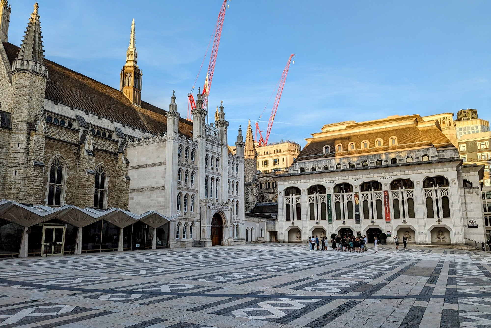
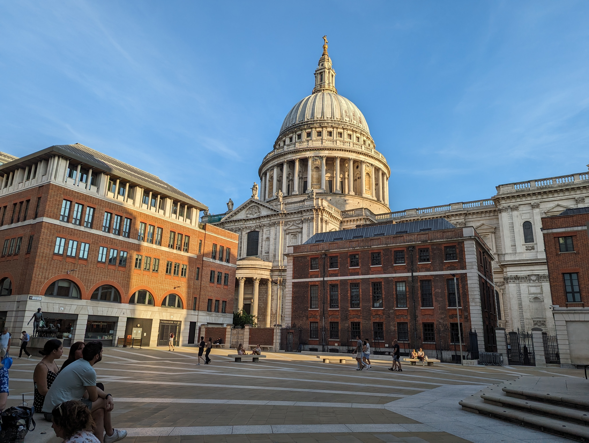
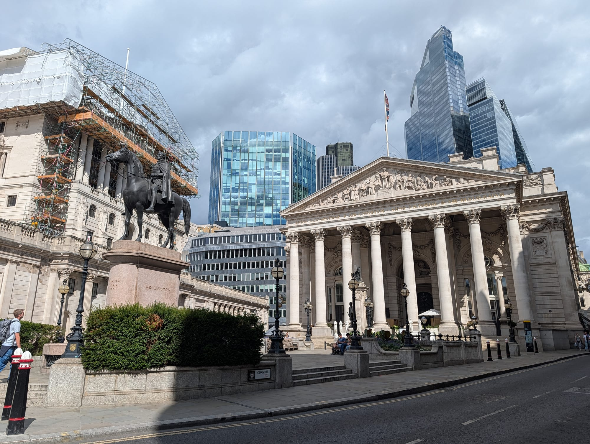
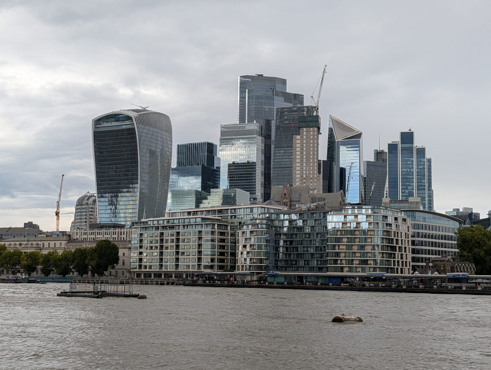
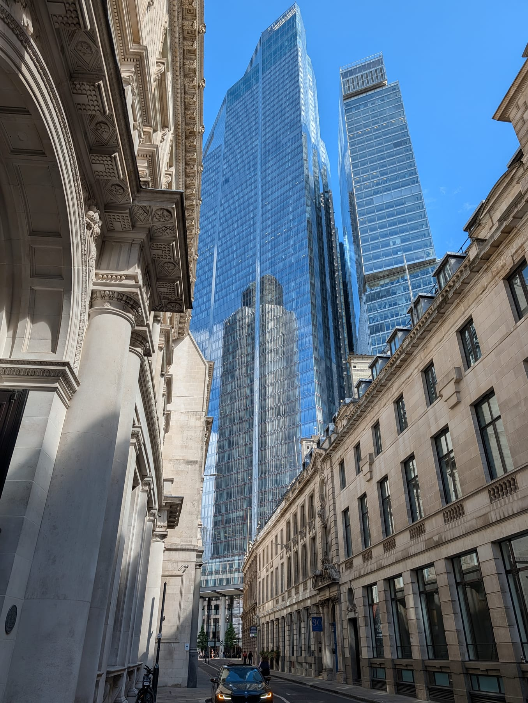
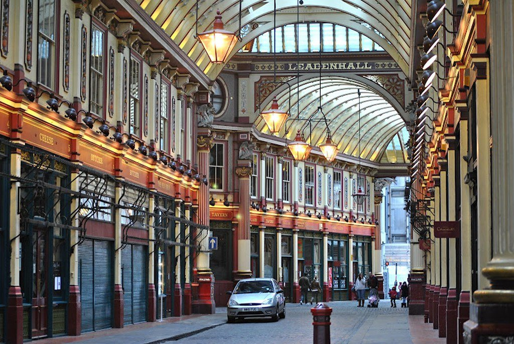

The City of London is the original city: a square mile on the Roman street plan, still a separate authority with its own Lord Mayor and police force, and now the densest cluster of tall buildings in Britain.

It is also the strangest place in London to visit, because roughly half a million people work here and only about eight thousand live here. On a weekday it is a crush. On a Sunday morning you can stand in the middle of a medieval street and hear nothing.

The City of London has its own share of the commemorative plaques marking where notable people lived or worked - see them on our [interactive map](/plaques/?area=city-of-london).

## Why visit — and who should skip it

**Come here if** you want history stacked on history — a Wren cathedral, a Norman keep, fragments of Roman wall, and glass towers built over all of it. It also has the two best free viewpoints in London.

**Skip it if** you want to eat or drink casually at the weekend. The City empties on Saturdays and Sundays, and much of it closes with the offices. Come on a weekday for atmosphere, or a weekend specifically for the emptiness — but bring a plan for lunch.

## Top sights and activities

1. **St Paul's Cathedral** — Wren's 1710 dome, and the 528-step climb to the Golden Gallery via the Whispering Gallery. Sightseeing is ticketed; **Evensong is free** and lets you sit in the quire.
2. **Tower of London** — A Norman fortress begun in 1066, the Crown Jewels, the Yeoman Warders and the ravens. Book ahead and arrive at opening.
3. **Tower Bridge** — The 1894 bascule bridge beside the Tower, and the one most people mistake for London Bridge. **Walking across it is free.** The ticketed Exhibition adds the high-level walkways, the glass floor over the road and the Victorian engine rooms. Lift times are published in advance, and watching it open costs nothing.
4. **Horizon 22** — Level 58 of 22 Bishopsgate and the highest free viewing floor in Europe. Book a slot online.
5. **Sky Garden** — The planted terrace at the top of 20 Fenchurch Street, the "Walkie-Talkie". Free with booking.
6. **Leadenhall Market** — A painted Victorian arcade of 1881, used as Diagon Alley in the first Harry Potter film. Best on a weekday when the traders are open.
7. **The Roman remains** — The London Wall at Tower Hill and Noble Street, the Temple of Mithras rebuilt in situ beneath Bloomberg's building (free, booked), and the amphitheatre under the Guildhall Art Gallery.
8. **The Wren churches** — Around 50 were built after the Great Fire; roughly half survive. St Stephen Walbrook, St Mary-le-Bow and St Bartholomew the Great are the best, and all are free.

*Guildhall Yard. The paving traces the outline of the Roman amphitheatre buried beneath it — the real remains are inside the gallery, free to visit.*

*St Paul's over Paternoster Square. The square was flattened in the Blitz and rebuilt twice — what is there now dates from 2003.*

*Bank junction. Eight streets meet here, with the Royal Exchange's portico on one corner and the Bank of England on another.*

*The tower cluster from the south bank. Almost all of it has gone up since 2010, and Leadenhall Market sits at the foot of it.*

Powered by <a target="_blank" rel="sponsored" href="https://www.getyourguide.com/london-l57/">GetYourGuide</a>

## Key streets and micro-districts

### St Paul's and Paternoster Square

The cathedral, the square behind it, and the shopping centre opposite that most visitors walk past without realising what is on its roof.

**St Paul's is £27 for an adult**, which includes the floor, the crypt and all three dome galleries. The climb to the Golden Gallery is **528 steps with no lift at any point** — 257 to the Whispering Gallery, 376 to the Stone, 528 to the top — and the cathedral itself advises against it for anyone with mobility difficulties. **Monday to Saturday only** for sightseeing; services are free to attend.

**The roof terrace at One New Change is free**, has no ticket and no queue, and gives you the dome at close range from a bar-height parapet. It is the single best free thing in this part of the City, and it is directly opposite. Looking *at* St Paul's costs nothing; climbing it costs £27.

**Paternoster Square** behind the cathedral is a modern pedestrian square with the Temple Bar gateway on one corner, Wren's 1670s arch moved here from the Strand in 2004. **Sweetings at 39 Queen Victoria Street** is the Victorian fish restaurant nearby — lunch only, weekdays only, no bookings.

### Bank and the Royal Exchange

Seven roads meeting at once, with the **Bank of England**, the **Royal Exchange** and **Mansion House** on three corners of the junction. It is the most concentrated piece of imperial architecture in Britain and it is also a working traffic interchange, so give yourself a moment to look up.

**The Royal Exchange is open and free to walk into** — Victorian courtyard, mosaic floor, now luxury shops around a central bar. Nobody will stop you.

**The Bank of England Museum is free**, entered from Bartholomew Lane round the side, and it lets you lift a real gold bar. **Weekdays only, closed at weekends and bank holidays**, which is the trap here — this whole district shuts on a Saturday.

**Royal Exchange Buildings**, the alley behind, is where the snowy kiss at the end of *Bridget Jones's Diary* was filmed. **Bloomberg Arcade** two minutes south has the modern eating, including **Brigadiers** for Indian barbecue, and the **London Mithraeum** beneath it — a reconstructed Roman temple, free, but pre-booked.

Bank station is directly underneath and has been substantially rebuilt, so exits are not where older maps put them.

### Leadenhall and the tower cluster

**Leadenhall Market** sitting directly beneath 22 Bishopsgate, with the Gherkin, the Cheesegrater and the Scalpel within two streets. The most dramatic street-level contrast in London, and the reason to walk this bit rather than ride through it.

**The market is free, roofed and open to walk through**, which makes it the best wet-weather ten minutes in the City. It played **Diagon Alley** in the first Harry Potter film, and the blue door used as the Leaky Cauldron entrance belongs to what is now an opticians on Bull's Head Passage.

**It keeps City hours.** The shops and bars trade Monday to Friday and it is close to dead on a Sunday, so come on a weekday — around six in the evening is when it is fullest and best.

**Three viewpoints are within five minutes, and two are free.** **Horizon 22** on level 58 is the highest public view in London and costs nothing, though it needs a timed ticket and is fully enclosed. **The Lookout at 8 Bishopsgate** is also free and runs to 9pm on Mondays and Fridays. **Sky Garden** is free with a ticket released three weeks ahead, with paid walk-in slots from £11.50 if you have missed them.

For eating up high, **Duck & Waffle at 110 Bishopsgate is open 24 hours** — the only London viewpoint you can use at four in the morning.

*This is the best few streets in London for old against new. The City never zoned its towers into a separate district, so a Victorian banking hall and a 62-storey tower end up on the same pavement — look up anywhere between Leadenhall Street and Bishopsgate and you get both in one frame.*

### Tower Hill and the riverside

The **Tower of London**, the best surviving stretch of the **Roman city wall** — right beside Tower Hill station, free and unfenced — and the approach to Tower Bridge.

**Almost all of the view is free.** The Tower is expensive and busiest between 11am and 3pm, but the moat, the wharf and the riverside pavement cost nothing, and the **upstream pavement on Tower Bridge** is the officially designated viewpoint: the Tower, St Paul's, The Monument and HMS Belfast in one sweep.

**The Tower Bridge Exhibition is £18**, one adult rate with no seasonal tier, open daily 9.30am to 6pm with last entry at 5pm. It buys you the glass floors 43.5 metres up and the Victorian engine rooms, and there is **lift access to both** — it is not a stairs-only climb. Residents of the City, Southwark or Tower Hamlets pay **£1** with proof.

**Bridge lift times are published** at towerbridge.org.uk/bridge-lifts and updated daily, so you can watch it open for free.

This is the one part of the City that is busy at weekends, and the only part where the crowd is tourists rather than workers.

### Smithfield and Barbican

The north-west edge, and the most atmospheric corner of the City. **Smithfield** has been a livestock and meat market for over eight hundred years, and the Victorian market buildings are being converted into the new **London Museum** — a major change to this district, not yet open.

**St Bartholomew the Great** is the reason to come. Founded in 1123, it is the oldest surviving parish church in London, and its Norman interior has stood in for St Paul's in *Sherlock Holmes* and appeared in *Four Weddings* and *Shakespeare in Love*. There is a small admission charge for sightseers and none for worship, and it closes to visitors during services.

**The Barbican** is next door: a brutalist estate of concrete towers, raised walkways and a lake, with an arts centre at its heart. **The Curve gallery is free**, the main Art Gallery is ticketed, and finding the entrance is genuinely difficult — **follow the yellow line painted on the pavement** from Barbican station rather than trusting a map.

**Ye Olde Cheshire Cheese** on Fleet Street, rebuilt in 1667 after the Great Fire, is ten minutes west and worth the walk for the warren of dark rooms alone.

*Leadenhall Market, rebuilt in 1881 on a site that has traded since the Roman forum stood here. It played Diagon Alley in the first Harry Potter film.*

## Where to eat and drink

| Spot | Style | Price | Why go |
| --- | --- | --- | --- |
| **Leadenhall Market** | Pubs and cafes | ££ | Under the painted arcade; City hours, so best on a weekday |
| **St. JOHN Smithfield** | British nose-to-tail | £££ | Bone marrow and eccles cakes; a genuine institution |
| **Ye Olde Cheshire Cheese** | Historic pub | ££ | Rebuilt 1667, off Fleet Street, a warren of dark rooms |
| **The Blackfriar** | Art nouveau pub | ££ | Extraordinary 1905 interior by Blackfriars station |
| **One New Change** | Food court | ££ | Reliable at weekends when everything else is shut |
| **Borough Market** | Food market | £ | Ten minutes over London Bridge when the City closes |

## Getting there

**By Tube.** Four useful stations. **St Paul's** (Central) for the cathedral, **Bank** (Central, Northern, Waterloo & City, DLR) for the middle, **Liverpool Street** (Elizabeth line and four others) for the north-east, **Tower Hill** (District, Circle) for the Tower.

**Best exit.** At Bank, use **Exit 9** for the Royal Exchange and the Bank of England — the station is a warren with a dozen exits and it is easy to surface facing the wrong way.

**On foot.** Five minutes over the Millennium Bridge to Tate Modern, fifteen north to Shoreditch. The DLR from Bank or Tower Gateway reaches Canary Wharf in about fifteen minutes.

## How long to spend, and when to go

| If you have | Do this |
| --- | --- |
| **Two hours** | St Paul's exterior, Leadenhall Market and the tower cluster |
| **Half a day** | Add the Tower of London, or St Paul's dome climb |
| **A full day** | Both, plus a free viewpoint and the Roman remains |

**Best time:** Weekday mornings for atmosphere and open pubs. Early Sunday morning for photography with empty streets.

**Book ahead:** Tower of London, Horizon 22, Sky Garden and the Temple of Mithras all need booking, and the free ones go fastest.

## Suggested three-hour walking route

1. **Start:** St Paul's station. **St Paul's Cathedral** and Paternoster Square.
2. **One New Change:** The free roof terrace for the close view of the dome.
3. **Bank:** East along Cheapside past **St Mary-le-Bow** to the **Royal Exchange**.
4. **Leadenhall Market:** South-east under the painted arcade.
5. **Tower Hill:** Down to the **Roman wall** and the **Tower of London**.
6. **Finish:** **Tower Bridge**, or north to Shoreditch for the evening.

## Common mistakes to avoid

1. **Coming at the weekend without a food plan.** Much of the City shuts. One New Change and Borough Market are the reliable fallbacks.
2. **Not booking the free viewpoints.** Horizon 22 and the Sky Garden cost nothing but both require a slot booked weeks ahead.
3. **Arriving at the Tower mid-morning.** Go at opening and see the Crown Jewels first.
4. **Paying to enter St Paul's just to see inside.** Evensong is free daily and you sit in the quire.
5. **Getting lost at Bank station.** A dozen exits across a large junction. Check which one you want before you surface.
6. **Trying to walk to Canary Wharf.** It is much further than it looks. Take the DLR from Bank.

Powered by <a target="_blank" rel="sponsored" href="https://www.getyourguide.com/london-l57/">GetYourGuide</a>

## Where to stay

Excellent transport and good weekend rates, with the caveat that the area is dead at night.

- **Liverpool Street and Aldgate** — The main hotel cluster, walkable to Shoreditch for the evening.
- **Barbican and Smithfield** — Quieter, near the arts centre, good for Farringdon and the Elizabeth line.
- **Tower Hill** — Convenient for the Tower and the river, and connected to the South Bank on foot.
