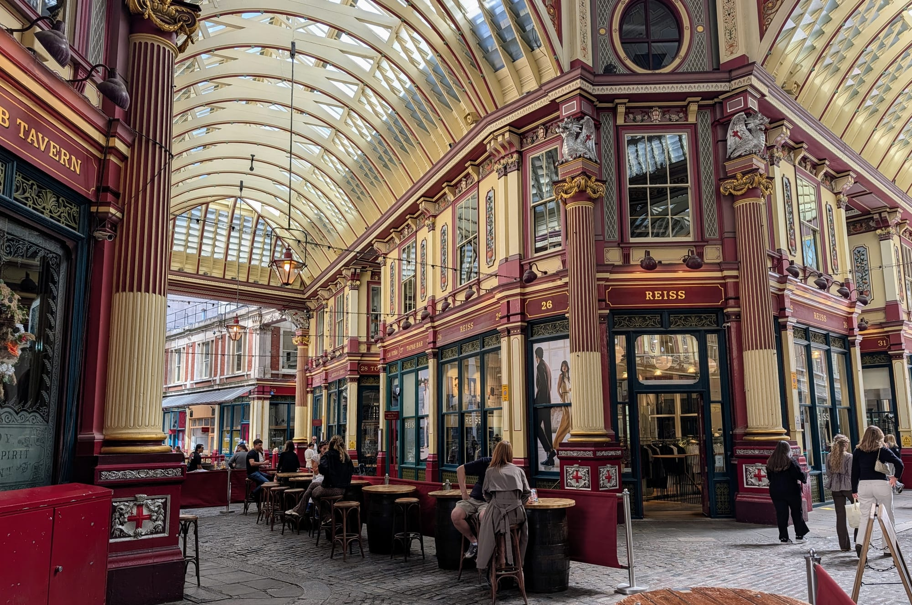
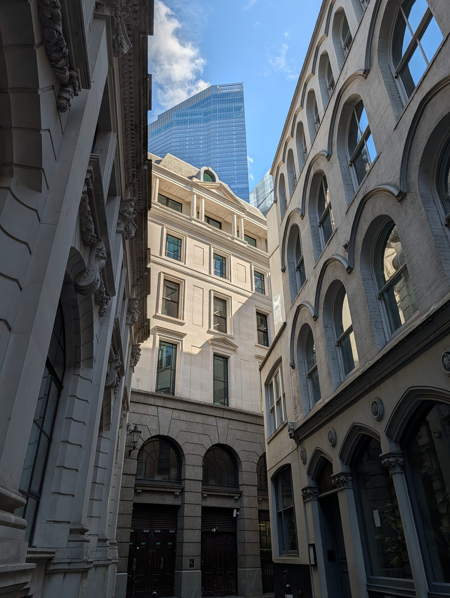
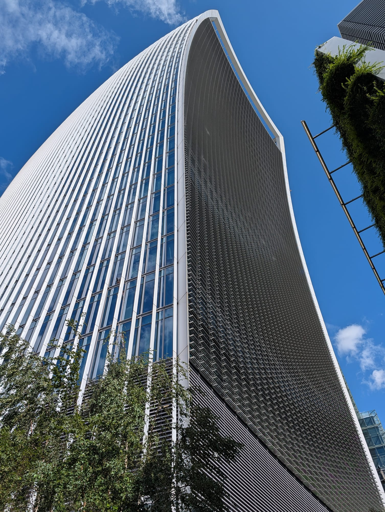
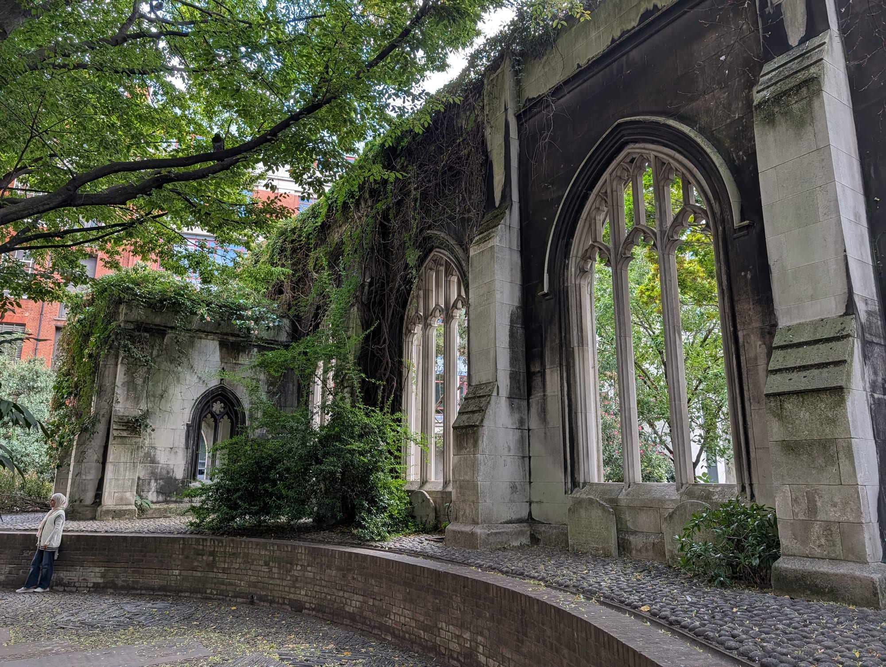
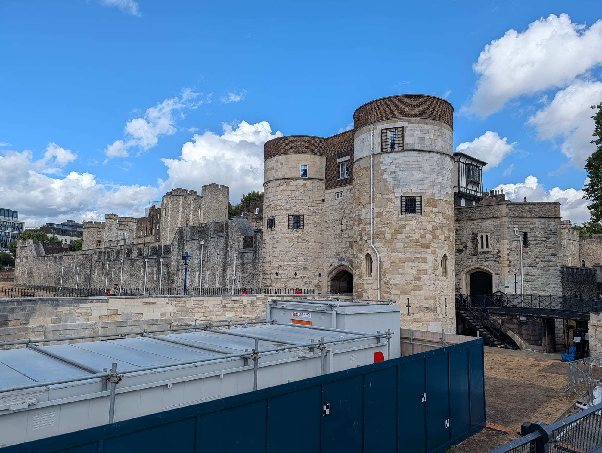
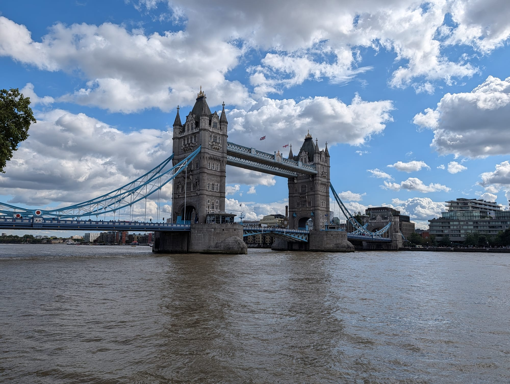
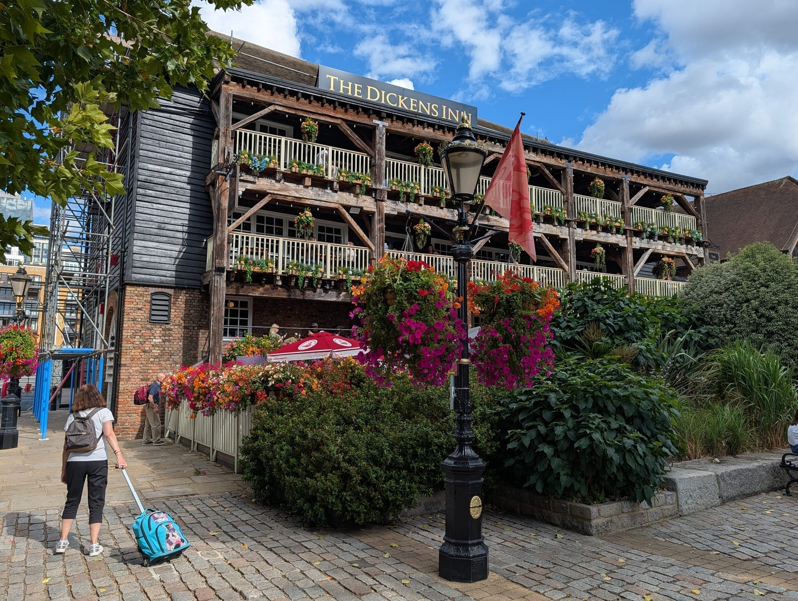
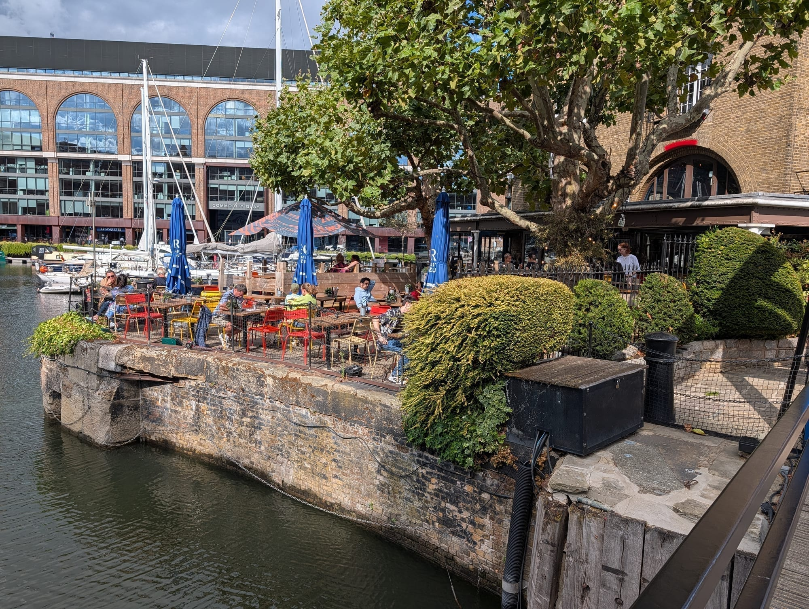

Most people see the City of London backwards. They come out at Tower Hill, do the Tower, photograph Tower Bridge and leave — which means they see the two things the Square Mile shares with every guidebook and none of the things that make it strange.

**This walk runs the other way.** It starts at Bank, the junction the whole City was laid out around, and works east and south through the market, the tower cluster, a free view from the 58th floor and a bombed church that was left as a ruin and planted as a garden. The Tower and Tower Bridge come at the end, as the payoff rather than the opening.

It is about **3km and takes two to three hours** with stops. All of it is free except the Tower of London and, if you want it, the Monument.

For the wider area — St Paul's, Smithfield, the Roman remains, where to stay — see the [City of London area guide](/articles/city-of-london-area-guide/). This is the walking route version of it.

> 💡 **The Short Version:** Go on a **weekday**, ideally Tuesday to Thursday. Start at **Bank** — go inside the **Royal Exchange**, which is free and which most people walk past — and finish at **Tower Bridge**. The unmissable stop is **St Dunstan-in-the-East**, a bombed church turned garden, and it is free. For the view, book **Horizon 22** — free, level 58, and the highest free platform in London — or walk into **The Garden at 120** with no booking at all. Eat at **Leadenhall Market** in the middle or **St Katharine Docks** at the end.

## The route

  

    Map of the walk, numbered in walking order
  

  

    
Loading the map…

  

  

    <i class="route-map-marker" aria-hidden="true">1</i> On the route, in walking order
    <i class="route-map-marker route-map-marker--alt" aria-hidden="true">5</i> Alternatives — pick one
  

  <noscript>
    
The map needs JavaScript. Every stop below is numbered in walking order with its nearest station.

  </noscript>

**[Open the whole route in Google Maps →](https://www.google.com/maps/dir/?api=1&origin=51.51343,-0.086975&destination=51.506541,-0.07165&waypoints=51.514467,-0.087621%7C51.512728,-0.083395%7C51.512965,-0.082407%7C51.514478,-0.082973%7C51.510946,-0.086449%7C51.509678,-0.082496%7C51.509394,-0.079301%7C51.508217,-0.076188%7C51.505517,-0.075366&travelmode=walking)** — all eleven stops in walking order, set to walking directions, which is the version to put on your phone.

| # | Stop | Cost | Open |
| --- | --- | --- | --- |
| **1** | Bank junction & Royal Exchange | Free | Streets always; interior weekdays |
| **2** | Bank of England Museum | Free | **Weekdays only** |
| **3** | Leadenhall Market | Free | Lanes always; traders weekdays |
| **4** | The tower cluster | Free | Always |
| **5** | A view from the top | Free | Varies — see below |
| **6** | The Monument | Ticket | Daily |
| **7** | St Dunstan-in-the-East | Free | Daylight hours |
| **8** | All Hallows by the Tower | Free | Seven days |
| **9** | Tower of London | **Ticket** | Daily from 9am, 10am Sun–Mon |
| **10** | Tower Bridge | Free to cross | Always |
| **11** | St Katharine Docks | Free | Seven days |

---

## 1. Bank junction

*Wellington on the left, the Royal Exchange on the right, and 22 Bishopsgate behind. The Bank of England is under scaffolding at the moment, which is the one thing here that will look different when you arrive.*

**Seven streets meet here and no two of them agree on a right angle.** That is the whole City in one junction: a medieval street plan that was never straightened, with neoclassical banking wrapped around it and glass towers behind.

Stand with your back to Bank station's Royal Exchange exit and you have the **Royal Exchange** portico in front of you, the windowless wall of the **Bank of England** to the left, and **Mansion House**, where the Lord Mayor lives, to the right. The Bank's outer wall has no ground-floor windows anywhere along its length — it was built to be defensible, and it still reads that way.

**Go inside the Royal Exchange** — most people photograph the portico and walk on, which is a mistake, because the interior is the best free thing at this end of the walk.

It was founded by the merchant **Sir Thomas Gresham** and opened by **Elizabeth I in 1571** as London's first purpose-built centre of commerce: a courtyard where merchants met to trade, modelled on the bourse at Antwerp. It burned down in the Great Fire, was rebuilt, and burned again — the building you are standing in front of is the **third**, by Sir William Tite, opened by Queen Victoria in 1844.

It stopped being an exchange long ago. What it is now is a **covered courtyard of shops and restaurants under a glass roof**, ringed by two storeys of colonnade, with a bar in the middle of the floor where the trading once happened. **Walking in costs nothing** and takes two minutes, and the ceiling is worth the detour on its own. The shops and the bar keep their own hours and, like everything else here, they are a weekday trade.

> ⚠️ **Bank station has a dozen exits** spread across a very large junction. Follow signs for the Royal Exchange rather than surfacing at random and working out where you are.

## 2. The Bank of England Museum

Round the corner on **Bartholomew Lane**, and the single strongest argument for walking this route on a weekday.

It is **free**, it is genuinely good — the gold bar you can try to lift is the exhibit everyone remembers, and the collection runs from Roman-era foundations to the machinery of modern monetary policy — and it is **open Monday to Friday only, 10am to 5pm, last entry 4.30pm**. It closes at weekends and on bank holidays. On the third Thursday of the month it stays open late, until 8pm.

If you are walking at a weekend, this stop simply is not available, and no amount of planning gets around it.

## 3. Leadenhall Market

*The Lamb Tavern on the left, and the barrel tables that fill from about noon on a weekday. This is a Sunday-empty room the rest of the time.*

**A covered Victorian market in maroon and green ironwork**, built by Horace Jones in 1881 on a site that has been a market since the fourteenth century. It is the prettiest interior on this walk and it takes about four minutes to see, which is why nobody minds the detour.

The lanes are **public and open around the clock** — you can walk through at midnight. The shops, pubs and restaurants inside keep their own hours and most of them are a **weekday business**, so a Sunday visit gets you the architecture and a closed shutter.

It is also the reason to time this walk around lunch: see the eating section below.

> ⚠️ **Scaffolding is currently up** for essential maintenance. The market is fully open and you can walk it as normal, but the photograph you have seen is not quite the photograph you will get.

Powered by <a target="_blank" rel="sponsored" href="https://www.getyourguide.com/london-l57/">GetYourGuide</a>

## 4. The tower cluster

*The whole argument for walking rather than taking the tube between stops: the alleys are medieval in plan, the walls are Victorian, and the thing filling the sky was finished in 2020.*

Step out of the market's east exit and the towers are directly overhead. This is not a stop so much as **two hundred metres of looking up**.

The **Lloyd's building** is the one to actually stand under. Richard Rogers put the lifts, the stairs, the ducts and the lavatory pods on the outside so the floors inside could be cleared and rearranged — the same idea as the Pompidou Centre, applied to an insurance market. It was Grade I listed in 2011, at twenty-five years old, which made it the youngest building ever to get that protection.

Around it: **30 St Mary Axe** (the Gherkin), **122 Leadenhall** (the Cheesegrater, sloped to keep St Paul's in view from Fleet Street), **52 Lime Street** (the Scalpel) and **22 Bishopsgate**, which is the tallest and the one you are about to go up.

## 5. A view from the top

Three free options within five minutes of each other. **You would only do one.** They are not equivalent, and the differences are entirely practical.

**Horizon 22** — level 58 of 22 Bishopsgate, and **the highest free viewing platform in London**. Free, but you need a booked ticket. Its own site gives opening as 10am on every day, closing 6pm on weekdays, 5pm Saturday and 4pm Sunday. This is the one to pick if you want height.

**Sky Garden** — the glasshouse on top of 20 Fenchurch Street, the Walkie-Talkie. Also free, also ticketed, and the tickets **go weeks in advance**. There is a way round it: book a table at one of its restaurants or bars and access comes with the booking, even when the free tickets have gone. Worth knowing if you decided on this walk yesterday.

**The Garden at 120** — a rooftop garden on the 15th floor of 120 Fenchurch Street, and **the only one of the three with no booking whatsoever**. You walk in and take the lift. It is lower than the other two, which is the trade, and you are looking at the Walkie-Talkie rather than from it. Open daily from 10am — until 9pm in summer, 6.30pm in winter, and **5pm at weekends all year**. It is **closed on bank holidays**.

> 💡 **If you have not booked anything, go to the Garden at 120.** It is the only viewpoint in the City you can decide on while standing in the street.

*20 Fenchurch Street from the pavement. The Sky Garden is the glasshouse under that overhang, and this is the angle you get for free.*

## 6. The Monument

**Wren's column to the Great Fire**, 202 feet tall and set 202 feet from the Pudding Lane bakery where the fire started in 1666 — the height is the distance, which is the kind of detail the seventeenth century enjoyed.

**311 steps** up a spiral staircase to a caged viewing platform. It is a ticketed climb rather than a lift, and it is the only stop on this walk where you will be out of breath.

Open **daily, 9.30am to 6pm April to September** (last admission 5.30pm) and **9.30am to 5.30pm October to March** (last admission 5pm). Closed 24–26 December. A **joint ticket with Tower Bridge** is valid for seven days and one visit to each, which is worth it if you intend to do the Tower Bridge walkways later on this route.

## 7. St Dunstan-in-the-East

**The best thing on this walk, and it is free.**

A Wren church, bombed in the Blitz in 1941, and never rebuilt. What was left — the tower, the outer walls, the empty window tracery — was made into a public garden by the City in the 1960s. So you get a church-shaped garden: climbing plants growing up through the window openings, a fountain where the nave was, and the sky where the roof should be.

It is small, it is on a slope off St Dunstan's Hill, and it is quiet in a way nothing else in this postcode manages. Come here even if you skip everything else on this list.

*The windows have no glass and the nave has no roof. Everything green in this photograph arrived after 1941.*

> ⚠️ **It is far better known than it was.** Early morning is when you get it to yourself; lunchtime on a warm weekday it is full of office workers, which is a nicer problem than tourists but is still a full garden.

## 8. All Hallows by the Tower

The **oldest church in the City**, founded in 675, and consistently walked past by people heading for the castle two hundred metres away.

Two things are worth going in for, and both are free. A **Roman tessellated pavement in the crypt**, in place since the second century and found during repairs after wartime bombing. And the church's own history: Samuel Pepys climbed its tower to watch the Great Fire spread, and William Penn was baptised here.

Open to visitors **Monday to Friday 8am to 5pm, Saturday 10am to 5pm and Sunday 12.30pm to 5pm** — the one church on this route that reliably opens seven days. Times can move with staffing.

## 9. The Tower of London

The one paid ticket on the route, and a **half-day in its own right** rather than a stop on a walk.

If you are doing it, **book ahead and go at opening** — the Crown Jewels queue is the whole difficulty and it is shortest in the first hour. Opening is **9am Tuesday to Saturday but 10am on Sunday and Monday**, and closing is 5.30pm in summer, 4.30pm in winter. That hour matters if the Tower is your first stop rather than your last: on a Tuesday-to-Thursday walk you can be inside before the coaches arrive. If you are not doing it today, the walk still works: the outer walls, the wharf and Tower Hill are free to walk, and the **Roman city wall** stands in the gardens by Tower Hill station.

*The west entrance, and the moat you cross to reach it. The hoarding along the near side is current works — you walk past it either way.*

Powered by <a target="_blank" rel="sponsored" href="https://www.getyourguide.com/london-l57/">GetYourGuide</a>

## 10. Tower Bridge

**Crossing it costs nothing.** The road and pavements are a public highway and always have been.

What is ticketed is the **high-level walkways** — the two upper spans, with a glass floor section — and the Victorian **engine rooms** that powered the bascules. That is the joint ticket with the Monument, if you bought it earlier.

Walk out to the middle and look back: the tower cluster you were standing under an hour ago, seen from the outside and in one frame. It is the best free view on the walk and it is the reason the route ends here rather than starting here.

## 11. St Katharine Docks

Five minutes east of the bridge on the north bank, and the sensible place to finish.

A former dock basin turned marina — **yachts, a lock, and restaurants and pubs around the water** rather than facing an office block. It is the antidote to the Square Mile: after two hours of banking halls and glass, you sit down by boats.

It is also **open at weekends**, which most of this walk is not. If you are walking on a Sunday, this is where the day recovers.

*The Dickens Inn, which is a converted warehouse rather than the eighteenth-century pub it looks like. The flowers are the giveaway.*

---

## Where to eat

Two proper options, and the choice is decided by the day rather than the food.

**Leadenhall Market — the middle of the walk.** Pubs and restaurants under the painted ironwork, including the **Lamb Tavern**, which has been there since 1780. It is the better setting of the two and the better lunch stop, because it lands at roughly the halfway point. But it is a weekday trade: the market's own guidance is that opening hours vary by business and to check before you travel, and at weekends a good number simply do not open.

**St Katharine Docks — the end of the walk.** Restaurants, pubs and cafés around the marina, open seven days, and the obvious place to stop when you have finished. Less atmospheric than Leadenhall; considerably more reliable on a Saturday or Sunday.

*This is the argument for finishing here rather than at the bridge: the tables are on the dock wall and the things moored alongside are boats.*

**Across the bridge**, Butler's Wharf on the south bank has a run of riverside restaurants facing back at Tower Bridge, if you would rather end on the other side.

**Three more on the route itself**, all of them up a tower or on a roof:

- **SushiSamba** (££££) — Japanese, Brazilian and Peruvian on the 38th and 39th floors of the Heron Tower, with the highest outdoor dining terrace in London. Two minutes from stop 5. Book the **Heron Tower** one; there is a second in Covent Garden.
- **Duck & Waffle** (£££) — the 40th floor of the same tower, and **open 24 hours**, which makes it the one address in the Square Mile that never has the weekend problem.
- **Coq d'Argent** (££££) — rooftop French with terraces on top of No.1 Poultry, looking down on the Bank of England. Right at stop 1, so it works at the start rather than the end.

For the rest of the City's eating — the chains that fill the gap, and the weekend problem in general — the [area guide covers it](/articles/city-of-london-area-guide/#where-to-eat-and-drink).

## The best day to go

**Tuesday, Wednesday or Thursday.** The City is a working district before it is a visitor one, and almost everything on this route is calibrated to office hours.

| Day | What you get |
| --- | --- |
| **Tue–Thu** | Everything open. The best day, and the only way to see the Bank of England Museum |
| **Monday** | Same as above, but some restaurants take Monday off |
| **Friday** | Fine until about 5pm, when the pubs fill and stay full |
| **Saturday** | Museum shut, Leadenhall thin, rooftops on shorter hours. Streets pleasantly empty |
| **Sunday** | Emptiest, quietest, best for photographs. Museum shut, shops shut. See below |

**What actually closes at the weekend:** the Bank of England Museum entirely, a good share of Leadenhall Market's traders, the Royal Exchange's **shops** — almost all of which are Monday to Friday — and the City's sandwich-and-coffee trade, which exists for commuters and follows them home. The **Garden at 120 shuts at 5pm at weekends** all year and closes on bank holidays altogether.

**What does not care what day it is:** the Bank junction, Leadenhall's lanes, the tower cluster, St Dunstan-in-the-East, All Hallows, the Tower, Tower Bridge and St Katharine Docks. That is still a good walk on a Sunday — just not a good lunch.

**Make the case for Sunday, though.** The table above reads as a warning and it should not be the last word: if what you want is a quiet walk rather than a full one, **Sunday is the best day on this route**. Half a million people work in the Square Mile and about eight thousand live there, so on a Sunday morning you get medieval alleys, a bombed church and a Roman crypt with almost nobody in them. St Dunstan-in-the-East alone is worth the trade.

What you give up is smaller than it looks. The **Bank of England Museum** is the only real loss. **Leadenhall's lanes are public and never lock**, so you still walk the arcade — you just do it past shuttered units rather than a lunch crowd. And the **Royal Exchange still opens**: its shops are weekday-only, but several of the cafés and bars in the courtyard trade Saturday and Sunday, so you can go in and stand under the glass roof either way.

Everything else that makes this walk — the tower cluster, St Dunstan, All Hallows, the Tower, Tower Bridge and St Katharine Docks — runs seven days. Eat at St Katharine Docks and the day works.

**On time of day:** start at 10am and you clear the museum, reach Leadenhall around noon and hit St Dunstan before the lunch crowd. Start at 9am on a Sunday and the streets are yours.

Powered by <a target="_blank" rel="sponsored" href="https://www.getyourguide.com/london-l57/">GetYourGuide</a>

## Getting there and back

**Start:** Bank (Central, Northern, Waterloo & City, DLR). **Finish:** Tower Hill (District, Circle) or Tower Gateway (DLR), both a few minutes from St Katharine Docks.

The route is **step-free on pavements throughout** and there is no point at which you are more than five minutes from a station, so it is easy to cut short. The one climb is the Monument's 311 steps, which is optional.

Walked the other way — Tower Bridge to Bank — it works, but it front-loads the famous things and ends at a road junction. This direction is better.

## Carry on walking

- **[Wapping to Canary Wharf](/articles/wapping-canary-wharf-walk/)** — starts at St Katharine Docks, exactly where this one ends.
- **[South Bank: Westminster to Tower Bridge](/articles/south-bank-walk/)** — across Tower Bridge on the south bank.
- **[Shoreditch and Spitalfields](/articles/shoreditch-spitalfields-walk/)** — Spitalfields is a short walk north of Bank, where this one starts.

## What to do with the rest of the day

- **[The City of London area guide](/articles/city-of-london-area-guide/)** — St Paul's, Smithfield, the Roman amphitheatre under the Guildhall, and where to stay.
- **[Free things to do in London](/free/)** — nine of these eleven stops cost nothing.
- **[London's best markets](/articles/best-london-markets/)** — where Leadenhall sits among them, and which days the others run.
- **[Thames walks](/articles/london-walks-along-the-thames/)** — pick up the river path at Tower Bridge and keep going.
