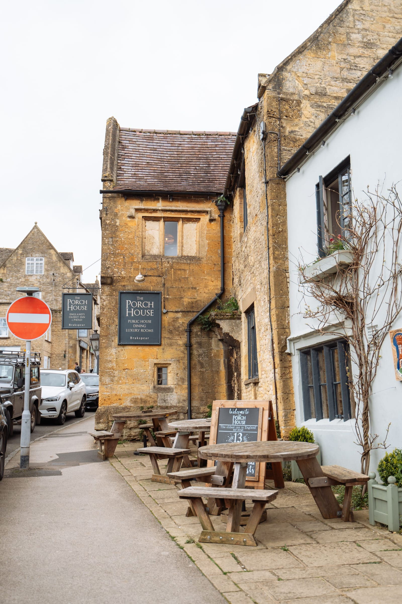
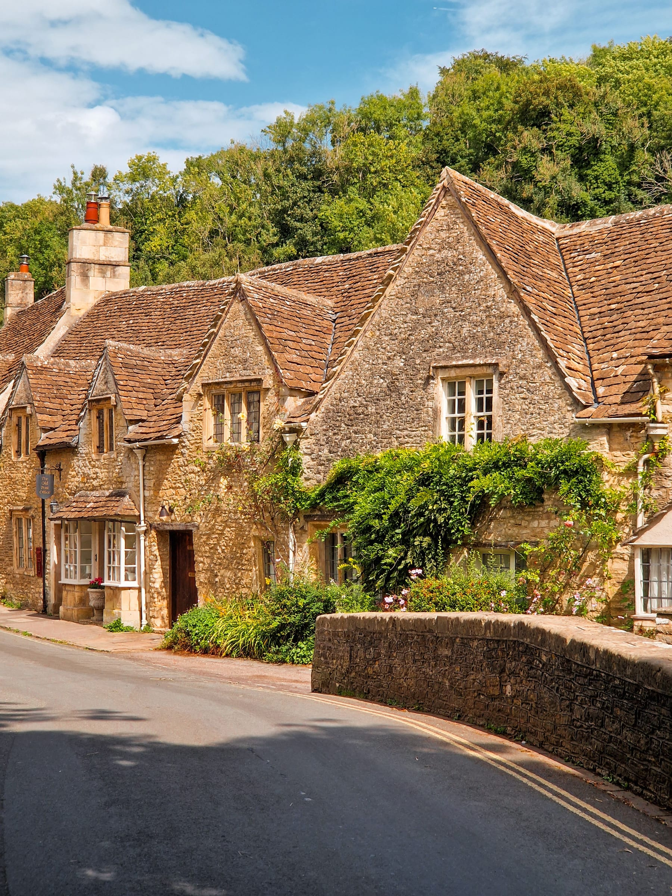
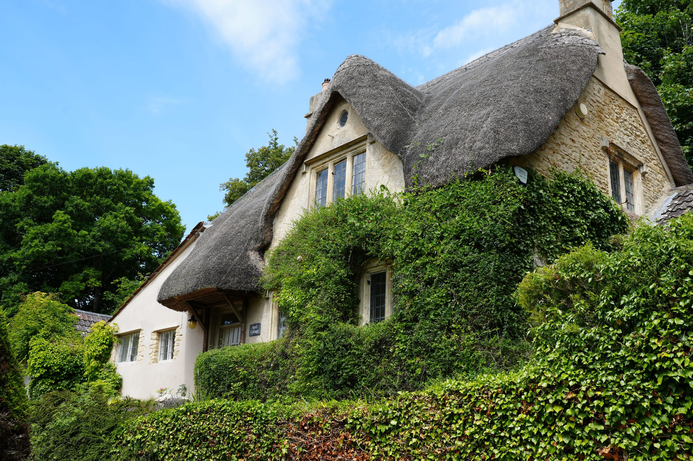
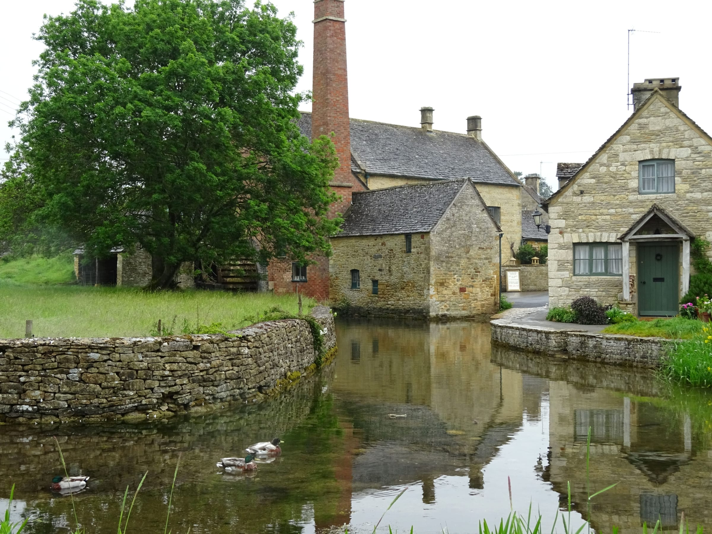
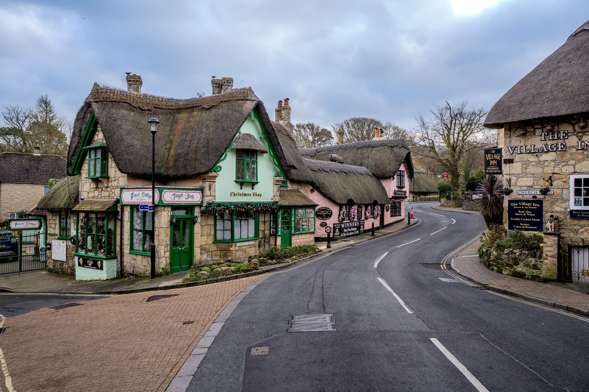

**The Cotswolds is not a place you can go to.** It is a range of hills spread across several counties, with no railway between the villages and a bus network that largely stops on Sundays. That is why most people either book a coach tour or hire a car, and why the pretty-village lists you have been reading are mostly useless for planning.

There is a train-and-bus day that genuinely works. It is narrower than you would like, and it runs through Moreton-in-Marsh.

> 💡 **The Short Version:** **Paddington to Moreton-in-Marsh, 1h25, £54.00 off-peak return** — and a single is £53.00, so always buy the return. The **Pulhams 801** leaves the station for **Stow in 20 minutes and Bourton in 40**, hourly, **including Sundays**. The **855 to Bibury runs Monday to Saturday and not at all on Sunday**; nor does the **606** to Broadway or the Stagecoach **1/2/3** to Chipping Campden. A **£8.50 day ticket** on the bus covers the lot. Driving is **2h14 and 88 miles** to Bourton, where 10 hours' parking is **£10.60** — against **free** at Stow Fosseway and **free** at Burford. **Bibury has no car park.** Nothing in the Cotswolds needs a ticket, so the paid attractions are all optional.

Powered by <a target="_blank" rel="sponsored" href="https://www.getyourguide.com/london-l57/">GetYourGuide</a>

**Book a tour direct:**

- **£89** — <a href="https://www.getyourguide.com/activity/-t215430?partner_id=WWP7I0R&amp;cmp=cotswolds-day-trip" target="_blank" rel="sponsored nofollow noopener" data-affiliate="gyg">Cotswolds villages, small group</a>
- **£79** — <a href="https://www.getyourguide.com/activity/-t2259?partner_id=WWP7I0R&amp;cmp=cotswolds-day-trip" target="_blank" rel="sponsored nofollow noopener" data-affiliate="gyg">The Cotswolds and Blenheim Palace</a>
- **£154** — <a href="https://www.getyourguide.com/activity/-t602620?partner_id=WWP7I0R&amp;cmp=cotswolds-day-trip" target="_blank" rel="sponsored nofollow noopener" data-affiliate="gyg">Stonehenge, Bath and the Cotswolds, small group</a>

## First, which Cotswolds

The northern Cotswolds — Moreton-in-Marsh, Stow, Bourton, Broadway, Chipping Campden — is one cluster, and the Cotswold Line from Paddington runs along its eastern edge. The southern Cotswolds — Bibury, Cirencester, Burford, Castle Combe — is a different cluster reached from a different set of stations, and Castle Combe is so far south it is a Bath trip rather than a Cotswolds one. See [Bath from London](/articles/bath-day-trip/) for that end.

**You are choosing one cluster. Doing both in a day is a coach tour's job, not yours.**

## By train

All six run from Paddington. Returns were quoted for a Tuesday mid-morning departure; the cheap fare disappears on afternoon departures from about 15:20.

| Station | Fastest | Off-peak return | What it actually puts you near |
| --- | --- | --- | --- |
| **Moreton-in-Marsh** | **1h 25m** direct | **£54.00** | The town, on the platform. **The 801 bus to Stow (20 min) and Bourton (40 min)**, plus the Stagecoach 1/2/3 to Broadway and Chipping Campden |
| Kingham | **1h 17m** direct | **£46.80** | Nothing. 4 miles from Stow, 5 from Bourton, **no useful bus** |
| Charlbury | 1h 08m direct | **£45.70** | Charlbury itself — Market Street is 0.3 miles, nine minutes on foot |
| Kemble | 1h 09m direct | £63.20 | **Cirencester**, 12 minutes on the Stagecoach 882 — five or six journeys a day, Mon–Sat |
| Stroud | 1h 25m direct | £63.20 | Stroud: a working Five Valleys market town, not a postcard village |
| Cheltenham Spa | 1h 59m direct | £70.90 | **Royal Well bus station**, where the 801, 606 and X52 all start — 1.1 miles and 25 minutes on foot from the platform |

> ⚠️ **Buy the return, always.** A single to Moreton-in-Marsh was quoted at **£53.00** against a £54.00 off-peak return, and every departure a month out was quoted at that same £53.00 — there is no Advance fare to chase on this line. GWR's own booking engine offered nothing but an Anytime Day Single, at £53.60, for same-day travel.

**Sunday is cheaper and slower.** A Sunday return is still £54.00 but a Sunday single drops to £35.50, trains leave Paddington hourly at :44 and take 1h39, and the last one back leaves Moreton at **21:46**, in at 23:40. On a weekday the last is **23:31**, arriving 01:16, with the last sensible one at 21:46.

**Kingham is the frustrating one.** It is eight minutes quicker and £7.20 cheaper than Moreton, and the Cotswold Motoring Museum's own directions page puts it 5 miles from Bourton against Moreton's 8. There is simply no bus, so unless you are booking a taxi at the other end, ignore it.

## The buses, honestly

*Stow-on-the-Wold, twenty minutes from Moreton-in-Marsh on the 801. Photo: Daria Agafonova, Pexels.*

One route does almost all the work. The rest are thin, and three of the five stop dead on Sundays.

| Route | Where it goes | Frequency | Sunday |
| --- | --- | --- | --- |
| **801** | Cheltenham – Bourton – **Stow** – **Moreton station** – Chipping Norton | **Hourly** | **Yes, hourly 07:45–18:45 from Moreton** |
| **855** | Bourton – Northleach – **Bibury** – Cirencester | Hourly-ish, Mon–Sat | **None** |
| **606** | Chipping Campden – **Broadway** – Winchcombe – Cheltenham | 6 journeys a day, Mon–Sat | **None** |
| **1 / 2 / 3** (Stagecoach) | Stratford – Broadway – **Chipping Campden** – Moreton station | 3–6 journeys a day, Mon–Sat | **None** |
| **X52** | Oxford – Witney – **Burford** – Northleach – Cheltenham | Every 2 hours | Yes, 5 journeys |

**The 801 is the reason a train day works at all.** It calls at Moreton-in-Marsh Railway Station, and on a weekday leaves at 09:45, 10:45, 11:45, 12:45, 13:45, then 15:05, 15:55, 16:55 and on into the evening. Stow-on-the-Wold Library is 20 minutes; Bourton is 40. Coming back, the last bus from Bourton that reaches Moreton station is **21:15 on a weekday and 17:15 on a Sunday** — the later Sunday journeys terminate before Moreton, which is the trap.

**The 855 is the only bus to Bibury**, 32 minutes from Bourton, and on Sunday the operator's own timetable returns nothing in either direction. If Arlington Row is the reason you are going, do not go on a Sunday without a car.

**Broadway and Chipping Campden are reachable from Moreton station** on Stagecoach service 1/2/3 — 28 minutes to Broadway on three journeys a day, about six a day to Chipping Campden — Monday to Saturday only, per Warwickshire County Council's own timetable listing.

> 💡 **Get the day ticket.** Every Pulhams single is capped at **£3** and a return at **£6**, and a **CotswoldZone day ticket is £8.00 in the Pulhams app or £8.50 on the bus**, £6.50 for 18s and under, £22 for a group of up to five on the bus. Two hops pay for it.

The museum in Bourton puts it more plainly than any timetable does: *"There are buses from Bourton to the main towns and Moreton-in-Marsh for rail connections, but they are not very regular and timetables change between summer and winter."*

## The coach tour, which is the honest answer for a lot of people

If you want Bibury **and** Bourton **and** Broadway in one day, you need a vehicle, and hiring one for a single day out of London rarely beats a seat on a tour. The Cotswolds is also unusually clean to book: nothing in any of these villages needs an entry ticket, so there is no attraction admission hiding outside the tour price.

Three worth knowing: the **small-group tour at £89** is rated 4.8 from over 5,000 reviews, runs 9½ hours and leaves from a coffee shop by **South Kensington** at 08:25. The **£74 full-size coach** is the cheapest credible one and leaves from **Paddington, Eastbourne Terrace, Stop E**, taking in Burford, Bibury and Bourton. A **second small group at £78** adds Stow-on-the-Wold and Broadway Tower.

Powered by <a target="_blank" rel="sponsored" href="https://www.getyourguide.com/london-l57/">GetYourGuide</a>

## Driving, and where you can put the car

| From Charing Cross | Time | Distance | Route |
| --- | --- | --- | --- |
| **Bourton-on-the-Water** | **2h 14m** | 88 miles | M40 and A40 |
| Bibury | 2h 08m | 84 miles | M40 and A40 |
| Broadway | 2h 28m | 98 miles | M40 and A44 |
| Castle Combe | 2h 12m | 102 miles | M4 |

The driving is the easy part. Parking is where the villages differ wildly.

| Car park | 10 hours |
| --- | --- |
| **Stow-on-the-Wold, Fosseway** GL54 1BX, 98 spaces | **Free** |
| **Burford, Guildenford** OX18 4SE | **Free** — West Oxfordshire says plainly that parking is free in all its car parks |
| **Moreton-in-Marsh, Old Market Way** GL56 0JY, 40 spaces | **£3.40** |
| Chipping Campden, Market Square, 32 spaces | £2.00 for two hours; first 20 minutes free |
| **Bourton-on-the-Water, Rissington Road** GL54 2BN, 192 spaces | **£10.60** |
| Stow-on-the-Wold, Maugersbury Road | £10.60 |

Bourton charges from **10:00 to 20:00, seven days a week** — later into the evening than almost any council car park you have used. Stow's free Fosseway car park is a five-minute walk from the square and the obvious move if you are driving. For hire cars, fuel, insurance excess and the rest of it, see [car hire and driving in the UK](/articles/car-hire-driving-uk/).

> ⚠️ **Bibury has no car park.** Gloucestershire County Council provides a handful of free roadside bays opposite the Trout Farm and along the main road, sat nav **GL7 5NP**, and the National Trust's own page warns they get busy. The Trout Farm charges **£10** for its own. **Arlington Row is closed to visitor vehicles** — in the National Trust's words, *"vehicular access is restricted to residents because of the steep and narrow access road and the lack of turning or parking space."* The cottages are private homes; there is no public access to them or their gardens. In July 2025 the county council also removed the village's coach bays entirely, replacing them with a bus-stop clearway limited to a ten-minute wait, and now asks coaches to drive to Cirencester to turn round — which it concedes adds 15 to 20 minutes to a tour.

Castle Combe is the same story in Wiltshire: a pay-and-display car park up in Upper Castle Combe and, in the parish council's words, *"enforcement officers regularly patrol to monitor and deter illegal parking in the village."*

## What is actually in each village

*Castle Combe. Photo: Adrian Limani, Pexels.*

- **Bourton-on-the-Water** — the River Windrush running down the middle of the green under low stone footbridges, and three paid attractions on one street. The busiest place in the Cotswolds by a distance.
- **Stow-on-the-Wold** — a proper market square at the top of the hill where the Fosse Way crosses, antique shops, and St Edward's Church with its famous yew-flanked north door. Free parking, an 801 stop, and half the crowds of Bourton.
- **Lower Slaughter** — the Old Mill on the River Eye and a lane of stone cottages with no through traffic. **Bourton to Lower Slaughter to Upper Slaughter is 2.6 miles and about 58 minutes on foot, mostly flat**, which is the best free thing in the north Cotswolds.
- **Bibury** — Arlington Row, built around 1380 as a monastic wool store and converted into weavers' cottages in the 17th century, plus the Rack Isle water meadow and the Trout Farm. Twenty minutes of looking, and an hour of parking hassle.
- **Broadway** — a wide green High Street of honey-coloured stone, with Broadway Tower on the escarpment a mile above it and Snowshill Manor signed from the village.
- **Chipping Campden** — the Market Hall on the High Street, built in 1627 by Sir Baptist Hicks, Grade I listed and handed to the National Trust in the 1940s; free to walk through. It is also the northern end of the **Cotswold Way**, 102 miles to Bath.
- **Burford** — one long High Street dropping to a bridge over the Windrush, free parking, and the X52 to Oxford or Cheltenham if you are doing this without a car.
- **Cirencester** — the Roman town of Corinium, with the Corinium Museum, St John Baptist church and the Abbey Grounds. The hub of the 855 and the 882, so the natural base for the southern villages.
- **Castle Combe** — genuinely one of the prettiest, and 12 miles from Bath on the far southern edge. Treat it as a Bath day.

## The paid attractions, and what they cost

*Photo: Merve Orhan, Pexels.*

| | Adult | Child | Notes |
| --- | --- | --- | --- |
| **The Model Village**, Bourton | **£4.95** | £4.00 (3–13) | 10:00–17:30 in summer, **10:00–15:30 in winter**. Card only, no booking, closes for snow |
| **Birdland**, Bourton | £14.95 gate / **£13.95 online** | £11.50 / £10.50 (3–15) | 10:00–17:00, last entry 16:00. £1.50 booking fee online |
| **Cotswold Motoring Museum**, Bourton | £9.95 | £6.95 (5–16) | 10:00–18:00, last admission 17:15. Family £27.00 |
| **Broadway Tower** | **£14.00** | £6.00 (11–16), £3.00 (6–10) | Grounds only **£4.00**. Bunker tour £12.00, combined £20.00. **Parking £3/£6 extra** |
| **Snowshill Manor** (NT) | **£18.00** | £9.00 (5–17) | £13.00 from 2 November. Manor 11:30–16:30, free parking 500 yards away |
| **Hidcote** (NT) | **£20.00** | £10.00 (5–17) | £12.00 from 2 November, £11.00 from 1 January. Garden 10:00–17:00 |
| **Sudeley Castle**, Winchcombe | **£24.00** | £10.50 (3–15) | **Daily 14 March to 1 November only.** Last admission 15:00 |
| **Bibury Trout Farm** | £9.50 | £8.00 (3–15) | 09:00–17:30, last entry 16:45. **Car park £10** |
| **Corinium Museum**, Cirencester | £8.70 | £4.00 (5–16) | Mon–Sat 10:00–16:00, **Sunday 14:00–16:00 only** |
| **Batsford Arboretum** | £10.90 | £3.15 (4–16) | **1.9 miles, 44 minutes on foot from Moreton station** |

National Trust prices are the without-Gift-Aid ones. Snowshill and Hidcote are free to members; nothing else here is.

**None of this is compulsory.** The villages themselves cost nothing, which is the real point of the Cotswolds and the reason a £4.95 model village and a 2.6-mile walk beat a £24 castle for most people's day.

## The one-day pairings that work

*Lower Slaughter, on the walk from Bourton. Photo: Michelle Chadwick, Pexels.*

**Without a car, from Moreton-in-Marsh.** Take the 10:53 out of Paddington, or the 10:44 on a Sunday. The 801 to Bourton, the flat walk up to Lower and Upper Slaughter and back — 2.6 miles each way, no bus serves the Slaughters — then the 801 on to Stow for the square and an early dinner, and the 801 again to the station. All of it runs on a Sunday, but it ends earlier: be on the **17:15 out of Bourton or the 17:33 out of Stow**, because the later Sunday buses stop short of Moreton.

**With a car, in the north.** Broadway and Chipping Campden, twenty minutes apart, with either Snowshill Manor or Hidcote between them and Broadway Tower for the view.

**With a car, in the south.** Bibury first thing before the bays fill, Burford for lunch and free parking, Cirencester if you still have light.

**Do not attempt** Bourton and Bibury and Broadway in one self-driven day. That is a 10-hour coach itinerary with a professional driver, and you will spend it in the car.

## When to go, and when not to

*Photo: Jordan Coleman, Pexels.*

**Not a summer weekend in Bourton.** Its own parish council said in September 2025 that visitor numbers had *"placed significant pressure not only on the village centre but also on surrounding residential and commercial areas"* and added, flatly, that it *"has no control over visitor numbers and has no power to close the village."* An experimental traffic order restricting coaches on Meadow Way has been running towards September 2026, and the county council has refused the parish a residents' parking scheme. Go on a weekday, or go early.

**Winter closes a specific list.** Sudeley Castle shuts entirely from 2 November to 13 March. Snowshill Manor's season ends on 29 November, with last admission to the manor dropping to 13:30 in the final three weeks. The Model Village switches to 10:00–15:30 and shuts in snow. Hidcote, Birdland, the Motoring Museum and Broadway Tower stay open, at winter prices where there are any.

**Winter is also when the villages are worth most.** Bourton without a coach party in it is a different place.

## What people get wrong

- **Buying a single to Moreton-in-Marsh** at £53.00 when the return is £54.00.
- **Going to Bibury on a Sunday without a car.** The 855 does not run.
- **Going to Broadway or Chipping Campden on a Sunday without a car.** Neither does the 606 or the Stagecoach 1/2/3.
- **Getting off at Kingham** because it is cheaper and faster. Nothing meets it.
- **Driving to Arlington Row.** The lane is residents-only and there is nowhere to turn round.
- **Assuming Bourton's car park stops charging at six** like most of them. It runs to 20:00, seven days a week.
- **Paying £10.60 at Stow's Maugersbury Road** when the Fosseway car park is free and five minutes away.
- **Planning a day around Sudeley Castle in February.** It is shut until 14 March.
- **Trying to link Castle Combe with Bourton.** They are 50 miles and two counties apart.

All prices and times checked 12 September 2026.

## Continue planning your day out

- 🗺️ **[Day trips from London](/articles/day-trips-from-london/)** — what the others cost, how long they take, and which days they are shut.
- ♨️ **[Bath from London](/articles/bath-day-trip/)** — the southern end of the Cotswold Way, and the right trip for Castle Combe.
- 🪨 **[Stonehenge from London](/articles/stonehenge-day-trip/)** — the other one the coach tours bundle with the Cotswolds.
- 🚗 **[Car hire and driving in the UK](/articles/car-hire-driving-uk/)** — what hiring actually costs before you commit to the drive.
