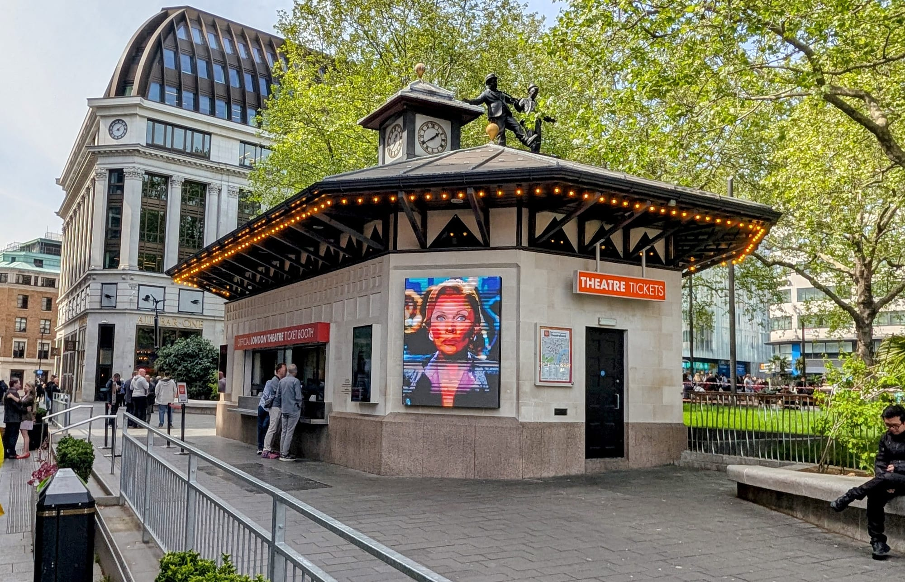
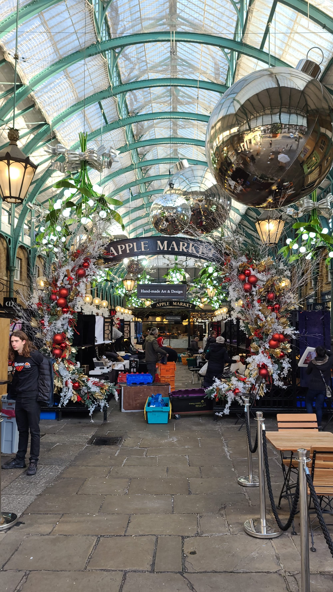
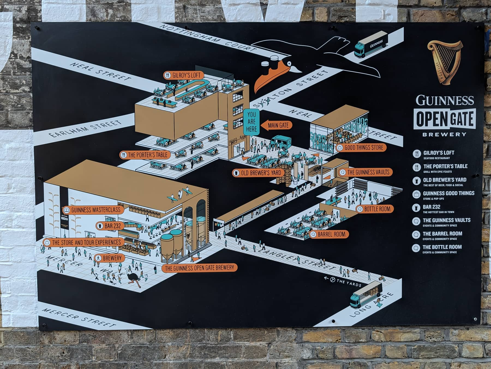

Covent Garden is a former fruit and vegetable market turned pedestrian district, and the closest thing central London has to an outdoor stage. It also sits inside the West End theatre district - our [London theatre guide](/articles/london-theatre-guide/) explains how the West End, off-West End and fringe differ, and the practical business of curtain times and getting home. The cobbled Piazza, the glass-roofed market halls and the surrounding grid of small streets hold the highest concentration of theatres in the world.

It is also the most walkable part of the West End, and the easiest to combine with somewhere else — Soho is eight minutes west, the British Museum twelve minutes north.

Covent Garden has its own share of the commemorative plaques marking where notable people lived or worked - see them on our [interactive map](/plaques/?area=covent-garden).

## Why visit — and who should skip it

**Come here if** you want theatre, street performance and browsing in a compact area you can cover on foot. The Piazza performers are auditioned by the estate rather than turning up unannounced, so the standard is high. Seven Dials and Neal's Yard just north are among the prettiest corners in central London.

**Skip it if** you dislike crowds. Covent Garden is busy nearly all the time, and on Saturday afternoons the Piazza is close to impassable. If you want the same architecture without the crush, come on a weekday morning before 11am.

## Top sights and activities

1. **Covent Garden Piazza and the Apple Market** — The cobbled square and its covered market halls, with craft and antique stalls that change by day: antiques on Monday, crafts and general goods the rest of the week.
2. **The street performers** — Three licensed pitches. The West Piazza in front of St Paul's Church takes the big circle acts, the lower courtyard has classical musicians, and the North Hall runs smaller sets.
3. **Seven Dials and Neal's Yard** — Seven cobbled streets meeting at a sundial monument. The alley off Short's Gardens opens into Neal's Yard, a small courtyard of painted facades and organic cafes that is very easy to walk straight past.
4. **The Royal Opera House** — Worth entering even without a ticket: the Paul Hamlyn Hall and the terrace bar are open to the public during the day, with a view over the Piazza.
5. **London Transport Museum** — Genuinely good, and better than it sounds. Real Tube carriages, old buses and the original poster archive. One of the few paid attractions here worth the money, especially with children.
6. **St Paul's Church (the Actors' Church)** — The portico where Eliza Doolittle is introduced in *Pygmalion*. The garden behind it is the quietest place in the area to sit.
7. **Neal Street and Monmouth Street** — The main independent shopping streets, running north from the Piazza to Seven Dials.
8. **The TKTS booth, Leicester Square** — A five-minute walk south. The only ticket booth in the square actually run by the theatre industry, in the clocktower building on the south side, selling mostly same-day tickets at a discount since 1980. Ignore the lookalike shops nearby trading on the same name.

*Run by the Society of London Theatre, a not-for-profit — every other "theatre tickets" booth around the square is a private reseller.*

## Key streets and micro-districts

*Charles Fowler's market hall, built 1828–30. The arched glass roofs came half a century later, covering what had until then been open yards between the ranges — the produce market itself left for Nine Elms in 1974.*

### The Piazza and market halls

The centre, and the most crowded few hundred square metres in this guide. Charles Fowler's 1828 market hall with its later glass roofs, split into the **Apple Market** for craft stalls and the **Jubilee Market** for the cheaper end.

**The street performers are licensed and auditioned**, which is why the standard is higher than it looks — pitches are balloted, and the ones under the glass in the North Hall are classical musicians rather than jugglers. **Free to watch; they pass a hat.**

**St Paul's Church to the west is the Actors' Church**, free to enter, lined with memorials to actors, and its portico is where Eliza Doolittle sells flowers at the start of *Pygmalion*. The churchyard behind it is a walled garden and one of the quietest places in Covent Garden.

**Bar Cicoria at the Royal Ballet and Opera**, on the north-east corner, is the free viewpoint nobody uses — a fifth-floor terrace looking down onto the market roof, **walk-ins only, no ticket required**, noon to 11pm Monday to Saturday.

Go before ten in the morning or after eight in the evening if you want to move.

*The Piazza's cobbles are shared between the market stalls by day and restaurant terraces by evening.*

*The Apple Market dressed for Christmas. The decorations go up in November and are one of the more elaborate displays in central London.*

### Seven Dials

Seven short streets radiating from a sundial pillar, each with its own character — independent fashion on Monmouth Street, coffee and shoes on Earlham Street, and two West End theatres on the junction itself.

**The pillar has six dials, not seven.** It was laid out in the 1690s when only six streets were planned; the seventh was added later and the sundial never caught up. The original was pulled down in 1773 and the present one dates from 1989.

**Seven Dials Market fills Thomas Neal's Warehouse**, which stored bananas and cucumbers for the old fruit market — its two halls are still called **Banana Warehouse and Cucumber Alley**. Free to walk into, around twenty traders, open daily and later than most of Covent Garden.

**It is the calmer alternative to the Piazza**, three minutes north and with a fraction of the crowd. Covent Garden and Leicester Square stations are each about four minutes.

*The sundial pillar the district is named after. The Cambridge Theatre is on the corner behind it.*

*Seven Dials Market fills Thomas Neal's Warehouse, which stored bananas and cucumbers for the old Covent Garden fruit market. Its two halls are still called Banana Warehouse and Cucumber Alley.*

### Old Brewer's Yard

A courtyard off Mercer Walk, opened in December 2025 on a plot that was brewing beer in the 1740s. Bars, two restaurants and shops around a cobbled yard, with a working **Open Gate Brewery** on the site.

**The courtyard is free to walk into and the bar needs no ticket** — only the brewery tours upstairs do. That distinction catches people out, because the signage pushes the tour.

**It sprawls further back than the entrance suggests.** From Mercer Walk it reads as a single small yard; the brewery and the larger rooms are behind, and it is worth going through rather than glancing in.

**It is the newest thing in this guide**, so it is quieter than the Piazza and the market and has not yet appeared in most published guides — which for now makes it the easiest place near the Piazza to sit down on a Saturday afternoon.

*Old Brewer's Yard. The courtyard bar needs no ticket — only the brewery tours upstairs do.*

*The Open Gate Brewery's own site map. It sprawls further back than the courtyard entrance suggests.*

### Neal's Yard

*Neal's Yard. The entrances are narrow alleys off Monmouth Street and Short's Gardens, which is why so many people walk past without ever finding it.*

A single small courtyard reached down narrow alleys off Short's Gardens and Monmouth Street, which is why so many people walk past without ever finding it. Painted buildings in yellow, blue and pink, cafe tables filling the middle, and the original **Neal's Yard Remedies** shop that the chain is named after.

**It is tiny — perhaps twenty metres across — and it is on every list**, so at lunchtime in summer you are queueing to stand in it. **Early morning is the only time you will get it empty**, and that is also when the light reaches the painted walls.

**Neal's Yard Dairy is round the corner on Short's Gardens**, not in the yard itself, and it is the better stop: a genuine cheesemonger that matured British farmhouse cheese back into existence in the 1980s, and they will let you taste before you buy.

**Monmouth Coffee** on the same corner has been roasting since 1978 and has a permanent queue.

### Floral Street and Long Acre

The two main east–west shopping streets, running parallel from the Piazza towards Leicester Square and Holborn. **Long Acre is the wider, chainier one**; Floral Street behind it is narrow, pedestrian in stretches and has the more interesting shops.

**The Bridge of Aspiration crosses Floral Street** — a twisting glass and aluminium footbridge of 2003 linking the Royal Ballet School to the Opera House, so dancers cross above the street between class and stage. It is free to look at, easy to miss, and one of the better small pieces of modern architecture in central London.

**Stanfords on Mercer Walk**, just off Long Acre, has been selling maps and travel books since 1853 and is the best travel bookshop in Britain.

**These are working shopping streets rather than sights**, so they keep retail hours and go quiet by seven. Covent Garden station is on Long Acre and is **exit-only at busy times** — the lifts jam, and Leicester Square four minutes away is often faster.

### Bow Street and Drury Lane

*The Lyceum on Wellington Street, home to The Lion King since 1999. Several of the West End's biggest houses are within five minutes of the Piazza.*
The theatre spine of Covent Garden, and several of the West End's biggest houses are within five minutes of the Piazza.

**Theatre Royal Drury Lane is the oldest theatre site in continuous use in London**, licensed in 1663, with the current building dating from 1812. It was restored at length and reopened in 2021, and **daytime tours run when the schedule allows** — worth checking, because the front-of-house rooms are extraordinary and you see them without a ticket to the show.

**The Lyceum on Wellington Street** has held *The Lion King* since 1999. **Bow Street** has the Royal Opera House stage door and the former magistrates' court where the Bow Street Runners were founded — now a hotel with a small police museum.

**Book seats rather than turning up.** TKTS in Leicester Square, five minutes west, sells genuine same-day discounts; the touts and the ticket shops along the way do not.

For a drink between the theatres, **Bar Cicoria's terrace** is free to walk into and overlooks the whole Piazza.

Powered by <a target="_blank" rel="sponsored" href="https://www.getyourguide.com/london-l57/">GetYourGuide</a>

## Where to eat and drink

| Spot | Style | Price | Why go |
| --- | --- | --- | --- |
| **Seven Dials Market** | Food hall | £ | Two floors of vendors in a former banana warehouse; no booking needed |
| **Dishoom Covent Garden** | Bombay-inspired Indian | ££ | Bacon naan rolls and black daal; expect a wait without a booking |
| **Bancone** | Handmade pasta | ££ | Watch the pasta being rolled at the counter |
| **The Lamb & Flag** | Historic pub | £ | 17th-century pub on Rose Street, once frequented by Dickens |
| **Rules** | Traditional British | £££ | London's oldest restaurant, open since 1798 |
| **Monmouth Coffee** | Coffee | £ | The original Monmouth Street shop; queues out the door at weekends |

## Getting there

**By Tube.** This matters more here than anywhere else in central London. **Do not use Covent Garden station.** It has no escalators — just lifts and a 193-step spiral staircase — and it queues badly. Use **Leicester Square** (Piccadilly, Northern) or **Holborn** (Central, Piccadilly) instead; both are about five minutes' walk.

**Best exit.** From Leicester Square, take Exit 1 and walk east along Cranbourn Street. From Holborn, exit onto Kingsway and walk south down Great Queen Street.

**On foot.** Eight minutes to Soho, twelve to the British Museum, fifteen over Waterloo Bridge to the South Bank. See the [London Tube and Rail Lines Guide](/articles/london-tube-and-rail-lines-guide/) for which line serves what.

## How long to spend, and when to go

| If you have | Do this |
| --- | --- |
| **One hour** | The Piazza, a street performance and the Apple Market |
| **Half a day** | Add Seven Dials, Neal's Yard and lunch at Seven Dials Market |
| **A full day** | Add the London Transport Museum and an evening show |

**Best time:** Weekday mornings before 11am for the market halls without the crush. Performers start around 10am and run until early evening.

**Avoid:** Saturday afternoons, when the Piazza is at its worst. Matinee days (usually Wednesday and Saturday) also put heavy pressure on restaurants from midday.

## Suggested two-hour walking route

1. **Start:** Leicester Square station, Exit 1. Walk east along Cranbourn Street.
2. **The Piazza:** Arrive at **Covent Garden Market**. Watch a performance in the West Piazza.
3. **Royal Opera House:** Walk to the north-east corner and go up to the terrace bar for the view.
4. **Neal Street:** North past the independent shops to **Seven Dials**.
5. **Neal's Yard:** The alley off **Short's Gardens** — look for the small blue sign.
6. **Finish:** **Seven Dials Market** for lunch, or continue west into Soho.

Powered by <a target="_blank" rel="sponsored" href="https://www.getyourguide.com/london-l57/">GetYourGuide</a>

## Common mistakes to avoid

1. **Using Covent Garden station.** Lifts and stairs only, and long queues at peak. Leicester Square or Holborn are faster.
2. **Not booking pre-theatre dinner.** Restaurants fill completely between 17:00 and 19:30. Book ahead and state your curtain time.
3. **Buying theatre tickets from lookalike booths.** The official TKTS booth is in Leicester Square and is the only one run by the theatre industry. Check for day seats direct from the theatre first.
4. **Eating on the Piazza itself.** You pay a significant premium for the location. Walk two minutes to Seven Dials or Monmouth Street.
5. **Missing Neal's Yard.** The entrance alley is genuinely easy to walk past.
6. **Taking a taxi within the West End.** Traffic through here is slow enough that walking is usually faster.

## Where to stay

Central, well connected and expensive. Good if you are here for theatre and want to walk home after a show.

- **Covent Garden and Seven Dials** — Boutique hotels in converted townhouses. Quiet at night once the market closes.
- **Holborn** — Five minutes east, noticeably better value, and on the Central line.
- **The Strand and Aldwych** — Larger classic hotels facing the river, with easy access to the South Bank.
