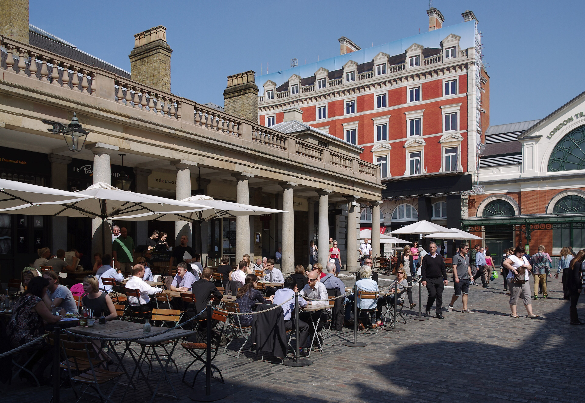

Covent Garden and Soho form London's premier entertainment district. Positioned side-by-side in the heart of the West End, this walkable enclave pairs world-famous theatres and street performers with quiet cobbled alleys, historic pubs, and international dining.

> 💡 **At a Glance: Covent Garden & Soho**  
> - **Vibe:** Energetic, artistic, historic, and bustling from morning till late night.  
> - **Walkability:** 5 / 5 (Entire district is easily explored on foot).  
> - **Nearest Stations:** Covent Garden (Piccadilly), Leicester Square (Piccadilly & Northern), Tottenham Court Road (Elizabeth Line & Northern).  
> - **Best For:** West End shows, street performers, historic pubs, food markets, and central shopping.

---

## Top 5 Sights & Activities

1. **Covent Garden Apple Market & Piazza:** Watch street performers in the cobblestone plaza, listen to classical buskers in the lower courtyard, and browse artisan craft stalls.
2. **Explore Seven Dials & Neal's Yard:** Discover seven atmospheric cobbled streets converging at a central monument, leading into hidden, colorful **Neal's Yard** courtyard.
3. **Stroll Soho's Carnaby Street:** Walk down London's famous 1960s fashion street, packed with boutique fashion, independent dining, and neon lighting.
4. **Feast in Chinatown:** Walk beneath traditional Chinese gateways along Gerrard Street for authentic dim sum, roasted duck, and boba tea shops.
5. **Catch a West End Theatre Show:** Experience world-class musicals and plays at historic venues like the Lyceum, Royal Opera House, and Sondheim Theatre.

---

## Key Micro-Districts & Streets

*Covent Garden Piazza. Photo: [mattbuck](https://commons.wikimedia.org/wiki/File:London_MMB_M7_Covent_Garden.jpg), [CC BY-SA 3.0](https://creativecommons.org/licenses/by-sa/3.0/).*

### 1. Seven Dials & Neal's Yard
Tucked just north of Covent Garden, **Seven Dials** offers seven independent boutique streets. Follow the narrow alleyway off Short's Gardens to find **Neal's Yard**, a vibrant hidden courtyard filled with organic cafes and colorful painted facades.

### 2. Chinatown (Gerrard Street)
Immediately bordering Soho, Chinatown is a pedestrianized culinary haven marked by red lanterns and ornate oriental archways.

### 3. Soho (Carnaby Street & Old Compton Street)
Soho is historic, bohemian, and lively. **Carnaby Street** anchors the fashion side, while **Old Compton Street** is the historic heart of London's LGBTQ+ nightlife and cafe culture.

---

## Book West End Tours & Experiences

Powered by <a target="_blank" rel="sponsored" href="https://www.getyourguide.com/s/%3Fq=London&amp;lc=57&amp;et=292175&amp;searchSource=3&amp;src=search_bar">GetYourGuide</a>

---

## Where to Eat & Drink

| Spot | Style / Specialty | Why Visit |
| --- | --- | --- |
| **Seven Dials Market** | Indoor Food Hall | Gourmet street food vendors in a former banana warehouse |
| **Dishoom Covent Garden** | Bombay-inspired Indian | Iconic bacon naan rolls and aromatic black daal |
| **Bancone Covent Garden** | Handmade Pasta | Watch chefs roll fresh pasta at the counter |
| **The Lamb & Flag** | Historic Pub | 17th-century pub once frequented by Charles Dickens |
| **Bao Soho** | Taiwanese Steamed Buns | Famous fluffy pork belly bao buns |

---

## Suggested 2-Hour Self-Guided Walking Route

1. **Start:** Exit **Tottenham Court Road Station** and walk down Charing Cross Road into **Soho**.
2. **Carnaby Street:** Turn right onto Broadwick Street to explore **Carnaby Street** and **Kingly Court**.
3. **Chinatown:** Head south down Wardour Street into **Gerrard Street (Chinatown)**.
4. **Seven Dials & Neal's Yard:** Cross Shaftesbury Avenue into **Monmouth Street** to reach **Seven Dials** and peek into **Neal's Yard**.
5. **Finish at Covent Garden Piazza:** Walk down Neal Street into **Covent Garden Market**, finishing with street performers and a drink in the courtyard!

---

## 5 Common Visitor Mistakes to Avoid

1. **Using Covent Garden Station during peak hours:** Covent Garden station relies solely on lifts and narrow stairs. Use **Leicester Square** or **Holborn** to avoid long elevator queues!
2. **Not reserving pre-theatre tables in advance:** Restaurants book out completely between 17:00 and 19:30. Always reserve early and mention your showtime.
3. **Missing Neal's Yard:** The entrance alley off Short's Gardens is easy to walk past—keep an eye out for the small blue sign!
4. **Buying full-price West End theatre tickets last minute:** Visit the official **TKTS booth in Leicester Square** for discount same-day tickets.
5. **Paying for taxis within the West End:** Traffic in Soho is notoriously slow; walking is almost always twice as fast.

---

## Related London Guides

* 🏨 [Exploring London's Best Neighbourhoods: Master Guide](/articles/best-areas-to-stay-and-visit-london/)
* 🚊 [Getting Around London: Complete Transport Overview](/articles/getting-around-london-transport-guide/)
* 🚇 [How to Use the London Underground](/articles/how-to-use-the-london-underground/)
* 🍛 [Best Indian Restaurants in London](/articles/best-indian-restaurants-london/)

---

*Exploration guide checked on 2 August 2026. Always verify performance and restaurant schedules.*
