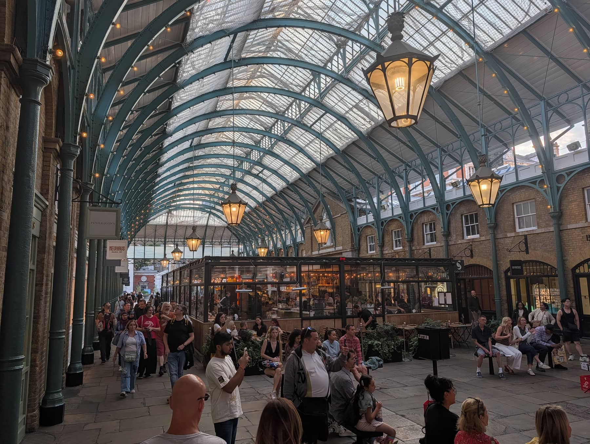
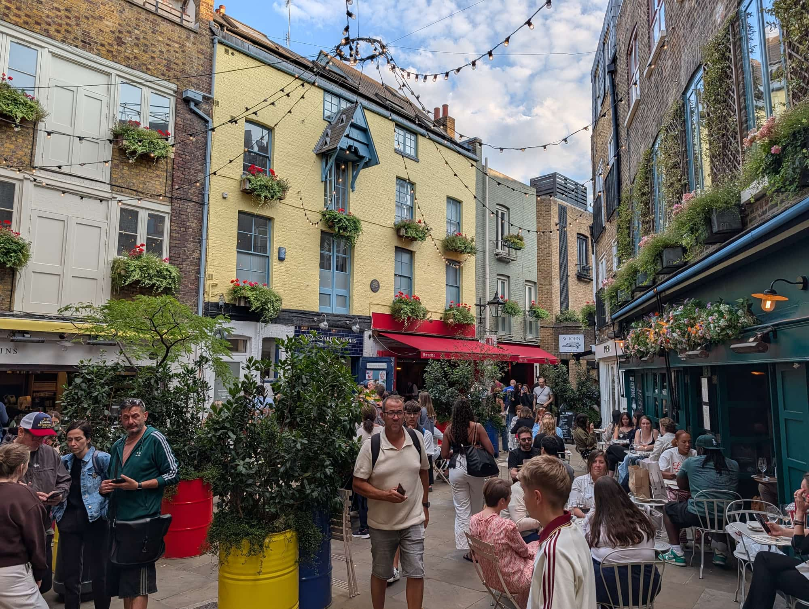
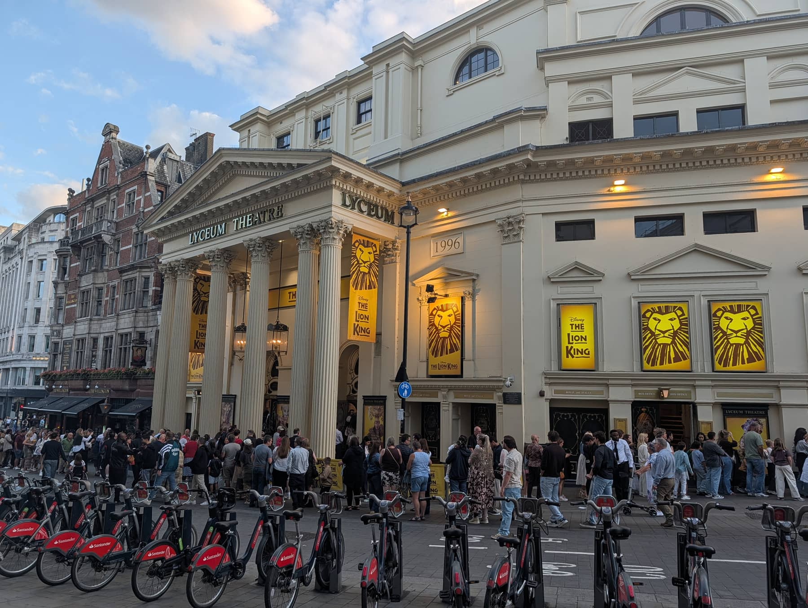

Covent Garden is a former fruit and vegetable market turned pedestrian district, and the closest thing central London has to an outdoor stage. The cobbled Piazza, the glass-roofed market halls and the surrounding grid of small streets hold the highest concentration of theatres in the world.

It is also the most walkable part of the West End, and the easiest to combine with somewhere else — Soho is eight minutes west, the British Museum twelve minutes north.

Covent Garden has its own share of the commemorative plaques marking where notable people lived or worked. [Browse them on the map](/plaques/?area=covent-garden).

## Why visit — and who should skip it

**Come here if** you want theatre, street performance and browsing in a compact area you can cover on foot. The Piazza performers are auditioned by the estate rather than turning up unannounced, so the standard is high. Seven Dials and Neal's Yard just north are among the prettiest corners in central London.

**Skip it if** you dislike crowds. Covent Garden is busy nearly all the time, and on Saturday afternoons the Piazza is close to impassable. If you want the same architecture without the crush, come on a weekday morning before 11am.

## Top sights and activities

1. **Covent Garden Piazza and the Apple Market** — The cobbled square and its covered market halls, with craft and antique stalls that change by day: antiques on Monday, crafts and general goods the rest of the week.
2. **The street performers** — Three licensed pitches. The West Piazza in front of St Paul's Church takes the big circle acts, the lower courtyard has classical musicians, and the North Hall runs smaller sets.
3. **Seven Dials and Neal's Yard** — Seven cobbled streets meeting at a sundial monument. The alley off Short's Gardens opens into Neal's Yard, a small courtyard of painted facades and organic cafes that is very easy to walk straight past.
4. **The Royal Opera House** — Worth entering even without a ticket: the Paul Hamlyn Hall and the terrace bar are open to the public during the day, with a view over the Piazza.
5. **London Transport Museum** — Genuinely good, and better than it sounds. Real Tube carriages, old buses and the original poster archive. One of the few paid attractions here worth the money, especially with children.
6. **St Paul's Church (the Actors' Church)** — The portico where Eliza Doolittle is introduced in *Pygmalion*. The garden behind it is the quietest place in the area to sit.
7. **Neal Street and Monmouth Street** — The main independent shopping streets, running north from the Piazza to Seven Dials.

## Key streets and micro-districts

*Charles Fowler's market hall, built 1828–30. The arched glass roofs came half a century later, covering what had until then been open yards between the ranges — the produce market itself left for Nine Elms in 1974.*

### The Piazza and market halls
The centre. Market stalls, the performers, the Royal Opera House on the north-east corner and St Paul's Church to the west.

### Seven Dials

Seven short streets radiating from a sundial pillar, each with its own character. Independent fashion, coffee, two West End theatres on the junction, and Seven Dials Market.

*The sundial pillar the district is named after. The Cambridge Theatre is on the corner behind it.*

*Seven Dials Market fills Thomas Neal's Warehouse, which stored bananas and cucumbers for the old Covent Garden fruit market. Its two halls are still called Banana Warehouse and Cucumber Alley.*

### Old Brewer's Yard

A courtyard off Mercer Walk, opened in December 2025 on a plot that was brewing beer in the 1740s. Bars, two restaurants and shops around a cobbled yard you can walk into for nothing — the ticketed brewery tour is listed under Things to do below.

*Old Brewer's Yard. The courtyard bar needs no ticket — only the brewery tours upstairs do.*

### Neal's Yard

*Neal's Yard. The entrances are narrow alleys off Monmouth Street and Short's Gardens, which is why so many people walk past without ever finding it.*

A single small courtyard off Short's Gardens. Painted buildings, cafe tables and the original Neal's Yard Remedies shop.

### Floral Street and Long Acre
The main east–west shopping streets, with the bridge linking the Royal Opera House buildings over Floral Street.

### Bow Street and Drury Lane

*The Lyceum on Wellington Street, home to The Lion King since 1999. Several of the West End's biggest houses are within five minutes of the Piazza.*
The theatre spine, including the Theatre Royal Drury Lane — the oldest theatre site in continuous use in London.

## Where to eat and drink

| Spot | Style | Price | Why go |
| --- | --- | --- | --- |
| **Seven Dials Market** | Food hall | £ | Two floors of vendors in a former banana warehouse; no booking needed |
| **Dishoom Covent Garden** | Bombay-inspired Indian | ££ | Bacon naan rolls and black daal; expect a wait without a booking |
| **Bancone** | Handmade pasta | ££ | Watch the pasta being rolled at the counter |
| **The Lamb & Flag** | Historic pub | £ | 17th-century pub on Rose Street, once frequented by Dickens |
| **Rules** | Traditional British | £££ | London's oldest restaurant, open since 1798 |
| **Monmouth Coffee** | Coffee | £ | The original Monmouth Street shop; queues out the door at weekends |

## Getting there

**By Tube.** This matters more here than anywhere else in central London. **Do not use Covent Garden station.** It has no escalators — just lifts and a 193-step spiral staircase — and it queues badly. Use **Leicester Square** (Piccadilly, Northern) or **Holborn** (Central, Piccadilly) instead; both are about five minutes' walk.

**Best exit.** From Leicester Square, take Exit 1 and walk east along Cranbourn Street. From Holborn, exit onto Kingsway and walk south down Great Queen Street.

**On foot.** Eight minutes to Soho, twelve to the British Museum, fifteen over Waterloo Bridge to the South Bank. See the [London Tube and Rail Lines Guide](/articles/london-tube-and-rail-lines-guide/) for which line serves what.

## How long to spend, and when to go

| If you have | Do this |
| --- | --- |
| **One hour** | The Piazza, a street performance and the Apple Market |
| **Half a day** | Add Seven Dials, Neal's Yard and lunch at Seven Dials Market |
| **A full day** | Add the London Transport Museum and an evening show |

**Best time:** Weekday mornings before 11am for the market halls without the crush. Performers start around 10am and run until early evening.

**Avoid:** Saturday afternoons, when the Piazza is at its worst. Matinee days (usually Wednesday and Saturday) also put heavy pressure on restaurants from midday.

## Suggested two-hour walking route

1. **Start:** Leicester Square station, Exit 1. Walk east along Cranbourn Street.
2. **The Piazza:** Arrive at **Covent Garden Market**. Watch a performance in the West Piazza.
3. **Royal Opera House:** Walk to the north-east corner and go up to the terrace bar for the view.
4. **Neal Street:** North past the independent shops to **Seven Dials**.
5. **Neal's Yard:** The alley off **Short's Gardens** — look for the small blue sign.
6. **Finish:** **Seven Dials Market** for lunch, or continue west into Soho.

## Common mistakes to avoid

1. **Using Covent Garden station.** Lifts and stairs only, and long queues at peak. Leicester Square or Holborn are faster.
2. **Not booking pre-theatre dinner.** Restaurants fill completely between 17:00 and 19:30. Book ahead and state your curtain time.
3. **Buying theatre tickets from lookalike booths.** The official TKTS booth is in Leicester Square and is the only one run by the theatre industry. Check for day seats direct from the theatre first.
4. **Eating on the Piazza itself.** You pay a significant premium for the location. Walk two minutes to Seven Dials or Monmouth Street.
5. **Missing Neal's Yard.** The entrance alley is genuinely easy to walk past.
6. **Taking a taxi within the West End.** Traffic through here is slow enough that walking is usually faster.

## Where to stay

Central, well connected and expensive. Good if you are here for theatre and want to walk home after a show.

- **Covent Garden and Seven Dials** — Boutique hotels in converted townhouses. Quiet at night once the market closes.
- **Holborn** — Five minutes east, noticeably better value, and on the Central line.
- **The Strand and Aldwych** — Larger classic hotels facing the river, with easy access to the South Bank.
