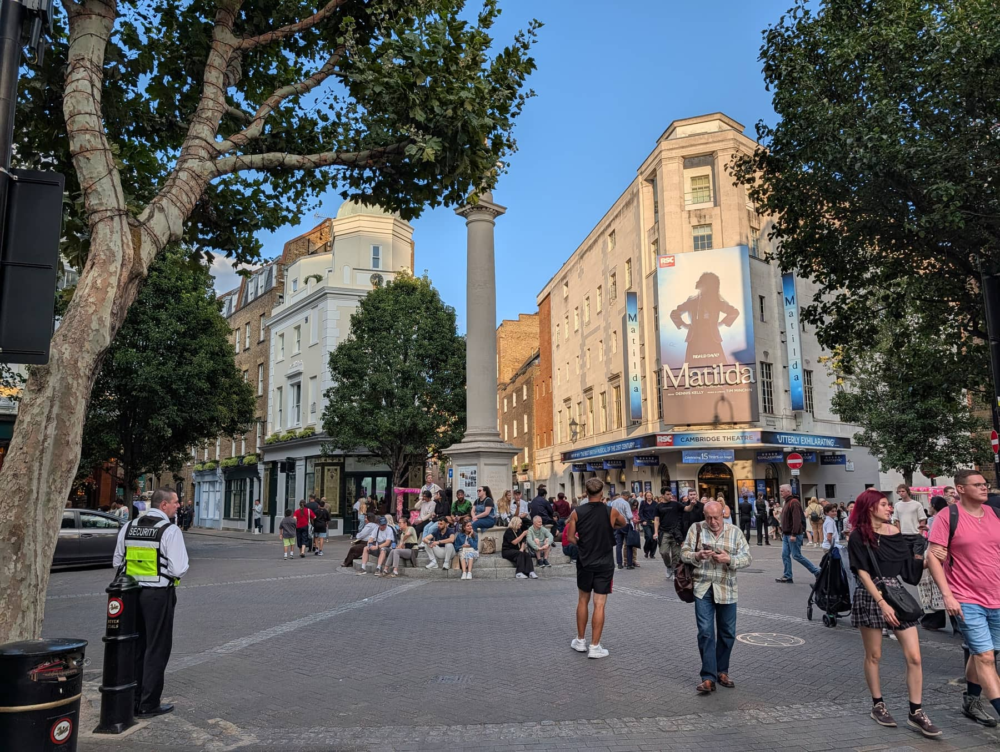
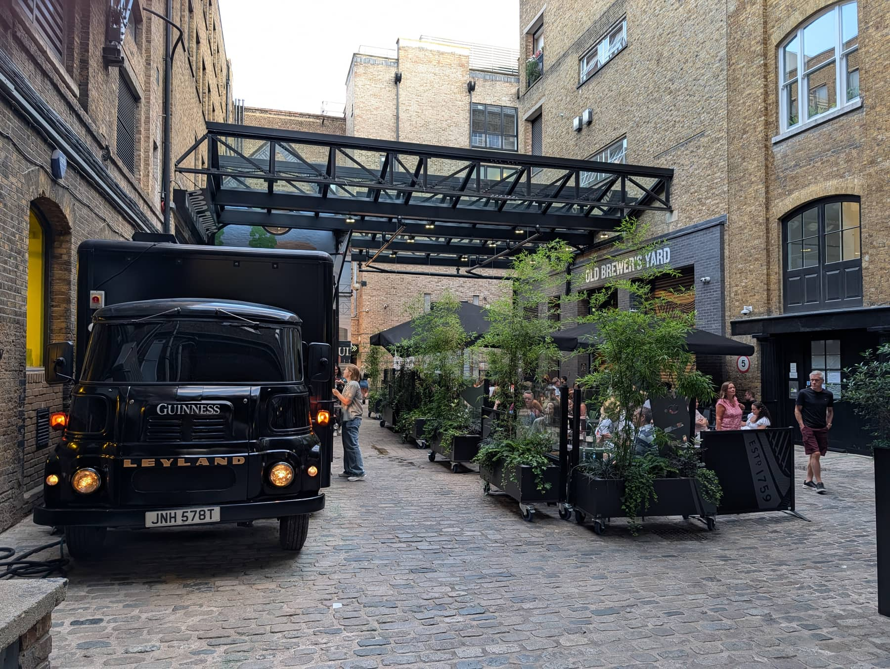
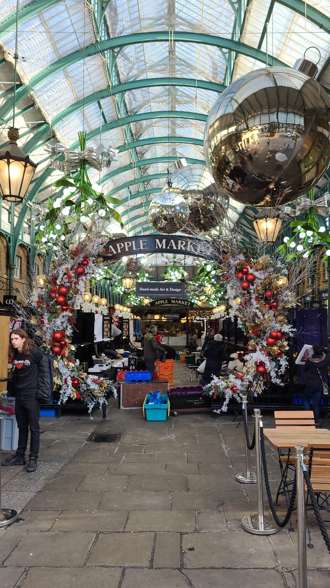
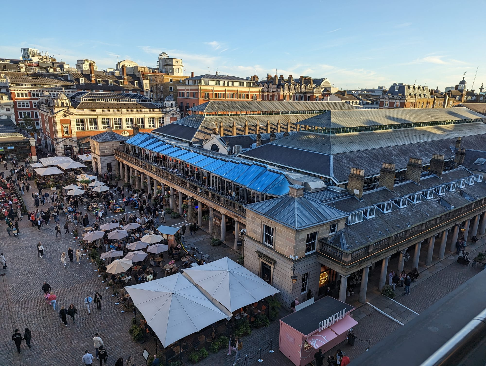
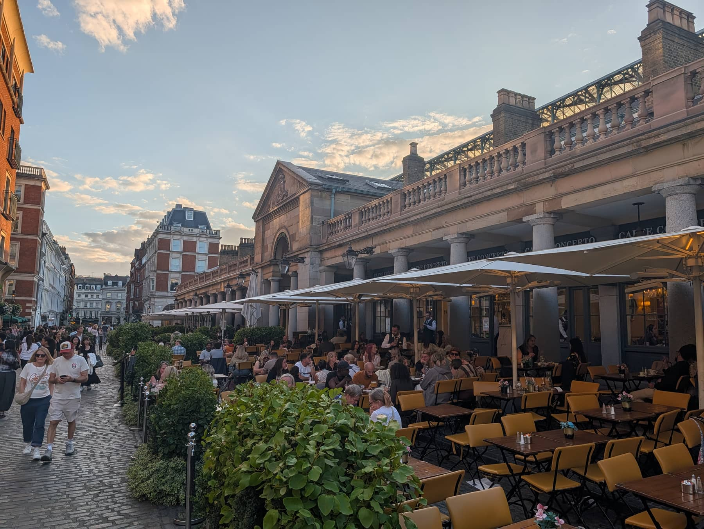

Most people do Covent Garden in about two hundred metres. They come up out of Covent Garden station, walk down James Street into the Piazza, watch a man on a unicycle, eat something expensive with a view of the cobbles and leave.

**This walk runs the other way round.** It starts at Leicester Square — the station you should be using anyway — goes north into Seven Dials and Neal's Yard while they are still walkable, comes down into the Piazza in the middle rather than at the start, and finishes at Somerset House, which is six minutes from the market hall and which almost nobody on this walk realises is there.

It is about **2km and takes around two hours** with stops. Everything on it is free except the London Transport Museum, and you can skip that.

For the wider area — the theatres, where to eat before a show, where to stay — see the [Covent Garden area guide](/articles/covent-garden-area-guide/). This is the walking route version of it.

> 💡 **The Short Version:** Start at **Leicester Square**, not Covent Garden station — 193 steps and no escalators. Go **north first**: Seven Dials and Neal's Yard are the quiet half and they do not stay quiet. **Monday is antiques day** in both market halls and nothing else on this route minds which day it is. The free view is **Bar Cicoria**, on the fifth floor of the Royal Opera House, no ticket and no booking. The thing everyone walks past is **Cecil Court**, ninety seconds off the route.

## The route

  

    Map of the walk, numbered in walking order
  

  

    
Loading the map…

  

  

    <i class="route-map-marker" aria-hidden="true">1</i> On the route, in walking order
    <i class="route-map-marker route-map-marker--alt" aria-hidden="true">+</i> Optional detour
  

  <noscript>
    
The map needs JavaScript. Every stop below is numbered in walking order with its nearest station.

  </noscript>

**[Open the whole route in Google Maps →](https://www.google.com/maps/dir/?api=1&origin=51.510105,-0.12991&destination=51.511695,-0.117442&waypoints=51.510727,-0.127657%7C51.513754,-0.126905%7C51.514427,-0.126389%7C51.514115,-0.12581%7C51.513006,-0.125355%7C51.511556,-0.123715%7C51.511991,-0.123069%7C51.512873,-0.122564%7C51.511984,-0.121227&travelmode=walking)** — all eleven stops in walking order, set to walking directions, which is the version to put on your phone.

| # | Stop | Cost | Open |
| --- | --- | --- | --- |
| **1** | Leicester Square & the Ticket Booth | Free to see | Booth Mon–Sat 10.30am–6pm |
| **2** | Cecil Court | Free | Street always; dealers vary |
| **3** | Seven Dials | Free | Always |
| **4** | Neal's Yard | Free | Always |
| **5** | Seven Dials Market | Free to enter | **Noon on Mon & Tue** |
| **6** | Long Acre and Mercer Walk | Free | Shop hours |
| **7** | St Paul's, the Actors' Church | Free | **Weekdays 9am–5.30pm** |
| **8** | The Piazza and the Apple Market | Free | Daily 10am–6pm; **antiques Mondays** |
| **9** | Royal Opera House | Free to enter | Daily from noon |
| **10** | London Transport Museum | **Ticket** | Daily 10am–6pm |
| **11** | Somerset House | Free | Seven days, 8am–11pm |
| **+** | The Lamb & Flag, Drury Lane | Free to look | See below |

---

## 1. Leicester Square and the Ticket Booth

*The Clocktower building on the south side of the square. Every other booth selling "theatre tickets" around here is a private reseller.*

**Start here rather than at Covent Garden station**, and the reason is mechanical: Covent Garden has no escalators, just lifts and a 193-step spiral staircase, and the estate's own advice is to get off at Leicester Square at peak times instead.

The first thing on this walk is a ticket window. The **Official London Theatre Ticket Booth** — the one that spent forty years being called TKTS — is in the **Clocktower building on the south side of the square**, opposite the Radisson Blu Edwardian Hampshire, and it is the **only booth here run by the Society of London Theatre**, a not-for-profit. Profits go back into the industry.

It opens **Monday to Saturday 10.30am to 6pm and Sunday 11am to 4pm**, with longer summer hours in late July and August. It is an on-the-day business: same-day seats, at the same prices you would pay on their website, with a physical ticket at the end of it. New on-the-day tickets go online at **12.01am each morning**, so if you want to know what is available before you walk over, look then.

It has been in the square since **1980**, when it was a green-and-yellow-striped wooden hut called the Half Price Ticket Booth standing on the west side. It moved into the Clocktower after the square was rebuilt in 1992. The imitations came later and they are still here.

> ⚠️ **There are no concession rates.** Students, children and seniors pay what everybody else pays, so do not queue expecting a discount on top of the discount.

## 2. Cecil Court

Ninety seconds east of the square, and the single most-walked-past thing in this postcode.

**A short pedestrian street of Victorian shopfronts, almost all of them selling old books, prints, maps, coins, medals and antiquities.** It was laid out in the **late seventeenth century** to fill the open ground between St Martin's Lane and Leicester Square, and it is **still owned by the Cecil family of Hatfield House** — descendants of Robert Cecil, first Earl of Salisbury — which is probably why it is still a street of independent dealers rather than chains.

Two pieces of history are worth carrying down it. It was the **first London address of Mozart and his family**, and arguably where he wrote his first symphony. And in the earliest years of cinema the film trade clustered here so densely that it was known as **'Flicker Alley'**. T.S. Eliot and Ellen Terry lived in the flats above the shops.

Today the dealers include **Goldsboro Books**, **Marchpane**, **Watkins Books**, **Travis & Emery** for sheet music, **Tenderbooks**, **Sotheran's** and the **London Medal Company**. Browsing costs nothing and nobody minds.

The street itself is a public passage and you can walk it at any hour. The shops inside keep their own hours, and they are small independent dealers rather than a chain, so check before you make a special trip for one of them.

Graham Greene left the best line about it: "Thank God! Cecil Court remains Cecil Court…"

## 3. Seven Dials

*The pillar the district is named after. Six faces on the stone, and the column itself is the seventh.*

Seven short streets meeting at a stone pillar, and the point at which this walk stops being about Leicester Square.

It was laid out by **Thomas Neale, MP, in the early 1690s**, who arranged the streets as a series of triangles specifically to maximise the number of houses he could rent out. He commissioned **Edward Pierce**, then England's leading stonemason, to cut the **Sundial Pillar in 1693–4** as the centrepiece.

**The pillar carries six dial faces, not seven.** The seventh style is the column itself. It was called one of London's great public ornaments at the time and the whole street plan still turns around it.

Neale's plan was for the most fashionable address in London. What actually happened is that Seven Dials went the other way and became a slum famous for its gin shops — and at one point **each of the seven corners facing the monument held a pub, with their cellars connected underground**, which is exactly the arrangement you would design if you needed to leave a building quickly.

The original street names are still traceable on a few buildings: Earlham Street was Great and Little Earl Street, Mercer Street was White Lyon Street, Short's Gardens was Queen Street, Monmouth Street was St Andrew's Street.

Ninety stores and more than fifty cafés, bars and restaurants sit in the streets around it now, and it is **noticeably calmer than the Piazza three minutes south** — which is the whole reason this route does it first.

Powered by <a target="_blank" rel="sponsored" href="https://www.getyourguide.com/london-l57/">GetYourGuide</a>

## 4. Neal's Yard

*The entrances are narrow alleys off Monmouth Street and Short's Gardens, which is why so many people walk past without finding it.*

**A single courtyard about twenty metres across, painted yellow, blue and pink, reached down passageways narrow enough to miss.**

It is named after the same Thomas Neale, and for most of its life it was a storage yard with nothing to recommend it. Its modern identity was made in the 1970s: in **1976 the environmentalist Nicholas Saunders bought one of the empty warehouses** here and set out to build a communal hub around natural food and sustainable living. **Neal's Yard Remedies opened in 1981** and the chain is named after this courtyard, not the other way round.

**Early morning is the only time you will have it to yourself**, and it is also when the light reaches the painted walls. By lunchtime in summer you are queueing to stand in a courtyard.

Two things immediately outside it are better than anything in it:

- **Neal's Yard Dairy**, 17 Short's Gardens — a proper cheesemonger, hand-cutting British and Irish farmhouse cheese, and they will let you taste before you buy. **Monday to Wednesday 11am–6pm, Thursday to Saturday 10.30am–6.30pm, Sunday 11am–5pm.**
- **Monmouth Coffee**, 27 Monmouth Street — the original shop, roasting here since **1978**, with a permanent queue. **Monday to Saturday 8am to 7pm, closed Sunday, card only.**

> ⚠️ **Monmouth is shut on Sundays.** It is the one address on this route that closes for the day of the week most people walk it. If coffee is the plan, that is your Sunday problem solved by knowing about it in advance.

## 5. Seven Dials Market

*Thomas Neal's Warehouse stored bananas and cucumbers for the old Covent Garden fruit market. Its two halls are still called Banana Warehouse and Cucumber Alley.*

**Twenty-one street food traders and two bars in a former warehouse on Earlham Street**, run by KERB, and the obvious lunch stop on this route — provided you are not here at 11am on a Monday.

It is **free to walk into**, mainly walk-in for tables, and it takes bookings only for groups of four or more. The outdoor tables are first-come and uncovered, and they stop at 10pm.

**Opening hours are the sharpest trap on this walk:**

| Day | Open |
| --- | --- |
| **Monday & Tuesday** | **12pm – 10pm** |
| Wednesday to Saturday | 11am – 11pm |
| Sunday | 11am – 9pm |

So an early Monday walk arrives at the food hall an hour before it opens. Traders include **Bleecker**, **Bad Boy Pizza Society** and **Pick & Cheese**, which runs its cheese along a conveyor belt.

It has **full step-free access, a lift and wheelchair-accessible toilets**, which makes it the most reliably accessible room on this route, and there is a free water refill station inside.

## 6. Long Acre and Mercer Walk

*Old Brewer's Yard, off Mercer Walk. The brewery tours are booked and ticketed; the courtyard is not the same thing.*

Walk south and you hit **Long Acre**, the wide shopping street running east towards Holborn. Covent Garden station sits on the corner of it and James Street, and this is the point on the walk where you will be tempted to use it. Don't.

The reason to turn off Long Acre is **Mercer Walk**, thirty seconds down, which holds two things worth stopping for.

**Stanfords**, at number 7, has been selling maps and travel books since **Edward Stanford founded it in 1853**. It spent **118 years on Long Acre** before moving round the corner to this address. Its customer list, which the shop is quite happy to recite, runs from **David Livingstone, Captain Scott, Shackleton and Florence Nightingale** to Ranulph Fiennes, Bill Bryson and Michael Palin — and, in fiction, Sherlock Holmes. Open **Monday to Friday 9am–7pm, Saturday 10am–7pm, Sunday noon–6pm**.

Behind it at **1 Mercer Walk** is the **Guinness Open Gate Brewery**, a working micro-brewery with a cobbled courtyard called **Old Brewer's Yard** at the front of it, two restaurants above — Gilroy's Loft for seafood, The Porter's Table for a British grill — and pies baked on site. **The brewery tours are booked and ticketed**; the yard and the bars are a separate proposition. It is two minutes from Seven Dials and four from the Piazza, and it is the newest thing on this route, so it is also the quietest place near the market to sit down on a Saturday.

> 💡 **This is the last easy exit before the crowds.** From here on the walk is inside the busiest few hundred square metres in central London. If you want a drink somewhere calm first, this is the place to have it.

## 7. St Paul's, the Actors' Church

Come down Garrick Street and Bedford Street and go into the church from the west, through the garden, rather than arriving at the portico from the Piazza. It is a better introduction and it is how the building actually works.

**Inigo Jones built it and it has stood here since 1633**, which makes it older than everything else on this walk. It is **free to enter**, and the walls are lined with memorials to actors — which is where the nickname comes from and why it is still the theatre profession's church.

The **churchyard behind it is a walled garden**, and it is the quietest place in Covent Garden by a wide margin. Sixty seconds from a man juggling knives, and nobody in it.

The portico facing the Piazza is where **Eliza Doolittle sells flowers at the start of *Pygmalion***.

> ⚠️ **This is the one weekday stop on the route.** The church is usually open for visiting **9am to 5.30pm on weekdays**, and it closes without much notice for weddings, memorials, its ticketed summer Theatre in the Garden season, and maintenance. If it matters to you, phone the office on **020 7836 5221** before you set out. Services run Wednesday at 1.10pm and Sunday at 11am, and you are welcome at both.

The Rector has written a self-guided tour of the building, and there is a printed version inside. The toilets on either side of the portico cost 50p, which is a third of what the ones in the market building charge.

## 8. The Piazza and the Apple Market

*The Apple Market dressed for Christmas. The stalls under this arcade sell something different on Mondays than they do the rest of the week.*

Come back round to the front of the church and you are standing in the **West Piazza**, which is where the big circle acts work — the juggling, the bed of nails, the ten-foot unicycle. Then east into the market building itself.

**The Piazza and the Market Building are public space and free at any hour**, day or night. The shops inside generally run **10am to 8pm Monday to Saturday and about 11am to 6pm on Sunday**.

Three separate markets run within a hundred metres of each other — two inside the Market Building, and Jubilee in its own hall on the south side of the Piazza — and they do not behave the same way:

| Market | Monday | Rest of the week |
| --- | --- | --- |
| **Apple Market** | **Antiques and collectables** | Handmade craft — jewellery, prints, watercolours. Daily 10am–6pm |
| **Jubilee Market** | **Antiques, 5am–5pm** | General market Tue–Fri 10.30am–7pm; arts and crafts Sat–Sun 10am–6pm |
| **East Colonnade** | Open | Same seven days, 10.30am–7pm. Soap, jewellery, sweets, a magician's stall |

**That is the whole argument for a Monday.** Both of the big halls switch to antiques and collectables on the same day, Jubilee opens at five in the morning to do it, and nothing else on this walk cares which day it is.

**On the performers**, one correction to what most guides say. The pitches **inside** the Market Building — the covered **North Hall** at the north-east corner, and the **South Hall** in the lower courtyard, which is reserved for opera singers and classically trained musicians who have to project without amplification — are auditioned by the estate four times a year. The **West Piazza, James Street and the space outside the Transport Museum are managed by Westminster City Council** and are not part of that process at all. So the standard genuinely is higher under the glass than out on the cobbles, and now you know why.

The building's listed status also bans wind and brass instruments, electric guitars, drums, accordions, bagpipes and didgeridoos from both indoor pitches, and caps singers at 85 decibels.

**The history in one paragraph:** the land belonged to Westminster Abbey and was the garden of the abbey and convent, which is where the name comes from. The first written mention of "the new market in Covent Garden" is **1654**. After the Great Fire in 1666 the whole square went over to fruit and vegetables and became London's biggest market. The **Duke of Bedford** got a bill through Parliament in **1828** to regulate it and build a proper hall. In the 1970s the produce trade left and the plan was to demolish the lot; residents campaigned, the plan was dropped, and the site **reopened in 1980 as Europe's first speciality shopping centre**.

> 💡 **Getting in with a wheelchair or a pushchair:** the smoothest way into the Market Building is from **Russell Street**, where there are ramps, or the bottom of **James Street**. That is the estate's own advice, and the cobbles everywhere else are a listed feature, so they are not going to improve.

Powered by <a target="_blank" rel="sponsored" href="https://www.getyourguide.com/london-l57/">GetYourGuide</a>

## 9. The Royal Opera House

*The Piazza from above. The terrace at the top of the Opera House gives you this for the price of walking in.*

**The building is open to anyone, seven days a week, from 12 noon.** That is the fact that gets missed, because people assume an opera house is a ticket-only building. It closes after the evening performance, or at 11pm Monday to Saturday and 9pm on Sunday when there is no show.

The thing to go up for is **Bar Cicoria on level five** — a covered, heated terrace looking straight down onto the market roof you were standing under ten minutes ago. It serves cicchetti-style small plates and drinks, it takes **walk-ins as well as reservations**, and **no ticket is needed**. Open **daily from midday: to 11pm Monday to Saturday, to 9.15pm on Sunday**.

It is the best free view in Covent Garden and the reason this route puts the Piazza in the middle rather than at the end — you get to look back down at it.

Practical notes, all from the house's own guidance: it is **cashless**, so bring a card; **bags are checked on the way in**, so pack light and allow a couple of extra minutes; there are free water stations on every level. Step-free entry is through the power-assisted doors on **Bow Street** or from the **Piazza**.

## 10. London Transport Museum

The one paid ticket on the route, and the only stop here that will take you an hour rather than ten minutes.

Real Tube carriages, old buses and the original poster archive — which is genuinely one of the great twentieth-century design collections and the reason to come even if you do not care about trains.

**Open every day, 10am to 6pm, last entry 5.15pm**, 362 days a year. The shop runs to 6.15pm, the café to 5pm.

> ⚠️ **The ticket is not a day ticket.** An adult pays **£27** and gets an **Annual Pass** — unlimited visits for twelve months. **Children and under-18s go free.** Concessions are **£25**, local residents **£21.60**, and Universal or Pension Credit holders **£5**. There is also an **Off Peak Annual Pass at £22.50** which only admits you on weekdays after 2pm in term time and the summer holidays. Whichever you buy, you also need a **free timed entry ticket** for the day itself, and you can only hold one at a time.

The museum's own advice is to come in the **afternoon** if you want it quieter, which is convenient, because that is roughly when this walk reaches it.

## 11. Somerset House

Down Southampton Street or Wellington Street to the Strand, five minutes, and out of Covent Garden entirely.

**Somerset House is open to everyone, seven days a week, from 8am to 11pm**, and the enormous courtyard behind the Strand front costs nothing to walk into. It is by a distance the largest open space on this route, and after two hours of cobbles and crowds that is the point of ending here.

The **fountains in the Edmond J. Safra Fountain Court** — jets set straight into the paving of the courtyard, with nothing around them — are switched on daily from **10am to 6pm**.

The **Courtauld Gallery**, a separate institution inside the building, opens **10am to 6pm**. The **New Wing** keeps the same 8am to 11pm hours as the rest of the site.

It is also the handover point to another walk. **Waterloo Bridge is immediately east**, and crossing it puts you on the [South Bank route](/articles/south-bank-walk/) at roughly its halfway mark.

---

## The detours: Rose Street and Drury Lane

Two things sit just off the line and are worth the two minutes each.

**The Lamb & Flag, 33 Rose Street.** A Fuller's pub down an alley off Garrick Street, between stops 6 and 7, and the most convincingly old room on this walk. Open **Monday to Saturday 11am to 11pm and Sunday noon to 10.30pm**, with food from noon to 9.30pm on weekdays and Saturdays, and to 8.30pm on Sundays. Real fire, families welcome, assistance dogs welcome.

**Theatre Royal Drury Lane**, five minutes east of the Piazza on Catherine Street. Its owners describe it as **the world's oldest theatre site in continuous use, open since 1663**, and the current building is an all-day address rather than an evening one: the Regency **Grand Saloon** does afternoon tea, the **Cecil Beaton Bar** does cocktails, and the **Rotunda** has a ceiling modelled on the Pantheon. **Guided tours** run through a building with more than 350 years of history behind it, and they are the way to see the front-of-house rooms without a ticket to a show.

## Where to eat

**Seven Dials Market at stop five** is the answer six days out of seven — twenty-one traders, no booking needed for a table of two or three, and full step-free access with a lift, which not much else on these cobbles can say. On Monday and Tuesday it does not open until noon, which is the one thing to plan around.

If that does not work:

- **The Lamb & Flag** (£) on Rose Street — open seven days, food until 9.30pm most nights, and two minutes off the walk.
- **Old Brewer's Yard** (££) at stop six — pies and beer in a courtyard, and the least crowded sitting-down option near the Piazza on a weekend.
- **Rules**, 35 Maiden Lane (£££) — **London's oldest restaurant, opened by Thomas Rule in 1798**, still serving classic British cooking, and three minutes south of the Piazza. Book it.
- **Monmouth Coffee** (£) at stop four — the best coffee on the route, Monday to Saturday only.

*The Piazza terraces at dusk. You pay for the cobbles, and two minutes' walk in any direction gets you the same food for less.*

**The one thing not to do** is eat on the Piazza itself. The tables are lovely and you are paying a location premium for them. Seven Dials, Monmouth Street and Maiden Lane are all inside four minutes.

For the full picture — the pre-theatre bookings, the places that fill from 5pm — the [area guide covers it](/articles/covent-garden-area-guide/#where-to-eat-and-drink).

Powered by <a target="_blank" rel="sponsored" href="https://www.getyourguide.com/london-l57/">GetYourGuide</a>

## The best day to go

**Monday, and this is the one route in central London where that is the answer.**

Almost nothing here has a weekday-only problem. The Piazza never closes, the market halls run seven days, the Opera House opens daily, the Transport Museum is open 362 days a year and Somerset House does eight in the morning to eleven at night every day of the week. What changes is **what the markets are selling**.

| Day | What you get |
| --- | --- |
| **Monday** | **Antiques day.** Apple Market switches to antiques and collectables; Jubilee runs its antiques market from 5am. Seven Dials Market not until noon |
| **Tue–Thu** | Handmade craft in the Apple Market, general market in Jubilee, the calmest crowds of the week |
| **Friday** | The same, and Seven Dials Market runs to 11pm |
| **Saturday** | Arts and crafts in Jubilee. The Piazza is at its worst from about noon. Matinee day, so restaurants go early |
| **Sunday** | Markets open, shops open later at about 11am, **Monmouth Coffee shut**, Seven Dials Market closes at 9pm |

**What is different on a Monday:** both big market halls sell antiques and collectables instead of craft, and Jubilee's dealers are set up from five in the morning. If you have ever wondered where London's antiques trade actually goes on a Monday, it is here.

**What it costs you:** Seven Dials Market does not open until noon on Mondays and Tuesdays, so plan lunch late or eat at the Lamb & Flag.

**The one genuine weekday-only thing** is St Paul's Church, which states weekday visiting hours of 9am to 5.30pm and nothing for the weekend. If the Actors' Church is the reason you are doing this walk, that decides the day for you.

**On time of day:** start at 10am and you get Seven Dials and Neal's Yard before the coach parties, reach the Piazza as the performers hit their stride and arrive at the Transport Museum in the afternoon, which is when the museum itself says it is quietest. Start at 9am on a Sunday and Neal's Yard is empty and photographable, which it is at no other time.

## Getting there and back

**Start:** Leicester Square (Piccadilly, Northern). Come out onto Charing Cross Road, head east along Cranbourn Street, and the Ticket Booth is on the south side of the square by the park. **Finish:** Embankment (Circle, District, Bakerloo, Northern) or Charing Cross, both a few minutes west along the Strand from Somerset House. Temple is a similar walk east.

**Do not use Covent Garden station.** It has no escalators — lifts and a 193-step spiral staircase — and the estate's own guidance is to use Leicester Square at busy times instead. Holborn is a ten-minute walk, Tottenham Court Road on the Elizabeth line fifteen, and Embankment ten.

The route is **flat and short**, and it never leaves a dense grid of streets, so you can cut it anywhere. There is no point on it more than about six minutes from a station.

Walked in reverse — Somerset House to Leicester Square — it works, but it puts the crowded half first and the quiet half last, which is the wrong way round in a district that fills up as the day goes on.

## What to do with the rest of the day

- **[The Covent Garden area guide](/articles/covent-garden-area-guide/)** — the theatres, pre-theatre dinner, where to stay and the mistakes to avoid.
- **[The South Bank walk](/articles/south-bank-walk/)** — cross Waterloo Bridge from Somerset House and pick it up at the halfway point.
- **[The London theatre guide](/articles/london-theatre-guide/)** — how the West End, off-West End and fringe differ, and how day seats actually work.
- **[London's best markets](/articles/best-london-markets/)** — where the Apple Market and Jubilee sit among them, and which days the others run.
- **[Free things to do in London](/free/)** — ten of these eleven stops cost nothing.
